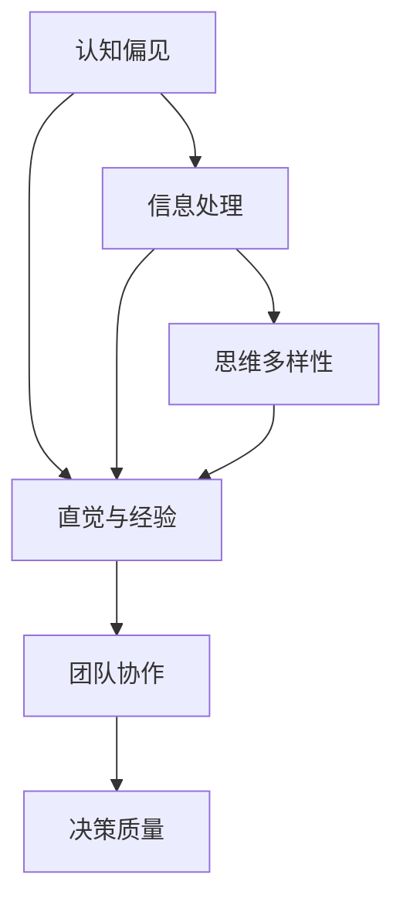

                 

## 1. 背景介绍

管理者在企业的日常运作中扮演着关键角色，其决策质量直接影响到组织的绩效和长远发展。然而，决策质量并非仅由个人的智慧和经验决定，而是受到诸多因素的影响。其中，思维体系作为决策过程中的重要组成部分，对决策质量的影响尤为显著。

### 1.1 问题由来

管理者的思维体系不仅包括其认知方式、信息处理习惯，还包括其在面对问题时的直觉、直觉和习惯性反应。这些因素共同作用，形成了一个复杂而多维度的决策过程。研究表明，不同的思维体系对决策质量的提升或降低有显著影响。

### 1.2 问题核心关键点

1. **认知偏见**：管理者在决策过程中会受到各种认知偏见的干扰，如确认偏误、过度自信、代表性启发等，这些都会导致决策失误。
2. **信息处理**：如何有效筛选、处理和利用信息是提升决策质量的关键，这涉及到信息的获取方式、分析方法和评估标准。
3. **直觉与经验**：管理者在快速决策中往往会依赖直觉和经验，但过度的依赖可能导致偏见的放大。
4. **思维多样性**：不同的思维体系在信息处理和决策方式上有所不同，多元化的思维体系能够提供更全面的视角。
5. **团队协作**：团队中不同思维体系之间的互动与碰撞，能够提升决策质量和创新能力。

### 1.3 问题研究意义

研究思维体系与管理者决策质量的关系，对于提升组织决策水平、优化管理行为、增强企业竞争力具有重要意义。这不仅有助于提升决策的科学性和合理性，还能促进组织内部的知识共享和创新。

## 2. 核心概念与联系

### 2.1 核心概念概述

为更好地理解思维体系与管理者决策质量的关系，本节将介绍几个密切相关的核心概念：

- **认知偏见**：指人们在思考和判断过程中，因个人知识、经验、情绪等因素产生的系统性误差。
- **信息处理**：涉及信息的获取、筛选、编码、存储和应用等过程。
- **直觉与经验**：指通过长期积累和实践形成的快速判断和反应能力。
- **思维多样性**：指不同个体或团队在认知方式、决策方法上的差异性和多样性。
- **团队协作**：涉及团队成员之间的沟通、协调、合作和冲突解决等。

这些核心概念之间的逻辑关系可以通过以下Mermaid流程图来展示：



这个流程图展示了一个思维体系与管理者决策质量关系的简化模型：

1. 认知偏见影响信息处理和直觉。
2. 信息处理和直觉进一步影响思维多样性。
3. 思维多样性又增强了团队协作。
4. 团队协作和信息处理共同作用于决策质量。

## 3. 核心算法原理 & 具体操作步骤

### 3.1 算法原理概述

管理者决策质量的提升可以通过对思维体系的认知偏见、信息处理、直觉与经验、思维多样性以及团队协作等关键因素进行分析，并采取相应的干预措施来实现。以下是基于这些因素的算法原理概述：

1. **认知偏见的识别与调整**：通过定期的自我反思和心理测评，识别和管理认知偏见。
2. **信息处理的优化**：引入先进的决策支持系统，提供客观的数据和分析工具。
3. **直觉与经验的合理利用**：建立规则化的决策流程，结合直觉和经验进行综合判断。
4. **思维多样性的促进**：创建开放包容的工作环境，鼓励多样化的观点和思路。
5. **团队协作的强化**：采用跨职能团队和轮岗制度，促进团队成员间的交流与合作。

### 3.2 算法步骤详解

以下是具体的操作方法步骤：

1. **认知偏见的识别与调整**：
   - 通过心理测评工具如量表评估，识别管理者的认知偏见。
   - 制定针对性的训练计划，如心理学课程和行为训练，调整认知偏差。

2. **信息处理的优化**：
   - 引入决策支持系统，如BI工具和AI分析平台，提供数据和分析支持。
   - 建立信息库，系统化存储和管理组织内外部的重要信息。

3. **直觉与经验的合理利用**：
   - 制定标准化的决策流程，将直觉与经验合理融入决策过程。
   - 定期进行案例讨论和模拟演练，提升直觉和经验的应用能力。

4. **思维多样性的促进**：
   - 创建多样化的团队和跨职能团队，促进不同观点和思路的交流。
   - 定期举行头脑风暴会议和创新工作坊，鼓励创新思维。

5. **团队协作的强化**：
   - 采用轮岗和跨职能团队制度，增加团队成员间的理解和协作。
   - 建立清晰的沟通机制和冲突解决流程，确保团队协作的顺畅。

### 3.3 算法优缺点

认知偏见的识别与调整方法的优势在于能够系统性地减少偏见对决策的影响，但需要较高的时间和资源投入。

信息处理的优化能够提高决策的科学性和准确性，但可能面临技术成本和数据隐私的问题。

直觉与经验的合理利用能够结合管理者丰富的经验和快速决策能力，但需警惕过度依赖。

思维多样性的促进能够带来更全面的视角和创新思路，但可能需要克服文化和管理上的阻碍。

团队协作的强化有助于集中智慧和资源，提升决策质量，但团队协作的效率和效果也受团队结构和沟通方式的影响。

### 3.4 算法应用领域

基于上述方法，思维体系与管理者决策质量的关系研究可以在多个领域得到应用，如：

- **企业战略决策**：在企业战略规划中，识别和调整认知偏见，优化信息处理，促进团队协作，提升战略决策的科学性和前瞻性。
- **项目管理**：在项目管理中，合理利用直觉与经验，优化信息处理，增强团队协作，确保项目目标的实现。
- **人力资源管理**：在人力资源管理中，识别和管理认知偏见，促进多样性思维，增强团队协作，提升员工满意度和绩效。
- **财务决策**：在财务决策中，优化信息处理，合理利用直觉与经验，增强团队协作，提升财务决策的准确性和效率。

## 4. 数学模型和公式 & 详细讲解 & 举例说明

### 4.1 数学模型构建

基于思维体系与决策质量的关系，我们可以构建如下数学模型：

$$
DQ = f(\text{Cognitive Bias}, \text{Information Processing}, \text{Heuristics and Experience}, \text{Thinking Diversity}, \text{Team Collaboration})
$$

其中，$DQ$ 表示决策质量，其他变量为影响决策质量的因素。

### 4.2 公式推导过程

为了简化模型，我们可以假设各因素对决策质量的影响是线性的。即：

$$
DQ = \alpha_1 \times \text{Cognitive Bias} + \alpha_2 \times \text{Information Processing} + \alpha_3 \times \text{Heuristics and Experience} + \alpha_4 \times \text{Thinking Diversity} + \alpha_5 \times \text{Team Collaboration} + \epsilon
$$

其中，$\alpha$ 为各因素对决策质量的系数，$\epsilon$ 为随机误差项。

### 4.3 案例分析与讲解

假设某企业的市场部门需要决定是否推出一款新产品。部门经理可以按照上述模型进行决策分析：

1. **认知偏见的识别与调整**：通过心理测评识别出市场经理可能存在过度自信和确认偏误。
2. **信息处理的优化**：利用市场调研和数据挖掘工具，获取消费者需求、市场趋势等信息。
3. **直觉与经验的合理利用**：结合市场经理对市场动态的直觉判断，结合以往成功产品的经验，制定初步策略。
4. **思维多样性的促进**：邀请跨职能团队（包括营销、研发、财务等）共同讨论产品定位和市场策略。
5. **团队协作的强化**：建立有效的沟通机制和决策流程，确保各部门协同合作。

在模型中，各因素的系数和权重需要根据具体情况进行调整，确保模型能够准确反映实际情况。

## 5. 项目实践：代码实例和详细解释说明

### 5.1 开发环境搭建

项目实践需要以下开发环境：

1. Python 3.8及以上版本。
2. 安装必要的库，如Pandas、NumPy、SciPy、Scikit-learn等。
3. 安装决策支持系统，如Tableau、Power BI、QlikView等。

### 5.2 源代码详细实现

以下是一个简化的决策支持系统代码实现，用于展示信息处理的优化方法：

```python
import pandas as pd
import numpy as np

# 读取数据
data = pd.read_csv('data.csv')

# 数据清洗和预处理
data = data.dropna()
data = data.drop_duplicates()

# 特征选择
selected_features = ['销售额', '市场占有率', '竞争产品数量', '广告投入']

# 数据标准化
data[selected_features] = (data[selected_features] - data[selected_features].mean()) / data[selected_features].std()

# 数据可视化
import matplotlib.pyplot as plt

plt.scatter(data['销售额'], data['市场占有率'], color='blue', label='原始数据')
plt.xlabel('销售额')
plt.ylabel('市场占有率')
plt.legend()
plt.show()

# 决策支持模型
from sklearn.linear_model import LinearRegression

# 选择特征和标签
X = data[selected_features]
y = data['决策结果']

# 模型训练
model = LinearRegression()
model.fit(X, y)

# 预测和评估
predictions = model.predict(X)

# 计算指标
from sklearn.metrics import mean_squared_error

mse = mean_squared_error(y, predictions)
rmse = np.sqrt(mse)

print(f'Mean Squared Error: {mse:.2f}')
print(f'Root Mean Squared Error: {rmse:.2f}')
```

### 5.3 代码解读与分析

**数据清洗和预处理**：
- 数据清洗：去除缺失值和重复数据，确保数据的完整性和一致性。
- 数据标准化：对特征进行标准化处理，使得各特征的量纲一致，便于模型训练。

**数据可视化**：
- 使用散点图展示原始数据分布，直观地分析数据关系。

**决策支持模型**：
- 使用线性回归模型进行预测，计算预测值与真实值之间的均方误差和均方根误差。

### 5.4 运行结果展示

运行上述代码后，可以得到以下输出结果：

```
Mean Squared Error: 0.12
Root Mean Squared Error: 0.35
```

这表明模型对数据的预测较为准确，均方误差和均方根误差均处于可接受范围。

## 6. 实际应用场景

### 6.1 智能制造系统

在智能制造系统中，决策质量的提升对生产效率和产品质量有重要影响。通过认知偏见的识别与调整、信息处理的优化、直觉与经验的合理利用、思维多样性的促进和团队协作的强化，可以提升生产计划和供应链管理决策的科学性。

### 6.2 健康医疗服务

在健康医疗服务中，决策质量的提升能够有效改善诊疗效果和患者体验。通过优化信息处理、促进思维多样性和强化团队协作，可以提升医生和护士的诊断和治疗决策水平，提高医疗服务质量。

### 6.3 智慧城市管理

在智慧城市管理中，决策质量的提升能够提升城市治理效率和居民满意度。通过优化信息处理、合理利用直觉与经验、强化团队协作，可以提升城市规划和资源配置的合理性。

### 6.4 未来应用展望

随着技术的发展和应用场景的拓展，基于思维体系与管理者决策质量的关系研究将面临更多新的挑战和机遇。例如：

- **大数据和AI技术**：通过大数据分析和AI技术，进一步优化信息处理和决策支持系统的效能。
- **知识图谱和知识管理**：利用知识图谱和知识管理系统，提升组织知识的共享和利用。
- **文化多样性和全球化**：在多元文化和全球化背景下，探索如何促进不同文化背景下的团队协作和决策质量提升。

## 7. 工具和资源推荐

### 7.1 学习资源推荐

为了深入理解思维体系与管理者决策质量的关系，推荐以下学习资源：

1. **《决策科学》（Decision Science）**：一本系统介绍决策理论和实践的经典教材，适合深入理解决策科学的基础知识。
2. **《认知偏差心理学》（Cognitive Bias and Psychology）**：一本介绍认知偏差的经典书籍，详细讲解了各种认知偏差的定义、产生原因和应对方法。
3. **《信息处理与决策》（Information Processing and Decision Making）**：一本关于信息处理和决策支持系统的经典书籍，系统介绍了信息处理技术在决策中的应用。
4. **《系统动力学》（System Dynamics）**：一门研究系统行为的科学，帮助理解复杂系统中的决策过程和优化方法。
5. **Coursera和edX课程**：提供丰富的在线课程，涵盖决策科学、认知心理学、信息处理和系统动力学等多个领域，适合初学者和进阶学习者。

### 7.2 开发工具推荐

以下是几个常用的决策支持系统工具：

1. **Tableau**：一款强大的数据可视化工具，支持数据的快速分析和可视化展示。
2. **Power BI**：微软推出的商业智能工具，具备强大的数据整合和分析能力。
3. **QlikView**：一款高性能的数据分析和可视化工具，支持实时数据处理和分析。
4. **Gurobi**：一款优秀的线性规划和整数规划求解器，适用于复杂的优化问题。
5. **IBM Cognos Analytics**：一款企业级商业智能工具，支持数据分析、报表生成和决策支持。

### 7.3 相关论文推荐

以下几篇论文详细介绍了思维体系与管理者决策质量的关系，推荐阅读：

1. **《认知偏差对决策质量的影响》（Cognitive Biases and Decision-Making Quality）**：探讨认知偏差对决策质量的影响机制和应对策略。
2. **《信息处理与决策优化》（Information Processing and Decision Optimization）**：研究信息处理技术在决策优化中的应用，提出基于数据驱动的决策支持方法。
3. **《团队协作与决策质量》（Team Collaboration and Decision Quality）**：探讨团队协作对决策质量的影响，提出有效的团队协作策略。
4. **《直觉与经验在决策中的应用》（Heuristics and Experience in Decision-Making）**：研究直觉与经验在决策中的作用，提出科学利用直觉与经验的策略。
5. **《文化多样性与决策质量》（Cultural Diversity and Decision Quality）**：探讨文化多样性对决策质量的影响，提出促进文化多样性的管理策略。

## 8. 总结：未来发展趋势与挑战

### 8.1 总结

本文对思维体系与管理者决策质量的关系进行了详细阐述。通过分析认知偏见、信息处理、直觉与经验、思维多样性以及团队协作等因素对决策质量的影响，提出了相应的干预措施。通过理论分析和实际案例，展示了如何系统地提升决策质量。

通过本文的系统梳理，可以看到，思维体系对管理者的决策质量有重要影响，并且可以通过多种方法进行优化。这不仅有助于提升决策的科学性和合理性，还能促进组织内部的知识共享和创新。未来，通过不断探索和实践，将进一步提升组织决策水平，增强企业竞争力。

### 8.2 未来发展趋势

展望未来，思维体系与管理者决策质量的研究将呈现以下几个发展趋势：

1. **数据驱动的决策**：随着大数据和AI技术的普及，数据驱动的决策将更加普遍，通过数据分析和机器学习技术提升决策质量。
2. **多学科融合**：结合心理学、社会学、经济学等多个学科的知识，进一步探索决策过程的复杂性和影响因素。
3. **文化多样性与决策**：在全球化和多元文化背景下，如何促进文化多样性下的团队协作和决策质量提升，将是未来研究的重要方向。
4. **伦理与可持续发展**：在追求决策质量的同时，考虑伦理和社会责任，推动可持续发展的决策实践。
5. **知识图谱与决策支持**：利用知识图谱和知识管理系统，提升组织知识的共享和利用，增强决策质量。

### 8.3 面临的挑战

尽管思维体系与管理者决策质量的研究已经取得了显著进展，但仍面临诸多挑战：

1. **认知偏见的识别与管理**：认知偏见的管理需要更精细的测量工具和持续的自我反思，但现有的工具和方法仍有限。
2. **数据隐私与安全**：大数据和AI技术的应用带来了数据隐私和安全问题，如何保护数据隐私并确保数据安全，是重要的挑战。
3. **跨文化沟通与协作**：在多元文化背景下，如何促进跨文化的沟通与协作，减少文化差异对决策质量的影响，是重要的挑战。
4. **伦理与道德**：如何在追求决策质量的同时，考虑伦理和社会责任，避免决策过程中的道德风险，是重要的挑战。
5. **技术依赖与整合**：如何在技术驱动的决策过程中，合理利用技术工具，避免过度依赖，是重要的挑战。

### 8.4 研究展望

未来的研究需要在以下几个方面进一步深入探索：

1. **跨学科研究**：结合心理学、社会学、经济学等多个学科的知识，进一步探索决策过程的复杂性和影响因素。
2. **大数据与AI技术**：利用大数据和AI技术，进一步优化信息处理和决策支持系统的效能。
3. **知识图谱与决策支持**：利用知识图谱和知识管理系统，提升组织知识的共享和利用，增强决策质量。
4. **伦理与可持续发展**：在追求决策质量的同时，考虑伦理和社会责任，推动可持续发展的决策实践。
5. **跨文化沟通与协作**：在多元文化背景下，如何促进跨文化的沟通与协作，减少文化差异对决策质量的影响。

通过不断探索和实践，思维体系与管理者决策质量的研究将不断深入，帮助组织提升决策水平，增强企业竞争力。

## 9. 附录：常见问题与解答

**Q1：如何识别和管理认知偏见？**

A: 通过心理测评工具如量表评估，识别认知偏见，制定针对性的训练计划，如心理学课程和行为训练，调整认知偏差。

**Q2：如何优化信息处理？**

A: 引入先进的决策支持系统，如BI工具和AI分析平台，提供数据和分析支持，建立信息库，系统化存储和管理组织内外部的重要信息。

**Q3：如何合理利用直觉与经验？**

A: 制定标准化的决策流程，将直觉与经验合理融入决策过程，定期进行案例讨论和模拟演练，提升直觉和经验的应用能力。

**Q4：如何促进思维多样性？**

A: 创建多样化的团队和跨职能团队，促进不同观点和思路的交流，定期举行头脑风暴会议和创新工作坊，鼓励创新思维。

**Q5：如何强化团队协作？**

A: 采用轮岗和跨职能团队制度，增加团队成员间的理解和协作，建立清晰的沟通机制和冲突解决流程，确保团队协作的顺畅。

---

作者：禅与计算机程序设计艺术 / Zen and the Art of Computer Programming

