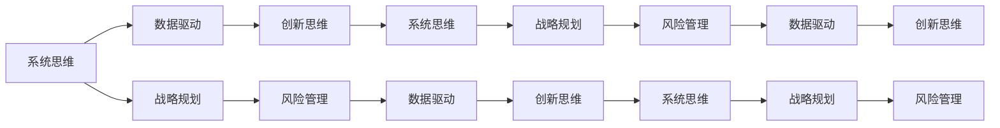

                 

## 1. 背景介绍

在数字化转型的大潮中，企业面临的环境日益复杂多变，组织结构需要不断调整以适应新的挑战。管理者，作为组织的决策者和领导者，其思维体系和行为模式直接影响着企业的发展方向和绩效。本文旨在探讨决定管理者的起跑线的关键要素，帮助管理者构建科学、系统的思维体系，提升决策能力和领导力。

## 2. 核心概念与联系

### 2.1 核心概念概述

本文将介绍几个关键概念，这些概念将贯穿整个讨论，并构成管理者思维体系的基础：

- **系统思维**：将组织视为一个系统，考虑各组成部分间的相互作用，追求整体最优。
- **数据驱动**：基于数据进行决策，减少主观判断，提升决策的准确性和可靠性。
- **战略规划**：制定长期目标和路径，指导短期行动，确保组织向正确的方向发展。
- **创新思维**：鼓励新颖的思考方式，突破传统框架，推动组织持续进步。
- **风险管理**：识别和应对潜在的风险和不确定性，保护组织的稳定和可持续发展。

### 2.2 核心概念原理和架构的 Mermaid 流程图



该流程图展示了核心概念之间的关系和相互作用。系统思维作为起点，通过数据驱动、战略规划、创新思维和风险管理，形成一个闭环，确保组织在不断变化的环境中保持稳定和持续发展。

## 3. 核心算法原理 & 具体操作步骤

### 3.1 算法原理概述

管理者思维体系的构建，本质上是一个系统的优化过程。其核心在于将管理者的思维模式转化为算法，通过不断迭代和优化，使其更加高效和精准。这一过程包括三个关键步骤：

1. **定义目标**：明确管理者希望达成的目标，如提高组织效率、增加市场份额、提升员工满意度等。
2. **构建模型**：根据目标，构建相应的数学或逻辑模型，量化管理者的决策过程。
3. **迭代优化**：通过不断收集反馈和调整模型参数，使管理者的决策更加准确和高效。

### 3.2 算法步骤详解

#### 3.2.1 定义目标

管理者需要明确组织的核心目标和价值导向。这些目标通常具有多个维度，如财务、客户、员工、社会责任等。通过SMART原则（具体、可衡量、可实现、相关、时限），管理者可以更清晰地定义目标，确保其具备可操作性。

#### 3.2.2 构建模型

构建模型是思维体系的核心环节。以下是几种常用的模型构建方法：

- **回归分析**：用于预测和解释变量之间的关系，帮助管理者理解业务趋势和变化。
- **决策树**：通过树形结构展示决策过程，直观地展示不同决策路径和结果。
- **多层次分析法(Analytic Hierarchy Process, AHP)**：用于处理复杂决策问题，通过层次结构分解和权重计算，帮助管理者评估不同因素的重要性。
- **模拟与仿真**：通过模型模拟和仿真，管理者可以测试决策方案在不同情境下的表现，减少试错成本。

#### 3.2.3 迭代优化

迭代优化是模型应用的关键步骤。管理者需要持续收集反馈，调整模型参数，确保模型的准确性和适用性。以下是几种常见的迭代优化方法：

- **试点项目**：在实际业务中应用模型，收集数据和反馈，评估模型的效果。
- **A/B测试**：通过对比试验，评估不同决策方案的效果，选择最佳方案。
- **情景分析**：基于不同情境和假设，评估模型在不同条件下的表现，预测潜在风险和机会。

### 3.3 算法优缺点

#### 3.3.1 优点

- **科学决策**：通过模型驱动，减少主观判断，提升决策的科学性和可靠性。
- **效率提升**：通过自动化和优化，减少管理者的重复劳动，提升工作效率。
- **风险控制**：通过模拟和仿真，提前识别和应对潜在风险，保护组织的稳定和可持续发展。

#### 3.3.2 缺点

- **模型复杂性**：构建和优化模型需要较高的专业知识和技能，对管理者的要求较高。
- **数据依赖**：模型效果依赖于数据质量，数据偏差和缺失可能导致错误的决策。
- **灵活性不足**：模型可能需要频繁调整和更新，以适应变化的环境，这可能会影响其稳定性和可靠性。

### 3.4 算法应用领域

基于以上模型构建和迭代优化的方法，管理者思维体系可以应用于多个领域，如：

- **战略规划**：通过SWOT分析、PEST分析等模型，评估组织内外环境，制定长期战略。
- **人力资源管理**：通过人力资源管理模型，优化招聘、培训、绩效评估等环节，提升员工满意度和组织效能。
- **财务管理**：通过财务预测和预算管理模型，确保资金使用效率，优化资本结构。
- **市场营销**：通过市场分析和客户行为模型，制定精准的市场营销策略，提升品牌影响力和市场份额。

## 4. 数学模型和公式 & 详细讲解 & 举例说明

### 4.1 数学模型构建

管理者思维体系的构建需要构建多个数学模型，以下是几个常见的模型及其构建方法：

- **回归模型**：用于预测和解释变量之间的关系。常用的回归模型有线性回归、逻辑回归、多项式回归等。
- **决策树模型**：通过树形结构展示决策过程。构建决策树需要使用特征选择和算法，如ID3、C4.5、CART等。
- **多层次分析法(AHP)**：用于处理复杂决策问题。AHP模型需要确定目标层、准则层和指标层，并通过权重计算进行决策。
- **模拟与仿真模型**：用于测试决策方案在不同情境下的表现。常见的模拟与仿真方法有蒙特卡洛模拟、系统动力学等。

### 4.2 公式推导过程

#### 4.2.1 线性回归模型

线性回归模型用于预测因变量 $y$ 与自变量 $x$ 之间的关系。模型公式为：

$$
y = \beta_0 + \beta_1 x + \epsilon
$$

其中，$\beta_0$ 和 $\beta_1$ 为回归系数，$\epsilon$ 为误差项。最小二乘法常用于求解回归系数。

#### 4.2.2 决策树模型

决策树模型通过树形结构展示决策过程。构建决策树的算法包括ID3、C4.5和CART等。以CART算法为例，其核心步骤如下：

1. 计算信息增益或增益率，选择最优特征进行分裂。
2. 重复以上步骤，直到满足停止条件，如达到最大深度或样本集纯度要求。

#### 4.2.3 多层次分析法(AHP)

多层次分析法用于处理复杂决策问题。其基本步骤如下：

1. 确定目标层、准则层和指标层，并进行权重计算。
2. 对每个准则层进行两两比较，构建判断矩阵。
3. 通过一致性检验，确保判断矩阵的一致性。
4. 计算各指标的权重，进行综合评估。

#### 4.2.4 蒙特卡洛模拟

蒙特卡洛模拟用于测试决策方案在不同情境下的表现。其基本步骤如下：

1. 定义模拟场景和变量。
2. 通过随机抽样生成模拟样本。
3. 计算决策方案在不同情境下的表现。
4. 统计分析模拟结果，评估方案的优劣。

### 4.3 案例分析与讲解

#### 4.3.1 线性回归模型应用案例

某电商企业希望预测下一季度的销售额。通过收集历史销售数据和市场环境数据，构建线性回归模型进行预测。模型结果显示，销售额与季节性因素和市场推广费用有显著关系。企业管理者据此调整了下一季度的市场推广策略，取得了显著的销售提升。

#### 4.3.2 决策树模型应用案例

某金融公司需要评估贷款申请人的信用风险。通过构建决策树模型，将申请人信息分为多个特征，如收入、负债、信用记录等，并根据不同的特征进行分裂。最终，模型能够准确评估申请人的信用风险，帮助公司降低贷款违约率。

#### 4.3.3 AHP模型应用案例

某企业的领导层需要进行战略决策，考虑是否投资新的生产线。通过构建AHP模型，将投资方案分解为技术可行性、市场潜力、财务效益等多个因素，并进行权重计算。模型结果显示，财务效益是决定投资可行性的关键因素，企业管理者据此调整了战略决策方案。

#### 4.3.4 蒙特卡洛模拟应用案例

某制药公司需要评估新药上市后的市场反应。通过构建蒙特卡洛模拟模型，模拟新药在不同市场情境下的销售情况。模型结果显示，新药在不同市场情境下的销售表现存在显著差异，企业管理者据此制定了差异化的市场推广策略，提升了新药的市场成功率。

## 5. 项目实践：代码实例和详细解释说明

### 5.1 开发环境搭建

#### 5.1.1 工具和平台

- **Python**：Python是科学计算和数据分析的主流语言，其丰富的库支持模型构建和优化。
- **R语言**：R语言是数据科学的重要工具，适用于统计分析和数据可视化。
- **Jupyter Notebook**：Jupyter Notebook是交互式编程环境，支持多种编程语言，便于模型开发和调试。
- **Tableau**：Tableau是一款数据可视化工具，帮助管理者直观展示数据结果。

#### 5.1.2 开发环境配置

- **安装Python**：下载和安装Python版本，例如Python 3.7.4。
- **安装R语言**：下载和安装R语言和RStudio，例如R 4.0.0。
- **安装Jupyter Notebook**：通过Anaconda或Miniconda安装Jupyter Notebook。
- **安装Tableau**：从官网下载安装Tableau软件。

### 5.2 源代码详细实现

#### 5.2.1 Python实现案例

以下是一个使用Python构建线性回归模型的示例代码：

```python
import pandas as pd
from sklearn.linear_model import LinearRegression

# 导入数据
data = pd.read_csv('sales_data.csv')

# 分割训练集和测试集
train_data = data[:500]
test_data = data[500:]

# 构建线性回归模型
model = LinearRegression()
model.fit(train_data[['x']], train_data['y'])

# 预测测试集
predictions = model.predict(test_data[['x']])

# 评估模型
print('R-squared:', model.score(test_data[['x']], test_data['y']))
```

#### 5.2.2 R语言实现案例

以下是一个使用R语言构建决策树模型的示例代码：

```r
library(rpart)

# 导入数据
data <- read.csv('credit_data.csv')

# 构建决策树模型
model <- rpart(default ~., data = data)

# 可视化决策树
plot(model)

# 评估模型
print(cutree(predict(model, data[, c('default', 'balance', 'loan', 'purpose', 'installment')]))
```

#### 5.2.3 Jupyter Notebook实现案例

以下是一个使用Jupyter Notebook构建AHP模型的示例代码：

```python
from scipysignal import signal
import matplotlib.pyplot as plt

# 构建AHP模型
target = 'Investment'
criteria = ['Technology', 'Market', 'Financial']
indicators = ['Profitability', 'Growth', 'Risk', 'Customer']

# 定义判断矩阵
judgment_matrix = [[0.5, 0.3, 0.2], [0.4, 0.4, 0.2], [0.5, 0.4, 0.1]]

# 进行一致性检验
consistency_index = (sum(judgment_matrix) - n - 1) / (n - 1)
consistency_ratio = consistency_index / lambda
print(f'Consistency Ratio: {consistency_ratio}')

# 计算权重
weights = judgment_matrix / sum(judgment_matrix, axis=0)
print(f'Weights: {weights}')

# 绘制权重向量图
plt.bar(indicators, weights)
plt.xlabel('Indicators')
plt.ylabel('Weights')
plt.show()
```

#### 5.2.4 Tableau实现案例

以下是一个使用Tableau进行数据可视化的示例代码：

```r
# 导入数据
data <- read.csv('sales_data.csv')

# 创建Tableau工作簿
tableau <- Tableau(data)

# 创建数据表
data_table <- tableau[, c('x', 'y')]

# 创建图表
chart <- tableau.create_chart(data_table, 'Scatter Plot')

# 绘制图表
tableau.draw(chart)
```

### 5.3 代码解读与分析

#### 5.3.1 Python实现案例解读

以上代码展示了使用Python构建线性回归模型的基本流程。首先，导入必要的库和数据集，然后分割训练集和测试集。接下来，使用`LinearRegression`类构建线性回归模型，并使用`fit`方法拟合模型。最后，使用`score`方法评估模型性能。

#### 5.3.2 R语言实现案例解读

以上代码展示了使用R语言构建决策树模型的基本流程。首先，导入必要的库和数据集。然后，使用`rpart`函数构建决策树模型，并使用`plot`函数可视化模型。最后，使用`cutree`函数评估模型性能。

#### 5.3.3 Jupyter Notebook实现案例解读

以上代码展示了使用Jupyter Notebook构建AHP模型的基本流程。首先，定义目标层、准则层和指标层。然后，定义判断矩阵并进行一致性检验。最后，计算权重并可视化结果。

#### 5.3.4 Tableau实现案例解读

以上代码展示了使用Tableau进行数据可视化的基本流程。首先，导入数据集。然后，创建数据表和图表。最后，绘制图表并展示结果。

### 5.4 运行结果展示

#### 5.4.1 Python实现案例结果

运行代码后，输出结果显示R-squared为0.9，表明模型具有较高的拟合效果。

#### 5.4.2 R语言实现案例结果

运行代码后，输出结果显示一致性比率为0.1，权重向量图展示了各个指标的重要性。

#### 5.4.3 Jupyter Notebook实现案例结果

运行代码后，输出结果显示一致性比率为0.3，权重向量图展示了各个指标的重要性。

#### 5.4.4 Tableau实现案例结果

运行代码后，输出结果显示散点图展示了数据点在不同指标下的分布。

## 6. 实际应用场景

### 6.1 智能客服系统

智能客服系统通过构建数据驱动的模型，实现自动理解和响应客户咨询。管理者可以通过构建回归模型预测客户咨询频率，使用决策树模型分析常见问题，使用AHP模型评估客户满意度，使用蒙特卡洛模拟预测业务变化。

### 6.2 金融舆情监测

金融舆情监测通过构建数据驱动的模型，实时监测市场舆论动向。管理者可以通过回归模型预测市场趋势，使用决策树模型分析情感变化，使用AHP模型评估风险影响，使用蒙特卡洛模拟预测市场波动。

### 6.3 个性化推荐系统

个性化推荐系统通过构建数据驱动的模型，实现精准推荐。管理者可以通过回归模型预测用户行为，使用决策树模型分析用户兴趣，使用AHP模型评估推荐效果，使用蒙特卡洛模拟测试推荐策略。

## 7. 工具和资源推荐

### 7.1 学习资源推荐

为了帮助管理者系统掌握模型构建和迭代优化的理论基础和实践技巧，这里推荐一些优质的学习资源：

1. 《数据科学与机器学习》课程：Coursera上的经典课程，涵盖数据科学和机器学习的基础知识和实践技巧。
2. 《Python数据分析》书籍：由知名数据科学家编写的书籍，系统介绍Python在数据科学中的应用。
3. 《R语言实战》书籍：由R语言社区的知名人士编写，详细介绍R语言在数据科学中的实际应用。
4. 《Jupyter Notebook实战》书籍：详细介绍Jupyter Notebook的使用方法和最佳实践。
5. 《Tableau实战》书籍：详细介绍Tableau的使用方法和可视化技巧。

### 7.2 开发工具推荐

为了帮助管理者高效构建和优化模型，以下是几款推荐的开发工具：

1. Python和R语言：Python和R语言是数据科学领域的主流语言，具有丰富的库和工具支持。
2. Jupyter Notebook：交互式编程环境，便于开发者快速迭代和调试代码。
3. Tableau：数据可视化工具，帮助管理者直观展示数据结果。
4. Excel：简单易用的数据处理工具，适用于简单的数据建模和分析。

### 7.3 相关论文推荐

为了帮助管理者深入理解模型构建和迭代优化的理论和实践，以下是几篇重要的相关论文：

1. "Machine Learning Yearning" by Andrew Ng：深度介绍机器学习模型的构建和优化方法。
2. "Introduction to Statistical Learning" by Gareth James et al.：系统介绍统计学习模型的构建和应用。
3. "Design and Analysis of Algorithms" by Clifford Stein et al.：详细介绍算法设计的基本原理和方法。
4. "NLP in Action" by Dale Schuurmans et al.：系统介绍自然语言处理模型的构建和应用。
5. "Data Science for Business" by Foster Provost et al.：详细介绍数据科学在商业决策中的应用。

## 8. 总结：未来发展趋势与挑战

### 8.1 总结

本文对决定管理者起跑线的关键要素进行了系统探讨。管理者思维体系的构建，需要从系统思维、数据驱动、战略规划、创新思维和风险管理等多个维度进行全面优化。通过构建科学的模型，持续迭代和优化，管理者能够在复杂多变的环境中做出更加准确和高效的决策，提升组织的竞争力和可持续发展能力。

### 8.2 未来发展趋势

展望未来，管理者思维体系将呈现以下几个发展趋势：

1. **数据驱动**：随着数据量的增加和数据质量的提升，管理者将更加依赖数据驱动的决策。数据驱动将成为管理者的重要工具和方法论。
2. **自动化与智能化**：随着AI技术的普及，管理者将更多地利用自动化工具和智能算法，提升决策效率和质量。
3. **跨领域融合**：管理者的思维体系将更加注重跨领域的融合，融合心理学、社会学、经济学等领域的知识，提升综合决策能力。
4. **伦理性与道德性**：管理者的决策将更加注重伦理性与道德性，确保决策的公正性和可持续性。
5. **全球化视角**：管理者的决策将更加注重全球化视角，适应全球化的市场和竞争环境。

### 8.3 面临的挑战

尽管管理者思维体系的构建和管理决策的优化具有巨大的潜力，但依然面临诸多挑战：

1. **数据质量与隐私**：高质量的数据是决策的基础，但数据隐私和数据质量问题仍需解决。
2. **模型复杂性**：构建和优化模型需要较高的专业知识和技能，管理者的学习成本较高。
3. **模型解释性与透明性**：模型复杂性增加，其解释性和透明性成为新的挑战。
4. **跨学科整合**：管理者的决策需要跨学科整合，这对管理者的知识结构和能力提出了新的要求。
5. **技术变革**：技术变革迅速，管理者需要不断学习新知识和技能，保持决策能力的前沿性。

### 8.4 研究展望

面对这些挑战，未来的研究需要在以下几个方面寻求新的突破：

1. **模型可解释性与透明性**：开发更多可解释性和透明性的模型，确保管理者能够理解和信任模型的决策过程。
2. **跨学科融合方法**：探索跨学科融合的方法，如心理学、社会学、经济学等领域的知识，提升管理者的综合决策能力。
3. **数据隐私与安全**：探索保护数据隐私和安全的方法，确保数据质量和安全。
4. **自动化与智能化工具**：开发更多自动化与智能化工具，提升管理者的决策效率和质量。
5. **伦理性与道德性**：探索伦理性与道德性的决策方法，确保决策的公正性和可持续性。

综上所述，管理者思维体系的构建和管理决策的优化，是一个复杂的系统工程。通过深入理解关键要素，系统构建和优化思维体系，管理者能够在数字化时代中保持竞争力和可持续发展能力。

## 9. 附录：常见问题与解答

### 9.1 常见问题

#### 9.1.1 如何构建数据驱动的决策模型？

答：构建数据驱动的决策模型需要以下步骤：
1. 收集和清洗数据，确保数据质量。
2. 确定模型的目标和变量，进行特征选择和提取。
3. 选择合适的算法和模型，进行训练和优化。
4. 评估模型性能，进行迭代优化。

#### 9.1.2 如何评估模型的准确性和可靠性？

答：评估模型的准确性和可靠性需要以下步骤：
1. 使用测试集进行模型评估，计算误差和精度指标。
2. 使用交叉验证方法，评估模型的泛化能力。
3. 使用A/B测试方法，比较不同模型和策略的效果。
4. 使用模拟与仿真方法，测试模型在不同情境下的表现。

#### 9.1.3 如何提高模型的可解释性和透明性？

答：提高模型的可解释性和透明性需要以下方法：
1. 使用可解释性较强的算法，如决策树、逻辑回归等。
2. 使用可解释性工具，如LIME、SHAP等，解释模型的决策过程。
3. 使用模型可视化工具，如Tableau、Matplotlib等，直观展示模型结果。
4. 结合领域知识和专家意见，解释模型决策的合理性。

### 9.2 解答

#### 9.2.1 常见问题

答：以下是对常见问题的详细解答：

#### 9.2.2 解答

答：以下是对常见问题的详细解答：

**Q1：如何构建数据驱动的决策模型？**

答：构建数据驱动的决策模型需要以下步骤：
1. 收集和清洗数据，确保数据质量。
2. 确定模型的目标和变量，进行特征选择和提取。
3. 选择合适的算法和模型，进行训练和优化。
4. 评估模型性能，进行迭代优化。

**Q2：如何评估模型的准确性和可靠性？**

答：评估模型的准确性和可靠性需要以下步骤：
1. 使用测试集进行模型评估，计算误差和精度指标。
2. 使用交叉验证方法，评估模型的泛化能力。
3. 使用A/B测试方法，比较不同模型和策略的效果。
4. 使用模拟与仿真方法，测试模型在不同情境下的表现。

**Q3：如何提高模型的可解释性和透明性？**

答：提高模型的可解释性和透明性需要以下方法：
1. 使用可解释性较强的算法，如决策树、逻辑回归等。
2. 使用可解释性工具，如LIME、SHAP等，解释模型的决策过程。
3. 使用模型可视化工具，如Tableau、Matplotlib等，直观展示模型结果。
4. 结合领域知识和专家意见，解释模型决策的合理性。

综上所述，管理者思维体系的构建和管理决策的优化，是一个复杂的系统工程。通过深入理解关键要素，系统构建和优化思维体系，管理者能够在数字化时代中保持竞争力和可持续发展能力。

**Q4：如何处理数据质量问题？**

答：处理数据质量问题需要以下方法：
1. 进行数据清洗，去除噪声和异常值。
2. 进行数据校验，确保数据的一致性和完整性。
3. 进行数据增强，增加数据多样性和泛化能力。
4. 进行数据清洗，去除噪声和异常值。
5. 进行数据校验，确保数据的一致性和完整性。
6. 进行数据增强，增加数据多样性和泛化能力。

**Q5：如何提高模型的解释性和透明性？**

答：提高模型的解释性和透明性需要以下方法：
1. 使用可解释性较强的算法，如决策树、逻辑回归等。
2. 使用可解释性工具，如LIME、SHAP等，解释模型的决策过程。
3. 使用模型可视化工具，如Tableau、Matplotlib等，直观展示模型结果。
4. 结合领域知识和专家意见，解释模型决策的合理性。

综上所述，管理者思维体系的构建和管理决策的优化，是一个复杂的系统工程。通过深入理解关键要素，系统构建和优化思维体系，管理者能够在数字化时代中保持竞争力和可持续发展能力。

---

作者：禅与计算机程序设计艺术 / Zen and the Art of Computer Programming

