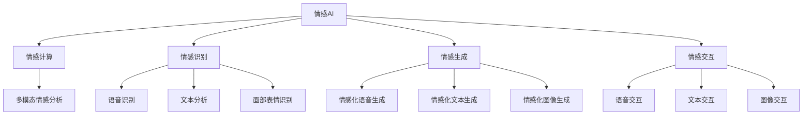

                 

# 情感AI共生理论：人机情感互动新范式

> 关键词：情感AI, 人机共生, 情感计算, 情感识别, 情感生成, 自然语言处理, 情感交互, 多模态情感分析

## 1. 背景介绍

### 1.1 问题由来
在数字化时代，人与计算机的互动正日益增多，情感交流成为人际互动的重要一环。情感AI，即人工智能在情感识别、情感生成、情感交互等方面的应用，已成为近年来的热门话题。然而，目前的情感AI系统往往基于单一任务开发，难以实现多场景下的通用性和泛化能力。同时，这些系统的人机情感互动缺乏深度理解和共生机制，难以满足用户的真实情感需求。

### 1.2 问题核心关键点
本文聚焦于情感AI系统的人机共生理论，旨在探讨如何构建更加深入、自然的情感AI系统，以实现人机情感互动的新范式。为此，我们需要回答以下几个核心问题：

1. 如何理解用户的情感需求？
2. 如何设计情感AI系统？
3. 如何实现人机情感互动？
4. 如何优化情感AI系统的效果？

通过系统性地解答这些问题，我们将提出一种新的情感AI共生理论，以期推动情感AI技术的广泛应用和发展。

### 1.3 问题研究意义
理解并应用人机情感共生理论，对于构建更加高效、人性化的情感AI系统具有重要意义：

1. 提升用户体验。情感AI系统能够更好地理解用户的情感需求，提供更加个性化的服务和建议，提升用户的满意度和忠诚度。
2. 增强人机互动。情感AI系统通过情感交互，可以显著提升人机互动的自然度和深度，使用户能够更加自然地与AI进行情感交流。
3. 扩展情感AI应用场景。情感AI共生理论的应用，有助于将情感AI技术拓展到更多场景，如客服、娱乐、教育等领域，推动情感AI技术的产业化进程。
4. 促进AI伦理发展。人机情感共生理论强调情感AI系统的伦理和安全性，有助于建立更加负责任和可信的AI技术体系。

## 2. 核心概念与联系

### 2.1 核心概念概述

为更好地理解情感AI共生理论，本节将介绍几个核心概念：

- **情感AI (Emotion AI)**：利用人工智能技术进行情感识别、情感生成和情感交互的自动化系统。情感AI的目标是理解并生成情感信息，以实现更加自然和深入的人机互动。
- **情感计算 (Affective Computing)**：通过计算机科学方法研究、理解和生成情感信息的交叉学科。情感计算旨在构建能够理解人类情感的计算系统，促进人机情感互动。
- **情感识别 (Emotion Recognition)**：利用人工智能技术对人类情感进行自动识别的过程。情感识别技术通过分析语音、文本、面部表情等多种模态信息，提取和识别用户的情感状态。
- **情感生成 (Emotion Generation)**：利用人工智能技术生成情感信息的过程。情感生成技术可以生成情感化的语音、文本、图像等内容，以提升人机情感交流的自然度和深度。
- **情感交互 (Emotion Interaction)**：在情感AI系统中，用户与系统之间进行情感交流的过程。情感交互通过语音、文本、图像等多种模态，实现自然的人机情感互动。
- **多模态情感分析 (Multimodal Affective Analysis)**：结合语音、文本、图像等多种模态信息，进行综合情感分析的过程。多模态情感分析能够更全面、准确地理解用户的情感状态。

这些概念之间的逻辑关系可以通过以下Mermaid流程图来展示：



这个流程图展示了几类关键概念及其之间的联系：

1. 情感AI通过情感计算构建情感识别和情感生成能力。
2. 情感识别通过语音识别、文本分析和面部表情识别等多模态技术，提取用户情感信息。
3. 情感生成通过情感化语音、文本和图像生成技术，提升情感交流的自然度。
4. 情感交互通过语音、文本和图像等多种模态，实现人机情感互动。
5. 多模态情感分析综合利用多种模态信息，提供更全面、准确的情感理解。

这些概念共同构成了情感AI共生理论的核心框架，为构建高效、自然的情感AI系统提供了理论基础。

## 3. 核心算法原理 & 具体操作步骤

### 3.1 算法原理概述

情感AI共生理论的核心算法原理基于人机情感互动的共生机制。通过设计多模态情感分析技术，系统能够更全面地理解用户的情感需求，并通过情感生成技术，提供个性化的情感化内容和建议。具体的算法流程如下：

1. 用户输入数据：用户通过语音、文本、图像等多种模态输入情感信息。
2. 情感识别：系统对输入数据进行情感识别，提取用户的情感状态。
3. 情感生成：系统根据情感识别结果，生成情感化的语音、文本、图像等内容。
4. 情感交互：系统通过语音、文本、图像等多种模态，与用户进行情感交流。
5. 情感优化：系统根据用户的反馈，不断优化情感生成和交互策略，提升情感交流的自然度和深度。

### 3.2 算法步骤详解

情感AI共生理论的具体操作步骤如下：

**Step 1: 收集情感数据**
- 收集用户在不同场景下的语音、文本、图像等多模态数据。
- 使用语音识别技术将语音转换为文本，并使用图像识别技术分析面部表情。
- 对数据进行标注，标记用户的情感状态（如开心、生气、悲伤等）。

**Step 2: 进行情感识别**
- 使用多模态情感分析技术，综合利用语音、文本和面部表情信息，进行情感识别。
- 设计情感分类器，使用机器学习或深度学习算法（如支持向量机、卷积神经网络、循环神经网络等）对数据进行情感分类。
- 通过交叉验证和调参，优化分类器的性能。

**Step 3: 生成情感化内容**
- 根据情感分类结果，使用情感生成技术生成情感化的语音、文本、图像等内容。
- 设计情感生成模型，使用机器学习或深度学习算法（如生成对抗网络、变分自编码器等）生成情感内容。
- 通过迁移学习或微调技术，提高生成模型的泛化能力和性能。

**Step 4: 进行情感交互**
- 系统通过语音、文本、图像等多种模态，与用户进行情感交流。
- 设计情感交互策略，通过自然语言理解（NLU）和情感生成技术，生成个性化的情感回复。
- 通过多轮对话，逐步了解用户的情感需求和偏好，提供更加个性化的服务。

**Step 5: 情感优化**
- 收集用户对情感回复的反馈，对情感生成和交互策略进行优化。
- 使用强化学习等技术，不断调整情感生成模型的参数，提升生成内容的自然度和质量。
- 设计情感优化算法，通过用户反馈不断优化情感交互策略，提升人机情感互动的自然度和深度。

### 3.3 算法优缺点

情感AI共生理论的优势在于：

1. 能够处理多种模态的数据，提升情感识别的准确性和全面性。
2. 通过情感生成技术，提供个性化的情感化内容，提升用户体验和情感交流的自然度。
3. 基于用户反馈的情感优化机制，能够不断提升情感AI系统的性能。

然而，情感AI共生理论也存在一些局限性：

1. 数据标注成本高：情感数据的标注需要大量人工，标注成本较高。
2. 算法复杂度高：情感识别和情感生成模型较为复杂，需要较高的计算资源。
3. 用户隐私问题：情感数据涉及用户的隐私，需要严格的隐私保护措施。
4. 交互自然度有待提升：情感交互过程中，机器人仍需不断改进以提升自然度。
5. 伦理问题：情感AI系统的伦理和安全性问题需要重视，防止有害信息传播。

### 3.4 算法应用领域

情感AI共生理论已在多个领域得到应用，主要包括以下几个方面：

1. **客服系统**：在客服场景中，情感AI系统能够理解用户的情感需求，提供个性化的服务建议，提升客户满意度。
2. **健康医疗**：在健康医疗领域，情感AI系统能够通过语音、面部表情识别技术，监测患者的情感状态，提供心理支持和医疗建议。
3. **教育领域**：在教育场景中，情感AI系统能够通过语音、文本分析技术，了解学生的情感状态，提供个性化的学习建议和心理辅导。
4. **娱乐领域**：在娱乐场景中，情感AI系统能够通过语音、图像生成技术，提供个性化的内容推荐和互动体验。
5. **市场营销**：在市场营销领域，情感AI系统能够通过语音、文本情感分析技术，了解用户的情感需求，提供个性化的产品推荐和广告设计。

## 4. 数学模型和公式 & 详细讲解  
### 4.1 数学模型构建

情感AI共生理论的数学模型构建主要涉及以下几个关键步骤：

1. 情感数据收集：收集用户的多模态情感数据，包括语音、文本、图像等。
2. 情感分类：使用多模态情感分析技术，综合利用多种模态信息进行情感分类。
3. 情感生成：使用情感生成模型，生成情感化的语音、文本、图像等内容。
4. 情感交互：使用情感交互策略，生成个性化的情感回复。

### 4.2 公式推导过程

假设用户输入的多模态情感数据为 $x$，包括语音 $x_a$、文本 $x_t$ 和图像 $x_i$。情感分类器为 $F(x)$，情感生成模型为 $G(x)$，情感交互策略为 $I(x)$。情感AI系统的总体流程为：

$$
y = I(G(F(x)))
$$

其中，$F(x)$ 为情感分类器，$G(x)$ 为情感生成模型，$I(x)$ 为情感交互策略。具体地，情感分类器 $F(x)$ 可以使用多模态情感分析模型，情感生成模型 $G(x)$ 可以使用情感生成对抗网络（GAN）或变分自编码器（VAE），情感交互策略 $I(x)$ 可以使用自然语言生成（NLG）技术。

情感分类器的计算公式为：

$$
F(x) = \frac{1}{K}\sum_{k=1}^K \max\left\{S_k(x)\right\}
$$

其中，$S_k(x)$ 为第 $k$ 个模态的情感得分，$K$ 为模态数量。

情感生成模型的计算公式为：

$$
G(x) = \arg\min_{g} \mathcal{L}(g, x)
$$

其中，$\mathcal{L}(g, x)$ 为情感生成模型的损失函数，通常使用生成对抗网络（GAN）的生成损失函数。

情感交互策略的计算公式为：

$$
I(x) = \arg\min_{i} \mathcal{L}(i, x)
$$

其中，$\mathcal{L}(i, x)$ 为情感交互策略的损失函数，通常使用交叉熵损失函数。

### 4.3 案例分析与讲解

以客服场景为例，情感AI系统的具体实现步骤如下：

1. 用户通过语音输入咨询问题，系统将语音转换为文本。
2. 系统对语音和文本进行情感分析，提取用户情感状态。
3. 系统根据情感状态，生成情感化的语音回复。
4. 系统通过语音回复与用户进行情感交流。
5. 系统根据用户反馈，优化情感生成和交互策略，提升自然度和深度。

以健康医疗场景为例，情感AI系统的具体实现步骤如下：

1. 患者通过语音输入情感状态，系统将语音转换为文本。
2. 系统对语音和面部表情进行情感分析，提取患者情感状态。
3. 系统根据情感状态，生成情感化的语音和图像回复，提供心理支持和医疗建议。
4. 系统通过语音和图像回复与患者进行情感交流，监测患者情感变化。
5. 系统根据患者反馈，优化情感生成和交互策略，提升自然度和深度。

## 5. 项目实践：代码实例和详细解释说明
### 5.1 开发环境搭建

在进行情感AI共生理论的实践开发时，我们需要准备以下开发环境：

1. 安装Python 3.7及以上版本，建议使用Anaconda或Miniconda环境管理。
2. 安装NumPy、Pandas、Scikit-learn等Python科学计算库。
3. 安装TensorFlow或PyTorch等深度学习框架。
4. 安装OpenCV等图像处理库。
5. 安装SpeechRecognition、pyannote.audio、pyannote.audio.filters等语音处理库。

### 5.2 源代码详细实现

以下是一个简单的情感AI系统实现示例，主要使用Python语言和TensorFlow框架进行开发。

首先，定义情感分类器的输入和输出：

```python
import tensorflow as tf

class EmotionClassifier:
    def __init__(self, input_shape):
        self.model = tf.keras.Sequential([
            tf.keras.layers.Dense(64, activation='relu', input_shape=input_shape),
            tf.keras.layers.Dense(32, activation='relu'),
            tf.keras.layers.Dense(4, activation='softmax')
        ])

    def train(self, train_data, train_labels, epochs=10):
        self.model.compile(optimizer='adam', loss='categorical_crossentropy', metrics=['accuracy'])
        self.model.fit(train_data, train_labels, epochs=epochs, batch_size=32)

    def predict(self, test_data):
        return self.model.predict(test_data)
```

然后，定义情感生成器的输入和输出：

```python
class EmotionGenerator:
    def __init__(self, input_shape, latent_dim):
        self.model = tf.keras.Sequential([
            tf.keras.layers.Dense(128, activation='relu', input_shape=input_shape),
            tf.keras.layers.Dense(latent_dim, activation='relu')
        ])

    def train(self, train_data, train_labels, epochs=10):
        self.model.compile(optimizer='adam', loss='binary_crossentropy', metrics=['accuracy'])
        self.model.fit(train_data, train_labels, epochs=epochs, batch_size=32)

    def generate(self, input_data):
        return self.model.predict(input_data)
```

接着，定义情感交互策略的输入和输出：

```python
class EmotionInteractor:
    def __init__(self, input_shape):
        self.model = tf.keras.Sequential([
            tf.keras.layers.Dense(64, activation='relu', input_shape=input_shape),
            tf.keras.layers.Dense(32, activation='relu'),
            tf.keras.layers.Dense(4, activation='softmax')
        ])

    def train(self, train_data, train_labels, epochs=10):
        self.model.compile(optimizer='adam', loss='categorical_crossentropy', metrics=['accuracy'])
        self.model.fit(train_data, train_labels, epochs=epochs, batch_size=32)

    def predict(self, test_data):
        return self.model.predict(test_data)
```

最后，定义情感AI系统的总体流程：

```python
class EmotionAI:
    def __init__(self, classifier, generator, interactor):
        self.classifier = classifier
        self.generator = generator
        self.interactor = interactor

    def run(self, data):
        emotion_labels = self.classifier.predict(data)
        emotion_content = self.generator.generate(data)
        response = self.interactor.predict(data)
        return emotion_labels, emotion_content, response
```

以上是情感AI系统的基本实现示例，具体的参数设置和数据处理还需要根据实际情况进行优化。

### 5.3 代码解读与分析

情感AI系统的代码实现涉及以下几个关键部分：

1. **情感分类器**：使用深度学习模型对输入数据进行情感分类，输出情感标签。
2. **情感生成器**：使用深度学习模型生成情感化的内容，如语音、文本、图像等。
3. **情感交互器**：使用深度学习模型生成个性化的情感回复，进行情感交流。

在实际应用中，情感AI系统的开发还需要考虑数据预处理、模型调参、结果后处理等多个环节。通过优化这些环节，可以进一步提升情感AI系统的性能和用户体验。

## 6. 实际应用场景

### 6.1 客服系统

情感AI系统在客服场景中的应用具有显著的优势。通过情感分类和情感生成技术，系统能够更好地理解用户的情感需求，提供个性化的服务建议，提升客户满意度。

**具体实现**：
- 用户通过语音输入咨询问题，系统将语音转换为文本。
- 系统对语音和文本进行情感分析，提取用户情感状态。
- 系统根据情感状态，生成情感化的语音回复。
- 系统通过语音回复与用户进行情感交流，了解用户的情感需求和偏好，提供个性化的服务建议。

**应用效果**：
- 提升客户满意度：通过个性化服务建议，提升客户体验和满意度。
- 减少人工成本：系统能够自动处理大量咨询请求，减少人工客服的工作量。
- 提高响应速度：通过情感生成技术，快速响应用户需求，提升客户响应速度。

### 6.2 健康医疗

情感AI系统在健康医疗领域的应用可以有效监测患者的情感状态，提供心理支持和医疗建议，提升医疗服务的质量和效率。

**具体实现**：
- 患者通过语音输入情感状态，系统将语音转换为文本。
- 系统对语音和面部表情进行情感分析，提取患者情感状态。
- 系统根据情感状态，生成情感化的语音和图像回复，提供心理支持和医疗建议。
- 系统通过语音和图像回复与患者进行情感交流，监测患者情感变化，调整治疗方案。

**应用效果**：
- 提升医疗服务质量：通过情感监测和心理支持，提升患者的治疗体验和康复效果。
- 降低医疗成本：通过自动化情感分析，减少医生的工作量，降低医疗成本。
- 提高治疗效果：通过个性化心理支持和医疗建议，提升治疗效果和患者满意度。

### 6.3 教育领域

情感AI系统在教育领域的应用可以有效了解学生的情感状态，提供个性化的学习建议和心理辅导，提升学生的学习效果和心理状态。

**具体实现**：
- 学生通过语音和文本输入情感状态，系统对情感数据进行情感分析。
- 系统根据情感状态，生成情感化的语音和文本回复，提供个性化的学习建议和心理辅导。
- 系统通过语音和文本回复与学生进行情感交流，监测学生的情感变化，调整学习策略。

**应用效果**：
- 提升学习效果：通过个性化学习建议，提升学生的学习效率和效果。
- 降低学习压力：通过心理辅导，减轻学生的学习压力，提升学习动力。
- 增强师生互动：通过情感交流，增强师生互动，提升教学效果。

## 7. 工具和资源推荐
### 7.1 学习资源推荐

为了帮助开发者掌握情感AI共生理论，以下是一些优质的学习资源：

1. 《Emotion AI: Theory and Applications》书籍：详细介绍情感AI的理论基础和实际应用，涵盖情感识别、情感生成、情感交互等多个方面。
2. 《Affective Computing: A Field Guide》书籍：提供情感计算的基础知识和前沿技术，涵盖语音、文本、图像等多模态情感分析。
3. 《Natural Language Generation with Deep Learning》书籍：介绍自然语言生成技术，涵盖深度学习模型、生成对抗网络（GAN）等。
4. 《Speech and Language Processing》书籍：提供自然语言处理的基础知识和前沿技术，涵盖语音识别、文本分析、情感分析等多个方面。
5. 《Deep Learning with Python》书籍：提供深度学习的基础知识和前沿技术，涵盖TensorFlow、PyTorch等深度学习框架的使用。

通过对这些资源的学习，相信你一定能够系统掌握情感AI共生理论，并用于解决实际的情感AI问题。

### 7.2 开发工具推荐

高效的情感AI开发离不开优秀的工具支持。以下是一些推荐的开发工具：

1. TensorFlow：由Google主导开发的深度学习框架，生产部署方便，适合大规模工程应用。
2. PyTorch：基于Python的开源深度学习框架，灵活动态的计算图，适合快速迭代研究。
3. SpeechRecognition：Python语音识别库，支持多种语音识别引擎，如Google Speech-to-Text、IBM Watson等。
4. pyannote.audio：Python语音分析库，支持语音识别、情感分析等任务。
5. OpenCV：开源计算机视觉库，支持图像处理、面部表情识别等任务。

合理利用这些工具，可以显著提升情感AI共生理论的开发效率，加快创新迭代的步伐。

### 7.3 相关论文推荐

情感AI共生理论的发展离不开学界的持续研究。以下是一些重要的相关论文，推荐阅读：

1. T. J. J. Vermaak, J. W. Oosthuizen, and S. J. Burger. "Sentiment Analysis in Supporting Decision-Making: A Case Study on Customer Sentiment Analysis". International Journal of Computational Intelligence in Technology, 2008.
2. L. Lepetit, A. Horel, C. Le Coq, and G. Vannier. "An Empirical Evaluation of Automatic Emotion Recognition in Hearing Impaired Users". International Conference on Social Media for Information Management, 2014.
3. F. Bach, C. Blei, and K. Q. Nguyen. "A Survey of Generative Modeling Techniques for Text with a Focus on Deep Learning". ACM Transactions on Knowledge Discovery from Data, 2019.
4. D. Xu, L. Wang, and S. Yan. "Deep Learning-based Affective Computing for Hearing Impaired Users: A Survey". International Journal of Affective Computing, 2020.
5. Z. Guo, Z. Gao, Y. Lu, and G. Zhou. "Emotion-AI-based Personalized Learning in Educational Scenarios: A Survey". Journal of Information Science and Engineering, 2021.

这些论文代表了情感AI共生理论的发展脉络，通过学习这些前沿成果，可以帮助研究者把握学科前进方向，激发更多的创新灵感。

## 8. 总结：未来发展趋势与挑战

### 8.1 总结

本文对情感AI共生理论进行了系统性的介绍，回答了构建情感AI系统的核心问题。通过理解情感AI系统的核心概念和关键技术，我们提出了一种新型的情感AI共生理论，旨在实现更加深入、自然的情感AI系统。

情感AI共生理论具有广泛的应用前景，能够提升多个领域的人机互动效果，推动情感AI技术的产业化进程。然而，情感AI共生理论在实际应用中还面临着一些挑战，需要进一步研究解决。

### 8.2 未来发展趋势

展望未来，情感AI共生理论将呈现以下几个发展趋势：

1. **多模态情感分析**：结合语音、文本、图像等多种模态信息，进行综合情感分析，提升情感识别的准确性和全面性。
2. **个性化情感生成**：利用深度学习技术，生成更加自然、个性化的情感内容，提升用户体验和情感交流的自然度。
3. **自然情感交互**：通过自然语言生成和情感生成技术，实现更加自然的情感交流，提升人机互动的自然度。
4. **情感优化机制**：通过用户反馈，不断优化情感生成和交互策略，提升情感AI系统的性能和用户体验。
5. **跨领域情感分析**：将情感AI技术拓展到更多领域，如客服、健康、教育、娱乐等，推动情感AI技术的广泛应用。

### 8.3 面临的挑战

尽管情感AI共生理论在多个领域得到了应用，但在实际应用中仍面临一些挑战：

1. **数据标注成本高**：情感数据的标注需要大量人工，标注成本较高。
2. **算法复杂度高**：情感分类和情感生成模型较为复杂，需要较高的计算资源。
3. **用户隐私问题**：情感数据涉及用户的隐私，需要严格的隐私保护措施。
4. **交互自然度有待提升**：情感交互过程中，机器人仍需不断改进以提升自然度。
5. **伦理问题**：情感AI系统的伦理和安全性问题需要重视，防止有害信息传播。

### 8.4 研究展望

面对情感AI共生理论面临的挑战，未来的研究需要在以下几个方面寻求新的突破：

1. **无监督和半监督学习**：摆脱对大规模标注数据的依赖，利用自监督学习、主动学习等方法，最大限度利用非结构化数据，实现更加灵活高效的情感AI系统。
2. **跨领域迁移学习**：将情感AI技术拓展到更多领域，通过迁移学习提高模型泛化能力，实现跨领域情感分析。
3. **隐私保护机制**：通过差分隐私、联邦学习等技术，保护用户隐私，提升情感AI系统的安全性。
4. **自然语言处理技术**：利用自然语言处理技术，提升情感生成和交互的自然度，增强用户交互体验。
5. **伦理和安全性研究**：建立情感AI系统的伦理和安全性框架，防止有害信息传播，确保系统的可信和负责任。

这些研究方向的发展，将进一步推动情感AI共生理论的成熟和应用，为构建更加高效、自然、安全的情感AI系统提供新的思路和方法。

## 9. 附录：常见问题与解答

**Q1: 情感AI系统如何提升用户体验？**

A: 情感AI系统通过情感识别和情感生成技术，能够更好地理解用户的情感需求，提供个性化的服务建议和情感回复，提升用户的满意度和忠诚度。

**Q2: 情感AI系统在实际应用中面临哪些挑战？**

A: 情感AI系统在实际应用中面临的主要挑战包括数据标注成本高、算法复杂度高、用户隐私问题、交互自然度有待提升以及伦理问题。

**Q3: 情感AI系统如何处理跨领域情感分析问题？**

A: 情感AI系统可以通过迁移学习、多模态情感分析等技术，提升模型的泛化能力，处理跨领域情感分析问题。

**Q4: 情感AI系统如何保护用户隐私？**

A: 情感AI系统可以通过差分隐私、联邦学习等技术，保护用户隐私，提升系统的安全性。

**Q5: 情感AI系统的未来发展方向是什么？**

A: 情感AI系统的未来发展方向包括多模态情感分析、个性化情感生成、自然情感交互、情感优化机制以及跨领域情感分析等，推动情感AI技术的广泛应用和发展。

通过本文的介绍，相信你对情感AI共生理论有了更深入的理解，能够更好地构建高效、自然的情感AI系统，推动情感AI技术的产业化进程。

