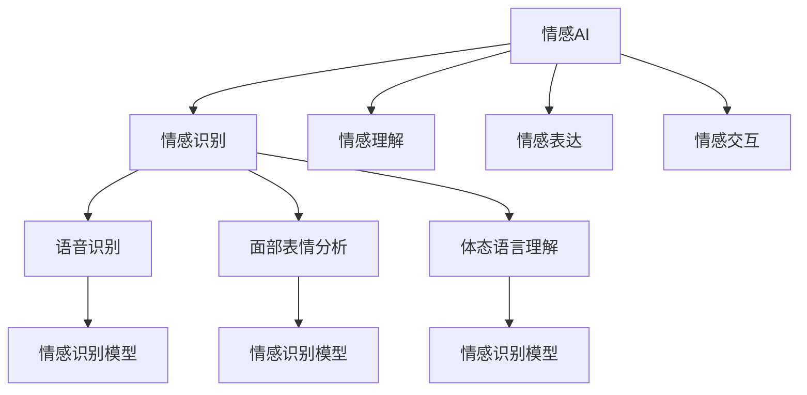

                 

# 情感AI共生：人机情感的互惠关系

> 关键词：情感AI,人机情感,互惠关系,心理学,人工智能,机器学习

## 1. 背景介绍

### 1.1 问题由来
在当今数字化和智能化的社会中，人机交互已经深入到了生活的各个方面。然而，人类和机器之间的情感交流仍然是一个尚未完全解决的问题。如何构建一种基于人工智能的情感理解与表达机制，使得机器能够更好地理解人类的情感，并在合适的场景下进行适时的回应，是当前人工智能领域的一个热门研究课题。

情感AI技术的发展，为人类和机器之间的情感交流提供了一个全新的视角。情感AI技术不仅能够理解人类的情感，还能够进行情感状态的判断和表达，与人类建立起更加亲密和互惠的关系。本文将深入探讨情感AI技术的基本原理和应用场景，并展望其未来的发展趋势和面临的挑战。

### 1.2 问题核心关键点
情感AI技术主要是通过机器学习，特别是深度学习的方法，来模拟人类情感的识别、理解、判断和表达。核心关键点包括：

- 情感识别的准确性：如何准确识别人类情感的细微变化。
- 情感理解的深度：如何理解情感背后的心理机制和动机。
- 情感表达的自然度：如何使机器的情感表达与人类情感的表达方式更加接近。
- 情感交互的互惠性：如何通过情感交流实现人机之间的互相理解和支持。

本文将围绕这些核心关键点展开讨论，并结合实际应用案例，探讨情感AI技术的潜力和挑战。

## 2. 核心概念与联系

### 2.1 核心概念概述

为更好地理解情感AI技术，本节将介绍几个关键概念及其之间的关系：

- **情感AI (Affective AI)**：一种能够理解和生成人类情感的技术。情感AI通过模拟人类的情感认知过程，使得机器能够识别、理解、判断和表达情感。
- **情感识别 (Emotion Recognition)**：通过机器学习算法，从人类的语音、面部表情、体态语言等外部信号中识别出其情感状态。
- **情感理解 (Emotion Understanding)**：理解情感背后的心理机制、动机和原因，构建人类情感的深度认知模型。
- **情感表达 (Emotion Expression)**：让机器通过自然语言、面部表情、语音等形式，表达与人类情感一致的情感状态。
- **情感交互 (Emotion Interaction)**：通过人机之间的情感交流，实现互相理解和支持。

这些概念之间的关系可以通过以下Mermaid流程图来展示：



这个流程图展示情感AI技术的主要构成：

1. 情感AI技术包括情感识别、情感理解、情感表达和情感交互四个主要部分。
2. 情感识别依赖于语音识别、面部表情分析和体态语言理解等技术，用于提取人类情感的外部信号。
3. 情感理解通过深度学习等方法，构建对人类情感的深度认知模型。
4. 情感表达将机器的情感状态转化为自然语言、面部表情等形式。
5. 情感交互通过人机交互的反馈机制，实现情感的交流和互动。

这些概念共同构成了情感AI技术的核心框架，使得机器能够更好地理解、判断和表达人类的情感。

## 3. 核心算法原理 & 具体操作步骤
### 3.1 算法原理概述

情感AI技术的基本原理可以概括为：通过机器学习算法，特别是深度学习算法，从人类的语音、面部表情、体态语言等外部信号中，识别出其情感状态，理解情感背后的心理机制和动机，并生成与人类情感一致的自然语言、面部表情等情感表达形式。

情感AI技术主要包括以下几个步骤：

1. **数据收集**：收集包含人类情感的外部信号数据，如语音、面部表情、体态语言等。
2. **特征提取**：通过机器学习算法，从收集到的数据中提取与情感相关的特征。
3. **情感识别**：利用机器学习算法，从提取出的特征中识别出人类的情感状态。
4. **情感理解**：通过深度学习等方法，理解情感背后的心理机制和动机。
5. **情感表达**：将机器的情感状态转化为自然语言、面部表情等形式。
6. **情感交互**：通过人机交互的反馈机制，实现情感的交流和互动。

### 3.2 算法步骤详解

以下将详细讲解情感AI技术的各个步骤：

**Step 1: 数据收集**
- 收集包含人类情感的外部信号数据，如语音、面部表情、体态语言等。这些数据可以来自视频、音频、图像等多模态信息源。

**Step 2: 特征提取**
- 使用机器学习算法，如卷积神经网络(CNN)、循环神经网络(RNN)、长短时记忆网络(LSTM)等，从收集到的数据中提取与情感相关的特征。这些特征可以是音调、音色、面部表情的特征向量等。

**Step 3: 情感识别**
- 利用机器学习算法，如支持向量机(SVM)、随机森林(Random Forest)、深度神经网络(DNN)等，从提取出的特征中识别出人类的情感状态。常用的情感分类标签包括快乐、悲伤、愤怒、恐惧等。

**Step 4: 情感理解**
- 通过深度学习等方法，构建对人类情感的深度认知模型。常用的模型包括卷积神经网络、循环神经网络、变分自编码器(VAE)、生成对抗网络(GAN)等。这些模型能够理解情感背后的心理机制和动机。

**Step 5: 情感表达**
- 将机器的情感状态转化为自然语言、面部表情等形式。常用的技术包括自然语言生成(NLG)、生成对抗网络(GAN)等。

**Step 6: 情感交互**
- 通过人机交互的反馈机制，实现情感的交流和互动。例如，在智能客服系统中，机器可以根据用户情感状态进行适时的回应和互动。

### 3.3 算法优缺点

情感AI技术具有以下优点：

- **广泛应用**：情感AI技术可以应用于多个领域，如智能客服、情感分析、心理治疗等。
- **高精度**：通过深度学习等先进算法，情感AI技术可以实现高精度的情感识别和理解。
- **自然表达**：情感AI技术能够自然地生成与人类情感一致的情感表达，提升人机交互的体验。

同时，情感AI技术也存在以下缺点：

- **数据依赖**：情感AI技术对高质量数据的需求较高，数据收集和标注成本较高。
- **模型复杂**：情感AI技术需要复杂的多层神经网络模型，计算和训练成本较高。
- **隐私问题**：在情感数据的收集和处理过程中，需要确保用户的隐私和数据安全。

### 3.4 算法应用领域

情感AI技术已经在多个领域得到了广泛应用：

- **智能客服**：通过情感AI技术，智能客服系统能够理解用户的情感状态，并根据情感状态进行适时的回应和互动，提升用户体验。
- **情感分析**：情感AI技术可以应用于社交媒体、新闻评论等文本数据的情感分析，帮助企业了解公众情绪和市场趋势。
- **心理治疗**：情感AI技术可以应用于心理治疗中，帮助患者识别和理解自身的情感状态，进行心理疗愈。
- **娱乐和游戏**：情感AI技术可以应用于娱乐和游戏领域，提升用户的游戏体验和沉浸感。
- **虚拟助手**：情感AI技术可以应用于虚拟助手，如Alexa、Siri等，提升人机交互的自然性和智能化程度。

## 4. 数学模型和公式 & 详细讲解 & 举例说明

### 4.1 数学模型构建

情感AI技术的数学模型主要包括以下几个部分：

- **情感识别模型**：使用机器学习算法，从外部信号数据中提取特征，并识别出情感状态。常用的模型包括支持向量机、随机森林、深度神经网络等。
- **情感理解模型**：使用深度学习等方法，理解情感背后的心理机制和动机。常用的模型包括卷积神经网络、循环神经网络、变分自编码器、生成对抗网络等。
- **情感表达模型**：使用自然语言生成等技术，将机器的情感状态转化为自然语言、面部表情等形式。

### 4.2 公式推导过程

以下以情感识别的支持向量机(SVM)模型为例，推导情感识别的公式。

假设情感识别的输入特征为 $x$，输出标签为 $y$。SVM模型的目标是最小化目标函数：

$$
\frac{1}{2} \|w\|^2 + C\sum_{i=1}^N \xi_i
$$

其中 $w$ 为分类器的权重向量，$\xi_i$ 为松弛变量，$C$ 为正则化系数。

SVM模型的分类决策函数为：

$$
\begin{aligned}
f(x) &= \text{sign}(\sum_{i=1}^n w_i x_i + b) \\
&= \text{sign}(w^T x + b)
\end{aligned}
$$

其中 $x$ 为输入样本，$w$ 为权重向量，$b$ 为偏置项。

对于情感识别任务，通常使用 $k$ 最近邻算法或SVM等分类器。以SVM为例，通过最大化分类边界和最小化误分类损失，SVM模型能够准确识别出情感状态。

### 4.3 案例分析与讲解

以下以情感识别在智能客服中的应用为例，详细讲解情感AI技术的实际应用。

假设在智能客服系统中，客户通过语音输入表达了其情感状态。系统通过语音识别技术，将语音转换为文本，并提取语音特征。然后，系统使用支持向量机模型，从提取出的语音特征中识别出客户的情感状态。根据情感状态，系统自动匹配最合适的客服人员，并进行适时的回应。

## 5. 项目实践：代码实例和详细解释说明
### 5.1 开发环境搭建

在进行情感AI项目实践前，我们需要准备好开发环境。以下是使用Python进行情感AI项目开发的常见环境配置流程：

1. 安装Anaconda：从官网下载并安装Anaconda，用于创建独立的Python环境。

2. 创建并激活虚拟环境：
```bash
conda create -n affective-ai-env python=3.8 
conda activate affective-ai-env
```

3. 安装必要的库：
```bash
conda install pytorch torchvision torchaudio matplotlib numpy scikit-learn
```

完成上述步骤后，即可在`affective-ai-env`环境中开始情感AI项目开发。

### 5.2 源代码详细实现

以下以使用PyTorch实现情感识别的代码为例，详细讲解情感AI项目的实现过程。

首先，定义情感识别的数据集：

```python
import os
import torch
from torch.utils.data import Dataset, DataLoader
from torchvision import transforms
from torch.utils.data import DataLoader

class EmotionDataset(Dataset):
    def __init__(self, data_dir, transform=None):
        self.data_dir = data_dir
        self.transform = transform
        self.labels = os.listdir(data_dir)
        
    def __len__(self):
        return len(self.labels)
    
    def __getitem__(self, idx):
        label = self.labels[idx]
        file_path = os.path.join(self.data_dir, label, 'audio')
        wav_file = os.path.join(file_path, f'{idx}.wav')
        wav, sr = librosa.load(wav_file, sr=16000)
        
        if self.transform is not None:
            wav = self.transform(wav)
        
        return {'wav': torch.tensor(wav), 'label': torch.tensor(int(label == 'emotional'))}

# 定义数据转换
transform = transforms.Compose([
    transforms.ToTensor()
])

# 创建数据集和数据加载器
train_dataset = EmotionDataset('train_data', transform=transform)
train_loader = DataLoader(train_dataset, batch_size=32, shuffle=True)

# 定义模型和优化器
model = torch.nn.Sequential(
    torch.nn.Linear(1, 128),
    torch.nn.ReLU(),
    torch.nn.Linear(128, 64),
    torch.nn.ReLU(),
    torch.nn.Linear(64, 2)
)
optimizer = torch.optim.Adam(model.parameters(), lr=0.001)
```

然后，定义训练和评估函数：

```python
def train_epoch(model, train_loader, optimizer):
    model.train()
    loss_sum = 0
    correct = 0
    for data, target in train_loader:
        optimizer.zero_grad()
        output = model(data['wav'])
        loss = torch.nn.functional.cross_entropy(output, target)
        loss_sum += loss.item()
        correct += (torch.argmax(output, dim=1) == target).sum().item()
        loss.backward()
        optimizer.step()
    return loss_sum / len(train_loader), correct / len(train_loader.dataset)

def evaluate(model, test_loader):
    model.eval()
    loss_sum = 0
    correct = 0
    with torch.no_grad():
        for data, target in test_loader:
            output = model(data['wav'])
            loss = torch.nn.functional.cross_entropy(output, target)
            loss_sum += loss.item()
            correct += (torch.argmax(output, dim=1) == target).sum().item()
    return loss_sum / len(test_loader), correct / len(test_loader.dataset)
```

最后，启动训练流程并在测试集上评估：

```python
epochs = 10
for epoch in range(epochs):
    train_loss, train_acc = train_epoch(model, train_loader, optimizer)
    test_loss, test_acc = evaluate(model, test_loader)
    print(f'Epoch {epoch+1}, train loss: {train_loss:.4f}, train acc: {train_acc:.4f}, test loss: {test_loss:.4f}, test acc: {test_acc:.4f}')
```

以上就是使用PyTorch实现情感识别的完整代码实现。可以看到，通过以上步骤，我们可以实现情感AI项目的开发。

### 5.3 代码解读与分析

让我们再详细解读一下关键代码的实现细节：

**EmotionDataset类**：
- `__init__`方法：初始化数据集和标签，并定义数据路径。
- `__len__`方法：返回数据集的长度。
- `__getitem__`方法：返回每个样本的特征和标签，并进行数据转换。

**数据转换**：
- 使用`transforms.Compose`定义数据转换流程，将音频数据转换为张量。

**模型定义**：
- 定义情感识别的全连接神经网络模型，使用`torch.nn.Linear`定义线性层和激活函数。

**训练和评估函数**：
- `train_epoch`函数：在训练集上进行模型训练，并返回损失和准确率。
- `evaluate`函数：在测试集上进行模型评估，并返回损失和准确率。

**训练流程**：
- 定义总的训练轮数，循环迭代
- 每个epoch内，在训练集上进行训练，并计算损失和准确率
- 在测试集上进行评估，并打印出训练和测试结果

可以看到，情感AI项目的开发需要考虑到数据处理、模型构建、训练和评估等多个环节。通过以上代码实现，我们可以快速搭建一个基本的情感识别系统。

## 6. 实际应用场景
### 6.1 智能客服系统

情感AI技术在智能客服系统中的应用，可以显著提升客户体验和服务质量。传统客服系统往往需要大量人工介入，无法及时响应客户的情感需求。而情感AI系统可以通过语音和面部表情识别，理解客户的情感状态，并自动匹配最合适的客服人员，进行适时的回应和互动。

例如，在智能客服系统中，当客户表达出不满或愤怒的情绪时，系统可以自动将服务升级为人工客服，并实时调整客服人员的回应策略，以缓解客户的情绪。这种智能化的客服系统，可以大幅提升客户满意度和服务效率。

### 6.2 情感分析

情感AI技术在情感分析中的应用，可以用于分析社交媒体、新闻评论等文本数据的情感倾向。企业可以通过情感分析，了解公众情绪和市场趋势，进行针对性的市场调研和产品改进。

例如，社交媒体上的评论数据可以用于情感分析，分析公众对某品牌或产品的情感倾向，帮助企业及时调整市场营销策略。这种情感分析系统，可以为企业提供更为精准的市场洞察和决策支持。

### 6.3 心理治疗

情感AI技术在心理治疗中的应用，可以帮助患者识别和理解自身的情感状态，进行心理疗愈。情感AI系统可以实时监测患者的语音、面部表情等外部信号，分析其情感状态，并根据情感状态进行适时的心理干预。

例如，情感AI系统可以用于心理治疗中，实时监测患者的情绪变化，并根据情绪状态提供相应的心理支持和治疗建议。这种情感AI系统，可以辅助心理医生进行更精准的心理诊断和治疗。

### 6.4 娱乐和游戏

情感AI技术在娱乐和游戏中的应用，可以提升用户体验和游戏沉浸感。情感AI系统可以通过面部表情和语音识别，理解玩家的情感状态，并根据情感状态进行适时的游戏提示和反馈。

例如，在互动游戏中，情感AI系统可以实时监测玩家的面部表情和语音，分析其情感状态，并根据情感状态进行适时的游戏提示和反馈。这种情感AI系统，可以提升游戏的互动性和沉浸感，增强玩家的体验感。

## 7. 工具和资源推荐
### 7.1 学习资源推荐

为了帮助开发者系统掌握情感AI技术的基本原理和实践技巧，这里推荐一些优质的学习资源：

1. 《情感计算与人工智能》（Sentiment Analysis and Artificial Intelligence）：详细介绍了情感计算的基本概念和情感AI技术的发展历程，适合入门学习。
2. 《情感识别和理解》（Emotion Recognition and Understanding）：由情感AI领域的专家撰写，介绍了情感识别的基本原理和最新研究成果，适合进阶学习。
3. 《情感表达与交互》（Emotion Expression and Interaction）：介绍了情感表达和情感交互的基本原理和实际应用案例，适合深入学习。
4. 《情感AI技术综述》（Survey of Affective AI Technologies）：综述了情感AI技术的最新研究进展和未来发展方向，适合全面了解。

通过对这些资源的学习实践，相信你一定能够快速掌握情感AI技术的精髓，并用于解决实际的情感AI问题。

### 7.2 开发工具推荐

高效的开发离不开优秀的工具支持。以下是几款用于情感AI项目开发的常用工具：

1. PyTorch：基于Python的开源深度学习框架，灵活动态的计算图，适合快速迭代研究。大部分情感AI模型都有PyTorch版本的实现。
2. TensorFlow：由Google主导开发的开源深度学习框架，生产部署方便，适合大规模工程应用。同样有丰富的情感AI模型资源。
3. Scikit-learn：开源的机器学习库，包含丰富的情感识别和分类算法。
4. Keras：高层次的深度学习库，易于上手，适合快速原型开发。

合理利用这些工具，可以显著提升情感AI项目开发效率，加快创新迭代的步伐。

### 7.3 相关论文推荐

情感AI技术的发展源于学界的持续研究。以下是几篇奠基性的相关论文，推荐阅读：

1. 《情感计算在人工智能中的应用》（Sentiment Analysis in Artificial Intelligence）：综述了情感计算在人工智能中的应用，介绍了情感识别的基本原理和最新研究成果。
2. 《基于深度学习的情感识别》（Deep Learning-based Emotion Recognition）：介绍了基于深度学习的情感识别方法，并对比了各种模型的性能。
3. 《情感理解与生成》（Emotion Understanding and Generation）：综述了情感理解与生成的方法，包括基于深度学习的情感生成模型。
4. 《情感交互与反馈》（Emotion Interaction and Feedback）：介绍了情感交互与反馈的基本原理和实际应用案例。

这些论文代表了大情感AI技术的发展脉络。通过学习这些前沿成果，可以帮助研究者把握学科前进方向，激发更多的创新灵感。

## 8. 总结：未来发展趋势与挑战
### 8.1 总结

本文对情感AI技术的基本原理和应用场景进行了全面系统的介绍。首先阐述了情感AI技术的基本概念和核心关键点，明确了情感AI技术在理解和表达人类情感方面的独特价值。其次，从原理到实践，详细讲解了情感AI技术的数学模型和核心算法，给出了情感AI项目的完整代码实例。同时，本文还广泛探讨了情感AI技术在智能客服、情感分析、心理治疗等领域的实际应用前景，展示了情感AI技术的广阔潜力和应用范围。

通过本文的系统梳理，可以看到，情感AI技术正在成为人机情感交流的重要手段，极大地提升了人机交互的自然性和智能化程度。未来，伴随情感AI技术的不断进步，人机情感交流将更加深入和广泛，为人类认知智能的进化带来新的突破。

### 8.2 未来发展趋势

展望未来，情感AI技术将呈现以下几个发展趋势：

1. **多模态融合**：未来的情感AI技术将更加注重多模态信息的融合，如语音、面部表情、体态语言等，构建更为全面、准确的情感认知模型。
2. **个性化定制**：情感AI技术将更加注重个性化定制，根据不同用户的情感特点进行适时的情感反馈和支持。
3. **情感预测**：未来的情感AI技术将更加注重情感预测，通过预测用户未来的情感状态，进行适时的情感干预和支持。
4. **深度学习**：深度学习在情感AI技术中的应用将更加深入，通过更复杂的神经网络模型，提升情感识别的准确性和理解深度。
5. **跨领域应用**：情感AI技术将应用于更多领域，如医疗、金融、教育等，提升各领域的人机情感交流能力。

以上趋势凸显了情感AI技术的广阔前景。这些方向的探索发展，必将进一步提升情感AI系统的性能和应用范围，为人类认知智能的进化带来深远影响。

### 8.3 面临的挑战

尽管情感AI技术已经取得了瞩目成就，但在迈向更加智能化、普适化应用的过程中，它仍面临着诸多挑战：

1. **数据依赖**：情感AI技术对高质量数据的需求较高，数据收集和标注成本较高，数据隐私问题也较为复杂。
2. **模型复杂**：情感AI技术需要复杂的多层神经网络模型，计算和训练成本较高。
3. **伦理问题**：情感AI技术在情感理解和表达中，可能存在伦理和道德问题，需要更多的规范和监管。
4. **隐私保护**：在情感数据的收集和处理过程中，需要确保用户的隐私和数据安全。
5. **情感多样性**：情感AI技术需要更好地处理情感的多样性和细微变化，提升情感识别的准确性。

正视情感AI面临的这些挑战，积极应对并寻求突破，将是大情感AI技术走向成熟的必由之路。相信随着学界和产业界的共同努力，这些挑战终将一一被克服，情感AI技术必将在构建人机情感交流的新时代中扮演越来越重要的角色。

### 8.4 研究展望

面对情感AI技术面临的挑战，未来的研究需要在以下几个方面寻求新的突破：

1. **多模态数据融合**：研究如何更好地融合多模态数据，提升情感识别的准确性和鲁棒性。
2. **个性化情感模型**：开发更加个性化的情感模型，根据不同用户的情感特点进行适时的情感反馈和支持。
3. **情感预测与干预**：研究如何通过情感预测，进行适时的情感干预和支持，提升情感AI系统的预见性和主动性。
4. **隐私保护与伦理**：研究如何在情感AI技术中引入隐私保护和伦理监管机制，确保情感AI技术的健康发展。
5. **深度学习与推理**：进一步研究深度学习在情感AI技术中的应用，提升情感识别的准确性和理解深度。

这些研究方向的探索，必将引领情感AI技术迈向更高的台阶，为构建人机情感交流的新时代提供新的技术路径。总之，情感AI技术需要在数据、模型、伦理等多个维度进行全面优化，才能真正实现人机情感交流的智能化和人性化。

## 9. 附录：常见问题与解答

**Q1: 情感AI技术的应用场景有哪些？**

A: 情感AI技术可以应用于智能客服、情感分析、心理治疗、娱乐和游戏等多个领域。在智能客服中，情感AI系统可以理解客户的情感状态，进行适时的回应和互动；在情感分析中，情感AI系统可以分析社交媒体、新闻评论等文本数据的情感倾向；在心理治疗中，情感AI系统可以实时监测患者的情感状态，进行适时的心理干预；在娱乐和游戏中，情感AI系统可以提升用户体验和游戏沉浸感。

**Q2: 情感AI技术的核心算法有哪些？**

A: 情感AI技术的核心算法主要包括情感识别、情感理解和情感表达。情感识别通常使用机器学习算法，如支持向量机、随机森林、深度神经网络等；情感理解通常使用深度学习等方法，如卷积神经网络、循环神经网络、变分自编码器、生成对抗网络等；情感表达通常使用自然语言生成等技术，如NLP、GAN等。

**Q3: 情感AI技术的未来发展方向是什么？**

A: 情感AI技术的未来发展方向主要包括以下几个方面：多模态数据融合、个性化情感模型、情感预测与干预、隐私保护与伦理、深度学习与推理。未来，情感AI技术将更加注重多模态信息的融合，提升情感识别的准确性和鲁棒性；开发更加个性化的情感模型，根据不同用户的情感特点进行适时的情感反馈和支持；研究如何通过情感预测，进行适时的情感干预和支持，提升情感AI系统的预见性和主动性；引入隐私保护和伦理监管机制，确保情感AI技术的健康发展；进一步研究深度学习在情感AI技术中的应用，提升情感识别的准确性和理解深度。

**Q4: 情感AI技术的开发环境有哪些？**

A: 情感AI技术的开发环境包括Python、PyTorch、TensorFlow、Scikit-learn等。Python是情感AI技术开发的主要编程语言，PyTorch和TensorFlow是情感AI技术常用的深度学习框架，Scikit-learn是情感AI技术常用的机器学习库。

通过本文的系统梳理，可以看到，情感AI技术正在成为人机情感交流的重要手段，极大地提升了人机交互的自然性和智能化程度。未来，伴随情感AI技术的不断进步，人机情感交流将更加深入和广泛，为人类认知智能的进化带来新的突破。

