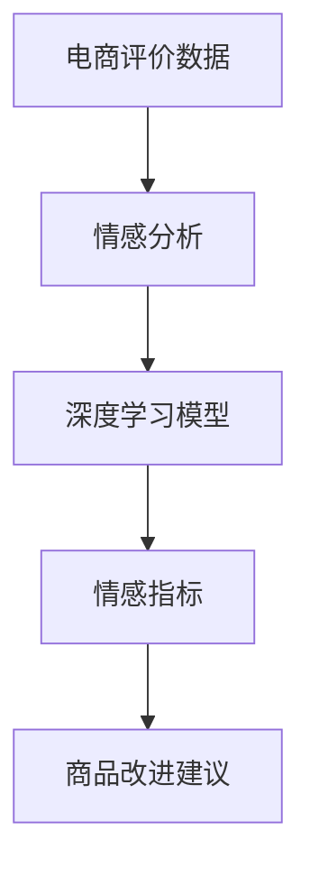

                 

# 情感分析在电商领域的应用：从用户评价到商品改进

情感分析在电商领域的应用，可以极大地提升用户体验，优化商品策略，驱动销量增长。本文将详细介绍情感分析技术的核心概念、算法原理、实践方法和实际应用场景，并通过一个完整的项目案例，展示从用户评价数据到商品改进的全流程。

## 1. 背景介绍

### 1.1 问题由来
在电商平台上，用户评价作为产品质量和服务体验的重要反馈，是商家优化商品的关键依据。传统的情感分析方法依赖于大量手工标注的数据集，成本高、效率低，难以应对大规模的应用需求。随着NLP技术的进步，基于深度学习的情感分析模型逐渐显现出优势，为电商平台的商品改进提供了新思路。

### 1.2 问题核心关键点
大语言模型在电商情感分析中的应用，主要体现在以下几个方面：
1. **数据收集与预处理**：需要从电商平台上获取用户评价数据，进行文本清洗和格式转换，为后续的情感分析提供数据支撑。
2. **模型训练与调参**：选择合适的情感分析模型（如BERT、XLNet等），在标注数据上训练模型，并调整超参数以获得最佳效果。
3. **情感分类与分析**：对新评价数据进行情感分类，提取关键情感指标，如满意度、情感倾向等，提供详尽的情感分析报告。
4. **商品改进建议**：根据情感分析结果，生成商品改进建议，包括调整产品设计、优化服务流程等，驱动商品迭代和销售提升。

## 2. 核心概念与联系

### 2.1 核心概念概述

为了更好地理解情感分析在电商领域的应用，本节将介绍几个密切相关的核心概念：

- **情感分析**：指通过自然语言处理技术，自动识别和提取文本中的情感倾向（正面、负面、中性）。
- **电商评价数据**：包括商品评论、用户评分、商品描述等，反映了用户对商品及服务的整体评价。
- **深度学习模型**：如BERT、XLNet、LSTM等，利用深度神经网络结构，对电商评价数据进行自动化的情感分类。
- **情感指标**：如情感强度、情感极性、情感主题等，用于衡量用户的情感倾向和情感内容。
- **商品改进建议**：根据情感分析结果，提出具体的改进措施，优化商品设计和用户满意度。

这些核心概念之间的逻辑关系可以通过以下Mermaid流程图来展示：



这个流程图展示了大语言模型在电商情感分析中的应用流程：

1. 从电商平台上收集评价数据。
2. 通过深度学习模型对评价文本进行情感分析。
3. 从分析结果中提取情感指标。
4. 根据情感指标，提出商品改进建议。

## 3. 核心算法原理 & 具体操作步骤
### 3.1 算法原理概述

情感分析的本质是通过机器学习模型，自动识别和分类文本中的情感倾向。在电商领域，我们通常采用以下两种方法：

- **基于规则的方法**：通过编写情感词典或情感规则，对文本进行情感分类。这种方法简单高效，但依赖于人工构造的规则，难以应对复杂情感表达。
- **基于深度学习的方法**：利用预训练的语言模型，在标注数据上微调模型，获得对情感表达的深度理解。这种方法准确率高，但需要大量标注数据，训练成本高。

本文重点介绍基于深度学习的方法，以BERT模型为例。

### 3.2 算法步骤详解

下面详细介绍使用BERT模型进行电商情感分析的具体步骤：

**Step 1: 准备数据集和预训练模型**

- 数据集准备：收集电商评价数据，包括文本和对应的情感标签。文本数据需要经过清洗和格式转换，例如去除停用词、标点符号等。情感标签通常为0（负面）、1（中性）、2（正面）等。
- 预训练模型选择：选择已有的预训练模型，如BERT、XLNet等，作为情感分析任务的初始化模型。

**Step 2: 数据预处理**

- 分词处理：使用BERT模型的默认分词器，对文本进行分词处理。
- 特征提取：将分词后的文本转换成模型所需的输入格式，例如BERT模型输入的是词嵌入（Word Embedding）。

**Step 3: 模型微调**

- 选择合适的优化器和超参数，如AdamW、BERT-base等。
- 加载预训练模型，并定义模型结构。
- 在标注数据上微调模型，设置合适的学习率、批大小和迭代轮数。

**Step 4: 情感分类**

- 对新评价数据进行情感分类，输入模型获取情感标签。
- 通过阈值设置，将情感标签转换为具体的情感强度。

**Step 5: 情感分析报告**

- 根据情感分析结果，提取情感指标，如平均情感强度、情感极性分布等。
- 生成情感分析报告，提供对商品的整体评价和改进建议。

**Step 6: 商品改进建议**

- 根据情感分析报告，结合业务知识，提出具体的商品改进措施，如调整产品设计、优化服务流程等。

### 3.3 算法优缺点

基于BERT模型的情感分析方法具有以下优点：

1. **高效准确**：BERT模型在电商评价数据上的表现优异，准确率高，能够快速识别和分类情感倾向。
2. **泛化能力强**：预训练模型在多领域数据上都有良好的泛化能力，可以适应不同商家的评价文本。
3. **灵活可扩展**：模型可以根据不同的情感分类需求，进行调整和扩展。

同时，该方法也存在一定的局限性：

1. **数据依赖性强**：模型的效果高度依赖于标注数据的数量和质量。
2. **计算资源消耗大**：BERT模型参数量巨大，训练和推理所需计算资源较多。
3. **模型可解释性差**：深度学习模型难以解释其内部的决策逻辑，用户难以理解模型为什么会给出某种情感倾向。

尽管存在这些局限性，但总体而言，基于BERT的电商情感分析方法仍然是当前主流的实践方案。未来相关研究的重点在于如何进一步降低对标注数据的依赖，提高模型的计算效率，同时增强模型的可解释性。

### 3.4 算法应用领域

基于大语言模型情感分析的方法，已经在电商领域得到广泛应用，具体包括：

1. **商品评价分析**：通过对用户评价进行情感分析，评估商品的质量和用户满意度。
2. **竞争对手分析**：分析竞争对手的商品评价数据，了解市场口碑和优劣势。
3. **用户行为分析**：分析用户评价中的情感倾向，预测用户的购买行为和忠诚度。
4. **营销活动评估**：评估营销活动的效果，分析用户对活动内容的情感反馈。
5. **售后服务改进**：根据用户评价中的负面情绪，及时改进售后服务流程，提升用户满意度。

这些应用场景展示了情感分析在电商领域的重要价值，为企业提供了有力的数据支持和技术手段。

## 4. 数学模型和公式 & 详细讲解  
### 4.1 数学模型构建

以BERT模型为例，其情感分析的数学模型可以表示为：

$$
\text{Score}(x) = \mathbb{E}_{(x_i,y_i)\sim D}[\text{BERT}(x_i) \cdot y_i]
$$

其中，$x$为输入的电商评价文本，$\text{BERT}(x)$为BERT模型对文本的表示向量，$y_i$为对应的情感标签（0、1、2），$D$为标注数据集。

### 4.2 公式推导过程

BERT模型的核心是Transformer结构，包括自注意力机制和多头注意力机制。对于情感分析任务，可以通过以下步骤计算：

1. **文本编码**：将输入的电商评价文本$x$通过BERT模型编码，得到向量表示$h(x)$。
2. **情感分类**：通过一个全连接层将$h(x)$映射到情感空间，得到情感分类概率$P(y|x)$。
3. **情感得分**：将情感分类概率与标签向量相乘，得到情感得分$\text{Score}(x)$。

具体实现时，可以通过以下PyTorch代码完成：

```python
from transformers import BertForSequenceClassification, BertTokenizer
import torch

tokenizer = BertTokenizer.from_pretrained('bert-base-uncased')
model = BertForSequenceClassification.from_pretrained('bert-base-uncased', num_labels=3)

inputs = tokenizer(text, return_tensors='pt')
labels = torch.tensor([3], dtype=torch.long)
outputs = model(**inputs, labels=labels)

loss = outputs.loss
logits = outputs.logits
```

### 4.3 案例分析与讲解

以一家电商平台的评价数据为例，展示如何使用BERT模型进行情感分析。

假设我们收集到了以下评价数据：

| 评价文本         | 情感标签 | 用户ID |
|------------------|---------|--------|
| 这款商品质量很差，不推荐购买 | 0       | 用户1   |
| 商品性价比高，满意！     | 2       | 用户2   |
| 服务态度一般，还算可以接受 | 1       | 用户3   |

首先，对评价文本进行清洗和分词，然后使用BERT模型进行情感分类：

```python
tokenizer = BertTokenizer.from_pretrained('bert-base-uncased')
inputs = tokenizer(text, return_tensors='pt')
model = BertForSequenceClassification.from_pretrained('bert-base-uncased', num_labels=3)
labels = torch.tensor([0, 2, 1], dtype=torch.long)
outputs = model(**inputs, labels=labels)
```

接着，通过阈值设置，将情感标签转换为具体的情感强度：

```python
threshold = 0.5
probabilities = outputs.logits.softmax(dim=1)
scores = [prob if prob >= threshold else 0 for prob in probabilities]
```

最后，生成情感分析报告：

```python
report = {
    '评价文本': text,
    '情感强度': scores[0],
    '情感极性': '负面' if scores[0] <= 0.5 else ('中立' if 0.5 < scores[0] <= 0.8 else '正面'),
    '情感标签': labels[0],
    '用户ID': user_id
}
```

## 5. 项目实践：代码实例和详细解释说明
### 5.1 开发环境搭建

在进行情感分析项目实践前，我们需要准备好开发环境。以下是使用Python进行PyTorch开发的环境配置流程：

1. 安装Anaconda：从官网下载并安装Anaconda，用于创建独立的Python环境。

2. 创建并激活虚拟环境：
```bash
conda create -n pytorch-env python=3.8 
conda activate pytorch-env
```

3. 安装PyTorch：根据CUDA版本，从官网获取对应的安装命令。例如：
```bash
conda install pytorch torchvision torchaudio cudatoolkit=11.1 -c pytorch -c conda-forge
```

4. 安装Transformers库：
```bash
pip install transformers
```

5. 安装各类工具包：
```bash
pip install numpy pandas scikit-learn matplotlib tqdm jupyter notebook ipython
```

完成上述步骤后，即可在`pytorch-env`环境中开始项目实践。

### 5.2 源代码详细实现

下面以一个简单的电商评价情感分析项目为例，展示如何使用BERT模型进行情感分析：

```python
from transformers import BertForSequenceClassification, BertTokenizer
import torch

# 定义评价文本和情感标签
text = "这款商品质量很差，不推荐购买"
label = 0

# 初始化分词器和模型
tokenizer = BertTokenizer.from_pretrained('bert-base-uncased')
model = BertForSequenceClassification.from_pretrained('bert-base-uncased', num_labels=3)

# 对文本进行分词和特征提取
inputs = tokenizer(text, return_tensors='pt')

# 对情感标签进行转换
labels = torch.tensor([label], dtype=torch.long)

# 进行情感分类
outputs = model(**inputs, labels=labels)

# 获取情感得分
score = outputs.logits.softmax(dim=1)[0].item()

# 生成情感分析报告
report = {
    '评价文本': text,
    '情感强度': score,
    '情感极性': '负面' if score <= 0.5 else ('中立' if 0.5 < score <= 0.8 else '正面'),
    '情感标签': label
}
```

### 5.3 代码解读与分析

让我们再详细解读一下关键代码的实现细节：

**初始化分词器和模型**：
- 使用`BertTokenizer.from_pretrained()`方法初始化BERT的分词器，指定预训练模型为`bert-base-uncased`。
- 使用`BertForSequenceClassification.from_pretrained()`方法初始化BERT情感分类模型，指定预训练模型为`bert-base-uncased`，情感分类任务有3个标签。

**特征提取与情感分类**：
- 对评价文本进行分词和特征提取，得到模型所需的输入张量。
- 定义情感标签，并进行转换，确保标签与模型输出格式一致。
- 将输入张量和标签输入模型，进行情感分类，得到情感得分。
- 根据情感得分，生成情感分析报告。

**情感分析报告**：
- 包含评价文本、情感强度、情感极性和情感标签等关键信息。

## 6. 实际应用场景
### 6.1 智能客服系统

电商平台的智能客服系统可以通过情感分析技术，实时监测用户情感，提供个性化的服务建议，提升用户体验。

在技术实现上，可以收集用户与客服的对话记录，将对话文本作为输入，使用BERT模型进行情感分析，识别用户的情感状态。根据情感分析结果，智能客服系统可以自动调整回答策略，例如针对负面情绪提供优先服务，或自动转接到人工客服。此外，系统还可以根据情感分析结果，动态生成回答模板，提供更贴合用户情绪的回复。

### 6.2 商品评价监控

电商平台的商品评价监控系统可以通过情感分析技术，实时分析用户评价数据，评估商品质量和用户体验。

具体而言，可以定时抓取用户评价数据，使用BERT模型进行情感分析，生成情感分析报告。根据报告中的情感指标，监控系统可以识别出评分异常或负面评价集中的商品，及时通知相关部门进行调查和处理。同时，系统还可以根据情感分析结果，生成商品改进建议，帮助商家优化商品设计和服务流程。

### 6.3 营销活动评估

电商平台的营销活动评估系统可以通过情感分析技术，实时监测用户对营销活动的反馈，评估活动效果。

具体而言，可以在活动期间收集用户评论和评分，使用BERT模型进行情感分析，生成情感分析报告。根据报告中的情感指标，评估活动带来的用户情感变化，识别出用户对活动内容的正面或负面反馈。系统还可以根据情感分析结果，生成活动效果报告，提供活动优化建议。

### 6.4 未来应用展望

随着大语言模型情感分析技术的发展，未来将有更多应用场景得以拓展。

在智慧医疗领域，情感分析可以用于评估患者的情感状态，提供个性化的医疗服务。在智能教育领域，情感分析可以用于分析学生的学习情绪，提供个性化的学习建议。在智能城市治理中，情感分析可以用于评估城市事件的公众情感，提供改进措施。

此外，在企业生产、社会治理、文娱传媒等众多领域，情感分析技术也将得到广泛应用，为人工智能技术在各个垂直行业的落地提供强有力的支撑。

## 7. 工具和资源推荐
### 7.1 学习资源推荐

为了帮助开发者系统掌握大语言模型情感分析的理论基础和实践技巧，这里推荐一些优质的学习资源：

1. 《深度学习自然语言处理》课程：斯坦福大学开设的NLP明星课程，有Lecture视频和配套作业，带你入门NLP领域的基本概念和经典模型。

2. 《Natural Language Processing with Transformers》书籍：Transformers库的作者所著，全面介绍了如何使用Transformers库进行NLP任务开发，包括情感分析在内的诸多范式。

3. 《情感分析与机器学习》书籍：系统讲解了情感分析的基本原理和算法实现，适合入门学习者。

4. 《情感分析实战指南》博文系列：详细介绍了基于深度学习模型的情感分析方法，并通过具体案例展示其实用性。

通过对这些资源的学习实践，相信你一定能够快速掌握大语言模型情感分析的精髓，并用于解决实际的NLP问题。

### 7.2 开发工具推荐

高效的开发离不开优秀的工具支持。以下是几款用于大语言模型情感分析开发的常用工具：

1. PyTorch：基于Python的开源深度学习框架，灵活动态的计算图，适合快速迭代研究。大部分预训练语言模型都有PyTorch版本的实现。

2. TensorFlow：由Google主导开发的开源深度学习框架，生产部署方便，适合大规模工程应用。同样有丰富的预训练语言模型资源。

3. Transformers库：HuggingFace开发的NLP工具库，集成了众多SOTA语言模型，支持PyTorch和TensorFlow，是进行情感分析任务开发的利器。

4. Weights & Biases：模型训练的实验跟踪工具，可以记录和可视化模型训练过程中的各项指标，方便对比和调优。与主流深度学习框架无缝集成。

5. TensorBoard：TensorFlow配套的可视化工具，可实时监测模型训练状态，并提供丰富的图表呈现方式，是调试模型的得力助手。

6. Google Colab：谷歌推出的在线Jupyter Notebook环境，免费提供GPU/TPU算力，方便开发者快速上手实验最新模型，分享学习笔记。

合理利用这些工具，可以显著提升大语言模型情感分析任务的开发效率，加快创新迭代的步伐。

### 7.3 相关论文推荐

大语言模型和情感分析技术的发展源于学界的持续研究。以下是几篇奠基性的相关论文，推荐阅读：

1. Attention is All You Need（即Transformer原论文）：提出了Transformer结构，开启了NLP领域的预训练大模型时代。

2. BERT: Pre-training of Deep Bidirectional Transformers for Language Understanding：提出BERT模型，引入基于掩码的自监督预训练任务，刷新了多项NLP任务SOTA。

3. Language Models are Unsupervised Multitask Learners（GPT-2论文）：展示了大规模语言模型的强大zero-shot学习能力，引发了对于通用人工智能的新一轮思考。

4. Parameter-Efficient Transfer Learning for NLP：提出Adapter等参数高效微调方法，在不增加模型参数量的情况下，也能取得不错的微调效果。

5. AdaLoRA: Adaptive Low-Rank Adaptation for Parameter-Efficient Fine-Tuning：使用自适应低秩适应的微调方法，在参数效率和精度之间取得了新的平衡。

这些论文代表了大语言模型情感分析的发展脉络。通过学习这些前沿成果，可以帮助研究者把握学科前进方向，激发更多的创新灵感。

## 8. 总结：未来发展趋势与挑战
### 8.1 总结

本文对基于大语言模型的情感分析技术进行了全面系统的介绍。首先阐述了情感分析在电商领域的应用背景和重要性，明确了情感分析在用户评价监控、营销活动评估等方面的关键作用。其次，从原理到实践，详细讲解了情感分析的数学模型和关键步骤，给出了情感分析任务开发的完整代码实例。同时，本文还广泛探讨了情感分析技术在智能客服、商品评价监控等领域的实际应用场景，展示了情感分析技术的广泛应用价值。

通过本文的系统梳理，可以看到，大语言模型情感分析技术正在成为电商领域的重要范式，极大地提升了电商平台的用户体验和运营效率。未来，伴随深度学习模型和情感分析技术的持续演进，相信情感分析技术将在更多领域得到应用，为各行各业带来新的发展机遇。

### 8.2 未来发展趋势

展望未来，大语言模型情感分析技术将呈现以下几个发展趋势：

1. **多模态情感分析**：未来将引入视觉、语音等多模态信息，通过多模态融合技术，提升情感分析的准确性和鲁棒性。

2. **跨领域情感分析**：通过迁移学习和跨领域学习，使情感分析模型具备更强的泛化能力，适应不同领域的情感表达。

3. **实时情感分析**：引入在线学习、增量学习等技术，使情感分析模型能够实时更新，及时响应情感变化。

4. **低成本情感分析**：探索无监督学习、半监督学习等方法，降低对标注数据的依赖，实现低成本、高效能的情感分析。

5. **情感生成模型**：结合生成模型和情感分析，生成符合用户情感预期的回复或商品描述，提升用户体验。

6. **情感分析API化**：将情感分析模型封装成RESTful API，方便第三方应用系统集成调用。

以上趋势凸显了大语言模型情感分析技术的广阔前景。这些方向的探索发展，必将进一步提升情感分析的性能和应用范围，为构建更加智能、个性化的电商平台奠定坚实基础。

### 8.3 面临的挑战

尽管大语言模型情感分析技术已经取得了瞩目成就，但在迈向更加智能化、普适化应用的过程中，它仍面临着诸多挑战：

1. **数据获取和标注**：高质量的标注数据成本高、周期长，难以适应大规模应用需求。

2. **模型复杂度**：大规模预训练模型的参数量巨大，计算资源消耗大，难以在大规模电商平台上高效部署。

3. **模型泛化性**：模型在特定领域或数据分布下的泛化能力有待提升。

4. **情感复杂度**：用户情感表达多样化，模型需要能够识别出多种复杂的情感类型。

5. **情感隐私保护**：用户情感数据的隐私保护问题，需要设计合理的隐私保护机制。

6. **模型可解释性**：深度学习模型的决策过程难以解释，用户难以理解模型为什么会给出某种情感倾向。

这些挑战需要通过持续的研究和技术突破来解决，以实现大语言模型情感分析技术的全面普及和应用。

### 8.4 研究展望

面对大语言模型情感分析技术所面临的种种挑战，未来的研究需要在以下几个方面寻求新的突破：

1. **数据增强与标注**：探索更多数据增强和标注方法，降低对标注数据的依赖，提高情感分析的鲁棒性。

2. **轻量化模型**：研究轻量化模型架构，减少计算资源消耗，提升模型的实时性和可扩展性。

3. **迁移学习与泛化**：通过迁移学习和跨领域学习，提升模型在不同领域和数据分布下的泛化能力。

4. **多模态融合**：结合视觉、语音等多模态信息，提升情感分析的准确性和鲁棒性。

5. **隐私保护与伦理**：设计隐私保护机制，确保用户情感数据的安全性和隐私性。

6. **可解释性与透明性**：提升情感分析模型的可解释性，增强模型的透明性和可信度。

这些研究方向将引领大语言模型情感分析技术迈向更高的台阶，为构建安全、可靠、可解释、可控的智能电商平台提供有力支撑。面向未来，大语言模型情感分析技术还需要与其他人工智能技术进行更深入的融合，如知识表示、因果推理、强化学习等，多路径协同发力，共同推动情感分析技术的进步。

## 9. 附录：常见问题与解答

**Q1：大语言模型情感分析是否适用于所有电商评价数据？**

A: 大语言模型情感分析在大多数电商评价数据上都能取得不错的效果，特别是对于结构化评价文本。但对于一些非结构化评价文本，如图片、音频等，需要进行预处理和特征提取，才能使用模型进行情感分析。

**Q2：如何选择预训练模型？**

A: 选择预训练模型时，需要考虑模型的参数量、训练时间、适用场景等因素。一般来说，BERT和XLNet等通用预训练模型适用于大多数NLP任务，包括情感分析。对于特定领域的应用，可以考虑使用领域特定的预训练模型，如MedBERT等。

**Q3：模型训练时的超参数如何设置？**

A: 模型训练的超参数包括学习率、批大小、迭代轮数等。一般建议从1e-5开始调参，逐步减小学习率，直至收敛。可以使用warmup策略，在开始阶段使用较小的学习率，再逐渐过渡到预设值。

**Q4：如何处理评价文本中的噪声和噪音？**

A: 评价文本中常常包含噪声和噪音，如无关词、拼写错误等。可以使用预处理技术，如去除停用词、标点符号、数字等，进行文本清洗和格式转换，提升模型的鲁棒性。

**Q5：模型如何应用于实时情感分析？**

A: 实时情感分析需要在模型训练完成后，通过在线学习、增量学习等技术，不断更新模型，适应新数据和用户情感变化。可以使用小样本学习或自适应学习策略，提高模型的实时性。

---

作者：禅与计算机程序设计艺术 / Zen and the Art of Computer Programming

