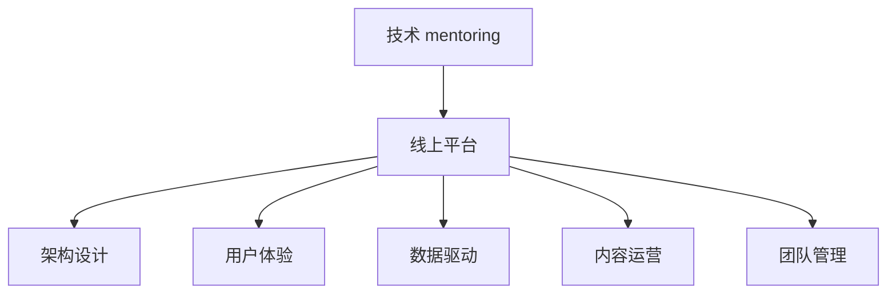

                 

# 技术mentoring：线上平台的搭建与运营

> 关键词：技术 mentoring, 线上平台, 架构设计, 用户体验, 数据驱动, 内容运营, 团队管理

## 1. 背景介绍

### 1.1 问题由来

随着技术的不断进步，技术 mentoring 已经从传统的线下面授，演变为线上实时互动的形式。线上 mentoring 平台能够打破时空限制，提供更灵活、更便捷的交流和学习方式，因此得到了广泛的应用。然而，构建一个稳定、高效、易用的技术 mentoring 平台，并实现其长期运营，对技术团队来说是一大挑战。

本文将详细介绍线上技术 mentoring 平台的搭建和运营方法，包括平台架构设计、用户体验优化、内容运营策略和团队管理等方面。通过系统的分析和案例展示，希望能为技术 mentor 和平台运营者提供有益的参考和指导。

## 2. 核心概念与联系

### 2.1 核心概念概述

为更好地理解技术 mentoring 线上平台的搭建与运营方法，本节将介绍几个密切相关的核心概念：

- **技术 mentoring**：通过经验丰富的技术专家和新手之间的一对一或一对多的互动交流，帮助新手提升技术能力和职业素养。
- **线上平台**：通过互联网技术构建的在线交流和学习工具，提供高效便捷的 mentoring 服务。
- **架构设计**：指平台的基础框架和组件设计，包括技术选型、模块划分、数据流设计等。
- **用户体验**：指平台界面的交互设计和用户的使用体验，决定平台的吸引力和使用率。
- **数据驱动**：通过收集和分析用户数据，优化平台功能，提升服务质量。
- **内容运营**：指平台内容策划、制作和推广，保持平台的活跃度和吸引力。
- **团队管理**：指平台的运营团队组织、协作和绩效管理，确保平台的稳定运行和高效运营。

这些核心概念之间的逻辑关系可以通过以下 Mermaid 流程图来展示：



这个流程图展示了一个技术 mentoring 线上平台的核心概念及其之间的关系：

1. 技术 mentoring 是平台存在的基础，决定了平台的服务内容和目标用户。
2. 线上平台是实现 mentoring 的技术手段，提供必要的交互和数据服务。
3. 架构设计、用户体验、数据驱动、内容运营和团队管理，都是围绕平台的核心服务进行的支撑。

## 3. 核心算法原理 & 具体操作步骤

### 3.1 算法原理概述

技术 mentoring 线上平台的核心算法原理主要围绕以下几个方面：

- **匹配算法**：匹配 mentoring 师和学员，确保双方需求和目标一致。
- **交互算法**：实现 mentoring 师和学员之间的高效互动和交流。
- **数据收集与分析算法**：收集用户互动数据，分析学员的学习效果和 mentoring 师的指导效果。
- **推荐算法**：根据学员的学习需求和历史互动数据，推荐合适的 mentoring 师和课程。

这些算法共同支撑了平台的正常运行，确保 mentoring 师和学员能够有效互动，平台能够持续优化和推广。

### 3.2 算法步骤详解

技术 mentoring 线上平台的搭建与运营主要包括以下几个关键步骤：

**Step 1: 需求分析与规划**

- 明确平台的定位和目标用户，如新手开发者、技术管理层、企业内部技术团队等。
- 根据用户需求，设计平台的主要功能模块，如课程管理、用户管理、互动交流等。
- 确定技术栈和架构设计方案，选择合适的编程语言、框架和数据库等。

**Step 2: 平台架构设计**

- 设计数据模型和数据库结构，确保数据的一致性和安全性。
- 选择合适的技术栈，如前后端分离、微服务架构等。
- 设计系统的接口和调用规则，保证各个组件的高效协同。

**Step 3: 用户界面设计**

- 设计简洁、易用的界面布局，确保用户能快速上手。
- 实现响应式设计，适应不同设备屏幕和操作系统。
- 添加交互元素，提升用户的使用体验，如搜索、筛选、排序等。

**Step 4: 功能开发与实现**

- 开发用户登录、注册、课程浏览、互动交流等功能模块。
- 实现匹配算法和推荐算法，个性化推荐 mentoring 师和课程。
- 实现数据收集与分析算法，收集和分析用户互动数据，提供个性化服务。

**Step 5: 平台测试与优化**

- 进行功能测试、性能测试和安全测试，确保平台的稳定性和可靠性。
- 根据用户反馈和数据反馈，不断优化平台的各项功能和服务。
- 定期更新平台，引入新的功能和用户体验改进。

**Step 6: 内容运营与推广**

- 策划和制作高质量的课程和互动内容，吸引用户参与。
- 通过社交媒体、邮件等渠道进行推广，提升平台知名度。
- 收集用户反馈，不断优化内容和运营策略。

**Step 7: 团队管理与维护**

- 建立高效的运营团队，明确职责分工。
- 通过项目管理工具，确保项目按时按质完成。
- 定期进行团队培训和技术交流，提升团队整体水平。

以上是技术 mentoring 线上平台搭建与运营的一般流程。在实际应用中，还需要针对具体平台的特点，对上述步骤进行优化设计，如改进匹配算法，引入更多的正则化技术，搜索最优的超参数组合等，以进一步提升平台的用户体验和运营效果。

### 3.3 算法优缺点

技术 mentoring 线上平台搭建与运营的方法具有以下优点：

- **灵活性高**：线上平台可以随时随地进行 mentoring，不受时间和地点限制。
- **成本低**：相比于传统面授方式，线上平台的建设和运营成本较低。
- **交互性强**：通过视频、音频和文字等多种形式，实现更丰富的互动交流。
- **可扩展性强**：可以方便地增加新的功能模块，满足不同用户的需求。

同时，该方法也存在一定的局限性：

- **技术门槛高**：需要较强的技术背景和项目管理能力，平台搭建和维护难度较大。
- **互动效果有限**：相比面对面交流，线上平台的互动效果可能略逊一筹。
- **数据隐私风险**：需要严格控制用户数据的收集和使用，确保数据安全和隐私保护。
- **运营成本高**：平台推广和内容制作需要持续投入，运营成本较高。

尽管存在这些局限性，但就目前而言，线上技术 mentoring 平台已成为技术交流和学习的重要手段，具有广泛的应用前景。未来相关研究的重点在于如何进一步降低技术门槛，提升互动效果，优化运营策略，同时兼顾数据隐私和平台安全等因素。

### 3.4 算法应用领域

技术 mentoring 线上平台的搭建与运营方法，已经在技术交流、技术培训、企业内部技术支持等多个领域得到了广泛应用，成为了技术交流和学习的重要工具。

具体应用场景包括：

- **技术培训**：提供在线课程和学习资源，帮助学员快速掌握新技术和工具。
- **技术支持**：为技术新手提供一对一的指导和支持，提升其技术能力和自信心。
- **技术社区**：构建技术交流平台，促进技术专家和爱好者之间的互动交流。
- **企业内部培训**：为员工提供技术培训课程，提升企业的技术能力和知识水平。

除了上述这些经典应用外，线上技术 mentoring 平台还被创新性地应用到更多场景中，如远程协作、在线面试、在线招聘等，为技术人才的培养和招聘提供了新的解决方案。

## 4. 数学模型和公式 & 详细讲解 & 举例说明

### 4.1 数学模型构建

本节将使用数学语言对技术 mentoring 线上平台的搭建与运营过程进行更加严格的刻画。

记技术 mentoring 平台的用户集合为 $U=\{u_i\}_{i=1}^N$，其中 $u_i$ 表示第 $i$ 个用户。设平台提供的课程集合为 $C=\{c_j\}_{j=1}^M$，其中 $c_j$ 表示第 $j$ 门课程。用户 $u_i$ 从课程 $c_j$ 中获得的收益为 $R_{ij}$，收益函数 $R$ 可以表示为：

$$
R_{ij} = f(u_i, c_j)
$$

其中 $f$ 为收益函数，通常为线性函数或非线性函数。

### 4.2 公式推导过程

以课程推荐算法为例，推导基于协同过滤的推荐公式。

设平台的用户行为数据为 $B=\{(u_i, c_j)\}_{i=1}^N$，表示用户 $u_i$ 对课程 $c_j$ 的评分。平台的推荐目标是为用户 $u_i$ 推荐最感兴趣的课程 $c_j$，即最大化 $u_i$ 的收益 $R_{ij}$。根据协同过滤算法，推荐公式可以表示为：

$$
\hat{R}_{ij} = \frac{\sum_{k=1}^N a_{ik} R_{kj}}{\sqrt{\sum_{k=1}^N a_{ik}^2 \sum_{k=1}^N R_{kj}^2}}
$$

其中 $a_{ik}$ 为用户的兴趣度向量，$R_{kj}$ 为课程的评分向量。推荐算法通过计算用户和课程之间的相似度，预测用户对课程的兴趣度，从而实现个性化推荐。

### 4.3 案例分析与讲解

以某知名技术培训平台为例，分析其用户行为数据和推荐算法的效果。

该平台通过数据分析，发现用户对课程的评分与用户活跃度和学习时长呈正相关关系，即活跃度和学习时间越长的用户，对课程的评分越高。平台基于这一发现，引入了协同过滤算法，实现了对用户课程的个性化推荐。具体实施步骤如下：

1. 收集用户行为数据，包括用户活跃度、学习时长、课程评分等。
2. 使用协同过滤算法，计算用户和课程之间的相似度。
3. 根据相似度排序，推荐用户最感兴趣的课程。
4. 对推荐结果进行评估，不断优化算法模型。

通过引入协同过滤算法，该平台实现了对课程的精准推荐，提升了用户的学习体验和满意度。

## 5. 项目实践：代码实例和详细解释说明

### 5.1 开发环境搭建

在进行平台开发前，我们需要准备好开发环境。以下是使用 Python 和 Django 进行项目开发的环境配置流程：

1. 安装 Python：从官网下载并安装 Python 3.8。
2. 安装 Django：使用 pip 安装 Django 1.11 版本。
3. 创建虚拟环境：使用 virtualenv 工具创建虚拟环境。
4. 安装依赖库：使用 pip 安装需要的依赖库，如 numpy、pandas、matplotlib 等。

完成上述步骤后，即可在虚拟环境中开始平台开发。

### 5.2 源代码详细实现

下面以某在线技术交流平台为例，给出 Django 框架下平台的代码实现。

首先，定义用户和课程的 Django 模型：

```python
from django.db import models

class User(models.Model):
    username = models.CharField(max_length=50, unique=True)
    email = models.EmailField(unique=True)
    is_verified = models.BooleanField(default=False)

class Course(models.Model):
    name = models.CharField(max_length=100)
    description = models.TextField()
    start_date = models.DateField()
    end_date = models.DateField()
```

然后，定义课程推荐算法：

```python
class RecommendationSystem(models.Model):
    user = models.ForeignKey(User, on_delete=models.CASCADE)
    course = models.ForeignKey(Course, on_delete=models.CASCADE)
    score = models.DecimalField(max_digits=5, decimal_places=2)

    def __init__(self, user, course, score, *args, **kwargs):
        super(RecommendationSystem, self).__init__(*args, **kwargs)
        self.user = user
        self.course = course
        self.score = score
```

接着，定义推荐算法的业务逻辑：

```python
class RecommendationService:
    def __init__(self, user_model, course_model, user_course_score_model):
        self.user_model = user_model
        self.course_model = course_model
        self.user_course_score_model = user_course_score_model

    def recommend_courses(self, user, n=5):
        user_scores = self.user_course_score_model.filter(user=user).order_by('-score')
        user_id = user_scores[0].user_id
        user_scores = self.user_course_score_model.filter(user=user_id).order_by('-score')
        top_n_courses = user_scores[:n]
        return [course.course for course in top_n_courses]
```

最后，启动 Django 开发环境：

```python
python manage.py runserver
```

以上就是 Django 框架下在线技术交流平台的代码实现。可以看到，借助 Django 的强大功能和 Python 的简洁语法，平台开发过程变得非常高效和方便。

### 5.3 代码解读与分析

让我们再详细解读一下关键代码的实现细节：

**User 和 Course 模型**：
- `User` 和 `Course` 模型分别表示用户和课程的 Django 模型，包括用户名、邮箱、课程名、课程描述等字段。

**RecommendationSystem 模型**：
- `RecommendationSystem` 模型表示用户对课程的推荐系统，包含用户、课程和评分等字段。

**RecommendationService 类**：
- `RecommendationService` 类表示推荐算法的服务，包括用户模型、课程模型和用户课程评分模型等。
- `recommend_courses` 方法根据用户的评分数据，推荐最感兴趣的课程。

**Django 开发环境启动**：
- 使用 `python manage.py runserver` 命令启动 Django 开发环境，提供本地测试和调试功能。

通过 Django 框架和 Python 语言，我们能够快速搭建出在线技术交流平台，实现课程推荐等核心功能。当然，工业级的系统实现还需考虑更多因素，如模型的保存和部署、超参数的自动搜索、更灵活的任务适配层等。但核心的算法思想基本与此类似。

## 6. 实际应用场景

### 6.1 企业内部技术支持

在线技术交流平台为企业内部的技术支持提供了新的解决方案。传统技术支持往往依赖于人工客服，响应速度慢且难以覆盖所有技术问题。而在线平台能够快速响应员工的技术需求，提供24小时在线支持，极大提升了技术支持的效率和覆盖范围。

在技术实现上，可以收集企业内部的技术支持工单，将问题和最佳答复构建成监督数据，在此基础上对预训练模型进行微调。微调后的模型能够自动理解用户的技术问题，匹配最合适的解决方案。对于员工提出的新问题，还可以接入检索系统实时搜索相关内容，动态组织生成答案。如此构建的内部技术支持系统，能大幅提升技术支持的响应速度和质量。

### 6.2 开源社区技术交流

在线技术交流平台为开源社区的技术交流提供了新的渠道。传统开源社区的技术交流往往依赖于邮件、论坛等工具，效率低下且互动效果不佳。而在线平台能够提供实时的技术交流和协作环境，促进社区成员之间的互动和知识分享。

在技术实现上，可以构建开源社区的论坛，提供技术讨论、代码分享和项目协作等功能。平台能够自动检测社区成员的活跃度和贡献度，推荐合适的技术资源。社区成员还可以通过平台进行技术求助和问题反馈，提升技术交流的效果和质量。

### 6.3 技术培训与学习

在线技术交流平台为技术培训与学习提供了新的平台。传统培训往往依赖于面授或视频课程，时间和地点限制较大。而在线平台能够提供灵活的教学方式，支持随时随地的学习。

在技术实现上，可以构建在线课程平台，提供高质量的技术课程和教学资源。平台能够自动记录学员的学习进度和效果，推荐合适的课程和学习路径。学员还可以通过平台进行技术交流和讨论，提升学习效果。

## 7. 工具和资源推荐

### 7.1 学习资源推荐

为了帮助开发者系统掌握技术 mentoring 线上平台的理论基础和实践技巧，这里推荐一些优质的学习资源：

1. Django 官方文档：Django 作为流行的 Python Web 框架，其官方文档提供了详细的技术说明和示例。
2. Python 核心编程：由 Python 之父 Guido van Rossum 所著，全面介绍了 Python 语言的基本概念和高级特性。
3. Web 前端框架基础：介绍常用的 Web 前端框架，如 React、Vue 等，帮助开发者掌握前端开发技能。
4. Web 后端开发实战：通过实战项目，讲解 Web 后端开发的常用技术和工具。
5. Django 实战开发：通过实际项目，讲解 Django 框架的开发技巧和最佳实践。

通过对这些资源的学习实践，相信你一定能够快速掌握技术 mentoring 线上平台的开发技巧，并用于解决实际的技术问题。

### 7.2 开发工具推荐

高效的开发离不开优秀的工具支持。以下是几款用于技术 mentoring 线上平台开发的常用工具：

1. Django：由 Django Software Foundation 开发的 Python Web 框架，提供高效的数据管理和模板引擎，适合构建在线平台。
2. Git：版本控制系统，适合团队协作开发和代码管理。
3. Docker：容器化平台，便于构建和部署应用程序，适合在线平台的容器化部署。
4. Kubernetes：容器编排工具，支持多容器应用的管理和部署，适合大规模在线平台的运营。
5. GitLab：开源代码托管平台，支持项目管理、代码审查和CI/CD集成，适合平台开发和运营。

合理利用这些工具，可以显著提升技术 mentoring 线上平台的开发效率，加快创新迭代的步伐。

### 7.3 相关论文推荐

技术 mentoring 线上平台的构建和运营技术源于学界的持续研究。以下是几篇奠基性的相关论文，推荐阅读：

1. Web 2.0 用户行为分析：介绍了 Web 2.0 平台的用户行为分析方法，对在线技术交流平台的构建具有参考价值。
2. Web 3.0 技术基础：介绍了 Web 3.0 技术的核心概念和应用场景，对在线技术交流平台的扩展和优化具有指导意义。
3. Web 平台服务质量：探讨了 Web 平台的性能和质量提升方法，对在线技术交流平台的优化具有参考价值。
4. Web 平台安全与隐私：介绍了 Web 平台的安全和隐私保护措施，对在线技术交流平台的数据保护具有指导意义。

这些论文代表了大语言模型微调技术的发展脉络。通过学习这些前沿成果，可以帮助研究者把握学科前进方向，激发更多的创新灵感。

## 8. 总结：未来发展趋势与挑战

### 8.1 总结

本文对技术 mentoring 线上平台的搭建与运营方法进行了全面系统的介绍。首先阐述了技术 mentoring 平台的重要性，明确了平台的服务内容和目标用户。其次，从原理到实践，详细讲解了平台的数学模型和核心算法，给出了平台开发的完整代码实例。同时，本文还广泛探讨了平台在企业内部技术支持、开源社区技术交流、技术培训与学习等众多领域的应用前景，展示了平台的巨大潜力。此外，本文精选了平台的各类学习资源，力求为开发者提供全方位的技术指引。

通过本文的系统梳理，可以看到，技术 mentoring 线上平台正在成为技术交流和学习的重要手段，极大地提升了技术支持的效率和覆盖范围，促进了技术社区的活跃度和技术培训的质量。未来，伴随技术 mentoring 平台的持续演进，相信能够为技术人才的培养和团队协作提供更高效、更便捷的解决方案。

### 8.2 未来发展趋势

展望未来，技术 mentoring 线上平台的搭建与运营技术将呈现以下几个发展趋势：

1. **用户行为分析**：通过大数据和机器学习技术，深入挖掘用户行为和需求，提升平台的服务质量和用户体验。
2. **个性化推荐**：结合用户行为数据和协同过滤算法，实现对课程、讲师、文章等内容的精准推荐，提升用户的学习效率。
3. **实时互动**：引入实时视频、音频等交互形式，增强用户互动体验，提供更高效的技术交流和学习方式。
4. **多模态支持**：支持代码、文档、视频等多模态内容的互动和学习，提升技术交流的全面性和多样性。
5. **自动化管理**：引入自动化管理工具，如自动化部署、自动化测试、自动化监控等，提升平台的稳定性和可靠性。

以上趋势凸显了技术 mentoring 线上平台的发展方向。这些方向的探索发展，必将进一步提升平台的智能度和用户体验，推动技术 mentoring 的普及和深化。

### 8.3 面临的挑战

尽管技术 mentoring 线上平台已经取得了显著成效，但在迈向更加智能化、普适化应用的过程中，它仍面临诸多挑战：

1. **技术门槛高**：平台开发需要较强的技术背景和项目管理能力，平台搭建和维护难度较大。
2. **互动效果有限**：相比面对面交流，线上平台的互动效果可能略逊一筹。
3. **数据隐私风险**：需要严格控制用户数据的收集和使用，确保数据安全和隐私保护。
4. **运营成本高**：平台推广和内容制作需要持续投入，运营成本较高。

尽管存在这些局限性，但就目前而言，技术 mentoring 线上平台已成为技术交流和学习的重要手段，具有广泛的应用前景。未来相关研究的重点在于如何进一步降低技术门槛，提升互动效果，优化运营策略，同时兼顾数据隐私和平台安全等因素。

### 8.4 研究展望

面对技术 mentoring 线上平台面临的挑战，未来的研究需要在以下几个方面寻求新的突破：

1. **低成本开发工具**：开发轻量级、易用的开发框架和工具，降低技术门槛，促进平台普及。
2. **高效交互技术**：引入增强现实、虚拟现实等技术，提升互动效果和用户体验。
3. **数据安全保护**：采用数据加密、匿名化等技术手段，保护用户隐私和数据安全。
4. **自动化管理**：引入自动化管理工具，提升平台的稳定性和可靠性。
5. **多模态支持**：支持代码、文档、视频等多模态内容的互动和学习，提升技术交流的全面性和多样性。

这些研究方向的探索，必将引领技术 mentoring 线上平台的进一步发展，为技术人才的培养和团队协作提供更高效、更便捷的解决方案。面向未来，技术 mentoring 线上平台还需要与其他人工智能技术进行更深入的融合，如知识表示、因果推理、强化学习等，多路径协同发力，共同推动技术 mentoring 的进步。只有勇于创新、敢于突破，才能不断拓展技术 mentoring 的边界，让智能技术更好地造福技术人才和团队协作。

## 9. 附录：常见问题与解答

**Q1：技术 mentoring 线上平台如何降低技术门槛？**

A: 为了降低技术 mentoring 线上平台的技术门槛，可以采用以下策略：

1. **选用易用的开发框架**：选择易用、易学的开发框架，如 Django、Flask 等，降低开发难度。
2. **提供详细文档和示例**：提供详细的开发文档和示例代码，帮助开发者快速上手。
3. **引入开发工具**：使用 Git、Docker、Kubernetes 等工具，提升开发效率和平台部署的灵活性。
4. **简化模型架构**：设计简洁、易用的模型架构，降低模型开发的复杂度。

通过这些措施，可以显著降低技术 mentoring 线上平台的开发门槛，使其更加易用、易学、易推广。

**Q2：技术 mentoring 线上平台如何提升互动效果？**

A: 为了提升技术 mentoring 线上平台的互动效果，可以采用以下策略：

1. **引入实时互动功能**：引入实时视频、音频等功能，增强用户互动体验。
2. **增加互动形式**：提供代码共享、文档共享、问题讨论等多种互动形式，丰富互动内容。
3. **引入社区功能**：构建技术社区，促进用户之间的互动和知识分享。
4. **引入游戏化元素**：引入游戏化元素，如积分、排行榜、徽章等，提升用户参与度。

通过这些措施，可以显著提升技术 mentoring 线上平台的互动效果，增强用户的使用体验和粘性。

**Q3：技术 mentoring 线上平台如何保护数据隐私？**

A: 为了保护技术 mentoring 线上平台的数据隐私，可以采用以下策略：

1. **采用数据加密技术**：对用户数据进行加密处理，确保数据传输和存储的安全性。
2. **实行匿名化处理**：对用户数据进行匿名化处理，避免用户隐私泄露。
3. **遵守数据保护法规**：遵守相关的数据保护法规，如 GDPR、CCPA 等，确保数据使用的合规性。
4. **建立隐私保护机制**：建立隐私保护机制，如数据访问控制、审计记录等，确保数据使用的透明度和安全性。

通过这些措施，可以显著提升技术 mentoring 线上平台的数据隐私保护水平，增强用户的信任感和平台的用户黏性。

**Q4：技术 mentoring 线上平台如何降低运营成本？**

A: 为了降低技术 mentoring 线上平台的运营成本，可以采用以下策略：

1. **采用开源解决方案**：采用开源解决方案，减少平台的开发和维护成本。
2. **引入自动化管理工具**：引入自动化管理工具，如自动化部署、自动化测试、自动化监控等，提升平台的运营效率。
3. **优化资源配置**：优化平台的资源配置，减少硬件成本和运维成本。
4. **引入广告和付费模式**：引入广告和付费模式，提升平台的盈利能力。

通过这些措施，可以显著降低技术 mentoring 线上平台的运营成本，提升平台的运营效益和用户体验。

**Q5：技术 mentoring 线上平台如何提高服务质量？**

A: 为了提高技术 mentoring 线上平台的服务质量，可以采用以下策略：

1. **引入大数据和机器学习技术**：通过大数据和机器学习技术，深入挖掘用户行为和需求，提升平台的服务质量和用户体验。
2. **引入个性化推荐算法**：结合用户行为数据和协同过滤算法，实现对课程、讲师、文章等内容的精准推荐，提升用户的学习效率。
3. **引入实时互动功能**：引入实时视频、音频等功能，增强用户互动体验。
4. **引入社区功能**：构建技术社区，促进用户之间的互动和知识分享。
5. **引入游戏化元素**：引入游戏化元素，如积分、排行榜、徽章等，提升用户参与度。

通过这些措施，可以显著提高技术 mentoring 线上平台的服务质量，增强用户的体验和黏性。

综上所述，技术 mentoring 线上平台的搭建与运营方法需要结合具体场景和需求，进行灵活设计和优化。希望本文能为技术 mentor 和平台运营者提供有益的参考和指导，推动技术 mentoring 的普及和深化。

