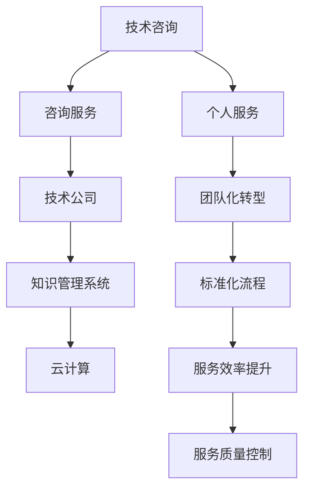

                 

# 技术咨询：从个人服务到咨询公司

## 1. 背景介绍

### 1.1 问题由来

随着信息技术和互联网的飞速发展，技术咨询的需求不断增加。从个人创业者到大企业，各类主体都面临各种技术难题。如何有效地提供技术咨询，满足用户需求，成为了一个重要课题。

在过去，技术咨询主要以个人服务为主，依托于顾问的经验和直觉。但这种方式的弊端也逐渐显现：

1. **个人经验的局限性**：个人顾问的视野和经验有限，难以应对复杂多变的技术问题。
2. **时间和成本问题**：面对大企业或复杂的项目，个人顾问往往无法提供及时和高质量的服务。
3. **知识传递的困难**：技术咨询的最终目的是教会用户解决问题的方法，而不是简单的答案，但个人顾问难以系统化地传授知识。

### 1.2 问题核心关键点

为了解决这些问题，技术咨询行业开始向专业化和团队化转型。但即便如此，也面临诸多挑战：

1. **咨询服务的一致性**：如何保证咨询质量的一致性，避免个人主观因素影响。
2. **服务效率**：如何提高服务效率，确保快速响应客户需求。
3. **知识管理**：如何高效管理和传递知识，实现知识沉淀和复用。
4. **技术更新**：如何快速响应技术变革，保持咨询服务的先进性。

## 2. 核心概念与联系

### 2.1 核心概念概述

为更好地理解技术咨询从个人服务到咨询公司的转型，本节将介绍几个密切相关的核心概念：

- **技术咨询（Technical Consulting）**：以技术为核心的咨询服务，包括但不限于软件开发、系统架构、信息安全、数据分析等，旨在帮助客户解决技术问题，提升业务效率和竞争力。
- **咨询服务（Consulting Service）**：提供专业咨询意见和解决方案的服务，涉及管理、市场、技术等多个领域。
- **技术公司（Technology Company）**：以提供技术产品和服务为主的企业，包括软件公司、系统集成商、咨询公司等。
- **知识管理系统（Knowledge Management System, KMS）**：用于管理和传递知识的工具，帮助企业实现知识的系统化沉淀和复用。
- **云计算（Cloud Computing）**：基于互联网的计算模式，通过虚拟化技术实现资源的灵活调配，为技术咨询服务提供了新的基础设施支持。

这些核心概念之间的逻辑关系可以通过以下Mermaid流程图来展示：



这个流程图展示了几者之间的关系：

1. 技术咨询通过引入咨询公司、技术公司和云平台，从个人服务转型为团队化、标准化的咨询业务。
2. 知识管理系统用于提升知识管理和传递效率，为咨询服务提供技术支持。
3. 云计算平台为技术咨询提供了灵活的计算和存储资源，支持分布式、弹性化的服务部署。

## 3. 核心算法原理 & 具体操作步骤

### 3.1 算法原理概述

技术咨询从个人服务到咨询公司的转型，本质上是业务模式和组织架构的变革。这一转型涉及多个关键步骤，包括咨询服务的标准化、知识管理的体系化、服务的团队化和云平台的部署等。

### 3.2 算法步骤详解

#### 3.2.1 咨询服务标准化

1. **需求分析**：通过问卷调查、访谈等方式，收集客户的实际需求，确定咨询服务的范围和目标。
2. **项目规划**：根据需求分析结果，制定详细的项目计划，包括项目目标、时间节点、资源配置等。
3. **方法论设计**：设计通用的咨询方法论，涵盖问题定义、解决方案提出、实施计划、效果评估等环节。
4. **文档标准化**：制定标准化的文档模板，包括咨询报告、问题分析、解决方案、实施计划等，确保信息的一致性和可追溯性。
5. **流程优化**：通过流程管理工具，如BPM（Business Process Management），优化咨询服务的流程，提升效率和质量。

#### 3.2.2 知识管理系统化

1. **知识库建设**：建立结构化的知识库，包括技术文档、最佳实践、案例分析、工具和软件等，便于知识检索和复用。
2. **知识管理工具**：引入知识管理工具，如Confluence、SharePoint等，实现知识的分类、存储、共享和协作。
3. **知识分享机制**：建立知识分享机制，定期进行内部知识分享会，鼓励员工将实际项目中的经验进行总结和分享。
4. **知识迭代更新**：持续更新知识库，及时反映最新的技术和市场变化，确保知识的鲜活度。

#### 3.2.3 服务团队化

1. **团队组建**：根据项目需求组建跨职能团队，包括技术专家、咨询顾问、项目经理等，确保团队的多样性和专业性。
2. **角色分配**：明确团队成员的角色和职责，确保每个成员都能充分发挥自己的专长。
3. **沟通机制**：建立高效的沟通机制，如定期会议、日报、周报等，确保团队信息的一致性和协同。
4. **项目管理**：引入项目管理工具，如Jira、Trello等，实现项目进度跟踪、任务分配和质量控制。

#### 3.2.4 云平台部署

1. **选择合适的云平台**：根据业务需求选择合适的云平台，如AWS、Azure、阿里云等。
2. **基础设施搭建**：在云平台上搭建计算、存储、网络等基础设施，确保服务的高可用性和可扩展性。
3. **容器化部署**：使用Docker、Kubernetes等容器化技术，实现服务的快速部署和扩展。
4. **云安全保障**：采取云安全措施，如身份认证、数据加密、网络隔离等，保障数据和系统的安全。

#### 3.2.5 服务质量控制

1. **质量管理体系**：引入ISO 9001等质量管理体系，确保咨询服务的质量一致性。
2. **客户反馈机制**：建立客户反馈机制，定期收集客户意见，及时改进服务质量。
3. **绩效评估**：建立绩效评估机制，对团队和个人的表现进行定期评估，确保服务质量。

### 3.3 算法优缺点

从个人服务到咨询公司的转型，具有以下优点：

1. **服务质量一致性**：通过标准化流程和工具，确保服务质量的一致性，避免个人主观因素影响。
2. **服务效率提升**：引入项目管理工具和知识管理工具，提升服务效率，缩短项目周期。
3. **知识管理与复用**：通过知识库和知识管理工具，实现知识沉淀和复用，提升团队整体知识水平。
4. **技术更新快速响应**：借助云平台和容器化技术，快速响应技术变革，保持咨询服务的先进性。

但这一转型也面临诸多挑战：

1. **初期投资高**：咨询公司初期需要投入大量资源进行流程设计、知识库建设和平台部署。
2. **团队管理复杂**：跨职能团队的管理和协调相对复杂，需要高效的项目管理和沟通机制。
3. **知识传播困难**：知识的沉淀和传播需要系统化的管理，但实际操作中难以完全实现。
4. **客户期望高**：咨询公司需要提供高水平的服务，满足客户的期望，但高水平服务质量难以保证。

### 3.4 算法应用领域

技术咨询从个人服务到咨询公司的转型，在多个领域得到了广泛应用，如：

1. **软件开发**：提供技术方案设计、架构规划、代码评审等咨询服务，提升软件开发质量和效率。
2. **系统集成**：提供系统架构设计、数据集成、接口测试等咨询服务，实现系统的高效整合。
3. **信息安全**：提供安全架构设计、漏洞评估、应急响应等咨询服务，保障系统安全稳定。
4. **数据分析**：提供数据治理、算法模型设计、数据可视化等咨询服务，提升数据分析能力。
5. **云计算**：提供云计算平台架构设计、容器化部署、云安全保障等咨询服务，支持企业上云。

除了上述这些经典领域，技术咨询公司还不断拓展到新兴领域，如人工智能、大数据、区块链等，为更多企业提供前沿技术咨询。

## 4. 数学模型和公式 & 详细讲解 & 举例说明

### 4.1 数学模型构建

技术咨询的转型涉及多个子流程和活动，可以通过数学模型对其进行系统化描述。以项目规划为例，我们可以构建以下数学模型：

假设项目包含 $n$ 个活动，每个活动的时间估计为 $t_i$，$i=1,\ldots,n$。设活动 $i$ 的前置活动集合为 $P_i$，依赖活动集合为 $D_i$，则项目规划的数学模型可以表示为：

$$
M = \{(t_i, P_i, D_i) | i = 1, \ldots, n\}
$$

其中 $t_i$ 表示活动 $i$ 的时间估计，$P_i$ 表示活动 $i$ 的前置活动集合，$D_i$ 表示活动 $i$ 的依赖活动集合。

### 4.2 公式推导过程

根据上述模型，可以进一步推导出活动时间估计的数学公式：

设活动 $i$ 的最早开始时间为 $t_i^E$，最晚完成时间为 $t_i^L$，则有：

$$
t_i^E = \max_{j \in P_i} t_j^E
$$

$$
t_i^L = t_i^E + t_i
$$

同时，活动 $i$ 的最早结束时间 $t_i^F$ 和最晚开始时间 $t_i^S$ 可以通过以下公式计算：

$$
t_i^F = \min_{j \in D_i} t_j^L
$$

$$
t_i^S = t_i^E + t_i
$$

通过这些公式，可以计算出项目中所有活动的时间估计，进而进行项目进度的跟踪和优化。

### 4.3 案例分析与讲解

假设有一个软件开发项目，包含 $n=5$ 个活动，每个活动的时间估计和前置/依赖关系如下：

| 活动编号 | 时间估计（天） | 前置活动 | 依赖活动 |
|----------|--------------|----------|----------|
| 1        | 3            | -        | 2, 3     |
| 2        | 4            | -        | -        |
| 3        | 5            | 1, 2     | 4        |
| 4        | 6            | 2        | 5        |
| 5        | 2            | -        | 3, 4     |

根据上述数据，可以计算出各个活动的最早开始时间、最早结束时间、最晚开始时间、最晚完成时间，具体结果如下：

| 活动编号 | 最早开始时间 | 最早结束时间 | 最晚开始时间 | 最晚完成时间 |
|----------|--------------|--------------|--------------|--------------|
| 1        | 0            | 3            | 0            | 3            |
| 2        | 0            | 4            | 0            | 4            |
| 3        | 3            | 8            | 3            | 8            |
| 4        | 4            | 10           | 4            | 10           |
| 5        | 8            | 10           | 8            | 10           |

通过这些时间估计，可以进一步进行项目进度的跟踪和优化，确保项目按时交付。

## 5. 项目实践：代码实例和详细解释说明

### 5.1 开发环境搭建

在进行技术咨询公司的技术实践前，我们需要准备好开发环境。以下是使用Python进行PyTorch开发的环境配置流程：

1. 安装Anaconda：从官网下载并安装Anaconda，用于创建独立的Python环境。

2. 创建并激活虚拟环境：
```bash
conda create -n pytorch-env python=3.8 
conda activate pytorch-env
```

3. 安装PyTorch：根据CUDA版本，从官网获取对应的安装命令。例如：
```bash
conda install pytorch torchvision torchaudio cudatoolkit=11.1 -c pytorch -c conda-forge
```

4. 安装各类工具包：
```bash
pip install numpy pandas scikit-learn matplotlib tqdm jupyter notebook ipython
```

完成上述步骤后，即可在`pytorch-env`环境中开始技术咨询公司的技术实践。

### 5.2 源代码详细实现

这里我们以一个简单项目规划的项目管理工具为例，给出使用Python和PyTorch进行开发的代码实现。

首先，定义Activity类：

```python
class Activity:
    def __init__(self, name, time_estimate, dependencies):
        self.name = name
        self.time_estimate = time_estimate
        self.dependencies = dependencies
        self.earliest_start = 0
        self.earliest_end = 0
        self.latest_start = 0
        self.latest_end = 0

    def calculate_times(self, activities):
        if self.dependencies:
            for dependency in self.dependencies:
                activity = activities[dependency]
                self.earliest_start = max(self.earliest_start, activity.latest_end)
                self.latest_start = self.earliest_start + self.time_estimate
        else:
            self.earliest_start = 0
            self.latest_start = self.time_estimate

        self.earliest_end = self.earliest_start + self.time_estimate
        self.latest_end = self.earliest_end

def create_project(activities):
    for activity in activities:
        activity.calculate_times(activities)
    return activities
```

然后，定义项目管理工具类：

```python
class Project:
    def __init__(self, activities):
        self.activities = create_project(activities)

    def get_earliest_end(self):
        earliest_end = 0
        for activity in self.activities:
            earliest_end = max(earliest_end, activity.earliest_end)
        return earliest_end
```

接着，定义一个简单的项目规划数据：

```python
activities = [
    Activity("Activity 1", 3, [2, 3]),
    Activity("Activity 2", 4, []),
    Activity("Activity 3", 5, [1, 2]),
    Activity("Activity 4", 6, [2]),
    Activity("Activity 5", 2, [3, 4])
]

project = Project(activities)
print(project.get_earliest_end())
```

### 5.3 代码解读与分析

这里我们进一步解读一下关键代码的实现细节：

**Activity类**：
- `__init__`方法：初始化活动的名称、时间估计、依赖关系等属性。
- `calculate_times`方法：计算活动最早开始时间、最早结束时间、最晚开始时间、最晚结束时间。
- `get_earliest_end`方法：返回项目中最早结束时间的活动。

**Project类**：
- `__init__`方法：初始化项目活动列表，并调用`create_project`函数计算活动时间。
- `get_earliest_end`方法：返回项目中最早结束时间。

**项目规划数据**：
- 定义了5个活动的名称、时间估计和依赖关系，并创建了一个Project对象。

通过上述代码，可以看到如何使用Python和PyTorch实现简单的项目规划工具。实际应用中，项目管理工具的复杂度会更高，可能需要处理更多边际条件和异常情况。但核心的算法思想和实现逻辑与上述代码类似。

## 6. 实际应用场景

### 6.1 智能制造

技术咨询公司在智能制造领域的应用广泛，可以提供系统集成、工业大数据分析、智能设备维护等咨询服务。具体而言：

1. **系统集成**：帮助制造企业搭建工业互联网平台，实现设备和系统的互联互通，提升生产效率。
2. **大数据分析**：通过数据分析工具和算法，帮助企业从海量生产数据中提取有价值的信息，优化生产流程。
3. **设备维护**：提供设备故障预测、预防性维护、维修建议等咨询服务，减少停机时间，提升设备寿命。

### 6.2 金融科技

在金融科技领域，技术咨询公司可以提供金融系统架构设计、智能投顾、金融风险管理等咨询服务。具体而言：

1. **系统架构设计**：帮助金融机构设计高可用、高性能、高安全的系统架构，支持业务发展。
2. **智能投顾**：开发智能投顾平台，通过大数据分析和机器学习算法，提供个性化的投资建议。
3. **风险管理**：提供金融风险评估、合规监控、欺诈检测等服务，保障金融稳定运行。

### 6.3 医疗健康

在医疗健康领域，技术咨询公司可以提供电子病历系统集成、医疗大数据分析、智慧医疗应用开发等咨询服务。具体而言：

1. **电子病历系统集成**：帮助医院搭建电子病历系统，实现医疗信息的数字化和信息化。
2. **大数据分析**：通过医疗大数据分析，发现疾病趋势、优化诊疗流程，提升医疗服务质量。
3. **智慧医疗应用**：开发智能问诊、远程医疗、健康管理等应用，提供便捷的医疗服务。

### 6.4 未来应用展望

随着技术咨询公司的业务扩展和技术创新，未来的应用场景将更加广阔。可以预见，技术咨询将在以下几个方面发挥重要作用：

1. **人工智能与医疗**：提供基于AI的诊断和治疗建议，提升医疗服务效率和质量。
2. **云计算与工业**：通过云平台实现工业设备的远程监控和维护，降低设备停机时间，提升生产效率。
3. **大数据与商业**：利用大数据分析，优化商业决策，提升企业竞争力。
4. **区块链与金融**：提供区块链技术应用开发和咨询，保障金融交易的安全性和透明性。

## 7. 工具和资源推荐

### 7.1 学习资源推荐

为了帮助技术咨询公司系统掌握项目管理、知识管理、云计算等关键技术，这里推荐一些优质的学习资源：

1. **《项目管理知识体系指南》（PMBOK）**：项目管理领域的权威标准，提供全面的项目管理知识体系。
2. **《知识管理》（Knowledge Management）**：关于知识管理理论和实践的经典书籍，涵盖知识库建设、知识传播、知识管理工具等内容。
3. **《云计算基础》（Cloud Computing）**：介绍云计算基础概念和技术的书籍，涵盖云计算架构、云平台部署、云安全等内容。

4. **Coursera的《数据科学导论》**：由斯坦福大学开设的在线课程，涵盖大数据分析、机器学习等内容，适合技术咨询公司员工进行技术提升。
5. **Udacity的《Python for Data Science》**：通过Python编程语言进行数据分析和机器学习的课程，适合技术咨询公司员工进行技术储备。

### 7.2 开发工具推荐

高效的工具支持是技术咨询公司高效开发的基础。以下是几款用于技术咨询开发的关键工具：

1. **JIRA**：项目管理工具，支持任务分配、进度跟踪、质量控制等。
2. **Confluence**：知识管理工具，支持文档存储、分类、共享和协作。
3. **GitLab**：开源版本控制系统，支持代码管理、持续集成、DevOps流程管理。
4. **AWS CloudFormation**：云平台资源管理工具，支持基础设施自动化部署。
5. **Kubernetes**：容器编排工具，支持服务自动化部署和扩展。

### 7.3 相关论文推荐

技术咨询从个人服务到咨询公司的转型，涉及到项目管理、知识管理、云计算等多个领域的研究。以下是几篇经典论文，推荐阅读：

1. **《项目管理流程建模与分析》**：介绍项目管理的流程建模方法和工具，涵盖项目规划、进度跟踪等内容。
2. **《知识管理与组织学习》**：探讨知识管理的基本概念和实践方法，涵盖知识库建设、知识传播等内容。
3. **《云计算平台架构设计》**：介绍云计算平台的基本架构设计方法和工具，涵盖云服务选择、资源管理等内容。

## 8. 总结：未来发展趋势与挑战

### 8.1 研究成果总结

技术咨询从个人服务到咨询公司的转型，已经取得了显著的进展，主要成果包括：

1. **咨询服务标准化**：通过标准化流程和方法，提升了服务质量的一致性。
2. **知识管理与复用**：通过知识库和知识管理工具，实现了知识的沉淀和复用。
3. **服务团队化**：通过团队管理和项目管理，提升了服务效率和质量。
4. **云平台部署**：通过云计算平台，实现了资源的灵活调配和快速部署。

### 8.2 未来发展趋势

展望未来，技术咨询公司将继续在多个领域深化应用，并在以下几个方面进行探索：

1. **自动化与智能化**：利用AI和大数据技术，实现咨询服务的自动化和智能化，提升服务效率和质量。
2. **平台化与生态化**：构建咨询服务的生态系统，提供一站式解决方案，满足客户多方面的需求。
3. **国际化与本地化**：拓展国际市场，提供本地化咨询服务，提升全球竞争力。
4. **数字化与协作化**：利用数字工具和协作平台，提升团队协作效率和客户满意度。

### 8.3 面临的挑战

尽管技术咨询公司已经取得了不少进展，但在迈向更高层次的发展过程中，仍面临诸多挑战：

1. **市场竞争激烈**：技术咨询市场竞争激烈，如何保持竞争优势是一大挑战。
2. **客户期望高**：客户期望值不断提升，如何满足客户需求是一大难题。
3. **技术更新快**：技术更新迅速，如何保持技术的先进性是一大挑战。
4. **知识传播难**：知识的沉淀和传播需要系统化管理，如何高效实现是一大挑战。
5. **质量控制难**：服务质量的控制和提升需要精细化的管理，如何实现是一大难题。

### 8.4 研究展望

面对技术咨询公司的发展挑战，未来的研究需要在以下几个方面进行深入探索：

1. **知识管理系统的智能化**：利用AI和大数据技术，实现知识管理的智能化，提升知识传播效率。
2. **咨询服务的多样化**：开发更多样化的咨询服务，满足不同客户的需求。
3. **服务自动化的提升**：利用AI和大数据技术，实现咨询服务的自动化和智能化，提升服务效率和质量。
4. **客户体验的提升**：通过数字工具和协作平台，提升客户体验，增强客户满意度。

总之，技术咨询从个人服务到咨询公司的转型，虽然面临诸多挑战，但在技术创新和市场需求的驱动下，必将迎来更加广阔的发展前景。通过持续的技术研究和创新，技术咨询公司必将在未来的市场中占据更加重要的地位。

## 9. 附录：常见问题与解答

**Q1：技术咨询公司如何保持服务质量的一致性？**

A: 通过标准化流程和方法，确保咨询服务的各个环节都能按照统一的规范执行。引入项目管理工具，如JIRA、Confluence等，实现项目管理、知识管理、进度跟踪、质量控制等功能。定期进行服务质量评估，及时改进服务质量。

**Q2：技术咨询公司如何提升知识管理的效率？**

A: 建立结构化的知识库，使用知识管理工具，如Confluence、SharePoint等，实现知识的分类、存储、共享和协作。建立知识分享机制，定期进行内部知识分享会，鼓励员工将实际项目中的经验进行总结和分享。

**Q3：技术咨询公司如何应对市场竞争？**

A: 建立差异化的服务优势，提供高附加值的服务内容。持续进行技术创新和业务创新，保持服务内容的前沿性。加强市场调研，了解客户需求，提供个性化服务。

**Q4：技术咨询公司如何提升服务效率？**

A: 引入项目管理工具，如JIRA、Trello等，实现项目进度跟踪、任务分配和质量控制。采用云计算平台，如AWS、阿里云等，实现资源的灵活调配和快速部署。

**Q5：技术咨询公司如何满足客户高期望？**

A: 建立客户满意度评估机制，定期收集客户反馈，及时改进服务质量。引入AI和大数据技术，提升服务效率和质量。提供多层次、多渠道的客户支持服务，提升客户体验。

---

作者：禅与计算机程序设计艺术 / Zen and the Art of Computer Programming

