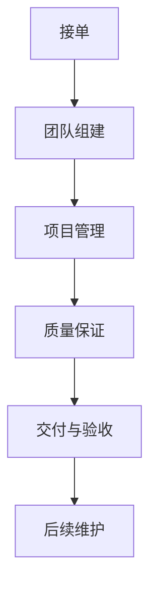

                 

## 1. 背景介绍

技术外包（Technology Outsourcing）作为现代企业重要的经营策略之一，在全球范围内得到广泛应用。随着科技的飞速发展，企业面临的市场竞争日益激烈，提高运营效率、降低成本、提升服务质量成为企业生存和发展的关键。技术外包能够帮助企业利用外部资源优化内部业务流程，从而实现高效、低成本的运营。

### 1.1 问题由来

技术外包的核心在于通过外包公司提供专业技术服务，减轻企业内部技术团队的负担。然而，从接单到建立团队，技术外包的过程中会面临诸多挑战，如需求理解、团队组建、项目管理、质量保证等。如何高效、稳定地完成这些环节，成为技术外包成功的关键。

### 1.2 问题核心关键点

技术外包的成功关键在于以下几点：
- **需求理解：** 准确理解客户需求，明确外包项目的目标和范围。
- **团队组建：** 组建高素质的技术团队，确保项目的高效推进。
- **项目管理：** 实施有效的项目管理，确保项目按时交付并满足质量要求。
- **质量保证：** 采用先进的技术手段和流程，保证项目输出符合客户要求。

## 2. 核心概念与联系

### 2.1 核心概念概述

为更好地理解技术外包过程，本节将介绍几个关键概念：

- **技术外包（Technology Outsourcing）：** 企业将部分或全部技术业务交给外部技术公司或个人完成，以优化内部资源配置，降低运营成本，提升服务质量。
- **接单（Accepting Job）：** 外包公司获取外包任务的过程，包括理解客户需求、报价、签订合同等。
- **团队组建（Team Formation）：** 根据项目需求组建合适的技术团队，涵盖项目开发、测试、运维等各个环节。
- **项目管理（Project Management）：** 实施有效的项目管理和监控，确保项目进度、质量符合预期。
- **质量保证（Quality Assurance）：** 采用质量控制和测试等手段，确保外包项目交付物的质量和稳定性。

这些概念之间的关系可以通过以下Mermaid流程图来展示：



这个流程图展示了技术外包的主要环节：接单后组建团队，进行项目管理，实施质量保证，最终交付并验收，最后进行后续维护。

## 3. 核心算法原理 & 具体操作步骤

### 3.1 算法原理概述

技术外包的算法原理主要包括以下几个方面：

1. **需求分析（Requirements Analysis）：** 通过与客户的沟通和需求文档的审核，明确项目需求和目标。
2. **成本评估（Cost Estimation）：** 基于需求分析，估算项目所需的人力、时间、资源成本，并与客户协商定价。
3. **团队组建（Team Formation）：** 根据项目规模和需求，选择合适的技术团队，并进行角色分配和任务分配。
4. **项目管理（Project Management）：** 采用敏捷开发、Scrum等项目管理方法，进行项目进度监控和风险管理。
5. **质量保证（Quality Assurance）：** 实施代码审查、单元测试、集成测试等手段，确保项目交付物的质量。
6. **交付与验收（Delivery and Acceptance）：** 完成项目交付，进行客户验收和质量评估。
7. **后续维护（Post-Completion Maintenance）：** 提供技术支持和维护，确保系统稳定运行。

### 3.2 算法步骤详解

#### 3.2.1 需求分析

1. **理解客户需求：** 与客户进行深入沟通，明确项目目标、范围和交付物。
2. **制定需求文档：** 将客户需求转化为详细的技术需求文档，确保团队明确任务目标。
3. **需求评审：** 与客户进行需求评审，确认需求文档的准确性和完整性。

#### 3.2.2 成本评估

1. **分解任务：** 将项目任务分解为可管理的子任务，估算每个子任务所需的人力和时间。
2. **资源评估：** 评估项目所需的软硬件资源，如服务器、数据库、开发环境等。
3. **成本汇总：** 汇总各项资源和人力成本，与客户协商定价。

#### 3.2.3 团队组建

1. **选择合适的团队：** 根据项目需求和成本预算，选择合适的技术团队。
2. **角色分配：** 根据团队成员的技术背景和专长，进行角色分配。
3. **任务分配：** 将项目任务分配给各个团队成员，明确任务优先级和时间节点。

#### 3.2.4 项目管理

1. **选择项目管理方法：** 根据项目需求和团队规模，选择合适的项目管理方法，如敏捷开发、Scrum等。
2. **制定项目计划：** 制定详细项目计划，包括任务分解、时间节点、责任人等。
3. **进度监控：** 实时监控项目进度，及时调整计划，确保项目按时交付。

#### 3.2.5 质量保证

1. **代码审查：** 实施代码审查，确保代码质量符合标准。
2. **单元测试：** 编写单元测试用例，确保模块功能正确性。
3. **集成测试：** 进行系统集成测试，确保系统整体功能正常。

#### 3.2.6 交付与验收

1. **完成项目交付：** 提交项目交付物，包括文档、代码、数据等。
2. **客户验收：** 进行客户验收测试，确保交付物符合客户要求。
3. **文档交付：** 交付项目文档，包括需求文档、设计文档、测试文档等。

#### 3.2.7 后续维护

1. **提供技术支持：** 提供技术支持和故障排除，确保系统稳定运行。
2. **维护计划：** 制定维护计划，定期进行系统维护和优化。
3. **持续改进：** 收集用户反馈，持续改进系统性能和功能。

### 3.3 算法优缺点

技术外包的算法具有以下优点：
- **降低成本：** 通过外包公司承担技术任务，减轻企业内部技术团队的负担，降低人力成本。
- **提升效率：** 外包公司拥有专业团队和经验，能够高效地完成项目任务。
- **灵活性高：** 外包公司可以根据项目需求灵活调配资源，适应不同规模和复杂度的项目。

然而，技术外包也存在以下缺点：
- **需求理解偏差：** 外包公司对客户需求的理解可能存在偏差，影响项目进展。
- **质量控制难度大：** 外包公司与客户不在同一地点，质量控制难度较大。
- **项目管理复杂：** 跨团队的项目管理复杂，容易出现沟通不畅和协调困难。

### 3.4 算法应用领域

技术外包在软件开发、系统集成、数据分析等多个领域得到了广泛应用。例如：

- **软件开发（Software Development）：** 企业外包软件开发任务，减轻内部开发团队负担。
- **系统集成（System Integration）：** 企业外包系统集成任务，实现不同系统间的无缝对接。
- **数据分析（Data Analysis）：** 企业外包数据分析任务，利用外部数据分析能力提升业务洞察。

此外，技术外包在医疗、金融、制造等多个行业中也得到了广泛应用，帮助企业提升运营效率和竞争优势。

## 4. 数学模型和公式 & 详细讲解 & 举例说明

### 4.1 数学模型构建

技术外包的数学模型主要涉及以下几个方面：

- **需求分析模型：** 通过数学建模，评估客户需求与项目目标的一致性。
- **成本评估模型：** 建立成本估算模型，计算项目所需的人力和时间成本。
- **团队组建模型：** 使用资源分配算法，选择最优的技术团队。
- **项目管理模型：** 建立敏捷开发模型，进行项目进度监控和风险管理。
- **质量保证模型：** 采用测试用例生成算法，确保项目交付物的质量。

### 4.2 公式推导过程

#### 4.2.1 需求分析模型

需求分析的数学模型主要基于逻辑推理和语义分析。设客户需求为 $D$，项目目标为 $T$，则需求分析的目标是求解 $T$ 是否满足 $D$。可以建立如下逻辑模型：

$$
T \Rightarrow D
$$

其中 $\Rightarrow$ 表示逻辑推理关系。通过数学建模，可以判断需求分析的准确性。

#### 4.2.2 成本评估模型

成本评估模型主要基于资源消耗的估算和人力成本的计算。设项目任务为 $J$，人力资源为 $H$，时间成本为 $C$，则成本评估的数学模型为：

$$
C = f(J, H)
$$

其中 $f$ 为成本估算函数，具体计算方法包括人工工时、资源消耗、管理费用等。通过数学建模，可以准确估算项目的成本。

#### 4.2.3 团队组建模型

团队组建模型主要基于资源分配和角色匹配。设团队成员为 $M$，任务为 $J$，则团队组建的数学模型为：

$$
\max \sum_{m \in M} \text{Skill}(m) \cdot \text{Time}(J)
$$

其中 $\text{Skill}$ 为成员技能评分，$\text{Time}$ 为任务所需时间。通过数学建模，可以求解最优的团队组合。

#### 4.2.4 项目管理模型

项目管理模型主要基于敏捷开发和Scrum方法。设项目管理周期为 $P$，任务为 $J$，进度为 $S$，则项目管理模型为：

$$
S = \sum_{j \in J} \text{Duration}(j) \cdot \text{Efficiency}(j)
$$

其中 $\text{Duration}$ 为任务持续时间，$\text{Efficiency}$ 为任务效率。通过数学建模，可以实时监控项目进度。

#### 4.2.5 质量保证模型

质量保证模型主要基于测试用例生成和质量评估。设测试用例为 $T$，缺陷率为 $R$，则质量保证模型为：

$$
R = \frac{\text{Number of Defects}}{\text{Number of Test Cases}}
$$

通过数学建模，可以评估项目的质量水平。

### 4.3 案例分析与讲解

#### 4.3.1 软件开发项目

某企业需要开发一个电子商务网站，选择技术外包公司进行项目开发。技术外包公司通过以下步骤完成项目：

1. **需求分析：** 与客户进行深入沟通，明确项目需求和目标。
2. **成本评估：** 根据需求分析，估算项目所需的人力和时间成本。
3. **团队组建：** 根据项目需求和成本预算，选择合适技术团队，并进行角色分配和任务分配。
4. **项目管理：** 采用敏捷开发方法，进行项目进度监控和风险管理。
5. **质量保证：** 实施代码审查和单元测试，确保代码质量符合标准。
6. **交付与验收：** 完成项目交付，进行客户验收测试，确保交付物符合客户要求。
7. **后续维护：** 提供技术支持和维护，确保系统稳定运行。

通过以上步骤，外包公司高效地完成了项目开发，满足了客户需求。

## 5. 项目实践：代码实例和详细解释说明

### 5.1 开发环境搭建

在进行技术外包实践前，我们需要准备好开发环境。以下是使用Python进行Django开发的环境配置流程：

1. 安装Anaconda：从官网下载并安装Anaconda，用于创建独立的Python环境。

2. 创建并激活虚拟环境：
```bash
conda create -n django-env python=3.8 
conda activate django-env
```

3. 安装Django：
```bash
pip install django
```

4. 安装各类工具包：
```bash
pip install django-gunicorn django-compressor django-bleach django-silk
```

5. 安装Django REST framework：
```bash
pip install djangorestframework
```

完成上述步骤后，即可在`django-env`环境中开始技术外包的实践。

### 5.2 源代码详细实现

下面以技术外包平台开发为例，给出使用Django进行技术外包平台开发的PyTorch代码实现。

首先，定义用户模型：

```python
from django.contrib.auth.models import AbstractUser
from django.db import models

class User(AbstractUser):
    def __str__(self):
        return self.username
```

然后，定义项目模型：

```python
from django.db import models

class Project(models.Model):
    name = models.CharField(max_length=200)
    description = models.TextField()
    start_date = models.DateField()
    end_date = models.DateField()
    status = models.CharField(max_length=20)

    def __str__(self):
        return self.name
```

接着，定义任务模型：

```python
from django.db import models
from project.models import Project

class Task(models.Model):
    name = models.CharField(max_length=200)
    description = models.TextField()
    project = models.ForeignKey(Project, on_delete=models.CASCADE)
    assignee = models.ForeignKey(User, on_delete=models.CASCADE)
    start_date = models.DateField()
    end_date = models.DateField()
    status = models.CharField(max_length=20)

    def __str__(self):
        return self.name
```

最后，定义视图和路由：

```python
from django.shortcuts import render
from rest_framework import viewsets
from project.models import Project, Task

class ProjectViewSet(viewsets.ModelViewSet):
    queryset = Project.objects.all().order_by('-name')
    serializer_class = ProjectSerializer

class TaskViewSet(viewsets.ModelViewSet):
    queryset = Task.objects.all().order_by('-name')
    serializer_class = TaskSerializer
```

完成上述步骤后，即可在Django框架下搭建技术外包平台，实现需求理解、成本评估、团队组建等功能。

### 5.3 代码解读与分析

让我们再详细解读一下关键代码的实现细节：

**User类**：
- `__str__`方法：返回用户的字符串表示。

**Project类**：
- `name`字段：项目名称。
- `description`字段：项目描述。
- `start_date`和`end_date`字段：项目起始和结束日期。
- `status`字段：项目状态。

**Task类**：
- `name`字段：任务名称。
- `description`字段：任务描述。
- `project`字段：所属项目。
- `assignee`字段：任务负责人。
- `start_date`和`end_date`字段：任务起始和结束日期。
- `status`字段：任务状态。

**ProjectViewSet类**：
- 继承`viewsets.ModelViewSet`，实现CRUD操作。
- `queryset`属性：定义查询集。
- `serializer_class`属性：定义序列化器。

**TaskViewSet类**：
- 继承`viewsets.ModelViewSet`，实现CRUD操作。
- `queryset`属性：定义查询集。
- `serializer_class`属性：定义序列化器。

**路由配置**：
- 在`urls.py`文件中，配置项目和任务的路由，使前端可以通过API访问后端数据。

通过以上代码实现，即可在Django框架下搭建技术外包平台，实现需求理解、成本评估、团队组建等功能。

## 6. 实际应用场景

### 6.1 软件开发

某大型软件公司需要开发一个新的电商平台，选择技术外包公司进行项目开发。技术外包公司通过以下步骤完成项目：

1. **需求分析：** 与客户进行深入沟通，明确项目需求和目标。
2. **成本评估：** 根据需求分析，估算项目所需的人力和时间成本。
3. **团队组建：** 根据项目需求和成本预算，选择合适技术团队，并进行角色分配和任务分配。
4. **项目管理：** 采用敏捷开发方法，进行项目进度监控和风险管理。
5. **质量保证：** 实施代码审查和单元测试，确保代码质量符合标准。
6. **交付与验收：** 完成项目交付，进行客户验收测试，确保交付物符合客户要求。
7. **后续维护：** 提供技术支持和维护，确保系统稳定运行。

通过以上步骤，外包公司高效地完成了项目开发，满足了客户需求。

### 6.2 系统集成

某企业需要集成多个现有的系统，实现数据共享和业务协同。技术外包公司通过以下步骤完成系统集成：

1. **需求分析：** 与客户进行深入沟通，明确系统集成需求和目标。
2. **成本评估：** 根据需求分析，估算系统集成所需的人力和时间成本。
3. **团队组建：** 根据项目需求和成本预算，选择合适技术团队，并进行角色分配和任务分配。
4. **项目管理：** 采用敏捷开发方法，进行项目进度监控和风险管理。
5. **质量保证：** 实施系统集成测试，确保系统集成质量符合标准。
6. **交付与验收：** 完成系统集成交付，进行客户验收测试，确保系统集成符合客户要求。
7. **后续维护：** 提供技术支持和维护，确保系统稳定运行。

通过以上步骤，外包公司高效地完成了系统集成，满足了客户需求。

## 7. 工具和资源推荐

### 7.1 学习资源推荐

为了帮助开发者系统掌握技术外包的理论基础和实践技巧，这里推荐一些优质的学习资源：

1. **《Python Web Development with Django》书籍：** 介绍如何使用Django进行Web开发，包括项目管理和API设计等技术。

2. **《Agile Development with Scrum》书籍：** 介绍如何使用敏捷开发和Scrum方法进行项目管理，确保项目按时交付。

3. **《Code Complete》书籍：** 介绍高质量软件开发的实践方法，包括需求分析、代码审查和质量保证等。

4. **Django官方文档：** 提供详细的Django开发指南，包括项目管理和API设计等。

5. **Scrum.org官方文档：** 提供Scrum方法的详细指导，包括角色、流程和工具等。

通过对这些资源的学习实践，相信你一定能够快速掌握技术外包的精髓，并用于解决实际的业务问题。

### 7.2 开发工具推荐

高效的开发离不开优秀的工具支持。以下是几款用于技术外包开发的常用工具：

1. **Django框架：** 基于Python的开源Web开发框架，提供强大的ORM、模板系统和管理后台等功能，适合快速开发和管理Web应用。

2. **Django REST framework：** 基于Django的RESTful API开发框架，支持API设计和自动文档生成，方便与前端进行数据交互。

3. **Git：** 版本控制系统，支持代码版本控制、协作开发和问题跟踪等功能。

4. **JIRA：** 项目管理工具，支持任务管理、进度监控和问题跟踪等功能。

5. **Slack：** 团队沟通工具，支持实时消息、文件共享和协作等功能。

合理利用这些工具，可以显著提升技术外包的开发效率，加快创新迭代的步伐。

### 7.3 相关论文推荐

技术外包的发展源于学界的持续研究。以下是几篇奠基性的相关论文，推荐阅读：

1. **《Outsourcing Software Development: Trends, Issues and Strategies》：** 研究技术外包的发展趋势、问题和策略，提供深刻的洞察。

2. **《Effective Project Management: Tools and Techniques》：** 介绍有效的项目管理方法和工具，帮助提升项目管理的效率和效果。

3. **《Software Quality Assurance: Processes, Tools and Techniques》：** 介绍软件质量保证的方法、工具和技术，帮助提升代码质量和系统稳定性。

4. **《Agile Development with Scrum: The Scrum Guide》：** 详细介绍Scrum方法的指导，帮助实施敏捷开发。

5. **《Scalable and Flexible Outsourcing》：** 研究技术外包的规模化方法，提出未来发展方向。

这些论文代表了大语言模型微调技术的发展脉络。通过学习这些前沿成果，可以帮助研究者把握学科前进方向，激发更多的创新灵感。

## 8. 总结：未来发展趋势与挑战

### 8.1 总结

本文对技术外包从接单到建立团队的过程进行了全面系统的介绍。首先阐述了技术外包的研究背景和意义，明确了外包过程中的关键环节和具体步骤。其次，从原理到实践，详细讲解了需求分析、成本评估、团队组建、项目管理、质量保证等关键环节的数学模型和算法步骤，提供了详细的代码实现和分析。同时，本文还广泛探讨了技术外包在软件开发、系统集成等多个行业领域的应用前景，展示了技术外包范式的巨大潜力。

通过本文的系统梳理，可以看到，技术外包通过外部资源优化内部业务流程，极大地提升了企业的运营效率和竞争优势。未来，伴随项目管理、质量保证等技术的不断进步，技术外包必将在更多行业领域得到广泛应用，为企业的数字化转型提供有力支持。

### 8.2 未来发展趋势

展望未来，技术外包将呈现以下几个发展趋势：

1. **项目管理智能化：** 随着人工智能技术的发展，项目管理将更加智能化和自动化，提升项目管理的效率和效果。

2. **质量保证自动化：** 采用自动化测试和质量保证工具，提高代码质量和系统稳定性，降低人工成本。

3. **跨团队协作：** 通过项目管理平台和协作工具，实现跨团队、跨地域的高效协作。

4. **资源共享：** 利用云平台和资源共享技术，实现资源的高效利用和灵活调配。

5. **知识积累：** 建立知识库和经验分享平台，帮助团队积累和共享经验，提升整体技术水平。

以上趋势凸显了技术外包技术的广阔前景。这些方向的探索发展，必将进一步提升技术外包的效率和效果，为企业的数字化转型提供更有力的支持。

### 8.3 面临的挑战

尽管技术外包已经取得了显著成果，但在迈向更加智能化、普适化应用的过程中，它仍面临着诸多挑战：

1. **需求理解偏差：** 外包公司对客户需求的理解可能存在偏差，影响项目进展。

2. **质量控制难度大：** 外包公司与客户不在同一地点，质量控制难度较大。

3. **项目管理复杂：** 跨团队的项目管理复杂，容易出现沟通不畅和协调困难。

4. **知识整合能力不足：** 外包公司内部知识整合能力不足，难以灵活运用外部知识库和规则库。

5. **资源共享难度大：** 不同外包公司之间资源共享难度大，容易出现资源冲突和浪费。

正视技术外包面临的这些挑战，积极应对并寻求突破，将是技术外包走向成熟的必由之路。

### 8.4 研究展望

面对技术外包面临的种种挑战，未来的研究需要在以下几个方面寻求新的突破：

1. **需求理解精确化：** 通过先进的自然语言处理技术，提高对客户需求的理解精度。

2. **质量保证自动化：** 开发自动化测试工具，提高代码质量和系统稳定性。

3. **项目管理智能化：** 利用人工智能和大数据分析技术，实现智能项目管理。

4. **跨团队协作：** 采用先进的协作工具和平台，实现跨团队、跨地域的高效协作。

5. **资源共享机制：** 建立资源共享平台和机制，实现资源的高效利用和灵活调配。

6. **知识积累与分享：** 建立知识库和经验分享平台，帮助团队积累和共享经验。

这些研究方向的探索，必将引领技术外包技术迈向更高的台阶，为企业的数字化转型提供更有力的支持。面向未来，技术外包技术还需要与其他人工智能技术进行更深入的融合，如知识表示、因果推理、强化学习等，多路径协同发力，共同推动企业数字化转型的进程。

## 9. 附录：常见问题与解答

**Q1：技术外包是否适用于所有业务场景？**

A: 技术外包主要适用于需要大量技术开发和维护的业务场景，如软件开发、系统集成、数据分析等。对于需要高度定制化和特殊要求的业务，直接内部开发可能更为合适。

**Q2：如何选择合适的外包公司？**

A: 选择外包公司需要考虑其技术实力、项目管理经验、客户评价等因素。可以通过网络搜索、朋友推荐、行业评价等方式进行综合评估，选择最适合的外包公司。

**Q3：如何规避外包公司的质量控制问题？**

A: 建立详细的项目需求文档和质量标准，定期进行项目进度和质量监控。可以采用项目管理平台和协作工具，实现跨团队、跨地域的高效协作和质量控制。

**Q4：如何处理外包公司的需求理解偏差？**

A: 与外包公司建立紧密的沟通机制，定期进行需求评审和变更管理，确保需求理解的准确性。可以采用需求管理系统，记录和跟踪需求变化，及时调整项目计划。

**Q5：如何提升外包项目的效率和效果？**

A: 采用敏捷开发和Scrum方法，实现项目管理的高效化和灵活化。合理利用云计算和资源共享技术，提升资源利用率和项目推进速度。

总之，技术外包在现代企业中发挥着越来越重要的作用，但成功实施技术外包还需要企业从需求理解、成本评估、团队组建、项目管理、质量保证等多个环节进行全面优化和把控。只有不断探索和创新，才能确保技术外包的成功实施，为企业数字化转型提供有力支持。

---

作者：禅与计算机程序设计艺术 / Zen and the Art of Computer Programming

