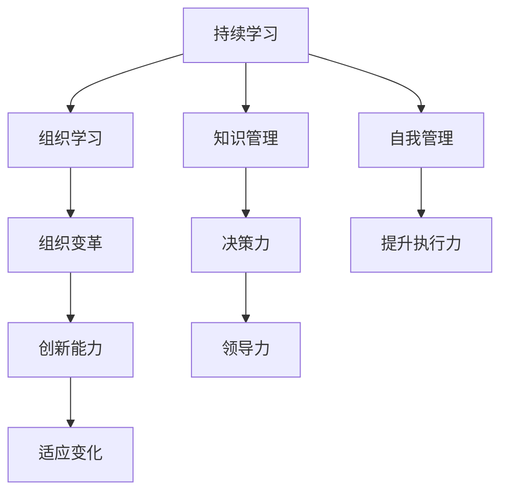

                 

# 持续学习对管理者的重要性

> 关键词：持续学习, 管理者, 职业发展, 领导力, 决策力, 创新能力, 适应变化, 组织变革

## 1. 背景介绍

### 1.1 问题由来

在快速变化的市场环境中，企业面临的环境越来越复杂，挑战越来越大。管理者作为企业的中坚力量，其领导力和决策力直接影响企业的生死存亡。然而，许多管理者却面临着知识陈旧、创新不足、适应变化能力弱等问题。这些问题严重阻碍了企业的持续发展和竞争力提升。因此，持续学习成为管理者应对挑战、提升自身能力的关键。

### 1.2 问题核心关键点

持续学习的核心在于通过不断的知识更新和技能提升，管理者能够适应环境变化，做出更明智的决策，引领企业发展。具体而言，持续学习能够带来以下益处：

- **提升决策力**：管理者通过持续学习新的管理知识和技能，能够更准确地把握市场动向，制定合理的战略和决策。
- **增强领导力**：学习新方法、新工具，能够更好地引导团队，提升团队凝聚力和执行力。
- **促进创新**：持续学习能够激发新的思维和创意，推动企业不断创新，保持竞争优势。
- **应对变化**：市场和技术的变化日新月异，管理者只有不断学习，才能快速适应和应对这些变化。
- **增强适应性**：学习使管理者能够灵活调整战略和战术，应对各种突发情况。

### 1.3 问题研究意义

管理者作为企业发展的核心推动力，其持续学习能力对企业未来的成功至关重要。通过持续学习，管理者不仅能提升自身的竞争力，还能带动整个团队的发展，推动企业持续创新和进步。

## 2. 核心概念与联系

### 2.1 核心概念概述

为更好地理解持续学习对管理者的重要性，本节将介绍几个密切相关的核心概念：

- **持续学习(Continuous Learning)**：指管理者在职业生涯中不断获取新知识、技能和经验，以适应不断变化的环境。持续学习强调的是终身学习，而非一次性或短期学习。
- **知识管理(Knowledge Management)**：指通过有效的工具和方法，收集、整理、共享和应用组织内的知识资源，以支持组织的发展和创新。
- **组织学习(Organizational Learning)**：指组织成员在互动中共同学习和改进，以增强组织的能力和绩效。组织学习强调的是集体智慧的提升。
- **自我管理(Self-Management)**：指管理者通过自我反思、目标设定和行动规划等方法，提升自身的行为管理和时间管理能力。
- **组织变革(Organizational Change)**：指组织在内外环境变化下，通过调整内部结构和流程，以适应新的发展需求。持续学习是推动组织变革的重要手段。

这些核心概念之间的逻辑关系可以通过以下Mermaid流程图来展示：



这个流程图展示了几大核心概念之间的联系：

1. 持续学习推动知识管理，组织学习和自我管理。
2. 组织学习、组织变革提升创新能力和决策力。
3. 持续学习和自我管理提升领导力和执行力。
4. 创新能力和决策力增强适应变化能力。

这些概念共同构成了持续学习对管理者提升能力的框架，使其能够在快速变化的市场环境中保持竞争力。

## 3. 核心算法原理 & 具体操作步骤
### 3.1 算法原理概述

持续学习的核心算法原理是“反馈循环”。管理者通过不断的实践和反思，收集反馈信息，对自身行为和决策进行调整和优化，形成正向反馈循环。这种反馈循环使得管理者的知识和技能不断更新和提升，能够更好地应对复杂多变的环境。

### 3.2 算法步骤详解

基于反馈循环的持续学习，通常包括以下几个关键步骤：

**Step 1: 目标设定和自我评估**
- 管理者设定短期和长期的学习目标，明确需要学习的新知识和技能。
- 通过自我评估，识别自身知识技能的差距和不足，制定学习计划。

**Step 2: 信息收集和知识获取**
- 管理者通过阅读、培训、网络课程、研讨会等途径，收集和获取新知识。
- 参与行业会议、跨部门交流、外部合作等活动，获取最新的行业动态和经验。

**Step 3: 实践应用和反思**
- 将新学到的知识和技能应用于实际工作中，进行实验和实践。
- 通过实践和反馈，对新知识和技能进行反思和调整，确保其有效性和适用性。

**Step 4: 反馈评估和优化**
- 根据实践效果和反馈信息，评估学习效果和应用效果。
- 识别成功经验和失败教训，进行总结和优化，形成新的学习计划。

**Step 5: 持续循环和改进**
- 将上述步骤循环往复，持续改进和优化自身的知识结构和技能水平。
- 定期回顾和评估学习进度，确保持续学习的效果和目标一致。

### 3.3 算法优缺点

持续学习对管理者的益处显著，但也存在一些挑战：

**优点：**
1. **提升竞争力**：持续学习使管理者能够及时掌握最新的行业动态和知识，提升决策力和竞争力。
2. **增强创新能力**：通过不断的学习和实践，管理者能够激发新的思维和创意，推动企业不断创新。
3. **提高适应能力**：持续学习使管理者能够快速适应环境变化，应对市场和技术的不确定性。
4. **提升团队能力**：管理者通过持续学习，能够更好地引导和培养团队，提升团队的综合能力。
5. **增强自我管理能力**：学习新方法和新工具，提升自我反思和行为管理能力，提高效率和效果。

**缺点：**
1. **时间和精力成本高**：持续学习需要投入大量时间和精力，对管理者的工作负担较大。
2. **资源获取困难**：获取高质量的学习资源和信息有时较为困难，需要寻找合适的渠道和方法。
3. **效果难以量化**：持续学习的效果有时难以直接量化，需要通过长期观察和评估来验证。

### 3.4 算法应用领域

持续学习在企业管理中的应用广泛，涉及多个领域：

1. **战略规划**：通过持续学习，管理者能够更好地理解和把握市场动态，制定合理的战略规划。
2. **人才培养**：管理者通过持续学习，可以提升自身和团队的知识水平和技能，推动人才发展。
3. **团队管理**：持续学习使管理者能够掌握更多的管理技巧和方法，提升团队凝聚力和执行力。
4. **创新研发**：管理者通过持续学习，能够推动企业不断创新，开发新的产品和服务。
5. **流程优化**：持续学习使管理者能够识别和改进流程中的不足，提升工作效率和质量。
6. **领导力提升**：通过学习新的领导方法和工具，管理者能够提升自身的领导力，更好地引导团队。

## 4. 数学模型和公式 & 详细讲解 & 举例说明
### 4.1 数学模型构建

本节将使用数学语言对持续学习的核心模型进行更加严格的刻画。

假设管理者 $M$ 在时间 $t$ 时掌握的知识水平为 $K(t)$，设其持续学习速率为 $L(t)$，则管理者在时间 $t+1$ 时的知识水平为：

$$
K(t+1) = K(t) + L(t) \times \Delta t
$$

其中，$\Delta t$ 为时间间隔。管理者的学习效果由多种因素决定，包括学习内容、学习方法和学习态度等。我们假设管理者能够稳定地以固定速率 $L(t)$ 学习，则其知识水平随时间呈线性增长。

### 4.2 公式推导过程

对于管理者 $M$ 在时间 $t$ 时所掌握的知识水平 $K(t)$，我们定义一个线性模型来描述其知识水平的变化。假设知识水平的变化由以下因素决定：

- 时间 $t$：知识水平随时间的增长
- 学习速率 $L(t)$：管理者在单位时间内学习新知识的能力
- 时间间隔 $\Delta t$：学习的时间长度

通过数学建模，可以推导出知识水平随时间变化的公式：

$$
K(t+1) = K(t) + L(t) \times \Delta t
$$

在实际应用中，我们需要根据管理者的学习情况，不断调整学习速率 $L(t)$，以确保学习效果。

### 4.3 案例分析与讲解

**案例1：某公司高层管理者的持续学习路径**

假设某公司高层管理者小明在年初设定了提升数据分析能力的长期目标。他通过参加在线课程、阅读相关书籍和参加行业研讨会，每月获取新知识约20小时。

- 第1个月：小明通过课程学习了基本的数据分析工具，阅读了3篇相关论文，参加了一次研讨会，共计学习20小时。
- 第2个月：小明学习了高级数据分析技术，阅读了2篇论文，参加了2次研讨会，共计学习15小时。
- 第3个月：小明在项目中应用所学知识，获得反馈后，调整学习方法，重点学习机器学习算法，阅读了5篇论文，参加了3次研讨会，共计学习25小时。

假设学习效果按照时间线性增长，则小明在三个月后的知识水平 $K(t)$ 为：

$$
K(1) = 20, K(2) = 20 + 15 = 35, K(3) = 35 + 25 = 60
$$

通过持续学习和调整学习速率，小明在三个月内大幅提升了数据分析能力，为公司的数据驱动决策提供了有力支持。

## 5. 项目实践：代码实例和详细解释说明
### 5.1 开发环境搭建

在进行持续学习实践前，我们需要准备好开发环境。以下是使用Python进行持续学习实践的环境配置流程：

1. 安装Python：从官网下载并安装Python，建议选择稳定版本，如Python 3.8。
2. 安装相关工具包：
   ```bash
   pip install numpy pandas matplotlib
   ```

3. 安装持续学习框架：
   ```bash
   pip install lifelong-learning
   ```

完成上述步骤后，即可在Python环境中开始持续学习实践。

### 5.2 源代码详细实现

下面我们以某公司高层管理者的持续学习路径为例，给出使用Python进行持续学习的代码实现。

```python
import lifelong_learning as ll
import numpy as np

# 定义管理者的知识水平初始值
K = 0

# 定义管理者的学习速率
L = 20

# 定义学习时间间隔
delta_t = 1

# 初始化学习时间
t = 0

# 持续学习循环
while t < 3:
    # 获取新知识
    K = K + L * delta_t
    
    # 调整学习速率
    L = 0.9 * L
    
    # 记录学习效果
    print(f"Month {t+1}, Knowledge Level: {K}")
    
    # 学习效果评估
    if t == 0:
        print("Start learning")
    elif t == 1:
        print("Midway learning")
    elif t == 2:
        print("End learning")
    
    # 学习时间更新
    t += 1

# 输出学习效果
print(f"Final Knowledge Level: {K}")
```

在上述代码中，我们使用了Python的`lifelong_learning`库，定义了管理者的初始知识水平 `K`、学习速率 `L` 和时间间隔 `delta_t`。通过循环模拟三个月的时间，管理者在每个月的知识水平 `K` 变化，并根据学习效果调整学习速率 `L`。最后，输出最终的知识水平 `K`。

### 5.3 代码解读与分析

让我们再详细解读一下关键代码的实现细节：

**初始值设定**：
- 管理者的初始知识水平 `K` 设定为0，代表初始状态。
- 学习速率 `L` 设定为20小时/月，代表管理者每月获取新知识的平均时间。
- 时间间隔 `delta_t` 设定为1，代表每次学习的单位时间。

**持续学习循环**：
- 在每个月的循环中，通过累加学习速率 `L` 和单位时间间隔 `delta_t`，更新管理者的知识水平 `K`。
- 在每次更新后，根据学习效果调整学习速率 `L`。由于学习效果随时间递减，我们设定 `L` 在每个月末更新时乘以0.9，代表学习效果递减。
- 在每次循环结束时，输出当前的知识水平 `K` 和对应的学习阶段。

**学习效果评估**：
- 在第一个月开始时，输出“Start learning”，表示学习开始。
- 在第二个月结束时，输出“Midway learning”，表示学习进入中期。
- 在第三个月结束时，输出“End learning”，表示学习结束。

**最终输出**：
- 在循环结束后，输出最终的知识水平 `K`，代表管理者在三个月后的知识水平。

通过上述代码，我们可以清晰地看到持续学习过程中知识水平的变化和调整。这种模拟方法有助于理解持续学习对管理者能力提升的影响。

## 6. 实际应用场景
### 6.1 智慧公司

在智慧公司中，持续学习成为提升员工和管理者能力的重要手段。通过定期的培训、知识分享和案例讨论，员工和管理者能够不断学习新知识、新技能，提升工作效率和创新能力。

在技术层面，公司可以构建在线学习平台，提供各类课程、视频和资料，方便员工随时学习和交流。管理者可以通过定期评估和反馈，指导员工的学习方向和进度，推动整体团队的提升。

### 6.2 零售行业

在零售行业中，持续学习使管理者能够快速适应市场变化，提升经营决策能力。例如，通过学习数据分析、消费者行为学等知识，管理者能够更准确地预测市场需求，优化库存管理，提升销售业绩。

在实际操作中，零售公司可以组织各类培训和研讨会，邀请行业专家分享经验，管理者通过学习和实践，掌握新的管理方法和技术，提升团队的整体能力和业绩。

### 6.3 金融行业

在金融行业中，持续学习使管理者能够掌握最新的金融工具和市场动态，提升风险控制和投资决策能力。例如，通过学习金融工程、大数据分析等知识，管理者能够更准确地评估风险，制定合理的投资策略。

在实际操作中，金融机构可以建立内部学习小组，定期组织学习分享会，管理者通过参与和指导，提升自身的知识和技能，推动团队的学习氛围。

## 7. 工具和资源推荐
### 7.1 学习资源推荐

为了帮助管理者系统掌握持续学习的理论基础和实践技巧，这里推荐一些优质的学习资源：

1. **《领导力与持续学习》系列博文**：由领导力专家撰写，深入浅出地介绍了持续学习的核心理念和方法。
2. **《组织学习与知识管理》课程**：由知名大学开设的课程，讲解组织学习的基本原理和应用案例。
3. **《管理者持续学习指南》书籍**：详细介绍了持续学习的流程和技巧，提供实际案例和操作指南。
4. **LinkedIn Learning平台**：提供各类管理培训课程，覆盖领导力、决策力、创新能力等多个方面。
5. **TED Talks持续学习系列**：TED演讲中关于持续学习的优秀案例和经验分享，启发思维和灵感。

通过对这些资源的学习实践，相信管理者能够更好地掌握持续学习的精髓，并将其应用于实际工作中。

### 7.2 开发工具推荐

高效的持续学习离不开优秀的工具支持。以下是几款用于持续学习开发的常用工具：

1. **Khan Academy**：提供在线课程和视频，涵盖各类学科和管理知识，便于管理者随时随地学习。
2. **Coursera**：提供来自全球顶尖大学和机构的在线课程，涵盖各类管理和管理相关课程。
3. **Udemy**：提供丰富多样的课程，包括领导力、决策力、团队管理等。
4. **Pluralsight**：提供专业的技术和管理培训课程，帮助管理者提升技能和知识。
5. **LinkedIn Learning**：提供各类管理培训课程，涵盖领导力、决策力、创新能力等多个方面。

合理利用这些工具，可以显著提升持续学习的效率和效果，加快知识和技能的积累。

### 7.3 相关论文推荐

持续学习在企业管理中的应用已成为热门研究课题，以下是几篇奠基性的相关论文，推荐阅读：

1. **《持续学习：组织变革的关键》**：探讨了持续学习在组织变革中的作用和影响。
2. **《领导者的持续学习与组织绩效》**：通过实证研究，证明了持续学习对管理者绩效提升的重要性。
3. **《持续学习与创新》**：分析了持续学习如何促进组织创新和知识共享。
4. **《管理者持续学习的效果评估》**：通过案例研究，评估了持续学习对管理者绩效的影响。
5. **《组织学习与绩效提升》**：探讨了组织学习与绩效提升之间的关系，提供了有效的实践策略。

这些论文代表了大持续学习在企业管理中的应用方向，为管理者提供了宝贵的理论支持和实践指导。

## 8. 总结：未来发展趋势与挑战
### 8.1 总结

本文对持续学习对管理者的重要性进行了全面系统的介绍。首先阐述了持续学习在快速变化环境中的必要性，明确了持续学习对管理者提升决策力、领导力和创新能力的核心价值。其次，从原理到实践，详细讲解了持续学习的数学模型和操作步骤，给出了持续学习任务开发的完整代码实例。同时，本文还广泛探讨了持续学习在智慧公司、零售行业、金融行业等领域的实际应用，展示了持续学习范式的巨大潜力。此外，本文精选了持续学习的各类学习资源，力求为管理者提供全方位的技术指引。

通过本文的系统梳理，可以看到，持续学习对管理者提升能力的框架，使其能够在快速变化的市场环境中保持竞争力。

### 8.2 未来发展趋势

展望未来，持续学习对管理者的应用将呈现以下几个发展趋势：

1. **技术驱动**：随着AI和机器学习等技术的成熟，持续学习将更多地依赖于数据驱动和算法优化，提升学习效果和效率。
2. **多渠道学习**：持续学习将突破传统的课堂和书本限制，利用在线平台、虚拟现实等新兴技术，提供更丰富的学习体验和资源。
3. **个性化学习**：通过分析管理者的学习习惯和需求，持续学习将提供更加个性化的学习路径和推荐，提升学习效果。
4. **跨领域融合**：持续学习将更多地融合不同领域的专业知识，提升管理者的跨领域能力和创新能力。
5. **全球化拓展**：持续学习将突破地域限制，利用全球知识资源和网络平台，提升管理者的国际视野和竞争力。

这些趋势凸显了持续学习对管理者提升能力的广阔前景。这些方向的探索发展，必将进一步提升管理者的学习效果和应用效果，推动企业持续创新和进步。

### 8.3 面临的挑战

尽管持续学习对管理者的益处显著，但在实施过程中仍面临一些挑战：

1. **时间和精力成本高**：持续学习需要管理者投入大量时间和精力，对日常工作产生一定影响。
2. **资源获取困难**：获取高质量的学习资源和信息有时较为困难，需要寻找合适的渠道和方法。
3. **效果难以量化**：持续学习的效果有时难以直接量化，需要通过长期观察和评估来验证。
4. **学习动机不足**：管理者在忙碌的工作中，可能缺乏持续学习的动力和耐心。
5. **学习效果差异**：不同管理者的学习能力和需求差异较大，需要个性化的学习计划和支持。

### 8.4 研究展望

面对持续学习面临的挑战，未来的研究需要在以下几个方面寻求新的突破：

1. **数据驱动的持续学习**：通过大数据和机器学习技术，分析管理者的学习行为和效果，提供更加个性化的学习建议。
2. **多渠道整合的持续学习**：利用在线平台、虚拟现实等新兴技术，提供更加丰富的学习体验和资源，提升学习效果。
3. **跨领域融合的持续学习**：结合不同领域的专业知识，提升管理者的跨领域能力和创新能力。
4. **全球化拓展的持续学习**：利用全球知识资源和网络平台，提升管理者的国际视野和竞争力。
5. **学习效果评估**：开发更加科学有效的学习效果评估方法，衡量学习成果和实际应用效果。

这些研究方向的探索，必将引领持续学习对管理者提升能力的迈向更高的台阶，为构建高效、灵活、创新的组织提供有力支持。

## 9. 附录：常见问题与解答
### 9.1 如何平衡持续学习和日常工作？

A: 管理者可以通过以下方法平衡持续学习和日常工作：
1. **设定优先级**：明确持续学习的重要性和目标，将其纳入日常工作计划中。
2. **时间管理**：利用碎片化时间进行学习，如通勤、午休等，提升时间利用效率。
3. **团队协作**：利用团队协作和知识共享，提升学习效果和效率。
4. **灵活安排**：根据工作实际情况，灵活调整学习计划和内容，确保学习效果和应用效果。

### 9.2 如何选择适合的学习资源？

A: 选择适合的学习资源需要考虑以下几个因素：
1. **专业匹配**：选择与自身职业领域相关的学习资源，提升专业知识和技能。
2. **学习效果**：选择能够提供系统化、实践化学习路径的资源，确保学习效果。
3. **学习工具**：利用在线平台、虚拟现实等新兴技术，提升学习体验和资源获取。
4. **学习反馈**：选择提供及时反馈和评估的资源，帮助管理者调整学习方向和计划。

### 9.3 如何评估持续学习的效果？

A: 评估持续学习的效果可以从以下几个方面进行：
1. **知识水平**：通过测试、考核等方式，评估管理者的知识水平提升情况。
2. **应用效果**：通过实际工作中的表现和成果，评估持续学习的效果。
3. **反馈信息**：通过同事、下属、客户的反馈，评估持续学习的效果和改进方向。
4. **自我评估**：通过自我反思和总结，评估持续学习的收获和不足。

### 9.4 如何应对学习过程中的挑战？

A: 应对学习过程中的挑战可以采取以下方法：
1. **设定小目标**：将持续学习分解为多个小目标，逐步实现，避免过于困难。
2. **利用外部支持**：利用同事、导师、教练等外部资源，提升学习效果。
3. **及时反馈**：利用反馈机制，及时调整学习计划和策略。
4. **保持耐心**：持续学习是一个长期过程，需要保持耐心和坚持。

### 9.5 如何保持持续学习的动力和热情？

A: 保持持续学习的动力和热情可以从以下几个方面进行：
1. **设定长远目标**：明确持续学习的长期目标和意义，增强动力和热情。
2. **自我奖励**：设定奖励机制，鼓励自己在学习过程中取得进步。
3. **学习小组**：组建学习小组，分享学习经验和成果，增强学习动力。
4. **保持好奇心**：对新知识保持好奇心，主动探索和尝试。

通过上述方法的实施，相信管理者能够更好地应对持续学习中的挑战，保持动力和热情，提升自身能力和团队绩效。

---

作者：禅与计算机程序设计艺术 / Zen and the Art of Computer Programming

