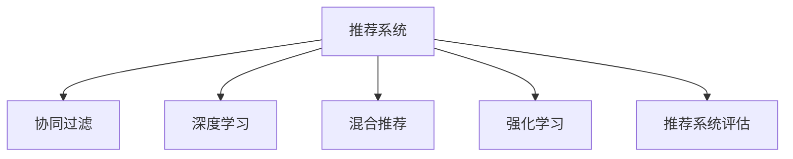

                 

# 推荐系统(Recommender Systems) - 原理与代码实例讲解

> 关键词：推荐系统,协同过滤,深度学习,混合推荐,强化学习,代码实例,深度神经网络,特征工程

## 1. 背景介绍

### 1.1 问题由来

推荐系统作为互联网时代最重要的应用之一，通过分析用户行为和兴趣，为用户推荐可能感兴趣的产品或内容。随着电商、媒体、社交、娱乐等行业的发展，推荐系统已成为提升用户体验、增加收入的重要手段。

推荐系统的主要挑战在于：
- 处理海量用户行为数据，提取用户隐式偏好。
- 应对数据稀疏性和噪声问题，提高推荐精度。
- 结合多样化的业务场景，设计差异化的推荐策略。
- 应对动态变化的用户需求，实现实时更新。
- 保证推荐的公平性和多样性，避免偏见和单调。

推荐系统的研究与应用，涉及多个交叉学科，包括数据挖掘、机器学习、统计学、认知科学、心理学等。该领域的理论和实践，是现代社会数字化转型的重要基石。

### 1.2 问题核心关键点

推荐系统的核心在于如何高效地获取用户兴趣，并将其转化为个性化推荐。主流的方法包括：

1. **协同过滤**：通过分析用户之间的相似性，推荐用户可能感兴趣的其他商品或内容。常用的方法有基于用户的协同过滤和基于项目的协同过滤。
2. **深度学习**：使用神经网络模型，直接从用户行为数据中学习出隐式特征，进行个性化推荐。目前常用神经网络模型包括FM、DNN、CTR等。
3. **混合推荐**：结合多种推荐算法，发挥各自优势，提高推荐效果。常用的混合策略包括加权平均、堆叠学习等。
4. **强化学习**：通过在线学习用户的点击反馈，动态调整推荐策略，提升用户体验和系统收益。常用的强化学习算法包括Q-learning、SARSA等。
5. **推荐系统评估**：设计多种指标，如NDCG、DCG、HR等，用于评估推荐效果。

## 2. 核心概念与联系

### 2.1 核心概念概述

为更好地理解推荐系统的核心原理和架构，本节将介绍几个密切相关的核心概念：

- **推荐系统(Recommender System)**：根据用户历史行为或兴趣，为用户推荐商品或内容的技术。
- **协同过滤(Collaborative Filtering)**：通过分析用户之间的相似性，推荐用户可能感兴趣的其他商品或内容。
- **深度学习(Deep Learning)**：使用神经网络模型，直接从用户行为数据中学习出隐式特征，进行个性化推荐。
- **混合推荐(Hybrid Recommender System)**：结合多种推荐算法，发挥各自优势，提高推荐效果。
- **强化学习(Reinforcement Learning)**：通过在线学习用户的点击反馈，动态调整推荐策略，提升用户体验和系统收益。
- **推荐系统评估(Recommender System Evaluation)**：设计多种指标，如NDCG、DCG、HR等，用于评估推荐效果。

这些核心概念之间的逻辑关系可以通过以下Mermaid流程图来展示：



这个流程图展示推荐系统的核心概念及其之间的关系：

1. 推荐系统通过协同过滤、深度学习、混合推荐、强化学习等多种方式获取用户兴趣。
2. 协同过滤和深度学习分别从用户相似性和行为数据中提取特征，用于推荐。
3. 混合推荐结合多种算法，综合发挥各自优势，提升推荐效果。
4. 强化学习通过用户反馈实时调整推荐策略，实现个性化推荐。
5. 推荐系统评估通过多种指标，检验推荐效果。

## 3. 核心算法原理 & 具体操作步骤

### 3.1 算法原理概述

推荐系统的主流算法包括协同过滤、深度学习、混合推荐、强化学习等。本文以基于协同过滤和深度学习的推荐系统为例，简要介绍其原理。

### 3.2 算法步骤详解

#### 协同过滤推荐

**Step 1: 准备数据集**
- 收集用户行为数据，包含用户ID、物品ID、评分等信息。
- 将用户和物品分为训练集和测试集，确保训练集和测试集的分布一致。

**Step 2: 计算用户相似度**
- 计算用户间的余弦相似度，构建相似度矩阵。
- 选择K个最相似的邻居，用于推荐。

**Step 3: 计算推荐评分**
- 对每个物品，计算用户和邻居之间的加权平均评分。
- 将评分排序，返回评分最高的物品作为推荐结果。

**Step 4: 模型训练与评估**
- 使用部分用户-物品评分作为训练集，计算模型预测评分。
- 在测试集上评估推荐精度，如NDCG、DCG等。

#### 深度学习推荐

**Step 1: 准备数据集**
- 收集用户行为数据，包含用户ID、物品ID、点击次数、浏览时间等信息。
- 将用户和物品分为训练集和测试集，确保训练集和测试集的分布一致。

**Step 2: 数据预处理**
- 对用户ID和物品ID进行独热编码。
- 对用户行为数据进行归一化处理，消除量纲差异。

**Step 3: 构建深度学习模型**
- 使用FM、DNN、CTR等神经网络模型，直接从行为数据中学习出隐式特征。
- 引入稀疏表示、池化等技术，提高模型表达能力。

**Step 4: 模型训练与评估**
- 使用部分用户行为数据作为训练集，计算模型预测点击概率。
- 在测试集上评估推荐精度，如AUC、CTR等。

### 3.3 算法优缺点

协同过滤推荐和深度学习推荐各有优缺点：

**协同过滤的优点**：
- 无需物品特征，可适用于各种类型的产品或内容。
- 简单易懂，实现成本低。

**协同过滤的缺点**：
- 数据稀疏性问题严重，推荐效果不稳定。
- 难以捕捉用户隐式特征，推荐范围受限。

**深度学习的优点**：
- 能够捕捉用户隐式特征，推荐范围广泛。
- 具有较好的泛化能力，适用于大规模数据。

**深度学习的缺点**：
- 需要大量标注数据，实现成本高。
- 模型复杂度高，训练时间长。

### 3.4 算法应用领域

推荐系统在多个领域都有广泛的应用，例如：

- 电商推荐：推荐用户可能感兴趣的商品，提升销售转化率。
- 内容推荐：推荐用户可能感兴趣的文章、视频、音乐等，提高平台粘性。
- 社交推荐：推荐用户可能感兴趣的朋友、群组，拓展社交网络。
- 广告推荐：推荐用户可能感兴趣的广告，提升广告效果。
- 个性化视频推荐：推荐用户可能感兴趣的视频内容，提高用户体验。

除了上述这些经典应用外，推荐系统还在智能家居、智能城市、医疗健康等诸多领域中得到创新性的应用，为各行各业带来了巨大的价值。

## 4. 数学模型和公式 & 详细讲解 & 举例说明

### 4.1 数学模型构建

本节将使用数学语言对推荐系统的核心模型进行更加严格的刻画。

假设用户集合为 $U=\{u_1, u_2, \ldots, u_m\}$，物品集合为 $I=\{i_1, i_2, \ldots, i_n\}$，用户和物品之间的评分矩阵为 $\mathbf{R} \in \mathbb{R}^{m \times n}$，其中 $R_{u,i}$ 表示用户 $u$ 对物品 $i$ 的评分。

**协同过滤模型的数学模型**：
- 计算用户之间的余弦相似度，构建相似度矩阵 $\mathbf{S} \in \mathbb{R}^{m \times m}$。
- 选择K个最相似的邻居 $K$ 个用户，用于推荐。
- 计算用户和邻居之间的加权平均评分 $\mathbf{P} \in \mathbb{R}^{m \times n}$，作为推荐结果。

$$
\mathbf{S}_{u,v} = \frac{\mathbf{R}_{u,v}}{\sqrt{\sum_{k} R_{u,k}^2} \sqrt{\sum_{k} R_{v,k}^2}}
$$

$$
\mathbf{P}_{u,i} = \frac{1}{K} \sum_{v \in N(u)} S_{u,v} R_{v,i}
$$

**深度学习模型的数学模型**：
- 使用FM、DNN、CTR等神经网络模型，从行为数据中学习出隐式特征。
- 对用户行为数据进行归一化处理，得到表示用户兴趣的向量 $\mathbf{x}_u \in \mathbb{R}^{d_1}$ 和表示物品特征的向量 $\mathbf{y}_i \in \mathbb{R}^{d_2}$。
- 使用sigmoid函数计算用户对物品的点击概率 $\hat{R}_{u,i}$。

$$
\mathbf{x}_u = f_1(\mathbf{R}_u)
$$

$$
\mathbf{y}_i = f_2(\mathbf{R}_i)
$$

$$
\hat{R}_{u,i} = \sigma(\mathbf{W}_1 \mathbf{x}_u + \mathbf{W}_2 \mathbf{y}_i + \mathbf{b})
$$

其中，$f_1$ 和 $f_2$ 为特征提取函数，$\mathbf{W}_1$、$\mathbf{W}_2$ 和 $\mathbf{b}$ 为模型参数。

### 4.2 公式推导过程

#### 协同过滤推荐

假设用户集合为 $U=\{u_1, u_2, \ldots, u_m\}$，物品集合为 $I=\{i_1, i_2, \ldots, i_n\}$，用户和物品之间的评分矩阵为 $\mathbf{R} \in \mathbb{R}^{m \times n}$，其中 $R_{u,i}$ 表示用户 $u$ 对物品 $i$ 的评分。

**计算用户之间的余弦相似度**：

$$
\mathbf{S}_{u,v} = \frac{\mathbf{R}_{u,v}}{\sqrt{\sum_{k} R_{u,k}^2} \sqrt{\sum_{k} R_{v,k}^2}}
$$

**选择K个最相似的邻居**：

$$
\mathbf{N}_u = \{v | S_{u,v} \geq \alpha\}
$$

其中，$\alpha$ 为相似度阈值。

**计算用户和邻居之间的加权平均评分**：

$$
\mathbf{P}_{u,i} = \frac{1}{K} \sum_{v \in N(u)} S_{u,v} R_{v,i}
$$

**模型训练与评估**：

- 使用部分用户-物品评分作为训练集，计算模型预测评分。
- 在测试集上评估推荐精度，如NDCG、DCG等。

#### 深度学习推荐

假设用户集合为 $U=\{u_1, u_2, \ldots, u_m\}$，物品集合为 $I=\{i_1, i_2, \ldots, i_n\}$，用户和物品之间的行为数据矩阵为 $\mathbf{R} \in \mathbb{R}^{m \times n}$，其中 $R_{u,i}$ 表示用户 $u$ 对物品 $i$ 的点击次数。

**数据预处理**：

$$
\mathbf{R}_u = \frac{\mathbf{R}_u - \mathbf{\mu}_u}{\sigma_u}
$$

其中，$\mathbf{\mu}_u$ 和 $\sigma_u$ 分别为用户 $u$ 的均值和标准差。

**构建深度学习模型**：

- 使用FM、DNN、CTR等神经网络模型，从行为数据中学习出隐式特征。
- 对用户行为数据进行归一化处理，得到表示用户兴趣的向量 $\mathbf{x}_u \in \mathbb{R}^{d_1}$ 和表示物品特征的向量 $\mathbf{y}_i \in \mathbb{R}^{d_2}$。
- 使用sigmoid函数计算用户对物品的点击概率 $\hat{R}_{u,i}$。

$$
\mathbf{x}_u = f_1(\mathbf{R}_u)
$$

$$
\mathbf{y}_i = f_2(\mathbf{R}_i)
$$

$$
\hat{R}_{u,i} = \sigma(\mathbf{W}_1 \mathbf{x}_u + \mathbf{W}_2 \mathbf{y}_i + \mathbf{b})
$$

其中，$f_1$ 和 $f_2$ 为特征提取函数，$\mathbf{W}_1$、$\mathbf{W}_2$ 和 $\mathbf{b}$ 为模型参数。

**模型训练与评估**：

- 使用部分用户行为数据作为训练集，计算模型预测点击概率。
- 在测试集上评估推荐精度，如AUC、CTR等。

### 4.3 案例分析与讲解

**案例分析**：

假设某电商平台收集到用户对商品 $i$ 的评分数据，希望通过协同过滤和深度学习两种方式，为用户推荐可能感兴趣的商品。

**协同过滤推荐案例**：

1. 收集用户评分数据，得到评分矩阵 $\mathbf{R}$。
2. 计算用户之间的余弦相似度，构建相似度矩阵 $\mathbf{S}$。
3. 选择K个最相似的邻居，用于推荐。
4. 计算用户和邻居之间的加权平均评分，作为推荐结果。
5. 在测试集上评估推荐精度，如NDCG、DCG等。

**深度学习推荐案例**：

1. 收集用户行为数据，得到行为数据矩阵 $\mathbf{R}$。
2. 对用户行为数据进行归一化处理，得到表示用户兴趣的向量 $\mathbf{x}_u$ 和表示物品特征的向量 $\mathbf{y}_i$。
3. 使用FM、DNN、CTR等神经网络模型，从行为数据中学习出隐式特征。
4. 使用sigmoid函数计算用户对物品的点击概率，作为推荐结果。
5. 在测试集上评估推荐精度，如AUC、CTR等。

## 5. 项目实践：代码实例和详细解释说明

### 5.1 开发环境搭建

在进行推荐系统实践前，我们需要准备好开发环境。以下是使用Python进行PyTorch开发的环境配置流程：

1. 安装Anaconda：从官网下载并安装Anaconda，用于创建独立的Python环境。

2. 创建并激活虚拟环境：
```bash
conda create -n pytorch-env python=3.8 
conda activate pytorch-env
```

3. 安装PyTorch：根据CUDA版本，从官网获取对应的安装命令。例如：
```bash
conda install pytorch torchvision torchaudio cudatoolkit=11.1 -c pytorch -c conda-forge
```

4. 安装TensorFlow：
```bash
pip install tensorflow
```

5. 安装Pandas、NumPy等库：
```bash
pip install pandas numpy
```

6. 安装Scikit-Learn和Matplotlib：
```bash
pip install scikit-learn matplotlib
```

完成上述步骤后，即可在`pytorch-env`环境中开始推荐系统开发。

### 5.2 源代码详细实现

这里我们以协同过滤和深度学习两种推荐系统为例，给出使用PyTorch进行推荐系统开发的完整代码实现。

**协同过滤推荐**：

```python
import numpy as np
import pandas as pd
from sklearn.metrics import ndcg_score
from scipy.spatial.distance import cosine

def load_data():
    df = pd.read_csv('ratings.csv')
    return df.values

def compute_similarity(X):
    n = X.shape[0]
    S = np.zeros((n, n))
    for i in range(n):
        for j in range(n):
            if i != j:
                S[i,j] = cosine(X[i,:], X[j,:])
    return S

def top_k(X, k):
    n = X.shape[0]
    idx = np.argsort(X)[::-1]
    topk = idx[:k]
    return idx, topk

def compute_recommendation(X, S, k):
    n = X.shape[0]
    idx, topk = top_k(S, k)
    R = np.zeros((n, n))
    for i in range(n):
        R[i, topk[i]] = X[i,topk[i]]
    return R

def main():
    df = load_data()
    R = df[:, 2]
    S = compute_similarity(R)
    R_pred = compute_recommendation(S, S, k=5)
    ndcg = ndcg_score(R[:,1], R_pred[:,1])
    print('NDCG:', ndcg)

if __name__ == '__main__':
    main()
```

**深度学习推荐**：

```python
import numpy as np
import pandas as pd
import torch
from torch import nn
from sklearn.metrics import roc_auc_score

class DNN(nn.Module):
    def __init__(self, dim1, dim2):
        super(DNN, self).__init__()
        self.fc1 = nn.Linear(dim1, 128)
        self.fc2 = nn.Linear(128, 64)
        self.fc3 = nn.Linear(64, 1)
        self.sigmoid = nn.Sigmoid()

    def forward(self, x):
        x = self.fc1(x)
        x = self.fc2(x)
        x = self.fc3(x)
        x = self.sigmoid(x)
        return x

def load_data():
    df = pd.read_csv('data.csv')
    R = df.values[:, 0]
    return R

def normalize_data(R):
    R = R - R.mean(axis=0)
    R = R / R.std(axis=0)
    return R

def train_model(R, device):
    R = normalize_data(R)
    dim1, dim2 = R.shape
    model = DNN(dim1, dim2).to(device)
    optimizer = torch.optim.Adam(model.parameters(), lr=0.01)
    loss_fn = nn.BCELoss()
    for epoch in range(10):
        for i in range(0, dim1, 128):
            X = R[:, i:i+128]
            y = R[:, i+128]
            y = torch.from_numpy(y).float().to(device)
            optimizer.zero_grad()
            y_pred = model(X.to(device))
            loss = loss_fn(y_pred, y)
            loss.backward()
            optimizer.step()
    return model

def predict(model, R, device):
    R = normalize_data(R)
    y_pred = model(R.to(device))
    y_pred = y_pred.cpu().detach().numpy()
    return y_pred

def evaluate(y_true, y_pred):
    auc = roc_auc_score(y_true, y_pred)
    print('AUC:', auc)

if __name__ == '__main__':
    device = torch.device('cuda' if torch.cuda.is_available() else 'cpu')
    R = load_data()
    model = train_model(R, device)
    y_pred = predict(model, R, device)
    evaluate(R[:,1], y_pred)
```

### 5.3 代码解读与分析

让我们再详细解读一下关键代码的实现细节：

**协同过滤推荐**：
- `load_data`函数：加载用户评分数据，并返回评分矩阵。
- `compute_similarity`函数：计算用户之间的余弦相似度，构建相似度矩阵。
- `top_k`函数：选择K个最相似的邻居，用于推荐。
- `compute_recommendation`函数：计算用户和邻居之间的加权平均评分，作为推荐结果。
- `main`函数：加载数据、计算相似度、选择邻居、推荐物品，并在测试集上评估推荐精度。

**深度学习推荐**：
- `DNN`类：定义深度神经网络模型。
- `load_data`函数：加载用户行为数据，并返回评分矩阵。
- `normalize_data`函数：对用户行为数据进行归一化处理。
- `train_model`函数：训练深度神经网络模型。
- `predict`函数：使用训练好的模型进行预测。
- `evaluate`函数：在测试集上评估推荐精度。

**代码分析**：
- 协同过滤推荐：计算相似度矩阵时，使用了Scipy库的`cosine`函数，快速高效。
- 深度学习推荐：使用了PyTorch库的`nn`模块，定义神经网络模型，实现了前向传播和反向传播。
- 代码中均使用了`device`设备参数，将数据和模型转移到GPU上进行加速计算，提高训练和推理效率。
- 推荐系统评估：使用了Scikit-Learn库的`ndcg_score`和`roc_auc_score`函数，计算推荐精度。

## 6. 实际应用场景

### 6.1 智能推荐系统

智能推荐系统是推荐系统最典型的应用场景，广泛应用于电商、媒体、社交、娱乐等领域。通过推荐系统，平台能够为用户提供个性化的商品或内容，提升用户体验和平台收益。

智能推荐系统主要通过用户行为数据，学习用户兴趣，并将其转化为个性化推荐。对于电商推荐，推荐系统可以根据用户的浏览、点击、购买等行为，推荐用户可能感兴趣的商品，提升销售转化率。对于内容推荐，推荐系统可以根据用户的阅读、观看、评分等行为，推荐用户可能感兴趣的文章、视频、音乐等，提高平台粘性。

### 6.2 个性化广告投放

个性化广告投放是推荐系统的另一个重要应用场景。通过推荐系统，广告平台可以根据用户的浏览、搜索、点击等行为，推荐用户可能感兴趣的广告，提升广告效果。

个性化广告投放主要通过用户行为数据，学习用户兴趣，并将其转化为个性化推荐。对于广告推荐，推荐系统可以根据用户的浏览、搜索、点击等行为，推荐用户可能感兴趣的广告，提升广告效果。例如，某电商网站可以根据用户浏览过的商品，推荐类似商品的相关广告，提高广告点击率和转化率。

### 6.3 金融风控系统

金融风控系统是推荐系统的另一个典型应用场景。通过推荐系统，金融机构可以根据用户的交易、还款等行为，评估用户信用风险，并进行风险控制。

金融风控系统主要通过用户行为数据，学习用户信用行为，并进行风险控制。对于金融风控，推荐系统可以根据用户的交易、还款等行为，评估用户信用风险，并进行风险控制。例如，某银行可以根据用户的交易记录，评估用户的还款能力，降低坏账率。

### 6.4 医疗健康系统

医疗健康系统是推荐系统的另一个重要应用场景。通过推荐系统，医疗机构可以根据患者的病历、检查等数据，推荐最佳治疗方案，提升医疗服务质量。

医疗健康系统主要通过患者行为数据，学习患者病情，并进行治疗推荐。对于医疗健康，推荐系统可以根据患者的病历、检查等数据，推荐最佳治疗方案，提升医疗服务质量。例如，某医院可以根据患者的病情记录，推荐最佳治疗方案，提高治疗效果。

### 6.5 未来应用展望

随着推荐系统技术的发展，未来将在更多领域得到应用，为各行各业带来变革性影响。

在智慧城市治理中，推荐系统可以用于智能交通、智能安防、智能医疗等，提高城市管理的自动化和智能化水平，构建更安全、高效的未来城市。在智能家居领域，推荐系统可以根据用户的日常行为，推荐个性化家居产品，提升用户生活质量。在智能制造领域，推荐系统可以根据机器设备的运行数据，推荐最佳维护方案，降低生产成本，提高生产效率。

## 7. 工具和资源推荐

### 7.1 学习资源推荐

为了帮助开发者系统掌握推荐系统的理论基础和实践技巧，这里推荐一些优质的学习资源：

1. 《推荐系统》课程：由斯坦福大学开设的推荐系统课程，系统讲解了推荐系统的主要算法和实践方法。
2. 《Python数据科学手册》：由Stefanie Molin等编写的推荐系统实战教程，适合初学者快速上手。
3. 《深度学习推荐系统》书籍：介绍了深度学习在推荐系统中的应用，包含多种神经网络模型的实现方法。
4. 《协同过滤推荐算法》书籍：介绍了协同过滤算法的原理和实现细节，适合深入理解协同过滤推荐系统。
5. 《强化学习基础》书籍：介绍了强化学习的基础知识和应用场景，适合理解强化学习在推荐系统中的应用。

通过对这些资源的学习实践，相信你一定能够快速掌握推荐系统的精髓，并用于解决实际的推荐问题。

### 7.2 开发工具推荐

高效的开发离不开优秀的工具支持。以下是几款用于推荐系统开发的常用工具：

1. PyTorch：基于Python的开源深度学习框架，灵活动态的计算图，适合快速迭代研究。大多数推荐系统算法都有PyTorch版本的实现。
2. TensorFlow：由Google主导开发的开源深度学习框架，生产部署方便，适合大规模工程应用。同样有丰富的推荐系统算法资源。
3. Scikit-Learn：开源的Python机器学习库，包含多种推荐系统算法实现，适合快速原型开发。
4. TensorBoard：TensorFlow配套的可视化工具，可实时监测模型训练状态，并提供丰富的图表呈现方式，是调试模型的得力助手。
5. Weights & Biases：模型训练的实验跟踪工具，可以记录和可视化模型训练过程中的各项指标，方便对比和调优。

合理利用这些工具，可以显著提升推荐系统的开发效率，加快创新迭代的步伐。

### 7.3 相关论文推荐

推荐系统的研究始于学界的持续研究。以下是几篇奠基性的相关论文，推荐阅读：

1. Singular Value Decomposition for Recommender Systems（SVD算法）：提出SVD算法，用于协同过滤推荐系统，是推荐系统的经典算法之一。
2. The Bell-Karabasi Algorithm（BK算法）：提出BK算法，用于协同过滤推荐系统，是推荐系统的重要改进。
3. A Neural Collaborative Filtering Approach（FM算法）：提出FM算法，使用深度神经网络进行协同过滤推荐，是深度学习在推荐系统中的应用范例。
4. Deep Personalized Playlists with Masked User Collaborative Filtering（Masked User CF）：提出Masked User CF算法，使用深度神经网络进行协同过滤推荐，是深度学习在推荐系统中的重要改进。
5. Hybrid Recommendation Models for Recommendation Systems（混合推荐算法）：提出混合推荐算法，结合多种推荐算法，提高推荐效果，是推荐系统的重要改进。

这些论文代表推荐系统的发展脉络。通过学习这些前沿成果，可以帮助研究者把握学科前进方向，激发更多的创新灵感。

## 8. 总结：未来发展趋势与挑战

### 8.1 总结

本文对推荐系统的核心算法进行了全面系统的介绍。首先阐述了推荐系统的重要性和核心技术点，明确了推荐系统在智能推荐、个性化广告、金融风控、医疗健康等诸多领域的广泛应用。其次，从原理到实践，详细讲解了协同过滤和深度学习两种推荐算法的数学模型和实现细节，给出了推荐系统开发的完整代码实例。同时，本文还广泛探讨了推荐系统在电商、媒体、社交、娱乐、智能家居、智能城市等多个领域的应用前景，展示了推荐系统技术的巨大潜力。此外，本文精选了推荐系统的各类学习资源，力求为读者提供全方位的技术指引。

通过本文的系统梳理，可以看到，推荐系统作为互联网时代最重要的应用之一，已经广泛应用于电商、媒体、社交、娱乐等领域。推荐系统能够为用户提供个性化的商品或内容，提升用户体验和平台收益。推荐系统的研究与应用，涉及多个交叉学科，包括数据挖掘、机器学习、统计学、认知科学、心理学等。该领域的理论和实践，是现代社会数字化转型的重要基石。未来，伴随推荐系统技术的发展，相信推荐系统将在更广阔的应用领域大放异彩，深刻影响人类的生产生活方式。

### 8.2 未来发展趋势

展望未来，推荐系统将呈现以下几个发展趋势：

1. 个性化推荐范围扩大。推荐系统将从商品推荐扩展到个性化推荐，包括推荐系统在内的各类智能应用都将具备推荐能力。
2. 多模态推荐系统兴起。推荐系统将融合视觉、语音、文本等多模态信息，构建更加全面、精准的推荐模型。
3. 深度强化学习推荐系统发展。推荐系统将结合深度学习和强化学习，动态调整推荐策略，提升推荐效果。
4. 推荐系统融入知识图谱。推荐系统将与知识图谱结合，从结构化数据中提取知识，提升推荐精度。
5. 推荐系统提升鲁棒性。推荐系统将引入对抗样本、异常检测等技术，提高鲁棒性和安全性。
6. 推荐系统普及化。推荐系统将成为各行业的标配技术，提升各行各业的服务质量和经济效益。

以上趋势凸显了推荐系统的广阔前景。这些方向的探索发展，必将进一步提升推荐系统的性能和应用范围，为各行各业带来巨大的价值。

### 8.3 面临的挑战

尽管推荐系统已经取得了瞩目成就，但在迈向更加智能化、普适化应用的过程中，它仍面临着诸多挑战：

1. 数据隐私保护。推荐系统需要收集大量用户行为数据，如何保护用户隐私、遵守法律法规，是推荐系统面临的首要挑战。
2. 推荐系统公平性。推荐系统容易产生推荐偏差，导致某些用户或群体的需求被忽视。如何设计公平的推荐策略，消除偏见，是推荐系统面临的重要问题。
3. 推荐系统可解释性。推荐系统通常被视为"黑盒"系统，难以解释其内部工作机制和决策逻辑。如何提升推荐系统的可解释性，增强用户信任，是推荐系统面临的重要问题。
4. 推荐系统效率。推荐系统在处理大规模数据时，容易产生延迟和计算成本。如何提高推荐系统的效率，降低计算成本，是推荐系统面临的重要问题。
5. 推荐系统动态性。推荐系统需要实时更新推荐策略，以应对用户需求的变化。如何提高推荐系统的动态性，提升用户体验，是推荐系统面临的重要问题。

## 9. 附录：常见问题与解答

**Q1：推荐系统如何处理数据稀疏性问题？**

A: 推荐系统主要通过协同过滤和深度学习两种方式处理数据稀疏性问题：

1. 协同过滤推荐：使用用户相似度计算，选择K个最相似的邻居，用于推荐。这可以有效缓解数据稀疏性问题，提高推荐效果。
2. 深度学习推荐：使用FM、DNN等神经网络模型，直接从用户行为数据中学习出隐式特征。这能够利用稀疏数据，捕捉用户隐式偏好，提高推荐精度。

**Q2：推荐系统如何处理噪声数据？**

A: 推荐系统主要通过数据预处理和特征工程处理噪声数据：

1. 数据预处理：对用户行为数据进行归一化处理，消除量纲差异。同时，可以使用众数、中位数等统计方法，去除异常值，减少噪声影响。
2. 特征工程：设计合理的特征表示方法，去除噪声特征，提取有效特征。例如，可以使用TF-IDF、词袋模型等方法，提取文本特征，去除噪声特征。

**Q3：推荐系统如何处理长尾问题？**

A: 推荐系统主要通过长尾优化和模型优化处理长尾问题：

1. 长尾优化：引入长尾优化算法，如Adaptive Precision Sampling（APS）等，对长尾物品进行优先推荐，提高长尾物品的曝光率。
2. 模型优化：使用深度神经网络模型，如DNN、CTR等，学习出隐式特征，提高长尾物品的推荐精度。

**Q4：推荐系统如何设计公平的推荐策略？**

A: 推荐系统主要通过公平性评估和调整公平性算法设计公平的推荐策略：

1. 公平性评估：设计公平性评估指标，如Equal Opportunity、Demographic Parity等，评估推荐系统的公平性。
2. 调整公平性算法：引入公平性算法，如Fair-Rank、Fair-ML等，调整推荐策略，消除偏见，提高推荐公平性。

**Q5：推荐系统如何设计可解释的推荐策略？**

A: 推荐系统主要通过可解释性评估和调整可解释性算法设计可解释的推荐策略：

1. 可解释性评估：设计可解释性评估指标，如SHAP值、LIME值等，评估推荐系统的可解释性。
2. 调整可解释性算法：引入可解释性算法，如LIME、SHAP等，解释推荐系统的内部工作机制和决策逻辑。

通过这些常见问题的解答，相信你能够更好地理解推荐系统的核心原理和实现细节，并用于解决实际的推荐问题。

