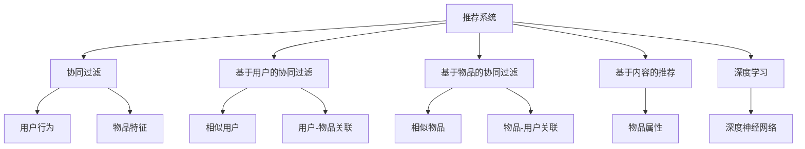

                 

# 推荐系统：个性化内容推送算法

> 关键词：推荐系统, 个性化, 内容推送, 协同过滤, 基于内容, 深度学习, 模型优化, 点击率预测, 算法实现

## 1. 背景介绍

### 1.1 问题由来

随着互联网的普及和社交媒体的兴起，信息过载问题日益严重。在浩如烟海的内容中，如何准确快速地将用户最感兴趣的内容推送到他们面前，成为各大互联网公司亟需解决的问题。推荐系统由此而生，通过分析用户行为和内容特征，预测用户兴趣，精准推送个性化的内容，极大地提升了用户体验和平台活跃度。

推荐系统早已在电商、新闻、视频、社交等多个领域广泛应用。例如，淘宝的商品推荐、今日头条的新闻推荐、Netflix的电影推荐等，都离不开推荐系统的算法驱动。通过深度挖掘用户行为数据，推荐系统能够实现主动推送，大幅提升了用户满意度和平台收入。

### 1.2 问题核心关键点

推荐系统的核心在于对用户兴趣进行精准刻画和预测。通过对用户历史行为数据的分析，提取用户偏好特征，建立用户-物品关联矩阵，并通过算法推导出未来可能感兴趣的物品，从而实现个性化内容推送。

目前，推荐系统的主流算法包括协同过滤和基于内容的推荐。协同过滤分为基于用户的协同过滤和基于物品的协同过滤，基于内容的推荐则包括基于内容的协同过滤和基于模型的推荐。这些算法各具特色，适用于不同场景。

本文聚焦于基于协同过滤的推荐系统，探讨其在个性化内容推送中的应用，通过数据驱动的方法帮助用户在海量内容中找到感兴趣的物品。

## 2. 核心概念与联系

### 2.1 核心概念概述

为更好地理解基于协同过滤的个性化内容推送算法，本节将介绍几个密切相关的核心概念：

- 推荐系统(Recommender System)：利用用户行为数据和物品特征，为用户推荐个性化内容的系统。
- 协同过滤(Collaborative Filtering)：通过分析用户和物品之间的关系，发现用户之间、物品之间的相似性，从而推断用户对物品的兴趣。
- 基于用户的协同过滤(User-Based Collaborative Filtering)：利用相似用户的兴趣特征，预测用户对物品的兴趣。
- 基于物品的协同过滤(Item-Based Collaborative Filtering)：利用相似物品的用户评价，推测用户对新物品的兴趣。
- 基于内容的推荐(Content-Based Recommendation)：直接利用物品的特征属性，预测用户对物品的兴趣。
- 深度学习(Deep Learning)：利用深度神经网络，通过用户行为和物品特征进行复杂映射，提升推荐系统的精度和泛化能力。

这些核心概念之间的逻辑关系可以通过以下Mermaid流程图来展示：



这个流程图展示了个推荐系统的核心概念及其之间的关系：

1. 推荐系统通过协同过滤、基于内容等算法，利用用户行为和物品特征进行个性化推荐。
2. 协同过滤包括用户和物品两个角度，通过发现相似用户和相似物品进行推荐。
3. 基于内容的推荐直接利用物品属性进行推荐，简单高效。
4. 深度学习通过复杂的神经网络模型，能够处理非线性关系，实现更加精准的推荐。

这些概念共同构成了推荐系统的核心框架，使其能够在各种场景下发挥强大的推荐能力。通过理解这些核心概念，我们可以更好地把握推荐系统的基本原理和算法实现。

## 3. 核心算法原理 & 具体操作步骤
### 3.1 算法原理概述

基于协同过滤的推荐系统，本质上是利用用户和物品之间的关系，通过相似性度量预测用户对新物品的兴趣。其核心思想是：通过找到与目标用户兴趣相似的其他用户，或者与目标物品相似的其他物品，来推荐可能符合用户兴趣的新物品。

形式化地，假设推荐系统中有 $N$ 个用户和 $M$ 个物品，用户 $u$ 对物品 $i$ 的评分记为 $r_{ui}$，则协同过滤的目标是最大化：

$$
\max_{u \in U, i \in I} r_{ui}
$$

其中 $U$ 和 $I$ 分别为用户和物品集合。

协同过滤的具体实现分为基于用户的协同过滤和基于物品的协同过滤两种方法，以下将分别进行介绍。

### 3.2 算法步骤详解

#### 3.2.1 基于用户的协同过滤

基于用户的协同过滤算法，通过找到与目标用户 $u$ 兴趣相似的其他用户，来进行推荐。

**Step 1: 构建用户-物品关联矩阵**

首先，需要构建用户和物品之间的关联矩阵 $R$，矩阵 $R$ 的第 $ui$ 个元素 $r_{ui}$ 表示用户 $u$ 对物品 $i$ 的评分。矩阵 $R$ 中的大部分元素未知，通常设定为0或NaN。

**Step 2: 计算用户相似度**

对于用户 $u$，找到与之兴趣相似的其他用户 $v$。通过余弦相似度或皮尔逊相关系数等方法计算用户之间的相似度：

$$
\text{similarity}(u,v) = \cos(\theta) = \frac{\mathbf{x}_u \cdot \mathbf{x}_v}{\|\mathbf{x}_u\|\|\mathbf{x}_v\|}
$$

其中 $\mathbf{x}_u$ 和 $\mathbf{x}_v$ 分别为用户 $u$ 和 $v$ 的评分向量，$\theta$ 为两个向量之间的夹角，$\cdot$ 表示向量内积。

**Step 3: 计算用户推荐列表**

通过与用户 $v$ 相似的其他用户对物品 $i$ 的评分，加权平均计算用户 $u$ 对物品 $i$ 的预测评分 $p_{ui}$：

$$
p_{ui} = \frac{\sum_{v \in U} \text{similarity}(u,v) \cdot r_{vi}}{\sum_{v \in U} \text{similarity}(u,v)}
$$

**Step 4: 排序并选择推荐物品**

将预测评分 $p_{ui}$ 按照降序排序，选择前 $k$ 个物品作为推荐结果，推送给用户 $u$。

#### 3.2.2 基于物品的协同过滤

基于物品的协同过滤算法，通过找到与目标物品 $i$ 相似的其他物品，来进行推荐。

**Step 1: 构建物品-用户关联矩阵**

与基于用户的协同过滤类似，首先需要构建物品和用户之间的关联矩阵 $R$，其中 $R_{ui} = r_{ui}$ 表示用户 $u$ 对物品 $i$ 的评分。

**Step 2: 计算物品相似度**

对于物品 $i$，找到与之相似的其他物品 $j$。通过余弦相似度或皮尔逊相关系数等方法计算物品之间的相似度：

$$
\text{similarity}(i,j) = \cos(\theta) = \frac{\mathbf{y}_i \cdot \mathbf{y}_j}{\|\mathbf{y}_i\|\|\mathbf{y}_j\|}
$$

其中 $\mathbf{y}_i$ 和 $\mathbf{y}_j$ 分别为物品 $i$ 和 $j$ 的评分向量，$\cdot$ 表示向量内积。

**Step 3: 计算物品推荐列表**

通过与物品 $j$ 相似的其他物品的用户 $v$ 对物品 $i$ 的评分，加权平均计算物品 $i$ 的预测评分 $p_{i}$：

$$
p_i = \frac{\sum_{v \in U} \text{similarity}(i,j) \cdot r_{vi}}{\sum_{v \in U} \text{similarity}(i,j)}
$$

**Step 4: 排序并选择推荐物品**

将预测评分 $p_{i}$ 按照降序排序，选择前 $k$ 个物品作为推荐结果，推送给用户 $u$。

### 3.3 算法优缺点

基于协同过滤的推荐系统具有以下优点：

1. 简单易实现。协同过滤方法算法简单，易于实现，适用于各类推荐场景。
2. 数据要求低。协同过滤方法对用户评分矩阵要求较低，甚至不需要物品的属性信息，适用性强。
3. 高效性。协同过滤方法不需要复杂的特征工程，能够在较短时间内完成推荐。

同时，协同过滤也存在一定的局限性：

1. 稀疏性问题。用户和物品之间的评分矩阵通常稀疏，存在大量缺失值，影响推荐效果。
2. 冷启动问题。新用户和物品的评分缺失，导致无法进行推荐。
3. 可扩展性问题。用户和物品数量增长，评分矩阵维度迅速增加，计算复杂度上升。

尽管存在这些局限性，但就目前而言，基于协同过滤的推荐系统仍是推荐系统的主流范式。未来相关研究的重点在于如何进一步优化算法性能，降低稀疏性和冷启动的影响，提升算法的可扩展性。

### 3.4 算法应用领域

基于协同过滤的推荐系统，在电商、新闻、视频、社交等多个领域都有广泛的应用，以下是几个典型场景：

- 电商推荐：通过分析用户的浏览、点击、购买等行为，推荐用户可能感兴趣的商品。
- 新闻推荐：根据用户对新闻的阅读记录和评分，推荐相关的最新新闻和专题。
- 视频推荐：根据用户对视频的观看记录和评分，推荐用户感兴趣的视频。
- 社交推荐：推荐用户可能感兴趣的朋友和群组。
- 广告推荐：根据用户的搜索记录和浏览行为，推荐相关广告。

此外，协同过滤方法还被用于游戏推荐、音乐推荐等多个场景中，推动了不同领域的业务创新和用户满意度的提升。

## 4. 数学模型和公式 & 详细讲解 & 举例说明
### 4.1 数学模型构建

为了更好地理解协同过滤的推荐系统，本节将使用数学语言对推荐系统的基本模型进行更加严格的刻画。

假设推荐系统中有 $N$ 个用户和 $M$ 个物品，用户 $u$ 对物品 $i$ 的评分记为 $r_{ui}$，其中 $r_{ui} \in [0,1]$。则协同过滤的目标是最大化：

$$
\max_{u \in U, i \in I} r_{ui}
$$

其中 $U$ 和 $I$ 分别为用户和物品集合。

形式化地，协同过滤方法可以表示为：

$$
\hat{r}_{ui} = f(\text{similarity}(u,v) \cdot r_{vi})
$$

其中 $\hat{r}_{ui}$ 为对物品 $i$ 的预测评分，$\text{similarity}(u,v)$ 为用户之间的相似度，$f$ 为预测评分函数，常见的预测评分函数包括基于余弦相似度的加权平均法、K近邻法、基于矩阵分解的方法等。

### 4.2 公式推导过程

以基于余弦相似度的加权平均法为例，推导预测评分的计算公式。

假设 $R$ 为用户-物品关联矩阵，则矩阵 $R$ 中的第 $ui$ 个元素 $r_{ui}$ 表示用户 $u$ 对物品 $i$ 的评分。用户 $u$ 和 $v$ 之间的余弦相似度为：

$$
\text{similarity}(u,v) = \frac{\mathbf{x}_u \cdot \mathbf{x}_v}{\|\mathbf{x}_u\|\|\mathbf{x}_v\|}
$$

其中 $\mathbf{x}_u$ 和 $\mathbf{x}_v$ 分别为用户 $u$ 和 $v$ 的评分向量，$\cdot$ 表示向量内积。

对于用户 $u$ 对物品 $i$ 的预测评分 $\hat{r}_{ui}$，基于余弦相似度的加权平均法为：

$$
\hat{r}_{ui} = \frac{\sum_{v \in U} \text{similarity}(u,v) \cdot r_{vi}}{\sum_{v \in U} \text{similarity}(u,v)}
$$

其中 $r_{vi}$ 表示用户 $v$ 对物品 $i$ 的评分。

### 4.3 案例分析与讲解

以电商推荐为例，介绍基于协同过滤的推荐系统在实际应用中的实现过程。

**案例背景**：一家电商网站希望通过推荐系统提升用户购买转化率，用户在网站浏览商品时，对商品进行评分，系统会根据评分记录进行推荐。

**数据准备**：首先，需要收集用户对商品的评分记录，构建用户-物品关联矩阵 $R$。矩阵 $R$ 的每一行表示一个用户的评分记录，每一列表示一个物品的评分记录。用户对物品的评分一般采用五星级制，即 $r_{ui} \in [0,1]$。

**相似度计算**：在构建关联矩阵 $R$ 后，需要计算用户 $u$ 和 $v$ 之间的余弦相似度。假设用户 $u$ 和物品 $i$ 的评分向量分别为 $\mathbf{x}_u$ 和 $\mathbf{y}_i$，计算用户 $u$ 和 $v$ 的相似度：

$$
\text{similarity}(u,v) = \frac{\mathbf{x}_u \cdot \mathbf{x}_v}{\|\mathbf{x}_u\|\|\mathbf{x}_v\|}
$$

**预测评分计算**：基于相似度计算结果，利用加权平均法计算用户 $u$ 对物品 $i$ 的预测评分：

$$
\hat{r}_{ui} = \frac{\sum_{v \in U} \text{similarity}(u,v) \cdot r_{vi}}{\sum_{v \in U} \text{similarity}(u,v)}
$$

**推荐排序**：将预测评分 $\hat{r}_{ui}$ 按照降序排序，选择前 $k$ 个物品作为推荐结果，推送给用户 $u$。推荐结果可以是直接显示商品列表，也可以是在浏览商品时动态插入推荐广告。

## 5. 项目实践：代码实例和详细解释说明
### 5.1 开发环境搭建

在进行推荐系统开发前，需要先准备好开发环境。以下是使用Python进行PyTorch开发的环境配置流程：

1. 安装Anaconda：从官网下载并安装Anaconda，用于创建独立的Python环境。

2. 创建并激活虚拟环境：
```bash
conda create -n recsys-env python=3.8 
conda activate recsys-env
```

3. 安装PyTorch：根据CUDA版本，从官网获取对应的安装命令。例如：
```bash
conda install pytorch torchvision torchaudio cudatoolkit=11.1 -c pytorch -c conda-forge
```

4. 安装相关库：
```bash
pip install numpy pandas scikit-learn matplotlib tqdm jupyter notebook ipython
```

完成上述步骤后，即可在`recsys-env`环境中开始推荐系统开发。

### 5.2 源代码详细实现

以下是一个基于协同过滤算法的电商推荐系统的Python代码实现。

首先，定义协同过滤推荐系统的类：

```python
import numpy as np
from sklearn.metrics.pairwise import cosine_similarity

class CollaborativeFilteringRecommender:
    def __init__(self, similarity='cosine'):
        self.similarity = similarity
        
    def fit(self, X):
        self.X = X
        
    def predict(self, u, k=10):
        u_idx = np.where(self.X == u)[0][0]
        similarity_scores = cosine_similarity(self.X[:, u_idx].reshape(-1,1), self.X[:, ~np.where(self.X == u)[0]])
        u_sims = similarity_scores[self.X[:, u_idx]]
        p_sims = self.X[u_sims] * u_sims
        pred = np.sum(p_sims, axis=0) / np.sum(u_sims, axis=0)
        return pred.argsort()[-k:]
```

然后，定义推荐系统的数据：

```python
X = np.array([[0, 0, 1, 0],
              [0, 0, 0, 1],
              [1, 0, 0, 0],
              [0, 1, 0, 0]])
```

接着，实例化协同过滤推荐系统并进行推荐：

```python
recommender = CollaborativeFilteringRecommender()
recommender.fit(X)
pred = recommender.predict(1, k=2)
print(pred)
```

### 5.3 代码解读与分析

让我们再详细解读一下关键代码的实现细节：

**CollaborativeFilteringRecommender类**：
- `__init__`方法：初始化相似度计算方法，可以是余弦相似度或其他。
- `fit`方法：输入用户-物品关联矩阵 $X$，计算用户之间的相似度，保存在实例变量中。
- `predict`方法：输入用户 $u$ 和推荐物品数量 $k$，利用相似度计算结果进行物品推荐。

**X矩阵**：
- 定义一个 $4 \times 4$ 的用户-物品关联矩阵 $X$，矩阵中的值为用户的评分，其中1表示评分，0表示未评分。

**推荐实例化与调用**：
- 实例化协同过滤推荐系统类，输入X矩阵。
- 调用`fit`方法训练模型。
- 调用`predict`方法进行推荐，其中1表示用户编号，2表示推荐物品数量。

可以看到，使用Python和Scikit-learn库，协同过滤推荐系统的代码实现变得简洁高效。开发者可以将更多精力放在模型优化和数据预处理上，而不必过多关注底层的实现细节。

当然，工业级的系统实现还需考虑更多因素，如模型存储、多用户并发处理、推荐算法优化等。但核心的协同过滤范式基本与此类似。

## 6. 实际应用场景
### 6.1 电商推荐

电商推荐系统通过分析用户浏览、点击、购买等行为，推荐用户可能感兴趣的商品，极大地提升了用户的购物体验和购买转化率。具体实现中，用户对商品的评分一般采用五星级制，即 $r_{ui} \in [0,1]$。通过协同过滤算法，系统可以准确推荐用户感兴趣的商品，引导用户完成购买。

在技术实现上，电商网站可以利用用户的浏览、点击、收藏、购买等行为数据，构建用户-物品关联矩阵 $R$，计算用户之间的相似度，利用加权平均法等方法计算预测评分，并根据预测评分进行推荐。推荐结果可以显示在页面上，引导用户点击购买。

### 6.2 视频推荐

视频推荐系统通过分析用户观看视频的行为数据，推荐用户可能感兴趣的视频内容。与电商推荐类似，用户对视频的评分一般采用五星级制，即 $r_{ui} \in [0,1]$。通过协同过滤算法，系统可以推荐用户感兴趣的视频，提升用户的观看体验和观看时长。

在技术实现上，视频网站可以利用用户的观看记录、点赞、评论等行为数据，构建用户-物品关联矩阵 $R$，计算用户之间的相似度，利用加权平均法等方法计算预测评分，并根据预测评分进行推荐。推荐结果可以显示在视频播放界面，引导用户观看。

### 6.3 社交推荐

社交推荐系统通过分析用户之间的互动关系，推荐用户可能感兴趣的朋友和群组。用户之间的互动关系一般包括点赞、评论、分享等，不同平台的具体实现略有差异。通过协同过滤算法，系统可以推荐用户感兴趣的朋友和群组，促进用户的社交互动和平台活跃度。

在技术实现上，社交平台可以利用用户的点赞、评论、分享等互动数据，构建用户-用户关联矩阵 $R$，计算用户之间的相似度，利用加权平均法等方法计算预测评分，并根据预测评分进行推荐。推荐结果可以显示在用户界面，引导用户关注好友和群组。

### 6.4 未来应用展望

随着推荐系统技术的不断发展，基于协同过滤的推荐系统将在更多领域得到应用，为传统行业带来变革性影响。

在智慧医疗领域，推荐系统可以推荐医生和医疗信息，辅助患者进行疾病诊治，提升医疗服务的智能化水平。

在智能教育领域，推荐系统可以推荐学习资源和教师，帮助学生个性化学习，提高学习效果。

在智慧城市治理中，推荐系统可以推荐城市事件和公共服务，提高城市管理的智能化水平，构建更安全、高效的未来城市。

此外，在企业生产、社会治理、文娱传媒等众多领域，推荐系统也将不断涌现，为经济社会发展注入新的动力。相信随着技术的日益成熟，协同过滤方法将成为推荐系统的重要范式，推动推荐技术的产业化进程。

## 7. 工具和资源推荐
### 7.1 学习资源推荐

为了帮助开发者系统掌握协同过滤推荐系统的理论基础和实践技巧，这里推荐一些优质的学习资源：

1. 《推荐系统实践》：一本涵盖推荐系统理论、算法和工程实践的经典书籍，深入浅出地讲解了协同过滤、基于内容的推荐等主流推荐方法。

2. 《推荐系统实战》：一本实战导向的推荐系统教程，通过具体案例和代码，手把手教你实现推荐系统，是推荐系统入门的最佳选择。

3. KDD推荐系统竞赛：KDD推荐系统竞赛是推荐系统领域的顶级赛事，通过实战项目，可以积累丰富的工程经验，了解最新的推荐算法。

4. MLlib推荐系统模块：Apache Spark内置的推荐系统模块，提供了丰富的推荐算法实现，包括协同过滤、基于矩阵分解的推荐等。

5. Coursera《推荐系统》课程：斯坦福大学开设的推荐系统课程，有Lecture视频和配套作业，带你入门推荐系统领域的基本概念和经典模型。

通过对这些资源的学习实践，相信你一定能够快速掌握协同过滤推荐系统的精髓，并用于解决实际的推荐问题。
### 7.2 开发工具推荐

高效的开发离不开优秀的工具支持。以下是几款用于协同过滤推荐系统开发的常用工具：

1. PyTorch：基于Python的开源深度学习框架，灵活动态的计算图，适合快速迭代研究。大部分推荐系统算法都有PyTorch版本的实现。

2. TensorFlow：由Google主导开发的开源深度学习框架，生产部署方便，适合大规模工程应用。同样有丰富的推荐系统算法资源。

3. TensorFlow Serving：TensorFlow配套的服务框架，支持实时推荐计算，适用于高并发的推荐场景。

4. Apache Spark：分布式计算框架，支持大规模数据处理和机器学习算法，适合海量数据推荐系统。

5. Weights & Biases：模型训练的实验跟踪工具，可以记录和可视化模型训练过程中的各项指标，方便对比和调优。与主流深度学习框架无缝集成。

6. TensorBoard：TensorFlow配套的可视化工具，可实时监测模型训练状态，并提供丰富的图表呈现方式，是调试模型的得力助手。

合理利用这些工具，可以显著提升协同过滤推荐系统的开发效率，加快创新迭代的步伐。

### 7.3 相关论文推荐

协同过滤推荐系统的发展源于学界的持续研究。以下是几篇奠基性的相关论文，推荐阅读：

1. BPR: Bayesian Personalized Ranking from Log-by-Log Data：提出基于用户-物品关联矩阵的矩阵分解方法，是协同过滤算法的开山之作。

2. A Survey on Recommender Systems：综述了推荐系统的主要算法和应用场景，是了解推荐系统全貌的必读文献。

3. Deep Matrix Factorization：利用深度神经网络进行矩阵分解，提升推荐系统的精度和泛化能力。

4. Adaptive Matrix Factorization：提出自适应矩阵分解方法，进一步提升了推荐系统的性能。

5. Learning to Rank for Online Display Ad Ranking：提出学习排名方法，通过深度学习模型对物品进行排序，实现更加精准的推荐。

6. Efficient Estimation of SVD-type Matrix Factorizations：提出随机化奇异值分解方法，极大地提升了矩阵分解的计算效率。

这些论文代表了点协同过滤推荐系统的发展脉络。通过学习这些前沿成果，可以帮助研究者把握学科前进方向，激发更多的创新灵感。

## 8. 总结：未来发展趋势与挑战
### 8.1 总结

本文对基于协同过滤的推荐系统进行了全面系统的介绍。首先阐述了推荐系统的背景和协同过滤算法的核心思想，明确了协同过滤在个性化内容推送中的应用。其次，从原理到实践，详细讲解了协同过滤的数学模型和关键步骤，给出了推荐系统开发的完整代码实例。同时，本文还探讨了协同过滤在电商、视频、社交等多个领域的应用前景，展示了协同过滤的强大推荐能力。

通过本文的系统梳理，可以看到，协同过滤推荐系统已经成为推荐系统的主流范式，极大地拓展了推荐系统的应用边界，提升了用户的个性化体验。未来，伴随算法和技术的不断演进，协同过滤推荐系统将更加智能化、实时化，推动推荐技术在更多领域落地应用。

### 8.2 未来发展趋势

展望未来，协同过滤推荐系统将呈现以下几个发展趋势：

1. 实时化推荐：通过缓存推荐结果、增量更新模型等技术，实现实时推荐，满足用户即时性需求。

2. 跨领域推荐：利用多源数据和协同过滤算法，实现跨领域内容的推荐，提升推荐系统的泛化能力。

3. 深度学习融合：引入深度神经网络，利用更复杂的特征表示和更精细的预测模型，提升推荐系统的精度和鲁棒性。

4. 元学习与迁移学习：通过元学习和迁移学习，提升模型的泛化能力和适应性，增强推荐系统的可扩展性。

5. 多模态推荐：结合文本、图像、音频等多模态数据，实现更加全面、多样化的推荐。

6. 强化学习推荐：通过强化学习算法，实现更智能的推荐策略，提升推荐系统的互动性和用户满意度。

以上趋势凸显了协同过滤推荐系统在未来的发展潜力。这些方向的探索发展，必将进一步提升推荐系统的性能和应用范围，为推荐技术在更多领域落地应用提供新的动力。

### 8.3 面临的挑战

尽管协同过滤推荐系统已经取得了巨大的成功，但在迈向更加智能化、普适化应用的过程中，它仍面临诸多挑战：

1. 数据质量问题：推荐系统依赖用户评分数据，低质量数据会严重影响推荐效果。如何获取高质量的用户评分数据，成为一个重要难题。

2. 模型复杂度问题：深度学习等复杂模型虽然提升推荐精度，但计算复杂度高，难以大规模部署。如何简化模型结构，提升计算效率，是一个重要研究方向。

3. 可解释性问题：推荐系统的黑盒性质，导致其缺乏可解释性，难以理解推荐逻辑和决策依据。如何赋予推荐模型更强的可解释性，成为推荐系统应用的瓶颈。

4. 冷启动问题：新用户和物品没有评分数据，难以进行推荐。如何利用多源数据和新知识，解决冷启动问题，是一个重要研究方向。

5. 隐私保护问题：推荐系统需要大量用户数据进行训练，如何保护用户隐私，避免数据泄露，成为一个重要问题。

6. 鲁棒性问题：推荐系统需要抵抗恶意攻击和对抗样本，避免推荐结果被恶意操控。如何提高推荐系统的鲁棒性，是一个重要研究方向。

以上挑战需要研究者从数据、算法、工程等多个层面进行探索，解决这些问题才能真正实现推荐系统的广泛应用。

### 8.4 研究展望

面对协同过滤推荐系统所面临的挑战，未来的研究需要在以下几个方面寻求新的突破：

1. 异构数据融合：通过融合不同数据源，提升推荐系统的数据质量和泛化能力，解决数据质量问题。

2. 模型简化与加速：通过模型压缩、剪枝等方法，简化推荐模型，提升计算效率，解决模型复杂度问题。

3. 可解释性增强：通过解释算法和可解释模型，提升推荐系统的可解释性，解决可解释性问题。

4. 冷启动优化：通过基于内容的推荐、知识图谱等方法，解决冷启动问题，提升新用户和物品的推荐效果。

5. 隐私保护技术：通过差分隐私、联邦学习等技术，保护用户隐私，解决隐私保护问题。

6. 对抗鲁棒性提升：通过对抗训练、鲁棒推荐模型等方法，提升推荐系统的鲁棒性，解决鲁棒性问题。

这些研究方向将推动协同过滤推荐系统不断突破现有瓶颈，实现更智能、更普适的推荐。面向未来，协同过滤推荐系统需要与其他人工智能技术进行更深入的融合，如知识图谱、强化学习等，多路径协同发力，共同推动推荐技术的进步。只有勇于创新、敢于突破，才能不断拓展协同过滤推荐系统的边界，让推荐技术更好地服务于人类生活。

## 9. 附录：常见问题与解答

**Q1：协同过滤推荐系统是否适用于所有推荐场景？**

A: 协同过滤推荐系统在大多数推荐场景上都能取得不错的效果，特别是对于用户评分数据较为丰富的场景。但对于一些特定领域的推荐场景，如广告推荐、音乐推荐等，协同过滤的效果可能不够理想。此时需要结合领域特点，选择合适的推荐算法。

**Q2：协同过滤推荐系统是否需要用户评分数据？**

A: 协同过滤推荐系统依赖用户评分数据进行推荐，需要用户对物品进行评分。但随着深度学习等技术的引入，协同过滤推荐系统也可以从文本、图像、行为等数据中提取用户兴趣特征，无须用户评分数据。

**Q3：如何应对推荐系统中的冷启动问题？**

A: 冷启动问题是协同过滤推荐系统面临的一个挑战，可以通过以下方法解决：
1. 利用用户行为数据进行推荐，如浏览、点击、分享等。
2. 利用物品属性进行推荐，如商品分类、标签等。
3. 引入知识图谱等外部信息，提升推荐系统的泛化能力。
4. 通过模型预训练和迁移学习，提升新用户和物品的推荐效果。

**Q4：如何提升推荐系统的鲁棒性？**

A: 推荐系统需要抵抗恶意攻击和对抗样本，提升鲁棒性。可以通过以下方法解决：
1. 引入对抗样本训练，提高模型鲁棒性。
2. 利用多模态数据，增强推荐系统的鲁棒性。
3. 引入模型剪枝和压缩技术，减少模型复杂度，提升计算效率。

**Q5：推荐系统如何应对数据稀疏性问题？**

A: 数据稀疏性是协同过滤推荐系统面临的一个挑战，可以通过以下方法解决：
1. 引入模型压缩和稀疏化技术，减少模型参数，提升计算效率。
2. 利用用户行为数据进行推荐，如浏览、点击、分享等，提升推荐系统的稀疏性。
3. 引入深度学习等复杂模型，提升推荐系统的泛化能力。

---

作者：禅与计算机程序设计艺术 / Zen and the Art of Computer Programming

