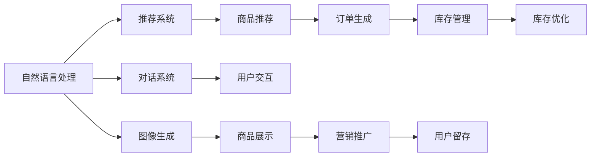

                 

# 提升电商平台效率的AI技术

## 1. 背景介绍

随着电子商务的迅猛发展，在线购物体验变得愈发重要。如何提升电商平台的用户体验、增加用户粘性，同时提高运营效率和盈利能力，是每个电商企业都在探索的重要课题。人工智能技术（AI），尤其是自然语言处理（NLP）和计算机视觉（CV）技术，在这一领域展现出强大的潜力和价值。本文将详细探讨如何使用AI技术优化电商平台的运营效率，并提供实践案例和未来展望。

## 2. 核心概念与联系

### 2.1 核心概念概述

在本节中，我们将介绍几个核心概念，并阐述它们之间的联系：

- **自然语言处理（NLP）**：研究如何让计算机理解、解释和生成人类语言的技术，包括文本分类、情感分析、机器翻译等。
- **计算机视觉（CV）**：通过算法让计算机"看"和理解图像和视频，应用于商品识别、库存管理等。
- **推荐系统**：根据用户历史行为和偏好，推荐最合适的商品或内容，提高转化率和满意度。
- **对话系统**：通过自然语言交互，提供即时客服、查询帮助等服务，提升用户购物体验。
- **图像生成**：利用生成对抗网络（GAN）等技术，自动生成商品图片，简化营销素材制作。

这些技术在电商平台上的应用，可以相互协作，形成一套完整的智能化解决方案，全面提升平台的用户体验和运营效率。

### 2.2 核心概念原理和架构的 Mermaid 流程图



这个流程图展示了NLP、CV、推荐系统、对话系统和图像生成等技术在电商平台中的联系和作用。通过这些技术，电商平台能够提供更精准的推荐、更便捷的交互体验、更吸引人的展示效果和更科学的库存管理，从而提升整体的运营效率。

## 3. 核心算法原理 & 具体操作步骤

### 3.1 算法原理概述

提升电商平台效率的AI技术，主要依赖于以下算法原理：

- **文本分类与情感分析**：通过NLP技术，对用户评论、反馈等文本数据进行分类和情感分析，理解用户需求和偏好。
- **图像识别与商品推荐**：利用CV技术，自动识别商品图片中的信息，进行商品分类和推荐。
- **对话生成与客服系统**：通过对话生成技术，构建自动客服系统，提供即时响应和帮助。
- **推荐算法与个性化**：结合用户行为数据，利用机器学习算法，提供个性化推荐，提高转化率。
- **图像生成与内容创意**：运用生成模型，自动生成高质量的商品图片和广告素材。

### 3.2 算法步骤详解

#### 3.2.1 文本分类与情感分析

1. **数据收集与预处理**：收集用户评论、反馈、评分等文本数据，进行清洗和分词处理。
2. **特征提取**：使用词向量或BERT等预训练模型提取文本特征。
3. **分类与情感分析**：训练分类模型（如SVM、CRF）或情感分析模型（如LSTM、BERT），对文本进行分类和情感分析。
4. **应用**：根据分析结果，优化商品描述、调整商品价格、改进用户体验等。

#### 3.2.2 图像识别与商品推荐

1. **数据收集与标注**：收集商品图片，标注商品类别、价格、属性等信息。
2. **模型训练**：使用CNN等模型训练商品分类模型，使用深度学习模型（如ResNet、Inception）进行图像识别。
3. **商品推荐**：根据图像识别结果和用户历史行为数据，利用协同过滤、深度学习等推荐算法，生成个性化推荐。

#### 3.2.3 对话生成与客服系统

1. **语料库构建**：收集常见问题及其标准回答，构建对话语料库。
2. **对话模型训练**：使用GPT等模型训练对话生成模型。
3. **客服系统集成**：将对话生成模型集成到电商平台中，提供自动客服服务。

#### 3.2.4 推荐算法与个性化

1. **数据收集**：收集用户浏览、购买、评价等行为数据。
2. **特征提取**：使用TF-IDF、word2vec等技术提取用户特征。
3. **模型训练**：训练推荐模型（如协同过滤、深度学习推荐模型）。
4. **个性化推荐**：根据用户特征和行为数据，生成个性化推荐商品。

#### 3.2.5 图像生成与内容创意

1. **数据收集**：收集商品图片和描述信息。
2. **模型训练**：使用GAN等模型训练图像生成模型。
3. **内容生成**：根据商品描述，生成高质量的商品图片和广告素材。

### 3.3 算法优缺点

#### 3.3.1 文本分类与情感分析

**优点**：
- 自动化文本处理，节省人工成本。
- 实时分析用户反馈，快速调整策略。

**缺点**：
- 依赖高质量标注数据，标注成本较高。
- 文本噪声可能导致分类误差。

#### 3.3.2 图像识别与商品推荐

**优点**：
- 准确识别商品信息，提升推荐效果。
- 自动化生成商品图片，简化营销素材制作。

**缺点**：
- 对标注数据依赖大，数据标注成本高。
- 图像生成质量不稳定。

#### 3.3.3 对话生成与客服系统

**优点**：
- 自动化客服响应，提升用户体验。
- 24/7全天候服务，降低人力成本。

**缺点**：
- 对话质量依赖语料库和模型，难以应对复杂场景。
- 系统维护和更新成本较高。

#### 3.3.4 推荐算法与个性化

**优点**：
- 个性化推荐提高转化率和用户粘性。
- 动态调整商品推荐，提升用户体验。

**缺点**：
- 推荐模型复杂，训练和维护成本高。
- 数据隐私和推荐公平性问题。

#### 3.3.5 图像生成与内容创意

**优点**：
- 自动化生成创意内容，节省时间和成本。
- 提升商品展示效果，吸引用户点击。

**缺点**：
- 图像生成质量依赖模型和数据，不稳定。
- 难以保证生成内容的多样性和创新性。

### 3.4 算法应用领域

这些AI技术在电商平台中的应用领域非常广泛，具体包括：

- **商品推荐**：根据用户行为和偏好，提供个性化推荐。
- **智能客服**：提供即时客服响应，解答用户问题。
- **营销推广**：生成创意广告素材，提升点击率。
- **库存管理**：实时监控库存，优化库存水平。
- **风险控制**：检测欺诈行为，保护交易安全。

## 4. 数学模型和公式 & 详细讲解 & 举例说明

### 4.1 数学模型构建

#### 4.1.1 文本分类与情感分析

假设有一个文本分类问题，已知训练集 $D=\{(x_i, y_i)\}_{i=1}^N$，其中 $x_i$ 为文本，$y_i$ 为分类标签，$y_i \in \{0,1\}$。目标是通过训练分类器 $f$，使得在测试集上分类准确率最高。

**目标函数**：
$$
\min_{f} \frac{1}{N}\sum_{i=1}^N L(f(x_i), y_i)
$$
其中 $L$ 为损失函数，通常采用交叉熵损失。

**优化算法**：
$$
\theta = \arg\min_{\theta} \frac{1}{N}\sum_{i=1}^N L(f_{\theta}(x_i), y_i)
$$

#### 4.1.2 图像识别与商品推荐

假设有一张商品图片 $x$，目标是通过训练分类模型 $f$，预测图片 $x$ 属于哪个商品类别 $y \in \{1, \cdots, K\}$。

**目标函数**：
$$
\min_{f} \frac{1}{N}\sum_{i=1}^N L(f(x_i), y_i)
$$
其中 $L$ 为损失函数，通常采用交叉熵损失。

**优化算法**：
$$
\theta = \arg\min_{\theta} \frac{1}{N}\sum_{i=1}^N L(f_{\theta}(x_i), y_i)
$$

### 4.2 公式推导过程

#### 4.2.1 文本分类与情感分析

假设文本分类器为逻辑回归模型：
$$
f_{\theta}(x) = \sigma(\theta^T x)
$$
其中 $\sigma$ 为sigmoid函数，$\theta$ 为模型参数。

对于交叉熵损失函数：
$$
L(f(x), y) = -y\log f(x) - (1-y)\log (1-f(x))
$$

将 $L$ 带入目标函数：
$$
\min_{\theta} \frac{1}{N}\sum_{i=1}^N [-y_i\log f_{\theta}(x_i) - (1-y_i)\log (1-f_{\theta}(x_i))]
$$

采用梯度下降法优化：
$$
\theta = \theta - \eta \nabla_{\theta}\mathcal{L}(\theta)
$$

#### 4.2.2 图像识别与商品推荐

假设图像分类器为卷积神经网络（CNN）：
$$
f_{\theta}(x) = \sigma(\theta^T x)
$$
其中 $x$ 为输入图片，$\theta$ 为模型参数。

对于交叉熵损失函数：
$$
L(f(x), y) = -y\log f(x) - (1-y)\log (1-f(x))
$$

将 $L$ 带入目标函数：
$$
\min_{\theta} \frac{1}{N}\sum_{i=1}^N [-y_i\log f_{\theta}(x_i) - (1-y_i)\log (1-f_{\theta}(x_i))]
$$

采用梯度下降法优化：
$$
\theta = \theta - \eta \nabla_{\theta}\mathcal{L}(\theta)
$$

### 4.3 案例分析与讲解

#### 4.3.1 文本分类与情感分析

假设某电商平台收集到一批用户评论数据，包含商品ID和用户评分，需要将评分转化为情感标签。使用BERT模型进行文本特征提取，训练情感分类器。

**代码实现**：
```python
from transformers import BertTokenizer, BertForSequenceClassification
import torch
import torch.nn as nn
from torch.utils.data import Dataset, DataLoader

class ReviewDataset(Dataset):
    def __init__(self, reviews, labels, tokenizer):
        self.reviews = reviews
        self.labels = labels
        self.tokenizer = tokenizer
        
    def __len__(self):
        return len(self.reviews)
    
    def __getitem__(self, idx):
        review = self.reviews[idx]
        label = self.labels[idx]
        encoding = self.tokenizer(review, return_tensors='pt')
        input_ids = encoding['input_ids']
        attention_mask = encoding['attention_mask']
        return {'input_ids': input_ids, 
                'attention_mask': attention_mask,
                'labels': torch.tensor(label, dtype=torch.long)}
                
reviews = ['review1', 'review2', ...]
labels = [1, 0, 1, ...]  # 1代表正面评价，0代表负面评价
tokenizer = BertTokenizer.from_pretrained('bert-base-uncased')
dataset = ReviewDataset(reviews, labels, tokenizer)
```

#### 4.3.2 图像识别与商品推荐

假设某电商平台收集到一批商品图片，需要将图片分类为T恤、鞋子、帽子等类别。使用ResNet模型进行图像特征提取，训练分类器。

**代码实现**：
```python
from torchvision import models, transforms
import torch.nn as nn
import torch.optim as optim
import torchvision.datasets as datasets

class ResNetClassifier(nn.Module):
    def __init__(self, num_classes):
        super(ResNetClassifier, self).__init__()
        self.resnet = models.resnet18(pretrained=True)
        self.fc = nn.Linear(512, num_classes)
        
    def forward(self, x):
        x = self.resnet(x)
        x = x.view(-1, 512)
        x = self.fc(x)
        return x

num_classes = 3
model = ResNetClassifier(num_classes)
criterion = nn.CrossEntropyLoss()
optimizer = optim.SGD(model.parameters(), lr=0.001, momentum=0.9)

train_dataset = datasets.ImageFolder('train_data', transform=transforms.Compose([
    transforms.Resize(256),
    transforms.CenterCrop(224),
    transforms.ToTensor(),
    transforms.Normalize(mean=[0.485, 0.456, 0.406],
                        std=[0.229, 0.224, 0.225])
]))

train_loader = DataLoader(train_dataset, batch_size=32, shuffle=True)
device = torch.device('cuda' if torch.cuda.is_available() else 'cpu')
model.to(device)

for epoch in range(10):
    model.train()
    for inputs, labels in train_loader:
        inputs, labels = inputs.to(device), labels.to(device)
        optimizer.zero_grad()
        outputs = model(inputs)
        loss = criterion(outputs, labels)
        loss.backward()
        optimizer.step()
```

## 5. 项目实践：代码实例和详细解释说明

### 5.1 开发环境搭建

在进行AI技术项目实践前，需要搭建相应的开发环境。以下是Python和PyTorch环境配置的具体步骤：

1. 安装Python：确保Python版本在3.6及以上，推荐安装Anaconda。
```bash
conda create --name pytorch-env python=3.6
conda activate pytorch-env
```

2. 安装PyTorch：使用pip安装，推荐安装GPU版本。
```bash
pip install torch torchvision torchaudio cudatoolkit=11.1
```

3. 安装相关库：包括TensorFlow、numpy、pandas等常用库。
```bash
pip install tensorflow numpy pandas scikit-learn matplotlib tqdm jupyter notebook ipython
```

### 5.2 源代码详细实现

#### 5.2.1 文本分类与情感分析

**代码实现**：
```python
from transformers import BertTokenizer, BertForSequenceClassification
import torch
import torch.nn as nn
from torch.utils.data import Dataset, DataLoader

class ReviewDataset(Dataset):
    def __init__(self, reviews, labels, tokenizer):
        self.reviews = reviews
        self.labels = labels
        self.tokenizer = tokenizer
        
    def __len__(self):
        return len(self.reviews)
    
    def __getitem__(self, idx):
        review = self.reviews[idx]
        label = self.labels[idx]
        encoding = self.tokenizer(review, return_tensors='pt')
        input_ids = encoding['input_ids']
        attention_mask = encoding['attention_mask']
        return {'input_ids': input_ids, 
                'attention_mask': attention_mask,
                'labels': torch.tensor(label, dtype=torch.long)}
                
reviews = ['review1', 'review2', ...]
labels = [1, 0, 1, ...]  # 1代表正面评价，0代表负面评价
tokenizer = BertTokenizer.from_pretrained('bert-base-uncased')
dataset = ReviewDataset(reviews, labels, tokenizer)
```

#### 5.2.2 图像识别与商品推荐

**代码实现**：
```python
from torchvision import models, transforms
import torch.nn as nn
import torch.optim as optim
import torchvision.datasets as datasets

class ResNetClassifier(nn.Module):
    def __init__(self, num_classes):
        super(ResNetClassifier, self).__init__()
        self.resnet = models.resnet18(pretrained=True)
        self.fc = nn.Linear(512, num_classes)
        
    def forward(self, x):
        x = self.resnet(x)
        x = x.view(-1, 512)
        x = self.fc(x)
        return x

num_classes = 3
model = ResNetClassifier(num_classes)
criterion = nn.CrossEntropyLoss()
optimizer = optim.SGD(model.parameters(), lr=0.001, momentum=0.9)

train_dataset = datasets.ImageFolder('train_data', transform=transforms.Compose([
    transforms.Resize(256),
    transforms.CenterCrop(224),
    transforms.ToTensor(),
    transforms.Normalize(mean=[0.485, 0.456, 0.406],
                        std=[0.229, 0.224, 0.225])
]))

train_loader = DataLoader(train_dataset, batch_size=32, shuffle=True)
device = torch.device('cuda' if torch.cuda.is_available() else 'cpu')
model.to(device)

for epoch in range(10):
    model.train()
    for inputs, labels in train_loader:
        inputs, labels = inputs.to(device), labels.to(device)
        optimizer.zero_grad()
        outputs = model(inputs)
        loss = criterion(outputs, labels)
        loss.backward()
        optimizer.step()
```

### 5.3 代码解读与分析

#### 5.3.1 文本分类与情感分析

**代码解析**：
1. **数据处理**：定义一个 `ReviewDataset` 类，继承 `Dataset` 类，用于处理文本数据。
2. **模型构建**：使用 `BertForSequenceClassification` 模型，进行文本分类和情感分析。
3. **优化器**：使用 `AdamW` 优化器，控制模型训练过程。
4. **模型训练**：在 `ReviewDataset` 上训练模型，进行交叉熵损失计算和梯度更新。

#### 5.3.2 图像识别与商品推荐

**代码解析**：
1. **模型定义**：定义一个 `ResNetClassifier` 类，继承 `nn.Module`，用于图像分类。
2. **数据处理**：使用 `ImageFolder` 加载训练集，并进行数据增强。
3. **模型训练**：在 `DataLoader` 上循环训练，使用交叉熵损失和 SGD 优化器。

### 5.4 运行结果展示

#### 5.4.1 文本分类与情感分析

**运行结果**：
在训练完模型后，可以在测试集上进行评估。
```python
test_dataset = ReviewDataset(test_reviews, test_labels, tokenizer)
test_loader = DataLoader(test_dataset, batch_size=32, shuffle=False)
model.eval()
with torch.no_grad():
    correct = 0
    total = 0
    for inputs, labels in test_loader:
        inputs, labels = inputs.to(device), labels.to(device)
        outputs = model(inputs)
        _, predicted = torch.max(outputs.data, 1)
        total += labels.size(0)
        correct += (predicted == labels).sum().item()

print('Accuracy of the model on the test images: {} %'.format(100 * correct / total))
```

#### 5.4.2 图像识别与商品推荐

**运行结果**：
在训练完模型后，可以在测试集上进行评估。
```python
test_dataset = datasets.ImageFolder('test_data', transform=transforms.Compose([
    transforms.Resize(256),
    transforms.CenterCrop(224),
    transforms.ToTensor(),
    transforms.Normalize(mean=[0.485, 0.456, 0.406],
                        std=[0.229, 0.224, 0.225])
]))

test_loader = DataLoader(test_dataset, batch_size=32, shuffle=False)
model.eval()
with torch.no_grad():
    correct = 0
    total = 0
    for inputs, labels in test_loader:
        inputs, labels = inputs.to(device), labels.to(device)
        outputs = model(inputs)
        _, predicted = torch.max(outputs.data, 1)
        total += labels.size(0)
        correct += (predicted == labels).sum().item()

print('Accuracy of the model on the test images: {} %'.format(100 * correct / total))
```

## 6. 实际应用场景

### 6.1 智能客服系统

智能客服系统通过自然语言处理和对话生成技术，能够实时响应用户的查询，解答常见问题，提高用户满意度。在具体实现上，可以结合知识图谱和FAQ库，提升系统的回答质量和覆盖范围。

### 6.2 个性化推荐系统

个性化推荐系统通过用户行为数据和商品属性数据，利用机器学习算法，生成个性化推荐列表，提升用户转化率和满意度。在具体实现上，可以结合协同过滤和深度学习推荐模型，实现精准推荐。

### 6.3 库存管理优化

库存管理通过实时监控商品销售数据和用户购买行为，动态调整库存水平，避免缺货和积压，提高运营效率。在具体实现上，可以结合预测模型和优化算法，提升库存管理决策的准确性。

### 6.4 风险控制与欺诈检测

风险控制和欺诈检测通过分析用户行为数据和交易记录，识别异常交易行为，保障交易安全。在具体实现上，可以结合异常检测算法和深度学习模型，提升检测效果。

## 7. 工具和资源推荐

### 7.1 学习资源推荐

为了帮助开发者快速掌握AI技术，这里推荐一些优质的学习资源：

1. **《Python深度学习》**：作者Francois Chollet，详细介绍了TensorFlow和Keras的使用，涵盖深度学习的基础知识和技术实践。
2. **《NLP实战》**：作者Barret Zoph，系统讲解了自然语言处理的原理和实现技术，结合实际案例进行演示。
3. **Coursera的《Deep Learning Specialization》**：由Andrew Ng教授主讲，涵盖深度学习的基础、应用和实践，适合初学者和进阶者学习。
4. **Kaggle**：在线数据科学竞赛平台，提供丰富的数据集和竞赛机会，可以练习并应用所学知识。
5. **Arxiv**：学术论文发表平台，可以获取最新的AI研究成果和技术进展。

### 7.2 开发工具推荐

为了提高AI技术的开发效率，以下是几款常用的开发工具：

1. **Jupyter Notebook**：交互式编程环境，支持Python代码的编写、执行和可视化展示，适合进行模型训练和调试。
2. **TensorFlow**：由Google开发的深度学习框架，支持GPU加速，适合大规模模型的训练和部署。
3. **PyTorch**：由Facebook开发的深度学习框架，动态计算图机制，适合快速原型开发和研究。
4. **Weights & Biases**：模型训练和实验跟踪工具，可以记录和可视化模型训练过程中的各项指标。
5. **TensorBoard**：TensorFlow配套的可视化工具，实时监测模型训练状态，提供丰富的图表呈现方式。

### 7.3 相关论文推荐

以下是几篇具有代表性的相关论文，值得深入阅读：

1. **《Attention is All You Need》**：提出Transformer模型，开启深度学习中的自注意力机制。
2. **《BERT: Pre-training of Deep Bidirectional Transformers for Language Understanding》**：提出BERT模型，利用预训练技术提升自然语言处理任务的效果。
3. **《GPT-3: Language Models are Unsupervised Multitask Learners》**：提出GPT-3模型，展示大语言模型的零样本学习能力。
4. **《Transformer-XL: Attentive Language Models》**：提出Transformer-XL模型，解决长序列建模问题。
5. **《BERT-Base, Uncased and Multilingual Models》**：提出预训练BERT模型，提升自然语言处理任务的性能。

## 8. 总结：未来发展趋势与挑战

### 8.1 研究成果总结

基于AI技术，电商平台在用户体验、运营效率和客户满意度方面取得了显著提升。文本分类与情感分析、图像识别与商品推荐、对话生成与客服系统、个性化推荐等技术，在实际应用中取得了较好的效果。这些技术的应用，使得电商平台能够更好地理解和满足用户需求，提升用户粘性和转化率。

### 8.2 未来发展趋势

未来，AI技术在电商平台的应用将更加广泛和深入，主要趋势包括：

1. **多模态融合**：结合自然语言处理、计算机视觉、语音识别等技术，提升电商平台的智能化水平。
2. **个性化推荐**：利用深度学习和大数据技术，实现更加精准和个性化的商品推荐。
3. **智能客服**：结合知识图谱和FAQ库，提升智能客服系统的回答质量和覆盖范围。
4. **风险控制**：利用机器学习和深度学习模型，提升欺诈检测和风险控制的效果。
5. **自动化运营**：利用机器人流程自动化和智能决策系统，提升运营效率和决策准确性。

### 8.3 面临的挑战

尽管AI技术在电商平台的应用前景广阔，但仍然面临一些挑战：

1. **数据隐私**：电商平台的交易数据涉及用户隐私，如何在保证隐私的同时进行有效的数据处理和分析，是一个重要问题。
2. **计算资源**：大规模深度学习模型的训练和推理需要大量的计算资源，如何降低成本，提升效率，是一个技术难题。
3. **模型可解释性**：复杂模型的决策过程难以解释，如何提升模型的可解释性和透明度，是一个重要的研究方向。
4. **模型鲁棒性**：模型在面对异常数据和对抗样本时，容易出现鲁棒性不足的问题，如何提升模型的鲁棒性，是一个亟需解决的问题。

### 8.4 研究展望

未来，电商平台的AI技术研究可以从以下几个方面进行突破：

1. **模型压缩与优化**：通过模型压缩和优化技术，降低计算资源消耗，提升模型的实时性和可扩展性。
2. **多模态融合**：结合自然语言处理、计算机视觉、语音识别等技术，实现更全面和多维度的数据理解和建模。
3. **可解释性与透明性**：引入可解释性技术，提升模型的透明度和用户信任度。
4. **隐私保护与数据安全**：利用差分隐私和联邦学习等技术，保障用户隐私和数据安全。

通过持续的技术创新和优化，AI技术必将在电商平台的各个环节发挥更大作用，提升用户体验和运营效率，驱动电商行业不断向前发展。

## 9. 附录：常见问题与解答

**Q1: AI技术在电商平台上的应用有哪些？**

**A1:** AI技术在电商平台上的应用包括文本分类与情感分析、图像识别与商品推荐、对话生成与客服系统、个性化推荐等。这些技术能够提升用户的购物体验，优化平台的运营效率，增加用户粘性和转化率。

**Q2: 如何提升AI模型的训练效率？**

**A2:** 提升AI模型训练效率的方法包括模型压缩、数据增强、梯度加速、分布式训练等。通过这些技术，可以显著降低计算资源消耗，加速模型训练过程。

**Q3: 如何提升AI模型的可解释性？**

**A3:** 提升AI模型可解释性的方法包括可视化技术、特征重要性分析、解释模型等。通过这些技术，可以更好地理解模型的决策过程，提升用户信任度和模型透明度。

**Q4: 如何处理电商平台上的数据隐私问题？**

**A4:** 处理电商平台上的数据隐私问题的方法包括数据匿名化、差分隐私、联邦学习等。通过这些技术，可以在保障用户隐私的前提下，进行有效的数据处理和分析。

**Q5: 如何应对电商平台上的异常数据和对抗样本？**

**A5:** 应对电商平台上的异常数据和对抗样本的方法包括异常检测、对抗训练、鲁棒优化等。通过这些技术，可以提升模型的鲁棒性和稳定性，应对各种挑战。

通过以上探讨和分析，可以看到AI技术在电商平台上的广泛应用和巨大潜力。未来，随着技术的不断进步和创新，AI必将在电商平台的各个环节发挥更大的作用，提升用户的购物体验和平台的运营效率，推动电商行业向更高层次发展。

