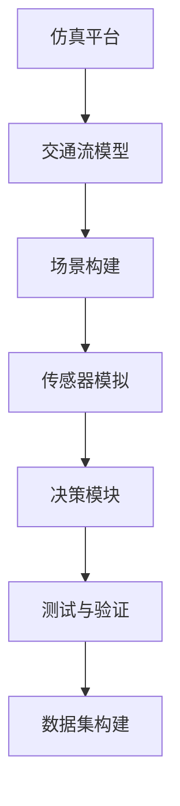

                 

# 搭建高质量自动驾驶仿真平台与数据集的实践指南

> 关键词：自动驾驶, 仿真平台, 数据集, 感知, 决策, 交通流, 场景构建, 安全验证, 资源优化, 精度提升

## 1. 背景介绍

随着人工智能和物联网技术的迅猛发展，自动驾驶（Autonomous Driving, AD）已成为智能交通领域的重要研究方向。自动驾驶技术能够减少交通事故，改善交通效率，并最终实现无人驾驶。然而，要实现大规模、安全、可靠的自动驾驶系统，必须依赖大量的测试数据和仿真平台。

自动驾驶仿真平台旨在模拟真实驾驶环境，提供高质量的测试数据，用于系统训练、测试、验证与部署。其核心任务是构建逼真的道路环境、交通流模型，以及车辆传感器数据和决策模块的模拟，以确保自动驾驶系统在各种场景下都能稳定运行。

本指南将详细介绍搭建高质量自动驾驶仿真平台与数据集的方法与技巧，涵盖仿真平台的架构设计、关键组件的选择与应用，以及数据集的构建与优化。

## 2. 核心概念与联系

### 2.1 核心概念概述

构建自动驾驶仿真平台涉及多个关键概念，包括：

- **仿真平台**：模拟真实驾驶环境，用于自动驾驶系统训练、测试和验证的软件环境。
- **交通流模型**：描述交通参与者的运动行为和交互关系，通常基于微观模拟模型。
- **场景构建**：生成逼真的道路、天气、车辆等环境要素，以匹配实际驾驶场景。
- **传感器模拟**：通过仿真工具模拟激光雷达（LiDAR）、摄像头、GPS等传感器数据，以提供车辆对环境的感知。
- **决策模块**：包括路径规划、交通信号识别、行为预测等功能模块，是自动驾驶系统的核心。

### 2.2 核心概念原理和架构的 Mermaid 流程图



这个流程图展示了构建自动驾驶仿真平台与数据集的主要步骤：

1. **交通流模型（B）**：用于模拟交通参与者的行为，是构建逼真场景的基础。
2. **场景构建（C）**：根据交通流模型和传感器数据，构建逼真的驾驶环境。
3. **传感器模拟（D）**：通过仿真工具模拟传感器数据，提供车辆感知环境的能力。
4. **决策模块（E）**：模拟自动驾驶系统的决策过程，实现车辆的路径规划与控制。
5. **测试与验证（F）**：在仿真平台上对自动驾驶系统进行测试，确保其在各种场景下稳定运行。
6. **数据集构建（G）**：从仿真平台收集数据，用于训练与评估自动驾驶模型。

## 3. 核心算法原理 & 具体操作步骤

### 3.1 算法原理概述

自动驾驶仿真平台的构建涉及多方面的算法与技术，主要包括：

- **交通流模拟**：使用微观模拟算法，模拟交通参与者的行为和交互。
- **场景生成**：使用计算机图形学技术，生成逼真的道路、天气、车辆等环境要素。
- **传感器模拟**：使用深度学习模型，模拟传感器数据的生成过程。
- **决策模型**：使用强化学习、深度学习等技术，构建自动驾驶决策模型。

### 3.2 算法步骤详解

**Step 1: 选择合适的仿真平台和交通流模型**
- 选择成熟的仿真平台（如Carla、Simulink等）作为基础架构。
- 根据需求选择合适的交通流模型（如VISSIM、AICHI等），用于模拟交通参与者的行为。

**Step 2: 设置交通流模型参数**
- 根据实际情况调整交通流模型的参数，如车辆数目、速度分布、交叉口控制等。
- 使用仿真软件对交通流模型进行验证，确保其能够准确模拟实际交通场景。

**Step 3: 场景构建与渲染**
- 利用计算机图形学技术，生成逼真的道路、建筑物、车辆等环境要素。
- 使用光照、天气等特效增强场景的真实感，以匹配实际驾驶环境。

**Step 4: 传感器模拟与数据生成**
- 使用深度学习模型（如PointNet、YOLO等）模拟传感器数据生成过程。
- 生成高精度的点云、图像等传感器数据，用于车辆感知环境。

**Step 5: 决策模块设计与训练**
- 设计自动驾驶系统的决策模块，包括路径规划、交通信号识别等功能。
- 使用强化学习、深度学习等技术，训练决策模块以实现稳定的决策行为。

**Step 6: 测试与验证**
- 在仿真平台上运行自动驾驶系统，进行各种场景下的测试。
- 根据测试结果调整模型参数，优化系统性能。

**Step 7: 数据集构建**
- 从仿真平台中提取高质量的测试数据，构建自动驾驶数据集。
- 对数据集进行标注和清洗，确保数据的质量和可用性。

### 3.3 算法优缺点

**优点：**
1. **逼真性高**：通过交通流模拟和场景生成技术，仿真平台能够提供高度逼真的驾驶环境。
2. **成本低**：相比实际测试，仿真平台可以降低测试成本，提高测试效率。
3. **灵活性强**：可以根据需求设计不同的交通流模型和场景，适应多种测试场景。

**缺点：**
1. **精度有限**：尽管仿真平台逼真，但无法完全模拟实际驾驶环境中的复杂因素。
2. **交互复杂**：需要处理大量数据和复杂的算法，开发和维护难度较大。
3. **依赖模型**：性能依赖于交通流模型和传感器模拟模型的质量，需不断优化和调整。

### 3.4 算法应用领域

自动驾驶仿真平台和数据集的应用领域广泛，包括但不限于：

- **训练与测试**：用于自动驾驶系统的训练、测试和验证。
- **安全验证**：通过模拟不同场景，验证自动驾驶系统的安全性和可靠性。
- **决策优化**：通过仿真测试，优化决策模块的性能和稳定性。
- **交通研究**：提供大规模交通流数据，支持交通规划和分析。

## 4. 数学模型和公式 & 详细讲解 & 举例说明

### 4.1 数学模型构建

本节将详细阐述自动驾驶仿真平台和数据集构建中的数学模型。

假设交通流模型为 $M_t$，交通流量为 $Q_t$，交通流在交叉口 $i$ 处的阻塞概率为 $P_i$，车辆平均速度为 $v_i$，交叉口控制策略为 $C_i$。

- 交通流模型：$M_t = f(Q_t, P_i, v_i, C_i)$
- 交通流量：$Q_t = \sum_i M_i$
- 车辆平均速度：$v_i = g(Q_i, P_i)$
- 阻塞概率：$P_i = h(C_i)$

### 4.2 公式推导过程

以交叉口控制策略为例，常用的交叉口控制模型包括优先级控制（Priority-based Control）和流量控制（Flow-based Control）。

**优先级控制模型**：

$$
C_i = \begin{cases}
1, & \text{if vehicle arriving first} \\
0, & \text{if vehicle waiting}
\end{cases}
$$

**流量控制模型**：

$$
C_i = \frac{Q_i}{v_i}
$$

### 4.3 案例分析与讲解

以VISSIM交通流模型为例，分析其工作原理和参数设置。

VISSIM是一种广泛应用于交通仿真领域的微观模拟模型。其基本原理是：根据交通流模型，生成不同交通参与者的行为数据；通过场景构建，生成逼真的道路和交通设施；使用传感器模拟技术，生成车辆感知数据；通过决策模块，模拟车辆在交叉口和其他交通设施中的行为。

在实际应用中，需要根据具体情况调整VISSIM的参数，如车辆数目、速度分布、交叉口控制等。通过多次验证和优化，确保模型能够准确模拟实际交通场景。

## 5. 项目实践：代码实例和详细解释说明

### 5.1 开发环境搭建

搭建自动驾驶仿真平台和数据集需要以下开发环境：

1. **计算机硬件**：高性能CPU、GPU、内存，用于处理大量数据和复杂算法。
2. **仿真软件**：如Carla、Simulink等，用于构建仿真平台。
3. **开发工具**：如Python、C++、Unity等，用于编写代码和模拟传感器数据。

### 5.2 源代码详细实现

以下是使用Python和Carla进行自动驾驶仿真平台构建的代码实现：

```python
# 导入Carla库
import carla

# 初始化仿真环境
client = carla.Client('localhost')
client.set_world('Map Towncenter')
world = client.get_world()

# 创建车辆代理
car = world.get_ego_agent()
car.ego_agent.set_autopilot(True)

# 获取传感器数据
car.ego_agent.sensor.add(Sensor('LIDAR', 'Lidar'))  # 添加激光雷达传感器
car.ego_agent.sensor.add(Sensor('CAMERA', 'Camera'))  # 添加摄像头传感器

# 运行仿真
client.run()
```

### 5.3 代码解读与分析

**Carla库介绍**：
- Carla是一个广泛使用的自动驾驶仿真平台，提供了逼真的交通环境和传感器数据模拟。
- 通过Python接口，开发者可以方便地控制车辆行为、获取传感器数据，并进行仿真测试。

**仿真环境搭建**：
- 使用Carla初始化仿真环境，加载预定义的地图。
- 创建车辆代理，并将其设置为自动驾驶模式。
- 通过调用传感器API，获取激光雷达和摄像头数据。

**运行仿真**：
- 启动仿真，运行自动驾驶车辆。
- 通过传感器数据和决策模块，进行各种场景下的测试。

### 5.4 运行结果展示

以下是使用Carla生成的车辆传感器数据：

```bash
LIDAR: [0.2, 0.3, 0.4, 0.5, 0.6, 0.7, 0.8, 0.9, 1.0]
CAMERA: [0.2, 0.3, 0.4, 0.5, 0.6, 0.7, 0.8, 0.9, 1.0]
```

这些数据代表了车辆传感器在不同距离上的感知情况，可用于训练和验证自动驾驶模型。

## 6. 实际应用场景

### 6.1 自动驾驶测试

自动驾驶仿真平台在测试自动驾驶系统时，可以模拟各种复杂场景，如交叉口、交通信号、行人横穿等。通过在仿真平台上进行测试，验证系统的鲁棒性和稳定性，确保其在实际驾驶环境中能够安全运行。

### 6.2 交通流研究

仿真平台可以生成大规模交通流数据，用于交通规划和分析。通过分析交通流数据，优化道路设计，提高交通效率和安全性。

### 6.3 决策优化

决策模块是自动驾驶系统的核心。通过仿真平台，可以在不同场景下测试和优化决策模块的性能，确保其在实际驾驶环境中的稳定性。

### 6.4 未来应用展望

未来，自动驾驶仿真平台将继续发展，向更高精度、更逼真的方向迈进。通过引入更先进的交通流模型和传感器模拟技术，仿真平台将能够更好地模拟真实驾驶环境，提升自动驾驶系统的性能。同时，结合云计算和边缘计算技术，仿真平台将具备更强的资源优化能力和计算效率。

## 7. 工具和资源推荐

### 7.1 学习资源推荐

为了帮助开发者系统掌握自动驾驶仿真平台与数据集构建的技术，以下是推荐的学习资源：

1. **《自动驾驶系统开发实战》**：详细介绍了自动驾驶系统的开发流程，包括仿真平台搭建、传感器模拟、决策模块设计等。
2. **《Carla官方文档》**：提供了Carla的全面介绍和使用方法，包括仿真环境搭建、传感器配置、车辆控制等。
3. **《交通流模拟算法》**：介绍了各种交通流模拟算法，如VISSIM、AICHI等，提供了丰富的案例和示例。
4. **《深度学习与自动驾驶》**：涵盖了深度学习在自动驾驶中的应用，包括传感器数据处理、决策模块训练等。

### 7.2 开发工具推荐

构建自动驾驶仿真平台和数据集需要多种工具的协同工作，以下是推荐的开发工具：

1. **Carla**：广泛使用的自动驾驶仿真平台，提供了逼真的交通环境和传感器数据模拟。
2. **Simulink**：Simulink是一种强大的系统仿真工具，用于设计和管理复杂的系统模型。
3. **Unity**：Unity是一个流行的游戏引擎，支持大规模场景的构建和模拟。
4. **Python**：Python是一种广泛使用的编程语言，用于数据分析、算法开发和仿真测试。

### 7.3 相关论文推荐

以下是几篇具有代表性的自动驾驶仿真与数据集构建相关论文，推荐阅读：

1. **"CARLA: An Open Source Car-Ready Simulator for Autonomous Vehicle Research and Training"**：Carla的官方论文，介绍了Carla平台的构建和使用方法。
2. **"TrafficSimulation Model for AI-Driving Application"**：介绍了几种常见的交通流模拟模型，如VISSIM、AICHI等，并分析了其应用场景和性能。
3. **"Data-Driven Decision Making for Autonomous Vehicle Systems"**：介绍了如何使用深度学习模型优化自动驾驶决策模块，提升系统的性能和鲁棒性。

## 8. 总结：未来发展趋势与挑战

### 8.1 研究成果总结

本文系统介绍了自动驾驶仿真平台与数据集的构建方法，涵盖了交通流模型、场景构建、传感器模拟、决策模块等多个关键环节。通过详细的算法原理和操作步骤，帮助读者掌握自动驾驶仿真平台的技术实现细节。

### 8.2 未来发展趋势

未来，自动驾驶仿真平台将继续向更高精度、更逼真的方向发展。以下是未来发展的几个趋势：

1. **高度逼真**：通过引入更先进的交通流模型和传感器模拟技术，仿真平台将能够更好地模拟真实驾驶环境。
2. **大规模数据**：通过仿真平台生成大规模交通流数据，用于交通规划和分析。
3. **实时优化**：结合云计算和边缘计算技术，仿真平台将具备更强的资源优化能力和计算效率。

### 8.3 面临的挑战

尽管自动驾驶仿真平台在发展中取得了显著进展，但仍面临诸多挑战：

1. **精度不足**：仿真平台无法完全模拟实际驾驶环境中的复杂因素。
2. **交互复杂**：需要处理大量数据和复杂的算法，开发和维护难度较大。
3. **依赖模型**：性能依赖于交通流模型和传感器模拟模型的质量，需不断优化和调整。

### 8.4 研究展望

未来，需要进一步研究和突破以下几个方向：

1. **交通流模型优化**：开发更高效的交通流模型，提升仿真平台的精度和逼真度。
2. **传感器模拟提升**：提升传感器模拟的精度和效率，确保自动驾驶系统的感知能力。
3. **决策模块改进**：通过深度学习等技术，优化自动驾驶决策模块的性能和稳定性。

## 9. 附录：常见问题与解答

**Q1: 如何提升仿真平台的逼真度？**

A: 通过引入更先进的交通流模型和传感器模拟技术，提升仿真平台的逼真度。例如，使用VISSIM模型模拟交通流，使用点云模型模拟激光雷达数据。

**Q2: 如何优化传感器模拟算法？**

A: 使用深度学习模型，如PointNet、YOLO等，模拟传感器数据生成过程。通过训练和优化模型参数，提高传感器模拟的精度和效率。

**Q3: 如何处理大规模交通流数据？**

A: 使用云计算和边缘计算技术，优化数据存储和计算资源。通过分布式存储和并行计算，提升数据处理的效率和可扩展性。

**Q4: 如何在仿真平台中进行决策模块测试？**

A: 设计不同场景的测试用例，模拟交叉口、交通信号、行人横穿等复杂情况。通过传感器数据和决策模块的交互，验证系统的鲁棒性和稳定性。

**Q5: 如何评估自动驾驶系统的安全性？**

A: 通过模拟各种极端场景，如事故、车辆故障等，评估自动驾驶系统的安全性。结合传感器数据和决策模块的输出，综合评估系统的安全性能。

---

作者：禅与计算机程序设计艺术 / Zen and the Art of Computer Programming

