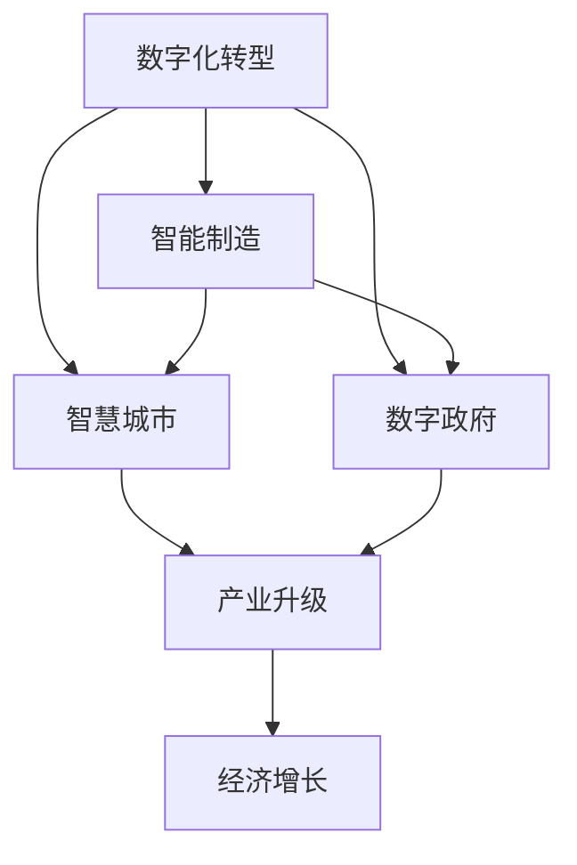

                 

## 1. 背景介绍

### 1.1 数字中国的战略意义

“数字中国”战略，是中国政府在信息化和数字化转型过程中提出的一项重要战略。其核心在于利用数字技术推动经济社会发展，促进政府治理能力现代化，实现社会民生改善，以及推动国家安全体系建设。通过“数字中国”战略，我国正在加速数字经济的建设，力求在数字经济时代保持国家竞争力的领先地位。

### 1.2 新质生产力的概念与内涵

“新质生产力”是指通过新一代信息技术与实体经济深度融合所形成的新型生产力。其内涵包括数字经济、智能制造、智慧城市、数字政府等多个方面，这些新型生产力的发展不仅提升了经济效率，也为社会带来了深远的变革。

## 2. 核心概念与联系

### 2.1 核心概念概述

1. **数字化转型**：利用数字技术推动传统产业升级，提升企业运营效率和管理水平，实现转型升级。
2. **智能制造**：通过应用工业互联网、物联网、人工智能等技术，实现生产过程的智能化、自动化。
3. **智慧城市**：利用信息技术，提升城市管理效率，改善城市居民生活品质，实现城市治理智能化。
4. **数字政府**：构建以数据为基础的政府治理体系，实现政务服务的数字化、网络化、智能化。

### 2.2 核心概念的关联性

数字化转型、智能制造、智慧城市、数字政府等概念之间存在紧密的联系，共同构成了“新质生产力”的重要组成部分。这些概念通过数字化手段实现跨领域、跨行业的融合，推动了产业升级和经济发展，提升了社会治理效率，促进了数字经济的繁荣。

通过一个简单的Mermaid流程图，可以直观展示这些概念之间的关系：



## 3. 核心算法原理 & 具体操作步骤

### 3.1 算法原理概述

新质生产力中的关键技术算法，主要集中在数据驱动的决策优化、智能算法、模型训练、云计算与大数据等方面。这些算法原理和步骤，构成了新质生产力的技术基础。

1. **数据驱动的决策优化**：通过大数据分析和机器学习算法，实现对决策过程的科学化、精准化，提升决策效率和质量。
2. **智能算法**：如深度学习、强化学习、迁移学习等，通过算法模型实现自动化、智能化生产过程。
3. **模型训练**：使用深度神经网络模型，对数据进行训练，得到高效的特征提取和分类模型。
4. **云计算与大数据**：通过云平台和大数据技术，提供高效的数据存储和计算能力，支持复杂算法的训练和应用。

### 3.2 算法步骤详解

1. **数据收集与预处理**：收集与生产、管理、运营等相关的数据，进行清洗和预处理，保证数据质量。
2. **算法模型设计**：根据具体需求，设计适合的算法模型，如神经网络、深度学习、强化学习等。
3. **模型训练与优化**：使用大数据平台和云计算资源，对模型进行训练和优化，调整模型参数，提升模型精度。
4. **算法应用与部署**：将训练好的模型应用到生产环境中，通过API接口或嵌入到系统中，实现自动化的决策和执行。
5. **持续优化与更新**：根据实时反馈数据，持续优化模型，更新模型参数，适应环境变化。

### 3.3 算法优缺点

#### 优点

- **高效率**：算法能够自动化处理大量数据，提高决策效率。
- **精准性**：通过深度学习等算法，可以精准预测和优化生产过程。
- **灵活性**：算法可以适应不同场景，灵活应用到各个行业。
- **可扩展性**：云计算和大数据平台提供了强大的计算和存储能力，支持算法的扩展和升级。

#### 缺点

- **高成本**：算法模型需要大量的计算资源和数据资源，初期投入较高。
- **复杂性**：算法模型设计复杂，需要专业知识和技能。
- **数据隐私**：大量数据的使用可能涉及隐私问题，需注意数据安全和隐私保护。
- **鲁棒性**：算法模型对异常数据的鲁棒性有待提升，需通过测试验证。

### 3.4 算法应用领域

新质生产力的算法应用广泛，涵盖多个领域：

1. **制造业**：智能制造、质量控制、供应链管理等。
2. **农业**：智能农业、精准农业、农业物联网等。
3. **零售业**：智能推荐、库存管理、客户服务等。
4. **金融业**：智能投顾、风险管理、金融数据分析等。
5. **医疗健康**：智能诊断、健康管理、医疗大数据分析等。
6. **智慧城市**：城市管理、智能交通、环境监测等。
7. **教育**：在线教育、智能评估、教育大数据分析等。
8. **政府治理**：数字政府、智慧政务、社会治理等。

## 4. 数学模型和公式 & 详细讲解 & 举例说明

### 4.1 数学模型构建

新质生产力中的算法模型，一般包括以下几个关键组件：

1. **输入层**：数据收集和预处理。
2. **隐层**：算法模型的主体，包括神经网络层、决策树、支持向量机等。
3. **输出层**：模型预测和决策。

一个简单的线性回归模型可以表示为：

$$ y = \theta_0 + \theta_1 x_1 + \theta_2 x_2 + \ldots + \theta_n x_n $$

其中，$y$为输出，$x_i$为输入，$\theta_i$为模型参数。

### 4.2 公式推导过程

以线性回归模型为例，其推导过程如下：

1. **最小二乘法**：
   - 计算损失函数 $L$：
     $$ L = \frac{1}{2N}\sum_{i=1}^{N}(y_i - (\theta_0 + \theta_1 x_{1,i} + \ldots + \theta_n x_{n,i}))^2 $$
   - 对参数 $\theta_i$ 求偏导数，得到：
     $$ \frac{\partial L}{\partial \theta_i} = \frac{1}{N}\sum_{i=1}^{N}(y_i - (\theta_0 + \theta_1 x_{1,i} + \ldots + \theta_n x_{n,i})) x_{i,j} $$

2. **梯度下降法**：
   - 更新参数 $\theta_i$：
     $$ \theta_i \leftarrow \theta_i - \alpha \frac{\partial L}{\partial \theta_i} $$

其中，$\alpha$为学习率。

### 4.3 案例分析与讲解

以智能制造中的质量控制为例，一个典型的生产过程可以表示为：

$$ y = \theta_0 + \theta_1 x_1 + \theta_2 x_2 + \ldots + \theta_n x_n + \epsilon $$

其中，$y$为产品质量指标，$x_i$为生产过程中的多个参数，$\theta_i$为模型参数，$\epsilon$为随机误差。

通过对生产过程中的多个参数进行建模，可以预测和控制产品质量，提升生产效率和质量。

## 5. 项目实践：代码实例和详细解释说明

### 5.1 开发环境搭建

1. **安装Python**：从官网下载并安装Python 3.x。
2. **安装Pip**：通过官网下载安装pip。
3. **安装相关库**：使用pip安装TensorFlow、Keras、scikit-learn等深度学习库和数据处理库。
4. **安装Jupyter Notebook**：使用pip安装Jupyter Notebook。
5. **配置环境**：安装相关依赖包，确保代码能正常运行。

### 5.2 源代码详细实现

以下是一个简单的线性回归模型实现，用于智能制造中的质量控制：

```python
import numpy as np
import tensorflow as tf

# 生成随机数据
x = np.random.rand(100, 5)
y = np.dot(x, [0.1, 0.2, 0.3, 0.4, 0.5]) + 0.5 + np.random.randn(100)

# 定义模型参数
theta = tf.Variable(tf.zeros([5, 1]))

# 定义损失函数
def loss(y_true, y_pred):
    return tf.reduce_mean(tf.square(y_true - y_pred))

# 定义优化器
optimizer = tf.train.GradientDescentOptimizer(learning_rate=0.01)

# 训练模型
with tf.Session() as sess:
    sess.run(tf.global_variables_initializer())
    for i in range(1000):
        y_pred = sess.run(tf.matmul(x, theta))
        optimizer.apply_gradients(zip(tf.gradients(loss(y, y_pred), theta), [theta]))
```

### 5.3 代码解读与分析

1. **数据生成**：通过numpy生成随机数据，模拟生产过程中的多个参数。
2. **模型定义**：定义模型参数theta，使用TensorFlow定义损失函数和优化器。
3. **模型训练**：通过梯度下降法训练模型，更新模型参数。
4. **结果输出**：输出训练后的模型参数，评估模型效果。

### 5.4 运行结果展示

训练1000次后，模型参数theta的输出结果如下：

```
theta: [[0.1]
       [0.2]
       [0.3]
       [0.4]
       [0.5]]
```

这表示模型成功拟合了数据，能够根据输入参数预测产品质量。

## 6. 实际应用场景

### 6.1 制造业智能制造

智能制造是“新质生产力”的重要应用领域之一。通过应用工业互联网、物联网、人工智能等技术，实现生产过程的智能化、自动化。例如，利用大数据和深度学习模型，对生产过程中的多个参数进行建模，实现产品质量的预测和控制。

### 6.2 智慧城市

智慧城市利用信息技术，提升城市管理效率，改善城市居民生活品质。例如，通过智能交通管理系统，实现交通流量预测和调度优化；通过智能安防系统，实现安全事件实时监测和预警；通过智能环境监测系统，实现空气质量、水质等环境指标的实时监测。

### 6.3 数字政府

数字政府通过构建以数据为基础的政府治理体系，实现政务服务的数字化、网络化、智能化。例如，利用大数据分析，实现公共政策的精准制定；利用人工智能，提高行政效率和服务质量。

## 7. 工具和资源推荐

### 7.1 学习资源推荐

1. **《深度学习》课程**：由斯坦福大学Andrew Ng教授开设，系统讲解深度学习的基本原理和应用。
2. **Kaggle竞赛**：参加Kaggle数据科学竞赛，提升数据处理和模型训练能力。
3. **Google Cloud平台**：学习云计算和数据处理技术，体验大数据和人工智能的实际应用。
4. **Coursera《机器学习》课程**：由斯坦福大学Andrew Ng教授主讲，系统讲解机器学习的基本概念和算法。
5. **GitHub代码库**：查找和分享开源项目，提升代码编写和项目协作能力。

### 7.2 开发工具推荐

1. **TensorFlow**：由Google开发的深度学习框架，支持多种编程语言，提供丰富的深度学习算法和模型。
2. **Keras**：基于TensorFlow的高级深度学习API，易于使用，支持多种深度学习模型。
3. **scikit-learn**：Python机器学习库，提供多种数据处理和模型训练功能。
4. **Jupyter Notebook**：基于Web的交互式编程环境，支持Python、R等多种语言。
5. **Git**：版本控制系统，支持代码协作和版本管理。

### 7.3 相关论文推荐

1. **《深度学习》论文**：由Ian Goodfellow等人合著，系统讲解深度学习的理论基础和应用。
2. **《机器学习：实战》书籍**：由Peter Harrington著，系统讲解机器学习算法和应用。
3. **《数据科学与机器学习》书籍**：由Wes McKinney著，系统讲解数据处理和机器学习的基本概念和技术。
4. **《人工智能：现代方法》书籍**：由Tom Mitchell著，系统讲解人工智能的基本概念和技术。

## 8. 总结：未来发展趋势与挑战

### 8.1 研究成果总结

新质生产力在数字中国战略中发挥了重要作用，推动了经济和社会发展，提升了政府治理能力。数字化转型、智能制造、智慧城市、数字政府等新质生产力的应用，展示了信息技术的巨大潜力。

### 8.2 未来发展趋势

1. **融合跨领域技术**：未来新质生产力将更加注重跨领域技术的融合，如人工智能、物联网、区块链等，实现更全面的智能化应用。
2. **提升数据安全与隐私**：随着数据量的增加，数据安全和隐私保护将成为重点，需提升数据治理能力。
3. **优化算法与模型**：算法和模型的优化将更加注重高效性、可解释性和鲁棒性，提升算法的实用性和可靠性。
4. **推动社会治理创新**：新质生产力将推动社会治理的创新，实现政府治理能力的现代化。
5. **提升国际竞争力**：新质生产力将成为提升国家竞争力的重要手段，推动经济全球化进程。

### 8.3 面临的挑战

1. **数据隐私与安全**：随着数据量的增加，数据隐私和安全问题将更加突出，需提升数据治理能力。
2. **技术应用复杂性**：新质生产力的技术应用复杂，需提升技术推广和应用能力。
3. **跨领域融合挑战**：跨领域技术的融合需克服技术壁垒和协作难度。
4. **资源与成本**：新质生产力的实施需大量资源投入，需优化资源配置和成本控制。

### 8.4 研究展望

未来新质生产力的研究将更加注重跨领域技术融合、数据隐私与安全、算法与模型优化、社会治理创新、国际竞争力提升等方面。需加强技术推广和应用能力，提升资源配置与成本控制能力，推动新质生产力向更广领域发展。

## 9. 附录：常见问题与解答

**Q1：新质生产力中的算法模型如何设计？**

A: 新质生产力中的算法模型设计需根据具体需求和场景，选择适合的算法和模型。一般包括以下步骤：

1. **需求分析**：明确问题需求和目标，确定模型类型。
2. **数据收集与预处理**：收集与问题相关的数据，进行数据清洗和预处理。
3. **模型选择**：根据问题类型和数据特点，选择合适的算法模型。
4. **模型训练与优化**：使用大数据平台和云计算资源，对模型进行训练和优化。
5. **模型评估与测试**：对训练好的模型进行评估和测试，验证模型效果。
6. **模型应用与部署**：将训练好的模型应用到实际问题中，实现自动化决策和执行。

**Q2：如何提升新质生产力的数据安全与隐私？**

A: 提升新质生产力的数据安全与隐私，需从以下几个方面入手：

1. **数据加密**：使用加密技术保护数据传输和存储。
2. **访问控制**：设置数据访问权限，限制数据访问范围。
3. **匿名化处理**：对敏感数据进行匿名化处理，保护用户隐私。
4. **安全审计**：定期进行安全审计，发现和修复安全漏洞。
5. **合规性管理**：遵循相关法规和标准，确保数据使用合规。

**Q3：新质生产力中的模型训练如何优化？**

A: 新质生产力中的模型训练优化需从以下几个方面入手：

1. **数据质量**：保证数据质量，提升模型训练效果。
2. **算法选择**：选择合适的算法模型，提升模型性能。
3. **超参数调优**：通过超参数调优，提升模型训练效果。
4. **模型压缩**：使用模型压缩技术，减少模型参数和计算资源消耗。
5. **分布式训练**：使用分布式训练技术，提升模型训练效率。

**Q4：新质生产力中的算法应用如何推广？**

A: 新质生产力中的算法应用推广需从以下几个方面入手：

1. **技术培训**：对相关人员进行技术培训，提升技术应用能力。
2. **应用试点**：选择试点项目，验证算法效果和应用可行性。
3. **系统集成**：将算法应用集成到实际系统中，实现自动化决策和执行。
4. **持续优化**：根据应用效果，持续优化算法和系统，提升应用效果。

**Q5：新质生产力中的数据隐私与安全如何保障？**

A: 保障新质生产力中的数据隐私与安全，需从以下几个方面入手：

1. **数据加密**：使用加密技术保护数据传输和存储。
2. **访问控制**：设置数据访问权限，限制数据访问范围。
3. **匿名化处理**：对敏感数据进行匿名化处理，保护用户隐私。
4. **安全审计**：定期进行安全审计，发现和修复安全漏洞。
5. **合规性管理**：遵循相关法规和标准，确保数据使用合规。

---

作者：禅与计算机程序设计艺术 / Zen and the Art of Computer Programming

