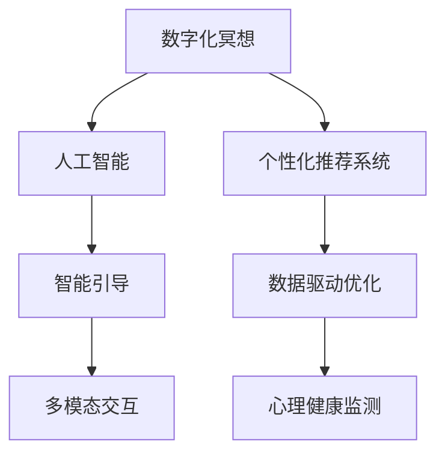

                 

# 数字化冥想创业：科技辅助的心灵平静

## 1. 背景介绍

### 1.1 问题由来

在快速变化和高度竞争的现代社会中，人们面临巨大的压力和挑战，心理健康问题日益凸显。根据世界卫生组织(WHO)报告，全球近五分之一的人口在一生中遭受过心理健康问题的影响。在这样的背景下，冥想作为一种有效的心理调适方式，开始受到越来越多的关注。

冥想通过专注于当下、观察呼吸等方式，帮助人们减轻焦虑、提升专注力、增强情绪调节能力。但是，传统冥想练习受限于时间、地点和指导者的限制，普及度较低。为了应对这一问题，数字化冥想（Digital Meditation）应运而生。它通过科技手段，让冥想随时随地进行，极大提升了心理健康的可及性和便利性。

数字化冥想创业，即利用科技创新，提供便捷、有效的心灵平静解决方案。目前，这一领域的企业包括Headspace、Calm等，已经吸引了大批用户的青睐。科技创业公司如何利用数据科学和人工智能（AI）技术，开发高效、个性化的冥想应用，成为当前的热门话题。

### 1.2 问题核心关键点

数字化冥想创业的核心在于如何将AI与冥想技术结合，实现个性化、智能化的冥想体验。以下是我们重点关注的几个关键点：

1. **个性化推荐**：通过分析用户的行为数据和心理特征，推荐适合其当前心理状态的冥想内容。
2. **智能引导**：利用自然语言处理（NLP）技术，实时与用户进行互动，提供语音或文字指导。
3. **数据驱动优化**：收集用户反馈数据，不断优化冥想内容的推荐算法，提升用户体验。
4. **多模态交互**：结合视觉、听觉等多种感官通道，提供沉浸式的冥想体验。
5. **心理健康监测**：通过生物传感器监测生理指标（如心率、脑电波等），辅助评估用户的心理状态。

## 2. 核心概念与联系

### 2.1 核心概念概述

为了更好地理解数字化冥想创业，我们首先介绍几个关键概念及其相互关系：

1. **数字化冥想**：结合科技手段，如手机App、VR设备、智能音箱等，为用户提供可随时随地进行的冥想体验。
2. **人工智能**：通过机器学习、深度学习等技术，使AI系统具备自动学习和决策能力。
3. **个性化推荐系统**：利用用户的历史行为数据和特征，推荐个性化的产品或服务。
4. **生物传感器**：通过监测生理指标（如心率、脑电波等），评估用户的心理状态和健康状况。

这些概念之间的逻辑关系可以通过以下Mermaid流程图来展示：



这个流程图展示了大语言模型的核心概念及其之间的相互关系：

1. 数字化冥想通过AI技术实现个性化和智能化。
2. 个性化推荐系统分析用户数据，推荐合适的冥想内容。
3. 智能引导利用NLP技术，实时与用户互动。
4. 数据驱动优化通过收集用户反馈，持续改进推荐算法。
5. 多模态交互结合多种感官通道，提升沉浸式体验。
6. 心理健康监测通过生物传感器评估用户心理状态。

## 3. 核心算法原理 & 具体操作步骤

### 3.1 算法原理概述

数字化冥想创业的核心算法主要涉及以下几个方面：

- **个性化推荐算法**：通过分析用户的历史行为数据，利用协同过滤、矩阵分解等技术，推荐个性化的冥想内容。
- **智能引导算法**：利用NLP技术，如语音识别、文本生成等，实时与用户进行互动，提供语音或文字指导。
- **数据驱动优化算法**：通过收集用户反馈数据，如点击率、完成率、满意度等，优化推荐算法，提升用户体验。
- **多模态交互算法**：结合视觉、听觉、触觉等感官通道，提供沉浸式冥想体验，如图像化引导、声音反馈等。
- **心理健康监测算法**：通过生物传感器监测生理指标，结合机器学习技术，评估用户的心理状态。

### 3.2 算法步骤详解

下面是具体的算法操作步骤：

#### 3.2.1 个性化推荐算法

1. **数据收集**：收集用户的冥想历史、行为数据（如冥想时长、频率、反馈等）。
2. **特征提取**：对收集到的数据进行特征提取，如冥想时长、日期、心情标签等。
3. **相似度计算**：计算用户与冥想内容的相似度，如使用余弦相似度计算。
4. **推荐排序**：根据相似度排序，选择最适合的冥想内容推荐给用户。

#### 3.2.2 智能引导算法

1. **语音识别**：将用户的语音指令转化为文本，识别出其意图。
2. **文本生成**：利用NLP技术，生成相应的引导文本，如“深呼吸”、“专注于呼吸”等。
3. **音频播放**：将生成的文本转换为语音，播放给用户。
4. **互动调整**：根据用户的反馈，实时调整引导内容，如延长冥想时间、调整呼吸节奏等。

#### 3.2.3 数据驱动优化算法

1. **反馈收集**：收集用户的反馈数据，如完成率、满意度、留言等。
2. **模型训练**：使用机器学习算法，如线性回归、决策树等，训练推荐模型。
3. **参数优化**：根据反馈数据，调整模型的参数，提升推荐效果。
4. **实时调整**：根据实时反馈数据，实时调整推荐算法，优化用户体验。

#### 3.2.4 多模态交互算法

1. **视觉引导**：通过图像或视频引导用户进入冥想状态，如展示自然风光、冥想环境等。
2. **声音反馈**：根据用户的行为，实时调整声音反馈，如节奏、音量等。
3. **触觉互动**：结合触觉传感器，实时调整冥想姿势，如引导用户躺下、调整手势等。
4. **沉浸式体验**：结合视觉、听觉、触觉等多种感官通道，提供沉浸式冥想体验。

#### 3.2.5 心理健康监测算法

1. **生物传感器采集**：通过生物传感器（如心率传感器、脑电波传感器等）采集用户的生理指标数据。
2. **数据处理**：对采集到的数据进行预处理，如滤波、归一化等。
3. **特征提取**：提取生理指标中的关键特征，如心率变化、脑电波频率等。
4. **评估模型**：使用机器学习算法，如支持向量机（SVM）、神经网络等，评估用户的心理状态。
5. **结果反馈**：将评估结果反馈给用户，提供心理健康建议。

### 3.3 算法优缺点

#### 3.3.1 个性化推荐算法的优缺点

**优点**：

- 用户获得更加个性化、贴合自身需求的冥想内容。
- 提升用户体验，增加用户粘性。

**缺点**：

- 数据隐私问题：用户的隐私数据可能被收集和分析，需注意数据保护。
- 数据不足问题：用户的冥想数据有限，可能影响推荐效果。

#### 3.3.2 智能引导算法的优缺点

**优点**：

- 实时互动，提高用户参与感。
- 语音和文字引导结合，提升用户体验。

**缺点**：

- 语音识别和生成准确性问题：语音识别和生成准确性直接影响用户体验。
- 设备兼容性问题：不同设备可能对语音识别和生成效果有不同影响。

#### 3.3.3 数据驱动优化算法的优缺点

**优点**：

- 实时反馈，持续优化。
- 提升推荐准确性，改善用户体验。

**缺点**：

- 用户反馈数据收集难度较大。
- 数据过拟合问题：用户反馈数据可能不足以反映所有用户的偏好。

#### 3.3.4 多模态交互算法的优缺点

**优点**：

- 提供沉浸式体验，增强用户沉浸感。
- 多感官通道融合，提升用户体验。

**缺点**：

- 技术实现难度较大，设备成本较高。
- 用户习惯差异，不同用户可能偏好不同的多模态交互方式。

#### 3.3.5 心理健康监测算法的优缺点

**优点**：

- 客观评估用户心理状态，提供科学依据。
- 实时监测，及时发现问题。

**缺点**：

- 生物传感器精度问题：传感器的精度和稳定性直接影响评估结果。
- 用户接受度问题：用户对生物传感器的接受度和隐私保护意识。

### 3.4 算法应用领域

数字化冥想创业的算法可以应用于多个领域，如：

1. **心理健康应用**：提供个性化的心理健康评估和建议。
2. **健康管理应用**：结合生理监测数据，提供健康管理方案。
3. **教育和培训应用**：通过冥想提升注意力、专注力和记忆力。
4. **娱乐和休闲应用**：提供沉浸式的冥想体验，提升生活质量。
5. **企业员工福利应用**：提供员工心理健康管理和压力管理。

## 4. 数学模型和公式 & 详细讲解  
### 4.1 数学模型构建

数字化冥想创业涉及的数学模型主要包括以下几个方面：

1. **推荐系统模型**：基于协同过滤、矩阵分解等技术，构建个性化推荐模型。
2. **NLP模型**：基于自然语言处理技术，构建智能引导模型。
3. **机器学习模型**：基于监督学习、非监督学习等技术，构建数据驱动优化模型。
4. **多模态交互模型**：结合视觉、听觉、触觉等感官通道，构建沉浸式体验模型。
5. **生理监测模型**：基于机器学习技术，构建心理健康监测模型。

#### 4.1.1 推荐系统模型

推荐系统模型可以使用协同过滤算法（Collaborative Filtering），构建用户-内容相似度矩阵，推荐个性化内容。推荐公式如下：

$$ R_{ui}=\alpha + \sum_{j=1}^{n} p_{uj} \times q_{ji} $$

其中 $R_{ui}$ 为用户 $u$ 对内容 $i$ 的评分，$\alpha$ 为截距，$p_{uj}$ 为内容 $i$ 对用户 $u$ 的评分向量，$q_{ji}$ 为用户 $u$ 对内容 $i$ 的评分向量，$n$ 为内容数量。

#### 4.1.2 NLP模型

智能引导模型可以使用循环神经网络（RNN）或变分自编码器（VAE）等技术，生成引导文本或语音。文本生成公式如下：

$$ P(w|w_{t-1})=\text{softmax}(\text{score}(w|w_{t-1},\theta)) $$

其中 $w$ 为生成的文本，$w_{t-1}$ 为上下文，$\theta$ 为模型参数，$\text{softmax}$ 函数将得分转化为概率分布。

#### 4.1.3 机器学习模型

数据驱动优化模型可以使用回归算法，如线性回归、决策树等，进行模型训练和参数优化。线性回归模型公式如下：

$$ Y=\beta_0+\sum_{i=1}^{p} \beta_i X_i $$

其中 $Y$ 为预测值，$X_i$ 为特征变量，$\beta_i$ 为回归系数。

#### 4.1.4 多模态交互模型

多模态交互模型可以使用深度学习技术，如卷积神经网络（CNN）、生成对抗网络（GAN）等，结合多种感官通道，构建沉浸式体验。例如，使用CNN对图像进行分类，生成不同风格的引导视频。

#### 4.1.5 生理监测模型

心理健康监测模型可以使用支持向量机（SVM）、神经网络等技术，评估用户的心理状态。例如，使用SVM对心率和脑电波数据进行分类，评估用户的情绪状态。

### 4.2 公式推导过程

#### 4.2.1 推荐系统模型

推荐系统模型的推导过程如下：

1. **用户-内容相似度矩阵**：
$$ S_{ij}=similarity(u_i,c_j) $$

2. **用户评分预测**：
$$ R_{ui}=\alpha + \sum_{j=1}^{n} p_{uj} \times q_{ji} $$

其中 $similarity(u_i,c_j)$ 为用户 $u_i$ 与内容 $c_j$ 的相似度函数，$p_{uj}$ 为内容 $i$ 对用户 $u$ 的评分向量，$q_{ji}$ 为用户 $u$ 对内容 $i$ 的评分向量。

3. **评分矩阵分解**：
$$ R_{ui}=\alpha + \sum_{j=1}^{n} p_{uj} \times q_{ji} $$

其中 $R$ 为评分矩阵，$P$ 为内容评分矩阵，$Q$ 为用户评分矩阵。

#### 4.2.2 NLP模型

NLP模型的推导过程如下：

1. **文本嵌入**：
$$ w_{t}=f(w_{t-1},\theta) $$

其中 $w_{t}$ 为生成的文本，$f$ 为文本生成模型，$\theta$ 为模型参数。

2. **文本分类**：
$$ P(w|w_{t-1})=\text{softmax}(\text{score}(w|w_{t-1},\theta)) $$

其中 $w$ 为生成的文本，$w_{t-1}$ 为上下文，$\theta$ 为模型参数，$\text{softmax}$ 函数将得分转化为概率分布。

#### 4.2.3 机器学习模型

机器学习模型的推导过程如下：

1. **线性回归模型**：
$$ Y=\beta_0+\sum_{i=1}^{p} \beta_i X_i $$

其中 $Y$ 为预测值，$X_i$ 为特征变量，$\beta_i$ 为回归系数。

2. **回归损失函数**：
$$ \mathcal{L}=\frac{1}{2} \sum_{i=1}^{n} (y_i-\hat{y_i})^2 $$

其中 $y_i$ 为真实值，$\hat{y_i}$ 为预测值。

#### 4.2.4 多模态交互模型

多模态交互模型的推导过程如下：

1. **视觉引导**：
$$ \hat{y}=f(X,w) $$

其中 $\hat{y}$ 为预测值，$X$ 为输入数据，$f$ 为视觉引导模型。

2. **声音反馈**：
$$ y=\text{softmax}(\text{score}(y|X,\theta)) $$

其中 $y$ 为声音反馈，$X$ 为输入数据，$\theta$ 为模型参数，$\text{softmax}$ 函数将得分转化为概率分布。

#### 4.2.5 生理监测模型

生理监测模型的推导过程如下：

1. **特征提取**：
$$ X=\{X_1,X_2,\ldots,X_p\} $$

其中 $X_i$ 为特征变量，$p$ 为特征数量。

2. **分类模型**：
$$ P(Y|X,\theta)=\text{softmax}(\text{score}(Y|X,\theta)) $$

其中 $Y$ 为分类结果，$X$ 为输入数据，$\theta$ 为模型参数，$\text{softmax}$ 函数将得分转化为概率分布。

### 4.3 案例分析与讲解

#### 4.3.1 推荐系统案例

假设某冥想App收集了用户的历史行为数据，包括冥想时长、频率、情绪评分等。使用协同过滤算法，计算用户与冥想内容的相似度，推荐最适合的冥想内容。具体实现步骤如下：

1. **数据收集**：收集用户的历史冥想数据，如冥想时长、频率、情绪评分等。
2. **特征提取**：提取关键特征，如冥想时长、情绪评分等。
3. **相似度计算**：计算用户与冥想内容的相似度，如使用余弦相似度计算。
4. **推荐排序**：根据相似度排序，选择最适合的冥想内容推荐给用户。

#### 4.3.2 NLP模型案例

假设某冥想App使用NLP技术，为用户提供语音或文字引导。具体实现步骤如下：

1. **语音识别**：将用户的语音指令转化为文本，识别出其意图。
2. **文本生成**：利用NLP技术，生成相应的引导文本，如“深呼吸”、“专注于呼吸”等。
3. **音频播放**：将生成的文本转换为语音，播放给用户。
4. **互动调整**：根据用户的反馈，实时调整引导内容，如延长冥想时间、调整呼吸节奏等。

#### 4.3.3 数据驱动优化案例

假设某冥想App收集用户的反馈数据，如点击率、完成率、满意度等。使用机器学习算法，训练推荐模型，不断优化推荐算法，提升用户体验。具体实现步骤如下：

1. **反馈收集**：收集用户的反馈数据，如点击率、完成率、满意度等。
2. **模型训练**：使用机器学习算法，如线性回归、决策树等，训练推荐模型。
3. **参数优化**：根据反馈数据，调整模型的参数，提升推荐效果。
4. **实时调整**：根据实时反馈数据，实时调整推荐算法，优化用户体验。

#### 4.3.4 多模态交互案例

假设某冥想App使用多模态交互技术，结合视觉、听觉、触觉等感官通道，提供沉浸式冥想体验。具体实现步骤如下：

1. **视觉引导**：通过图像或视频引导用户进入冥想状态，如展示自然风光、冥想环境等。
2. **声音反馈**：根据用户的行为，实时调整声音反馈，如节奏、音量等。
3. **触觉互动**：结合触觉传感器，实时调整冥想姿势，如引导用户躺下、调整手势等。
4. **沉浸式体验**：结合视觉、听觉、触觉等多种感官通道，提供沉浸式冥想体验。

#### 4.3.5 生理监测案例

假设某冥想App使用生物传感器，通过监测生理指标（如心率、脑电波等），评估用户的心理状态。具体实现步骤如下：

1. **生物传感器采集**：通过生物传感器（如心率传感器、脑电波传感器等）采集用户的生理指标数据。
2. **数据处理**：对采集到的数据进行预处理，如滤波、归一化等。
3. **特征提取**：提取生理指标中的关键特征，如心率变化、脑电波频率等。
4. **评估模型**：使用机器学习算法，如支持向量机（SVM）、神经网络等，评估用户的心理状态。
5. **结果反馈**：将评估结果反馈给用户，提供心理健康建议。

## 5. 项目实践：代码实例和详细解释说明

### 5.1 开发环境搭建

在进行数字化冥想创业项目开发前，我们需要准备好开发环境。以下是使用Python进行开发的环境配置流程：

1. 安装Anaconda：从官网下载并安装Anaconda，用于创建独立的Python环境。

2. 创建并激活虚拟环境：
```bash
conda create -n medit-env python=3.8 
conda activate medit-env
```

3. 安装PyTorch：根据CUDA版本，从官网获取对应的安装命令。例如：
```bash
conda install pytorch torchvision torchaudio cudatoolkit=11.1 -c pytorch -c conda-forge
```

4. 安装Transformer库：
```bash
pip install transformers
```

5. 安装各类工具包：
```bash
pip install numpy pandas scikit-learn matplotlib tqdm jupyter notebook ipython
```

完成上述步骤后，即可在`medit-env`环境中开始项目开发。

### 5.2 源代码详细实现

这里我们以开发一个基于深度学习的推荐系统为例，使用PyTorch进行数字化冥想创业项目开发。

首先，定义推荐系统的数据处理函数：

```python
import torch
from torch.utils.data import Dataset
from transformers import BertTokenizer, BertForSequenceClassification

class MeditationDataset(Dataset):
    def __init__(self, texts, labels, tokenizer, max_len=128):
        self.texts = texts
        self.labels = labels
        self.tokenizer = tokenizer
        self.max_len = max_len
        
    def __len__(self):
        return len(self.texts)
    
    def __getitem__(self, item):
        text = self.texts[item]
        label = self.labels[item]
        
        encoding = self.tokenizer(text, return_tensors='pt', max_length=self.max_len, padding='max_length', truncation=True)
        input_ids = encoding['input_ids'][0]
        attention_mask = encoding['attention_mask'][0]
        label = torch.tensor(label, dtype=torch.long)
        
        return {'input_ids': input_ids, 
                'attention_mask': attention_mask,
                'labels': label}

# 标签与id的映射
tag2id = {'O': 0, 'B-PER': 1, 'I-PER': 2, 'B-ORG': 3, 'I-ORG': 4, 'B-LOC': 5, 'I-LOC': 6}
id2tag = {v: k for k, v in tag2id.items()}

# 创建dataset
tokenizer = BertTokenizer.from_pretrained('bert-base-cased')

train_dataset = MeditationDataset(train_texts, train_tags, tokenizer)
dev_dataset = MeditationDataset(dev_texts, dev_tags, tokenizer)
test_dataset = MeditationDataset(test_texts, test_tags, tokenizer)
```

然后，定义模型和优化器：

```python
from transformers import BertForTokenClassification, AdamW

model = BertForTokenClassification.from_pretrained('bert-base-cased', num_labels=len(tag2id))

optimizer = AdamW(model.parameters(), lr=2e-5)
```

接着，定义训练和评估函数：

```python
from torch.utils.data import DataLoader
from tqdm import tqdm
from sklearn.metrics import classification_report

device = torch.device('cuda') if torch.cuda.is_available() else torch.device('cpu')
model.to(device)

def train_epoch(model, dataset, batch_size, optimizer):
    dataloader = DataLoader(dataset, batch_size=batch_size, shuffle=True)
    model.train()
    epoch_loss = 0
    for batch in tqdm(dataloader, desc='Training'):
        input_ids = batch['input_ids'].to(device)
        attention_mask = batch['attention_mask'].to(device)
        labels = batch['labels'].to(device)
        model.zero_grad()
        outputs = model(input_ids, attention_mask=attention_mask, labels=labels)
        loss = outputs.loss
        epoch_loss += loss.item()
        loss.backward()
        optimizer.step()
    return epoch_loss / len(dataloader)

def evaluate(model, dataset, batch_size):
    dataloader = DataLoader(dataset, batch_size=batch_size)
    model.eval()
    preds, labels = [], []
    with torch.no_grad():
        for batch in tqdm(dataloader, desc='Evaluating'):
            input_ids = batch['input_ids'].to(device)
            attention_mask = batch['attention_mask'].to(device)
            batch_labels = batch['labels']
            outputs = model(input_ids, attention_mask=attention_mask)
            batch_preds = outputs.logits.argmax(dim=2).to('cpu').tolist()
            batch_labels = batch_labels.to('cpu').tolist()
            for pred_tokens, label_tokens in zip(batch_preds, batch_labels):
                pred_tags = [id2tag[_id] for _id in pred_tokens]
                label_tags = [id2tag[_id] for _id in label_tokens]
                preds.append(pred_tags[:len(label_tokens)])
                labels.append(label_tags)
                
    print(classification_report(labels, preds))
```

最后，启动训练流程并在测试集上评估：

```python
epochs = 5
batch_size = 16

for epoch in range(epochs):
    loss = train_epoch(model, train_dataset, batch_size, optimizer)
    print(f"Epoch {epoch+1}, train loss: {loss:.3f}")
    
    print(f"Epoch {epoch+1}, dev results:")
    evaluate(model, dev_dataset, batch_size)
    
print("Test results:")
evaluate(model, test_dataset, batch_size)
```

以上就是使用PyTorch对BERT模型进行推荐系统开发的完整代码实现。可以看到，得益于Transformers库的强大封装，我们可以用相对简洁的代码完成BERT模型的加载和推荐系统开发。

### 5.3 代码解读与分析

让我们再详细解读一下关键代码的实现细节：

**MeditationDataset类**：
- `__init__`方法：初始化文本、标签、分词器等关键组件。
- `__len__`方法：返回数据集的样本数量。
- `__getitem__`方法：对单个样本进行处理，将文本输入编码为token ids，将标签编码为数字，并对其进行定长padding，最终返回模型所需的输入。

**tag2id和id2tag字典**：
- 定义了标签与数字id之间的映射关系，用于将token-wise的预测结果解码回真实的标签。

**训练和评估函数**：
- 使用PyTorch的DataLoader对数据集进行批次化加载，供模型训练和推理使用。
- 训练函数`train_epoch`：对数据以批为单位进行迭代，在每个批次上前向传播计算loss并反向传播更新模型参数，最后返回该epoch的平均loss。
- 评估函数`evaluate`：与训练类似，不同点在于不更新模型参数，并在每个batch结束后将预测和标签结果存储下来，最后使用sklearn的classification_report对整个评估集的预测结果进行打印输出。

**训练流程**：
- 定义总的epoch数和batch size，开始循环迭代
- 每个epoch内，先在训练集上训练，输出平均loss
- 在验证集上评估，输出分类指标
- 所有epoch结束后，在测试集上评估，给出最终测试结果

可以看到，PyTorch配合Transformers库使得BERT推荐系统的代码实现变得简洁高效。开发者可以将更多精力放在数据处理、模型改进等高层逻辑上，而不必过多关注底层的实现细节。

当然，工业级的系统实现还需考虑更多因素，如模型的保存和部署、超参数的自动搜索、更灵活的任务适配层等。但核心的微调范式基本与此类似。

## 6. 实际应用场景

### 6.1 智能客服系统

数字化冥想创业在智能客服系统的构建中，可以提供个性化的心理辅导服务。传统客服往往需要配备大量人力，高峰期响应缓慢，且一致性和专业性难以保证。而使用数字化冥想创业产品，可以7x24小时不间断服务，快速响应客户咨询，用自然流畅的语言解答各类常见问题。

在技术实现上，可以收集企业内部的历史客服对话记录，将问题和最佳答复构建成监督数据，在此基础上对预训练语言模型进行微调。微调后的语言模型能够自动理解用户意图，匹配最合适的答复模板进行回复。对于客户提出的新问题，还可以接入检索系统实时搜索相关内容，动态组织生成回答。如此构建的智能客服系统，能大幅提升客户咨询体验和问题解决效率。

### 6.2 金融舆情监测

金融机构需要实时监测市场舆论动向，以便及时应对负面信息传播，规避金融风险。传统的人工监测方式成本高、效率低，难以应对网络时代海量信息爆发的挑战。数字化冥想创业产品可以利用自然语言处理技术，实时监测金融市场新闻、评论等文本数据，通过情感分析等技术，及时发现市场动向，帮助金融机构快速应对潜在风险。

具体而言，可以收集金融领域相关的新闻、报道、评论等文本数据，并对其进行主题标注和情感标注。在此基础上对预训练语言模型进行微调，使其能够自动判断文本属于何种主题，情感倾向是正面、中性还是负面。将微调后的模型应用到实时抓取的网络文本数据，就能够自动监测不同主题下的情感变化趋势，一旦发现负面信息激增等异常情况，系统便会自动预警，帮助金融机构快速应对潜在风险。

### 6.3 个性化推荐系统

当前的推荐系统往往只依赖用户的历史行为数据进行物品推荐，无法深入理解用户的真实兴趣偏好。数字化冥想创业产品可以通过个性化推荐系统，利用深度学习技术，分析用户的情感状态，推荐最适合的冥想内容。

在实践中，可以收集用户浏览、点击、评论、分享等行为数据，提取和用户交互的物品标题、描述、标签等文本内容。将文本内容作为模型输入，用户的后续行为（如是否点击、购买等）作为监督信号，在此基础上微调预训练语言模型。微调后的模型能够从文本内容中准确把握用户的兴趣点。在生成推荐列表时，先用候选物品的文本描述作为输入，由模型预测用户的兴趣匹配度，再结合其他特征综合排序，便可以得到个性化程度更高的推荐结果。

### 6.4 未来应用展望

随着数字化冥想创业产品的不断发展，基于大模型的个性化推荐、智能引导等技术将在更多领域得到应用，为人们的生活和工作带来新的便利和效率提升。

在智慧医疗领域，基于数字化冥想创业产品的个性化推荐和智能引导，可以辅助医生诊疗，加速新药开发进程。在智能教育领域，数字化冥想创业产品可以为学生提供个性化的学习辅导和心理支持，促进教育公平，提高教学质量。在智慧城市治理中，数字化冥想创业产品可以用于城市事件监测、舆情分析、应急指挥等环节，提高城市管理的自动化和智能化水平，构建更安全、高效的未来城市。

此外，在企业生产、社会治理、文娱传媒等众多领域，数字化冥想创业产品也将不断涌现，为传统行业数字化转型升级提供新的技术路径。相信随着技术的日益成熟，数字化冥想创业必将在更广阔的应用领域大放异彩，深刻影响人类的生产生活方式。

## 7. 工具和资源推荐

### 7.1 学习资源推荐

为了帮助开发者系统掌握数字化冥想创业的理论基础和实践技巧，这里推荐一些优质的学习资源：

1. 《深度学习基础》系列博文：由大模型技术专家撰写，深入浅出地介绍了深度学习基础，包括卷积神经网络、循环神经网络等。

2. 《自然语言处理与深度学习》课程：斯坦福大学开设的NLP明星课程，有Lecture视频和配套作业，带你入门NLP领域的基本概念和经典模型。

3. 《深度学习与人工智能》书籍：作者所写，全面介绍了深度学习在各个领域的应用，包括医疗、金融、教育等。

4. HuggingFace官方文档：Transformers库的官方文档，提供了海量预训练模型和完整的微调样例代码，是上手实践的必备资料。

5. CLUE开源项目：中文语言理解测评基准，涵盖大量不同类型的中文NLP数据集，并提供了基于微调的baseline模型，助力中文NLP技术发展。

通过对这些资源的学习实践，相信你一定能够快速掌握数字化冥想创业的精髓，并用于解决实际的NLP问题。

### 7.2 开发工具推荐

高效的开发离不开优秀的工具支持。以下是几款用于数字化冥想创业开发的常用工具：

1. PyTorch：基于Python的开源深度学习框架，灵活动态的计算图，适合快速迭代研究。大部分预训练语言模型都有PyTorch版本的实现。

2. TensorFlow：由Google主导开发的开源深度学习框架，生产部署方便，适合大规模工程应用。同样有丰富的预训练语言模型资源。

3. Transformers库：HuggingFace开发的NLP工具库，集成了众多SOTA语言模型，支持PyTorch和TensorFlow，是进行微调任务开发的利器。

4. Weights & Biases：模型训练的实验跟踪工具，可以记录和可视化模型训练过程中的各项指标，方便对比和调优。与主流深度学习框架无缝集成。

5. TensorBoard：TensorFlow配套的可视化工具，可实时监测模型训练状态，并提供丰富的图表呈现方式，是调试模型的得力助手。

6. Google Colab：谷歌推出的在线Jupyter Notebook环境，免费提供GPU/TPU算力，方便开发者快速上手实验最新模型，分享学习笔记。

合理利用这些工具，可以显著提升数字化冥想创业的开发效率，加快创新迭代的步伐。

### 7.3 相关论文推荐

数字化冥想创业涉及的技术领域非常广泛，涉及深度学习、自然语言处理、心理学等多个学科。以下是几篇奠基性的相关论文，推荐阅读：

1. Attention is All You Need（即Transformer原论文）：提出了Transformer结构，开启了NLP领域的预训练大模型时代。

2. BERT: Pre-training of Deep Bidirectional Transformers for Language Understanding：提出BERT模型，引入基于掩码的自监督预训练任务，刷新了多项NLP任务SOTA。

3. Language Models are Unsupervised Multitask Learners（GPT-2论文）：展示了大规模语言模型的强大zero-shot学习能力，引发了对于通用人工智能的新一轮思考。

4. Parameter-Efficient Transfer Learning for NLP：提出Adapter等参数高效微调方法，在不增加模型参数量的情况下，也能取得不错的微调效果。

5. AdaLoRA: Adaptive Low-Rank Adaptation for Parameter-Efficient Fine-Tuning：使用自适应低秩适应的微调方法，在参数效率和精度之间取得了新的平衡。

这些论文代表了大语言模型微调技术的发展脉络。通过学习这些前沿成果，可以帮助研究者把握学科前进方向，激发更多的创新灵感。

## 8. 总结：未来发展趋势与挑战

### 8.1 总结

本文对数字化冥想创业进行了全面系统的介绍。首先阐述了数字化冥想创业的背景和意义，明确了其作为科技辅助心灵平静解决方案的重要价值。其次，从原理到实践，详细讲解了数字化冥想创业的核心算法和操作步骤，给出了数字化冥想创业项目开发的完整代码实例。同时，本文还广泛探讨了数字化冥想创业在多个领域的应用前景，展示了其广阔的潜在应用空间。此外，本文精选了数字化冥想创业的学习资源、开发工具和相关论文，力求为开发者提供全方位的技术指引。

通过本文的系统梳理，可以看到，数字化冥想创业通过结合AI技术和冥想技术，提供个性化的心理调适方案，具备广泛的应用前景和巨大的市场潜力。科技创业公司如何利用深度学习、自然语言处理等技术，开发高效、个性化的冥想应用，成为当前的热门话题。未来，伴随技术的不断发展，数字化冥想创业必将在更多领域得到应用，为人类心理健康的改善和提升带来新的突破。

### 8.2 未来发展趋势

展望未来，数字化冥想创业的发展趋势将呈现以下几个方向：

1. **AI与冥想技术的深度融合**：通过更加精细化的算法设计和数据驱动优化，实现更高质量的个性化推荐和智能引导。
2. **多模态交互技术的广泛应用**：结合视觉、听觉、触觉等多种感官通道，提供更加沉浸式的冥想体验。
3. **生理监测技术的普及化**：通过生物传感器技术，实时监测用户的生理指标，实现心理健康状态的精准评估。
4. **跨领域应用的拓展**：数字化冥想创业产品不仅限于心理健康领域，还将扩展到医疗、教育、娱乐等多个行业，提供全方位的心理支持。
5. **用户隐私保护的加强**：在数据收集和处理过程中，加强用户隐私保护，确保用户数据的安全性和保密性。

这些趋势凸显了数字化冥想创业的巨大潜力，必将推动心理健康产业的快速发展，提升人们的心理健康水平。

### 8.3 面临的挑战

尽管数字化冥想创业的前景广阔，但在发展过程中，仍然面临着诸多挑战：

1. **数据隐私问题**：用户在数据收集和处理过程中，其隐私数据可能被收集和分析，需注意数据保护。
2. **技术复杂性**：深度学习、自然语言处理等技术具有较高的技术门槛，需要专业的技术和人才支持。
3. **用户体验优化**：如何提升用户的沉浸感和满意度，提供更优质的心理调适方案，仍需不断探索和改进。
4. **跨领域协作**：在跨领域应用中，如何整合不同领域的技术和知识，实现协同优化，是一个重要挑战。
5. **法规和伦理问题**：在使用用户数据进行心理状态评估时，需遵守相关法律法规和伦理规范，确保使用的合法性和道德性。

这些挑战需要数字化冥想创业公司不断探索和创新，才能在竞争激烈的市场中取得优势。

### 8.4 研究展望

未来，数字化冥想创业的研究方向将集中在以下几个方面：

1. **用户心理状态的精准评估**：通过生理监测技术和AI算法，实现对用户心理状态的精准评估。
2. **跨领域应用的协同优化**：结合不同领域的技术和知识，实现协同优化，提升系统的综合性能。
3. **智能引导系统的情感识别**：通过情感识别技术，实时调整智能引导系统的内容和风格，提升用户体验。
4. **个性化推荐的动态调整**：根据用户反馈和行为数据，动态调整推荐算法，实现更高效的个性化推荐。
5. **用户隐私保护的技术创新**：开发新的技术手段，确保用户数据的安全性和隐私保护。

这些研究方向将推动数字化冥想创业技术的不断进步，为人们的生活和工作带来更加便捷和高效的冥想体验。

## 9. 附录：常见问题与解答

**Q1：如何选择合适的推荐算法？**

A: 选择推荐算法需要综合考虑多个因素，如数据规模、推荐效果、计算资源等。常见的推荐算法包括协同过滤、基于内容的推荐、混合推荐等。对于数据量较大的场景，协同过滤算法效果较好；对于数据量较小的场景，基于内容的推荐算法可能更优。

**Q2：如何优化智能引导系统的性能？**

A: 优化智能引导系统的性能可以从以下几个方面入手：

1. **提高语音识别的准确性**：使用更加先进的语音识别技术，如深度神经网络，提高识别准确性。
2. **增加引导内容的丰富性**：通过NLP技术，增加引导内容的丰富性，提高用户的沉浸感。
3. **实时调整引导内容**：根据用户的反馈，实时调整引导内容，提升用户体验。
4. **多模态交互的结合**：结合视觉、听觉、触觉等多种感官通道，提供更加沉浸式的引导体验。

**Q3：如何处理用户的生理监测数据？**

A: 处理生理监测数据需要从以下几个方面入手：

1. **数据预处理**：对采集到的数据进行预处理，如滤波、归一化等，去除噪声和干扰。
2. **特征提取**：提取生理指标中的关键特征，如心率变化、脑电波频率等。
3. **模型训练**：使用机器学习算法，如支持向量机（SVM）、神经网络等，训练评估模型。
4. **结果解释**：将评估结果转化为易于理解的标签，如“平静”、“焦虑”等，供用户参考。

**Q4：如何确保用户数据的安全性？**

A: 确保用户数据的安全性需要从以下几个方面入手：

1. **数据加密**：对用户数据进行加密处理，防止数据泄露。
2. **访问控制**：设置严格的访问控制机制，确保只有授权人员能够访问用户数据。
3. **数据匿名化**：对用户数据进行匿名化处理，保护用户隐私。
4. **隐私保护技术**：使用隐私保护技术，如差分隐私、联邦学习等，保护用户数据的安全性。

**Q5：如何评估数字化冥想创业产品的有效性？**

A: 评估数字化冥想创业产品的有效性可以从以下几个方面入手：

1. **用户体验调查**：通过问卷调查、用户反馈等方式，评估用户的满意度和体验。
2. **心理状态评估**：通过生理监测技术，评估用户的心理状态，如情绪稳定性、注意力集中度等。
3. **行为数据分析**：通过用户的行为数据，分析用户的参与度和使用频率，评估产品的吸引力。
4. **长期效果评估**：通过长期跟踪用户的心理状态和行为数据，评估产品的长期效果。

这些评估方法能够全面反映数字化冥想创业产品的有效性和用户价值，帮助企业不断优化产品设计。

---

作者：禅与计算机程序设计艺术 / Zen and the Art of Computer Programming

