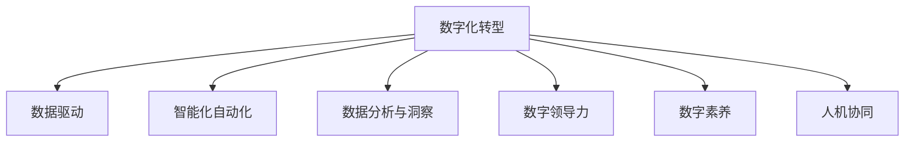

                 

# 数字化思维：全球脑时代的生存技能

> 关键词：数字化转型,数字领导力,数字素养,智能决策,未来工作,人机协作,自动化,数据分析,人工智能,人机协同

## 1. 背景介绍

### 1.1 问题由来
21世纪是数字化浪潮席卷全球的时代。随着信息技术的飞速发展，数字化转型已成为各行各业必然的选择。在这个全新的数字化时代，企业的生存和发展依赖于数字化思维和技能。然而，很多企业在数字化转型的道路上仍面临着诸多挑战。数字化思维的普及和数字化能力的提升，已成为当下最紧迫的问题。

### 1.2 问题核心关键点
数字化思维的核心在于利用数据和算法，推动企业从传统业务模式向数字化模式转型。这需要企业在以下几个关键领域具备一定的能力：

- 数据驱动的决策：企业需要从海量数据中提取价值，辅助决策制定。
- 智能化自动化：企业需要引入人工智能、机器学习等技术，提高业务流程的自动化水平。
- 数据分析与洞察：企业需要能够对数据进行深度分析，发现商业机会和潜在风险。
- 数字领导力：企业需要培养具备数字化思维的领导者，引领数字化变革。
- 数字素养：企业员工需要具备基本的数据技能和算法理解能力，以适应数字化环境。
- 人机协同：企业需要构建有效的人机协作机制，提高工作效率和质量。

这些能力共同构成了数字化思维的核心，是企业数字化转型的重要基石。然而，数字化思维的普及和数字化能力的提升，并非一蹴而就。需要从企业战略、组织文化、技术工具等多个层面进行全方位的建设。

### 1.3 问题研究意义
数字化思维的普及和数字化能力的提升，对于企业的长期发展和竞争优势至关重要：

1. 提升企业竞争力。数字化能力可以显著提高企业的运营效率和创新能力，使企业在激烈的市场竞争中脱颖而出。
2. 增强决策科学性。数字化思维能够帮助企业从海量数据中发现规律，做出更加科学的决策。
3. 改善客户体验。数字化技术可以提升客户交互的智能化水平，提升客户满意度和忠诚度。
4. 优化资源配置。数字化思维可以帮助企业更好地理解资源利用情况，做出更优的资源配置决策。
5. 推动产业升级。数字化技术可以推动传统产业的数字化转型，带来新的产业形态和商业模式。

## 2. 核心概念与联系

### 2.1 核心概念概述

为更好地理解数字化思维的原理和应用，本节将介绍几个密切相关的核心概念：

- **数字化转型(Digital Transformation)**：通过引入数字化技术和理念，使企业业务模式和运营方式发生根本性变革。
- **数据驱动(Data-Driven)**：通过数据进行业务决策，提高决策的科学性和准确性。
- **智能化自动化(Intelligent Automation)**：引入人工智能和机器学习技术，提高业务流程的自动化水平和效率。
- **数据分析与洞察(Analytics & Insights)**：利用数据分析技术，提取数据中的有价值信息，发现商业机会和潜在风险。
- **数字领导力(Digital Leadership)**：培养具备数字化思维的领导者，引领数字化变革。
- **数字素养(Digital Literacy)**：员工具备基本的数据技能和算法理解能力，以适应数字化环境。
- **人机协同(Human-Machine Collaboration)**：构建有效的人机协作机制，提高工作效率和质量。

这些核心概念之间的逻辑关系可以通过以下Mermaid流程图来展示：



这个流程图展示了数字化思维的各个核心概念及其之间的联系：

1. 数字化转型是整体目标，驱动其他各个概念的实现。
2. 数据驱动和智能化自动化是实现数字化转型的主要手段。
3. 数据分析与洞察提供数据驱动决策的数据支撑。
4. 数字领导力和数字素养是数字化转型的基础保障。
5. 人机协同提升数字化转型的效果和效率。

## 3. 核心算法原理 & 具体操作步骤
### 3.1 算法原理概述

数字化思维的核心算法原理，可以归结为以下几个方面：

- **数据采集与清洗**：采集企业内外部数据，并进行数据清洗和预处理，确保数据质量。
- **数据存储与管理**：将清洗后的数据存储到数据库或数据湖中，方便后续的分析和应用。
- **数据挖掘与分析**：利用数据挖掘和分析技术，从数据中提取有价值的信息，发现商业机会和潜在风险。
- **机器学习与预测**：引入机器学习和深度学习技术，构建预测模型，辅助决策制定。
- **决策支持系统**：构建决策支持系统，将数据和算法紧密结合，提供实时决策支持。
- **人机协同系统**：构建人机协同系统，实现智能决策和人工审核的有机结合。

这些算法原理构成了数字化思维的核心，帮助企业从数据中获取价值，实现数字化转型。

### 3.2 算法步骤详解

数字化思维的算法实施，通常包括以下关键步骤：

**Step 1: 数据采集与清洗**
- 确定所需数据来源，包括企业内外部数据，如销售数据、客户反馈、市场调研等。
- 采集数据后，进行初步的清洗和预处理，如去除重复、处理缺失值等。
- 使用ETL工具将数据加载到数据仓库或数据湖中，便于后续的分析和应用。

**Step 2: 数据存储与管理**
- 将清洗后的数据存储到高效可靠的数据库或数据湖中，如Hadoop、BigQuery等。
- 设计合适的数据模型和索引，提高数据查询和分析的效率。
- 采用数据治理措施，确保数据质量和安全。

**Step 3: 数据挖掘与分析**
- 选择合适的数据分析工具和算法，如SQL、Python等，对数据进行深入挖掘和分析。
- 利用统计分析和数据可视化工具，提取数据中的关键指标和趋势。
- 构建数据仪表盘，实时监测业务运营情况。

**Step 4: 机器学习与预测**
- 选择合适的机器学习算法和工具，如TensorFlow、Scikit-learn等，构建预测模型。
- 在模型训练集上训练模型，并在测试集上进行评估和优化。
- 将训练好的模型部署到生产环境中，实时进行预测和决策支持。

**Step 5: 决策支持系统**
- 设计合适的决策支持系统架构，将数据和算法紧密结合。
- 实现实时数据接入和分析，快速响应业务需求。
- 将决策结果可视化和反馈给业务人员，辅助其进行决策。

**Step 6: 人机协同系统**
- 构建人机协同系统，实现智能决策和人工审核的有机结合。
- 在重要决策环节引入人工审核机制，确保决策的科学性和准确性。
- 实现智能推荐和自动化工作流，提高工作效率和质量。

### 3.3 算法优缺点

数字化思维的算法实施，具有以下优点：

1. **数据驱动**：利用数据进行决策，提高决策的科学性和准确性。
2. **自动化效率**：引入自动化工具和算法，提高业务流程的效率和准确性。
3. **智能化预测**：利用机器学习和深度学习技术，构建预测模型，辅助决策制定。
4. **实时响应**：实现实时数据接入和分析，快速响应业务需求。
5. **人机协同**：实现智能决策和人工审核的有机结合，提高工作效率和质量。

同时，该算法也存在一定的局限性：

1. **数据质量**：数据质量和清洗的难度较大，尤其是海量数据环境。
2. **技术门槛**：需要具备一定的数据科学和算法技能，技术门槛较高。
3. **隐私和安全**：数据隐私和安全问题，需要采取合适的措施进行保护。
4. **复杂性**：算法实施过程复杂，需要跨部门协作和协调。

尽管存在这些局限性，但数字化思维的算法实施仍然是推动企业数字化转型的重要手段。未来相关研究的重点在于如何进一步降低技术门槛，提高数据质量，保障数据隐私和安全，同时优化人机协同机制，以实现更高效、更科学、更安全的数字化决策。

### 3.4 算法应用领域

数字化思维的算法实施，已经在多个领域得到了广泛应用，例如：

- 金融领域：利用大数据和机器学习技术，实现风险控制、信用评估、智能投顾等。
- 制造业：引入物联网和自动化技术，实现智能制造、质量检测、供应链优化等。
- 零售业：利用大数据和机器学习技术，实现客户分析、个性化推荐、库存管理等。
- 医疗健康：利用大数据和机器学习技术，实现疾病预测、患者管理、医疗影像分析等。
- 物流行业：引入物联网和自动化技术，实现智能调度、路径规划、仓库管理等。
- 智慧城市：利用大数据和机器学习技术，实现交通管理、环境监测、公共安全等。

除了这些经典领域外，数字化思维的算法实施还在更多场景中得到应用，如智能家居、智慧教育、智能农业等，为各行各业带来全新的发展机遇。

## 4. 数学模型和公式 & 详细讲解  
### 4.1 数学模型构建

数字化思维的数学模型构建，主要基于以下几类数据和算法：

- **数据集**：企业内外部数据，如销售数据、客户反馈、市场调研等。
- **算法模型**：数据挖掘算法（如聚类、分类、回归等）和机器学习算法（如线性回归、决策树、神经网络等）。

以销售数据分析为例，常见的数学模型包括：

- **聚类分析**：利用K-means等聚类算法，对销售数据进行分组和分析，发现不同客户群体的特征。
- **回归分析**：利用线性回归等算法，建立销售数据和影响因素之间的关系模型。
- **决策树**：利用决策树算法，构建销售数据预测模型，辅助决策制定。

这些数学模型通过算法和数据紧密结合，帮助企业从数据中提取有价值的信息，发现商业机会和潜在风险。

### 4.2 公式推导过程

以下我们以回归分析为例，推导线性回归的公式及其梯度下降算法的实现。

设销售数据为 $y=\beta_0 + \beta_1x_1 + \beta_2x_2 + \cdots + \beta_nx_n + \epsilon$，其中 $y$ 为销售量，$x_i$ 为影响因素，$\beta_i$ 为回归系数，$\epsilon$ 为随机误差。则线性回归的求解过程如下：

1. 最小二乘估计
$$
\hat{\beta} = \mathop{\arg\min}_{\beta} \sum_{i=1}^N (y_i - \beta_0 - \beta_1x_{1,i} - \beta_2x_{2,i} - \cdots - \beta_nx_{n,i})^2
$$

2. 求导并令梯度为0
$$
\frac{\partial}{\partial \beta_j} \sum_{i=1}^N (y_i - \beta_0 - \beta_1x_{1,i} - \beta_2x_{2,i} - \cdots - \beta_nx_{n,i})^2 = 0 \quad (j = 0,1,\cdots,n)
$$

3. 解方程组
$$
X^TX(\beta_0 + \beta_1x_1 + \beta_2x_2 + \cdots + \beta_nx_n) = X^Ty
$$
其中 $X=[1,x_{1,1},x_{2,1},\cdots,x_{n,1}]^T$ 为自变量矩阵，$y=[y_1,y_2,\cdots,y_n]^T$ 为目标变量向量。

4. 使用梯度下降算法更新参数
$$
\beta_{j,t+1} = \beta_{j,t} - \eta \frac{\partial}{\partial \beta_j} \sum_{i=1}^N (y_i - \beta_0 - \beta_1x_{1,i} - \beta_2x_{2,i} - \cdots - \beta_nx_{n,i})^2
$$

在得到线性回归模型的回归系数后，即可对新数据进行预测。具体实现代码如下：

```python
from sklearn.linear_model import LinearRegression
import numpy as np

# 创建样本数据
X = np.array([[1, 2], [3, 4], [5, 6], [7, 8], [9, 10]])
y = np.array([3, 5, 7, 9, 11])

# 训练模型
model = LinearRegression()
model.fit(X, y)

# 预测新数据
new_X = np.array([[11, 12]])
predicted_y = model.predict(new_X)
print(predicted_y)
```

以上是使用scikit-learn库实现线性回归模型的代码实现。可以看到，通过简单的代码，就可以实现线性回归模型的训练和预测，方便且高效。

### 4.3 案例分析与讲解

以金融领域的信用评估为例，分析数字化思维在实际应用中的具体实现。

假设某金融公司需要评估贷款申请人的信用风险，收集了申请人的年龄、收入、工作年限、信用历史等多维数据。利用线性回归模型，可以对这些数据进行建模，并预测申请人的信用风险等级。具体步骤如下：

1. 数据预处理：收集申请人数据，并进行数据清洗和预处理，如去除缺失值、处理异常值等。
2. 特征工程：选择和构造有意义的特征，如收入水平、信用历史等。
3. 模型训练：在训练集上训练线性回归模型，得到回归系数。
4. 模型评估：在验证集上评估模型性能，调整模型参数。
5. 模型应用：将训练好的模型应用于贷款申请的信用评估，预测申请人的信用风险等级。

在实际应用中，还可以结合决策树、随机森林等算法，提高信用评估模型的准确性和鲁棒性。

## 5. 项目实践：代码实例和详细解释说明
### 5.1 开发环境搭建

在进行数字化思维的算法实践前，我们需要准备好开发环境。以下是使用Python进行Scikit-learn开发的开发环境配置流程：

1. 安装Anaconda：从官网下载并安装Anaconda，用于创建独立的Python环境。

2. 创建并激活虚拟环境：
```bash
conda create -n sklearn-env python=3.8 
conda activate sklearn-env
```

3. 安装Scikit-learn和其他相关工具包：
```bash
pip install scikit-learn numpy pandas matplotlib
```

4. 安装各种机器学习库：
```bash
pip install tensorflow pytorch xgboost lightgbm catboost
```

5. 安装可视化工具：
```bash
pip install matplotlib seaborn
```

完成上述步骤后，即可在`sklearn-env`环境中开始算法实践。

### 5.2 源代码详细实现

下面我以销售数据分析为例，给出使用Scikit-learn库实现线性回归的PyTorch代码实现。

```python
import pandas as pd
from sklearn.linear_model import LinearRegression

# 加载数据集
data = pd.read_csv('sales_data.csv')

# 数据预处理
data = data.dropna()

# 划分训练集和验证集
train_data = data.sample(frac=0.8, random_state=0)
val_data = data.drop(train_data.index)

# 特征工程
X = train_data[['age', 'income', 'work_years']]
y = train_data['sales']

# 模型训练
model = LinearRegression()
model.fit(X, y)

# 模型评估
train_score = model.score(X, y)
val_score = model.score(val_data[['age', 'income', 'work_years']], val_data['sales'])
print(f'Train score: {train_score:.3f}, Val score: {val_score:.3f}')

# 模型应用
new_X = pd.DataFrame([[35, 10000, 10]], columns=['age', 'income', 'work_years'])
predicted_y = model.predict(new_X)
print(predicted_y)
```

以上代码展示了线性回归模型的实现过程，从数据预处理、模型训练到模型评估和预测，每一步都进行了详细的注释。

### 5.3 代码解读与分析

让我们再详细解读一下关键代码的实现细节：

**数据预处理**：
- `data = pd.read_csv('sales_data.csv')`：加载销售数据集。
- `data = data.dropna()`：去除缺失值。
- `train_data = data.sample(frac=0.8, random_state=0)`：将数据集随机分为训练集和验证集。

**特征工程**：
- `X = train_data[['age', 'income', 'work_years']]`：选择和构造特征。
- `y = train_data['sales']`：选择目标变量。

**模型训练**：
- `model = LinearRegression()`：创建线性回归模型。
- `model.fit(X, y)`：在训练集上训练模型。

**模型评估**：
- `train_score = model.score(X, y)`：计算训练集的准确率。
- `val_score = model.score(val_data[['age', 'income', 'work_years']], val_data['sales'])`：计算验证集的准确率。

**模型应用**：
- `new_X = pd.DataFrame([[35, 10000, 10]], columns=['age', 'income', 'work_years'])`：构造新的数据集。
- `predicted_y = model.predict(new_X)`：在新数据上预测销售量。

可以看到，Scikit-learn库的强大封装使得线性回归模型的实现变得简洁高效。开发者可以将更多精力放在数据处理、模型改进等高层逻辑上，而不必过多关注底层的实现细节。

当然，工业级的系统实现还需考虑更多因素，如模型的保存和部署、超参数的自动搜索、更灵活的特征工程等。但核心的算法实现基本与此类似。

## 6. 实际应用场景
### 6.1 智能客服系统

数字化思维的算法实施，可以广泛应用于智能客服系统的构建。传统客服往往需要配备大量人力，高峰期响应缓慢，且一致性和专业性难以保证。而使用数字化思维的算法，可以7x24小时不间断服务，快速响应客户咨询，用自然流畅的语言解答各类常见问题。

在技术实现上，可以收集企业内部的历史客服对话记录，将问题和最佳答复构建成监督数据，在此基础上对数字化思维的算法进行训练。训练好的模型能够自动理解用户意图，匹配最合适的答案模板进行回复。对于客户提出的新问题，还可以接入检索系统实时搜索相关内容，动态组织生成回答。如此构建的智能客服系统，能大幅提升客户咨询体验和问题解决效率。

### 6.2 金融舆情监测

金融机构需要实时监测市场舆论动向，以便及时应对负面信息传播，规避金融风险。传统的人工监测方式成本高、效率低，难以应对网络时代海量信息爆发的挑战。基于数字化思维的算法，金融舆情监测可以变得更加高效和智能化。

具体而言，可以收集金融领域相关的新闻、报道、评论等文本数据，并对其进行主题标注和情感标注。在此基础上对数字化思维的算法进行训练，使其能够自动判断文本属于何种主题，情感倾向是正面、中性还是负面。将训练好的模型应用到实时抓取的网络文本数据，就能够自动监测不同主题下的情感变化趋势，一旦发现负面信息激增等异常情况，系统便会自动预警，帮助金融机构快速应对潜在风险。

### 6.3 个性化推荐系统

当前的推荐系统往往只依赖用户的历史行为数据进行物品推荐，无法深入理解用户的真实兴趣偏好。基于数字化思维的算法，个性化推荐系统可以更好地挖掘用户行为背后的语义信息，从而提供更精准、多样的推荐内容。

在实践中，可以收集用户浏览、点击、评论、分享等行为数据，提取和用户交互的物品标题、描述、标签等文本内容。将文本内容作为模型输入，用户的后续行为（如是否点击、购买等）作为监督信号，在此基础上对数字化思维的算法进行训练。训练好的模型能够从文本内容中准确把握用户的兴趣点。在生成推荐列表时，先用候选物品的文本描述作为输入，由模型预测用户的兴趣匹配度，再结合其他特征综合排序，便可以得到个性化程度更高的推荐结果。

### 6.4 未来应用展望

随着数字化思维的算法不断发展，在更多领域得到应用，为传统行业带来变革性影响。

在智慧医疗领域，基于数字化思维的算法可以帮助医生快速诊断疾病，提供个性化的治疗方案。在智能教育领域，基于数字化思维的算法可以提供智能化的教学内容和评估反馈，因材施教，促进教育公平，提高教学质量。在智慧城市治理中，基于数字化思维的算法可以实现智能化的城市管理，提高城市运营效率和居民生活品质。

此外，在企业生产、社会治理、文娱传媒等众多领域，基于数字化思维的算法也将不断涌现，为传统行业带来新的发展机遇。相信随着算法的持续演进，数字化思维必将在更广泛的领域发挥作用，深刻影响人类的生产生活方式。

## 7. 工具和资源推荐
### 7.1 学习资源推荐

为了帮助开发者系统掌握数字化思维的理论基础和实践技巧，这里推荐一些优质的学习资源：

1. **《机器学习实战》**：机器学习领域的经典教材，详细介绍了机器学习算法的基本原理和实现方法。
2. **《Python数据分析》**：Python数据分析的经典教程，涵盖了数据清洗、数据可视化、数据分析等基本技能。
3. **Coursera的《数据科学专业》**：由Johns Hopkins大学开设的专业课程，系统介绍数据科学的基本概念和实践方法。
4. **Kaggle**：数据科学和机器学习的竞赛平台，提供大量数据集和模型，帮助开发者提升实战能力。
5. **Scikit-learn官方文档**：Scikit-learn库的官方文档，提供丰富的学习资源和样例代码。

通过对这些资源的学习实践，相信你一定能够快速掌握数字化思维的核心算法，并用于解决实际的业务问题。
###  7.2 开发工具推荐

高效的开发离不开优秀的工具支持。以下是几款用于数字化思维算法开发的常用工具：

1. **Jupyter Notebook**：强大的交互式编程环境，支持Python、R等多种语言，适合数据分析和算法开发。
2. **PyCharm**：功能强大的Python开发工具，提供代码调试、版本控制等功能，适合大规模开发项目。
3. **TensorFlow**：由Google主导的深度学习框架，支持分布式计算和自动微分，适合复杂模型的训练。
4. **PyTorch**：由Facebook主导的深度学习框架，易于使用，适合动态图模型和分布式训练。
5. **Scikit-learn**：Python数据分析和机器学习的库，提供丰富的算法实现，适合快速原型开发。
6. **Keras**：高级神经网络API，支持多种深度学习框架，易于使用和调试。

合理利用这些工具，可以显著提升数字化思维算法的开发效率，加快创新迭代的步伐。

### 7.3 相关论文推荐

数字化思维的算法发展源于学界的持续研究。以下是几篇奠基性的相关论文，推荐阅读：

1. **《线性回归模型》**：经典机器学习算法，详细介绍了线性回归模型的原理和实现方法。
2. **《决策树算法》**：经典的机器学习算法，详细介绍了决策树模型的原理和实现方法。
3. **《深度学习与大数据》**：深度学习和大数据领域的经典教材，详细介绍了深度学习的基本原理和实践方法。
4. **《强化学习》**：强化学习领域的经典教材，详细介绍了强化学习算法的基本原理和实现方法。
5. **《自然语言处理基础》**：自然语言处理领域的经典教材，详细介绍了NLP的基本概念和算法实现。

这些论文代表了大规模算法的发展脉络。通过学习这些前沿成果，可以帮助研究者把握学科前进方向，激发更多的创新灵感。

## 8. 总结：未来发展趋势与挑战

### 8.1 总结

本文对数字化思维的算法实施进行了全面系统的介绍。首先阐述了数字化思维的核心概念和应用意义，明确了数字化思维在企业数字化转型中的重要价值。其次，从原理到实践，详细讲解了数字化思维的数学模型和关键算法步骤，给出了算法实现的完整代码实例。同时，本文还广泛探讨了数字化思维在智能客服、金融舆情、个性化推荐等多个行业领域的应用前景，展示了数字化思维的巨大潜力。此外，本文精选了数字化思维的学习资源和开发工具，力求为读者提供全方位的技术指引。

通过本文的系统梳理，可以看到，数字化思维的算法实施是推动企业数字化转型的重要手段。这些算法的实现，能够在数据驱动、智能化自动化、数据分析与洞察、数字领导力、数字素养、人机协同等各个环节，为企业的数字化转型提供强有力的技术支撑。数字化思维的算法实施，已经成为未来企业发展的必由之路。

### 8.2 未来发展趋势

展望未来，数字化思维的算法实施将呈现以下几个发展趋势：

1. **数据驱动的决策**：数据将成为决策的基础，决策过程更加科学和透明。
2. **智能化自动化**：自动化工具和算法将变得更加智能和高效，实现无人值守的智能运营。
3. **数据分析与洞察**：数据分析和洞察技术将更加先进，帮助企业从海量数据中提取更多价值。
4. **数字领导力**：具备数字化思维的领导者将更加受到重视，引领企业数字化转型。
5. **数字素养**：员工将具备更高的数字化技能和素养，适应数字化环境。
6. **人机协同**：人机协同系统将更加智能和高效，实现智能决策和人工审核的有机结合。

这些趋势凸显了数字化思维的算法实施在企业数字化转型中的重要地位。这些方向的探索发展，必将进一步提升企业运营效率和创新能力，为企业的长期发展提供坚实的基础。

### 8.3 面临的挑战

尽管数字化思维的算法实施已经取得了显著成效，但在迈向更加智能化、普适化应用的过程中，仍面临诸多挑战：

1. **数据质量**：数据质量和清洗的难度较大，尤其是海量数据环境。
2. **技术门槛**：需要具备一定的数据科学和算法技能，技术门槛较高。
3. **隐私和安全**：数据隐私和安全问题，需要采取合适的措施进行保护。
4. **复杂性**：算法实施过程复杂，需要跨部门协作和协调。
5. **资源瓶颈**：算力、内存、存储等资源消耗较大，需要合理优化。

尽管存在这些挑战，但数字化思维的算法实施仍然是推动企业数字化转型的重要手段。未来相关研究的重点在于如何进一步降低技术门槛，提高数据质量，保障数据隐私和安全，同时优化人机协同机制，以实现更高效、更科学、更安全的数字化决策。

### 8.4 研究展望

面对数字化思维的算法实施所面临的挑战，未来的研究需要在以下几个方面寻求新的突破：

1. **探索无监督和半监督学习**：摆脱对大规模标注数据的依赖，利用自监督学习、主动学习等无监督和半监督范式，最大限度利用非结构化数据，实现更加灵活高效的算法实施。
2. **研究参数高效和计算高效的算法**：开发更加参数高效的算法，在固定大部分模型参数的同时，只更新极少量的任务相关参数。同时优化算法的计算图，减少前向传播和反向传播的资源消耗，实现更加轻量级、实时性的算法实施。
3. **融合因果和对比学习范式**：通过引入因果推断和对比学习思想，增强算法的建立稳定因果关系的能力，学习更加普适、鲁棒的数据表示。
4. **引入更多先验知识**：将符号化的先验知识，如知识图谱、逻辑规则等，与神经网络模型进行巧妙融合，引导算法学习更准确、合理的语言表示。同时加强不同模态数据的整合，实现视觉、语音等多模态信息与文本信息的协同建模。
5. **结合因果分析和博弈论工具**：将因果分析方法引入算法实施，识别出算法的决策关键特征，增强输出解释的因果性和逻辑性。借助博弈论工具刻画人机交互过程，主动探索并规避算法的脆弱点，提高系统稳定性。
6. **纳入伦理道德约束**：在算法实施目标中引入伦理导向的评估指标，过滤和惩罚有偏见、有害的输出倾向。同时加强人工干预和审核，建立算法的监管机制，确保输出符合人类价值观和伦理道德。

这些研究方向的探索，必将引领数字化思维的算法实施迈向更高的台阶，为构建安全、可靠、可解释、可控的智能系统铺平道路。面向未来，数字化思维的算法实施还需要与其他人工智能技术进行更深入的融合，如知识表示、因果推理、强化学习等，多路径协同发力，共同推动自然语言理解和智能交互系统的进步。只有勇于创新、敢于突破，才能不断拓展算法的边界，让智能技术更好地造福人类社会。

## 9. 附录：常见问题与解答

**Q1：数字化思维是否适用于所有业务场景？**

A: 数字化思维的核心在于数据驱动的决策，适用于任何需要基于数据进行决策的业务场景。然而，不同业务场景的数据质量和算法需求不同，需要根据具体场景进行适配和优化。

**Q2：数字化思维的算法实施过程中如何确保数据质量？**

A: 确保数据质量需要从数据采集、数据清洗、数据存储等多个环节进行严格控制。数据清洗可以采用ETL工具进行预处理，确保数据的完整性和一致性。数据存储可以采用高效可靠的数据库和数据湖，确保数据的可访问性和安全性。

**Q3：数字化思维的算法实施过程中如何降低技术门槛？**

A: 降低技术门槛可以从以下几个方面入手：提供简单易用的开发工具和框架，如Scikit-learn、TensorFlow等；提供丰富的学习资源和样例代码，如Kaggle、Coursera等；提供高效的数据预处理和特征工程工具，如Pandas、NumPy等。

**Q4：数字化思维的算法实施过程中如何保障数据隐私和安全？**

A: 保障数据隐私和安全需要采取以下措施：采用数据脱敏、加密等技术，确保数据在存储和传输过程中的安全；建立严格的数据访问控制和权限管理机制，确保只有授权人员才能访问数据；建立数据使用审计和监控机制，确保数据使用的合规性和安全性。

**Q5：数字化思维的算法实施过程中如何优化资源消耗？**

A: 优化资源消耗可以从以下几个方面入手：采用高效的算法实现，如参数高效的算法、分布式计算等；采用高效的计算工具和框架，如PyTorch、TensorFlow等；采用数据压缩和存储优化技术，如稀疏化存储、混合精度训练等。

这些常见问题的解答，可以帮助企业更好地理解和实施数字化思维的算法，解决实际业务中的难题。数字化思维的算法实施，需要企业在数据质量、技术门槛、数据隐私、资源消耗等多个方面进行全面的优化，才能实现高效、科学、安全的数字化决策。面向未来，数字化思维必将成为企业数字化转型的重要手段，为企业的长期发展和竞争优势提供坚实的基础。

