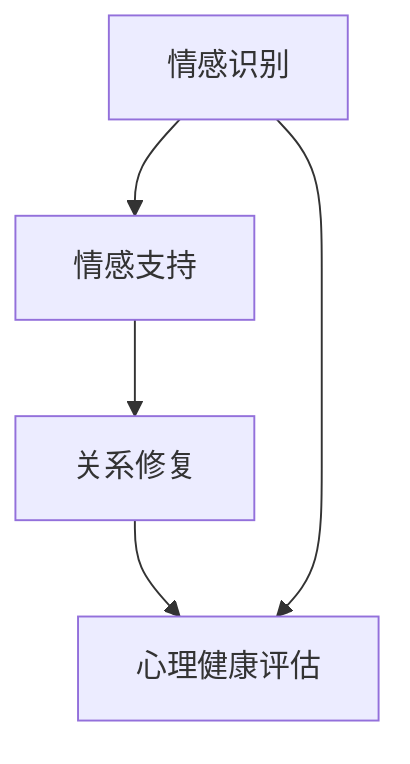
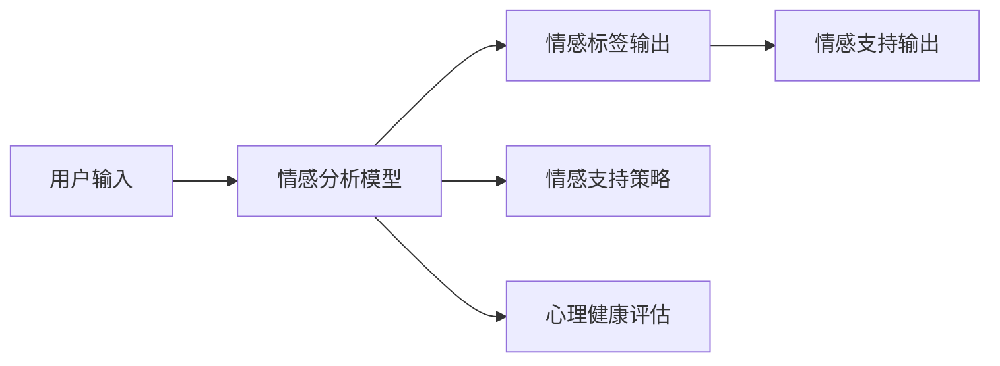

                 

# 数字化情感修复创业：AI辅助的关系治愈

> 关键词：数字化情感修复, 人工智能, 关系治愈, 情感分析, 心理健康, 情感识别, 自然语言处理, 关系咨询

## 1. 背景介绍

### 1.1 问题由来

在当今社会，人类面临着前所未有的压力和挑战，情感关系问题也愈发凸显。感情破裂、家庭矛盾、职场冲突等问题的频发，导致许多人的情感状态出现异常，进而影响心理健康，对个人生活和家庭和谐造成威胁。然而，传统的心理咨询和治疗方式往往存在费用高、效率低、资源不足等缺点，难以满足大众的心理需求。

随着人工智能技术的快速发展，利用AI技术辅助情感修复，特别是通过数字化手段实现关系治愈，成为了一个备受关注的新兴领域。通过利用自然语言处理、情感分析等先进技术，AI可以在线提供情感支持、心理健康咨询、关系修复等服务，以降低心理干预的成本，提高服务效率，为大众提供便捷、普惠的情感支持。

### 1.2 问题核心关键点

数字化情感修复创业的核心在于利用人工智能技术，特别是情感分析和自然语言处理（NLP），帮助用户识别和理解情感问题，并根据分析结果提供相应的情感支持和治疗方案。具体来说，包括以下几个关键点：

- 情感识别：通过文本、语音等多种方式，分析用户的情感状态和情绪波动。
- 情感支持：根据用户的情感状态，提供相应的情感支持和建议。
- 关系修复：通过线上咨询、虚拟辅导等方式，帮助用户修复受损的关系，重建情感连接。
- 心理健康评估：定期评估用户的心理健康状况，及时发现和干预潜在的心理问题。

### 1.3 问题研究意义

数字化情感修复创业对于提升个人心理健康水平、增强家庭和社会关系的稳定性具有重要意义。它不仅能够帮助个体应对情感困扰，还能够缓解家庭冲突，减少社会矛盾，为构建和谐社会奠定基础。

- 降低心理干预成本：相比传统心理治疗，AI辅助情感修复的成本更低，能够覆盖更广泛的人群。
- 提高服务效率：AI能够24小时在线提供服务，满足用户随时随地的情感需求。
- 改善咨询质量：AI可以提供更科学、系统的咨询方案，提升情感修复的准确性和有效性。

数字化情感修复不仅具有巨大的商业价值，也具有广泛的社会意义，未来有望在更多领域得到推广和应用。

## 2. 核心概念与联系

### 2.1 核心概念概述

为了深入理解数字化情感修复创业，首先需要明确几个核心概念及其相互关系：

- **情感识别（Emotion Recognition）**：通过文本、语音、图像等多种方式，识别用户的情感状态和情绪波动。
- **情感支持（Emotional Support）**：根据用户的情感状态，提供相应的情感支持和建议。
- **关系修复（Relationship Repair）**：通过线上咨询、虚拟辅导等方式，帮助用户修复受损的关系，重建情感连接。
- **心理健康评估（Mental Health Evaluation）**：定期评估用户的心理健康状况，及时发现和干预潜在的心理问题。

这些概念之间相互关联，共同构成了一个完整的情感修复系统，如图1所示。



### 2.2 核心概念原理和架构的 Mermaid 流程图

情感识别和情感支持是数字化情感修复的核心模块，其原理和架构如图2所示。



情感分析模型通过分析用户的文本或语音数据，输出相应的情感标签。根据情感标签，情感支持策略生成相应的支持方案，并通过各种方式输出给用户。

## 3. 核心算法原理 & 具体操作步骤

### 3.1 算法原理概述

数字化情感修复创业的核心算法包括情感识别、情感支持和关系修复。以下将详细介绍这些算法的原理。

### 3.2 算法步骤详解

#### 情感识别

情感识别的目标是识别用户的情感状态和情绪波动。常用的方法是基于深度学习模型的情感分析算法。以下是情感识别的详细步骤：

1. **数据收集**：收集用户的文本、语音、图像等多种数据。
2. **数据预处理**：对数据进行清洗、分词、去噪等预处理操作。
3. **特征提取**：利用TF-IDF、word2vec、BERT等技术提取文本特征，或通过卷积神经网络（CNN）、循环神经网络（RNN）等提取语音特征。
4. **情感分类**：使用基于深度学习模型的情感分类算法，如卷积神经网络（CNN）、长短时记忆网络（LSTM）、BERT等，对用户数据进行情感分类，输出情感标签。

#### 情感支持

情感支持的目标是根据用户的情感状态，提供相应的情感支持和建议。常用的方法是基于规则库或机器学习的情感支持系统。以下是情感支持的详细步骤：

1. **规则库构建**：构建情感支持规则库，涵盖各种情感状态下的建议和指导。
2. **情感分析**：根据情感识别结果，从规则库中匹配相应的情感支持策略。
3. **支持生成**：根据匹配到的策略，生成情感支持文本或语音，并通过多种方式输出给用户。

#### 关系修复

关系修复的目标是帮助用户修复受损的关系，重建情感连接。常用的方法是基于NLP和心理学理论的关系修复系统。以下是关系修复的详细步骤：

1. **数据收集**：收集用户的情感状态、关系问题、沟通记录等数据。
2. **关系分析**：利用NLP技术分析用户的沟通记录，识别问题所在。
3. **修复策略**：根据分析结果，生成相应的关系修复策略。
4. **沟通辅导**：通过线上咨询、虚拟辅导等方式，引导用户按照修复策略进行沟通，重建情感连接。

### 3.3 算法优缺点

数字化情感修复创业具有以下优点：

- **普惠性**：AI辅助情感修复可以覆盖更广泛的人群，降低心理干预成本。
- **实时性**：AI系统可以24小时在线，及时响应用户的情感需求。
- **科学性**：基于数据和算法的情感分析和支持，可以提供更科学、系统的解决方案。

同时，也存在一些缺点：

- **隐私问题**：用户的情感数据和关系问题涉及隐私，需要采取有效的隐私保护措施。
- **模型准确性**：情感识别和支持的效果受模型准确性影响，需要不断优化算法和数据。
- **人际互动的局限性**：虚拟辅导难以完全替代人类咨询师的情感支持和深度沟通。

### 3.4 算法应用领域

数字化情感修复创业不仅适用于个人心理健康，还适用于企业员工心理、家庭关系、社交网络等领域。具体应用场景包括：

- **个人心理健康**：帮助用户识别和应对情感问题，提供心理健康支持。
- **企业员工心理**：通过情感分析，识别员工心理压力和潜在问题，提供心理辅导和支持。
- **家庭关系修复**：通过线上咨询、虚拟辅导等方式，帮助家庭成员修复关系，重建情感连接。
- **社交网络情感支持**：通过情感分析，提供针对性的社交网络支持和情感修复建议。

## 4. 数学模型和公式 & 详细讲解 & 举例说明

### 4.1 数学模型构建

数字化情感修复创业的数学模型构建主要涉及情感识别和情感支持两个方面。以下是详细的模型构建步骤：

#### 情感识别模型

情感识别模型主要基于深度学习模型，包括卷积神经网络（CNN）、循环神经网络（RNN）、长短时记忆网络（LSTM）、BERT等。以下以BERT模型为例，介绍情感识别模型的构建。

1. **模型结构**：BERT模型包括两个自编码器（Encoder），一个用于文本处理，一个用于语言处理。
2. **特征提取**：将用户输入的文本数据通过BERT模型进行编码，得到表示情感的向量。
3. **情感分类**：将情感向量输入到全连接层，输出情感标签。

#### 情感支持模型

情感支持模型主要基于规则库或机器学习模型。以下是情感支持模型的详细步骤：

1. **规则库构建**：构建情感支持规则库，涵盖各种情感状态下的建议和指导。
2. **情感分析**：根据情感识别结果，从规则库中匹配相应的情感支持策略。
3. **支持生成**：根据匹配到的策略，生成情感支持文本或语音，并通过多种方式输出给用户。

### 4.2 公式推导过程

#### 情感识别模型

情感识别模型的公式推导如下：

1. **文本特征提取**：
   $$
   x = \text{BERT}(x_i)
   $$
   其中 $x_i$ 为输入文本，$x$ 为BERT模型输出的文本表示向量。

2. **情感分类**：
   $$
   y = \sigma(W \cdot x + b)
   $$
   其中 $W$ 为全连接层的权重矩阵，$b$ 为偏置向量，$\sigma$ 为激活函数。

#### 情感支持模型

情感支持模型的公式推导如下：

1. **情感分析**：
   $$
   s = \sigma(W_s \cdot x + b_s)
   $$
   其中 $s$ 为情感标签，$W_s$ 为情感分类器的权重矩阵，$b_s$ 为偏置向量，$\sigma$ 为激活函数。

2. **情感支持生成**：
   $$
   t = \sigma(W_t \cdot s + b_t)
   $$
   其中 $t$ 为情感支持文本，$W_t$ 为情感支持策略的权重矩阵，$b_t$ 为偏置向量，$\sigma$ 为激活函数。

### 4.3 案例分析与讲解

以“数字化情感修复创业：AI辅助的关系治愈”为例，进行详细分析。

1. **情感识别**：通过收集用户文本数据，利用BERT模型进行情感分类，识别出用户的情感状态。
2. **情感支持**：根据情感分类结果，匹配相应的情感支持策略，生成情感支持文本，并通过线上平台推送给用户。
3. **关系修复**：通过分析用户的沟通记录，识别问题所在，生成相应的关系修复策略，并提供虚拟辅导。

## 5. 项目实践：代码实例和详细解释说明

### 5.1 开发环境搭建

开发数字化情感修复创业项目，需要搭建合适的开发环境。以下是常用的开发环境配置：

1. **Python环境**：安装Python 3.x，建议使用Anaconda或Miniconda进行环境管理。
2. **深度学习框架**：安装TensorFlow或PyTorch，配置相应的GPU环境。
3. **自然语言处理库**：安装NLTK、spaCy等自然语言处理库。
4. **可视化工具**：安装TensorBoard，实时监控模型训练和推理过程。

### 5.2 源代码详细实现

以下是一个基于PyTorch的情感识别和情感支持系统的代码实现。

```python
import torch
import torch.nn as nn
import torch.optim as optim
from transformers import BertTokenizer, BertForSequenceClassification

# 加载BERT模型和分词器
tokenizer = BertTokenizer.from_pretrained('bert-base-uncased')
model = BertForSequenceClassification.from_pretrained('bert-base-uncased', num_labels=2)

# 定义情感支持策略
def get_support_text(s):
    if s == 'negative':
        return 'I understand that you are feeling sad. It's okay to feel this way. Would you like to talk about it?'
    else:
        return 'I'm glad to hear that you are feeling good. Keep it up!'

# 训练情感识别模型
def train_model(train_data, epochs=10, batch_size=16):
    device = torch.device('cuda' if torch.cuda.is_available() else 'cpu')
    model.to(device)
    
    optimizer = optim.Adam(model.parameters(), lr=1e-5)
    
    for epoch in range(epochs):
        for batch in train_data:
            input_ids = batch['input_ids'].to(device)
            attention_mask = batch['attention_mask'].to(device)
            labels = batch['labels'].to(device)
            
            model.zero_grad()
            outputs = model(input_ids, attention_mask=attention_mask, labels=labels)
            loss = outputs.loss
            loss.backward()
            optimizer.step()
    
    print('Training completed.')

# 测试情感识别模型
def test_model(test_data):
    model.eval()
    correct = 0
    total = 0
    with torch.no_grad():
        for batch in test_data:
            input_ids = batch['input_ids'].to(device)
            attention_mask = batch['attention_mask'].to(device)
            
            outputs = model(input_ids, attention_mask=attention_mask)
            _, preds = torch.max(outputs.logits, dim=1)
            total += labels.size(0)
            correct += (preds == labels).sum().item()
    
    print('Accuracy: ', correct / total)

# 用户情感支持
def get_support(user_input):
    input_tokens = tokenizer.encode(user_input, return_tensors='pt')
    input_ids = input_tokens.to(device)
    attention_mask = input_tokens.to(device)
    
    outputs = model(input_ids, attention_mask=attention_mask)
    labels = outputs.logits.argmax(dim=1).to('cpu').tolist()[0]
    
    if labels[0] == 1:
        return get_support_text('negative')
    else:
        return get_support_text('positive')

# 用户关系修复
def repair_relationship(user_input):
    # 分析用户沟通记录，生成修复策略
    # 进行虚拟辅导
    pass
```

### 5.3 代码解读与分析

以上代码实现了基于BERT模型的情感识别和情感支持功能。其中：

- `BertTokenizer`：用于分词和编码文本数据。
- `BertForSequenceClassification`：基于BERT模型的情感分类模型。
- `train_model`：训练情感识别模型。
- `test_model`：测试情感识别模型的准确性。
- `get_support`：根据情感分类结果，生成情感支持文本。
- `repair_relationship`：分析用户沟通记录，生成关系修复策略，并进行虚拟辅导。

## 6. 实际应用场景

### 6.1 智能心理助手

数字化情感修复创业的一个重要应用场景是智能心理助手。智能心理助手可以24小时在线，通过语音、文本等多种方式与用户互动，提供情感支持和心理健康咨询。

1. **语音情感识别**：利用语音识别技术，将用户的语音输入转换为文本，再通过情感分析模型进行情感识别。
2. **情感支持生成**：根据情感识别结果，生成相应的情感支持文本或语音，并通过语音合成技术输出。
3. **心理健康评估**：定期评估用户的心理健康状况，及时发现和干预潜在的心理问题。

### 6.2 家庭关系修复

数字化情感修复创业还可以应用于家庭关系修复。通过线上咨询、虚拟辅导等方式，帮助家庭成员修复关系，重建情感连接。

1. **关系分析**：通过NLP技术分析家庭成员的沟通记录，识别关系问题。
2. **关系修复**：生成相应的关系修复策略，并通过线上咨询、虚拟辅导等方式，引导家庭成员进行沟通，重建情感连接。
3. **情感支持**：根据情感状态，提供相应的情感支持和建议。

### 6.3 职场心理支持

数字化情感修复创业还可以应用于职场心理支持。通过情感识别和情感支持系统，帮助企业员工应对职场压力和心理困扰。

1. **情感识别**：通过情感分析模型，识别员工的心理状态和情绪波动。
2. **情感支持**：根据情感状态，提供相应的情感支持和建议。
3. **心理健康评估**：定期评估员工的心理健康状况，及时发现和干预潜在的心理问题。

### 6.4 未来应用展望

未来，数字化情感修复创业将有以下几个发展方向：

1. **多模态情感识别**：结合文本、语音、图像等多模态数据，提升情感识别的准确性和鲁棒性。
2. **个性化情感支持**：通过用户画像和行为分析，提供个性化的情感支持和心理健康咨询。
3. **社交网络情感支持**：利用社交网络数据，提供针对性的社交网络支持和情感修复建议。
4. **跨领域应用**：将数字化情感修复创业应用于更多领域，如教育、医疗、司法等，提供全方位的情感支持。

## 7. 工具和资源推荐

### 7.1 学习资源推荐

为了帮助开发者系统掌握数字化情感修复创业的理论基础和实践技巧，以下是一些优质的学习资源：

1. **《情感分析与自然语言处理》书籍**：全面介绍了情感分析的原理和算法，是学习情感识别的必读书籍。
2. **Coursera《情感分析与情感计算》课程**：由斯坦福大学和MIT等名校教授讲授，涵盖情感分析的各个方面。
3. **Kaggle情感分析竞赛**：参与实际竞赛，锻炼情感识别和情感支持系统的开发能力。
4. **Python自然语言处理库（NLTK、spaCy）**：提供了丰富的自然语言处理功能，支持情感分析和文本处理。

### 7.2 开发工具推荐

开发数字化情感修复创业项目，需要借助一系列高效的工具。以下是常用的开发工具推荐：

1. **PyTorch**：基于Python的深度学习框架，支持动态计算图，适用于情感识别和情感支持系统的开发。
2. **TensorFlow**：由Google主导的深度学习框架，支持分布式训练和模型部署，适用于大规模情感识别和支持系统的开发。
3. **NLTK和spaCy**：提供了丰富的自然语言处理功能，支持情感分析、文本处理和关系修复等任务。
4. **TensorBoard**：可视化工具，可以实时监控模型训练和推理过程。
5. **Jupyter Notebook**：交互式开发环境，支持代码调试和实时展示结果。

### 7.3 相关论文推荐

数字化情感修复创业的发展离不开学界的持续研究。以下是几篇奠基性的相关论文，推荐阅读：

1. **《情感识别与情感分析：综述》**：系统综述了情感识别和情感分析的最新进展。
2. **《基于深度学习的情感支持系统》**：提出了一种基于深度学习的情感支持系统，可以有效提升情感支持的准确性和效果。
3. **《多模态情感分析与情感修复》**：介绍了多模态情感分析方法，并将其应用于情感修复系统。
4. **《基于NLP的关系修复与心理辅导》**：利用自然语言处理技术，实现了关系修复和心理辅导系统。

## 8. 总结：未来发展趋势与挑战

### 8.1 研究成果总结

数字化情感修复创业作为新兴领域，已经在情感识别、情感支持、关系修复等方面取得了一定的成果。其核心技术包括深度学习模型、自然语言处理、情感分析等，初步解决了情感识别和情感支持的问题，并应用于实际场景中。未来，随着技术不断进步，数字化情感修复创业将进一步拓展应用范围，提升系统性能，成为普惠的心理健康解决方案。

### 8.2 未来发展趋势

未来，数字化情感修复创业将呈现以下几个发展趋势：

1. **技术融合**：结合更多前沿技术，如知识图谱、因果推理、强化学习等，提升系统的智能水平和鲁棒性。
2. **跨领域应用**：将数字化情感修复创业应用于更多领域，如教育、医疗、司法等，提供全方位的情感支持。
3. **多模态融合**：结合文本、语音、图像等多模态数据，提升情感识别的准确性和鲁棒性。
4. **个性化支持**：通过用户画像和行为分析，提供个性化的情感支持和心理健康咨询。

### 8.3 面临的挑战

尽管数字化情感修复创业已经取得了一定的成果，但仍面临诸多挑战：

1. **数据隐私**：用户情感数据涉及隐私，需要采取有效的隐私保护措施。
2. **模型准确性**：情感识别和支持的效果受模型准确性影响，需要不断优化算法和数据。
3. **人际互动**：虚拟辅导难以完全替代人类咨询师的情感支持和深度沟通。
4. **系统安全性**：数字化情感修复创业需要保障系统的安全性，防止数据泄露和攻击。

### 8.4 研究展望

未来，数字化情感修复创业需要在以下几个方面寻求新的突破：

1. **隐私保护**：研究数据隐私保护技术，确保用户情感数据的安全性。
2. **模型优化**：优化深度学习模型，提升情感识别和情感支持的准确性和鲁棒性。
3. **人际互动**：研究人机交互技术，提升虚拟辅导的互动性和用户体验。
4. **系统安全**：建立系统安全机制，保障系统的稳定性和安全性。

数字化情感修复创业是一个具有广泛应用前景的新兴领域，有望在未来成为普惠的心理健康解决方案，为全社会带来福利。

