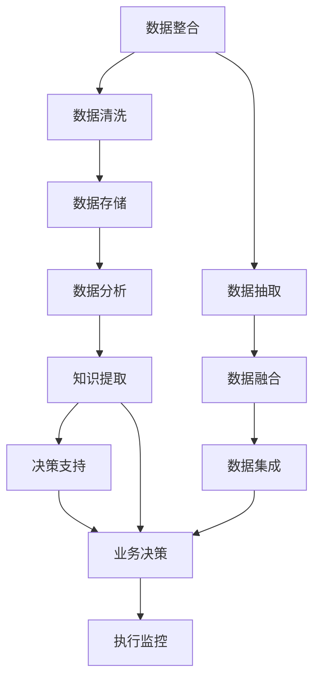

                 

# 数字化洞察力：AI增强的问题解决能力

## 1. 背景介绍

### 1.1 问题由来

随着信息技术的快速发展和广泛应用，企业运营和决策方式发生了翻天覆地的变化。数字化转型已成为企业提升竞争力和创新能力的关键驱动力之一。然而，尽管数字化已经渗透到企业运营的各个环节，但如何有效地利用数据洞察力来支撑决策，仍然是一个复杂的挑战。

### 1.2 问题核心关键点

问题核心关键点在于如何通过数据驱动的方式，提升企业的问题解决能力和决策效率。当前，尽管数据技术已经较为成熟，但在数据分析和应用方面还存在诸多挑战：

- **数据整合难度大**：不同数据源、不同格式的数据，难以有效整合和利用。
- **数据质量问题**：数据缺失、噪声、异常等问题，影响数据分析的准确性。
- **数据处理复杂性高**：数据量大、实时性要求高，对技术和资源的需求不断增加。
- **知识获取困难**：企业难以从海量数据中快速获取有价值的信息和知识。
- **决策质量不确定性**：数据和模型驱动的决策，可能受限于算法偏见、模型过拟合等问题。

因此，需要探索和应用人工智能技术，特别是增强智能问题解决能力（AI Augmented Problem Solving, AAPS），以克服这些挑战，提升企业的数据洞察力和决策能力。

### 1.3 问题研究意义

研究AI增强问题解决能力，对提升企业的数据洞察力和决策效率具有重要意义：

- **优化决策过程**：通过人工智能技术，对海量数据进行高效分析，帮助决策者更快、更准地做出决策。
- **提高响应速度**：自动化数据分析和处理，快速响应市场变化和需求。
- **降低人力成本**：AI可以自动执行重复性数据分析和计算任务，降低人工投入。
- **增强预测能力**：利用机器学习模型，预测市场趋势和业务表现，辅助长期规划。
- **提升问题解决能力**：通过自然语言处理和增强学习，解决复杂的问题和挑战。

## 2. 核心概念与联系

### 2.1 核心概念概述

为更好地理解AI增强问题解决能力，本节将介绍几个密切相关的核心概念：

- **人工智能（AI）**：涵盖机器学习、深度学习、自然语言处理、计算机视觉等多个技术领域，能够模拟人类智能过程，进行问题解决和决策支持。
- **增强智能（AIP）**：通过人类专家的知识、经验和智慧，来增强人工智能系统的功能和性能。
- **问题解决能力（Problem Solving）**：指通过分析和综合现有信息，寻找有效解决方案的能力，涉及逻辑推理、搜索算法、优化算法等多个方面。
- **数据洞察力（Data Insight）**：通过数据挖掘、分析、可视化等方式，发现和理解数据背后的规律和趋势，辅助决策。

这些核心概念之间紧密联系，共同构成了AI增强问题解决能力的技术框架。通过理解这些概念，可以更好地把握AI技术在企业决策中的应用潜力。

### 2.2 核心概念原理和架构的 Mermaid 流程图



这个流程图展示了AI增强问题解决能力的核心步骤和关键组件：

1. **数据整合**：从不同来源抽取和集成数据。
2. **数据清洗**：处理数据缺失、噪声、异常等问题，保证数据质量。
3. **数据存储**：采用分布式存储系统，保证数据的可靠性和可访问性。
4. **数据分析**：利用统计分析、机器学习等技术，从数据中提取有价值的信息。
5. **知识提取**：通过自然语言处理、语义分析等技术，从数据中抽取知识图谱、规则库等信息。
6. **决策支持**：结合人类专家的知识和机器学习模型，辅助决策。
7. **执行监控**：监控决策执行效果，实时调整策略。

## 3. 核心算法原理 & 具体操作步骤

### 3.1 算法原理概述

AI增强问题解决能力的关键在于利用人工智能技术，对数据进行高效分析和处理，并结合人类专家的知识，生成可行的解决方案。算法原理主要包括以下几个方面：

- **数据预处理**：包括数据清洗、特征工程、数据转换等，将原始数据转化为可用于分析的格式。
- **模型训练**：利用机器学习模型，如回归、分类、聚类等，从数据中学习规律和模式。
- **知识抽取**：通过自然语言处理技术，从文本数据中提取知识和规则。
- **模型融合**：结合多个模型和算法，优化预测效果和决策性能。
- **解释性增强**：提高模型的可解释性，增强决策的可信度和透明度。

### 3.2 算法步骤详解

以下是基于AI增强问题解决能力的算法具体操作步骤：

**Step 1: 数据准备与整合**

- **数据收集**：从内部系统、第三方数据源等渠道，收集所需数据。
- **数据抽取**：通过ETL工具，从各种数据源中抽取数据。
- **数据融合**：将来自不同数据源的数据进行整合，形成统一的数据集。

**Step 2: 数据清洗与预处理**

- **数据清洗**：处理数据中的缺失值、噪声、异常等问题。
- **特征工程**：根据业务需求，选择合适的特征，并进行数据转换和编码。
- **数据增强**：通过生成数据、数据合成等方法，丰富数据集。

**Step 3: 模型训练与优化**

- **选择合适的模型**：根据问题类型，选择合适的机器学习或深度学习模型，如决策树、随机森林、神经网络等。
- **模型训练**：利用训练数据集，训练模型，并优化模型参数。
- **模型评估**：使用验证集或测试集，评估模型性能，并进行必要的调整。

**Step 4: 知识抽取与融合**

- **知识抽取**：通过自然语言处理技术，如实体抽取、关系抽取、文本分类等，从文本数据中提取知识和规则。
- **知识融合**：将抽取的知识与模型预测结果进行融合，生成更加综合的解决方案。

**Step 5: 决策支持与执行**

- **决策生成**：结合人类专家的知识和机器学习模型，生成可行的决策方案。
- **执行监控**：实时监控决策执行效果，并根据反馈进行调整。

### 3.3 算法优缺点

AI增强问题解决能力具有以下优点：

- **高效性**：能够自动化处理大量数据，提升分析效率。
- **准确性**：利用机器学习模型的规律发现能力，提升决策的准确性。
- **灵活性**：能够结合人类专家的知识，提高决策的适应性和可操作性。
- **可扩展性**：能够处理不同类型和规模的数据，适应复杂业务场景。

同时，也存在一些缺点：

- **算法偏见**：模型可能学习到数据中的偏见，影响决策的公正性和公平性。
- **数据依赖性**：模型的性能受限于数据的质量和数量，对数据要求较高。
- **复杂度增加**：多模型融合、知识抽取等步骤，增加了系统的复杂度。
- **资源消耗大**：训练大模型、进行数据处理等，需要较大的计算资源和存储资源。

### 3.4 算法应用领域

AI增强问题解决能力在多个领域都有广泛的应用，以下是几个典型场景：

- **金融风险管理**：利用机器学习模型，预测市场风险和客户信用风险，辅助决策。
- **医疗诊断**：结合知识图谱和机器学习模型，辅助诊断疾病，推荐治疗方案。
- **供应链管理**：利用预测模型和优化算法，优化库存管理和物流调度。
- **市场营销**：通过数据分析和自然语言处理，挖掘客户需求，优化营销策略。
- **智能制造**：利用机器学习模型和数据可视化，提升生产效率和质量管理。
- **城市管理**：通过数据挖掘和智能分析，优化城市交通、环境治理等。

## 4. 数学模型和公式 & 详细讲解 & 举例说明

### 4.1 数学模型构建

本节将使用数学语言对AI增强问题解决能力的技术框架进行严格刻画。

设企业的数据集为 $D = \{(x_i, y_i)\}_{i=1}^N$，其中 $x_i$ 为输入特征，$y_i$ 为输出标签。

定义问题解决模型为 $M_\theta: X \rightarrow Y$，其中 $\theta$ 为模型参数，$X$ 为输入空间，$Y$ 为输出空间。

假设问题解决任务为二分类问题，则模型在输入 $x$ 上的预测结果为 $\hat{y} = M_{\theta}(x)$。问题解决模型的训练目标为最小化经验风险：

$$
\mathcal{L}(\theta) = \frac{1}{N} \sum_{i=1}^N \ell(\hat{y}_i, y_i)
$$

其中 $\ell(\hat{y}_i, y_i)$ 为损失函数，用于衡量模型预测结果与真实标签之间的差异。常见的损失函数包括交叉熵损失、均方误差损失等。

### 4.2 公式推导过程

以下以二分类问题为例，推导最小化交叉熵损失函数的计算公式：

$$
\ell(\hat{y}, y) = -[y\log \hat{y} + (1-y)\log (1-\hat{y})]
$$

将训练集数据 $(x_i, y_i)$ 带入损失函数，得：

$$
\mathcal{L}(\theta) = -\frac{1}{N} \sum_{i=1}^N [y_i\log M_{\theta}(x_i)+(1-y_i)\log(1-M_{\theta}(x_i))]
$$

利用梯度下降等优化算法，求解最小化经验风险的目标函数：

$$
\theta \leftarrow \theta - \eta \nabla_{\theta}\mathcal{L}(\theta)
$$

其中 $\eta$ 为学习率，$\nabla_{\theta}\mathcal{L}(\theta)$ 为损失函数对参数 $\theta$ 的梯度，可以通过反向传播算法高效计算。

### 4.3 案例分析与讲解

假设我们有一个在线销售平台，需要预测客户的购买行为。我们可以收集客户的历史购买记录、浏览行为、地理位置等信息，将这些数据作为训练集输入模型进行训练。模型训练完成后，可以对新客户的浏览行为进行预测，判断其是否可能进行购买，从而进行个性化推荐和营销。

## 5. 项目实践：代码实例和详细解释说明

### 5.1 开发环境搭建

在进行AI增强问题解决能力的实践时，需要搭建相应的开发环境。以下是使用Python进行TensorFlow开发的环境配置流程：

1. 安装Anaconda：从官网下载并安装Anaconda，用于创建独立的Python环境。

2. 创建并激活虚拟环境：
```bash
conda create -n tensorflow-env python=3.8 
conda activate tensorflow-env
```

3. 安装TensorFlow：根据CUDA版本，从官网获取对应的安装命令。例如：
```bash
conda install tensorflow -c conda-forge -c pytorch -c pytorch -c nvidia
```

4. 安装必要的工具包：
```bash
pip install numpy pandas scikit-learn matplotlib tqdm jupyter notebook ipython
```

完成上述步骤后，即可在`tensorflow-env`环境中开始AI增强问题解决能力的实践。

### 5.2 源代码详细实现

这里我们以二分类问题为例，给出使用TensorFlow进行模型训练和测试的代码实现。

首先，定义模型和损失函数：

```python
import tensorflow as tf
from tensorflow.keras import layers

model = tf.keras.Sequential([
    layers.Dense(32, activation='relu', input_shape=[n_features]),
    layers.Dense(1, activation='sigmoid')
])

loss = tf.keras.losses.BinaryCrossentropy(from_logits=True)
optimizer = tf.keras.optimizers.Adam(learning_rate=0.001)
```

然后，定义训练和评估函数：

```python
def train(model, train_dataset, validation_dataset, epochs):
    model.compile(optimizer=optimizer, loss=loss, metrics=['accuracy'])
    history = model.fit(train_dataset, validation_data=validation_dataset, epochs=epochs)
    return history

def evaluate(model, test_dataset):
    test_loss, test_accuracy = model.evaluate(test_dataset)
    return test_loss, test_accuracy
```

最后，启动训练流程并在测试集上评估：

```python
train_dataset = tf.data.Dataset.from_tensor_slices((train_X, train_y)).shuffle(buffer_size=1000).batch(batch_size)
validation_dataset = tf.data.Dataset.from_tensor_slices((validation_X, validation_y)).batch(batch_size)
test_dataset = tf.data.Dataset.from_tensor_slices((test_X, test_y)).batch(batch_size)

epochs = 10
batch_size = 64

history = train(model, train_dataset, validation_dataset, epochs)
test_loss, test_accuracy = evaluate(model, test_dataset)

print(f'Test Loss: {test_loss:.4f}, Test Accuracy: {test_accuracy:.4f}')
```

以上就是使用TensorFlow进行二分类问题训练和评估的完整代码实现。可以看到，TensorFlow提供了强大的API和工具支持，使得模型训练和评估变得相对简单。

### 5.3 代码解读与分析

让我们再详细解读一下关键代码的实现细节：

**train函数**：
- 定义了训练集和验证集的TensorFlow数据集，并进行分批处理。
- 使用Sequential模型构建二分类模型，包含两个全连接层。
- 编译模型，指定优化器和损失函数。
- 使用fit方法进行模型训练，返回训练历史。

**evaluate函数**：
- 使用evaluate方法对测试集进行评估，返回损失和准确率。

**训练流程**：
- 定义训练集、验证集和测试集的数据集。
- 指定训练轮数和批量大小。
- 调用train函数进行模型训练，返回训练历史。
- 调用evaluate函数在测试集上进行模型评估。

## 6. 实际应用场景

### 6.1 金融风险管理

金融领域需要实时监测市场动态，预测风险，辅助决策。AI增强问题解决能力可以通过数据分析和预测模型，帮助金融企业识别风险点，评估风险水平，制定风险应对策略。

具体而言，可以收集历史交易数据、市场行情、新闻舆情等信息，使用机器学习模型对数据进行特征工程和训练，生成风险预测模型。利用该模型对新数据进行实时分析，预测市场变化和客户信用风险，提供决策支持。

### 6.2 医疗诊断

医疗领域存在大量的医疗数据，AI增强问题解决能力可以从中提取知识和规则，辅助诊断和治疗决策。

例如，可以通过自然语言处理技术，从病历和医学文献中提取实体和关系，构建知识图谱。利用知识图谱和机器学习模型，分析患者的病情和历史记录，推荐治疗方案和药物。

### 6.3 供应链管理

供应链管理涉及复杂的物流、库存、生产等环节，AI增强问题解决能力可以通过数据分析和优化算法，提升供应链的效率和稳定性。

具体而言，可以收集供应链中的订单、库存、物流等数据，使用机器学习模型预测需求和供应情况，优化库存管理和物流调度。同时，利用优化算法，找到最优的供应链配置方案，降低成本，提升效率。

### 6.4 未来应用展望

伴随AI技术的不断进步，AI增强问题解决能力将有更广阔的应用前景：

- **跨领域应用**：未来的AI技术将更加通用，能够在不同领域和场景下发挥作用，如智慧城市、智能制造、智能交通等。
- **多模态融合**：AI增强问题解决能力将支持多模态数据融合，从文本、图像、语音等多个维度获取信息，提供更全面的决策支持。
- **自动化决策**：未来的AI系统将具备更强的自动化决策能力，能够实时处理复杂问题，提供高效、精准的解决方案。
- **可解释性增强**：AI增强问题解决能力将更加注重模型可解释性，通过更好的解释机制，提升决策的透明度和可信度。
- **联邦学习**：未来的AI技术将支持联邦学习，能够在保护隐私的前提下，进行跨企业、跨机构的数据共享和协同决策。

## 7. 工具和资源推荐

### 7.1 学习资源推荐

为了帮助开发者系统掌握AI增强问题解决能力的理论基础和实践技巧，这里推荐一些优质的学习资源：

1. **《深度学习》系列书籍**：深入浅出地介绍了深度学习的基本原理和应用，是进入该领域的入门必读。
2. **Coursera《机器学习》课程**：由斯坦福大学开设的机器学习课程，涵盖了从基础到高级的机器学习内容，适合初学者和进阶者学习。
3. **Kaggle竞赛平台**：提供大量机器学习和数据挖掘竞赛，通过实际项目提高实践能力。
4. **GitHub开源项目**：通过阅读和参与开源项目，学习他人的代码实现和设计思路。
5. **AI博客和社区**：如Medium、arXiv等平台，获取最新的AI研究成果和应用案例。

通过对这些资源的学习实践，相信你一定能够快速掌握AI增强问题解决能力的精髓，并用于解决实际的业务问题。

### 7.2 开发工具推荐

高效的开发离不开优秀的工具支持。以下是几款用于AI增强问题解决能力开发的常用工具：

1. **TensorFlow**：谷歌开源的深度学习框架，支持分布式训练和部署，适合大规模工程应用。
2. **PyTorch**：Facebook开源的深度学习框架，灵活高效，适合研究和快速迭代。
3. **Jupyter Notebook**：支持交互式编程和数据可视化，是数据科学和机器学习开发的首选工具。
4. **Hugging Face Transformers库**：提供了多种预训练模型，支持自然语言处理任务，如文本分类、情感分析等。
5. **TensorBoard**：谷歌开源的可视化工具，支持数据流图、损失函数、参数等可视化，便于调试和监控。

合理利用这些工具，可以显著提升AI增强问题解决能力的开发效率，加快创新迭代的步伐。

### 7.3 相关论文推荐

AI增强问题解决能力的研究源于学界的持续探索。以下是几篇奠基性的相关论文，推荐阅读：

1. **Deep Learning**：Goodfellow等著，全面介绍了深度学习的基本原理和应用，是深度学习领域的经典著作。
2. **Convolutional Neural Networks for Sentence Classification**：Kim著，提出了卷积神经网络在文本分类任务中的应用，是NLP领域的重要里程碑。
3. **Attention Is All You Need**：Vaswani等著，提出了Transformer结构，开启了NLP领域的预训练大模型时代。
4. **BERT: Pre-training of Deep Bidirectional Transformers for Language Understanding**：Devlin等著，提出了BERT模型，引入基于掩码的自监督预训练任务，刷新了多项NLP任务SOTA。
5. **Transformer-XL: Attentive Language Models Beyond a Fixed-Length Context**：Zhou等著，提出了Transformer-XL模型，支持长序列建模，提升了模型在语言生成任务上的表现。

这些论文代表了大语言模型和AI增强问题解决技术的发展脉络。通过学习这些前沿成果，可以帮助研究者把握学科前进方向，激发更多的创新灵感。

## 8. 总结：未来发展趋势与挑战

### 8.1 研究成果总结

本文对AI增强问题解决能力进行了全面系统的介绍。首先阐述了AI增强问题解决能力的背景和意义，明确了AI技术在企业决策中的应用价值。其次，从原理到实践，详细讲解了AI增强问题解决能力的数学模型和操作步骤，给出了具体的代码实现和案例分析。同时，本文还广泛探讨了AI增强问题解决能力在金融、医疗、供应链等多个领域的应用前景，展示了AI技术的广泛应用潜力。最后，本文精选了AI增强问题解决能力的各类学习资源和工具推荐，力求为读者提供全方位的技术指引。

通过本文的系统梳理，可以看到，AI增强问题解决能力作为人工智能技术的核心应用之一，正在成为企业决策中的重要工具。其高效、准确、灵活的特点，使其在数据驱动决策中具有无可替代的地位。未来，伴随AI技术的不断进步和普及，AI增强问题解决能力将进一步推动企业的数据洞察力和决策效率的提升，为经济社会发展带来深远影响。

### 8.2 未来发展趋势

展望未来，AI增强问题解决能力将呈现以下几个发展趋势：

1. **多模态融合**：未来的AI系统将支持多模态数据融合，从文本、图像、语音等多个维度获取信息，提供更全面的决策支持。
2. **自动化决策**：未来的AI系统将具备更强的自动化决策能力，能够实时处理复杂问题，提供高效、精准的解决方案。
3. **可解释性增强**：未来的AI系统将更加注重模型可解释性，通过更好的解释机制，提升决策的透明度和可信度。
4. **联邦学习**：未来的AI技术将支持联邦学习，能够在保护隐私的前提下，进行跨企业、跨机构的数据共享和协同决策。
5. **知识图谱应用**：未来的AI系统将更加注重知识图谱的应用，从海量数据中提取有价值的知识和规则，提升决策的质量和效率。
6. **跨领域应用**：未来的AI技术将更加通用，能够在不同领域和场景下发挥作用，如智慧城市、智能制造、智能交通等。

### 8.3 面临的挑战

尽管AI增强问题解决能力已经取得了显著进展，但在实际应用中仍面临诸多挑战：

1. **数据质量问题**：数据缺失、噪声、异常等问题，影响数据分析的准确性。
2. **模型复杂性高**：模型规模和复杂度不断增加，对计算资源和存储资源的需求不断上升。
3. **解释性不足**：AI模型的决策过程缺乏可解释性，难以对其推理逻辑进行分析和调试。
4. **隐私和安全问题**：数据共享和协同决策中，隐私和安全问题成为重要挑战。
5. **跨领域应用难度大**：不同领域的数据和问题差异较大，跨领域应用的难度较大。
6. **实时性要求高**：实时处理复杂问题，对计算速度和系统架构的要求较高。

### 8.4 研究展望

面对AI增强问题解决能力所面临的挑战，未来的研究需要在以下几个方面寻求新的突破：

1. **数据质量优化**：通过数据清洗和增强，提高数据质量，降低数据缺失和噪声的影响。
2. **模型简化与优化**：开发更加高效、轻量级的模型架构，提高计算效率和可扩展性。
3. **模型可解释性增强**：引入更好的解释机制，提高模型的可解释性和透明度。
4. **隐私与安全保护**：引入联邦学习和差分隐私技术，保护数据隐私和安全。
5. **跨领域知识整合**：将符号化的先验知识与神经网络模型进行巧妙融合，提升模型的跨领域适应性。
6. **实时性优化**：优化算法和系统架构，提升实时处理复杂问题的能力。

这些研究方向的探索，必将引领AI增强问题解决能力迈向更高的台阶，为构建安全、可靠、可解释、可控的智能系统铺平道路。面向未来，AI增强问题解决能力还需要与其他人工智能技术进行更深入的融合，如知识表示、因果推理、强化学习等，多路径协同发力，共同推动自然语言理解和智能交互系统的进步。只有勇于创新、敢于突破，才能不断拓展AI技术的应用边界，让智能技术更好地造福人类社会。

## 9. 附录：常见问题与解答

**Q1: AI增强问题解决能力是否适用于所有企业决策？**

A: AI增强问题解决能力在大部分企业决策中都能起到一定的作用，尤其是在数据驱动的决策场景中。然而，对于一些需要高度专业知识、高风险决策的场景，如医疗诊断、法律咨询等，AI增强问题解决能力可能仍需要结合专家知识和经验。

**Q2: 如何提高AI增强问题解决能力的模型性能？**

A: 提高AI增强问题解决能力的模型性能可以从以下几个方面入手：
1. 数据质量优化：清洗和增强数据，提高数据质量。
2. 模型架构优化：选择或设计合适的模型架构，提升模型性能。
3. 特征工程：选择合适的特征，并进行数据转换和编码。
4. 模型调优：通过调整超参数、模型融合等方法，优化模型性能。
5. 解释性增强：提高模型的可解释性，增强决策的可信度。

**Q3: 在数据隐私和安全方面，AI增强问题解决能力面临哪些挑战？**

A: AI增强问题解决能力在数据隐私和安全方面面临以下挑战：
1. 数据共享风险：数据共享可能带来隐私泄露的风险。
2. 模型攻击：模型可能被攻击者利用，进行恶意攻击。
3. 法律法规限制：不同国家和地区的法律法规对数据隐私和安全有不同的要求。
4. 数据脱敏：如何在保证数据隐私的前提下，仍然能够有效利用数据。

**Q4: 如何应对AI增强问题解决能力在跨领域应用中的挑战？**

A: 应对AI增强问题解决能力在跨领域应用中的挑战，可以从以下几个方面入手：
1. 领域知识整合：将符号化的先验知识与神经网络模型进行融合，提升模型的跨领域适应性。
2. 多模态数据融合：从文本、图像、语音等多个维度获取信息，提供更全面的决策支持。
3. 领域特定算法：针对特定领域的任务，开发特定的算法和模型，提升模型的准确性和可靠性。
4. 领域专家结合：引入领域专家的知识和经验，进行模型优化和决策辅助。

**Q5: 在AI增强问题解决能力的应用中，如何实现高效的数据处理和分析？**

A: 实现高效的数据处理和分析，可以从以下几个方面入手：
1. 数据预处理：进行数据清洗、特征工程、数据转换等，将原始数据转化为可用于分析的格式。
2. 数据存储：采用分布式存储系统，保证数据的可靠性和可访问性。
3. 数据增强：通过生成数据、数据合成等方法，丰富数据集。
4. 自动化处理：使用自动化数据处理工具，提升处理效率。
5. 数据可视化：利用数据可视化工具，直观展示数据规律和趋势。

总之，AI增强问题解决能力作为AI技术的重要应用之一，正在成为企业决策中的重要工具。其高效、准确、灵活的特点，使其在数据驱动决策中具有无可替代的地位。未来，伴随AI技术的不断进步和普及，AI增强问题解决能力将进一步推动企业的数据洞察力和决策效率的提升，为经济社会发展带来深远影响。

