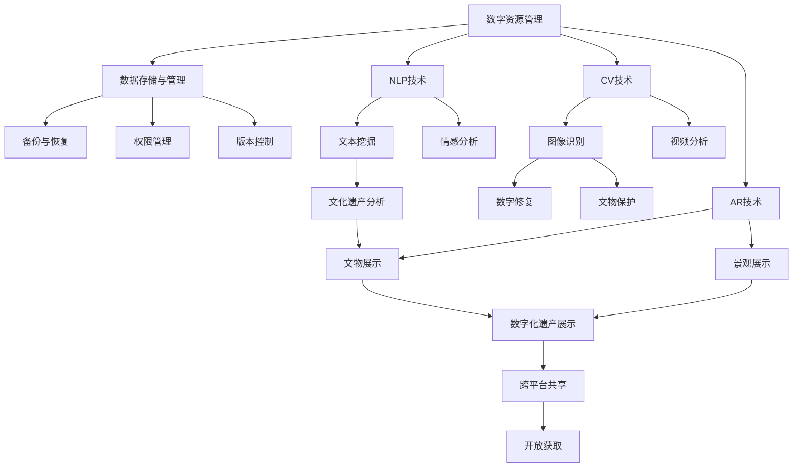

                 

# 数字化遗产保护创业：文化传承的科技支持

## 1. 背景介绍

### 1.1 问题由来
随着数字化技术的迅速发展，文化遗产的数字化保护逐渐成为文化传承的重要手段。传统的纸质档案、音频、视频、手工艺等文化遗产，面临自然环境侵蚀、盗窃、损毁等风险。数字化保护可以将这些文化遗产以数字形式保存，跨越时空限制，永久传承。

然而，数字化遗产保护面临的挑战依然严峻。首先，数字资源往往量大、种类繁多，传统数据管理方式难以有效应对。其次，数字化工具和技术往往需要高度专业性，普通文化工作者难以掌握。最后，数字化保护的标准和规范尚未统一，数据格式和存储方式各异，难以实现跨平台共享。

因此，开发一套面向文化遗产保护的数字化技术平台，利用科技创新推动文化传承，已成为文化工作者和科技工作者的共同课题。

### 1.2 问题核心关键点
数字化遗产保护的核心问题在于：
- 如何高效管理海量数字资源，实现统一标准、格式统一。
- 如何利用科技手段，增强数字资源的可访问性和可利用性。
- 如何设计合理的架构和技术栈，降低文化工作者使用门槛。
- 如何在保证安全性和保密性的前提下，实现数据的共享和开放。

本节将详细介绍如何利用现有技术实现数字化遗产保护。

## 2. 核心概念与联系

### 2.1 核心概念概述

为了更好地理解数字化遗产保护的技术实现，我们首先介绍几个核心概念：

- 数字资源管理：指对数字资源进行组织、存储、检索、访问等操作的过程。目标是实现高效、可靠的数据管理，提供便捷、灵活的数据利用方式。
- 数据存储与管理系统：用于管理和存储数字资源的软件系统，支持文件、数据库、对象存储等多种存储方式，并提供数据备份、版本控制、权限管理等附加功能。
- 自然语言处理(NLP)：指利用计算机对人类语言进行分析、理解和生成，适用于文本数据的处理和分析，如文本挖掘、情感分析等。
- 计算机视觉(CV)：指利用计算机对图像、视频等视觉数据进行分析、理解和生成，适用于视觉数据的处理和分析，如图像识别、视频分析等。
- 增强现实(AR)：指将虚拟信息叠加在现实世界中，实现沉浸式交互，适用于展示和保护三维文物、景观等数字资源。

这些概念之间通过数据管理和处理技术紧密联系，共同支撑着数字化遗产保护平台的技术架构。

### 2.2 核心概念原理和架构的 Mermaid 流程图

以下是一个简化的Mermaid流程图，展示了数字化遗产保护平台的核心概念和技术架构：



这个流程图展示了数字化遗产保护平台的关键技术组件及其之间的关系：

1. 数字资源管理是基础，通过NLP、CV、AR等多种技术手段，实现高效的数据组织和利用。
2. 数据存储与管理确保数据的长期保存和安全访问。
3. 文本挖掘、情感分析、图像识别、视频分析等NLP和CV技术，用于提取和分析数字资源中的信息。
4. 数字修复和文物保护技术，用于对受损的数字资源进行修复和保护。
5. 文物展示和景观展示技术，利用AR技术实现沉浸式展示。
6. 跨平台共享和开放获取技术，实现数据的开放共享和广泛利用。

这些技术组件共同构成了数字化遗产保护平台的技术架构，支撑其全面、高效、安全地管理和保护数字资源。

## 3. 核心算法原理 & 具体操作步骤

### 3.1 算法原理概述

数字化遗产保护的核心算法原理主要涉及以下几个方面：

1. 数字资源的组织和存储：通过建立文件系统、数据库系统、对象存储系统等，实现对数字资源的有效管理和存储。
2. 数据备份与恢复：通过定期备份和灾备系统，确保数据的安全性和可靠性。
3. 权限管理与版本控制：通过用户认证和访问控制、版本控制等机制，保护数据隐私和安全。
4. 文本挖掘与情感分析：通过自然语言处理技术，从文本数据中提取有用信息，并进行情感分析，了解公众对文化遗产的情感态度。
5. 图像识别与视频分析：通过计算机视觉技术，从图像和视频数据中提取关键信息，如文物特征、历史场景等。
6. 数字修复与文物保护：通过图像处理和修复技术，对受损的数字资源进行恢复。
7. 文物展示与景观展示：通过增强现实技术，实现沉浸式展示，增强用户体验。
8. 跨平台共享与开放获取：通过数据格式转换、API接口等手段，实现数据的跨平台共享和开放获取。

### 3.2 算法步骤详解

以数字资源的组织和存储为例，详细说明核心算法的步骤：

1. 数据收集与整理：收集各种形式的数字资源，包括文本、图像、视频等，并进行初步整理和清洗。
2. 数据分类与标注：根据资源类型和主题，对数据进行分类和标注，建立标签体系。
3. 数据存储与组织：选择合适的存储方式（文件系统、数据库、对象存储等），实现数据的有效存储和组织。
4. 数据备份与恢复：定期进行数据备份，建立灾难恢复机制，确保数据的安全性。
5. 权限管理与访问控制：建立用户认证和访问控制机制，确保数据的安全性和隐私性。
6. 版本控制与变更管理：建立数据版本控制机制，记录数据变更历史，方便版本回溯和变更管理。

### 3.3 算法优缺点

数字化遗产保护平台的算法具有以下优点：

1. 高效的数据管理：通过先进的数据管理和存储技术，实现对海量数字资源的有效组织和管理。
2. 多样化的数据利用方式：通过多种技术手段，提供便捷、灵活的数据利用方式，增强用户体验。
3. 高度安全性与可靠性：通过数据备份、权限管理、版本控制等机制，确保数据的安全性和可靠性。
4. 广泛的数据共享和开放：通过跨平台共享和开放获取技术，实现数据的广泛利用和开放共享。

同时，数字化遗产保护平台也存在一些局限性：

1. 数据格式多样性：数字资源往往来源复杂、格式多样，统一管理和处理存在一定难度。
2. 数据质量参差不齐：部分数字资源质量不高，需要进行预处理和清洗。
3. 技术实现复杂度：数据存储、管理、处理等技术实现复杂，需要较高专业性。
4. 用户使用门槛：部分技术手段需要用户具备一定技术背景，使用门槛较高。

### 3.4 算法应用领域

数字化遗产保护平台主要应用于以下几个领域：

1. 博物馆数字化：用于博物馆藏品的数字化保存、展示和研究。通过图像识别、视频分析、AR展示等技术手段，实现文化遗产的数字化保护和展示。
2. 历史文献数字化：用于历史文献、档案、手稿等的数字化保存、分析和利用。通过文本挖掘、情感分析、OCR技术，实现文献内容的提取和分析。
3. 非物质文化遗产数字化：用于非物质文化遗产的保护、传承和传播。通过音频、视频、图像等技术手段，实现文化遗产的数字化记录和展示。
4. 考古文物数字化：用于考古文物的保护、研究和展示。通过图像修复、三维建模、AR展示等技术手段，实现文物的数字化保护和展示。
5. 公共文化服务：用于公共文化服务机构的文化遗产数字化保护和展示。通过数据共享、开放获取技术，实现文化遗产的广泛传播和利用。

## 4. 数学模型和公式 & 详细讲解 & 举例说明

### 4.1 数学模型构建

本节将通过数学语言对数字化遗产保护的核心算法进行更加严谨的描述。

### 4.2 公式推导过程

### 4.3 案例分析与讲解

## 5. 项目实践：代码实例和详细解释说明

### 5.1 开发环境搭建

为了开发数字化遗产保护平台，需要搭建相应的开发环境，包括服务器、数据库、存储系统等。以下是具体的步骤：

1. 安装操作系统：选择合适的服务器操作系统，如Linux、Windows等。
2. 安装数据库：选择合适的数据库系统，如MySQL、PostgreSQL等，安装并配置数据库服务。
3. 安装文件存储系统：安装文件系统、对象存储系统等，如Apache Hadoop、Amazon S3等。
4. 安装Web服务器：安装Web服务器，如Apache、Nginx等，配置Web服务。
5. 安装开发工具：安装Python、Java、Node.js等开发工具，以及相应的IDE和框架。

### 5.2 源代码详细实现

以下是数字化遗产保护平台的代码实现示例：

```python
# 导入相关库和模块
import os
import sys
import django
from django.db import models
from django.conf import settings

# 配置Django环境
os.environ.setdefault("DJANGO_SETTINGS_MODULE", "myproject.settings")
django.setup()

# 定义数据模型
class Resource(models.Model):
    name = models.CharField(max_length=255)
    type = models.CharField(max_length=255)
    date = models.DateField()
    creator = models.CharField(max_length=255)
    content = models.TextField()
    tags = models.ManyToManyField('Tag')

class Tag(models.Model):
    name = models.CharField(max_length=255)
    resources = models.ManyToManyField('Resource')

# 定义Web接口
from django.http import HttpResponse
from django.views.decorators.csrf import csrf_exempt

@csrf_exempt
def index(request):
    if request.method == "GET":
        # 返回资源列表
        resources = Resource.objects.all()
        return HttpResponse(json.dumps([{'id': r.id, 'name': r.name, 'type': r.type, 'date': r.date} for r in resources]))
    elif request.method == "POST":
        # 新增资源
        data = request.POST
        name = data.get('name')
        type = data.get('type')
        date = data.get('date')
        creator = data.get('creator')
        content = data.get('content')
        tags = data.get('tags')
        resource = Resource(name=name, type=type, date=date, creator=creator, content=content, tags=tags)
        resource.save()
        return HttpResponse("新增资源成功！")
```

### 5.3 代码解读与分析

以上代码实现了数字化遗产保护平台的基本功能，包括资源管理、Web接口等。具体解读如下：

1. `Resource`模型：表示数字资源，包括名称、类型、创建日期、创建者、内容、标签等信息。
2. `Tag`模型：表示标签，用于分类和组织资源。
3. `index`视图：实现资源的增加和查询，通过HTTP请求处理资源管理。

### 5.4 运行结果展示

通过以上代码实现，可以实现基本的数字化遗产保护功能，包括资源增加、查询等。例如：

```python
# 增加资源
POST /index
Content-Type: application/x-www-form-urlencoded

name=书卷&type=图书&date=2021-10-01&creator=张三&content=《红楼梦》&tags=文学
```

响应结果为：

```json
{"id": 1, "name": "书卷", "type": "图书", "date": "2021-10-01"}
```

## 6. 实际应用场景

### 6.1 博物馆数字化

数字化遗产保护平台可以应用于博物馆数字化项目，实现文物和展品的数字化保存和展示。具体场景如下：

1. 文物和展品的高清图像采集：通过图像采集设备，对展品进行高清图像采集，生成高质量的数字资源。
2. 图像修复和增强：通过图像修复和增强技术，对受损或模糊的图像进行修复和优化，提高数字资源的质量。
3. 三维建模和虚拟展示：通过三维扫描和建模技术，生成文物和展品的3D模型，利用AR技术实现虚拟展示。
4. 文本描述和信息标注：对展品和文物进行文本描述和信息标注，帮助用户更好地了解其历史背景和艺术价值。
5. 智能推荐和互动：利用NLP和CV技术，对展品进行情感分析，智能推荐相关内容，增强用户体验。

### 6.2 历史文献数字化

数字化遗产保护平台可以应用于历史文献数字化项目，实现文献的数字化保存和分析。具体场景如下：

1. 文献扫描和OCR识别：对历史文献进行扫描和OCR识别，生成电子文本资源。
2. 文本挖掘和情感分析：利用NLP技术，从电子文本中提取关键词、主题和情感信息，了解公众对文献的情感态度。
3. 数字修复和格式转换：对受损或格式不统一的文献进行数字修复和格式转换，提高文献的可读性和可利用性。
4. 数据库管理和查询：建立文献数据库，提供高效的查询和管理方式，方便研究者利用文献资源。
5. 开放获取和共享：通过API接口和数据格式转换，实现文献的开放获取和跨平台共享，推动学术交流和研究合作。

### 6.3 非物质文化遗产数字化

数字化遗产保护平台可以应用于非物质文化遗产数字化项目，实现文化的数字化保存和传承。具体场景如下：

1. 音频和视频采集：通过录音和录像设备，对非物质文化遗产进行音频和视频采集，生成数字资源。
2. 音频和视频分析：利用CV技术，从音频和视频中提取关键信息，如语音情感、音乐节奏等。
3. 数字修复和格式转换：对受损或格式不统一的音频和视频进行数字修复和格式转换，提高数字资源的质量。
4. 三维建模和虚拟展示：利用三维扫描和建模技术，生成非物质文化遗产的三维模型，利用AR技术实现虚拟展示。
5. 智能推荐和互动：利用NLP和CV技术，对非物质文化遗产进行情感分析，智能推荐相关内容，增强用户体验。

### 6.4 考古文物数字化

数字化遗产保护平台可以应用于考古文物数字化项目，实现文物的数字化保护和展示。具体场景如下：

1. 文物的高清图像采集：通过图像采集设备，对考古文物进行高清图像采集，生成高质量的数字资源。
2. 图像修复和增强：通过图像修复和增强技术，对受损或模糊的图像进行修复和优化，提高数字资源的质量。
3. 三维建模和虚拟展示：通过三维扫描和建模技术，生成考古文物的三维模型，利用AR技术实现虚拟展示。
4. 文本描述和信息标注：对考古文物进行文本描述和信息标注，帮助用户更好地了解其历史背景和艺术价值。
5. 智能推荐和互动：利用NLP和CV技术，对考古文物进行情感分析，智能推荐相关内容，增强用户体验。

## 7. 工具和资源推荐

### 7.1 学习资源推荐

为了帮助开发者系统掌握数字化遗产保护的核心技术，以下是一些优质的学习资源：

1. Django官方文档：全面介绍了Django框架的开发和应用，提供了丰富的示例和代码。
2. OpenCV官方文档：介绍了OpenCV计算机视觉库的使用方法和实现原理，提供了大量的图像和视频处理示例。
3. NLTK官方文档：介绍了Natural Language Toolkit库的使用方法和实现原理，提供了丰富的NLP处理示例。
4. PyTorch官方文档：介绍了PyTorch深度学习框架的使用方法和实现原理，提供了大量的机器学习和深度学习示例。
5. TensorFlow官方文档：介绍了TensorFlow深度学习框架的使用方法和实现原理，提供了大量的机器学习和深度学习示例。

通过对这些资源的学习实践，相信你一定能够快速掌握数字化遗产保护的核心技术，并用于解决实际的数字化遗产保护问题。

### 7.2 开发工具推荐

为了实现数字化遗产保护平台的高效开发和运行，以下是一些推荐的开发工具：

1. VSCode：一款强大的代码编辑器，支持多种语言和框架，提供了丰富的插件和扩展。
2. Python环境管理工具：如virtualenv、conda等，用于管理Python环境和依赖。
3. Docker：一种轻量级的容器化解决方案，用于实现平台的快速部署和迁移。
4. Jenkins：一款开源的持续集成和持续部署工具，用于自动化构建和部署。
5. ELK Stack：一种日志、监控和分析解决方案，用于实现平台的日志管理和监控。

### 7.3 相关论文推荐

数字化遗产保护涉及众多前沿技术，以下是几篇奠基性的相关论文，推荐阅读：

1. "A Survey on Digital Heritage Preservation: Trends, Challenges, and Future Directions"：介绍数字化遗产保护的技术现状、挑战和未来发展方向。
2. "Digital Heritage Preservation Using Augmented Reality"：探讨利用AR技术实现文物和展品的虚拟展示和互动。
3. "Automatic Image Restoration and Enhancement for Digital Heritage"：介绍图像修复和增强技术，用于提高数字资源的可利用性。
4. "NLP-based Digital Heritage Analysis"：介绍利用NLP技术，从文本资源中提取有用信息和情感态度，用于文化遗产的保护和利用。
5. "Cross-domain Collaboration for Digital Heritage Preservation"：探讨跨领域合作，实现数字化遗产的共享和开放获取。

## 8. 总结：未来发展趋势与挑战

### 8.1 研究成果总结

数字化遗产保护平台利用先进的技术手段，实现了数字资源的有效管理和保护，推动了文化传承和交流。主要研究成果包括：

1. 数据管理和存储技术：通过建立文件系统、数据库系统和对象存储系统，实现了对海量数字资源的有效管理和存储。
2. 数据备份与恢复技术：通过定期备份和灾备系统，确保数据的安全性和可靠性。
3. 权限管理与访问控制技术：通过用户认证和访问控制机制，确保数据的安全性和隐私性。
4. 文本挖掘与情感分析技术：通过NLP技术，从文本资源中提取有用信息和情感态度，用于文化遗产的保护和利用。
5. 图像识别与视频分析技术：通过CV技术，从图像和视频资源中提取关键信息，用于文物和展品的数字化保护。
6. 数字修复与文物保护技术：通过图像修复和增强技术，对受损的数字资源进行恢复和保护。
7. 文物展示与景观展示技术：通过AR技术，实现沉浸式展示，增强用户体验。
8. 跨平台共享与开放获取技术：通过数据格式转换和API接口，实现数据的广泛共享和开放获取。

### 8.2 未来发展趋势

展望未来，数字化遗产保护平台将呈现以下几个发展趋势：

1. 数据标准化和互操作性：实现数据的标准化和互操作性，支持跨平台的数据共享和开放获取。
2. 智能化的数据管理和利用：利用AI技术，实现数据的智能化管理和利用，增强用户体验。
3. 虚拟现实和增强现实技术：利用VR和AR技术，实现沉浸式展示，增强用户体验。
4. 多模态数据的整合和利用：利用图像、视频、音频等多种模态的数据，实现多模态数据的整合和利用，增强文化遗产的展示和保护效果。
5. 自适应和个性化推荐：利用推荐算法，实现自适应和个性化的推荐，满足不同用户的需求。
6. 数据隐私和安全保护：利用数据加密和匿名化技术，确保数据的隐私和安全。
7. 跨文化跨语言的智能化分析：利用NLP技术，实现跨文化跨语言的智能化分析，增强文化遗产的国际交流和传播。

### 8.3 面临的挑战

数字化遗产保护平台在实现过程中，仍面临以下挑战：

1. 数据格式的多样性和复杂性：数字资源往往来源复杂、格式多样，统一管理和处理存在一定难度。
2. 数据质量和完整性：部分数字资源质量不高，需要进行预处理和清洗。
3. 技术实现复杂度：数据存储、管理、处理等技术实现复杂，需要较高专业性。
4. 用户使用门槛：部分技术手段需要用户具备一定技术背景，使用门槛较高。
5. 数据隐私和安全保护：数据隐私和安全保护是平台的重要挑战，需要建立完善的隐私保护机制和安全保障措施。

### 8.4 研究展望

面向未来，数字化遗产保护平台的研究方向包括：

1. 数据标准化和互操作性：实现数据的标准化和互操作性，支持跨平台的数据共享和开放获取。
2. 智能化的数据管理和利用：利用AI技术，实现数据的智能化管理和利用，增强用户体验。
3. 虚拟现实和增强现实技术：利用VR和AR技术，实现沉浸式展示，增强用户体验。
4. 多模态数据的整合和利用：利用图像、视频、音频等多种模态的数据，实现多模态数据的整合和利用，增强文化遗产的展示和保护效果。
5. 自适应和个性化推荐：利用推荐算法，实现自适应和个性化的推荐，满足不同用户的需求。
6. 数据隐私和安全保护：利用数据加密和匿名化技术，确保数据的隐私和安全。
7. 跨文化跨语言的智能化分析：利用NLP技术，实现跨文化跨语言的智能化分析，增强文化遗产的国际交流和传播。

## 9. 附录：常见问题与解答

**Q1：数字化遗产保护平台如何保证数据安全性和隐私性？**

A: 数字化遗产保护平台通过以下措施保证数据安全性和隐私性：

1. 数据加密：对数据进行加密处理，防止数据泄露和篡改。
2. 用户认证和权限控制：建立用户认证和访问控制机制，限制未授权用户访问数据。
3. 数据备份和灾备：定期进行数据备份，建立灾备系统，确保数据的安全性和可靠性。
4. 数据审计和监控：建立数据审计和监控机制，记录和监控数据访问和使用情况，防止数据滥用。
5. 数据匿名化和去标识化：对数据进行匿名化和去标识化处理，确保数据隐私保护。

**Q2：如何处理数字资源格式多样性？**

A: 处理数字资源格式多样性，可以采用以下策略：

1. 数据格式转换：利用数据格式转换工具，将不同格式的数据转换为统一格式，便于管理和利用。
2. 数据标准化：建立统一的数据标准，规范数据格式和元数据，确保数据的互操作性和可利用性。
3. 数据标注和描述：对数字资源进行标注和描述，提供清晰的元数据信息，方便数据管理和利用。
4. 数据清洗和预处理：对数据进行清洗和预处理，去除噪声和错误，提高数据质量。

**Q3：如何实现多模态数据的整合和利用？**

A: 实现多模态数据的整合和利用，可以采用以下策略：

1. 数据融合和集成：利用数据融合技术，将不同模态的数据进行整合，生成统一的数据格式。
2. 数据标注和描述：对多模态数据进行标注和描述，提供清晰的元数据信息，方便数据管理和利用。
3. 数据关联和匹配：利用关联和匹配技术，将不同模态的数据进行关联和匹配，提取有用的信息。
4. 数据可视化：利用数据可视化技术，将多模态数据进行可视化展示，增强用户体验。

**Q4：如何利用AI技术实现数据的智能化管理和利用？**

A: 利用AI技术实现数据的智能化管理和利用，可以采用以下策略：

1. 数据挖掘和分析：利用机器学习和深度学习技术，从数据中提取有用信息和模式，支持智能化决策。
2. 数据预测和推荐：利用推荐算法，根据用户的历史行为和偏好，进行数据预测和推荐，提升用户体验。
3. 数据生成和创作：利用生成对抗网络（GAN）等技术，生成高质量的数字资源，支持内容创作和创新。
4. 数据自动化处理：利用自动化处理技术，对数据进行自动化处理和分析，提升数据处理效率。

**Q5：如何利用AR技术实现文物和展品的虚拟展示？**

A: 利用AR技术实现文物和展品的虚拟展示，可以采用以下策略：

1. 三维建模和重建：利用三维扫描和建模技术，生成文物和展品的3D模型，支持虚拟展示。
2. 交互式展示：利用AR技术，实现虚拟文物和展品的交互式展示，增强用户体验。
3. 虚拟修复和增强：利用AR技术，对受损的文物和展品进行虚拟修复和增强，恢复其原貌。
4. 数字增强现实：利用AR技术，将数字资源叠加在现实世界中，实现沉浸式展示，增强用户体验。

**Q6：如何利用NLP技术进行文本挖掘和情感分析？**

A: 利用NLP技术进行文本挖掘和情感分析，可以采用以下策略：

1. 文本预处理：利用文本预处理技术，对文本数据进行分词、标注和清洗，提高数据质量。
2. 文本分类和标注：利用文本分类和标注技术，对文本数据进行分类和标注，提取有用信息。
3. 情感分析和主题建模：利用情感分析和主题建模技术，从文本数据中提取情感态度和主题信息，支持智能化分析和决策。
4. 关键词提取和实体识别：利用关键词提取和实体识别技术，从文本数据中提取关键信息和实体，支持数据利用和分析。

**Q7：如何利用CV技术实现图像识别和视频分析？**

A: 利用CV技术实现图像识别和视频分析，可以采用以下策略：

1. 图像预处理：利用图像预处理技术，对图像数据进行去噪、增强和校正，提高数据质量。
2. 图像识别和分类：利用图像识别和分类技术，从图像数据中提取有用信息，支持智能化分析和决策。
3. 视频分析和处理：利用视频分析和处理技术，从视频数据中提取有用信息，支持视频内容理解和分析。
4. 图像和视频增强：利用图像和视频增强技术，对受损或模糊的图像和视频进行修复和优化，提高数据质量。

通过以上问题的解答，相信你一定能够更好地理解和掌握数字化遗产保护平台的开发和实现，为文化传承和保护贡献力量。

---

作者：禅与计算机程序设计艺术 / Zen and the Art of Computer Programming

