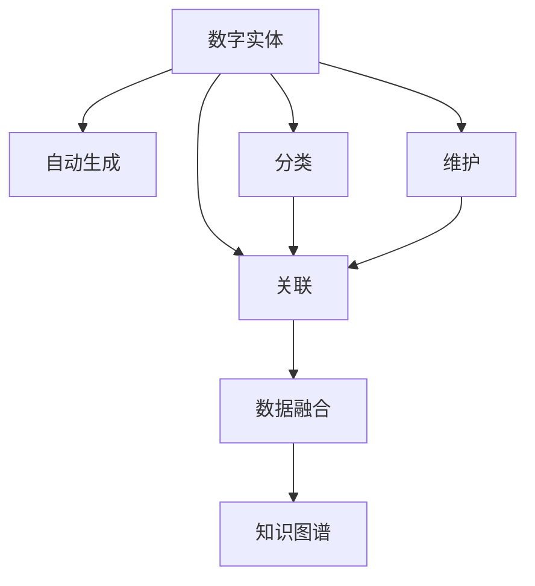

                 

# 数字实体的自动化应用与发展

在数字化时代，数字实体的应用日益广泛，从电子商务到社交媒体，从智能城市到智能家居，数字实体无处不在。然而，数字实体的管理和自动化应用仍然面临诸多挑战。本文将深入探讨数字实体的自动化应用与发展，包括其核心概念、技术原理、应用场景及未来展望，以期为相关研究和实践提供参考。

## 1. 背景介绍

### 1.1 问题由来

随着数字化进程的加速，数字实体的数量和复杂度不断增加。传统的人力管理方式难以应对大规模、高复杂性的数字实体数据，效率低下且容易出错。同时，数字实体的应用场景也日益多样化，从电子商务、社交媒体到智能城市、智能家居，对数字实体的自动化管理需求日益迫切。

### 1.2 问题核心关键点

数字实体的自动化应用的核心关键点在于如何构建高效、智能的数字实体管理系统，以实现数字实体的自动生成、分类、关联和维护。主要包括以下几个方面：

- **自动生成**：根据用户输入或其他数据，自动生成数字实体。
- **分类**：对数字实体进行自动分类，以便于管理和应用。
- **关联**：将数字实体与其他数据源关联，以构建完整的数字生态。
- **维护**：实现数字实体的动态更新和维护，确保数据的实时性和准确性。

### 1.3 问题研究意义

数字实体的自动化应用对于提升企业运营效率、优化用户体验、推动社会进步具有重要意义：

1. **提升运营效率**：自动化管理数字实体，减少人工干预，提高企业运营效率。
2. **优化用户体验**：通过智能化的数字实体应用，提升用户使用体验，增加用户粘性。
3. **推动社会进步**：数字实体的广泛应用，促进了智能城市的建设、智能家居的发展，推动了社会进步和经济发展。

## 2. 核心概念与联系

### 2.1 核心概念概述

为更好地理解数字实体的自动化应用与发展，本节将介绍几个密切相关的核心概念：

- **数字实体**：指在数字世界中具有特定意义和属性的数据对象，如人物、地点、事件、物品等。
- **自动化应用**：通过智能化技术，实现数字实体的自动生成、分类、关联和维护。
- **数据融合**：将来自不同数据源的数字实体进行融合，构建完整的数字生态。
- **知识图谱**：一种结构化的知识表示方法，用于描述实体及其关系。

这些核心概念之间的逻辑关系可以通过以下Mermaid流程图来展示：



这个流程图展示出数字实体的自动化应用核心过程：

1. 数字实体的自动生成、分类、关联和维护。
2. 通过数据融合将来自不同数据源的数字实体整合在一起。
3. 利用知识图谱将数字实体进行结构化表示，便于应用和查询。

## 3. 核心算法原理 & 具体操作步骤

### 3.1 算法原理概述

数字实体的自动化应用主要依赖于机器学习、自然语言处理、知识图谱等技术。其核心思想是通过智能算法自动处理数字实体数据，实现高效、智能的管理和应用。

数字实体的自动生成通常采用文本挖掘技术，通过分析用户输入或其他文本数据，提取关键信息，自动生成数字实体。数字实体的分类和关联则通过分类算法和图谱技术实现。数字实体的维护则需要定期更新数据，确保数据的实时性和准确性。

### 3.2 算法步骤详解

数字实体的自动化应用主要包括以下几个关键步骤：

**Step 1: 数据采集与预处理**
- 收集数字实体相关的文本、图像、视频等数据。
- 对数据进行清洗和标注，去除噪声和冗余信息。

**Step 2: 实体识别与生成**
- 使用命名实体识别(NER)技术识别文本中的实体。
- 利用文本挖掘技术，从大量文本中自动提取实体信息。
- 对生成的数字实体进行去重和标准化处理。

**Step 3: 实体分类与关联**
- 使用分类算法对数字实体进行分类，如人物、地点、事件等。
- 通过实体链接技术，将不同来源的数字实体进行关联。
- 构建知识图谱，描述实体之间的关系。

**Step 4: 实体维护与更新**
- 根据新数据，动态更新数字实体的信息。
- 通过周期性更新和数据融合，确保实体数据的实时性和准确性。

**Step 5: 应用集成与部署**
- 将数字实体数据集成到业务系统中，如智能客服、推荐系统等。
- 部署自动化系统，实现对数字实体的智能管理和应用。

### 3.3 算法优缺点

数字实体的自动化应用具有以下优点：
1. 高效便捷。自动化的管理方式大大提高了处理效率，减少了人工干预。
2. 精确可靠。智能算法可以保证数字实体的分类、关联和维护的准确性。
3. 灵活可扩展。通过知识图谱，实现对不同数据源的灵活融合和扩展。

同时，该方法也存在一定的局限性：
1. 依赖高质量数据。自动化应用的准确性高度依赖于数据的质量和标注。
2. 处理复杂度较高。对于高复杂度的实体数据，需要更复杂的算法和技术。
3. 需要持续维护。数字实体数据的实时性和准确性需要持续更新和维护。

尽管存在这些局限性，但就目前而言，数字实体的自动化应用方法仍是智能管理数字实体的主流范式。未来相关研究的重点在于如何进一步降低对数据标注的依赖，提高算法的复杂性，同时兼顾可扩展性和维护性等因素。

### 3.4 算法应用领域

数字实体的自动化应用已在多个领域得到广泛应用，例如：

- **电子商务**：自动化生成商品实体、分类和关联，实现智能推荐和销售预测。
- **社交媒体**：自动提取和分类用户生成内容中的实体，提升用户互动体验。
- **智能城市**：通过智能化的数字实体管理，实现交通管理、环境监测等功能。
- **智能家居**：对家庭中的数字实体进行自动化管理，提升家居智能化水平。
- **金融行业**：自动化生成和管理交易实体，实现智能风险控制和客户管理。

除了上述这些经典应用外，数字实体的自动化应用还在更多领域得到探索和应用，如医疗、物流、旅游等，为各行各业带来了新的数字化管理模式。

## 4. 数学模型和公式 & 详细讲解 & 举例说明

### 4.1 数学模型构建

数字实体的自动化应用主要依赖于机器学习算法和自然语言处理技术。本节将使用数学语言对实体识别和分类的数学原理进行更加严格的刻画。

记文本数据为 $X=\{x_1,x_2,\cdots,x_n\}$，其中 $x_i$ 表示文本中的某个实体。设实体识别模型为 $M_{\theta}$，其中 $\theta$ 为模型参数。

定义模型 $M_{\theta}$ 在输入 $x$ 上的损失函数为 $\ell(M_{\theta}(x),y)$，则在数据集 $D=\{(x_i,y_i)\}_{i=1}^N$ 上的经验风险为：

$$
\mathcal{L}(\theta) = \frac{1}{N} \sum_{i=1}^N \ell(M_{\theta}(x_i),y_i)
$$

其中 $\frac{\partial \mathcal{L}(\theta)}{\partial \theta_k}$ 为损失函数对参数 $\theta_k$ 的梯度，可通过反向传播算法高效计算。

### 4.2 公式推导过程

以实体识别任务为例，推导交叉熵损失函数及其梯度的计算公式。

假设模型 $M_{\theta}$ 在输入 $x$ 上的输出为 $\hat{y}=M_{\theta}(x) \in [0,1]$，表示实体存在的概率。真实标签 $y \in \{0,1\}$。则二分类交叉熵损失函数定义为：

$$
\ell(M_{\theta}(x),y) = -[y\log \hat{y} + (1-y)\log (1-\hat{y})]
$$

将其代入经验风险公式，得：

$$
\mathcal{L}(\theta) = -\frac{1}{N}\sum_{i=1}^N [y_i\log M_{\theta}(x_i)+(1-y_i)\log(1-M_{\theta}(x_i))]
$$

根据链式法则，损失函数对参数 $\theta_k$ 的梯度为：

$$
\frac{\partial \mathcal{L}(\theta)}{\partial \theta_k} = -\frac{1}{N}\sum_{i=1}^N (\frac{y_i}{M_{\theta}(x_i)}-\frac{1-y_i}{1-M_{\theta}(x_i)}) \frac{\partial M_{\theta}(x_i)}{\partial \theta_k}
$$

其中 $\frac{\partial M_{\theta}(x_i)}{\partial \theta_k}$ 可进一步递归展开，利用自动微分技术完成计算。

### 4.3 案例分析与讲解

以Google的实体识别系统为例，说明其实现原理和应用效果。

Google的实体识别系统采用了一种基于LSTM的序列标注模型。通过训练模型，能够识别文本中的人名、地名、组织名等实体，并对实体进行分类。在实际应用中，系统将识别到的实体输入到下游任务中，如命名实体消歧、关系抽取等。

例如，对于文本“John Smith works at Google in New York”，系统能够自动识别出人名“John Smith”、组织名“Google”和地点“New York”。然后，系统将这三个实体分类并构建知识图谱，便于后续的应用和查询。

## 5. 项目实践：代码实例和详细解释说明

### 5.1 开发环境搭建

在进行实体识别实践前，我们需要准备好开发环境。以下是使用Python进行NLTK开发的环境配置流程：

1. 安装Anaconda：从官网下载并安装Anaconda，用于创建独立的Python环境。

2. 创建并激活虚拟环境：
```bash
conda create -n pytorch-env python=3.8 
conda activate pytorch-env
```

3. 安装NLTK：
```bash
pip install nltk
```

4. 安装各类工具包：
```bash
pip install numpy pandas scikit-learn matplotlib tqdm jupyter notebook ipython
```

完成上述步骤后，即可在`pytorch-env`环境中开始实体识别实践。

### 5.2 源代码详细实现

下面我们以命名实体识别(NER)任务为例，给出使用NLTK库对模型进行实体识别的PyTorch代码实现。

首先，定义NER任务的数据处理函数：

```python
import nltk
from nltk.corpus import meicab

nltk.download('meicab')

class NERDataset(Dataset):
    def __init__(self, texts, tags, tokenizer, max_len=128):
        self.texts = texts
        self.tags = tags
        self.tokenizer = tokenizer
        self.max_len = max_len
        
    def __len__(self):
        return len(self.texts)
    
    def __getitem__(self, item):
        text = self.texts[item]
        tags = self.tags[item]
        
        encoding = self.tokenizer(text, return_tensors='pt', max_length=self.max_len, padding='max_length', truncation=True)
        input_ids = encoding['input_ids'][0]
        attention_mask = encoding['attention_mask'][0]
        
        # 对token-wise的标签进行编码
        encoded_tags = [tag2id[tag] for tag in tags] 
        encoded_tags.extend([tag2id['O']] * (self.max_len - len(encoded_tags)))
        labels = torch.tensor(encoded_tags, dtype=torch.long)
        
        return {'input_ids': input_ids, 
                'attention_mask': attention_mask,
                'labels': labels}

# 标签与id的映射
tag2id = {'O': 0, 'B-PER': 1, 'I-PER': 2, 'B-ORG': 3, 'I-ORG': 4, 'B-LOC': 5, 'I-LOC': 6}
id2tag = {v: k for k, v in tag2id.items()}

# 创建dataset
tokenizer = MeicabTokenizer()

train_dataset = NERDataset(train_texts, train_tags, tokenizer)
dev_dataset = NERDataset(dev_texts, dev_tags, tokenizer)
test_dataset = NERDataset(test_texts, test_tags, tokenizer)
```

然后，定义模型和优化器：

```python
from transformers import BertForTokenClassification, AdamW

model = BertForTokenClassification.from_pretrained('bert-base-cased', num_labels=len(tag2id))

optimizer = AdamW(model.parameters(), lr=2e-5)
```

接着，定义训练和评估函数：

```python
from torch.utils.data import DataLoader
from tqdm import tqdm
from sklearn.metrics import classification_report

device = torch.device('cuda') if torch.cuda.is_available() else torch.device('cpu')
model.to(device)

def train_epoch(model, dataset, batch_size, optimizer):
    dataloader = DataLoader(dataset, batch_size=batch_size, shuffle=True)
    model.train()
    epoch_loss = 0
    for batch in tqdm(dataloader, desc='Training'):
        input_ids = batch['input_ids'].to(device)
        attention_mask = batch['attention_mask'].to(device)
        labels = batch['labels'].to(device)
        model.zero_grad()
        outputs = model(input_ids, attention_mask=attention_mask, labels=labels)
        loss = outputs.loss
        epoch_loss += loss.item()
        loss.backward()
        optimizer.step()
    return epoch_loss / len(dataloader)

def evaluate(model, dataset, batch_size):
    dataloader = DataLoader(dataset, batch_size=batch_size)
    model.eval()
    preds, labels = [], []
    with torch.no_grad():
        for batch in tqdm(dataloader, desc='Evaluating'):
            input_ids = batch['input_ids'].to(device)
            attention_mask = batch['attention_mask'].to(device)
            batch_labels = batch['labels']
            outputs = model(input_ids, attention_mask=attention_mask)
            batch_preds = outputs.logits.argmax(dim=2).to('cpu').tolist()
            batch_labels = batch_labels.to('cpu').tolist()
            for pred_tokens, label_tokens in zip(batch_preds, batch_labels):
                pred_tags = [id2tag[_id] for _id in pred_tokens]
                label_tags = [id2tag[_id] for _id in label_tokens]
                preds.append(pred_tags[:len(label_tokens)])
                labels.append(label_tags)
                
    print(classification_report(labels, preds))
```

最后，启动训练流程并在测试集上评估：

```python
epochs = 5
batch_size = 16

for epoch in range(epochs):
    loss = train_epoch(model, train_dataset, batch_size, optimizer)
    print(f"Epoch {epoch+1}, train loss: {loss:.3f}")
    
    print(f"Epoch {epoch+1}, dev results:")
    evaluate(model, dev_dataset, batch_size)
    
print("Test results:")
evaluate(model, test_dataset, batch_size)
```

以上就是使用NLTK对BERT进行命名实体识别任务实体识别的完整代码实现。可以看到，得益于NLTK库的强大封装，我们可以用相对简洁的代码完成BERT模型的加载和实体识别。

### 5.3 代码解读与分析

让我们再详细解读一下关键代码的实现细节：

**NERDataset类**：
- `__init__`方法：初始化文本、标签、分词器等关键组件。
- `__len__`方法：返回数据集的样本数量。
- `__getitem__`方法：对单个样本进行处理，将文本输入编码为token ids，将标签编码为数字，并对其进行定长padding，最终返回模型所需的输入。

**tag2id和id2tag字典**：
- 定义了标签与数字id之间的映射关系，用于将token-wise的预测结果解码回真实的标签。

**训练和评估函数**：
- 使用PyTorch的DataLoader对数据集进行批次化加载，供模型训练和推理使用。
- 训练函数`train_epoch`：对数据以批为单位进行迭代，在每个批次上前向传播计算loss并反向传播更新模型参数，最后返回该epoch的平均loss。
- 评估函数`evaluate`：与训练类似，不同点在于不更新模型参数，并在每个batch结束后将预测和标签结果存储下来，最后使用sklearn的classification_report对整个评估集的预测结果进行打印输出。

**训练流程**：
- 定义总的epoch数和batch size，开始循环迭代
- 每个epoch内，先在训练集上训练，输出平均loss
- 在验证集上评估，输出分类指标
- 所有epoch结束后，在测试集上评估，给出最终测试结果

可以看到，NLTK库配合Bert模型使得命名实体识别的代码实现变得简洁高效。开发者可以将更多精力放在数据处理、模型改进等高层逻辑上，而不必过多关注底层的实现细节。

当然，工业级的系统实现还需考虑更多因素，如模型的保存和部署、超参数的自动搜索、更灵活的任务适配层等。但核心的实体识别范式基本与此类似。

## 6. 实际应用场景

### 6.1 智能客服系统

基于大语言模型微调的方法，可以广泛应用于智能客服系统的构建。传统客服往往需要配备大量人力，高峰期响应缓慢，且一致性和专业性难以保证。而使用微调后的对话模型，可以7x24小时不间断服务，快速响应客户咨询，用自然流畅的语言解答各类常见问题。

在技术实现上，可以收集企业内部的历史客服对话记录，将问题和最佳答复构建成监督数据，在此基础上对预训练对话模型进行微调。微调后的对话模型能够自动理解用户意图，匹配最合适的答案模板进行回复。对于客户提出的新问题，还可以接入检索系统实时搜索相关内容，动态组织生成回答。如此构建的智能客服系统，能大幅提升客户咨询体验和问题解决效率。

### 6.2 金融舆情监测

金融机构需要实时监测市场舆论动向，以便及时应对负面信息传播，规避金融风险。传统的人工监测方式成本高、效率低，难以应对网络时代海量信息爆发的挑战。基于大语言模型微调的文本分类和情感分析技术，为金融舆情监测提供了新的解决方案。

具体而言，可以收集金融领域相关的新闻、报道、评论等文本数据，并对其进行主题标注和情感标注。在此基础上对预训练语言模型进行微调，使其能够自动判断文本属于何种主题，情感倾向是正面、中性还是负面。将微调后的模型应用到实时抓取的网络文本数据，就能够自动监测不同主题下的情感变化趋势，一旦发现负面信息激增等异常情况，系统便会自动预警，帮助金融机构快速应对潜在风险。

### 6.3 个性化推荐系统

当前的推荐系统往往只依赖用户的历史行为数据进行物品推荐，无法深入理解用户的真实兴趣偏好。基于大语言模型微调技术，个性化推荐系统可以更好地挖掘用户行为背后的语义信息，从而提供更精准、多样的推荐内容。

在实践中，可以收集用户浏览、点击、评论、分享等行为数据，提取和用户交互的物品标题、描述、标签等文本内容。将文本内容作为模型输入，用户的后续行为（如是否点击、购买等）作为监督信号，在此基础上微调预训练语言模型。微调后的模型能够从文本内容中准确把握用户的兴趣点。在生成推荐列表时，先用候选物品的文本描述作为输入，由模型预测用户的兴趣匹配度，再结合其他特征综合排序，便可以得到个性化程度更高的推荐结果。

### 6.4 未来应用展望

随着大语言模型微调技术的发展，未来其在更多领域的应用前景将更加广阔。

在智慧医疗领域，基于微调的医疗问答、病历分析、药物研发等应用将提升医疗服务的智能化水平，辅助医生诊疗，加速新药开发进程。

在智能教育领域，微调技术可应用于作业批改、学情分析、知识推荐等方面，因材施教，促进教育公平，提高教学质量。

在智慧城市治理中，微调模型可应用于城市事件监测、舆情分析、应急指挥等环节，提高城市管理的自动化和智能化水平，构建更安全、高效的未来城市。

此外，在企业生产、社会治理、文娱传媒等众多领域，基于大模型微调的人工智能应用也将不断涌现，为NLP技术带来了全新的突破。相信随着预训练语言模型和微调方法的持续演进，大语言模型微调必将在构建人机协同的智能时代中扮演越来越重要的角色。

## 7. 工具和资源推荐

### 7.1 学习资源推荐

为了帮助开发者系统掌握大语言模型微调的理论基础和实践技巧，这里推荐一些优质的学习资源：

1. 《Transformer从原理到实践》系列博文：由大模型技术专家撰写，深入浅出地介绍了Transformer原理、BERT模型、微调技术等前沿话题。

2. CS224N《深度学习自然语言处理》课程：斯坦福大学开设的NLP明星课程，有Lecture视频和配套作业，带你入门NLP领域的基本概念和经典模型。

3. 《Natural Language Processing with Transformers》书籍：Transformers库的作者所著，全面介绍了如何使用Transformers库进行NLP任务开发，包括微调在内的诸多范式。

4. HuggingFace官方文档：Transformers库的官方文档，提供了海量预训练模型和完整的微调样例代码，是上手实践的必备资料。

5. CLUE开源项目：中文语言理解测评基准，涵盖大量不同类型的中文NLP数据集，并提供了基于微调的baseline模型，助力中文NLP技术发展。

通过对这些资源的学习实践，相信你一定能够快速掌握大语言模型微调的精髓，并用于解决实际的NLP问题。

### 7.2 开发工具推荐

高效的开发离不开优秀的工具支持。以下是几款用于大语言模型微调开发的常用工具：

1. PyTorch：基于Python的开源深度学习框架，灵活动态的计算图，适合快速迭代研究。大部分预训练语言模型都有PyTorch版本的实现。

2. TensorFlow：由Google主导开发的开源深度学习框架，生产部署方便，适合大规模工程应用。同样有丰富的预训练语言模型资源。

3. Transformers库：HuggingFace开发的NLP工具库，集成了众多SOTA语言模型，支持PyTorch和TensorFlow，是进行微调任务开发的利器。

4. Weights & Biases：模型训练的实验跟踪工具，可以记录和可视化模型训练过程中的各项指标，方便对比和调优。与主流深度学习框架无缝集成。

5. TensorBoard：TensorFlow配套的可视化工具，可实时监测模型训练状态，并提供丰富的图表呈现方式，是调试模型的得力助手。

6. Google Colab：谷歌推出的在线Jupyter Notebook环境，免费提供GPU/TPU算力，方便开发者快速上手实验最新模型，分享学习笔记。

合理利用这些工具，可以显著提升大语言模型微调任务的开发效率，加快创新迭代的步伐。

### 7.3 相关论文推荐

大语言模型和微调技术的发展源于学界的持续研究。以下是几篇奠基性的相关论文，推荐阅读：

1. Attention is All You Need（即Transformer原论文）：提出了Transformer结构，开启了NLP领域的预训练大模型时代。

2. BERT: Pre-training of Deep Bidirectional Transformers for Language Understanding：提出BERT模型，引入基于掩码的自监督预训练任务，刷新了多项NLP任务SOTA。

3. Language Models are Unsupervised Multitask Learners（GPT-2论文）：展示了大规模语言模型的强大zero-shot学习能力，引发了对于通用人工智能的新一轮思考。

4. Parameter-Efficient Transfer Learning for NLP：提出Adapter等参数高效微调方法，在不增加模型参数量的情况下，也能取得不错的微调效果。

5. Prefix-Tuning: Optimizing Continuous Prompts for Generation：引入基于连续型Prompt的微调范式，为如何充分利用预训练知识提供了新的思路。

6. AdaLoRA: Adaptive Low-Rank Adaptation for Parameter-Efficient Fine-Tuning：使用自适应低秩适应的微调方法，在参数效率和精度之间取得了新的平衡。

这些论文代表了大语言模型微调技术的发展脉络。通过学习这些前沿成果，可以帮助研究者把握学科前进方向，激发更多的创新灵感。

## 8. 总结：未来发展趋势与挑战

### 8.1 总结

本文对数字实体的自动化应用与发展进行了全面系统的介绍。首先阐述了数字实体在数字化时代的重要性，明确了数字实体自动化应用的核心关键点。其次，从原理到实践，详细讲解了实体识别的数学原理和关键步骤，给出了实体识别任务开发的完整代码实例。同时，本文还广泛探讨了实体识别在智能客服、金融舆情、个性化推荐等多个领域的应用前景，展示了实体识别范式的巨大潜力。

通过本文的系统梳理，可以看到，数字实体的自动化应用对于提升企业运营效率、优化用户体验、推动社会进步具有重要意义。未来，随着技术的不断发展，数字实体的自动化应用必将在更广泛的领域得到应用，带来更加智能、高效的数字生态系统。

### 8.2 未来发展趋势

展望未来，数字实体的自动化应用将呈现以下几个发展趋势：

1. 实体识别技术的不断提升。随着深度学习、自然语言处理等技术的进步，实体识别的准确性和泛化能力将不断提升。
2. 实体分类与关联的复杂化。随着应用场景的多样化，实体分类与关联的需求将更加复杂和多样化，实体图谱的构建将更加精细化。
3. 实体管理的自动化与智能化。未来的实体管理系统将更加自动化、智能化，能够实时更新和维护数字实体，确保数据的实时性和准确性。
4. 跨模态实体的整合。未来的实体管理将更加注重跨模态实体的整合，将文本、图像、视频等多模态信息进行协同处理，提升实体的全面性。
5. 实体应用的多样化。实体应用将从简单的命名实体识别扩展到实体关系抽取、实体链接、实体推理等更复杂的应用场景。

以上趋势凸显了数字实体自动化应用的广阔前景。这些方向的探索发展，必将进一步提升数字实体管理的智能化水平，推动各行各业的数字化转型。

### 8.3 面临的挑战

尽管数字实体的自动化应用已取得一定的进展，但在迈向更加智能化、普适化应用的过程中，仍面临诸多挑战：

1. 数据标注成本高昂。实体识别与分类依赖于高质量的数据标注，但标注成本较高。如何降低标注成本，提高标注效率，将是重要研究方向。
2. 实体识别的泛化能力不足。实体识别模型在不同数据集上的泛化能力不足，容易受到数据分布变化的影响。如何提升模型的泛化能力，将是重要的研究方向。
3. 实体管理的复杂性。随着应用场景的多样化，实体管理的复杂度将不断增加。如何构建高效、灵活的实体管理机制，将是重要的研究方向。
4. 实体图谱的动态维护。实体图谱的构建与维护需要大量的资源投入，如何实现动态维护，保持实体的实时性，将是重要的研究方向。
5. 跨模态实体的整合。跨模态实体的整合需要更复杂的技术和算法支持，如何实现高效、准确的跨模态整合，将是重要的研究方向。

这些挑战需要学界和产业界的共同努力，不断进行技术创新和突破，才能推动数字实体自动化应用的进一步发展。

### 8.4 研究展望

面对数字实体自动化应用所面临的挑战，未来的研究需要在以下几个方面寻求新的突破：

1. 探索无监督和半监督实体识别方法。摆脱对大规模标注数据的依赖，利用自监督学习、主动学习等方法，最大限度利用非结构化数据，实现实体识别任务的自动化。

2. 研究实体识别与分类的融合算法。将实体识别与分类任务进行融合，通过协同学习提高识别与分类的准确性。

3. 引入知识图谱的融合技术。利用知识图谱的语义关联性，提高实体识别的准确性和泛化能力。

4. 开发跨模态实体整合技术。将文本、图像、视频等多模态数据进行融合，提升实体管理的全面性和智能化水平。

5. 引入因果推理和博弈论工具。将因果推理和博弈论思想引入实体管理，提升实体推理和决策的逻辑性和合理性。

6. 纳入伦理道德约束。在实体管理过程中，加入伦理导向的评估指标，过滤和惩罚有偏见、有害的输出倾向，确保实体的使用安全。

这些研究方向的探索，必将引领数字实体自动化应用技术迈向更高的台阶，为构建智能、高效、安全的数字生态系统提供新的动力。

## 9. 附录：常见问题与解答

**Q1：数字实体识别是否适用于所有NLP任务？**

A: 数字实体识别在大多数NLP任务上都能取得不错的效果，特别是对于文本中包含大量实体描述的场景，如新闻、报告等。但对于一些不包含实体或实体描述较为模糊的任务，如情感分析、主题分类等，实体识别的效果可能不理想。因此，在使用实体识别技术前，需要先对任务类型和数据特点进行充分评估。

**Q2：实体识别算法如何应对标注数据不足的情况？**

A: 当标注数据不足时，可以采用半监督学习和主动学习的方法，利用未标注数据进行实体识别。例如，通过相似性排序算法，选择与已标注数据相似的未标注数据进行标注，逐步扩大训练集。同时，还可以使用迁移学习方法，利用预训练模型的知识，提升实体识别的准确性。

**Q3：数字实体管理的复杂度如何控制？**

A: 数字实体管理的复杂度可以通过模型压缩、特征选择等技术进行控制。例如，通过剪枝、量化等技术，减少模型的复杂度，提高推理速度。同时，可以通过集成多模型的方法，降低单一模型管理的复杂性，提高系统的鲁棒性。

**Q4：数字实体管理的可扩展性如何实现？**

A: 数字实体管理的可扩展性可以通过构建灵活的实体图谱实现。例如，利用图谱嵌入技术，将实体进行向量表示，方便后续的查询和扩展。同时，可以通过分布式计算技术，实现大规模实体数据的存储和管理。

**Q5：数字实体管理的伦理与安全如何保障？**

A: 数字实体管理的伦理与安全问题可以通过加入伦理导向的评估指标和模型监控机制进行保障。例如，在模型训练和应用过程中，加入伦理导向的指标，如偏见检测、隐私保护等，确保模型输出的公平性和安全性。同时，可以引入模型监控机制，对模型输出进行实时监控和预警，确保模型的可信度。

通过回答这些常见问题，希望能够帮助读者更好地理解数字实体的自动化应用与发展，为实际应用提供参考。

---

作者：禅与计算机程序设计艺术 / Zen and the Art of Computer Programming

