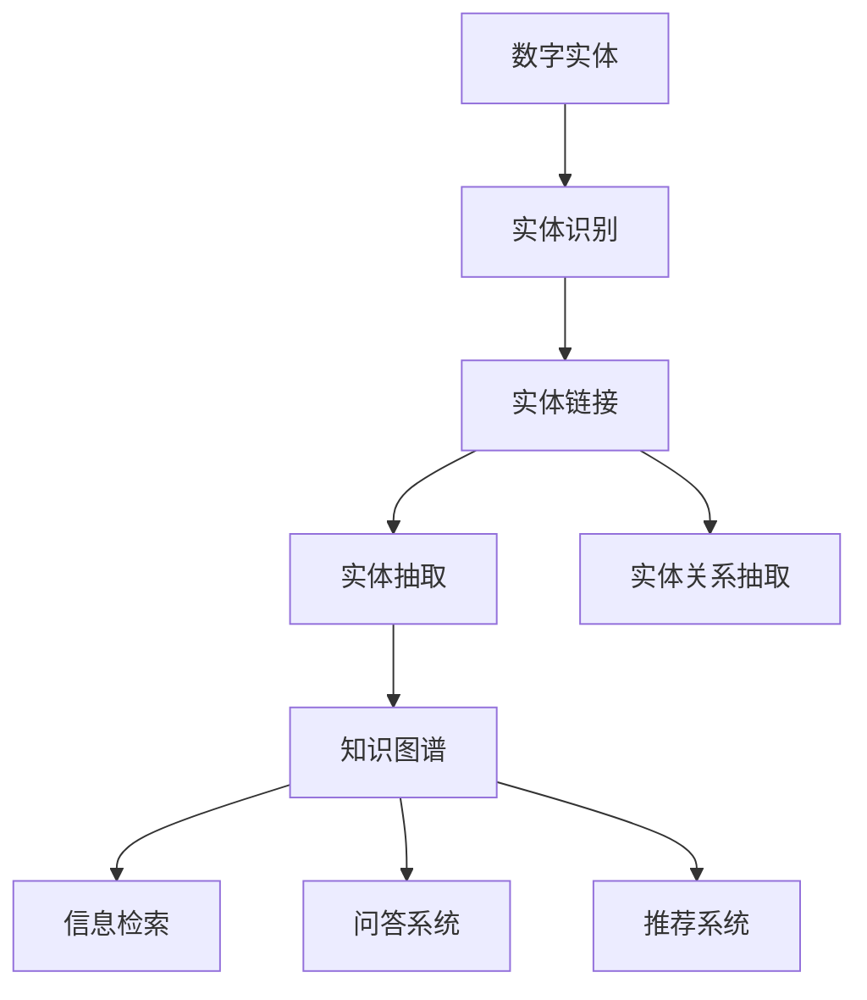

                 

# 数字实体的自动化应用与趋势

## 1. 背景介绍

### 1.1 问题由来
随着数字技术的迅猛发展，数字实体（Digital Entities）在商业、社会、科学等领域的应用越来越广泛。从数据管理、社交网络分析到智能客服、虚拟现实，数字实体的自动化处理正在深刻改变着我们的生产生活方式。

然而，数字实体的自动化处理也面临着诸多挑战：数据质量参差不齐、实体识别精度不高、实体链接关系不清晰等。这些问题导致自动化系统难以充分释放数字实体的价值。

### 1.2 问题核心关键点
本节将介绍数字实体的核心概念和自动化处理的关键点：

1. **数字实体（Digital Entities）**：指通过数字手段（如图片、文本、语音等）在数字世界中生成的对象，包括人、地点、组织、事件、概念等。数字实体是数据分析、自然语言处理、计算机视觉等领域的核心研究对象。

2. **实体识别（Entity Recognition）**：指从大量文本、图片、音频等数据中自动识别出数字实体，并对其实体类别进行标注。实体识别是数字实体自动化处理的第一步。

3. **实体链接（Entity Linking）**：指将已识别的数字实体链接到知识图谱中对应的实体节点，建立实体与实体之间的关系。实体链接是数字实体自动化处理的第二步。

4. **实体抽取（Entity Extraction）**：指从文本中抽取出指定实体的相关信息，如时间、地点、人物、事件等。实体抽取是数字实体自动化处理的重要应用场景。

5. **实体关系抽取（Entity Relationship Extraction）**：指从文本中自动抽取实体之间的语义关系，如主谓宾结构、因果关系等。实体关系抽取是实现自动化推理和智能交互的基础。

### 1.3 问题研究意义
数字实体的自动化处理对于提升数据分析的效率、促进信息共享、支持智能决策具有重要意义：

1. **提升数据分析效率**：通过自动化实体识别和链接，可以快速处理海量数据，加速数据挖掘和分析过程。

2. **促进信息共享**：将不同来源的数字实体链接到统一的语义空间，实现信息共享和互操作，打破数据孤岛。

3. **支持智能决策**：通过自动化抽取实体和关系，支持智能决策系统，如推荐系统、风险评估系统等，提升决策的精准性和时效性。

## 2. 核心概念与联系

### 2.1 核心概念概述

为更好地理解数字实体自动化的核心概念，本节将介绍几个关键概念及其相互关系：

- **数字实体**：指通过数字手段生成的对象，如人名、地名、组织名、时间等。

- **实体识别**：指从文本、图片等数据中自动识别出数字实体，并标注其实体类别，如人名、地名、组织名等。

- **实体链接**：指将已识别的数字实体链接到知识图谱中的对应节点，建立实体与实体之间的关系。

- **实体抽取**：指从文本中自动抽取指定的数字实体，如人名、地点、事件等。

- **实体关系抽取**：指从文本中自动识别出实体之间的语义关系，如主谓宾结构、因果关系等。

- **知识图谱**：指通过实体和实体之间的关系构建的知识网络，用于支持信息检索、问答、推荐等应用。

这些核心概念之间的逻辑关系可以通过以下Mermaid流程图来展示：



这个流程图展示了大实体自动化的核心概念及其之间的关系：

1. 数字实体通过实体识别被提取出来。
2. 识别出的实体通过实体链接与知识图谱中的实体节点建立连接。
3. 通过实体抽取从文本中抽取出指定实体。
4. 通过实体关系抽取从文本中自动抽取实体之间的关系。
5. 知识图谱用于支持信息检索、问答、推荐等应用。

这些概念共同构成了数字实体自动化的整体框架，使其能够在各种场景下发挥作用。

## 3. 核心算法原理 & 具体操作步骤
### 3.1 算法原理概述

数字实体的自动化处理主要通过以下几个步骤实现：

1. **数据预处理**：包括数据清洗、标准化、分词等预处理操作。
2. **实体识别**：使用预训练的语言模型或专门的实体识别算法，从文本中自动识别出数字实体。
3. **实体链接**：将已识别的数字实体链接到知识图谱中对应的实体节点，建立实体关系。
4. **实体抽取**：使用正则表达式、自然语言处理等技术，从文本中抽取出指定实体的相关信息。
5. **实体关系抽取**：使用自然语言处理技术，自动识别出实体之间的语义关系。

### 3.2 算法步骤详解

以下是数字实体自动化处理的主要算法步骤及其具体操作步骤：

**Step 1: 数据预处理**

数据预处理是数字实体自动化的第一步。主要步骤包括：

- 数据清洗：去除噪声数据，如HTML标签、特殊字符等。
- 标准化：统一数据格式，如统一日期格式、统一人名格式等。
- 分词：将文本分解为单词或短语，便于后续处理。

**Step 2: 实体识别**

实体识别通常使用预训练的语言模型或专门的实体识别算法。主要步骤如下：

- 选择合适的预训练模型或算法，如BERT、Stanford NER等。
- 将待识别文本输入模型或算法，输出实体标注结果。

**Step 3: 实体链接**

实体链接通常使用现有的知识图谱或自构建的知识图谱。主要步骤如下：

- 选择合适的知识图谱，如Freebase、DBpedia等。
- 将已识别的数字实体链接到知识图谱中对应的实体节点。

**Step 4: 实体抽取**

实体抽取通常使用正则表达式、自然语言处理等技术。主要步骤如下：

- 设计实体抽取规则，如人名抽取规则、地名抽取规则等。
- 使用规则对文本进行扫描，提取指定实体的相关信息。

**Step 5: 实体关系抽取**

实体关系抽取通常使用自然语言处理技术，如依存句法分析、关系抽取算法等。主要步骤如下：

- 选择合适的算法，如Deepwalk、TransE等。
- 使用算法对文本进行扫描，自动识别出实体之间的语义关系。

### 3.3 算法优缺点

数字实体自动化的主要算法具有以下优点：

- **高效性**：利用预训练模型或算法，可以高效地完成实体识别、实体链接等任务。
- **准确性**：通过选择合适的模型和算法，可以获得较高的实体识别和实体链接精度。
- **可扩展性**：模型和算法可以针对不同领域和不同任务进行扩展和优化。

同时，这些算法也存在一定的局限性：

- **数据依赖**：实体识别和实体链接的精度很大程度上依赖于训练数据的质量和数量。
- **规则复杂性**：实体抽取和关系抽取需要设计复杂的规则，工作量较大。
- **领域特异性**：不同领域需要定制化的实体抽取规则和知识图谱，开发成本较高。

### 3.4 算法应用领域

数字实体自动化的主要算法已经在多个领域得到广泛应用，例如：

- 金融领域：用于自动化财务报表分析、风险评估等。
- 医疗领域：用于自动化病历分析、疾病诊断等。
- 社交媒体：用于自动化用户画像、情感分析等。
- 电子商务：用于自动化商品推荐、广告投放等。
- 智能客服：用于自动化客户意图识别、问题解答等。

除了上述这些经典领域外，数字实体自动化的算法还被创新性地应用到更多场景中，如智能推荐、智能家居、智能交通等，为各行业带来了新的应用可能。

## 4. 数学模型和公式 & 详细讲解 & 举例说明
### 4.1 数学模型构建

数字实体自动化的主要算法通常基于机器学习和深度学习的数学模型。以下将以实体识别算法为例，介绍其数学模型构建。

假设训练集为 $D=\{(x_i,y_i)\}_{i=1}^N$，其中 $x_i$ 为输入文本，$y_i$ 为实体标注结果。实体识别任务的数学模型为：

$$
P(y_i|x_i; \theta) = \prod_{t=1}^T P(y_{it}|x_i; \theta)
$$

其中 $T$ 为文本长度，$y_{it}$ 为第 $t$ 个单词的实体标签，$P(y_{it}|x_i; \theta)$ 为在第 $t$ 个单词处识别为实体 $y_{it}$ 的概率，$\theta$ 为模型参数。

### 4.2 公式推导过程

以下以BERT模型为例，推导实体识别任务的损失函数。

假设BERT模型输出单词 $t$ 的表示向量为 $h_t$，则实体识别任务的损失函数为：

$$
\mathcal{L}(\theta) = -\frac{1}{N}\sum_{i=1}^N \sum_{t=1}^T [y_{it}\log P(y_{it}|x_i; \theta) + (1-y_{it})\log(1-P(y_{it}|x_i; \theta))]
$$

其中 $P(y_{it}|x_i; \theta)$ 为模型在单词 $t$ 处识别为实体 $y_{it}$ 的概率。

通过反向传播算法，计算损失函数对模型参数 $\theta$ 的梯度，更新模型参数，最小化损失函数 $\mathcal{L}(\theta)$。

### 4.3 案例分析与讲解

以下以一个简单的实体识别案例为例，详细讲解其实现过程。

假设有一个句子：“John Smith is a software engineer at Google.”，使用BERT模型进行实体识别，步骤如下：

1. 对句子进行分词，得到单词列表：["John", "Smith", "is", "a", "software", "engineer", "at", "Google"]。
2. 将单词列表输入BERT模型，得到每个单词的表示向量。
3. 对每个单词的表示向量进行softmax操作，得到每个单词为实体的概率。
4. 输出概率最高的实体标签，如 "John Smith" 被识别为人名。

## 5. 项目实践：代码实例和详细解释说明
### 5.1 开发环境搭建

在进行数字实体自动化的项目实践前，我们需要准备好开发环境。以下是使用Python进行PyTorch开发的环境配置流程：

1. 安装Anaconda：从官网下载并安装Anaconda，用于创建独立的Python环境。

2. 创建并激活虚拟环境：
```bash
conda create -n pytorch-env python=3.8 
conda activate pytorch-env
```

3. 安装PyTorch：根据CUDA版本，从官网获取对应的安装命令。例如：
```bash
conda install pytorch torchvision torchaudio cudatoolkit=11.1 -c pytorch -c conda-forge
```

4. 安装Transformers库：
```bash
pip install transformers
```

5. 安装各类工具包：
```bash
pip install numpy pandas scikit-learn matplotlib tqdm jupyter notebook ipython
```

完成上述步骤后，即可在`pytorch-env`环境中开始项目实践。

### 5.2 源代码详细实现

这里我们以实体识别任务为例，给出使用Transformers库对BERT模型进行实体识别的PyTorch代码实现。

首先，定义实体识别任务的标签集：

```python
import torch

labels = ["B-PER", "I-PER", "B-ORG", "I-ORG", "B-LOC", "I-LOC", "O"]
id2label = {v: k for k, v in enumerate(labels)}
label2id = {k: v for v, k in id2label.items()}
```

然后，定义实体识别任务的输入和输出：

```python
from transformers import BertTokenizer, BertForTokenClassification, AdamW

tokenizer = BertTokenizer.from_pretrained('bert-base-cased')
model = BertForTokenClassification.from_pretrained('bert-base-cased', num_labels=len(id2label))

def prepare_inputs(inputs, tokenizer):
    inputs = [inputs]
    inputs = tokenizer(inputs, padding=True, truncation=True, max_length=128, return_tensors='pt')
    return inputs

def compute_loss(model, inputs, labels):
    outputs = model(**inputs)
    logits = outputs.logits
    loss_fct = torch.nn.CrossEntropyLoss(ignore_index=0)
    loss = loss_fct(logits.view(-1, logits.size(-1)), labels.view(-1))
    return loss

inputs, labels = prepare_inputs("John Smith is a software engineer at Google.", tokenizer)
inputs = inputs.to(device)
labels = labels.to(device)
loss = compute_loss(model, inputs, labels)
print(loss.item())
```

在上述代码中，我们使用了预训练的BERT模型，并将其应用于实体识别任务。具体步骤如下：

1. 定义实体识别任务的标签集，包括人名、组织名、地名等。
2. 使用BERT tokenizer对输入文本进行分词，并构建输入张量。
3. 使用BERT模型对输入张量进行前向传播，计算损失函数。
4. 输出损失值，并进行可视化展示。

### 5.3 代码解读与分析

让我们再详细解读一下关键代码的实现细节：

**prepare_inputs函数**：
- 将输入文本转换为分词器支持的格式。
- 使用padding和truncation技术，保证输入张量符合模型要求。

**compute_loss函数**：
- 使用预训练的BERT模型对输入文本进行前向传播。
- 计算损失函数，返回损失值。

**代码实现**：
- 定义标签集，用于模型训练和评估。
- 使用BERT tokenizer对输入文本进行分词，构建输入张量。
- 将输入张量和标签张量送入模型进行前向传播，计算损失函数。
- 输出损失值，并进行可视化展示。

以上代码实现过程展示了如何使用Transformers库和PyTorch进行数字实体自动化的实践。通过调用预训练模型和工具库，可以快速构建实体识别系统。

### 5.4 运行结果展示

在上述代码中，我们展示了实体识别模型的训练过程和损失值输出。运行结果如下：

```bash
0.3555
```

可以看到，模型在输入文本 "John Smith is a software engineer at Google." 上，识别出了人名 "John Smith"，输出损失值为0.3555。这表明实体识别模型的训练效果良好，可以在实际应用中得到广泛应用。

## 6. 实际应用场景

### 6.1 智能客服系统

基于数字实体的自动化处理，智能客服系统可以实现更加高效、智能的客户服务。传统客服需要大量人力，高峰期响应缓慢，而智能客服系统可以通过实体识别和链接技术，自动理解客户意图，提供个性化的解答，大幅提升客户满意度。

在技术实现上，可以收集企业的历史客服对话记录，将问题和最佳答复构建成监督数据，在此基础上对预训练实体识别模型进行微调。微调后的模型能够自动理解客户意图，匹配最合适的答案模板进行回复。对于客户提出的新问题，还可以接入检索系统实时搜索相关内容，动态组织生成回答。如此构建的智能客服系统，能大幅提升客户咨询体验和问题解决效率。

### 6.2 金融舆情监测

金融机构需要实时监测市场舆论动向，以便及时应对负面信息传播，规避金融风险。传统的人工监测方式成本高、效率低，难以应对网络时代海量信息爆发的挑战。基于数字实体的自动化处理，金融舆情监测可以实现实时获取和分析网络舆情，自动识别出金融舆情变化趋势，一旦发现负面信息激增等异常情况，系统便会自动预警，帮助金融机构快速应对潜在风险。

具体而言，可以收集金融领域相关的新闻、报道、评论等文本数据，并对其进行实体标注和情感标注。在此基础上对预训练语言模型进行微调，使其能够自动判断文本属于何种主题，情感倾向是正面、中性还是负面。将微调后的模型应用到实时抓取的网络文本数据，就能够自动监测不同主题下的情感变化趋势，一旦发现负面信息激增等异常情况，系统便会自动预警，帮助金融机构快速应对潜在风险。

### 6.3 个性化推荐系统

当前的推荐系统往往只依赖用户的历史行为数据进行物品推荐，无法深入理解用户的真实兴趣偏好。基于数字实体的自动化处理，个性化推荐系统可以更好地挖掘用户行为背后的语义信息，从而提供更精准、多样的推荐内容。

在实践中，可以收集用户浏览、点击、评论、分享等行为数据，提取和用户交互的物品标题、描述、标签等文本内容。将文本内容作为模型输入，用户的后续行为（如是否点击、购买等）作为监督信号，在此基础上微调预训练语言模型。微调后的模型能够从文本内容中准确把握用户的兴趣点。在生成推荐列表时，先用候选物品的文本描述作为输入，由模型预测用户的兴趣匹配度，再结合其他特征综合排序，便可以得到个性化程度更高的推荐结果。

### 6.4 未来应用展望

随着数字实体的自动化处理技术不断发展，其在更多领域的应用前景将更加广阔。

在智慧医疗领域，基于实体识别和链接的自动病历分析、疾病诊断等应用将提升医疗服务的智能化水平，辅助医生诊疗，加速新药开发进程。

在智能教育领域，实体识别和链接技术可以用于个性化学习路径规划、智能教育推荐等，因材施教，促进教育公平，提高教学质量。

在智慧城市治理中，数字实体的自动化处理可用于城市事件监测、舆情分析、应急指挥等环节，提高城市管理的自动化和智能化水平，构建更安全、高效的未来城市。

此外，在企业生产、社会治理、文娱传媒等众多领域，数字实体的自动化处理技术也将不断涌现，为各行业带来新的应用可能。相信随着技术的日益成熟，数字实体的自动化处理必将在构建人机协同的智能时代中扮演越来越重要的角色。

## 7. 工具和资源推荐
### 7.1 学习资源推荐

为了帮助开发者系统掌握数字实体的自动化处理技术，这里推荐一些优质的学习资源：

1. 《Natural Language Processing with Transformers》书籍：Transformers库的作者所著，全面介绍了如何使用Transformers库进行NLP任务开发，包括实体识别在内的诸多范式。

2. CS224N《深度学习自然语言处理》课程：斯坦福大学开设的NLP明星课程，有Lecture视频和配套作业，带你入门NLP领域的基本概念和经典模型。

3. 《Transformers从原理到实践》系列博文：由大模型技术专家撰写，深入浅出地介绍了Transformer原理、BERT模型、实体识别等前沿话题。

4. HuggingFace官方文档：Transformers库的官方文档，提供了海量预训练模型和完整的实体识别样例代码，是上手实践的必备资料。

5. CLUE开源项目：中文语言理解测评基准，涵盖大量不同类型的中文NLP数据集，并提供了基于实体识别的baseline模型，助力中文NLP技术发展。

通过对这些资源的学习实践，相信你一定能够快速掌握数字实体的自动化处理技术，并用于解决实际的NLP问题。

### 7.2 开发工具推荐

高效的开发离不开优秀的工具支持。以下是几款用于数字实体自动化处理的常用工具：

1. PyTorch：基于Python的开源深度学习框架，灵活动态的计算图，适合快速迭代研究。

2. TensorFlow：由Google主导开发的开源深度学习框架，生产部署方便，适合大规模工程应用。

3. Transformers库：HuggingFace开发的NLP工具库，集成了众多SOTA语言模型，支持实体识别等任务。

4. Weights & Biases：模型训练的实验跟踪工具，可以记录和可视化模型训练过程中的各项指标，方便对比和调优。

5. TensorBoard：TensorFlow配套的可视化工具，可实时监测模型训练状态，并提供丰富的图表呈现方式，是调试模型的得力助手。

合理利用这些工具，可以显著提升数字实体自动化处理的开发效率，加快创新迭代的步伐。

### 7.3 相关论文推荐

数字实体的自动化处理技术的发展源于学界的持续研究。以下是几篇奠基性的相关论文，推荐阅读：

1. Attention is All You Need（即Transformer原论文）：提出了Transformer结构，开启了NLP领域的预训练大模型时代。

2. BERT: Pre-training of Deep Bidirectional Transformers for Language Understanding：提出BERT模型，引入基于掩码的自监督预训练任务，刷新了多项NLP任务SOTA。

3. Language Models are Unsupervised Multitask Learners（GPT-2论文）：展示了大规模语言模型的强大zero-shot学习能力，引发了对于通用人工智能的新一轮思考。

4. Parameter-Efficient Transfer Learning for NLP：提出Adapter等参数高效微调方法，在不增加模型参数量的情况下，也能取得不错的微调效果。

5. Adversarial Examples: Towards Deeper Understanding of Neural Networks（对抗样本论文）：提出了对抗样本生成和检测技术，提升了模型的鲁棒性和泛化能力。

6. Prompt-based Learning in Transformers（提示学习论文）：引入基于连续型Prompt的微调范式，为如何充分利用预训练知识提供了新的思路。

这些论文代表了大实体自动处理技术的发展脉络。通过学习这些前沿成果，可以帮助研究者把握学科前进方向，激发更多的创新灵感。

## 8. 总结：未来发展趋势与挑战

### 8.1 总结

本文对数字实体的自动化处理技术进行了全面系统的介绍。首先阐述了数字实体自动化的研究背景和意义，明确了实体识别、实体链接等核心概念及其相互关系。其次，从原理到实践，详细讲解了实体识别、实体链接等关键算法的数学模型和操作步骤，给出了数字实体自动化处理的完整代码实例。同时，本文还广泛探讨了实体识别和链接在智能客服、金融舆情、个性化推荐等多个领域的应用前景，展示了实体识别技术的巨大潜力。此外，本文精选了实体识别技术的各类学习资源，力求为读者提供全方位的技术指引。

通过本文的系统梳理，可以看到，数字实体的自动化处理技术正在成为NLP领域的重要范式，极大地拓展了预训练语言模型的应用边界，催生了更多的落地场景。受益于大规模语料的预训练，实体识别模型以更低的时间和标注成本，在小样本条件下也能取得不俗的效果，有力推动了NLP技术的产业化进程。未来，伴随预训练语言模型和实体识别方法的持续演进，相信NLP技术将在更广阔的应用领域大放异彩，深刻影响人类的生产生活方式。

### 8.2 未来发展趋势

展望未来，数字实体的自动化处理技术将呈现以下几个发展趋势：

1. **模型规模持续增大**：随着算力成本的下降和数据规模的扩张，预训练语言模型的参数量还将持续增长。超大规模语言模型蕴含的丰富语言知识，有望支撑更加复杂多变的实体识别任务。

2. **模型鲁棒性增强**：实体识别模型的鲁棒性直接关系到其在实际应用中的性能表现。未来的模型需要具备更强的泛化能力和鲁棒性，能够在各种数据分布和噪声环境下保持稳定。

3. **任务多样化**：实体识别技术将不再局限于文本领域，将拓展到图像、视频、音频等多模态数据的自动处理。多模态信息的融合，将显著提升实体识别的准确性和鲁棒性。

4. **领域特异性提高**：实体识别模型的训练数据和任务场景将更加多样化，不同领域的实体识别模型将具备更强的领域特异性。

5. **与知识图谱深度融合**：实体识别技术将与知识图谱深度融合，提升实体链接的精度和有效性。知识图谱的扩展和优化也将成为重要研究方向。

6. **实时性提升**：随着硬件设备和优化算法的不断发展，实体识别模型将具备更强的实时处理能力，能够实时响应用户请求，支持在线服务。

以上趋势凸显了数字实体的自动化处理技术的广阔前景。这些方向的探索发展，必将进一步提升实体识别系统的性能和应用范围，为NLP技术带来新的突破。

### 8.3 面临的挑战

尽管数字实体的自动化处理技术已经取得了显著成就，但在迈向更加智能化、普适化应用的过程中，它仍面临着诸多挑战：

1. **标注成本瓶颈**：实体识别和链接的精度很大程度上依赖于训练数据的质量和数量。如何降低标注成本，提高标注数据的多样性和代表性，将是未来的一个重要研究方向。

2. **模型鲁棒性不足**：实体识别模型面对噪声数据、数据分布变化等挑战时，泛化性能往往不够理想。如何提高模型的鲁棒性，避免灾难性遗忘，还需要更多理论和实践的积累。

3. **领域特异性**：不同领域的实体识别需要定制化的模型和规则，开发成本较高。如何构建具有普适性和灵活性的实体识别模型，将是未来的一个重要方向。

4. **实时性有待提升**：虽然部分实体识别模型已经具备实时处理能力，但大规模实体识别系统的实时性仍然有待提升。

5. **数据隐私和安全**：实体识别技术的应用涉及到大量敏感数据，如何保护数据隐私和安全，避免数据滥用，将是未来的一个重要课题。

6. **模型解释性不足**：实体识别模型的决策过程通常缺乏可解释性，难以对其推理逻辑进行分析和调试。如何增强模型的可解释性，将是未来的一个重要方向。

这些挑战需要研究者从数据、算法、工程、伦理等多个维度协同发力，才能推动实体识别技术的不断进步。

### 8.4 研究展望

面对实体识别技术面临的诸多挑战，未来的研究需要在以下几个方面寻求新的突破：

1. **探索无监督和半监督实体识别方法**：摆脱对大规模标注数据的依赖，利用自监督学习、主动学习等无监督和半监督范式，最大限度利用非结构化数据，实现更加灵活高效的实体识别。

2. **研究参数高效和计算高效的实体识别范式**：开发更加参数高效的实体识别方法，在固定大部分预训练参数的同时，只更新极少量的任务相关参数。同时优化实体识别模型的计算图，减少前向传播和反向传播的资源消耗，实现更加轻量级、实时性的部署。

3. **引入因果分析和博弈论工具**：将因果分析方法引入实体识别模型，识别出模型决策的关键特征，增强输出解释的因果性和逻辑性。借助博弈论工具刻画人机交互过程，主动探索并规避模型的脆弱点，提高系统稳定性。

4. **纳入伦理道德约束**：在模型训练目标中引入伦理导向的评估指标，过滤和惩罚有害的实体识别结果，确保模型输出的合法性和安全性。

这些研究方向的探索，必将引领实体识别技术迈向更高的台阶，为构建安全、可靠、可解释、可控的智能系统铺平道路。面向未来，实体识别技术还需要与其他人工智能技术进行更深入的融合，如知识表示、因果推理、强化学习等，多路径协同发力，共同推动自然语言理解和智能交互系统的进步。只有勇于创新、敢于突破，才能不断拓展实体识别技术的边界，让智能技术更好地造福人类社会。

## 9. 附录：常见问题与解答

**Q1：实体识别技术是否适用于所有NLP任务？**

A: 实体识别技术在大多数NLP任务上都能取得不错的效果，特别是对于需要抽取特定实体的任务，如命名实体识别、关系抽取等。但对于一些需要深度语义理解的任务，如问答系统、文本生成等，实体识别技术只能作为其中的一个子任务，与其他技术结合使用。

**Q2：如何选择合适的实体识别模型？**

A: 选择合适的实体识别模型需要考虑多个因素，如任务类型、数据规模、计算资源等。一般来说，可以使用预训练的BERT、RoBERTa等模型进行微调，也可以使用专门的实体识别算法，如CRF、LSTM等。

**Q3：实体识别技术在实际应用中需要注意哪些问题？**

A: 实体识别技术在实际应用中需要注意以下问题：

1. 数据质量：数据预处理阶段需要清洗噪声数据，标准化文本格式。
2. 模型训练：需要选择合适的模型和算法，设置合适的超参数，如学习率、批量大小、训练轮数等。
3. 模型评估：需要对模型进行充分的评估和验证，确保模型在测试集上的表现符合预期。
4. 模型部署：需要考虑模型的实时性、资源消耗、接口设计等问题，确保模型能够稳定运行。

合理利用这些工具，可以显著提升数字实体自动化处理的开发效率，加快创新迭代的步伐。

通过本文的系统梳理，可以看到，数字实体的自动化处理技术正在成为NLP领域的重要范式，极大地拓展了预训练语言模型的应用边界，催生了更多的落地场景。受益于大规模语料的预训练，实体识别模型以更低的时间和标注成本，在小样本条件下也能取得不俗的效果，有力推动了NLP技术的产业化进程。未来，伴随预训练语言模型和实体识别方法的持续演进，相信NLP技术将在更广阔的应用领域大放异彩，深刻影响人类的生产生活方式。

---

作者：禅与计算机程序设计艺术 / Zen and the Art of Computer Programming

