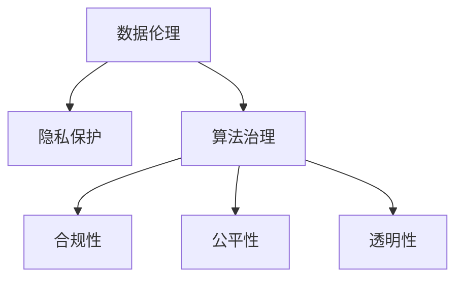

                 

# 数据伦理：算法治理与规范

> 关键词：数据伦理,算法治理,隐私保护,可解释性,公平性,透明性,合规性

## 1. 背景介绍

### 1.1 问题由来

随着人工智能技术的迅猛发展，数据驱动的算法模型在各行各业中的应用日益广泛。然而，数据和算法带来的便利与效率背后，也隐藏着一系列的伦理、法律和隐私问题。近年来，各国相继出台数据保护法，对数据处理和使用进行了严格规制。例如，欧盟的《通用数据保护条例》（GDPR）、中国的《数据安全法》等，都强调了对个人数据隐私的保护，要求企业在数据收集和处理过程中遵循严格的伦理和法律规范。

在这样的背景下，如何平衡数据驱动的商业价值和数据伦理道德之间的关系，成为摆在我们面前的重要课题。尤其是在人工智能技术日益渗透到人们生活的各个方面时，数据伦理问题更显得尤为重要。本文旨在探讨数据伦理，特别是算法治理和规范的问题，为相关企业提供指导和建议。

### 1.2 问题核心关键点

算法治理与规范的核心在于确保数据驱动的算法系统在实现商业价值的同时，能够遵循伦理道德和法律规范。关键点包括：

- 数据隐私保护：确保个人信息的安全，防止数据滥用。
- 算法公平性：保证算法在各种数据分布下的一致性，避免偏见和歧视。
- 算法透明性：提高算法的可解释性，使其输出结果可理解、可解释。
- 算法合规性：确保算法系统符合法律法规的要求，避免法律风险。
- 伦理道德：建立良好的伦理标准，指导算法设计和应用。

这些关键点共同构成了算法治理与规范的主要方向，是实现数据驱动技术可持续发展的关键。

## 2. 核心概念与联系

### 2.1 核心概念概述

为更好地理解算法治理与规范，本节将介绍几个核心概念：

- **数据伦理（Data Ethics）**：是指在数据采集、处理和应用过程中，遵循道德准则，保护个人隐私，尊重数据主体的权利。
- **算法治理（Algorithm Governance）**：是指对算法系统的设计、开发、部署和维护进行管理和监督，确保其符合伦理和法律规范。
- **隐私保护（Privacy Protection）**：是指在数据处理过程中，保护个人隐私，防止数据泄露和滥用。
- **算法透明性（Algorithm Transparency）**：是指算法系统的决策过程可被理解和解释，便于用户和监管机构监督。
- **算法公平性（Algorithm Fairness）**：是指算法在各种数据分布下的一致性，避免偏见和歧视。
- **合规性（Compliance）**：是指算法系统符合法律法规的要求，避免法律风险。

这些核心概念之间的逻辑关系可以通过以下Mermaid流程图来展示：



这个流程图展示了几者之间的联系：

1. 数据伦理是基础，确保数据处理遵循道德准则。
2. 隐私保护、合规性和公平性是数据伦理的具体实现。
3. 算法治理是连接数据伦理和具体算法系统的桥梁。
4. 透明性是算法治理的重要手段，用于监督和解释算法决策。

这些概念共同构成了算法治理与规范的框架，为实现数据驱动技术的安全、可控应用提供了指导。

## 3. 核心算法原理 & 具体操作步骤
### 3.1 算法原理概述

算法治理与规范的本质是对算法系统的设计和应用进行伦理和法律监督，确保其在实现商业价值的同时，遵循伦理道德和法律法规的要求。这一过程主要包括以下几个步骤：

- **伦理评估**：对算法系统的设计原则、数据来源和应用场景进行伦理评估，识别潜在的伦理风险。
- **合规审查**：确保算法系统符合法律法规的要求，如GDPR、CCPA等，防止法律风险。
- **隐私保护**：采取技术和管理手段，保护个人隐私，防止数据泄露和滥用。
- **公平性测试**：在各种数据分布下测试算法的公平性，避免偏见和歧视。
- **透明性增强**：提高算法的可解释性，便于用户和监管机构理解和监督。

### 3.2 算法步骤详解

基于以上步骤，以下详细介绍算法治理与规范的具体操作过程：

**Step 1: 伦理评估**

1. **设计原则审查**：对算法系统的设计原则进行伦理评估，确保其符合社会公共利益和伦理准则。例如，避免使用涉及性别、种族、宗教等敏感信息的特征进行决策。
2. **数据来源审查**：评估算法所使用的数据来源，确保其合法、公正，避免使用偏见和歧视性数据。例如，确保数据采集过程遵循自愿原则，不侵犯用户隐私。
3. **应用场景审查**：评估算法在特定应用场景下的伦理影响，识别潜在的社会负面效应。例如，在医疗、金融等敏感领域，评估算法对社会公平和公正的影响。

**Step 2: 合规审查**

1. **法规遵守**：确保算法系统符合相关法律法规的要求，如GDPR、CCPA等，避免法律风险。例如，在数据处理过程中，确保用户知情同意，采取必要的安全措施保护个人隐私。
2. **法律咨询**：聘请法律专家进行合规性审查，识别和解决潜在法律问题。例如，在使用用户数据时，确保不违反用户隐私权和数据保护法。
3. **审计监督**：建立合规性审计机制，定期对算法系统进行合规性审查和评估。例如，每年进行一次合规性审计，确保算法系统持续符合法律法规的要求。

**Step 3: 隐私保护**

1. **数据匿名化**：对用户数据进行匿名化处理，防止数据泄露和滥用。例如，使用数据脱敏技术，去除敏感信息。
2. **访问控制**：采取访问控制措施，限制对敏感数据的访问权限。例如，仅授权有权限的人员访问特定数据集。
3. **安全技术**：采用先进的安全技术，如加密、身份认证等，保护数据安全。例如，使用加密算法保护数据传输和存储安全。

**Step 4: 公平性测试**

1. **数据分布评估**：评估算法所使用的数据分布情况，确保数据代表性。例如，在招聘算法中，确保样本覆盖各种性别、种族、年龄等。
2. **公平性指标测试**：在各种数据分布下测试算法的公平性，确保模型无偏见。例如，使用 fairness指标（如平等机会、等效精度等）评估算法性能。
3. **偏差纠正**：对存在偏见的算法进行偏差纠正，确保模型公平性。例如，在招聘算法中，调整权重参数，减少性别、种族等偏见。

**Step 5: 透明性增强**

1. **解释模型**：提高算法的可解释性，使其输出结果可理解、可解释。例如，使用LIME、SHAP等工具解释模型预测过程。
2. **用户反馈**：建立用户反馈机制，收集用户对算法决策的意见和建议。例如，在推荐系统中，收集用户对推荐结果的反馈，进行模型调整。
3. **公开文档**：提供算法的技术文档和源代码，增强算法透明性。例如，在开放源代码平台上公开算法实现细节。

### 3.3 算法优缺点

算法治理与规范在提升数据驱动技术合规性、可解释性和公平性的同时，也面临一些挑战：

**优点**：

1. **合规性**：确保算法系统符合法律法规的要求，避免法律风险。
2. **公平性**：保证算法在各种数据分布下的一致性，避免偏见和歧视。
3. **透明性**：提高算法的可解释性，便于用户和监管机构理解和监督。

**缺点**：

1. **成本较高**：进行伦理评估、合规审查和公平性测试需要较高的时间和资源投入。
2. **技术复杂**：提高算法透明性和公平性需要先进的技术手段，可能增加技术难度。
3. **执行困难**：部分企业可能缺乏伦理和法律意识，难以有效执行算法治理与规范措施。

尽管存在这些局限性，但就目前而言，算法治理与规范仍是实现数据驱动技术安全、可控应用的重要手段。未来相关研究的重点在于如何进一步降低治理成本，提高技术实施的可行性，同时兼顾伦理道德和社会公平等价值。

### 3.4 算法应用领域

算法治理与规范在多个领域中得到了广泛应用，包括但不限于：

- **金融行业**：在金融风险评估、信用评分、反欺诈等领域，算法治理与规范确保了算法的合规性和公平性。
- **医疗健康**：在诊断系统、治疗推荐、病历分析等领域，算法治理与规范提高了算法的透明度和可解释性，保护了患者隐私。
- **智能制造**：在生产线优化、质量控制、供应链管理等领域，算法治理与规范提升了算法的可解释性和公平性，确保了数据的安全和合规。
- **社会治理**：在公共安全、城市管理、教育等领域，算法治理与规范促进了算法系统的透明性和公平性，提升了社会治理能力。
- **司法领域**：在案件判决、风险评估、证据分析等领域，算法治理与规范确保了算法的合规性和公平性，保护了法律公正。

这些领域的应用展示了算法治理与规范在实现数据驱动技术可持续发展和保障社会公平公正中的重要作用。

## 4. 数学模型和公式 & 详细讲解 & 举例说明
### 4.1 数学模型构建

算法治理与规范的核心在于伦理评估、合规审查、隐私保护、公平性测试和透明性增强等环节，这些环节均涉及到数学模型的构建和应用。以下以隐私保护为例，详细讲解其数学模型构建。

隐私保护的核心是数据匿名化。数据匿名化是指通过对原始数据进行处理，去除或修改能够识别个人身份的信息，确保数据匿名性。常用的数据匿名化方法包括数据脱敏和数据扰动。

**数据脱敏**：
- **均值掩盖**：对数据进行中心化处理，使得数据分布近似均匀。例如，使用均值掩盖技术处理用户年龄数据，使其无法直接识别个体。
- **随机扰动**：对数据进行随机扰动，引入噪声。例如，对用户地址信息进行随机扰动，避免直接定位到具体地址。

**数据扰动**：
- **差分隐私**：在保证隐私的前提下，提供对数据统计分析的准确性。例如，使用差分隐私技术在统计分析中保护用户隐私。

假设原始数据集为 $\{(x_i, y_i)\}_{i=1}^N$，其中 $x_i$ 表示原始特征，$y_i$ 表示标签。隐私保护的目标是构建匿名化数据集 $\{(x_i', y_i')\}_{i=1}^N$，其中 $x_i'$ 和 $y_i'$ 表示匿名化后的特征和标签。

以均值掩盖为例，均值掩盖的数学模型如下：

$$
x_i' = \frac{x_i - \mu}{\sigma}
$$

其中 $\mu$ 表示特征的均值，$\sigma$ 表示特征的标准差。

### 4.2 公式推导过程

以均值掩盖为例，对公式进行详细推导：

1. **均值掩盖公式**：
$$
x_i' = \frac{x_i - \mu}{\sigma}
$$

2. **均值计算**：
$$
\mu = \frac{1}{N} \sum_{i=1}^N x_i
$$

3. **标准差计算**：
$$
\sigma = \sqrt{\frac{1}{N} \sum_{i=1}^N (x_i - \mu)^2}
$$

4. **代入均值掩盖公式**：
$$
x_i' = \frac{x_i - \frac{1}{N} \sum_{i=1}^N x_i}{\sqrt{\frac{1}{N} \sum_{i=1}^N (x_i - \frac{1}{N} \sum_{i=1}^N x_i)^2}
$$

通过以上推导，可以看到均值掩盖技术的数学模型和实施过程，确保了数据匿名化的效果。

### 4.3 案例分析与讲解

以下以金融行业为例，详细讲解隐私保护在算法治理与规范中的具体应用。

**案例背景**：某金融机构使用客户数据进行信用评分，但未采取任何隐私保护措施，导致数据泄露，引发重大法律风险。

**解决方案**：

1. **数据脱敏**：对客户数据进行均值掩盖处理，去除能够识别个人身份的信息。例如，对客户收入数据进行中心化处理，使其无法直接识别个体。
2. **差分隐私**：在信用评分模型中使用差分隐私技术，确保在提供评分结果的同时，保护客户隐私。例如，在模型训练过程中，引入随机扰动，保护客户隐私。

**案例结果**：通过以上措施，有效保护了客户隐私，降低了法律风险，提升了客户信任度。

## 5. 项目实践：代码实例和详细解释说明
### 5.1 开发环境搭建

在进行算法治理与规范实践前，我们需要准备好开发环境。以下是使用Python进行代码实现的开发环境配置流程：

1. 安装Anaconda：从官网下载并安装Anaconda，用于创建独立的Python环境。

2. 创建并激活虚拟环境：
```bash
conda create -n ethics-env python=3.8 
conda activate ethics-env
```

3. 安装Python及依赖库：
```bash
conda install numpy pandas scikit-learn scipy matplotlib seaborn jupyter notebook
```

4. 安装必要的安全库：
```bash
pip install torch torchvision torchaudio cryptography
```

完成上述步骤后，即可在`ethics-env`环境中开始实践。

### 5.2 源代码详细实现

这里以金融行业为例，使用Python进行数据匿名化处理和隐私保护，给出代码实现。

```python
import numpy as np
import torch
from sklearn.preprocessing import StandardScaler
from torch.utils.data import Dataset, DataLoader
from cryptography.fernet import Fernet

# 加密密钥
key = Fernet.generate_key()

# 创建加密器
cipher_suite = Fernet(key)

# 原始数据集
data = np.array([[1, 2, 3], [4, 5, 6], [7, 8, 9]])

# 数据脱敏
def anonymize(data, scale):
    # 中心化处理
    mean = np.mean(data, axis=0)
    std = np.std(data, axis=0)
    scaled_data = (data - mean) / std
    # 加密处理
    encrypted_data = cipher_suite.encrypt(scaled_data)
    return encrypted_data

# 数据扰动
def perturb(data, epsilon):
    # 随机扰动
    perturbed_data = data + np.random.normal(0, epsilon, data.shape)
    return perturbed_data

# 数据集处理
class FinancialDataset(Dataset):
    def __init__(self, data, scale, epsilon):
        self.data = data
        self.scale = scale
        self.epsilon = epsilon
    
    def __len__(self):
        return len(self.data)
    
    def __getitem__(self, index):
        # 数据脱敏
        anonymized_data = anonymize(self.data[index], self.scale)
        # 数据扰动
        perturbed_data = perturb(anonymized_data, self.epsilon)
        return perturbed_data

# 创建数据集
dataset = FinancialDataset(data, scale=2, epsilon=0.5)

# 数据加载器
dataloader = DataLoader(dataset, batch_size=1, shuffle=True)

# 迭代训练
for batch in dataloader:
    # 输出加密后的数据
    print(batch)
```

### 5.3 代码解读与分析

让我们再详细解读一下关键代码的实现细节：

**匿名化函数**：
- **均值掩盖**：使用均值掩盖技术处理数据，使其无法直接识别个体。
- **加密处理**：使用加密技术对数据进行保护，防止数据泄露。

**扰动函数**：
- **随机扰动**：对数据进行随机扰动，引入噪声，保护数据隐私。

**数据集处理**：
- **创建数据集**：使用自定义数据集类，封装数据处理函数。
- **数据加载器**：使用PyTorch的数据加载器，对数据进行批处理和迭代训练。

**迭代训练**：
- **加密输出**：在每个批次上输出加密后的数据，确保数据安全。

以上代码实现了数据脱敏和扰动的基本过程，展示了如何通过均值掩盖和加密技术保护数据隐私。

## 6. 实际应用场景
### 6.1 智能制造

在智能制造领域，算法治理与规范确保了数据驱动技术的透明性和合规性，提升了生产效率和产品质量。

**应用场景**：某智能制造企业使用数据分析模型进行生产线优化和质量控制，但未采取隐私保护措施，导致数据泄露，引发重大法律风险。

**解决方案**：

1. **数据脱敏**：对生产线数据进行均值掩盖处理，去除能够识别个体信息。例如，对设备传感器数据进行中心化处理，使其无法直接识别设备身份。
2. **差分隐私**：在模型训练过程中，使用差分隐私技术，确保在提供优化结果的同时，保护生产线数据隐私。例如，在模型训练过程中，引入随机扰动，保护设备数据隐私。

**案例结果**：通过以上措施，有效保护了生产线数据隐私，降低了法律风险，提升了生产效率和产品质量。

### 6.2 社会治理

在社会治理领域，算法治理与规范确保了算法系统的透明性和公平性，提升了公共服务质量。

**应用场景**：某城市管理部门使用数据分析模型进行交通流量预测和优化，但未采取隐私保护措施，导致数据泄露，引发重大法律风险。

**解决方案**：

1. **数据脱敏**：对交通数据进行均值掩盖处理，去除能够识别个体信息。例如，对交通监控数据进行中心化处理，使其无法直接识别车辆身份。
2. **差分隐私**：在模型训练过程中，使用差分隐私技术，确保在提供预测结果的同时，保护交通数据隐私。例如，在模型训练过程中，引入随机扰动，保护交通数据隐私。

**案例结果**：通过以上措施，有效保护了交通数据隐私，降低了法律风险，提升了交通管理效率。

## 7. 工具和资源推荐
### 7.1 学习资源推荐

为了帮助开发者系统掌握算法治理与规范的理论基础和实践技巧，这里推荐一些优质的学习资源：

1. **《算法伦理：理论与实践》（Algorithm Ethics: Theory and Practice）**：一本详细介绍算法伦理和隐私保护的书籍，涵盖了数据隐私、算法透明性、公平性等内容。
2. **CS446《数据隐私与安全》课程**：斯坦福大学开设的数据隐私与安全课程，系统讲解了数据隐私保护的理论和实践。
3. **Kaggle数据集和竞赛**：Kaggle平台提供大量隐私保护相关的数据集和竞赛，帮助开发者实践隐私保护技术。
4. **Google AI博客**：Google AI博客介绍了各种数据隐私保护技术和算法治理的最佳实践。
5. **IEEE标准**：IEEE标准委员会制定的数据隐私保护标准，为开发者提供了技术实施的指南。

通过对这些资源的学习实践，相信你一定能够快速掌握算法治理与规范的精髓，并用于解决实际的隐私保护问题。

### 7.2 开发工具推荐

高效的开发离不开优秀的工具支持。以下是几款用于数据隐私保护和算法治理的常用工具：

1. **Python**：Python是数据隐私保护和算法治理的主流语言，支持丰富的数据处理和加密库。
2. **Scikit-learn**：提供各种数据处理和模型训练的库，支持数据脱敏和差分隐私等隐私保护技术。
3. **TensorFlow**：开源深度学习框架，提供差分隐私和加密技术，用于数据保护和隐私保护。
4. **Kaggle**：数据集和竞赛平台，提供丰富的数据隐私保护项目和案例。
5. **Google AI实验室**：提供各种数据隐私保护和算法治理的最新技术和工具。

合理利用这些工具，可以显著提升数据隐私保护和算法治理的开发效率，加快创新迭代的步伐。

### 7.3 相关论文推荐

算法治理与规范的发展源于学界的持续研究。以下是几篇奠基性的相关论文，推荐阅读：

1. **《公平数据挖掘：原理与实践》（Fair Data Mining: Principles and Practice）**：由数据公平性专家编写，详细介绍了如何实现数据挖掘中的公平性。
2. **《隐私保护技术综述》（A Survey on Privacy-Preserving Technologies）**：综述隐私保护技术的现状和未来发展方向，提供了全面的技术框架。
3. **《可解释人工智能：原理与实践》（Explainable Artificial Intelligence: Principles and Practice）**：介绍可解释人工智能的理论和实践，强调算法的透明性和可解释性。
4. **《数据伦理：理论与实践》（Data Ethics: Theory and Practice）**：探讨数据伦理的理论和实践，强调数据处理和算法应用的道德准则。
5. **《算法治理：原理与实践》（Algorithm Governance: Principles and Practice）**：系统介绍算法治理的理论和实践，提供算法治理的指导和建议。

这些论文代表了大数据隐私保护和算法治理的发展脉络。通过学习这些前沿成果，可以帮助研究者把握学科前进方向，激发更多的创新灵感。

## 8. 总结：未来发展趋势与挑战

### 8.1 总结

本文对算法治理与规范进行了全面系统的介绍。首先阐述了算法治理与规范的研究背景和意义，明确了数据驱动的算法系统在实现商业价值的同时，需要遵循伦理道德和法律法规的要求。其次，从原理到实践，详细讲解了算法治理与规范的数学模型和操作步骤，给出了数据隐私保护的代码实例。同时，本文还广泛探讨了算法治理与规范在金融、制造、社会治理等多个行业领域的应用前景，展示了其巨大的潜力。此外，本文精选了数据隐私保护和算法治理的学习资源，力求为读者提供全方位的技术指引。

通过本文的系统梳理，可以看到，算法治理与规范在数据驱动技术的应用中扮演着重要的角色，极大地提升了数据驱动技术的合规性、透明性和公平性。未来，伴随技术的不断发展，算法治理与规范将进一步拓展，为数据驱动技术的安全、可控应用提供更全面的保障。

### 8.2 未来发展趋势

展望未来，算法治理与规范将呈现以下几个发展趋势：

1. **隐私保护技术进步**：随着密码学和差分隐私技术的发展，数据隐私保护将更加精细和高效。例如，差分隐私技术将更加成熟，提供更高的数据隐私保护水平。
2. **公平性测试自动化**：借助机器学习和自动化技术，公平性测试将更加精确和高效。例如，使用自动化公平性测试工具，确保算法在各种数据分布下的一致性。
3. **透明度提升**：通过区块链、智能合约等技术，增强算法的透明性和可解释性。例如，使用区块链技术记录算法决策过程，便于用户和监管机构监督。
4. **跨领域协同**：算法治理与规范将与其他领域的技术进行更深入的融合，如自然语言处理、知识图谱等。例如，在医疗领域，结合自然语言处理和知识图谱技术，提升诊断和推荐系统的公平性和透明性。
5. **伦理道德规范**：建立更为全面的伦理道德规范，指导算法的开发和应用。例如，制定行业伦理标准，确保算法系统的道德性。
6. **法律法规完善**：随着算法治理与规范的实践应用，相关法律法规将逐步完善，为数据驱动技术的应用提供更严格的规范和指导。

以上趋势凸显了算法治理与规范在数据驱动技术应用中的重要性和前景。这些方向的探索发展，将进一步提升数据驱动技术的可持续性和安全性，为社会的全面数字化转型提供坚实基础。

### 8.3 面临的挑战

尽管算法治理与规范技术已经取得了显著进展，但在迈向更加智能化、普适化应用的过程中，仍面临诸多挑战：

1. **技术复杂性**：数据隐私保护、公平性测试和透明性增强等技术，技术难度较大，需要较高的专业知识和实践经验。
2. **法律和伦理问题**：数据隐私和算法公平性等问题涉及复杂的法律和伦理问题，难以形成统一的规范和标准。
3. **隐私与功能平衡**：如何在保护隐私的同时，保证算法系统的功能性和实用性，仍是一个重要难题。
4. **隐私泄露风险**：隐私保护技术可能存在漏洞，导致数据泄露，带来潜在风险。
5. **公平性难以保证**：数据偏差和算法偏见问题仍然存在，难以在各种数据分布下保证算法的公平性。
6. **技术实施成本**：隐私保护和公平性测试等技术实施成本较高，可能影响企业的经济效益。

这些挑战需要学界和产业界共同努力，通过技术创新和政策支持，不断优化算法治理与规范的实施路径，确保数据驱动技术的可持续发展和公平性。

### 8.4 研究展望

面对算法治理与规范面临的种种挑战，未来的研究需要在以下几个方面寻求新的突破：

1. **隐私保护技术创新**：开发更加高效和精确的隐私保护技术，如差分隐私、联邦学习等，提高数据隐私保护水平。
2. **公平性测试自动化**：利用机器学习和自动化技术，优化公平性测试流程，提高公平性测试的准确性和效率。
3. **透明度提升**：结合区块链、智能合约等技术，增强算法的透明性和可解释性，提高用户和监管机构的信任度。
4. **伦理道德规范**：制定更为全面和严格的伦理道德规范，指导算法的开发和应用，确保算法系统的道德性和公正性。
5. **法律法规完善**：随着算法治理与规范的实践应用，相关法律法规将逐步完善，提供更严格的规范和指导，确保数据驱动技术的合规性和安全性。
6. **跨领域协同**：与其他领域的技术进行更深入的融合，如自然语言处理、知识图谱等，提升算法的全面性和实用性。

这些研究方向将推动算法治理与规范技术的不断进步，为数据驱动技术的安全、可控应用提供更全面的保障。只有勇于创新、敢于突破，才能不断拓展算法治理与规范的边界，让数据驱动技术更好地造福人类社会。

## 9. 附录：常见问题与解答

**Q1：如何平衡数据隐私保护和算法性能？**

A: 数据隐私保护和算法性能之间的平衡是一个重要问题。通常可以通过以下方法实现：

1. **差分隐私**：在保护隐私的前提下，提供对数据统计分析的准确性。例如，使用差分隐私技术在模型训练和预测过程中，引入随机扰动，保护数据隐私。
2. **隐私预算管理**：通过隐私预算管理，确保在隐私保护和算法性能之间找到平衡点。例如，在使用差分隐私时，设定合理的隐私预算，控制数据隐私泄露的风险。
3. **数据脱敏技术**：在保护隐私的同时，尽可能保留数据的有用信息。例如，使用数据脱敏技术去除敏感信息，保留对算法性能有帮助的数据特征。

**Q2：如何在算法治理与规范中实现公平性？**

A: 实现算法公平性需要从数据、模型和算法设计多个环节入手：

1. **数据公平性**：确保数据集的代表性和多样性，避免数据偏差。例如，在医疗领域，使用多样化的病历数据，避免某些群体被忽视。
2. **模型公平性**：在模型训练过程中，加入公平性约束，确保模型在各种数据分布下的一致性。例如，在招聘算法中，调整权重参数，减少性别、种族等偏见。
3. **算法设计**：在设计算法时，避免使用有偏见的数据特征。例如，在评分系统设计中，避免使用有性别、种族偏见的特征。

**Q3：如何确保算法的透明性和可解释性？**

A: 确保算法的透明性和可解释性需要从技术和管理多个层面入手：

1. **技术手段**：使用可解释性工具和技术，如LIME、SHAP等，解释模型预测过程。例如，在推荐系统中，使用LIME工具解释推荐结果的依据。
2. **模型文档**：提供算法的技术文档和源代码，增强算法的透明性。例如，在开放源代码平台上公开算法实现细节。
3. **用户反馈**：建立用户反馈机制，收集用户对算法决策的意见和建议。例如，在智能客服系统中，收集用户对推荐结果的反馈，进行模型调整。

通过以上措施，可以有效地提升算法的透明性和可解释性，增强用户和监管机构的信任度。

---

作者：禅与计算机程序设计艺术 / Zen and the Art of Computer Programming

