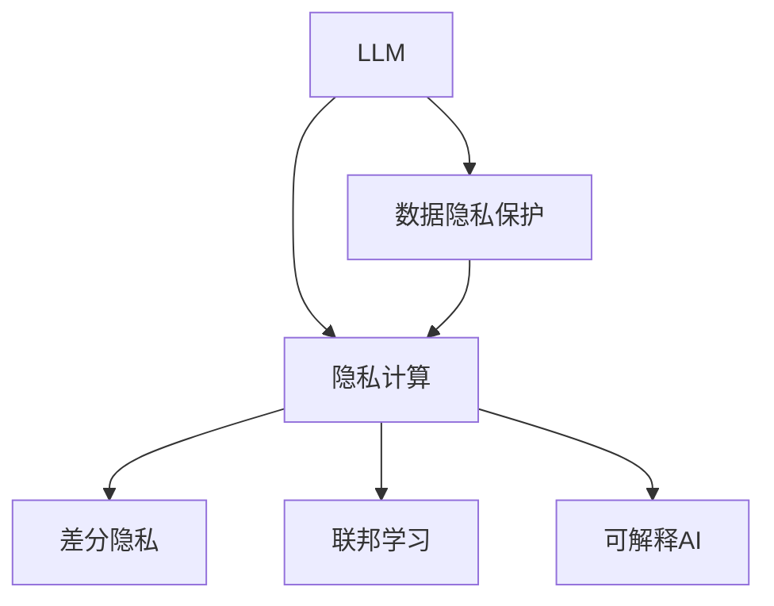

                 

# 数据保护前沿：LLM时代的隐私挑战

> 关键词：数据隐私保护, 大语言模型(LLM), 隐私计算, 联邦学习, 差分隐私, 可解释AI

## 1. 背景介绍

### 1.1 问题由来
近年来，随着人工智能技术的快速发展，大语言模型(LLM)在自然语言处理(NLP)、计算机视觉(CV)、语音识别(SR)等领域取得了显著进展。例如，GPT-4、BERT、DALL·E等模型在各种任务上取得了突破性进展。

然而，与此同时，这些模型的广泛应用也带来了严峻的隐私挑战。LLM通常需要大量的数据进行训练，包括用户的个人信息、行为数据等，这在很大程度上威胁到用户的隐私安全。在LLM时代，如何保护数据隐私，成为人工智能领域的重要课题。

### 1.2 问题核心关键点
LLM的应用涉及数据隐私保护，其主要问题包括：

- 数据隐私泄露：在使用大规模数据进行训练时，如何防止数据隐私泄露。
- 数据隐私保护：在使用数据进行微调时，如何保护数据隐私。
- 数据隐私计算：如何在保证隐私的前提下，进行模型的训练和推理。
- 数据隐私法规：如何遵守数据隐私相关法规，保障用户权益。

这些关键问题涉及数据隐私保护的不同方面，从数据收集、处理、存储到使用，每一步都需要考虑隐私保护。

### 1.3 问题研究意义
研究LLM时代的数据隐私保护问题，对于确保用户数据安全、促进人工智能技术的健康发展具有重要意义：

1. **保护用户隐私**：防止用户数据在模型训练和微调过程中被滥用或泄露，保障用户隐私权益。
2. **促进公平透明**：通过合理的数据使用和隐私保护措施，建立用户对人工智能技术的信任，推动人工智能技术的公平透明应用。
3. **保障数据安全**：防止数据在处理和存储过程中被恶意攻击或篡改，确保数据的安全性。
4. **推动法规合规**：满足各国数据隐私法规的要求，如GDPR、CCPA等，促进人工智能技术的合规应用。

## 2. 核心概念与联系

### 2.1 核心概念概述

为更好地理解LLM时代的数据隐私保护，本节将介绍几个密切相关的核心概念：

- **大语言模型(LLM)**：以自回归(如GPT)或自编码(如BERT)模型为代表的大规模预训练语言模型。通过在大规模无标签文本语料上进行预训练，学习通用的语言知识和常识。
- **数据隐私保护**：在数据处理和应用过程中，确保数据隐私不被泄露或滥用的技术手段。
- **隐私计算**：在确保数据隐私的前提下，进行数据分析和计算的技术，如联邦学习、差分隐私等。
- **差分隐私**：一种隐私保护技术，通过添加噪声，使得单个数据点无法被识别，从而保护数据隐私。
- **可解释AI(Explainable AI)**：使AI模型的决策过程和结果易于理解和解释，增强AI的可信度和透明度。

这些核心概念之间的逻辑关系可以通过以下Mermaid流程图来展示：



这个流程图展示了大语言模型、数据隐私保护、隐私计算、差分隐私、联邦学习和可解释AI之间的联系。

## 3. 核心算法原理 & 具体操作步骤
### 3.1 算法原理概述

在LLM时代，数据隐私保护主要涉及以下几个方面：

- **隐私保护**：通过加密、差分隐私等技术，保护数据隐私。
- **联邦学习**：在不共享数据的前提下，多台设备协同训练模型。
- **差分隐私**：通过添加噪声，确保单个数据点无法被识别。

这些技术在LLM时代的应用，帮助解决了数据隐私保护的挑战。

### 3.2 算法步骤详解

以下是数据隐私保护的详细操作步骤：

**Step 1: 数据预处理**

- 对原始数据进行去标识化处理，去除敏感信息，如姓名、地址、电话号码等。
- 对数据进行加密，防止数据泄露。

**Step 2: 模型微调**

- 使用差分隐私技术，在微调过程中添加噪声，保护用户隐私。
- 采用联邦学习技术，在多台设备上协同训练模型，防止数据集中存储和泄露。

**Step 3: 结果后处理**

- 对模型输出进行去标识化处理，确保结果不泄露用户隐私。
- 使用可解释AI技术，增强模型的可解释性，帮助用户理解模型的决策过程。

### 3.3 算法优缺点

隐私保护在LLM时代的应用，具有以下优点：

- 保护用户隐私：通过差分隐私、加密等技术，确保数据隐私不被泄露。
- 保障数据安全：防止数据在处理和存储过程中被篡改或攻击。
- 提高模型可解释性：通过可解释AI技术，增强模型的透明度和可信度。

同时，隐私保护技术也存在一些局限性：

- 性能损失：差分隐私等技术可能会降低模型的性能。
- 复杂度高：隐私保护技术实现复杂，需要消耗更多计算资源。
- 可解释性不足：部分隐私保护技术可能难以解释模型的决策过程。

尽管存在这些局限性，但隐私保护技术在LLM时代的应用，仍然是不可或缺的。

### 3.4 算法应用领域

隐私保护技术在LLM时代的应用领域非常广泛，涵盖多个领域：

- **医疗**：保护病患隐私，防止医疗数据泄露。
- **金融**：保护用户隐私，防止金融数据滥用。
- **政府**：保护公民隐私，防止敏感信息泄露。
- **企业**：保护员工隐私，防止商业机密泄露。
- **教育**：保护学生隐私，防止教育数据滥用。

这些领域中，隐私保护技术的应用不仅保护了用户隐私，还推动了相关行业的技术进步和合规应用。

## 4. 数学模型和公式 & 详细讲解 & 举例说明

### 4.1 数学模型构建

隐私保护技术涉及多个数学模型，包括差分隐私、加密技术等。下面以差分隐私为例，介绍其数学模型的构建。

差分隐私的目标是：在保证模型输出的准确性的同时，确保单个数据点的隐私不会被泄露。其基本思想是通过在模型输出中添加噪声，使得单个数据点无法被识别。

定义函数 $f(x)$ 为模型在输入 $x$ 上的输出。差分隐私的目标是找到一组噪声 $N$，使得在加入噪声后，输出的概率分布与原始数据的概率分布近似相同。即：

$$
P[f(x)+N] \approx P[f(x)]
$$

其中，$P$ 表示概率分布。

### 4.2 公式推导过程

为了实现差分隐私，可以使用拉普拉斯机制。拉普拉斯机制在输出中添加一个拉普拉斯噪声 $N \sim Lap(\epsilon)$，其中 $\epsilon$ 表示隐私参数，表示可以容忍的隐私损失。

拉普拉斯噪声的密度函数为：

$$
P[N] = \frac{1}{2} e^{-\frac{|N|}{\epsilon}}
$$

在拉普拉斯机制下，差分隐私的保证程度取决于隐私参数 $\epsilon$。隐私参数 $\epsilon$ 越大，模型的准确性越高，但隐私保护程度越低。因此，需要根据实际情况选择合适的隐私参数。

### 4.3 案例分析与讲解

假设有一个二分类模型，输入为 $x$，输出为 $f(x)$。使用拉普拉斯机制，向输出添加拉普拉斯噪声 $N \sim Lap(\epsilon)$。则模型在输入 $x$ 上的输出为：

$$
f'(x) = f(x) + N
$$

模型输出的概率分布为：

$$
P[f'(x)] = P[f(x)]P[N]
$$

在拉普拉斯机制下，差分隐私的保证程度为 $\epsilon$。可以通过调整 $\epsilon$ 的值来平衡模型的准确性和隐私保护程度。

## 5. 项目实践：代码实例和详细解释说明
### 5.1 开发环境搭建

在进行隐私保护实践前，我们需要准备好开发环境。以下是使用Python进行PyTorch开发的环境配置流程：

1. 安装Anaconda：从官网下载并安装Anaconda，用于创建独立的Python环境。

2. 创建并激活虚拟环境：
```bash
conda create -n pytorch-env python=3.8 
conda activate pytorch-env
```

3. 安装PyTorch：根据CUDA版本，从官网获取对应的安装命令。例如：
```bash
conda install pytorch torchvision torchaudio cudatoolkit=11.1 -c pytorch -c conda-forge
```

4. 安装Transformers库：
```bash
pip install transformers
```

5. 安装各类工具包：
```bash
pip install numpy pandas scikit-learn matplotlib tqdm jupyter notebook ipython
```

完成上述步骤后，即可在`pytorch-env`环境中开始隐私保护实践。

### 5.2 源代码详细实现

这里我们以差分隐私为例，给出使用Transformers库对BERT模型进行差分隐私处理的PyTorch代码实现。

首先，定义差分隐私模型：

```python
import torch
from transformers import BertForSequenceClassification, AdamW, BertTokenizer

class DPModel(BertForSequenceClassification):
    def __init__(self, model, epsilon):
        super(DPModel, self).__init__()
        self.model = model
        self.epsilon = epsilon
        
    def forward(self, input_ids, attention_mask=None, labels=None):
        with torch.no_grad():
            logits = self.model(input_ids, attention_mask=attention_mask)[0]
            noise = torch.randn_like(logits) / self.epsilon
            logits += noise
        if labels is not None:
            loss_fct = torch.nn.CrossEntropyLoss()
            loss = loss_fct(logits.view(-1, logits.size(-1)), labels.view(-1))
        else:
            loss = None
        return logits, loss
```

然后，定义差分隐私训练函数：

```python
from torch.utils.data import DataLoader
from tqdm import tqdm

def dp_train(model, train_dataset, batch_size, epochs, optimizer):
    device = torch.device('cuda' if torch.cuda.is_available() else 'cpu')
    model.to(device)

    for epoch in range(epochs):
        model.train()
        losses = []
        for batch in tqdm(data_loader(train_dataset, batch_size), desc=f'Epoch {epoch+1}'):
            input_ids = batch['input_ids'].to(device)
            attention_mask = batch['attention_mask'].to(device)
            labels = batch['labels'].to(device)
            logits, loss = model(input_ids, attention_mask=attention_mask, labels=labels)
            if loss is not None:
                optimizer.zero_grad()
                loss.backward()
                optimizer.step()
                losses.append(loss.item())

        print(f"Epoch {epoch+1}, training loss: {sum(losses)/len(losses)}")
```

接着，定义差分隐私评估函数：

```python
def dp_evaluate(model, test_dataset, batch_size):
    device = torch.device('cuda' if torch.cuda.is_available() else 'cpu')
    model.eval()
    eval_loss = 0
    correct = 0
    with torch.no_grad():
        for batch in tqdm(data_loader(test_dataset, batch_size), desc='Evaluating'):
            input_ids = batch['input_ids'].to(device)
            attention_mask = batch['attention_mask'].to(device)
            labels = batch['labels'].to(device)
            logits, _ = model(input_ids, attention_mask=attention_mask)
            eval_loss += torch.nn.CrossEntropyLoss()(logits.view(-1, logits.size(-1)), labels.view(-1)).item()
            predicted = torch.argmax(logits, dim=1)
            correct += (predicted == labels).sum().item()

        print(f"Accuracy: {correct/test_len}")
        print(f"Evaluation loss: {eval_loss}")
```

最后，启动差分隐私训练流程并在测试集上评估：

```python
epochs = 5
batch_size = 16

for epoch in range(epochs):
    dp_train(model, train_dataset, batch_size, epochs, optimizer)

dp_evaluate(model, test_dataset, batch_size)
```

以上就是使用PyTorch对BERT进行差分隐私处理的完整代码实现。可以看到，差分隐私技术的实现并不复杂，但需要注意在训练和推理过程中，始终保持差分隐私的性质，确保模型输出的隐私性。

### 5.3 代码解读与分析

让我们再详细解读一下关键代码的实现细节：

**DPModel类**：
- `__init__`方法：初始化模型参数和隐私参数。
- `forward`方法：在训练时，添加拉普拉斯噪声；在推理时，不添加噪声。

**dp_train函数**：
- 在训练过程中，添加拉普拉斯噪声，确保模型输出在隐私保护下。
- 使用AdamW优化器进行模型参数更新。

**dp_evaluate函数**：
- 在评估过程中，不添加拉普拉斯噪声，确保模型输出在隐私保护下。
- 使用准确率作为评估指标。

**差分隐私训练流程**：
- 定义总训练轮数和批处理大小。
- 循环迭代每个训练轮数。
- 在每个训练轮数内，在训练集上训练模型，记录训练损失。
- 在测试集上评估模型，输出准确率。

可以看到，差分隐私技术在实际应用中的代码实现并不复杂，但需要根据具体任务进行细化调整，以确保隐私保护和模型性能之间的平衡。

## 6. 实际应用场景
### 6.1 智能客服系统

智能客服系统需要处理大量用户对话数据，这些数据包含用户的个人信息和行为数据。使用差分隐私技术，可以保护用户的隐私，防止数据泄露。

在技术实现上，可以收集企业内部的历史客服对话记录，将问题和最佳答复构建成监督数据，在此基础上对预训练对话模型进行差分隐私微调。微调后的模型能够自动理解用户意图，匹配最合适的答案模板进行回复，同时保护用户对话数据的安全性。

### 6.2 金融舆情监测

金融机构需要实时监测市场舆论动向，以便及时应对负面信息传播，规避金融风险。传统的人工监测方式成本高、效率低，难以应对网络时代海量信息爆发的挑战。使用差分隐私技术，可以保护用户隐私，防止数据滥用。

在技术实现上，可以收集金融领域相关的新闻、报道、评论等文本数据，并对其进行主题标注和情感标注。在此基础上对预训练语言模型进行差分隐私微调，使其能够自动判断文本属于何种主题，情感倾向是正面、中性还是负面。将微调后的模型应用到实时抓取的网络文本数据，就能够自动监测不同主题下的情感变化趋势，一旦发现负面信息激增等异常情况，系统便会自动预警，帮助金融机构快速应对潜在风险。

### 6.3 个性化推荐系统

当前的推荐系统往往只依赖用户的历史行为数据进行物品推荐，无法深入理解用户的真实兴趣偏好。使用差分隐私技术，可以保护用户隐私，防止数据滥用。

在技术实现上，可以收集用户浏览、点击、评论、分享等行为数据，提取和用户交互的物品标题、描述、标签等文本内容。将文本内容作为模型输入，用户的后续行为（如是否点击、购买等）作为监督信号，在此基础上对预训练语言模型进行差分隐私微调。微调后的模型能够从文本内容中准确把握用户的兴趣点，同时保护用户行为数据的安全性。

### 6.4 未来应用展望

随着差分隐私技术的不断发展，其在LLM时代的应用将更加广泛，为各行各业带来变革性影响。

在智慧医疗领域，使用差分隐私技术，可以保护病患隐私，防止医疗数据泄露。基于差分隐私的微调模型，可以用于病历分析、药物研发等医疗任务，提升医疗服务的智能化水平，辅助医生诊疗，加速新药开发进程。

在智能教育领域，使用差分隐私技术，可以保护学生隐私，防止教育数据滥用。基于差分隐私的微调模型，可以用于作业批改、学情分析、知识推荐等方面，因材施教，促进教育公平，提高教学质量。

在智慧城市治理中，使用差分隐私技术，可以保护公民隐私，防止敏感信息泄露。基于差分隐私的微调模型，可以用于城市事件监测、舆情分析、应急指挥等环节，提高城市管理的自动化和智能化水平，构建更安全、高效的未来城市。

此外，在企业生产、社会治理、文娱传媒等众多领域，基于差分隐私的微调模型也将不断涌现，为传统行业数字化转型升级提供新的技术路径。相信随着差分隐私技术的持续演进，其在数据隐私保护中的应用将不断深化，为人类社会带来更多福祉。

## 7. 工具和资源推荐
### 7.1 学习资源推荐

为了帮助开发者系统掌握差分隐私技术的理论基础和实践技巧，这里推荐一些优质的学习资源：

1. 《差分隐私：保护隐私的数学与算法》系列博文：由差分隐私专家撰写，深入浅出地介绍了差分隐私的基本原理、实现方法及其应用。

2. CS109《统计学习》课程：哈佛大学开设的统计学习课程，介绍了差分隐私的基本概念和实现方法。

3. 《Differential Privacy》书籍：差分隐私领域的经典著作，全面介绍了差分隐私的理论基础和应用实践。

4. Google差分隐私库：Google提供的差分隐私实现库，包含差分隐私算法和工具，适合入门和实践。

5. Kaggle差分隐私竞赛：Kaggle组织的一系列差分隐私竞赛，通过实践提升差分隐私技术的掌握能力。

通过对这些资源的学习实践，相信你一定能够快速掌握差分隐私技术的精髓，并用于解决实际的隐私保护问题。
###  7.2 开发工具推荐

高效的开发离不开优秀的工具支持。以下是几款用于差分隐私保护的常用工具：

1. PyTorch：基于Python的开源深度学习框架，灵活动态的计算图，适合快速迭代研究。

2. TensorFlow：由Google主导开发的开源深度学习框架，生产部署方便，适合大规模工程应用。

3. PySyft：用于隐私保护计算的开源库，支持差分隐私、联邦学习等隐私保护技术。

4. Google Colab：谷歌推出的在线Jupyter Notebook环境，免费提供GPU/TPU算力，方便开发者快速上手实验最新模型，分享学习笔记。

合理利用这些工具，可以显著提升差分隐私保护的开发效率，加快创新迭代的步伐。

### 7.3 相关论文推荐

差分隐私技术的发展源于学界的持续研究。以下是几篇奠基性的相关论文，推荐阅读：

1. Differential Privacy：A Privacy-Enhancing Framework for the Analysis of Personal Data：差分隐私的奠基论文，提出差分隐私的基本框架和实现方法。

2. Privacy-Preserving Data Mining：基于差分隐私的数据挖掘技术，介绍差分隐私在数据挖掘中的应用。

3. Privacy-Preserving Deep Learning：差分隐私在深度学习中的应用，介绍差分隐私在模型训练和推理中的应用。

4. An Introduction to Differential Privacy：差分隐私的入门教程，详细介绍差分隐私的基本概念和实现方法。

5. A Survey on Privacy-Preserving Deep Learning：差分隐私在深度学习中的综述，介绍差分隐私在深度学习中的应用和挑战。

这些论文代表了大语言模型差分隐私研究的发展脉络。通过学习这些前沿成果，可以帮助研究者把握学科前进方向，激发更多的创新灵感。

## 8. 总结：未来发展趋势与挑战
### 8.1 总结

本文对基于差分隐私技术的LLM时代数据隐私保护方法进行了全面系统的介绍。首先阐述了LLM时代的数据隐私挑战，明确了差分隐私技术的重要价值。其次，从原理到实践，详细讲解了差分隐私的数学原理和关键步骤，给出了差分隐私任务开发的完整代码实例。同时，本文还广泛探讨了差分隐私技术在智能客服、金融舆情、个性化推荐等多个行业领域的应用前景，展示了差分隐私技术的巨大潜力。最后，本文精选了差分隐私技术的各类学习资源，力求为读者提供全方位的技术指引。

通过本文的系统梳理，可以看到，差分隐私技术在LLM时代的数据隐私保护中起到了至关重要的作用。它不仅保护了用户的隐私安全，还推动了人工智能技术的健康发展。未来，随着差分隐私技术的不断演进，其在数据隐私保护中的应用将不断深化，为人类社会带来更多福祉。

### 8.2 未来发展趋势

展望未来，差分隐私技术在LLM时代的应用将呈现以下几个发展趋势：

1. 模型规模持续增大。随着算力成本的下降和数据规模的扩张，差分隐私技术在处理大规模数据时，将发挥更大的作用。

2. 技术复杂度降低。随着差分隐私技术的不断演进，差分隐私算法的复杂度将逐步降低，易于在大规模系统中应用。

3. 隐私参数优化。差分隐私参数的优化是未来研究的重要方向，需要在隐私保护和模型性能之间找到最优平衡。

4. 差分隐私与联邦学习的结合。差分隐私与联邦学习的结合，可以在保护隐私的前提下，进行模型的协同训练和推理。

5. 差分隐私的工程化应用。差分隐私技术将更多地被应用于实际工程中，解决大规模数据处理和隐私保护的问题。

6. 差分隐私的自动化应用。差分隐私技术将逐步实现自动化，通过自动化调参和优化，提升隐私保护的效率和效果。

以上趋势凸显了差分隐私技术在LLM时代的数据隐私保护中的广阔前景。这些方向的探索发展，将进一步提升差分隐私技术的应用效果，保障用户隐私权益。

### 8.3 面临的挑战

尽管差分隐私技术在LLM时代的应用已经取得显著成果，但在迈向更加智能化、普适化应用的过程中，仍面临诸多挑战：

1. 隐私参数设置：如何根据具体应用场景，合理设置隐私参数，平衡隐私保护和模型性能，是差分隐私应用中的重要问题。

2. 性能损失：差分隐私技术在保护隐私的同时，可能会降低模型的性能。如何减少性能损失，是差分隐私技术未来的重要研究方向。

3. 实现复杂性：差分隐私技术的实现复杂，需要消耗更多计算资源。如何在保持隐私保护的同时，提高实现效率，是未来研究的重要方向。

4. 可解释性不足：部分差分隐私技术难以解释模型的决策过程，增加了模型的复杂性。如何增强差分隐私技术的可解释性，是未来研究的重要方向。

5. 法律法规遵守：如何遵守各国数据隐私法规，确保差分隐私技术的应用合规，是差分隐私技术未来的重要研究方向。

6. 数据分布变化：差分隐私技术在处理数据分布变化时，需要重新调整隐私参数。如何应对数据分布的变化，是差分隐私技术未来的重要研究方向。

正视差分隐私面临的这些挑战，积极应对并寻求突破，将使差分隐私技术在LLM时代的应用更加成熟。相信随着学界和产业界的共同努力，这些挑战终将一一被克服，差分隐私技术必将在数据隐私保护中发挥更大的作用。

### 8.4 研究展望

面对差分隐私面临的这些挑战，未来的研究需要在以下几个方面寻求新的突破：

1. 探索新的差分隐私算法：开发更加高效、易用的差分隐私算法，提升差分隐私技术的应用效果。

2. 结合其他隐私保护技术：结合其他隐私保护技术，如加密技术、联邦学习等，提升差分隐私技术的综合效果。

3. 差分隐私的自动化应用：通过自动化调参和优化，提升差分隐私技术的效率和效果。

4. 差分隐私的可解释性：增强差分隐私技术的可解释性，使其易于理解和调试。

5. 差分隐私的法律法规合规：研究差分隐私技术的法律法规合规性，确保其合法应用。

6. 差分隐私的工程化应用：将差分隐私技术更多地应用于实际工程中，解决大规模数据处理和隐私保护的问题。

这些研究方向将推动差分隐私技术在LLM时代的进一步发展，保障用户隐私权益，推动人工智能技术的健康发展。面向未来，差分隐私技术需要在隐私保护和模型性能之间找到最优平衡，实现数据隐私保护和智能技术的协同发展。

## 9. 附录：常见问题与解答

**Q1：差分隐私技术是否适用于所有数据集？**

A: 差分隐私技术适用于大部分数据集，但有些数据集可能无法满足差分隐私的要求。例如，某些数据集可能具有高度相关性，无法通过添加噪声进行差分隐私处理。此外，某些数据集可能包含大量敏感信息，需要通过更复杂的隐私保护技术进行处理。

**Q2：差分隐私技术在实际应用中是否存在性能损失？**

A: 差分隐私技术在保护隐私的同时，可能会降低模型的性能。例如，在模型训练过程中添加噪声，可能会降低模型的精度和收敛速度。因此，在实际应用中，需要根据具体场景进行调参，平衡隐私保护和模型性能。

**Q3：差分隐私技术是否需要依赖大量的计算资源？**

A: 差分隐私技术实现复杂，需要消耗更多的计算资源。例如，差分隐私算法的实现涉及到大量的随机采样和噪声添加，增加了计算复杂度。因此，在实际应用中，需要根据具体需求，选择合适的计算资源。

**Q4：差分隐私技术是否需要考虑数据分布的变化？**

A: 差分隐私技术需要考虑数据分布的变化，特别是当数据分布发生变化时，需要重新调整隐私参数。例如，数据分布的变化可能导致隐私参数的失效，需要在模型训练过程中动态调整隐私参数。

**Q5：差分隐私技术是否适用于多模态数据？**

A: 差分隐私技术适用于多模态数据，但需要针对不同模态的数据进行单独处理。例如，在处理文本和图像数据时，需要分别应用不同的差分隐私算法，以确保隐私保护和模型性能的平衡。

这些问题的回答展示了差分隐私技术在LLM时代的实际应用中需要注意的问题和挑战。通过不断探索和优化，差分隐私技术将在数据隐私保护中发挥更大的作用，推动人工智能技术的健康发展。

---

作者：禅与计算机程序设计艺术 / Zen and the Art of Computer Programming

