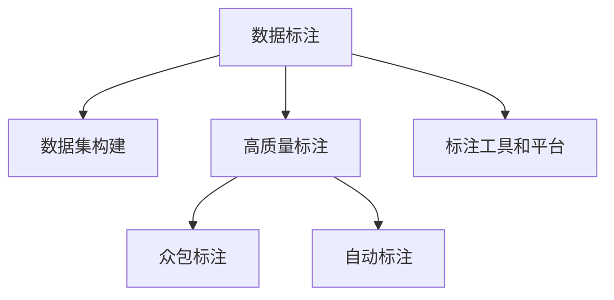

                 

# 数据标注：人工智能发展背后的幕后功臣

> 关键词：数据标注,人工智能,机器学习,深度学习,自然语言处理(NLP),计算机视觉(CV),数据集构建,高质量标注,标注工具,标注平台,众包标注,自动标注

## 1. 背景介绍

### 1.1 问题由来
人工智能（AI）技术正在以惊人的速度改变着我们的世界。从自然语言处理(NLP)到计算机视觉(CV)，从自动驾驶到智能家居，AI无处不在。然而，许多人可能不知道，每当我们使用AI技术时，背后都有一群默默付出的人——数据标注师。数据标注在AI技术的发展中扮演着至关重要的角色，但往往被大众所忽视。

### 1.2 问题核心关键点
数据标注的核心关键点在于其对AI模型训练的影响。在AI模型的训练过程中，数据标注的质量直接影响模型的性能和泛化能力。高质量的数据标注可以帮助AI模型更准确地学习到数据中的模式，从而提高模型的预测准确性和鲁棒性。而低质量或错误的标注数据则可能导致模型性能下降，甚至产生误导性的结果。

## 2. 核心概念与联系

### 2.1 核心概念概述

为了更好地理解数据标注在AI发展中的作用，本节将介绍几个关键的概念：

- **数据标注**：指通过人工或自动方式，为原始数据添加标签或注释的过程。在AI领域，数据标注通常涉及为图像、文本、语音等数据添加标注信息，以便模型学习这些数据的特征。
- **数据集构建**：从原始数据中筛选、清洗、标注和组织数据，构建适合AI模型训练和评估的数据集。高质量的数据集是AI模型训练的前提。
- **高质量标注**：指通过专业知识和技能，确保标注数据的一致性、准确性和完整性。高质量标注能显著提升AI模型的表现。
- **标注工具和平台**：用于数据标注的软件和平台，如Labelbox、VLabel、Qualtrics等，辅助标注师高效完成标注任务。
- **众包标注**：通过网络平台，将数据标注任务分发给大量标注师，以降低成本，提高标注速度。
- **自动标注**：利用AI技术，如计算机视觉、自然语言处理等，自动为数据添加标签，减少人工标注的劳动量和成本。

这些核心概念之间的逻辑关系可以通过以下Mermaid流程图来展示：



这个流程图展示了数据标注的关键步骤和流程：

1. 数据标注是数据集构建的基础。
2. 高质量标注能显著提升模型性能。
3. 标注工具和平台辅助标注过程，提高效率。
4. 众包标注降低成本，提高速度。
5. 自动标注减少人工标注，提高效率。

## 3. 核心算法原理 & 具体操作步骤
### 3.1 算法原理概述

在AI模型训练过程中，数据标注的作用在于为模型提供真实世界的信息和标签。数据标注的本质是给模型提供正确的输入输出对，使得模型能够学习到数据的特征和规律，从而进行准确的预测。

### 3.2 算法步骤详解

以下步骤详细描述了数据标注在AI模型训练中的具体流程：

**Step 1: 数据收集与预处理**

- 收集原始数据，包括图像、文本、音频等。
- 进行数据预处理，如去噪、裁剪、归一化等，以提高数据质量。

**Step 2: 标注设计**

- 设计标注模板和标准，确保标注一致性和准确性。
- 选择合适的标注方式，如众包标注、自动标注等。

**Step 3: 标注实施**

- 选择标注工具和平台，如Labelbox、VLabel等。
- 将数据分发给标注师，并设置标注规则和要求。
- 监督标注过程，确保标注质量。

**Step 4: 标注审核与修正**

- 对标注结果进行审核，检查标注一致性和准确性。
- 修正错误或不一致的标注，确保标注质量。

**Step 5: 模型训练**

- 使用标注后的数据集训练AI模型。
- 根据模型表现调整训练参数和策略。

**Step 6: 模型评估与优化**

- 使用验证集评估模型性能。
- 根据评估结果优化模型和标注策略。

### 3.3 算法优缺点

数据标注在AI模型训练中具有以下优点：

- **提高模型性能**：高质量的数据标注能显著提升AI模型的准确性和鲁棒性。
- **加速模型开发**：标注工具和平台提高了标注效率，加速了模型开发和训练过程。
- **降低成本**：众包标注和自动标注降低了人工标注的成本和时间。

同时，数据标注也存在一些缺点：

- **标注成本高**：高质量标注需要专业知识和技能，标注成本较高。
- **标注一致性难以保证**：众包标注和自动标注可能存在标注不一致的问题，影响标注质量。
- **数据隐私问题**：标注过程中可能涉及个人隐私数据，需要采取保护措施。

### 3.4 算法应用领域

数据标注在AI模型训练中的应用非常广泛，涵盖NLP、CV、音频处理等多个领域，具体应用场景包括：

- **自然语言处理(NLP)**：标注文本中的实体、关系、情感等，用于命名实体识别(NER)、关系抽取(RE)、情感分析等任务。
- **计算机视觉(CV)**：标注图像中的目标、类别、位置等，用于目标检测、图像分类、实例分割等任务。
- **语音处理**：标注音频中的语音内容、情感、说话人等，用于语音识别、情感分析、说话人识别等任务。
- **医疗诊断**：标注医学图像和病例文本，用于疾病诊断、医学知识图谱构建等任务。
- **金融分析**：标注金融数据和报告文本，用于风险评估、投资分析等任务。
- **智能客服**：标注用户对话记录，用于对话生成、意图识别等任务。

## 4. 数学模型和公式 & 详细讲解  
### 4.1 数学模型构建

在AI模型训练中，数据标注的质量直接影响模型性能。高质量的数据标注能够提高模型在特定任务上的表现。因此，构建高质量的数据集和标注数据至关重要。

### 4.2 公式推导过程

为了更好地理解数据标注对模型性能的影响，我们以NLP中的命名实体识别(NER)任务为例，推导其数学模型和损失函数。

假设我们有一个标注好的数据集 $D=\{(x_i,y_i)\}_{i=1}^N$，其中 $x_i$ 为输入文本，$y_i$ 为对应的实体标签序列。我们的目标是通过训练，使得模型能够准确地识别文本中的实体。

**Step 1: 模型构建**

- 定义模型 $M_{\theta}$，其中 $\theta$ 为模型参数。
- 定义标注函数 $f_{\theta}(x_i)$，将文本输入到模型中，输出实体的预测标签。

**Step 2: 损失函数设计**

- 定义交叉熵损失函数 $\mathcal{L}(\theta) = -\frac{1}{N}\sum_{i=1}^N \sum_{j=1}^{|y_i|} \log(f_{\theta}(x_i)[j])$，其中 $|y_i|$ 为标签序列的长度。
- 使用反向传播算法计算损失函数的梯度，更新模型参数。

**Step 3: 训练与评估**

- 在训练集上训练模型，最小化损失函数。
- 在验证集和测试集上评估模型性能。

### 4.3 案例分析与讲解

以一个简单的NER任务为例，假设我们有一个包含三个实体的文本："John lives in New York and works at Google."。标注后的数据集为：

- $x_1$: "John lives in New York and works at Google."
- $y_1$: ["B-PER", "B-LOC", "B-LOC", "I-PER", "B-ORG", "I-LOC"]

我们的模型预测输出为：

- $f_{\theta}(x_1) = ["B-PER", "B-LOC", "I-LOC", "I-PER", "B-ORG", "I-LOC"]

计算损失函数 $\mathcal{L}(\theta)$：

$$
\mathcal{L}(\theta) = -\frac{1}{6}\sum_{j=1}^6 \log(f_{\theta}(x_1)[j])
$$

根据损失函数梯度，更新模型参数，优化模型性能。

## 5. 项目实践：代码实例和详细解释说明
### 5.1 开发环境搭建

在进行数据标注实践前，我们需要准备好开发环境。以下是使用Python进行PyTorch开发的环境配置流程：

1. 安装Anaconda：从官网下载并安装Anaconda，用于创建独立的Python环境。

2. 创建并激活虚拟环境：
```bash
conda create -n pytorch-env python=3.8 
conda activate pytorch-env
```

3. 安装PyTorch：根据CUDA版本，从官网获取对应的安装命令。例如：
```bash
conda install pytorch torchvision torchaudio cudatoolkit=11.1 -c pytorch -c conda-forge
```

4. 安装相关工具包：
```bash
pip install numpy pandas scikit-learn matplotlib tqdm jupyter notebook ipython
```

完成上述步骤后，即可在`pytorch-env`环境中开始数据标注实践。

### 5.2 源代码详细实现

下面我们以命名实体识别(NER)任务为例，给出使用Transformers库进行数据标注的PyTorch代码实现。

首先，定义NER任务的标注模板和标准：

```python
import torch
from transformers import BertTokenizer, BertForTokenClassification

tag2id = {"O": 0, "B-PER": 1, "I-PER": 2, "B-LOC": 3, "I-LOC": 4, "B-ORG": 5, "I-ORG": 6}

id2tag = {v: k for k, v in tag2id.items()}

# 加载预训练模型和分词器
model = BertForTokenClassification.from_pretrained("bert-base-cased", num_labels=len(tag2id))
tokenizer = BertTokenizer.from_pretrained("bert-base-cased")

# 定义标注模板
def build_label(template):
    label = []
    for char in template:
        if char.isupper():
            label.append("B-")
        elif char == "-":
            label.append("I-")
        else:
            label.append("O")
    return label

# 定义标注函数
def annotate(text):
    encoded = tokenizer(text, return_tensors="pt", max_length=128, padding="max_length", truncation=True)
    input_ids = encoded["input_ids"][0]
    attention_mask = encoded["attention_mask"][0]
    labels = build_label(text)
    return {"input_ids": input_ids, 
            "attention_mask": attention_mask,
            "labels": torch.tensor(labels, dtype=torch.long)}
```

然后，使用Labelbox进行标注：

```python
import labelbox as lb

# 创建Labelbox项目
project = lb.create("NER Annotator", description="Annotate text for named entity recognition")

# 定义标注函数
def annotate_callback(sample, interaction):
    data = {"text": sample["text"]}
    label = [sample["entity"]]
    data["labels"] = label
    interaction.add_data(data)
    interaction.add_label(data)

# 标注训练集
train_dataset = lb.load(project.train(), callback=annotate_callback)
train_loader = torch.utils.data.DataLoader(train_dataset, batch_size=8)

# 训练模型
model.train()
for batch in tqdm(train_loader):
    input_ids = batch["input_ids"].to(device)
    attention_mask = batch["attention_mask"].to(device)
    labels = batch["labels"].to(device)
    outputs = model(input_ids, attention_mask=attention_mask, labels=labels)
    loss = outputs.loss
    loss.backward()
    optimizer.step()

# 评估模型
model.eval()
with torch.no_grad():
    for batch in test_loader:
        input_ids = batch["input_ids"].to(device)
        attention_mask = batch["attention_mask"].to(device)
        outputs = model(input_ids, attention_mask=attention_mask)
        predictions = torch.argmax(outputs.logits, dim=2)
        for pred, label in zip(predictions[0], batch["labels"]):
            print(f"Predicted: {id2tag[pred.item()]} | Ground Truth: {id2tag[label.item()]}")
```

以上就是使用PyTorch和Labelbox进行命名实体识别任务标注的完整代码实现。可以看到，使用Labelbox等标注工具，可以大大提高标注的效率和准确性。

### 5.3 代码解读与分析

让我们再详细解读一下关键代码的实现细节：

**NER标注模板**：
- 定义了实体标签的编码规则，包括B开头的起始标签、I开头的中间标签和O开头的结束标签。

**标注函数**：
- 将文本按照实体边界拆分成多个字符，并按照实体类型编码。
- 将编码后的标签转换为Tensor，供模型训练使用。

**训练和评估过程**：
- 使用Labelbox加载标注数据集，构建PyTorch DataLoader。
- 在训练集上训练模型，最小化损失函数。
- 在测试集上评估模型性能，输出预测结果和真实标签。

## 6. 实际应用场景
### 6.1 智能客服系统

基于数据标注的智能客服系统可以帮助企业大幅提高客户服务质量。传统客服系统需要大量人工参与，无法24小时在线，且响应速度较慢。使用数据标注构建的智能客服系统，可以自动理解客户需求，快速生成回复，提高客户满意度。

### 6.2 金融舆情监测

金融行业需要实时监测市场舆情，以规避风险。通过数据标注构建的舆情监测系统，可以自动识别新闻、评论等文本中的负面信息，及时预警，帮助金融企业做出快速决策。

### 6.3 个性化推荐系统

推荐系统需要大量高质量标注数据，用于训练推荐模型。使用数据标注构建的个性化推荐系统，可以更好地理解用户兴趣，提供更精准、多样化的推荐内容。

### 6.4 未来应用展望

随着数据标注技术的不断进步，其在AI模型训练中的应用将更加广泛。未来，数据标注将更好地结合AI技术和多模态数据，提升AI模型的性能和适应性。同时，数据标注也将更加注重数据隐私和伦理道德，保障标注过程的公正透明。

## 7. 工具和资源推荐
### 7.1 学习资源推荐

为了帮助开发者系统掌握数据标注的理论基础和实践技巧，这里推荐一些优质的学习资源：

1. 《数据标注的艺术》系列博文：由数据标注领域专家撰写，深入浅出地介绍了数据标注的基本概念和最佳实践。

2. Labelbox官方文档：Labelbox的官方文档，提供了详尽的使用指南和示例，是进行数据标注的必备资料。

3. CrowdFlower博客：CrowdFlower的博客，分享了数据标注行业的最新动态和实践经验，值得学习和参考。

4. Kaggle数据集：Kaggle提供了大量高质量的数据标注任务，帮助开发者提高标注技能。

5. Coursera数据标注课程：Coursera上的数据标注课程，系统讲解了数据标注的理论和实践，适合初学者和进阶学习。

通过对这些资源的学习实践，相信你一定能够快速掌握数据标注的精髓，并用于解决实际的AI问题。

### 7.2 开发工具推荐

高效的开发离不开优秀的工具支持。以下是几款用于数据标注开发的常用工具：

1. Labelbox：提供云端标注平台，支持高效、灵活的数据标注。
2. VLabel：提供本地标注工具，支持多种数据格式和标注任务。
3. Qualtrics：提供高精度标注工具，支持复杂的问卷和实验设计。
4. Google Colab：提供免费的Jupyter Notebook环境，支持GPU加速和代码共享。

合理利用这些工具，可以显著提升数据标注的效率和质量，加快AI模型的开发和训练。

### 7.3 相关论文推荐

数据标注技术在AI领域的发展源于学界的持续研究。以下是几篇奠基性的相关论文，推荐阅读：

1. "The Power of Data Annotation in AI" by Yann LeCun：探讨了数据标注在AI中的重要性，强调高质量标注对模型性能的影响。

2. "Data Annotation for Deep Learning: A Survey" by Sanjay Madan et al.：总结了数据标注的最新研究进展和应用案例，值得深入学习。

3. "Adversarial Attacks on Deep Learning in a Black-Box Setting: On the Insecurity of Machine Learning" by Ilya Sutskever et al.：探讨了数据标注中的安全性和隐私问题，提出了一些有效的解决方案。

4. "Towards Better Data Annotation: Current Challenges and Future Directions" by Yifan Sun et al.：提出了未来数据标注的研究方向和挑战，为进一步探索数据标注提供了参考。

这些论文代表了大数据标注技术的发展脉络，通过学习这些前沿成果，可以帮助研究者把握学科前进方向，激发更多的创新灵感。

## 8. 总结：未来发展趋势与挑战
### 8.1 总结

本文对数据标注在AI发展中的作用进行了全面系统的介绍。首先阐述了数据标注的基本概念和应用，明确了其在AI模型训练中的重要性。其次，从原理到实践，详细讲解了数据标注的具体流程和操作步骤，提供了数据标注任务的代码实例。同时，本文还广泛探讨了数据标注在多个行业领域的应用前景，展示了数据标注范式的巨大潜力。此外，本文精选了数据标注技术的各类学习资源，力求为读者提供全方位的技术指引。

通过本文的系统梳理，可以看到，数据标注在AI模型训练中扮演着至关重要的角色，其质量和效率直接影响了AI模型的性能和应用效果。未来，随着数据标注技术的不断进步，AI模型训练的效率和效果将进一步提升，推动AI技术在各行各业的广泛应用。

### 8.2 未来发展趋势

展望未来，数据标注技术的发展将呈现以下几个趋势：

1. **自动化标注**：利用AI技术，如深度学习、自然语言处理等，自动为数据添加标签，减少人工标注的劳动量和成本。
2. **多模态标注**：结合文本、图像、音频等多种数据源，进行联合标注，提升数据标注的全面性和准确性。
3. **分布式标注**：利用云计算和分布式计算技术，将数据标注任务分散到多个标注师，提高标注效率和质量。
4. **知识图谱标注**：将标注信息与知识图谱结合，构建更加全面和准确的知识图谱，支持更复杂的AI应用。
5. **模型自监督标注**：利用自监督学习，从少量标注数据中挖掘更多有价值的信息，提高数据标注的效率和效果。
6. **标注标准和规范**：制定和推广数据标注的标准和规范，提升数据标注的统一性和可比较性。

以上趋势凸显了数据标注技术的广阔前景。这些方向的探索发展，必将进一步提升数据标注的质量和效率，推动AI技术的快速发展。

### 8.3 面临的挑战

尽管数据标注技术在AI模型训练中具有重要地位，但其发展仍面临诸多挑战：

1. **标注成本高**：高质量标注需要专业知识和技能，标注成本较高，特别是在大样本标注中。
2. **标注一致性难以保证**：众包标注和自动标注可能存在标注不一致的问题，影响标注质量。
3. **数据隐私问题**：标注过程中可能涉及个人隐私数据，需要采取保护措施。
4. **标注质量难以评估**：缺乏客观的标准和指标，评估标注质量存在困难。
5. **标注数据多样性**：不同数据源和领域的数据标注标准可能不同，难以统一。
6. **标注技术复杂**：数据标注技术需要专业知识和技能，对标注师的要求较高。

正视数据标注面临的这些挑战，积极应对并寻求突破，将是大数据标注技术走向成熟的必由之路。相信随着学界和产业界的共同努力，这些挑战终将一一被克服，大数据标注技术必将在构建人机协同的智能时代中扮演越来越重要的角色。

### 8.4 研究展望

未来，数据标注技术需要在以下几个方面进行突破：

1. **标注技术创新**：开发更加高效、智能的标注工具和平台，提升标注效率和质量。
2. **数据标注标准化**：制定统一的数据标注标准和规范，提升数据标注的统一性和可比较性。
3. **跨领域标注融合**：将不同领域和数据源的标注信息融合，构建更全面和准确的数据集。
4. **数据标注伦理保障**：在标注过程中，注重数据隐私和伦理道德，保障标注过程的公正透明。
5. **标注技术与AI融合**：将数据标注技术与AI技术结合，提升AI模型的性能和适应性。
6. **数据标注教育**：加强数据标注技术的人才培养，提升标注师的技能和知识水平。

这些研究方向的探索，必将引领大数据标注技术迈向更高的台阶，为构建安全、可靠、可解释、可控的智能系统铺平道路。面向未来，大数据标注技术还需要与其他人工智能技术进行更深入的融合，共同推动人工智能技术的进步。

## 9. 附录：常见问题与解答
----------------------------------------------------------------

**Q1：数据标注的流程是什么？**

A: 数据标注的流程一般包括以下几个步骤：
1. 数据收集与预处理：收集原始数据，进行去噪、裁剪、归一化等处理。
2. 标注设计：设计标注模板和标准，确保标注一致性和准确性。
3. 标注实施：选择合适的标注方式，如众包标注、自动标注等，进行标注。
4. 标注审核与修正：对标注结果进行审核，修正错误或不一致的标注，确保标注质量。
5. 模型训练：使用标注后的数据集训练AI模型。
6. 模型评估与优化：使用验证集评估模型性能，优化模型和标注策略。

**Q2：如何保证数据标注的质量？**

A: 保证数据标注的质量需要采取以下措施：
1. 设计清晰的标注模板和标准，确保标注一致性和准确性。
2. 选择合适的标注方式，如众包标注、自动标注等，提高标注效率。
3. 对标注结果进行审核，检查标注一致性和准确性。
4. 修正错误或不一致的标注，确保标注质量。
5. 使用高质量的标注工具和平台，提升标注效率和质量。

**Q3：数据标注对AI模型训练的影响是什么？**

A: 数据标注对AI模型训练的影响主要体现在以下几个方面：
1. 标注数据的质量直接影响模型的性能和泛化能力。高质量的数据标注能显著提升AI模型的准确性和鲁棒性。
2. 标注数据的多样性影响模型的泛化能力。多样化的标注数据能帮助模型更好地学习数据的特征和规律。
3. 标注数据的数量影响模型的训练效率。足够的标注数据能提高模型的训练效率和效果。

**Q4：自动标注和众包标注有什么区别？**

A: 自动标注和众包标注是两种不同的数据标注方式，区别如下：
1. 自动标注：利用AI技术，如深度学习、自然语言处理等，自动为数据添加标签，减少人工标注的劳动量和成本。
2. 众包标注：将数据标注任务分发给大量标注师，以降低成本，提高标注速度。众包标注需要标注师具备专业知识和技能，确保标注质量和一致性。

**Q5：数据标注过程中如何保护个人隐私？**

A: 数据标注过程中保护个人隐私需要采取以下措施：
1. 对敏感数据进行脱敏处理，确保标注过程中不泄露个人隐私。
2. 使用匿名化技术，将个人身份信息与标注数据分离。
3. 设置标注权限，确保只有授权人员才能访问敏感数据。
4. 在标注数据发布时，使用数据访问控制，确保数据的安全性。

通过本文的系统梳理，可以看到，数据标注在AI模型训练中扮演着至关重要的角色，其质量和效率直接影响了AI模型的性能和应用效果。未来，随着数据标注技术的不断进步，AI模型训练的效率和效果将进一步提升，推动AI技术在各行各业的广泛应用。

