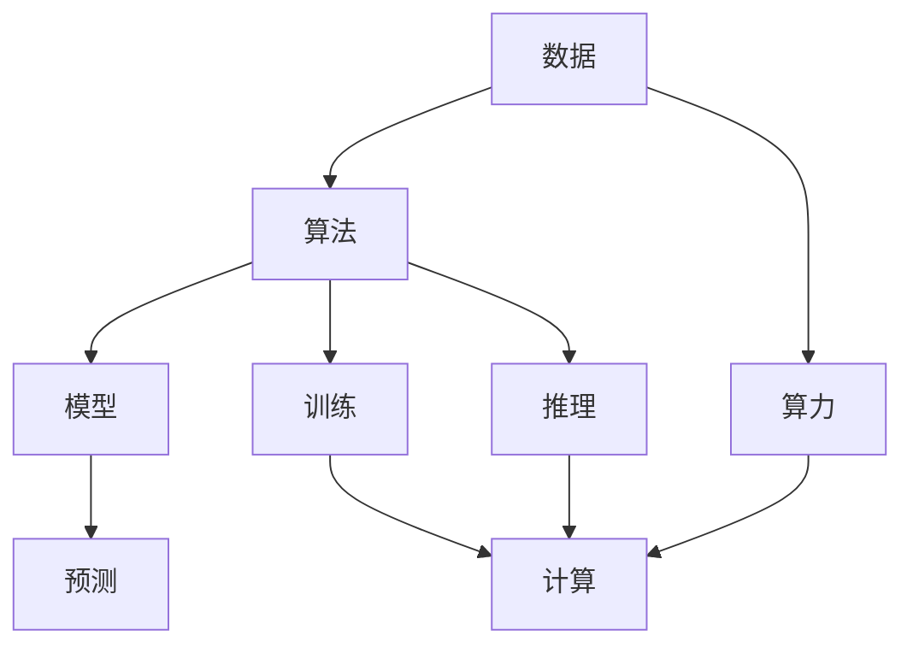

                 

## 1. 背景介绍

随着深度学习技术的成熟和应用领域的扩展，人工智能（AI）已经从以数据为主导的第一代AI发展到了融合数据、算法和算力的第二代AI。第二代AI不仅依赖于海量数据和复杂算法，还需要强大的计算资源来支撑，使得AI技术在多个行业实现了大规模应用和突破性进展。本文将详细探讨数据、算法和算力在第二代AI中的应用，以及它们如何共同推动AI技术的不断发展和进步。

## 2. 核心概念与联系

### 2.1 核心概念概述

第二代AI的核心概念包括数据、算法和算力，它们在AI系统的构建和运行中扮演着重要角色。

- **数据**：AI系统的训练和优化都依赖于大量的标注数据。这些数据用于训练模型，以提取模式和规律，同时用于验证模型性能，确保其准确性和可靠性。
- **算法**：AI系统的核心算法，如神经网络、优化器、损失函数等，是实现数据处理的智能处理方式，使模型能够从数据中学习并做出预测。
- **算力**：AI系统运行所需的计算资源，包括CPU、GPU、TPU等硬件设备和加速库，如CUDA、MXNet等，以及编程框架如TensorFlow、PyTorch等，提供了模型训练和推理的计算能力。

这三个概念之间相互依存，共同构成了第二代AI的生态系统。数据提供模型学习的素材，算法决定模型的学习方式和能力，而算力则支持算法的运行和模型的训练。

### 2.2 核心概念原理和架构的 Mermaid 流程图



## 3. 核心算法原理 & 具体操作步骤

### 3.1 算法原理概述

第二代AI的核心算法包括神经网络、优化器和损失函数等，这些算法通过复杂的计算过程实现数据的学习和处理。

- **神经网络**：基于生物神经网络设计的计算模型，用于模拟人类大脑的神经元处理信息的方式。神经网络由多个层次组成，每个层次包含多个节点，节点之间通过权值连接。
- **优化器**：用于调整神经网络中各参数的值，以最小化损失函数。常用的优化器包括梯度下降、Adam等。
- **损失函数**：衡量模型预测结果与真实标签之间的差异，常用的损失函数包括交叉熵、均方误差等。

### 3.2 算法步骤详解

神经网络训练的一般步骤包括数据预处理、模型构建、训练和评估。

1. **数据预处理**：清洗、标准化数据，将其转换为模型能够处理的格式。
2. **模型构建**：选择合适的神经网络结构和算法，定义损失函数和优化器。
3. **训练**：使用优化器更新模型参数，最小化损失函数，不断迭代直到收敛。
4. **评估**：在测试集上评估模型性能，检查过拟合或欠拟合情况。

### 3.3 算法优缺点

**优点**：
- 强大的泛化能力：神经网络能够从数据中学习复杂的模式和规律，适应性强。
- 可扩展性：神经网络可以通过增加层数和节点来提高复杂度，适用于各种规模和复杂度的任务。
- 自适应学习：优化器能够自动调整参数，找到最小化损失函数的路径。

**缺点**：
- 训练时间长：大规模神经网络需要大量计算资源和时间。
- 数据需求高：需要大量标注数据来训练和验证模型，标注成本高。
- 过拟合风险：模型可能过度拟合训练数据，导致泛化性能下降。

### 3.4 算法应用领域

第二代AI算法广泛应用于计算机视觉、自然语言处理、语音识别、推荐系统等多个领域，以下是几个典型的应用实例：

- **计算机视觉**：图像分类、目标检测、图像生成等任务。
- **自然语言处理**：机器翻译、文本生成、情感分析等任务。
- **语音识别**：语音转文本、语音合成等任务。
- **推荐系统**：个性化推荐、商品搜索等任务。

## 4. 数学模型和公式 & 详细讲解 & 举例说明

### 4.1 数学模型构建

以图像分类任务为例，定义一个简单的卷积神经网络（CNN）模型：

$$
y=f(x;\theta)=\sigma(\mathbf{W}_6 \sigma(\mathbf{W}_5 g_4 \mathbf{W}_3 g_2 \mathbf{W}_1 x))
$$

其中，$x$为输入图像，$\theta$为模型参数，$\sigma$为激活函数，$g_i$为卷积层和池化层，$\mathbf{W}_i$为权重矩阵。

### 4.2 公式推导过程

以训练一个简单的CNN为例，使用反向传播算法计算梯度：

1. 前向传播：
   $$
   y=f(x;\theta)=\sigma(\mathbf{W}_6 \sigma(\mathbf{W}_5 g_4 \mathbf{W}_3 g_2 \mathbf{W}_1 x))
   $$
2. 计算损失函数：
   $$
   L(y^*, y)=\frac{1}{N} \sum_{i=1}^N \ell(y_i^*, y_i)
   $$
   其中，$\ell$为损失函数，$y^*$为真实标签，$y$为模型预测结果。
3. 计算梯度：
   $$
   \frac{\partial L}{\partial \theta} = \frac{\partial \ell(y, y^*)}{\partial y} \frac{\partial y}{\partial x} \frac{\partial x}{\partial \theta}
   $$
4. 使用优化器更新参数：
   $$
   \theta = \theta - \alpha \frac{\partial L}{\partial \theta}
   $$

### 4.3 案例分析与讲解

以图像分类为例，使用MNIST数据集训练一个简单的CNN模型。具体步骤如下：

1. 加载MNIST数据集，并将其划分为训练集和测试集。
2. 定义CNN模型，包括多个卷积层和池化层，以及全连接层和输出层。
3. 定义损失函数和优化器，如交叉熵损失和Adam优化器。
4. 训练模型，在训练集上不断迭代更新参数。
5. 在测试集上评估模型性能，计算准确率。

## 5. 项目实践：代码实例和详细解释说明

### 5.1 开发环境搭建

为了快速进行AI项目的开发和测试，推荐使用以下开发环境：

1. **Python**：AI开发的主流编程语言，拥有丰富的第三方库和框架。
2. **Jupyter Notebook**：交互式的开发环境，支持代码和数据分析。
3. **GPU加速**：使用NVIDIA GPU和CUDA加速，提高计算效率。
4. **虚拟环境**：使用虚拟环境（如Anaconda）管理项目依赖。

### 5.2 源代码详细实现

以下是一个简单的图像分类CNN模型的代码实现，包括数据加载、模型定义、训练和评估：

```python
import tensorflow as tf
from tensorflow.keras import layers, models

# 加载MNIST数据集
(x_train, y_train), (x_test, y_test) = tf.keras.datasets.mnist.load_data()

# 数据预处理
x_train = x_train.reshape(-1, 28, 28, 1) / 255.0
x_test = x_test.reshape(-1, 28, 28, 1) / 255.0

# 定义模型
model = models.Sequential([
    layers.Conv2D(32, (3, 3), activation='relu', input_shape=(28, 28, 1)),
    layers.MaxPooling2D((2, 2)),
    layers.Conv2D(64, (3, 3), activation='relu'),
    layers.MaxPooling2D((2, 2)),
    layers.Conv2D(64, (3, 3), activation='relu'),
    layers.Flatten(),
    layers.Dense(64, activation='relu'),
    layers.Dense(10, activation='softmax')
])

# 定义优化器和损失函数
optimizer = tf.keras.optimizers.Adam(learning_rate=0.001)
loss_fn = tf.keras.losses.CategoricalCrossentropy()

# 训练模型
model.compile(optimizer=optimizer, loss=loss_fn, metrics=['accuracy'])
model.fit(x_train, y_train, epochs=5, batch_size=32, validation_data=(x_test, y_test))

# 评估模型
model.evaluate(x_test, y_test)
```

### 5.3 代码解读与分析

代码中使用了TensorFlow框架，主要包含以下几个部分：

1. **数据加载**：使用TensorFlow加载MNIST数据集，并进行预处理。
2. **模型定义**：定义一个简单的CNN模型，包括多个卷积层和全连接层。
3. **优化器和损失函数**：定义Adam优化器和交叉熵损失函数。
4. **训练模型**：使用fit方法训练模型，并使用evaluate方法评估模型性能。

## 6. 实际应用场景

### 6.1 智能推荐系统

智能推荐系统使用AI算法处理用户行为数据，预测用户偏好，推荐个性化商品或内容。该系统在电商、视频、新闻等领域有广泛应用。

1. **数据收集**：收集用户点击、浏览、购买等行为数据。
2. **模型训练**：使用神经网络模型训练推荐模型，预测用户对不同商品或内容的兴趣。
3. **模型评估**：在测试集上评估模型性能，计算准确率、召回率等指标。
4. **实时推荐**：在实际应用中，根据用户行为实时推荐商品或内容。

### 6.2 医疗影像分析

医疗影像分析使用AI算法处理医学影像数据，辅助医生进行疾病诊断和治疗方案选择。该系统在放射科、病理科等领域有广泛应用。

1. **数据收集**：收集患者的医学影像数据，如X光片、CT扫描等。
2. **模型训练**：使用神经网络模型训练影像分析模型，识别病变区域和疾病类型。
3. **模型评估**：在测试集上评估模型性能，计算精确率、召回率等指标。
4. **临床应用**：在实际应用中，医生使用模型辅助诊断和治疗。

### 6.3 自动驾驶

自动驾驶使用AI算法处理传感器数据，实现车辆自主导航和避障。该系统在汽车、物流等领域有广泛应用。

1. **数据收集**：收集车辆周围环境的传感器数据，如激光雷达、摄像头等。
2. **模型训练**：使用神经网络模型训练驾驶模型，实现车辆避障和导航。
3. **模型评估**：在模拟环境中评估模型性能，测试避障成功率和导航准确率。
4. **实际应用**：在实际应用中，车辆使用模型进行自动驾驶。

## 7. 工具和资源推荐

### 7.1 学习资源推荐

为了深入学习第二代AI的相关知识，推荐以下学习资源：

1. **深度学习基础**：《深度学习》（Ian Goodfellow等著），全面介绍深度学习的基础理论和方法。
2. **TensorFlow官方文档**：TensorFlow的官方文档，包括教程、API和示例。
3. **PyTorch官方文档**：PyTorch的官方文档，提供丰富的模型和算法实现。
4. **Coursera深度学习课程**：由斯坦福大学开设的深度学习课程，适合入门学习。
5. **ArXiv论文库**：涵盖最新的AI研究论文，了解前沿技术和方法。

### 7.2 开发工具推荐

为了高效开发第二代AI项目，推荐以下开发工具：

1. **TensorFlow**：谷歌开发的深度学习框架，提供丰富的模型和算法实现。
2. **PyTorch**：Facebook开发的深度学习框架，易于使用和定制。
3. **Jupyter Notebook**：交互式开发环境，支持代码和数据分析。
4. **Git**：版本控制系统，方便团队协作和代码管理。
5. **GitHub**：代码托管平台，提供丰富的开源项目和协作工具。

### 7.3 相关论文推荐

为了深入了解第二代AI的研究进展，推荐以下相关论文：

1. **ImageNet大规模视觉识别挑战赛**：Alex Krizhevsky等，提出AlexNet模型，开启大规模视觉识别时代。
2. **Google Brain自监督学习论文**：Andrej Karpathy等，提出自监督学习算法，显著提升模型性能。
3. **GAN生成对抗网络**：Ian Goodfellow等，提出生成对抗网络，用于图像生成和增强。
4. **AlphaGo神经网络**：DeepMind团队，提出神经网络算法，实现突破性围棋算法。
5. **BERT预训练模型**：Jacob Devlin等，提出BERT模型，提升自然语言处理性能。

## 8. 总结：未来发展趋势与挑战

### 8.1 总结

本文详细探讨了数据、算法和算力在第二代AI中的应用，以及它们如何共同推动AI技术的不断发展和进步。数据提供了模型训练的基础，算法决定了模型的学习方式和能力，算力支撑了算法的运行和模型的训练。

### 8.2 未来发展趋势

未来，第二代AI的发展趋势包括：

1. **数据质量提升**：随着数据标注成本降低，数据质量和数量将不断提升，推动AI技术进步。
2. **算法创新**：深度学习算法不断创新，提升模型的复杂度和性能。
3. **算力发展**：计算资源不断增加，推动AI应用规模化和实时化。

### 8.3 面临的挑战

第二代AI面临的挑战包括：

1. **数据隐私和安全**：数据隐私和安全问题日益突出，需加强保护。
2. **模型解释性**：模型黑盒化问题亟需解决，增强模型解释性。
3. **资源消耗**：AI模型计算资源消耗大，需提高资源利用效率。
4. **伦理和法规**：AI应用涉及伦理和法规问题，需建立规范体系。

### 8.4 研究展望

未来AI研究的展望包括：

1. **多模态学习**：融合视觉、听觉、触觉等多模态数据，提升AI系统的感知能力。
2. **联邦学习**：分布式训练AI模型，保护数据隐私。
3. **因果推理**：增强AI系统的因果关系，提高决策可靠性和可解释性。
4. **元学习**：提高AI模型快速适应新任务的能力。

## 9. 附录：常见问题与解答

**Q1: 什么是数据、算法和算力？**

A: 数据是指模型训练所需的大量标注数据；算法是模型学习和处理数据的方法；算力是模型运行所需的计算资源，包括硬件和加速库。

**Q2: 如何选择合适的数据集？**

A: 根据任务需求选择合适的数据集，注意数据的质量和数量，避免过拟合或欠拟合。

**Q3: 如何选择优化器和损失函数？**

A: 根据任务类型选择适合的优化器和损失函数，如分类任务使用交叉熵损失和Adam优化器。

**Q4: 如何提高模型的解释性？**

A: 使用可解释性方法，如LIME、SHAP等，或增强模型的因果关系，提高模型的可解释性。

**Q5: 如何优化算力消耗？**

A: 使用模型压缩、量化加速、模型并行等技术，减少计算资源消耗。

---

作者：禅与计算机程序设计艺术 / Zen and the Art of Computer Programming

