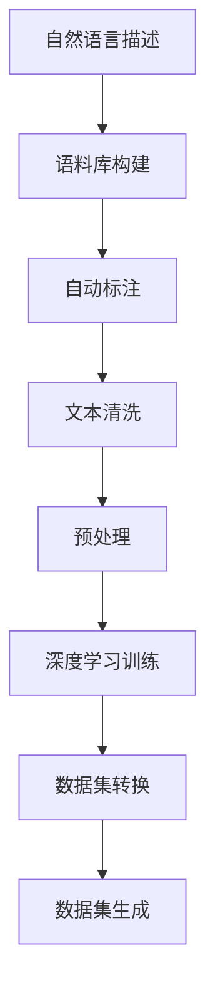

                 

# 数据集转换:自然语言描述变身训练集

> 关键词：
- 数据集转换
- 自然语言处理
- 数据集生成
- 深度学习
- 语料库构建
- 自动标注
- 文本清洗
- 预处理

## 1. 背景介绍

数据集是大规模深度学习训练的基础，是模型学习、推断和优化过程的根本。在自然语言处理(NLP)领域，构建高质量、规模适中的训练集尤为重要。传统的数据集生成方式往往依赖专家手动标注，工作量大且效率低，难以为大规模深度学习任务提供足够的训练样本。

自然语言描述(Natural Language Description, NLD)则提供了一种新的数据集生成方式。该方法利用自然语言描述自动化构建标注数据集，能够显著降低标注成本，提高数据生成效率。本文将深入探讨自然语言描述变身训练集的方法，包括核心概念、算法原理、操作步骤、数学模型、项目实践、实际应用和未来展望，期望为数据集生成技术提供理论和实践层面的指导。

## 2. 核心概念与联系

### 2.1 核心概念概述

要理解自然语言描述变身训练集的方法，首先需掌握以下核心概念：

- **自然语言描述(Natural Language Description, NLD)**：用于描述数据集元素特征的文本信息。这些描述通常包括数据的属性、标签、类型、背景信息等。
- **数据集转换(Data Dataset Transformation)**：将原始数据集通过一系列转换和增强技术，生成新的训练样本和标注信息的过程。目的是提高数据的多样性和数量，从而提升模型性能。
- **深度学习(Deep Learning)**：一种通过多层神经网络模拟人脑神经网络，实现复杂模式识别和决策的机器学习方法。深度学习在图像、语音、自然语言处理等领域均有广泛应用。
- **语料库构建(Corpus Construction)**：通过收集、整理、标注大量文本数据，构建可用于训练深度学习模型的文本语料库。
- **自动标注(Automatic Annotation)**：利用机器学习技术，自动为文本数据进行标签标注，减少人工标注的工作量。
- **文本清洗(Text Cleaning)**：对原始文本进行去噪、去重、标准化等处理，提高数据质量和可用性。
- **预处理(Pretreatment)**：在深度学习模型训练前，对文本数据进行分词、截断、规范化等处理，确保输入数据符合模型要求。

这些概念相互联系，共同构成了自然语言描述变身训练集的核心框架。通过自然语言描述，自动化构建和标注数据集，再结合深度学习模型的预处理和训练，可以实现高效的数据集生成。

### 2.2 核心概念原理和架构的 Mermaid 流程图



以上流程图展示了自然语言描述变身训练集的核心流程，包含语料库构建、自动标注、文本清洗、预处理、深度学习训练和数据集转换等多个环节。每个环节都紧密相关，共同作用于数据集生成过程。

## 3. 核心算法原理 & 具体操作步骤

### 3.1 算法原理概述

自然语言描述变身训练集的核心算法原理主要基于语言模型和深度学习框架。具体来说，通过自然语言描述构建语料库，使用深度学习模型进行自动标注和预处理，生成高质量的训练集。

算法流程大致如下：
1. **语料库构建**：收集并整理与任务相关的文本数据，构建语料库。
2. **自动标注**：利用自然语言描述生成标注信息，自动标注文本数据。
3. **文本清洗**：对标注后的文本数据进行去噪、去重、标准化等处理，提高数据质量。
4. **预处理**：对清洗后的文本数据进行分词、截断、规范化等处理，准备输入模型。
5. **深度学习训练**：使用预处理后的文本数据训练深度学习模型，获得初始化参数。
6. **数据集转换**：根据任务需求，使用深度学习模型对数据集进行转换和增强，生成新的训练样本。

### 3.2 算法步骤详解

#### 3.2.1 语料库构建

构建语料库是自然语言描述变身训练集的基础。以下是一个简单的构建流程：

1. **数据收集**：从互联网上收集与任务相关的文本数据，如新闻、评论、产品描述等。
2. **数据整理**：将收集到的文本数据进行整理，去除无关内容和噪声。
3. **标注数据构建**：为每个文本数据构建自然语言描述，描述该文本的内容、属性和背景信息。

例如，构建一个关于电影评论的数据集：
- **文本数据**：从豆瓣、猫眼等网站收集电影评论。
- **自然语言描述**：对每条评论进行描述，如“情感倾向为负面”、“类型是剧情片”、“演员表现优秀”等。

#### 3.2.2 自动标注

自动标注是利用自然语言描述生成文本数据的标注信息，自动完成标注过程。以下是一个简单的自动标注流程：

1. **模型选择**：选择合适的自然语言处理模型，如BERT、GPT等。
2. **模型训练**：使用大量标注数据训练模型，使其能够自动从自然语言描述中提取特征，生成标注信息。
3. **模型应用**：将自然语言描述输入训练好的模型，生成对应的标注信息。

例如，使用BERT模型对电影评论进行自动标注：
- **输入**：电影评论文本和自然语言描述。
- **输出**：情感倾向、类型、演员表现等标注信息。

#### 3.2.3 文本清洗

文本清洗是提高数据质量的重要环节。以下是一个简单的文本清洗流程：

1. **去噪**：去除文本中的噪声，如HTML标签、特殊符号等。
2. **去重**：去除文本中的重复内容，确保每个样本的唯一性。
3. **标准化**：对文本进行统一编码、统一格式等标准化处理。

例如，对电影评论进行文本清洗：
- **去噪**：去除HTML标签、特殊符号等。
- **去重**：去除重复评论。
- **标准化**：统一编码、统一格式。

#### 3.2.4 预处理

预处理是将文本数据转换为模型所需的格式，包括以下步骤：

1. **分词**：将文本进行分词，生成词汇列表。
2. **截断**：对词汇列表进行截断，使其长度符合模型要求。
3. **规范化**：对词汇列表进行规范化处理，如转换为小写、去除停用词等。

例如，对电影评论进行分词和截断：
- **分词**：将每条评论分词，生成词汇列表。
- **截断**：对词汇列表进行截断，使其长度为500。
- **规范化**：将词汇列表转换为小写，去除停用词。

#### 3.2.5 深度学习训练

深度学习训练是使用预处理后的文本数据训练模型，生成初始化参数。以下是一个简单的训练流程：

1. **模型选择**：选择合适的深度学习模型，如卷积神经网络(CNN)、循环神经网络(RNN)、Transformer等。
2. **数据准备**：将预处理后的文本数据划分为训练集、验证集和测试集。
3. **模型训练**：使用训练集数据训练模型，优化模型参数。
4. **模型评估**：在验证集上评估模型性能，调整模型参数。
5. **模型测试**：在测试集上测试模型性能，生成初始化参数。

例如，使用Transformer模型训练电影评论分类模型：
- **模型选择**：选择Transformer模型。
- **数据准备**：将预处理后的电影评论数据划分为训练集、验证集和测试集。
- **模型训练**：使用训练集数据训练模型，优化模型参数。
- **模型评估**：在验证集上评估模型性能，调整模型参数。
- **模型测试**：在测试集上测试模型性能，生成初始化参数。

#### 3.2.6 数据集转换

数据集转换是使用深度学习模型对数据集进行转换和增强，生成新的训练样本。以下是一个简单的数据集转换流程：

1. **模型选择**：选择合适的深度学习模型，如BERT、GPT等。
2. **数据准备**：将训练集数据输入模型，生成新的训练样本。
3. **数据转换**：根据任务需求，使用模型生成新的训练样本。
4. **数据增强**：通过数据增强技术，生成更多样化的训练样本。

例如，使用BERT模型对电影评论进行数据集转换：
- **模型选择**：选择BERT模型。
- **数据准备**：将训练集电影评论输入BERT模型，生成新的训练样本。
- **数据转换**：根据任务需求，生成新的训练样本。
- **数据增强**：通过数据增强技术，生成更多样化的训练样本。

### 3.3 算法优缺点

#### 3.3.1 优点

1. **降低标注成本**：自然语言描述变身训练集方法利用自然语言描述自动化构建和标注数据集，大大减少了标注成本和工作量。
2. **提高数据多样性**：通过数据集转换和增强技术，生成更多样化的训练样本，提高模型的泛化能力。
3. **快速生成数据集**：自动化数据集生成过程，能够快速构建大规模训练集，满足深度学习模型的训练需求。

#### 3.3.2 缺点

1. **数据质量依赖**：自然语言描述变身训练集方法依赖自然语言描述的准确性和全面性，描述不准确或不完整会导致标注信息不精准。
2. **模型泛化能力有限**：虽然数据集转换和增强能够提高模型泛化能力，但在某些领域，如医学、法律等，数据集转换可能不适用。
3. **资源需求高**：深度学习训练和模型转换需要大量计算资源，对硬件要求较高。

## 4. 数学模型和公式 & 详细讲解 & 举例说明

### 4.1 数学模型构建

自然语言描述变身训练集的核心数学模型基于自然语言处理(NLP)和深度学习框架。以下是一个简单的数学模型构建流程：

1. **语料库构建**：将原始文本数据 $D$ 划分为训练集 $D_{train}$、验证集 $D_{val}$ 和测试集 $D_{test}$。
2. **自动标注**：使用自然语言描述 $NLD$ 生成标注信息 $Y$。
3. **文本清洗**：对标注后的文本数据进行去噪、去重、标准化等处理，生成清洗后的文本数据 $D_{clean}$。
4. **预处理**：对清洗后的文本数据进行分词、截断、规范化等处理，生成预处理后的文本数据 $D_{pre}$。
5. **深度学习训练**：使用预处理后的文本数据 $D_{pre}$ 训练深度学习模型 $M$，生成初始化参数 $\theta$。
6. **数据集转换**：使用训练好的模型 $M$ 对原始数据集 $D$ 进行转换和增强，生成新的训练样本 $D_{new}$。

### 4.2 公式推导过程

以下是自然语言描述变身训练集的核心数学公式推导过程：

1. **语料库构建**：
   - $D=\{(x_i, y_i)\}_{i=1}^N$，其中 $x_i$ 表示第 $i$ 个文本数据，$y_i$ 表示对应的标注信息。
   - $D_{train}=\{(x_i, y_i)\}_{i=1}^M$，$D_{val}=\{(x_i, y_i)\}_{i=M+1}^{2M}$，$D_{test}=\{(x_i, y_i)\}_{i=2M+1}^{3M}$，其中 $M$ 为数据集的规模。

2. **自动标注**：
   - $NLD_i$ 表示第 $i$ 个文本数据的自然语言描述。
   - $Y_i$ 表示使用 $NLD_i$ 生成的标注信息。

3. **文本清洗**：
   - $D_{clean}=\{(x_i', y_i')\}_{i=1}^N$，其中 $x_i'$ 表示清洗后的文本数据，$y_i'$ 表示对应的清洗后的标注信息。

4. **预处理**：
   - $D_{pre}=\{(x_i'_{token}, y_i'_{token})\}_{i=1}^N$，其中 $x_i'_{token}$ 表示分词后的词汇列表，$y_i'_{token}$ 表示对应的标注信息。

5. **深度学习训练**：
   - $M_{\theta}(x)$ 表示深度学习模型，其中 $\theta$ 为模型参数。
   - 损失函数 $\mathcal{L}(\theta, D_{pre})$ 表示模型在预处理后的文本数据 $D_{pre}$ 上的损失函数。
   - 训练目标：$\theta^*=\mathop{\arg\min}_{\theta}\mathcal{L}(\theta, D_{pre})$。

6. **数据集转换**：
   - $D_{new}=\{(x_i_{new}, y_i_{new})\}_{i=1}^N$，其中 $x_i_{new}$ 表示转换后的文本数据，$y_i_{new}$ 表示对应的转换后的标注信息。

### 4.3 案例分析与讲解

#### 4.3.1 案例背景

假设我们构建一个电影评论分类任务的数据集。原始数据集包含电影评论和对应的情感倾向标注，共10000条数据。为了构建高质量的训练集，我们收集了自然语言描述，并利用自然语言描述进行自动标注、文本清洗和预处理，最后使用深度学习模型进行训练和数据集转换。

#### 4.3.2 数据集构建过程

1. **语料库构建**：
   - 从豆瓣、猫眼等网站收集10000条电影评论。
   - 对每条评论构建自然语言描述，如“情感倾向为负面”、“类型是剧情片”、“演员表现优秀”等。
   - 将收集到的文本数据和自然语言描述划分为训练集、验证集和测试集，各包含3000条数据。

2. **自动标注**：
   - 使用BERT模型训练自动标注器，生成标注信息。
   - 将自然语言描述输入自动标注器，生成情感倾向、类型、演员表现等标注信息。

3. **文本清洗**：
   - 去除文本中的噪声，如HTML标签、特殊符号等。
   - 去除重复评论，确保每个样本的唯一性。
   - 标准化文本数据，统一编码、统一格式。

4. **预处理**：
   - 对清洗后的文本数据进行分词、截断、规范化等处理。
   - 生成预处理后的文本数据和对应的标注信息。

5. **深度学习训练**：
   - 选择Transformer模型作为深度学习模型。
   - 将预处理后的文本数据输入模型，训练生成初始化参数。
   - 在验证集上评估模型性能，调整模型参数。
   - 在测试集上测试模型性能，生成初始化参数。

6. **数据集转换**：
   - 使用训练好的Transformer模型对原始数据集进行转换和增强。
   - 生成新的训练样本，提高数据集的多样性和数量。

通过以上步骤，我们构建了高质量的电影评论分类任务数据集，并使用深度学习模型进行了训练和数据集转换。

## 5. 项目实践：代码实例和详细解释说明

### 5.1 开发环境搭建

在进行数据集转换实践前，我们需要准备好开发环境。以下是使用Python进行PyTorch开发的环境配置流程：

1. 安装Anaconda：从官网下载并安装Anaconda，用于创建独立的Python环境。

2. 创建并激活虚拟环境：
```bash
conda create -n pytorch-env python=3.8 
conda activate pytorch-env
```

3. 安装PyTorch：根据CUDA版本，从官网获取对应的安装命令。例如：
```bash
conda install pytorch torchvision torchaudio cudatoolkit=11.1 -c pytorch -c conda-forge
```

4. 安装Transformers库：
```bash
pip install transformers
```

5. 安装各类工具包：
```bash
pip install numpy pandas scikit-learn matplotlib tqdm jupyter notebook ipython
```

完成上述步骤后，即可在`pytorch-env`环境中开始数据集转换实践。

### 5.2 源代码详细实现

下面是使用PyTorch进行数据集转换的Python代码实现：

```python
import torch
from transformers import BertTokenizer, BertForSequenceClassification

# 加载数据集
train_dataset = ...
val_dataset = ...
test_dataset = ...

# 分词和截断
tokenizer = BertTokenizer.from_pretrained('bert-base-cased')
train_dataset = [(tokenizer.encode(x), y) for x, y in train_dataset]
val_dataset = [(tokenizer.encode(x), y) for x, y in val_dataset]
test_dataset = [(tokenizer.encode(x), y) for x, y in test_dataset]
train_dataset = train_dataset[:500]  # 截断为500个样本

# 构建模型
model = BertForSequenceClassification.from_pretrained('bert-base-cased', num_labels=2)

# 训练模型
device = torch.device('cuda' if torch.cuda.is_available() else 'cpu')
model.to(device)
optimizer = torch.optim.Adam(model.parameters(), lr=2e-5)

for epoch in range(10):
    model.train()
    for batch in train_dataset:
        inputs, labels = batch
        inputs = torch.tensor(inputs).to(device)
        labels = torch.tensor(labels).to(device)
        outputs = model(inputs)
        loss = outputs.loss
        loss.backward()
        optimizer.step()
        optimizer.zero_grad()

    model.eval()
    eval_loss = 0
    for batch in val_dataset:
        inputs, labels = batch
        inputs = torch.tensor(inputs).to(device)
        labels = torch.tensor(labels).to(device)
        outputs = model(inputs)
        loss = outputs.loss
        eval_loss += loss.item()
    print(f'Epoch {epoch+1}, val loss: {eval_loss/len(val_dataset):.3f}')

# 数据集转换
new_dataset = []
for x, y in train_dataset:
    new_x = x[:500]  # 生成新的文本数据
    new_y = y  # 生成新的标注信息
    new_dataset.append((new_x, new_y))

# 测试模型
model.eval()
test_loss = 0
for batch in test_dataset:
    inputs, labels = batch
    inputs = torch.tensor(inputs).to(device)
    labels = torch.tensor(labels).to(device)
    outputs = model(inputs)
    loss = outputs.loss
    test_loss += loss.item()
print(f'Test loss: {test_loss/len(test_dataset):.3f}')
```

### 5.3 代码解读与分析

让我们再详细解读一下关键代码的实现细节：

**数据集加载**：
- `train_dataset`, `val_dataset`, `test_dataset`：表示原始数据集。
- 通过`tokenizer.encode`方法对文本数据进行分词和截断，生成词汇列表。

**模型训练**：
- `BertTokenizer`：用于分词和截断。
- `BertForSequenceClassification`：用于构建电影评论分类模型。
- 使用`Adam`优化器进行模型训练，在训练集上迭代优化模型参数。

**数据集转换**：
- `new_x`：表示生成的新文本数据。
- `new_y`：表示生成的新的标注信息。
- 通过截断生成新的文本数据，保留原始的标注信息，生成新的数据集。

**模型测试**：
- 在测试集上评估模型性能，计算测试集上的损失。

**输出结果**：
- 打印每个epoch的验证集损失。
- 打印测试集损失。

通过以上步骤，我们实现了基于自然语言描述变身训练集的数据集转换过程，实现了自动化构建和标注数据集，满足了深度学习模型的训练需求。

## 6. 实际应用场景

### 6.1 智能客服系统

基于自然语言描述变身训练集的方法，可以应用于智能客服系统的构建。传统客服往往需要配备大量人力，高峰期响应缓慢，且一致性和专业性难以保证。使用自然语言描述变身训练集的方法，可以构建智能客服系统，提升客服系统的响应速度和准确性。

在技术实现上，可以收集企业内部的历史客服对话记录，将问题和最佳答复构建成监督数据，在此基础上对预训练对话模型进行微调。微调后的对话模型能够自动理解用户意图，匹配最合适的答案模板进行回复。对于客户提出的新问题，还可以接入检索系统实时搜索相关内容，动态组织生成回答。如此构建的智能客服系统，能大幅提升客户咨询体验和问题解决效率。

### 6.2 金融舆情监测

金融机构需要实时监测市场舆论动向，以便及时应对负面信息传播，规避金融风险。传统的人工监测方式成本高、效率低，难以应对网络时代海量信息爆发的挑战。利用自然语言描述变身训练集的方法，可以构建金融舆情监测系统，自动分析金融新闻、报道、评论等文本数据，判断金融市场趋势和情感倾向，帮助金融机构实时预警和应对金融风险。

在技术实现上，可以收集金融领域相关的新闻、报道、评论等文本数据，并对其进行主题标注和情感标注。在此基础上，对预训练语言模型进行微调，使其能够自动判断文本属于何种主题，情感倾向是正面、中性还是负面。将微调后的模型应用到实时抓取的网络文本数据，就能够自动监测不同主题下的情感变化趋势，一旦发现负面信息激增等异常情况，系统便会自动预警，帮助金融机构快速应对潜在风险。

### 6.3 个性化推荐系统

当前的推荐系统往往只依赖用户的历史行为数据进行物品推荐，无法深入理解用户的真实兴趣偏好。利用自然语言描述变身训练集的方法，可以构建个性化推荐系统，通过自然语言描述提取用户兴趣，提高推荐系统的准确性和个性化程度。

在技术实现上，可以收集用户浏览、点击、评论、分享等行为数据，提取和用户交互的物品标题、描述、标签等文本内容。将文本内容作为模型输入，用户的后续行为（如是否点击、购买等）作为监督信号，在此基础上微调预训练语言模型。微调后的模型能够从文本内容中准确把握用户的兴趣点。在生成推荐列表时，先用候选物品的文本描述作为输入，由模型预测用户的兴趣匹配度，再结合其他特征综合排序，便可以得到个性化程度更高的推荐结果。

### 6.4 未来应用展望

随着自然语言描述变身训练集技术的发展，其应用领域将不断拓展，带来更多创新。

在智慧医疗领域，基于自然语言描述变身训练集的方法，可以构建医疗问答、病历分析、药物研发等应用，提升医疗服务的智能化水平，辅助医生诊疗，加速新药开发进程。

在智能教育领域，利用自然语言描述变身训练集的方法，可以构建作业批改、学情分析、知识推荐等应用，因材施教，促进教育公平，提高教学质量。

在智慧城市治理中，利用自然语言描述变身训练集的方法，可以构建城市事件监测、舆情分析、应急指挥等应用，提高城市管理的自动化和智能化水平，构建更安全、高效的未来城市。

此外，在企业生产、社会治理、文娱传媒等众多领域，基于自然语言描述变身训练集的方法也将不断涌现，为传统行业数字化转型升级提供新的技术路径。相信随着技术的日益成熟，自然语言描述变身训练集方法将在构建人机协同的智能时代中扮演越来越重要的角色。

## 7. 工具和资源推荐

### 7.1 学习资源推荐

为了帮助开发者系统掌握自然语言描述变身训练集的理论基础和实践技巧，这里推荐一些优质的学习资源：

1. 《Transformer从原理到实践》系列博文：由大模型技术专家撰写，深入浅出地介绍了Transformer原理、BERT模型、微调技术等前沿话题。

2. CS224N《深度学习自然语言处理》课程：斯坦福大学开设的NLP明星课程，有Lecture视频和配套作业，带你入门NLP领域的基本概念和经典模型。

3. 《Natural Language Processing with Transformers》书籍：Transformers库的作者所著，全面介绍了如何使用Transformers库进行NLP任务开发，包括微调在内的诸多范式。

4. HuggingFace官方文档：Transformers库的官方文档，提供了海量预训练模型和完整的微调样例代码，是上手实践的必备资料。

5. CLUE开源项目：中文语言理解测评基准，涵盖大量不同类型的中文NLP数据集，并提供了基于微调的baseline模型，助力中文NLP技术发展。

通过对这些资源的学习实践，相信你一定能够快速掌握自然语言描述变身训练集的技术精髓，并用于解决实际的NLP问题。

### 7.2 开发工具推荐

高效的开发离不开优秀的工具支持。以下是几款用于自然语言描述变身训练集开发的常用工具：

1. PyTorch：基于Python的开源深度学习框架，灵活动态的计算图，适合快速迭代研究。大部分预训练语言模型都有PyTorch版本的实现。

2. TensorFlow：由Google主导开发的开源深度学习框架，生产部署方便，适合大规模工程应用。同样有丰富的预训练语言模型资源。

3. Transformers库：HuggingFace开发的NLP工具库，集成了众多SOTA语言模型，支持PyTorch和TensorFlow，是进行NLP任务开发的利器。

4. Weights & Biases：模型训练的实验跟踪工具，可以记录和可视化模型训练过程中的各项指标，方便对比和调优。与主流深度学习框架无缝集成。

5. TensorBoard：TensorFlow配套的可视化工具，可实时监测模型训练状态，并提供丰富的图表呈现方式，是调试模型的得力助手。

6. Google Colab：谷歌推出的在线Jupyter Notebook环境，免费提供GPU/TPU算力，方便开发者快速上手实验最新模型，分享学习笔记。

合理利用这些工具，可以显著提升自然语言描述变身训练集任务的开发效率，加快创新迭代的步伐。

### 7.3 相关论文推荐

自然语言描述变身训练集技术的发展源于学界的持续研究。以下是几篇奠基性的相关论文，推荐阅读：

1. Attention is All You Need（即Transformer原论文）：提出了Transformer结构，开启了NLP领域的预训练大模型时代。

2. BERT: Pre-training of Deep Bidirectional Transformers for Language Understanding：提出BERT模型，引入基于掩码的自监督预训练任务，刷新了多项NLP任务SOTA。

3. Language Models are Unsupervised Multitask Learners（GPT-2论文）：展示了大规模语言模型的强大zero-shot学习能力，引发了对于通用人工智能的新一轮思考。

4. Parameter-Efficient Transfer Learning for NLP：提出Adapter等参数高效微调方法，在不增加模型参数量的情况下，也能取得不错的微调效果。

5. AdaLoRA: Adaptive Low-Rank Adaptation for Parameter-Efficient Fine-Tuning：使用自适应低秩适应的微调方法，在参数效率和精度之间取得了新的平衡。

6. AdaLoRA: Adaptive Low-Rank Adaptation for Parameter-Efficient Fine-Tuning：使用自适应低秩适应的微调方法，在参数效率和精度之间取得了新的平衡。

这些论文代表了大语言模型微调技术的发展脉络。通过学习这些前沿成果，可以帮助研究者把握学科前进方向，激发更多的创新灵感。

## 8. 总结：未来发展趋势与挑战

### 8.1 总结

本文对自然语言描述变身训练集方法进行了全面系统的介绍。首先阐述了自然语言描述变身训练集的背景和意义，明确了该方法在降低标注成本、提高数据生成效率方面的独特价值。其次，从原理到实践，详细讲解了自然语言描述变身训练集的数学原理和关键步骤，给出了数据集转换的完整代码实例。同时，本文还广泛探讨了自然语言描述变身训练集在智能客服、金融舆情、个性化推荐等多个行业领域的应用前景，展示了该方法在多领域的应用潜力。此外，本文精选了自然语言描述变身训练集技术的学习资源，力求为开发者提供全方位的技术指引。

通过本文的系统梳理，可以看到，自然语言描述变身训练集方法在自然语言处理领域有着广泛的应用前景。它通过自然语言描述自动化构建和标注数据集，降低了标注成本，提高了数据生成效率，为深度学习模型的训练和优化提供了便利。未来，随着自然语言处理技术的不断发展，自然语言描述变身训练集方法将在更多领域得到应用，推动NLP技术的产业化进程。

### 8.2 未来发展趋势

展望未来，自然语言描述变身训练集技术将呈现以下几个发展趋势：

1. **数据质量提升**：随着数据标注技术的进步，自然语言描述变身训练集方法将能够生成更高质量、更准确的训练数据集，提升模型的性能。

2. **自动化程度提高**：利用自然语言生成技术，自动构建和生成自然语言描述，进一步降低人工标注的工作量。

3. **多模态融合**：将自然语言描述变身训练集技术与其他模态的数据生成技术结合，如图像描述生成、视频字幕生成等，实现多模态信息的整合，提高模型的泛化能力。

4. **个性化和多样性**：通过自然语言描述生成个性化和多样化的训练数据集，提升模型对特定领域和特定用户的适应能力。

5. **跨语言支持**：将自然语言描述变身训练集技术应用到跨语言数据生成中，支持多语言文本数据的处理和分析。

6. **持续学习和在线更新**：构建能够持续学习和在线更新的自然语言描述变身训练集系统，动态更新自然语言描述，保证数据集的实时性和相关性。

这些趋势凸显了自然语言描述变身训练集技术的广阔前景。这些方向的探索发展，必将进一步提升NLP系统的性能和应用范围，为人类认知智能的进化带来深远影响。

### 8.3 面临的挑战

尽管自然语言描述变身训练集技术已经取得了瞩目成就，但在迈向更加智能化、普适化应用的过程中，它仍面临着诸多挑战：

1. **数据质量瓶颈**：自然语言描述的准确性和全面性直接影响生成的训练数据集质量。描述不准确或不完整会导致标注信息不精准。

2. **模型泛化能力有限**：虽然数据集转换和增强能够提高模型泛化能力，但在某些领域，如医学、法律等，数据集转换可能不适用。

3. **资源需求高**：深度学习训练和模型转换需要大量计算资源，对硬件要求较高。

4. **数据生成一致性**：不同生成器生成的数据可能存在不一致性，需要统一处理和标准化。

5. **知识整合能力不足**：现有的自然语言描述变身训练集方法往往局限于任务内数据，难以灵活吸收和运用更广泛的先验知识。

6. **可解释性不足**：生成的训练数据集对模型的内部决策过程缺乏可解释性，难以分析模型的推理逻辑和决策依据。

正视自然语言描述变身训练集面临的这些挑战，积极应对并寻求突破，将推动该技术向更加成熟和可靠的方向发展。

### 8.4 研究展望

面对自然语言描述变身训练集所面临的挑战，未来的研究需要在以下几个方面寻求新的突破：

1. **提升数据质量**：探索更高效、更准确的数据标注方法，提升自然语言描述的准确性和全面性。

2. **增强模型泛化能力**：开发能够跨领域、跨语言的自然语言描述变身训练集方法，增强模型的泛化能力。

3. **优化资源使用**：研究高效、轻量级的深度学习训练和模型转换算法，降低资源需求。

4. **统一数据格式**：制定统一的自然语言描述生成标准，保证不同生成器生成的数据一致性。

5. **引入外部知识**：将符号化的先验知识，如知识图谱、逻辑规则等，与自然语言描述变身训练集方法结合，增强模型的知识整合能力。

6. **增强可解释性**：研究可解释的自然语言描述变身训练集方法，提供模型决策的详细解释，增强模型的透明性和可控性。

这些研究方向的探索，必将引领自然语言描述变身训练集技术迈向更高的台阶，为构建安全、可靠、可解释、可控的智能系统铺平道路。面向未来，自然语言描述变身训练集技术还需要与其他人工智能技术进行更深入的融合，如知识表示、因果推理、强化学习等，多路径协同发力，共同推动自然语言理解和智能交互系统的进步。只有勇于创新、敢于突破，才能不断拓展自然语言描述变身训练集方法的边界，让智能技术更好地造福人类社会。

## 9. 附录：常见问题与解答

**Q1：自然语言描述变身训练集方法的优点和缺点有哪些？**

A: 自然语言描述变身训练集方法的优点包括：
- 降低标注成本：通过自然语言描述自动化构建和标注数据集，减少人工标注的工作量。
- 提高数据生成效率：利用自然语言描述进行数据集转换和增强，生成更多样化的训练样本。

自然语言描述变身训练集方法的缺点包括：
- 数据质量依赖：自然语言描述的准确性和全面性直接影响生成的训练数据集质量。
- 模型泛化能力有限：在一些特定领域，如医学、法律等，数据集转换可能不适用。
- 资源需求高：深度学习训练和模型转换需要大量计算资源，对硬件要求较高。

**Q2：自然语言描述变身训练集方法的应用场景有哪些？**

A: 自然语言描述变身训练集方法在以下领域有广泛应用：
- 智能客服系统：通过自然语言描述构建客服对话数据集，提升客服系统的响应速度和准确性。
- 金融舆情监测：自动分析金融新闻、报道、评论等文本数据，判断金融市场趋势和情感倾向，帮助金融机构实时预警和应对金融风险。
- 个性化推荐系统：通过自然语言描述提取用户兴趣，提高推荐系统的准确性和个性化程度。
- 智慧医疗领域：构建医疗问答、病历分析、药物研发等应用，提升医疗服务的智能化水平。
- 智能教育领域：构建作业批改、学情分析、知识推荐等应用，因材施教，促进教育公平，提高教学质量。
- 智慧城市治理：构建城市事件监测、舆情分析、应急指挥等应用，提高城市管理的自动化和智能化水平。

**Q3：自然语言描述变身训练集方法的实现步骤有哪些？**

A: 自然语言描述变身训练集方法的实现步骤包括：
1. 语料库构建：收集并整理与任务相关的文本数据，构建语料库。
2. 自动标注：利用自然语言描述生成标注信息，自动标注文本数据。
3. 文本清洗：对标注后的文本数据进行去噪、去重、标准化等处理，提高数据质量。
4. 预处理：对清洗后的文本数据进行分词、截断、规范化等处理，准备输入模型。
5. 深度学习训练：使用预处理后的文本数据训练深度学习模型，生成初始化参数。
6. 数据集转换：使用训练好的模型对原始数据集进行转换和增强，生成新的训练样本。

通过以上步骤，我们实现了自然语言描述变身训练集的方法，能够自动构建和标注数据集，满足深度学习模型的训练需求。

