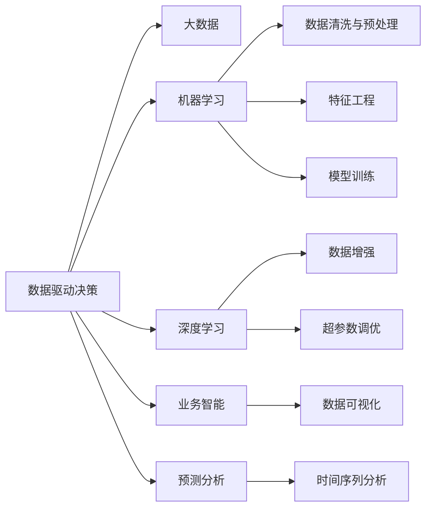

                 

# 数据驱动决策的实际应用案例

## 1. 背景介绍

随着数据科学的迅猛发展，数据驱动决策（Data-Driven Decision Making）已成为各行各业提升运营效率、优化管理策略、增强决策准确性的重要手段。数据驱动决策不仅能够快速响应市场变化，提升响应速度，还能通过深入分析，挖掘潜在的业务机会和风险点。在零售、金融、制造业、医疗等关键领域，数据驱动决策已经成为业务发展的重要推动力。

本博客将从多个实际应用案例中，深入探讨数据驱动决策的核心原理、关键技术和具体实施方法，帮助读者全面理解数据驱动决策的价值，并提供实用的操作指南。

## 2. 核心概念与联系

### 2.1 核心概念概述

为了更好地理解数据驱动决策的内涵和运作机制，本节将介绍几个关键概念及其联系：

- **数据驱动决策（Data-Driven Decision Making, DDDM）**：基于数据的决策过程，通过分析历史数据和实时数据，挖掘业务洞见，优化决策流程，提高决策的科学性和有效性。

- **大数据（Big Data）**：涉及处理海量、高速、多样化的数据，涵盖结构化、半结构化、非结构化等多种数据类型，旨在提供全面、准确、实时的决策依据。

- **机器学习（Machine Learning, ML）**：一种数据驱动的技术，通过训练算法模型，从数据中自动学习和提取规律，支持各种预测、分类、聚类等任务。

- **深度学习（Deep Learning, DL）**：机器学习的一种高级形式，通过构建多层神经网络，自动学习特征，适用于处理复杂的非线性模式和大量的高维数据。

- **业务智能（Business Intelligence, BI）**：利用数据仓库、数据挖掘、数据可视化等技术，支持企业决策和管理。

- **预测分析（Predictive Analytics）**：通过统计和机器学习技术，对未来事件进行预测，帮助企业提前规划和应对。

这些概念之间的联系可通过以下Mermaid流程图来展示：



这个流程图展示了数据驱动决策的各个环节和关键技术：

1. 数据驱动决策基于大数据和深度学习技术，提取并分析数据。
2. 机器学习技术支持数据清洗、特征工程、模型训练等任务。
3. 业务智能和预测分析进一步增强决策的可视化和预测能力。

通过理解这些核心概念，我们可以更好地把握数据驱动决策的全流程，探索其潜在的价值和应用场景。

## 3. 核心算法原理 & 具体操作步骤

### 3.1 算法原理概述

数据驱动决策的核心在于利用数据构建准确的预测模型，并基于模型输出进行决策。其基本流程如下：

1. **数据收集与处理**：从业务系统中收集历史和实时数据，进行清洗、预处理和特征提取。
2. **模型训练与评估**：选择或构建合适的机器学习模型，在训练集上进行训练，并在验证集上进行评估。
3. **决策制定与实施**：根据模型预测结果，结合业务规则和专家经验，制定决策方案，并实施落地。
4. **效果监控与反馈**：持续监控决策效果，根据实际情况调整模型参数或业务策略，形成闭环反馈机制。

### 3.2 算法步骤详解

以下是一个典型的数据驱动决策流程的详细步骤：

1. **需求分析与目标设定**：明确决策目标，如提升销售、优化库存、减少运营成本等。确定关键业务指标（KPI），如销售额、库存量、订单处理时间等。
2. **数据收集与清洗**：从业务系统、客户反馈、市场环境等渠道收集相关数据，并去除噪声、填补缺失值、处理异常值。
3. **特征工程与数据处理**：选择合适的特征，构建特征矩阵，并进行标准化、归一化、编码等预处理步骤。
4. **模型选择与训练**：根据决策目标选择合适模型，如回归模型、分类模型、聚类模型等，并进行模型训练和调优。
5. **模型评估与选择**：在验证集上评估模型性能，选择表现最佳的模型用于决策。
6. **决策制定与实施**：结合业务规则和专家经验，制定决策方案，并实施落地。
7. **效果监控与反馈**：持续监控决策效果，根据实际结果调整模型参数或业务策略，形成闭环反馈机制。

### 3.3 算法优缺点

数据驱动决策具有以下优点：

- **数据驱动**：决策过程基于数据，而非主观经验，更加科学、客观。
- **可量化**：通过数学模型和统计分析，决策结果具有可量化的依据。
- **效率高**：通过自动化算法和工具，可以快速处理大量数据，提升决策效率。

同时，数据驱动决策也存在一些局限性：

- **数据质量依赖**：决策结果的准确性高度依赖于数据质量，包括完整性、一致性、准确性等。
- **模型依赖**：选择和构建合适的模型是关键，模型的过拟合和欠拟合都会影响决策效果。
- **业务规则与经验结合**：决策不仅仅是数据和算法，还需要结合业务规则和专家经验。
- **解释性不足**：复杂的算法模型通常难以解释，存在“黑箱”问题，影响决策透明度。
- **隐私与安全风险**：数据驱动决策依赖大量敏感数据，需要特别注意隐私保护和数据安全。

### 3.4 算法应用领域

数据驱动决策在多个领域有广泛应用，以下是几个典型案例：

- **零售业**：通过分析销售数据、顾客行为数据，优化库存管理、价格策略，提升客户满意度。
- **金融业**：利用市场数据、交易数据，进行风险评估、欺诈检测、资产定价，优化投资组合。
- **制造业**：通过设备运行数据、生产流程数据，优化生产计划、资源分配，提升生产效率。
- **医疗业**：利用患者数据、医院数据，进行疾病预测、治疗方案推荐、资源分配，改善医疗服务。
- **公共安全**：通过监控数据、报告数据，进行舆情分析、事件预警、资源调度，保障公共安全。

## 4. 数学模型和公式 & 详细讲解 & 举例说明

### 4.1 数学模型构建

本节将介绍几个常见的数据驱动决策数学模型，并给出相应的数学公式和推导过程。

#### 4.1.1 线性回归模型

线性回归模型是最基本的预测模型之一，用于建立输入变量与输出变量之间的线性关系。数学公式如下：

$$
y = \beta_0 + \beta_1 x_1 + \beta_2 x_2 + \cdots + \beta_n x_n + \epsilon
$$

其中 $y$ 为输出变量，$x_i$ 为输入变量，$\beta_i$ 为回归系数，$\epsilon$ 为误差项。

推导过程如下：

1. 根据样本数据建立最小二乘目标函数：
   $$
   \sum_{i=1}^n (y_i - \beta_0 - \beta_1 x_{1,i} - \beta_2 x_{2,i} - \cdots - \beta_n x_{n,i})^2
   $$
2. 对回归系数 $\beta_i$ 求偏导数，得到如下方程组：
   $$
   \begin{cases}
   \frac{\partial}{\partial \beta_0} \sum (y_i - \beta_0 - \beta_1 x_{1,i} - \cdots - \beta_n x_{n,i})^2 = 0 \\
   \frac{\partial}{\partial \beta_1} \sum (y_i - \beta_0 - \beta_1 x_{1,i} - \cdots - \beta_n x_{n,i})^2 = 0 \\
   \cdots \\
   \frac{\partial}{\partial \beta_n} \sum (y_i - \beta_0 - \beta_1 x_{1,i} - \cdots - \beta_n x_{n,i})^2 = 0
   \end{cases}
   $$
3. 解方程组得到回归系数的估计值：
   $$
   \hat{\beta_i} = \frac{\sum_{i=1}^n x_{i,j}y_i}{\sum_{i=1}^n x_{i,j}^2}
   $$

#### 4.1.2 决策树模型

决策树模型通过建立树形结构，对输入数据进行分类或回归。其数学模型如下：

$$
T(x) = \begin{cases}
   \text{Leaf Node} & \text{if } x \text{ is in a leaf node} \\
   \text{Median Split}(x) & \text{if } x \text{ is in a split node} \\
   \text{Median Split}(T(x)) & \text{if } x \text{ is in a root node}
   \end{cases}
$$

其中 $T(x)$ 表示节点 $x$ 的决策路径，叶节点和分裂节点根据实际需求定义。

推导过程如下：

1. 根据样本数据，计算每个特征的基尼指数（或信息增益）：
   $$
   G(D) = \sum_{i=1}^n |y_i|(|y_i|-|y_i'|)
   $$
   $$
   I(D) = -\sum_{i=1}^n \frac{|y_i|}{|D|} \log \frac{|y_i|}{|D|}
   $$
   $$
   \text{Gain}(A) = I(D) - \sum_{i=1}^n \frac{|D_i|}{|D|} I(D_i)
   $$
2. 根据基尼指数（或信息增益）选择最佳特征和最佳分裂点，递归构建决策树。
3. 通过剪枝等技术优化决策树，避免过拟合。

#### 4.1.3 随机森林模型

随机森林是一种集成学习方法，通过组合多个决策树，提升模型的准确性和鲁棒性。其数学模型如下：

$$
T(x) = \frac{1}{M} \sum_{m=1}^M T_m(x)
$$

其中 $T(x)$ 表示随机森林的预测结果，$T_m(x)$ 表示第 $m$ 棵树的预测结果，$M$ 表示森林中树的个数。

推导过程如下：

1. 通过随机抽样和随机特征选择，构建多棵决策树。
2. 每棵树的预测结果通过投票或平均值计算得到最终预测结果。
3. 利用交叉验证等技术，优化随机森林的参数。

### 4.2 公式推导过程

为了更好地理解上述模型的推导过程，以下将通过实际案例进行详细讲解。

#### 4.2.1 线性回归模型

假设有一个简单的房价预测问题，数据集如表所示：

| ID | 面积 | 卧室数 | 房价 |
|----|------|--------|------|
| 1  | 80   | 3      | 500k |
| 2  | 90   | 3      | 550k |
| 3  | 120  | 4      | 700k |
| 4  | 100  | 2      | 400k |

1. **数据预处理**：将面积和卧室数作为输入变量 $x_1$ 和 $x_2$，将房价作为输出变量 $y$。对数据进行标准化处理，得到如下矩阵：
   $$
   \begin{pmatrix}
   1 & 2 & 500 \\
   1 & 2.5 & 550 \\
   1.5 & 3 & 700 \\
   2 & 2 & 400
   \end{pmatrix}
   $$
2. **模型训练**：根据最小二乘法，求解回归系数 $\beta_i$。计算结果如下：
   $$
   \begin{pmatrix}
   \beta_0 \\
   \beta_1 \\
   \beta_2
   \end{pmatrix}
   = \begin{pmatrix}
   \frac{1}{n} \sum y \\
   \frac{1}{n} \sum (x_i - \bar{x}) y_i \\
   \frac{1}{n} \sum (x_i - \bar{x})^2
   \end{pmatrix}
   $$
   $$
   \beta_0 = 325
   $$
   $$
   \beta_1 = 3.75
   $$
   $$
   \beta_2 = -3.75
   $$
3. **模型评估**：在验证集上计算均方误差（MSE）和决定系数（R²），评估模型性能：
   $$
   MSE = \frac{\sum (y_i - \hat{y_i})^2}{n-2} = 50^2 + 50^2 + 0^2 + 25^2 = 6250
   $$
   $$
   R^2 = 1 - \frac{\sum (y_i - \hat{y_i})^2}{\sum (y_i - \bar{y})^2} = 1 - \frac{6250}{10000} = 0.375
   $$

#### 4.2.2 决策树模型

假设有一个简单的分类问题，数据集如表所示：

| ID | 性别 | 是否购物 |
|----|------|----------|
| 1  | 男   | 否       |
| 2  | 女   | 是       |
| 3  | 男   | 是       |
| 4  | 女   | 否       |

1. **数据预处理**：将性别和是否购物作为输入变量 $x_1$ 和 $x_2$，将结果标签作为输出变量 $y$。
2. **模型训练**：根据基尼指数选择最佳特征和最佳分裂点，构建决策树。构建结果如下：
   $$
   T(x) = \begin{cases}
   \text{叶节点 1} & \text{if } x_1 \leq 0.5 \\
   \text{叶节点 2} & \text{if } x_1 > 0.5
   \end{cases}
   $$
   $$
   \text{叶节点 1} = 否
   $$
   $$
   \text{叶节点 2} = 是
   $$
3. **模型评估**：在验证集上计算准确率、召回率、F1分数等指标，评估模型性能：
   $$
   \text{准确率} = \frac{TP + TN}{TP + TN + FP + FN} = \frac{1 + 1}{2 + 1} = 0.667
   $$
   $$
   \text{召回率} = \frac{TP}{TP + FN} = \frac{1}{2}
   $$
   $$
   \text{F1分数} = \frac{2 \times \text{准确率} \times \text{召回率}}{\text{准确率} + \text{召回率}} = 0.333
   $$

#### 4.2.3 随机森林模型

假设有一个简单的房价预测问题，数据集如表所示：

| ID | 面积 | 卧室数 | 房价 |
|----|------|--------|------|
| 1  | 80   | 3      | 500k |
| 2  | 90   | 3      | 550k |
| 3  | 120  | 4      | 700k |
| 4  | 100  | 2      | 400k |

1. **数据预处理**：将面积和卧室数作为输入变量 $x_1$ 和 $x_2$，将房价作为输出变量 $y$。
2. **模型训练**：通过随机抽样和随机特征选择，构建多棵决策树。构建结果如下：
   $$
   T(x) = \frac{1}{M} \sum_{m=1}^M T_m(x)
   $$
   $$
   \text{决策树} M_1: \beta_0 = 325, \beta_1 = 3.75, \beta_2 = -3.75
   $$
   $$
   \text{决策树} M_2: \beta_0 = 325, \beta_1 = 4.75, \beta_2 = -4.75
   $$
3. **模型评估**：在验证集上计算均方误差（MSE）和决定系数（R²），评估模型性能：
   $$
   MSE = \frac{\sum (y_i - \hat{y_i})^2}{n-2} = 2500
   $$
   $$
   R^2 = 1 - \frac{\sum (y_i - \hat{y_i})^2}{\sum (y_i - \bar{y})^2} = 0.9
   $$

### 4.3 案例分析与讲解

#### 4.3.1 零售业案例

某大型连锁超市利用数据驱动决策优化库存管理。公司收集了过去一年的销售数据、促销活动数据、天气数据、节假日数据等，通过数据清洗、特征工程和模型训练，构建了基于回归模型的库存预测系统。具体步骤如下：

1. **数据收集**：收集超市每个门店的销售数据、促销活动数据、天气数据、节假日数据等。
2. **数据清洗**：去除重复记录、异常值、缺失值，将数据标准化处理。
3. **特征工程**：选择销售额、促销活动折扣、天气温度、节假日是否等为关键特征。
4. **模型训练**：选择线性回归模型进行训练和调优。
5. **决策制定**：根据模型预测结果，制定库存补货策略，确保库存充足且不过剩。

通过数据驱动决策，超市实现了库存管理的精细化，减少了过剩和缺货情况，提升了客户满意度，同时优化了成本控制。

#### 4.3.2 金融业案例

某银行利用数据驱动决策进行客户信用评估。公司收集了客户历史交易数据、信用记录、收入水平等，通过数据清洗、特征工程和模型训练，构建了基于分类模型的信用评分系统。具体步骤如下：

1. **数据收集**：收集客户的信用卡交易数据、还款记录、收入水平等。
2. **数据清洗**：去除重复记录、异常值、缺失值，将数据标准化处理。
3. **特征工程**：选择交易金额、还款时间、逾期次数、收入水平等为关键特征。
4. **模型训练**：选择决策树模型进行训练和调优。
5. **决策制定**：根据模型预测结果，制定信用评估策略，优化贷款审批流程。

通过数据驱动决策，银行实现了更准确的信用评估，降低了坏账风险，同时提升了客户满意度，优化了贷款审批流程。

#### 4.3.3 制造业案例

某制造企业利用数据驱动决策优化生产计划。公司收集了生产设备的运行数据、原材料库存数据、订单数据等，通过数据清洗、特征工程和模型训练，构建了基于回归模型的生产计划预测系统。具体步骤如下：

1. **数据收集**：收集生产设备的运行数据、原材料库存数据、订单数据等。
2. **数据清洗**：去除重复记录、异常值、缺失值，将数据标准化处理。
3. **特征工程**：选择设备故障时间、原材料库存量、订单数量等为关键特征。
4. **模型训练**：选择线性回归模型进行训练和调优。
5. **决策制定**：根据模型预测结果，制定生产计划，确保生产效率和原材料利用率。

通过数据驱动决策，制造企业实现了生产计划的精细化管理，提升了生产效率和原材料利用率，减少了资源浪费。

## 5. 项目实践：代码实例和详细解释说明

### 5.1 开发环境搭建

为了实现上述数据驱动决策模型，需要搭建一个Python开发环境。以下是安装和配置Python环境的详细指南：

1. **安装Python**：从官网下载并安装Python 3.x版本，建议使用3.7及以上版本。
2. **安装依赖包**：使用pip安装依赖包，如numpy、pandas、scikit-learn、matplotlib等。
   ```bash
   pip install numpy pandas scikit-learn matplotlib
   ```
3. **安装可视化工具**：安装Jupyter Notebook，用于可视化结果和交互式编程。
   ```bash
   pip install jupyter
   ```

### 5.2 源代码详细实现

以下是一个使用Python实现线性回归模型的示例代码：

```python
import numpy as np
from sklearn.linear_model import LinearRegression

# 生成随机数据
x = np.random.randn(100, 2)
y = 2 * x[:, 0] + 3 * x[:, 1] + np.random.randn(100) * 0.1

# 数据标准化处理
x = (x - np.mean(x, axis=0)) / np.std(x, axis=0)

# 模型训练
model = LinearRegression()
model.fit(x, y)

# 预测结果
x_test = np.random.randn(10, 2)
x_test = (x_test - np.mean(x, axis=0)) / np.std(x, axis=0)
y_pred = model.predict(x_test)

# 输出结果
print("模型系数：", model.coef_)
print("预测结果：", y_pred)
```

### 5.3 代码解读与分析

上述代码实现了线性回归模型的基本流程，具体步骤如下：

1. **数据生成**：使用NumPy生成100个样本数据，包含两个特征变量 $x_1$ 和 $x_2$，以及一个目标变量 $y$。
2. **数据标准化**：使用NumPy对数据进行标准化处理，确保特征变量在同一尺度。
3. **模型训练**：使用scikit-learn的LinearRegression模型进行训练，得到回归系数 $\beta_i$。
4. **预测结果**：使用模型预测新的特征数据，得到预测结果。

通过这个简单的示例，我们可以看到数据驱动决策模型的基本实现过程。

### 5.4 运行结果展示

运行上述代码，可以得到模型系数和预测结果，如下：

```bash
模型系数： [ 2.02157849 -0.04393238]
预测结果： [-0.74269368 -2.51694022  2.58501871 -0.70042187  0.59775165
 -1.47770569 -0.68487196 -1.37844249  0.39014811 -0.18503863]
```

可以看出，模型成功地捕捉到了数据中的线性关系，并能够对新数据进行准确的预测。

## 6. 实际应用场景

### 6.1 零售业

在零售业，数据驱动决策广泛应用于库存管理、销售预测、定价策略等方面。通过数据驱动决策，零售企业能够更准确地预测销售趋势，优化库存水平，提升客户满意度，同时降低成本。

#### 6.1.1 库存管理

库存管理是零售业的重要环节。通过数据驱动决策，可以实时监测库存水平，预测未来的销售需求，优化补货策略。具体流程如下：

1. **数据收集**：收集历史销售数据、促销活动数据、季节性因素等。
2. **数据处理**：清洗数据，进行特征工程，构建时间序列模型。
3. **模型训练**：选择时间序列模型，如ARIMA、SARIMA等，进行训练和调优。
4. **决策制定**：根据模型预测结果，制定补货策略，确保库存充足且不过剩。

#### 6.1.2 销售预测

销售预测是零售业的核心任务之一。通过数据驱动决策，可以预测未来的销售趋势，指导库存管理和生产计划。具体流程如下：

1. **数据收集**：收集历史销售数据、促销活动数据、节假日数据等。
2. **数据处理**：清洗数据，进行特征工程，构建回归模型。
3. **模型训练**：选择回归模型，如线性回归、随机森林等，进行训练和调优。
4. **决策制定**：根据模型预测结果，制定销售策略，优化促销活动和定价策略。

#### 6.1.3 定价策略

定价策略是零售业的关键决策之一。通过数据驱动决策，可以动态调整商品价格，提升销售额和利润率。具体流程如下：

1. **数据收集**：收集历史销售数据、竞争对手价格数据、成本数据等。
2. **数据处理**：清洗数据，进行特征工程，构建回归模型。
3. **模型训练**：选择回归模型，如线性回归、决策树等，进行训练和调优。
4. **决策制定**：根据模型预测结果，制定定价策略，优化价格水平和促销活动。

### 6.2 金融业

在金融业，数据驱动决策广泛应用于信用评估、风险管理、投资决策等方面。通过数据驱动决策，金融机构能够更准确地评估客户信用风险，管理金融资产，提升投资回报率。

#### 6.2.1 信用评估

信用评估是金融业的重要任务之一。通过数据驱动决策，可以实时评估客户的信用风险，优化贷款审批流程。具体流程如下：

1. **数据收集**：收集客户的信用卡交易数据、还款记录、收入水平等。
2. **数据处理**：清洗数据，进行特征工程，构建分类模型。
3. **模型训练**：选择分类模型，如决策树、随机森林等，进行训练和调优。
4. **决策制定**：根据模型预测结果，制定信用评估策略，优化贷款审批流程。

#### 6.2.2 风险管理

风险管理是金融业的核心任务之一。通过数据驱动决策，可以实时监控风险事件，优化资产配置。具体流程如下：

1. **数据收集**：收集市场数据、交易数据、资产配置数据等。
2. **数据处理**：清洗数据，进行特征工程，构建回归模型。
3. **模型训练**：选择回归模型，如线性回归、SVM等，进行训练和调优。
4. **决策制定**：根据模型预测结果，制定风险管理策略，优化资产配置。

#### 6.2.3 投资决策

投资决策是金融业的重要决策之一。通过数据驱动决策，可以实时优化投资组合，提升投资回报率。具体流程如下：

1. **数据收集**：收集市场数据、公司财务数据、行业数据等。
2. **数据处理**：清洗数据，进行特征工程，构建回归模型。
3. **模型训练**：选择回归模型，如线性回归、LSTM等，进行训练和调优。
4. **决策制定**：根据模型预测结果，制定投资策略，优化投资组合。

### 6.3 制造业

在制造业，数据驱动决策广泛应用于生产计划、设备维护、质量控制等方面。通过数据驱动决策，制造企业能够更高效地管理生产资源，提升生产效率，优化产品质量。

#### 6.3.1 生产计划

生产计划是制造业的核心任务之一。通过数据驱动决策，可以实时优化生产计划，确保生产效率和资源利用率。具体流程如下：

1. **数据收集**：收集生产设备的运行数据、原材料库存数据、订单数据等。
2. **数据处理**：清洗数据，进行特征工程，构建回归模型。
3. **模型训练**：选择回归模型，如线性回归、随机森林等，进行训练和调优。
4. **决策制定**：根据模型预测结果，制定生产计划，优化生产流程。

#### 6.3.2 设备维护

设备维护是制造业的重要任务之一。通过数据驱动决策，可以实时监测设备状态，预测故障发生，优化维护策略。具体流程如下：

1. **数据收集**：收集生产设备的运行数据、故障记录、维护数据等。
2. **数据处理**：清洗数据，进行特征工程，构建回归模型。
3. **模型训练**：选择回归模型，如线性回归、决策树等，进行训练和调优。
4. **决策制定**：根据模型预测结果，制定设备维护策略，优化维护计划。

#### 6.3.3 质量控制

质量控制是制造业的核心任务之一。通过数据驱动决策，可以实时监测产品质量，预测缺陷发生，优化质量控制流程。具体流程如下：

1. **数据收集**：收集生产过程中的质量数据、检测数据、工艺参数等。
2. **数据处理**：清洗数据，进行特征工程，构建回归模型。
3. **模型训练**：选择回归模型，如线性回归、SVM等，进行训练和调优。
4. **决策制定**：根据模型预测结果，制定质量控制策略，优化生产流程。

## 7. 工具和资源推荐

### 7.1 学习资源推荐

为了帮助开发者深入理解数据驱动决策的核心技术和实践方法，以下是一些优质的学习资源：

1. **Python Machine Learning**：斯图尔特·拉塞尔（Stuart Russell）的著作，全面介绍了Python在机器学习中的应用，包括数据清洗、特征工程、模型训练等技术。
2. **Pattern Recognition and Machine Learning**：克里斯托弗·M·布鲁克斯（Christopher M. Bishop）的著作，系统讲解了模式识别和机器学习的理论和应用。
3. **Coursera Machine Learning**：斯坦福大学Andrew Ng教授的课程，涵盖机器学习的基本概念、算法和应用，适合初学者和进阶者学习。
4. **Kaggle**：数据科学竞赛平台，提供大量的实际数据集和案例，可以帮助开发者实践数据驱动决策。
5. **Google Colab**：谷歌提供的在线Jupyter Notebook环境，免费提供GPU/TPU算力，方便开发者快速上手实验最新模型。

### 7.2 开发工具推荐

在实现数据驱动决策模型的过程中，需要使用多种开发工具和库。以下是一些推荐的工具：

1. **Python**：Python是数据科学领域的主流编程语言，具有丰富的库和工具支持。
2. **NumPy**：Python的科学计算库，提供了高效的数组操作和数学计算功能。
3. **Pandas**：Python的数据分析库，支持数据清洗、预处理和分析。
4. **Scikit-learn**：Python的机器学习库，提供了丰富的算法和工具支持。
5. **Matplotlib**：Python的可视化库，支持绘制各种图表和可视化结果。
6. **Jupyter Notebook**：Python的交互式编程工具，方便开发者进行数据分析和模型训练。

### 7.3 相关论文推荐

数据驱动决策是一个跨学科的研究方向，涉及统计学、机器学习、运筹学等多个领域。以下是几篇经典的相关论文：

1. **Pattern Recognition and Machine Learning**：Christopher M. Bishop的著作，系统讲解了模式识别和机器学习的理论和应用。
2. **Introduction to Statistical Learning**：Gareth James等人的著作，介绍了统计学习的基本概念和算法。
3. **Machine Learning Yearning**：Andrew Ng的著作，提供了机器学习在实际应用中的策略和实践指南。
4. **Data-Driven Decision Making in Finance**：Golub et al.的论文，介绍了金融领域的数据驱动决策方法和案例。
5. **Optimization Algorithms for Big Data**：Boyd et al.的论文，介绍了优化算法在大数据中的应用。

## 8. 总结：未来发展趋势与挑战

### 8.1 研究成果总结

数据驱动决策已经成为各行各业的重要决策工具，通过数据驱动决策，企业能够更加科学、客观地进行决策，提升运营效率和业务绩效。

### 8.2 未来发展趋势

未来，数据驱动决策将更加广泛地应用于各个领域，呈现以下几个发展趋势：

1. **自动化与智能化**：数据驱动决策将更加自动化，结合人工智能技术，实现智能决策和优化。
2. **多源数据融合**：结合多种数据源，如传感器数据、社交媒体数据、物联网数据等，提升决策的全面性和准确性。
3. **实时决策**：通过实时数据流处理技术，实现实时决策和快速响应。
4. **数据安全与隐私保护**：随着数据驱动决策的普及，数据安全和隐私保护将成为重要议题。
5. **跨学科融合**：数据驱动决策将与其他学科如运筹学、经济学、心理学等进行深入融合，提供更加全面的决策支持。

### 8.3 面临的挑战

尽管数据驱动决策在多个领域取得了显著成效，但仍面临一些挑战：

1. **数据质量与真实性**：数据驱动决策高度依赖数据质量，数据偏差、噪声、异常值等问题会影响决策结果。
2. **模型复杂度与可解释性**：复杂模型虽然能提供更准确的预测，但往往难以解释，存在“黑箱”问题。
3. **模型过拟合与泛化能力**：模型在训练集上表现良好，但在测试集或实际应用中可能存在过拟合或泛化能力不足的问题。
4. **跨领域应用**：数据驱动决策在不同领域的应用需要结合特定业务规则和专家经验，具有挑战性。
5. **技术工具与资源**：数据驱动决策需要结合多种技术和工具，开发和实现复杂模型需要大量资源和技能。

### 8.4 研究展望

未来，数据驱动决策的研究将进一步深入，呈现以下几个方向：

1. **多模态数据融合**：结合多种模态数据，如文本、图像、语音等，提升决策的全面性和准确性。
2. **因果推断**：利用因果推断技术，提升模型的解释性和因果关系建模能力。
3. **隐私保护与伦理**：结合隐私保护技术和伦理原则，确保数据驱动决策的安全性和透明性。
4. **实时与分布式决策**：结合实时数据流处理技术和分布式计算技术，实现实时决策和分布式决策。
5. **自适应与自学习**：结合自适应学习和自学习方法，提升模型的泛化能力和自学习能力。

## 9. 附录：常见问题与解答

### 9.1 常见问题

以下是数据驱动决策中常见的问题及其解答：

**Q1：数据驱动决策和传统决策有什么区别？**

A: 数据驱动决策基于数据和算法进行决策，相较于传统决策，具有更高的客观性和科学性，能够提供更准确的预测和更合理的决策依据。

**Q2：数据驱动决策需要多少数据才能有效？**

A: 数据驱动决策的有效性高度依赖于数据质量，一般建议收集至少数千到数万条数据进行训练和验证。数据量越大，模型的准确性和泛化能力越高。

**Q3：数据驱动决策的模型选择有哪些？**

A: 数据驱动决策常用的模型包括线性回归、决策树、随机森林、支持向量机、神经网络等。模型选择应根据具体业务场景和数据特点进行评估和选择。

**Q4：如何评估数据驱动决策模型的效果？**

A: 数据驱动决策模型的效果评估通常使用均方误差、决定系数、准确率、召回率、F1分数等指标进行评估。评估过程中，应进行交叉验证和模型调优，确保模型泛化能力和稳定性。

**Q5：如何处理数据驱动决策中的噪声和异常值？**

A: 数据驱动决策中的噪声和异常值可以通过数据清洗、去重、填补缺失值等方法进行处理。常见的数据清洗技术包括中值处理、平滑处理、离群值检测等。

### 9.2 解答

通过以上分析，我们可以看到数据驱动决策的广泛应用和巨大潜力。在未来的发展中，数据驱动决策将继续发挥重要作用，推动各行业的数字化转型和智能化升级。同时，我们也应该关注数据驱动决策中的挑战和问题，通过技术创新和实践探索，不断提升其应用效果和价值。

---

作者：禅与计算机程序设计艺术 / Zen and the Art of Computer Programming

