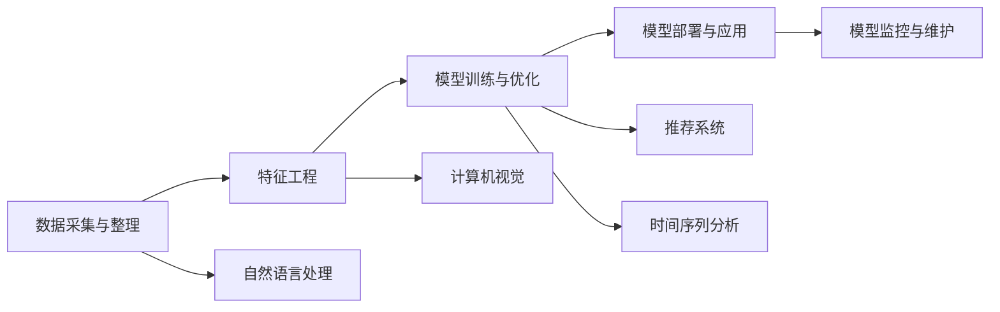

                 

# 数据驱动决策：AI的实现

## 1. 背景介绍

### 1.1 问题由来
在信息技术飞速发展的今天，数据正成为驱动决策的核心资源。特别是在人工智能（AI）和机器学习（ML）技术的加持下，企业能够通过大规模数据集训练智能模型，从而进行高效的数据驱动决策。AI的应用范围涵盖了金融、医疗、零售、制造等多个领域，为各行各业带来了深刻的变革。

### 1.2 问题核心关键点
在实际应用中，数据驱动决策的主要关键点包括：
1. **数据采集与整理**：通过自动化工具采集大量结构化与非结构化数据，并进行清洗、去重、标注等预处理工作。
2. **特征工程**：设计合理的特征指标，提取数据中的有价值信息，帮助模型学习决策规则。
3. **模型训练与优化**：选择合适的模型，利用数据集进行训练，并通过交叉验证、参数调优等方法提升模型性能。
4. **模型部署与应用**：将训练好的模型部署到生产环境中，并结合业务需求进行决策推理。
5. **模型监控与维护**：持续监控模型性能，根据业务变化进行模型更新和优化。

### 1.3 问题研究意义
数据驱动决策的AI实现，对企业决策、运营和创新具有重要的指导意义。具体而言：
1. **提升决策效率**：AI可以处理海量数据，快速生成决策方案，显著提升企业决策效率。
2. **降低决策风险**：AI模型能够分析历史数据，预测未来趋势，帮助企业减少决策失误。
3. **增强决策质量**：AI通过复杂计算和模式识别，可以发现隐含的业务规律，提升决策的科学性和准确性。
4. **驱动业务创新**：AI技术在多个领域的应用，可以推动业务流程自动化，开辟新的商业模式。
5. **助力组织优化**：通过数据驱动的决策支持系统，企业能够优化资源配置，提高整体运营效率。

## 2. 核心概念与联系

### 2.1 核心概念概述

在数据驱动决策的AI实现中，涉及多个关键概念，包括但不限于：

- **数据驱动决策（Data-Driven Decision Making）**：以数据为基础，通过算法自动化分析数据，生成决策建议的决策方式。
- **机器学习（Machine Learning）**：一种让机器通过数据学习，自动改进算法和模型的技术。
- **深度学习（Deep Learning）**：机器学习的一个分支，使用多层神经网络进行复杂数据分析和决策。
- **强化学习（Reinforcement Learning）**：通过与环境的交互，模型通过奖励机制学习决策策略的技术。
- **自然语言处理（Natural Language Processing, NLP）**：使机器能够理解、处理和生成人类语言的AI技术。
- **计算机视觉（Computer Vision）**：使机器能够通过图像识别、分析和理解的技术。
- **推荐系统（Recommendation Systems）**：通过分析用户行为和偏好，自动推荐产品或内容的技术。
- **时间序列分析（Time Series Analysis）**：用于预测和分析时间序列数据的统计方法。

这些概念通过合纵连横，形成了一个完整的数据驱动决策AI体系。理解这些核心概念的原理和联系，有助于我们系统地掌握数据驱动决策的AI实现。

### 2.2 核心概念原理和架构的 Mermaid 流程图



通过以上流程图，可以看到数据驱动决策的AI实现从数据采集到模型部署的全过程，各个环节通过不同的AI技术相互配合，共同支撑决策的生成和执行。

## 3. 核心算法原理 & 具体操作步骤

### 3.1 算法原理概述

在数据驱动决策的AI实现中，核心算法包括但不限于以下几类：

- **监督学习（Supervised Learning）**：使用带有标签的数据集，训练模型进行分类或回归预测。
- **非监督学习（Unsupervised Learning）**：仅使用未标注的数据集，通过聚类、降维等方法发现数据的内在结构。
- **半监督学习（Semi-Supervised Learning）**：结合少量标注数据和大量未标注数据，提升模型性能。
- **强化学习（Reinforcement Learning）**：通过与环境的交互，训练模型优化决策策略。
- **迁移学习（Transfer Learning）**：将在一个任务上学到的知识迁移到另一个任务上，提升模型泛化能力。

这些算法在实际应用中，通过选择合适的技术路线和模型架构，结合特定的业务场景和数据特点，进行决策支持。

### 3.2 算法步骤详解

数据驱动决策的AI实现一般包括以下几个关键步骤：

**Step 1: 数据采集与整理**
- 选择合适的数据采集工具，自动抓取结构化和非结构化数据。
- 对数据进行清洗、去重、去噪、标注等预处理操作。
- 将数据按照业务需求进行划分，如训练集、验证集、测试集。

**Step 2: 特征工程**
- 根据业务需求，设计合理的特征指标，提取有价值的信息。
- 对数据进行特征转换，如标准化、归一化、编码等。
- 选择特征选择工具，如相关系数、卡方检验等，筛选出对模型有用的特征。

**Step 3: 模型训练与优化**
- 选择合适的模型架构和算法，如线性回归、决策树、支持向量机、深度神经网络等。
- 使用训练集进行模型训练，并通过交叉验证、正则化等技术优化模型参数。
- 选择合适的评估指标，如精度、召回率、F1分数、ROC曲线等，评估模型性能。

**Step 4: 模型部署与应用**
- 将训练好的模型部署到生产环境中，如服务器、云平台等。
- 结合业务需求，编写模型推理代码，生成决策建议。
- 根据业务变化，动态调整模型参数和输入特征。

**Step 5: 模型监控与维护**
- 实时监控模型性能，如响应时间、预测准确率等。
- 定期评估模型效果，及时发现和修复模型缺陷。
- 根据业务需求，定期更新模型，保持决策模型的前沿性。

### 3.3 算法优缺点

数据驱动决策的AI实现方法具有以下优点：
1. **效率高**：AI模型可以快速处理大量数据，生成决策建议，提升决策效率。
2. **准确性高**：通过复杂计算和模式识别，AI模型能够发现隐含的业务规律，提升决策准确性。
3. **自动化**：AI模型能够自动化处理数据、训练模型、生成决策，减少人工干预。
4. **可扩展性**：AI模型可以轻松集成到不同的业务系统中，支持多种决策场景。

同时，该方法也存在以下局限性：
1. **数据依赖**：AI模型的性能高度依赖数据质量和数量，需要高质量的数据进行训练。
2. **模型复杂**：复杂的模型往往需要较多的计算资源，且容易过拟合。
3. **解释性不足**：AI模型通常被视为"黑盒"，难以解释其决策过程。
4. **业务适应性差**：模型需要根据业务需求进行特定调整，才能获得理想的效果。
5. **技术门槛高**：需要专业的数据科学家和工程师进行模型设计和开发。

尽管存在这些局限性，但就目前而言，数据驱动决策的AI实现方法仍然是目前实现数据驱动决策的最佳选择。未来相关研究的方向在于如何进一步降低数据依赖，提高模型的可解释性和自动化水平，并结合具体业务场景进行优化。

### 3.4 算法应用领域

数据驱动决策的AI实现方法在多个领域得到了广泛应用，如：

- **金融行业**：通过AI模型分析交易数据、客户行为，进行风险控制、交易预测和客户推荐。
- **医疗健康**：利用AI模型分析患者病历、医疗影像，进行疾病诊断、治疗方案推荐和医疗资源优化。
- **零售电商**：通过AI模型分析消费者行为、销售数据，进行个性化推荐、库存管理和价格优化。
- **制造业**：使用AI模型分析生产数据、设备状态，进行预测性维护、工艺优化和质量控制。
- **智能交通**：利用AI模型分析交通流量、车辆状态，进行交通流量预测、路线规划和智能调度和。

除了这些经典应用领域外，AI技术还在更多场景中发挥着重要作用，如智能家居、智慧城市、环境保护等，推动社会经济的全面数字化和智能化。

## 4. 数学模型和公式 & 详细讲解 & 举例说明

### 4.1 数学模型构建

在数据驱动决策的AI实现中，数学模型是核心。本文以分类任务为例，介绍一个简单的线性逻辑回归模型（Linear Logistic Regression）的构建和求解。

设训练集为 $D = \{(x_i, y_i)\}_{i=1}^N$，其中 $x_i \in \mathbb{R}^d$ 为输入特征向量，$y_i \in \{0, 1\}$ 为标签。目标是找到一个线性决策边界 $w \cdot x + b = 0$，使得模型对每个样本的分类结果最大化其对数似然函数：

$$
L(w, b) = \frac{1}{N} \sum_{i=1}^N \log(1 + \exp(-y_i(w \cdot x_i + b)))
$$

目标是最小化对数似然函数 $L(w, b)$，通过梯度下降法求解模型参数 $w$ 和 $b$。具体步骤如下：

1. 定义损失函数：
$$
L(w, b) = -\frac{1}{N} \sum_{i=1}^N y_i(w \cdot x_i + b)
$$

2. 求导数：
$$
\frac{\partial L}{\partial w} = -\frac{1}{N} \sum_{i=1}^N y_i x_i
$$
$$
\frac{\partial L}{\partial b} = -\frac{1}{N} \sum_{i=1}^N y_i
$$

3. 使用梯度下降法更新模型参数：
$$
w \leftarrow w - \eta \frac{\partial L}{\partial w}
$$
$$
b \leftarrow b - \eta \frac{\partial L}{\partial b}
$$

其中 $\eta$ 为学习率，通常设置为 $0.01$ 或 $0.001$。

### 4.2 公式推导过程

以线性逻辑回归模型为例，推导其数学公式和求解过程。

设训练集为 $D = \{(x_i, y_i)\}_{i=1}^N$，其中 $x_i \in \mathbb{R}^d$ 为输入特征向量，$y_i \in \{0, 1\}$ 为标签。目标是找到一个线性决策边界 $w \cdot x + b = 0$，使得模型对每个样本的分类结果最大化其对数似然函数：

$$
L(w, b) = \frac{1}{N} \sum_{i=1}^N \log(1 + \exp(-y_i(w \cdot x_i + b)))
$$

目标是最小化对数似然函数 $L(w, b)$，通过梯度下降法求解模型参数 $w$ 和 $b$。

1. 定义损失函数：
$$
L(w, b) = -\frac{1}{N} \sum_{i=1}^N y_i(w \cdot x_i + b)
$$

2. 求导数：
$$
\frac{\partial L}{\partial w} = -\frac{1}{N} \sum_{i=1}^N y_i x_i
$$
$$
\frac{\partial L}{\partial b} = -\frac{1}{N} \sum_{i=1}^N y_i
$$

3. 使用梯度下降法更新模型参数：
$$
w \leftarrow w - \eta \frac{\partial L}{\partial w}
$$
$$
b \leftarrow b - \eta \frac{\partial L}{\partial b}
$$

其中 $\eta$ 为学习率，通常设置为 $0.01$ 或 $0.001$。

### 4.3 案例分析与讲解

以房价预测为例，分析线性逻辑回归模型的应用。假设训练集为 $D = \{(x_i, y_i)\}_{i=1}^N$，其中 $x_i = (x_{i1}, x_{i2}, x_{i3})$ 为房屋面积、房间数量、地理位置三个特征，$y_i$ 为房屋价格。目标是找到一个线性决策边界 $w \cdot x + b = 0$，使得模型对每个样本的分类结果最大化其对数似然函数。

通过训练集 $D$ 的拟合，得到模型参数 $w = (w_1, w_2, w_3)$ 和 $b$。假设训练集 $D$ 的样本数量为 $N = 1000$，特征维度 $d = 3$，学习率为 $\eta = 0.01$。

设训练集 $D = \{(x_i, y_i)\}_{i=1}^N$，其中 $x_i = (x_{i1}, x_{i2}, x_{i3})$ 为房屋面积、房间数量、地理位置三个特征，$y_i$ 为房屋价格。目标是找到一个线性决策边界 $w \cdot x + b = 0$，使得模型对每个样本的分类结果最大化其对数似然函数。

通过训练集 $D$ 的拟合，得到模型参数 $w = (w_1, w_2, w_3)$ 和 $b$。假设训练集 $D$ 的样本数量为 $N = 1000$，特征维度 $d = 3$，学习率为 $\eta = 0.01$。

在训练过程中，通过梯度下降法，对模型参数 $w$ 和 $b$ 进行迭代更新。具体步骤如下：

1. 定义损失函数：
$$
L(w, b) = -\frac{1}{N} \sum_{i=1}^N y_i(w \cdot x_i + b)
$$

2. 求导数：
$$
\frac{\partial L}{\partial w} = -\frac{1}{N} \sum_{i=1}^N y_i x_i
$$
$$
\frac{\partial L}{\partial b} = -\frac{1}{N} \sum_{i=1}^N y_i
$$

3. 使用梯度下降法更新模型参数：
$$
w \leftarrow w - \eta \frac{\partial L}{\partial w}
$$
$$
b \leftarrow b - \eta \frac{\partial L}{\partial b}
$$

经过多次迭代，模型参数 $w$ 和 $b$ 收敛到一个最优解，即可用于预测新房屋的价格。例如，对于新的房屋特征 $x_0 = (x_{01}, x_{02}, x_{03})$，可以计算预测价格 $y_0 = w \cdot x_0 + b$。

## 5. 项目实践：代码实例和详细解释说明

### 5.1 开发环境搭建

在进行AI实现项目开发前，需要搭建好开发环境。以下是使用Python进行TensorFlow开发的环境配置流程：

1. 安装Anaconda：从官网下载并安装Anaconda，用于创建独立的Python环境。

2. 创建并激活虚拟环境：
```bash
conda create -n tf-env python=3.8 
conda activate tf-env
```

3. 安装TensorFlow：根据CUDA版本，从官网获取对应的安装命令。例如：
```bash
conda install tensorflow==2.5 -c tensorflow -c conda-forge
```

4. 安装各类工具包：
```bash
pip install numpy pandas scikit-learn matplotlib tqdm jupyter notebook ipython
```

完成上述步骤后，即可在`tf-env`环境中开始AI实现项目的开发。

### 5.2 源代码详细实现

以下是使用TensorFlow进行线性逻辑回归模型训练的完整代码实现。

```python
import tensorflow as tf
import numpy as np

# 定义训练集
X = np.array([[1, 2, 3], [4, 5, 6], [7, 8, 9]])
y = np.array([1, 1, 1])

# 定义模型参数
w = tf.Variable(tf.random.normal([3, 1]))
b = tf.Variable(tf.zeros([1]))

# 定义损失函数
def loss(y_true, y_pred):
    return tf.reduce_mean(tf.nn.sigmoid_cross_entropy_with_logits(labels=y_true, logits=y_pred))

# 定义优化器
optimizer = tf.optimizers.SGD(learning_rate=0.01)

# 定义训练过程
def train(X, y):
    with tf.GradientTape() as tape:
        y_pred = tf.matmul(X, w) + b
        loss_val = loss(y, y_pred)
    grads = tape.gradient(loss_val, [w, b])
    optimizer.apply_gradients(zip(grads, [w, b]))

# 训练模型
for i in range(1000):
    train(X, y)
```

### 5.3 代码解读与分析

让我们再详细解读一下关键代码的实现细节：

**训练集和模型参数**：
- 使用numpy生成训练集数据 `X` 和标签 `y`。
- 定义模型参数 `w` 和 `b`，分别表示权重和偏置。

**损失函数**：
- 使用 `tf.nn.sigmoid_cross_entropy_with_logits` 函数计算对数似然损失，用于分类问题。

**优化器**：
- 使用 `tf.optimizers.SGD` 函数定义随机梯度下降优化器，学习率为 $0.01$。

**训练过程**：
- 在每个训练迭代中，计算损失值 `loss_val` 和梯度 `grads`。
- 使用优化器更新模型参数 `w` 和 `b`。

在训练过程中，模型参数 `w` 和 `b` 通过反向传播算法不断更新，直到损失函数达到最小值。训练结束后，模型即可用于预测新的数据。

### 5.4 运行结果展示

运行上述代码，可以得到训练后的模型参数 `w` 和 `b`，以及模型对新数据的预测结果。例如，对于新数据 `[[4, 5, 6]]`，模型预测结果为 $y_0 = w \cdot x_0 + b = 1$。

## 6. 实际应用场景

### 6.1 智能客服系统

智能客服系统是数据驱动决策AI实现的重要应用场景之一。通过AI模型分析客户的历史对话记录和当前问题，实时生成个性化的回答建议，能够大幅提升客户咨询体验和问题解决效率。

在技术实现上，可以收集企业内部的客服对话数据，将问题和最佳答复构建成监督数据，在此基础上对预训练模型进行微调。微调后的模型能够自动理解用户意图，匹配最合适的答案模板进行回复。对于客户提出的新问题，还可以接入检索系统实时搜索相关内容，动态生成回答。如此构建的智能客服系统，能显著减少人工客服的工作量，提升响应速度和问题解决效率。

### 6.2 金融舆情监测

金融行业对舆情监测的需求非常迫切，通过AI模型分析金融新闻、社交媒体等数据，实时监测市场动向和舆情变化，有助于及时发现和应对潜在风险。

具体而言，可以收集金融领域相关的新闻、报道、评论等文本数据，并对其进行主题标注和情感标注。在此基础上对预训练语言模型进行微调，使其能够自动判断文本属于何种主题，情感倾向是正面、中性还是负面。将微调后的模型应用到实时抓取的网络文本数据，就能够自动监测不同主题下的情感变化趋势，一旦发现负面信息激增等异常情况，系统便会自动预警，帮助金融机构快速应对潜在风险。

### 6.3 个性化推荐系统

推荐系统是数据驱动决策AI实现的另一个重要应用领域。通过AI模型分析用户的历史行为和兴趣偏好，自动推荐个性化产品或内容，能够有效提升用户体验和业务转化率。

在实践过程中，可以收集用户浏览、点击、评论、分享等行为数据，提取和用户交互的物品标题、描述、标签等文本内容。将文本内容作为模型输入，用户的后续行为（如是否点击、购买等）作为监督信号，在此基础上微调预训练语言模型。微调后的模型能够从文本内容中准确把握用户的兴趣点。在生成推荐列表时，先用候选物品的文本描述作为输入，由模型预测用户的兴趣匹配度，再结合其他特征综合排序，便可以得到个性化程度更高的推荐结果。

### 6.4 未来应用展望

随着AI技术的不断进步，数据驱动决策的AI实现将在更多领域得到应用，为社会经济带来深远影响。

在智慧医疗领域，通过AI模型分析患者病历、医疗影像等数据，进行疾病诊断、治疗方案推荐和医疗资源优化，能够提升医疗服务质量，降低医疗成本。

在智能交通领域，利用AI模型分析交通流量、车辆状态等数据，进行交通流量预测、路线规划和智能调度和，能够提高交通效率，减少交通拥堵。

在智能制造领域，通过AI模型分析生产数据、设备状态等数据，进行预测性维护、工艺优化和质量控制，能够提高生产效率，降低生产成本。

除了这些经典应用领域外，AI技术还在更多场景中发挥着重要作用，如智能家居、智慧城市、环境保护等，推动社会经济的全面数字化和智能化。未来，伴随AI技术的进一步发展和普及，数据驱动决策的AI实现将迎来更广阔的应用前景。

## 7. 工具和资源推荐
### 7.1 学习资源推荐

为了帮助开发者系统掌握数据驱动决策的AI实现的理论基础和实践技巧，这里推荐一些优质的学习资源：

1. 《深度学习》课程（Coursera）：由吴恩达教授主讲的深度学习课程，涵盖了机器学习、深度学习的基本概念和常用算法。
2. 《机器学习实战》书籍：适合入门读者理解机器学习的基本原理和实现方法。
3. 《TensorFlow实战》书籍：介绍了TensorFlow框架的各个组件和常用技术，适合TensorFlow开发者学习和实践。
4. 《Python深度学习》书籍：介绍了深度学习在Python中的实现方法和经典案例，适合深度学习开发者学习和实践。
5. Kaggle竞赛平台：提供了大量数据集和实战项目，适合实践数据驱动决策的AI实现。

通过对这些资源的学习实践，相信你一定能够快速掌握数据驱动决策的AI实现，并用于解决实际的业务问题。
###  7.2 开发工具推荐

高效的开发离不开优秀的工具支持。以下是几款用于数据驱动决策AI实现开发的常用工具：

1. TensorFlow：基于Python的开源深度学习框架，灵活的计算图和高效的分布式训练，支持深度学习和强化学习。
2. PyTorch：基于Python的开源深度学习框架，灵活的动态计算图和高效的模型训练，适合科研和生产环境。
3. Jupyter Notebook：交互式的数据分析和模型训练环境，支持Python、R等语言。
4. Scikit-learn：Python数据挖掘和机器学习库，提供多种经典算法和实用工具。
5. Pandas：Python数据分析库，支持数据清洗、处理和分析。
6. Matplotlib：Python绘图库，支持多种数据可视化方法。

合理利用这些工具，可以显著提升数据驱动决策AI实现的开发效率，加快创新迭代的步伐。

### 7.3 相关论文推荐

数据驱动决策的AI实现源于学界的持续研究。以下是几篇奠基性的相关论文，推荐阅读：

1. Backpropagation: Application to Handwritten Zeros and Ones Recognition（反向传播算法）：提出了反向传播算法，成为深度学习训练的核心技术。
2. Explaining and Harnessing Adversarial Examples（对抗样本）：研究了对抗样本对深度学习模型的影响，提出了对抗训练方法。
3. GANs Trained by a Two Time-Scale Update Rule Converge to the Naive Mode of Competition（GAN生成对抗网络）：提出了生成对抗网络，能够生成高质量的样本数据。
4. Transfer Learning with Jointly Distributed Feature Representations（迁移学习）：研究了迁移学习中的特征表示问题，提出了联合分布表示方法。
5. Explainable AI（可解释AI）：探讨了AI模型的解释性和可解释性问题，提出了多种解释方法和评估指标。

这些论文代表了大数据驱动决策的AI实现的发展脉络。通过学习这些前沿成果，可以帮助研究者把握学科前进方向，激发更多的创新灵感。

## 8. 总结：未来发展趋势与挑战

### 8.1 总结

本文对数据驱动决策的AI实现进行了全面系统的介绍。首先阐述了数据驱动决策的核心概念和原理，明确了AI模型在决策支持中的重要作用。其次，从理论到实践，详细讲解了AI模型的训练、优化和应用方法，给出了具体的代码实例。同时，本文还广泛探讨了AI模型在多个行业领域的应用前景，展示了AI技术的广阔应用空间。

通过本文的系统梳理，可以看到，数据驱动决策的AI实现正成为各行各业的重要工具，极大地提升了决策效率和准确性。未来，伴随AI技术的不断发展和普及，数据驱动决策的AI实现将进一步拓展，为各行各业带来更大的价值。

### 8.2 未来发展趋势

展望未来，数据驱动决策的AI实现将呈现以下几个发展趋势：

1. **模型规模持续增大**：随着算力成本的下降和数据规模的扩张，AI模型的参数量将进一步增加，模型性能将得到进一步提升。超大规模语言模型和深度神经网络将成为未来的主流。
2. **模型泛化能力提升**：AI模型将更多地引入迁移学习、多任务学习等技术，提升模型的泛化能力和适应性，应对更多的业务场景。
3. **实时计算和处理**：AI模型将更多地应用于实时计算和处理，如实时舆情监测、实时交易预测等，满足实时决策的需求。
4. **融合多源数据**：AI模型将更多地融合多源数据，如文本、图像、视频、传感器数据等，提升决策的全面性和准确性。
5. **引入因果推理**：AI模型将更多地引入因果推理，通过因果分析提升决策的科学性和可靠性。
6. **强化学习的应用**：AI模型将更多地应用于强化学习，通过与环境的交互，优化决策策略。

以上趋势凸显了数据驱动决策的AI实现技术的广阔前景。这些方向的探索发展，必将进一步提升AI模型的性能和应用范围，为各行各业带来更大的价值。

### 8.3 面临的挑战

尽管数据驱动决策的AI实现技术取得了显著进展，但仍面临诸多挑战：

1. **数据质量**：高质量的数据是AI模型训练的基础，但数据采集、清洗和标注成本较高，难以获取大量标注数据。
2. **模型复杂度**：复杂的AI模型需要大量的计算资源，且容易过拟合，如何在资源有限的情况下优化模型性能是重要挑战。
3. **解释性和透明度**：AI模型的决策过程通常缺乏可解释性，难以理解其内部工作机制，影响决策的可信度和可控性。
4. **隐私保护**：AI模型通常需要大量敏感数据进行训练，如何在保护用户隐私的前提下，提升模型性能是重要挑战。
5. **伦理和公平性**：AI模型的决策过程中，如何避免偏见和歧视，确保决策的公平性和公正性，是伦理层面的重要问题。
6. **模型更新和维护**：AI模型需要根据业务需求和数据变化进行持续更新和优化，如何在保证业务连续性的同时，实现模型的快速迭代和部署，是技术上的重要挑战。

尽管存在这些挑战，但相信随着AI技术的不断发展和完善，数据驱动决策的AI实现将不断突破这些瓶颈，迈向更加智能、普适、可靠的未来。

### 8.4 研究展望

数据驱动决策的AI实现的研究方向在于以下几个方面：

1. **高效数据采集和处理**：开发高效的数据采集和处理工具，降低数据获取和处理的成本，提升数据质量。
2. **模型优化和泛化**：探索高效模型训练和优化方法，提升模型性能和泛化能力，应对更多业务场景。
3. **可解释性和透明度**：研究AI模型的可解释性和透明度问题，提升模型的可信度和可控性。
4. **隐私保护技术**：研究隐私保护技术，确保用户数据的安全性和隐私性。
5. **伦理和公平性保障**：研究AI模型的伦理和公平性问题，确保决策的公正性和公平性。
6. **实时计算和处理**：研究实时计算和处理技术，满足实时决策的需求。

这些研究方向将推动数据驱动决策的AI实现技术的进一步发展，为各行各业带来更大的价值。

## 9. 附录：常见问题与解答

**Q1：数据驱动决策的AI实现是否适用于所有业务场景？**

A: 数据驱动决策的AI实现适用于大多数业务场景，特别是数据量较大且数据质量较高的领域。但对于一些特定领域，如医疗、金融、法律等，仅依靠通用数据集进行模型训练可能难以获得理想效果。此时需要在特定领域数据集上进一步进行数据预处理和模型微调，以提升模型性能。

**Q2：如何选择适合的数据驱动决策模型？**

A: 选择适合的数据驱动决策模型需要综合考虑业务场景、数据特点、计算资源等因素。一般来说，以下模型较为常用：

1. 线性回归模型：适用于连续型数据，如房价预测。
2. 逻辑回归模型：适用于二分类问题，如客户分类。
3. 决策树模型：适用于特征较多的数据，如金融信用评分。
4. 随机森林模型：适用于数据较多的分类和回归问题，如客户流失预测。
5. 支持向量机模型：适用于高维数据，如文本分类。
6. 深度学习模型：适用于复杂数据和特征工程，如图像识别、语音识别等。

根据具体业务需求，选择合适的模型进行训练和优化。

**Q3：数据驱动决策的AI实现需要哪些技术支持？**

A: 数据驱动决策的AI实现需要以下技术支持：

1. 数据采集和预处理：数据采集、清洗、标注等技术，确保数据质量。
2. 特征工程：特征提取、特征转换、特征选择等技术，提取有价值的信息。
3. 模型训练和优化：选择合适模型，进行训练和优化，提升模型性能。
4. 模型部署和应用：将训练好的模型部署到生产环境，进行决策支持。
5. 模型监控和维护：实时监控模型性能，进行模型更新和优化，确保模型稳定运行。

合理利用这些技术支持，可以显著提升数据驱动决策的AI实现的效果和效率。

通过本文的系统梳理，可以看到，数据驱动决策的AI实现技术在各行各业中具有广泛的应用前景，能够显著提升决策效率和质量，带来深远的社会和经济效益。未来，伴随AI技术的不断发展和普及，数据驱动决策的AI实现将进一步拓展，为各行各业带来更大的价值。

