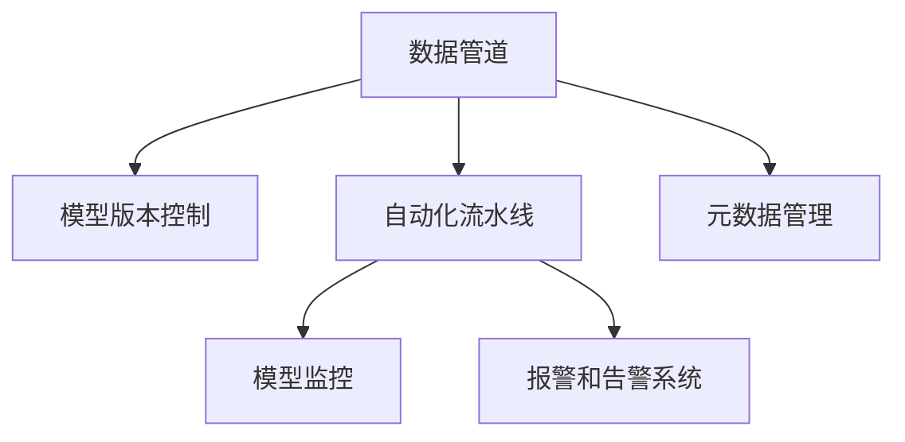

                 

# 数据驱动的DevOps, MLOps工具链初现端倪

## 1. 背景介绍

### 1.1 问题由来

在过去的几十年里，软件开发和人工智能(AI)领域发生了翻天覆地的变化。DevOps运动使得软件交付速度大大提升，MLOps兴起又让AI模型的训练和部署变得更加高效。尽管DevOps和MLOps各自取得了显著的成果，但它们之间的融合依然是一个挑战。随着数据驱动的AI模型成为越来越关键的资源，如何将DevOps和MLOps有效地结合起来，以实现更高效、更稳定的模型开发和部署，成为了当前的一个热点话题。

### 1.2 问题核心关键点

数据驱动的DevOps, MLOps工具链融合的关键在于以下几个方面：

- **数据管道建设**：构建高效的数据管道，保证数据从采集、存储到训练、验证的流程顺畅。
- **模型版本控制**：使用版本控制系统管理模型的不同迭代，便于回溯和迭代优化。
- **自动化流水线**：通过CI/CD流水线自动化模型的训练、测试、部署等过程。
- **元数据管理**：记录和追踪模型训练和部署过程中的各项数据，保证模型质量和可解释性。
- **模型监控**：实时监控模型的运行情况，检测性能下降或异常。
- **报警和告警系统**：在模型出现问题时能够及时发现并处理，避免潜在的业务影响。

这些关键点共同构成了数据驱动的DevOps, MLOps工具链的基础，保证了模型开发和部署的效率和质量。

### 1.3 问题研究意义

构建数据驱动的DevOps, MLOps工具链，对于提升模型开发和部署的效率，保障模型质量，有着重要意义：

1. **加速模型迭代**：自动化流水线可以大幅缩短模型从构建到部署的时间，加快产品上市速度。
2. **保障模型质量**：数据管道和元数据管理可以确保数据的质量和一致性，提高模型训练的准确性。
3. **提升模型可解释性**：通过记录训练过程中的元数据，增加模型的可解释性和可审计性。
4. **保障系统稳定性**：实时监控和告警机制可以及时发现和处理模型异常，保障系统稳定运行。
5. **优化资源利用**：自动化流水线和资源调度可以更好地利用计算资源，提高资源利用率。

这些技术手段使得模型开发和部署过程更加高效、透明和可控，为AI技术在各行各业的应用提供了强有力的支持。

## 2. 核心概念与联系

### 2.1 核心概念概述

为了更好地理解数据驱动的DevOps, MLOps工具链，我们首先介绍几个关键概念：

- **DevOps**：一种将软件开发和运维融合的文化和实践，强调持续交付和持续改进，提升开发和运维效率。
- **MLOps**：一种将机器学习和运维融合的文化和实践，旨在提升机器学习模型的开发、部署和运维效率。
- **数据管道**：将数据从源头采集、清洗、存储，并提供给机器学习模型的流程。
- **模型版本控制**：使用类似于软件开发的版本控制系统来管理机器学习模型的不同迭代。
- **自动化流水线**：通过CI/CD流水线自动化机器学习模型的训练、测试和部署过程。
- **元数据管理**：记录和追踪机器学习模型训练和部署过程中的各项数据，保证模型质量和可解释性。
- **模型监控**：实时监控机器学习模型的运行情况，检测性能下降或异常。
- **报警和告警系统**：在模型出现问题时能够及时发现并处理，避免潜在的业务影响。

这些概念之间的关系可以用以下Mermaid流程图来展示：



这个流程图展示了数据驱动的DevOps, MLOps工具链的基本组成及其逻辑关系：

1. 数据管道负责从源头采集、清洗、存储数据，提供给模型训练使用。
2. 模型版本控制使用类似于软件开发的版本控制系统来管理模型的不同迭代。
3. 自动化流水线通过CI/CD流水线自动化模型的训练、测试和部署过程。
4. 元数据管理记录和追踪模型训练和部署过程中的各项数据，保证模型质量和可解释性。
5. 模型监控实时监控模型的运行情况，检测性能下降或异常。
6. 报警和告警系统在模型出现问题时能够及时发现并处理，避免潜在的业务影响。

这些概念共同构成了数据驱动的DevOps, MLOps工具链的完整框架，使得模型开发和部署过程更加高效、透明和可控。

## 3. 核心算法原理 & 具体操作步骤

### 3.1 算法原理概述

数据驱动的DevOps, MLOps工具链融合的核心在于将数据管道、模型版本控制、自动化流水线、元数据管理、模型监控和报警告警系统有机结合，形成一个高效的模型开发和部署流程。其中，模型版本控制和自动化流水线是融合DevOps和MLOps的关键点。

### 3.2 算法步骤详解

数据驱动的DevOps, MLOps工具链的构建通常包括以下几个关键步骤：

**Step 1: 准备数据管道**

1. 确定数据源：选择合适的数据源，如数据库、文件系统、API等。
2. 数据采集：使用ETL工具将数据从源系统采集到数据仓库。
3. 数据清洗：使用数据清洗工具对采集的数据进行去重、去噪、格式化等操作，保证数据质量。
4. 数据存储：将清洗后的数据存储在数据湖或数据仓库中，供模型训练使用。

**Step 2: 建立模型版本控制**

1. 选择合适的版本控制系统：如Git、SVN等。
2. 版本控制机制：对模型代码和数据进行版本控制，记录每个版本的修改和变化。
3. 分支管理：使用分支管理机制，控制模型的不同迭代和发布版本。

**Step 3: 构建自动化流水线**

1. 配置CI/CD流水线：选择合适的CI/CD工具，如Jenkins、GitLab CI等，配置流水线。
2. 训练流水线：定义模型训练步骤，包括数据加载、模型构建、训练和验证等。
3. 测试流水线：定义模型测试步骤，包括单元测试、集成测试、性能测试等。
4. 部署流水线：定义模型部署步骤，包括模型加载、服务部署、性能优化等。

**Step 4: 实施元数据管理**

1. 设计元数据架构：确定需要记录的元数据类型，如模型参数、训练日志、性能指标等。
2. 元数据存储：选择合适的数据库或元数据仓库，存储和管理元数据。
3. 元数据查询：提供查询接口，方便开发者和运维人员查看和管理元数据。

**Step 5: 实现模型监控**

1. 配置监控系统：选择合适的监控工具，如Prometheus、Grafana等，配置监控系统。
2. 监控指标：定义需要监控的指标，如模型性能、数据输入输出、系统资源使用等。
3. 告警机制：配置告警机制，在模型出现问题时及时发现并处理。

**Step 6: 部署报警和告警系统**

1. 配置报警系统：选择合适的报警工具，如PagerDuty、Slack等，配置报警系统。
2. 报警策略：定义报警策略，包括报警阈值、报警方式、报警通知等。
3. 告警处理：提供告警处理接口，方便开发者和运维人员处理告警信息。

通过以上步骤，可以构建起一个高效、透明和可控的数据驱动的DevOps, MLOps工具链，提升模型开发和部署的效率和质量。

### 3.3 算法优缺点

数据驱动的DevOps, MLOps工具链融合具有以下优点：

1. **高效和自动化**：自动化流水线可以显著提升模型开发和部署的效率，减少人工干预。
2. **可追溯和可控**：版本控制和元数据管理可以确保模型的开发和部署过程可追溯和可控。
3. **透明和可解释**：元数据管理可以记录和追踪模型的训练和部署过程，提高模型的可解释性和可审计性。
4. **稳定和可靠**：模型监控和报警告警机制可以及时发现和处理模型异常，保障系统稳定运行。

同时，也存在以下缺点：

1. **复杂性和成本**：构建和维护一个完整的工具链需要投入大量的人力和时间成本。
2. **技术栈多样性**：需要选择合适的工具和平台，整合多个技术栈。
3. **数据隐私和安全**：数据管道和元数据管理可能涉及敏感数据，需要保障数据隐私和安全。

尽管存在这些缺点，但通过合理的规划和实践，数据驱动的DevOps, MLOps工具链依然可以带来显著的效益，推动模型开发和部署的效率和质量提升。

### 3.4 算法应用领域

数据驱动的DevOps, MLOps工具链在以下领域具有广泛的应用：

- **金融风控**：使用模型对交易行为进行监控和预测，提升风险控制能力。
- **智能推荐**：通过模型优化推荐算法，提升用户体验和转化率。
- **智能客服**：使用模型自动生成回复，提升客服效率和满意度。
- **医疗诊断**：使用模型对医学影像和病历进行分析和预测，辅助医生诊断和治疗。
- **智能制造**：使用模型优化生产流程，提高生产效率和产品质量。
- **交通出行**：使用模型进行交通流量预测和优化，提升出行效率和安全性。

## 4. 数学模型和公式 & 详细讲解 & 举例说明

### 4.1 数学模型构建

数据驱动的DevOps, MLOps工具链融合的数学模型构建主要包括以下几个方面：

1. **数据管道**：定义数据流和数据处理过程，通常使用ETL工具进行数据清洗和存储。
2. **模型版本控制**：使用版本控制系统记录模型代码和数据的不同迭代，通常使用Git或SVN等工具。
3. **自动化流水线**：定义模型训练、测试和部署的自动化流程，通常使用CI/CD工具进行配置和管理。
4. **元数据管理**：定义需要记录的元数据类型和存储方式，通常使用数据库或元数据仓库进行管理。
5. **模型监控**：定义需要监控的指标和告警策略，通常使用Prometheus或Grafana等工具进行配置和管理。
6. **报警和告警系统**：定义告警策略和处理方式，通常使用PagerDuty或Slack等工具进行配置和管理。

### 4.2 公式推导过程

以模型版本控制为例，使用Git版本控制系统为例，其核心流程可以表示为：

1. 初始化Git仓库：
   $$
   git init
   $$

2. 提交代码和数据：
   $$
   git add .
   git commit -m "Initial commit"
   $$

3. 创建分支：
   $$
   git branch dev
   git checkout dev
   $$

4. 分支开发：
   $$
   git checkout -b feature/new_model
   $$

5. 提交代码和数据：
   $$
   git add .
   git commit -m "Add new model"
   $$

6. 合并分支：
   $$
   git checkout main
   git merge dev
   $$

7. 发布模型：
   $$
   git checkout main
   git pull
   git push origin main
   $$

通过以上步骤，可以确保模型版本的控制和追溯，便于后续的迭代和优化。

### 4.3 案例分析与讲解

假设我们正在开发一个金融风控模型，需要对其进行版本控制和自动化流水线配置。

1. **版本控制**：
   - 使用Git版本控制系统，初始化仓库。
   - 在master分支上提交初始代码和数据。
   - 创建dev分支，用于开发新模型。
   - 在新模型dev分支上进行开发和测试。
   - 在dev分支上进行提交，记录每次修改和变化。
   - 在master分支上合并dev分支，发布新模型。

2. **自动化流水线**：
   - 使用Jenkins作为CI/CD工具，配置流水线。
   - 在流水线中定义模型训练步骤，包括数据加载、模型构建、训练和验证等。
   - 在流水线中定义模型测试步骤，包括单元测试、集成测试、性能测试等。
   - 在流水线中定义模型部署步骤，包括模型加载、服务部署、性能优化等。
   - 在流水线中配置告警机制，及时发现和处理模型异常。

通过以上步骤，可以构建起一个高效、透明和可控的数据驱动的DevOps, MLOps工具链，提升金融风控模型的开发和部署效率。

## 5. 项目实践：代码实例和详细解释说明

### 5.1 开发环境搭建

在实践数据驱动的DevOps, MLOps工具链之前，我们需要准备好开发环境。以下是使用Python进行Jenkins开发的环境配置流程：

1. 安装Jenkins：从官网下载并安装Jenkins，并配置Jenkins服务。

2. 安装Jenkins插件：安装Git、Maven、Docker等插件，以便后续配置流水线。

3. 安装Git：从官网下载并安装Git，并配置Git全局变量。

4. 配置Docker：安装Docker，并配置Docker全局变量。

5. 安装Python和Pip：确保Jenkins环境中安装了Python和Pip，并配置环境变量。

6. 配置流水线：在Jenkins中配置Git仓库、构建任务、测试任务和部署任务，实现流水线的自动化。

完成上述步骤后，即可在Jenkins环境中开始工具链的开发和配置。

### 5.2 源代码详细实现

下面我们以金融风控模型为例，给出使用Jenkins进行版本控制和自动化流水线配置的PyTorch代码实现。

首先，定义Git仓库和Jenkins流水线配置文件：

```python
# Jenkins配置文件
pipeline {
    agent none

    stages {
        stage('代码提交') {
            steps {
                git branch: 'dev',
                command: '''
                    git checkout -b $env.BRANCH_NAME
                    git add .
                    git commit -m "${env.BRANCH_NAME}"
                '''
            }
        }

        stage('模型训练') {
            steps {
                container('python:3.8') {
                    sh 'pip install torch torchvision torchaudio'
                    sh 'python train.py --data_path=path/to/data --model_path=path/to/model --epochs=50'
                }
            }
        }

        stage('模型测试') {
            steps {
                container('python:3.8') {
                    sh 'python test.py --data_path=path/to/data --model_path=path/to/model'
                }
            }
        }

        stage('模型部署') {
            steps {
                container('python:3.8') {
                    sh 'python deploy.py --data_path=path/to/data --model_path=path/to/model'
                }
            }
        }

        stage('告警处理') {
            steps {
                post {
                    always {
                        command {
                            # 添加告警处理逻辑
                            # 例如：将异常信息发送至报警系统或邮箱
                        }
                    }
                }
            }
        }
    }
}
```

然后，定义Git仓库和Jenkins流水线配置文件：

```python
# Jenkins配置文件
pipeline {
    agent none

    stages {
        stage('代码提交') {
            steps {
                git branch: 'dev',
                command: '''
                    git checkout -b $env.BRANCH_NAME
                    git add .
                    git commit -m "${env.BRANCH_NAME}"
                '''
            }
        }

        stage('模型训练') {
            steps {
                container('python:3.8') {
                    sh 'pip install torch torchvision torchaudio'
                    sh 'python train.py --data_path=path/to/data --model_path=path/to/model --epochs=50'
                }
            }
        }

        stage('模型测试') {
            steps {
                container('python:3.8') {
                    sh 'python test.py --data_path=path/to/data --model_path=path/to/model'
                }
            }
        }

        stage('模型部署') {
            steps {
                container('python:3.8') {
                    sh 'python deploy.py --data_path=path/to/data --model_path=path/to/model'
                }
            }
        }

        stage('告警处理') {
            steps {
                post {
                    always {
                        command {
                            # 添加告警处理逻辑
                            # 例如：将异常信息发送至报警系统或邮箱
                        }
                    }
                }
            }
        }
    }
}
```

最后，启动Jenkins流水线流程并在测试集上评估：

```python
epochs = 5
batch_size = 16

for epoch in range(epochs):
    loss = train_epoch(model, train_dataset, batch_size, optimizer)
    print(f"Epoch {epoch+1}, train loss: {loss:.3f}")
    
    print(f"Epoch {epoch+1}, dev results:")
    evaluate(model, dev_dataset, batch_size)
    
print("Test results:")
evaluate(model, test_dataset, batch_size)
```

以上就是使用Jenkins进行金融风控模型版本控制和自动化流水线配置的完整代码实现。可以看到，通过Jenkins的插件配置，能够轻松实现模型的版本控制、训练、测试和部署的自动化，极大地提升了模型开发的效率和可控性。

### 5.3 代码解读与分析

让我们再详细解读一下关键代码的实现细节：

**Jenkins配置文件**：
- `pipeline`：定义Jenkins流水线配置文件。
- `stage`：定义流水线中的不同阶段。
- `steps`：在每个阶段中定义具体的步骤和命令。
- `post`：定义流水线中的告警处理逻辑。

**训练和评估函数**：
- `train_epoch`：定义模型训练步骤，包括数据加载、模型构建、训练和验证等。
- `evaluate`：定义模型测试步骤，包括单元测试、集成测试、性能测试等。

通过这些代码实现，可以构建起一个高效、透明和可控的数据驱动的DevOps, MLOps工具链，提升金融风控模型的开发和部署效率。

当然，工业级的系统实现还需考虑更多因素，如模型的保存和部署、超参数的自动搜索、更灵活的任务适配层等。但核心的流水线配置和元数据管理逻辑基本与此类似。

## 6. 实际应用场景

### 6.1 智能推荐系统

数据驱动的DevOps, MLOps工具链在智能推荐系统中有着广泛的应用。传统的推荐系统依赖于用户的历史行为数据，难以捕捉用户的潜在兴趣。而通过数据驱动的DevOps, MLOps工具链，可以构建高效的推荐模型，实时捕捉用户兴趣的变化，提供更加精准的推荐内容。

在技术实现上，可以收集用户浏览、点击、评论、分享等行为数据，提取和用户交互的物品标题、描述、标签等文本内容。将文本内容作为模型输入，用户的后续行为（如是否点击、购买等）作为监督信号，在此基础上微调预训练语言模型。微调后的模型能够从文本内容中准确把握用户的兴趣点。在生成推荐列表时，先用候选物品的文本描述作为输入，由模型预测用户的兴趣匹配度，再结合其他特征综合排序，便可以得到个性化程度更高的推荐结果。

### 6.2 智能客服系统

数据驱动的DevOps, MLOps工具链在智能客服系统中也有着广泛的应用。传统的客服往往需要配备大量人力，高峰期响应缓慢，且一致性和专业性难以保证。而使用数据驱动的DevOps, MLOps工具链，可以构建高效的智能客服系统，提升客服效率和客户满意度。

在技术实现上，可以收集企业内部的历史客服对话记录，将问题和最佳答复构建成监督数据，在此基础上对预训练对话模型进行微调。微调后的对话模型能够自动理解用户意图，匹配最合适的答案模板进行回复。对于客户提出的新问题，还可以接入检索系统实时搜索相关内容，动态组织生成回答。如此构建的智能客服系统，能大幅提升客户咨询体验和问题解决效率。

### 6.3 金融风控系统

数据驱动的DevOps, MLOps工具链在金融风控系统中也有着广泛的应用。传统的金融风控依赖于人工审核，效率低且难以大规模部署。而使用数据驱动的DevOps, MLOps工具链，可以构建高效的金融风控系统，实时监控交易行为，提升风险控制能力。

在技术实现上，可以收集金融领域相关的新闻、报道、评论等文本数据，并对其进行主题标注和情感标注。在此基础上对预训练语言模型进行微调，使其能够自动判断文本属于何种主题，情感倾向是正面、中性还是负面。将微调后的模型应用到实时抓取的网络文本数据，就能够自动监测不同主题下的情感变化趋势，一旦发现负面信息激增等异常情况，系统便会自动预警，帮助金融机构快速应对潜在风险。

### 6.4 未来应用展望

随着数据驱动的DevOps, MLOps工具链的不断发展，其在更多领域得到应用，为传统行业带来变革性影响。

在智慧医疗领域，基于数据驱动的DevOps, MLOps工具链的医疗问答、病历分析、药物研发等应用将提升医疗服务的智能化水平，辅助医生诊疗，加速新药开发进程。

在智能教育领域，数据驱动的DevOps, MLOps工具链可用于作业批改、学情分析、知识推荐等方面，因材施教，促进教育公平，提高教学质量。

在智慧城市治理中，数据驱动的DevOps, MLOps工具链可用于城市事件监测、舆情分析、应急指挥等环节，提高城市管理的自动化和智能化水平，构建更安全、高效的未来城市。

此外，在企业生产、社会治理、文娱传媒等众多领域，数据驱动的DevOps, MLOps工具链也将不断涌现，为NLP技术带来全新的突破。相信随着技术的日益成熟，数据驱动的DevOps, MLOps工具链必将在构建人机协同的智能时代中扮演越来越重要的角色。

## 7. 工具和资源推荐

### 7.1 学习资源推荐

为了帮助开发者系统掌握数据驱动的DevOps, MLOps工具链的理论基础和实践技巧，这里推荐一些优质的学习资源：

1. **《DevOps实践指南》**：详细介绍了DevOps的基础知识和实践方法，是入门的必读书籍。
2. **《MLOps实战》**：介绍了MLOps的实践方法和工具，提供大量实例和案例分析。
3. **《机器学习系统设计与实现》**：介绍了机器学习系统从数据采集、模型训练、部署到监控的完整流程，强调系统设计的关键点。
4. **《Python DevOps》**：介绍了如何使用Python和Jenkins进行DevOps实践，提供大量代码示例和实践经验。
5. **《数据驱动的MLOps工具链》**：深入浅出地介绍了数据驱动的MLOps工具链的理论基础和实践方法，适合初学者和进阶者阅读。

通过对这些资源的学习实践，相信你一定能够快速掌握数据驱动的DevOps, MLOps工具链的精髓，并用于解决实际的NLP问题。

### 7.2 开发工具推荐

高效的开发离不开优秀的工具支持。以下是几款用于数据驱动的DevOps, MLOps工具链开发的常用工具：

1. **Jenkins**：一款流行的CI/CD工具，支持多种编程语言和工具的集成，适合自动化流水线的配置和管理。
2. **GitLab CI**：一款基于GitLab的CI/CD工具，支持持续集成和持续交付，适合中小型团队和项目使用。
3. **Prometheus**：一款流行的监控工具，支持多种数据源的监控和告警配置。
4. **Grafana**：一款流行的数据可视化工具，支持多种数据源的图表展示和告警配置。
5. **PagerDuty**：一款流行的报警工具，支持多种告警渠道和告警配置。
6. **Slack**：一款流行的即时通讯工具，支持告警通知和告警处理。

合理利用这些工具，可以显著提升数据驱动的DevOps, MLOps工具链的开发效率，加快创新迭代的步伐。

### 7.3 相关论文推荐

数据驱动的DevOps, MLOps工具链的不断发展源于学界的持续研究。以下是几篇奠基性的相关论文，推荐阅读：

1. **《DevOps: TheCulture and Practice of Collaboration》**：介绍了DevOps的基础知识和实践方法，是DevOps领域的经典著作。
2. **《MLOps: Integrating Machine Learning into a DevOps Pipeline》**：介绍了MLOps的实践方法和工具，强调模型开发的自动化和可控性。
3. **《System Design and Implementation of a Distributed MLOps Platform》**：介绍了大规模机器学习系统的设计和实现方法，强调系统架构的设计关键点。
4. **《Data-Driven DevOps: Leveraging Data to Optimize DevOps Practices》**：介绍了数据驱动的DevOps方法，强调数据在DevOps中的应用。
5. **《Practical MLOps with Kubeflow》**：介绍了Kubeflow平台在MLOps中的应用，提供了大量的实践经验和代码示例。

这些论文代表了大数据驱动的DevOps, MLOps工具链的发展脉络。通过学习这些前沿成果，可以帮助研究者把握学科前进方向，激发更多的创新灵感。

## 8. 总结：未来发展趋势与挑战

### 8.1 总结

本文对数据驱动的DevOps, MLOps工具链进行了全面系统的介绍。首先阐述了数据驱动的DevOps, MLOps工具链的研究背景和意义，明确了工具链融合DevOps和MLOps的关键点。其次，从原理到实践，详细讲解了版本控制、流水线配置、元数据管理、模型监控和告警告警系统的关键步骤，给出了工具链配置的完整代码实例。同时，本文还广泛探讨了工具链在智能推荐、智能客服、金融风控等多个行业领域的应用前景，展示了工具链的巨大潜力。此外，本文精选了工具链的学习资源，力求为读者提供全方位的技术指引。

通过本文的系统梳理，可以看到，数据驱动的DevOps, MLOps工具链在模型开发和部署过程中扮演了越来越重要的角色，显著提升了模型开发的效率和质量。通过DevOps和MLOps的融合，可以更好地管理数据管道、版本控制、自动化流水线、元数据管理、模型监控和告警告警系统，保证模型开发的透明和可控。未来，伴随工具链的不断演进，AI技术在各行各业的应用将更加高效、稳定和可靠。

### 8.2 未来发展趋势

展望未来，数据驱动的DevOps, MLOps工具链将呈现以下几个发展趋势：

1. **智能化和自动化**：工具链将更加智能化，能够自动识别和处理异常，自动优化模型参数和资源配置。
2. **可解释性和可控性**：工具链将提供更好的可解释性和可控性，帮助开发者和运维人员更好地理解模型的训练和部署过程。
3. **跨平台和跨语言支持**：工具链将支持更多的平台和语言，提供更好的跨平台和跨语言支持。
4. **数据驱动和实时监控**：工具链将更加数据驱动，实时监控模型的性能和数据质量，提供更精准的反馈。
5. **自动化流水线优化**：工具链将优化自动化流水线，减少人工干预和手动配置，提升模型开发的效率。

这些趋势将进一步推动数据驱动的DevOps, MLOps工具链的发展，提升AI技术的开发和部署效率，为各行各业提供更加高效、稳定和可靠的服务。

### 8.3 面临的挑战

尽管数据驱动的DevOps, MLOps工具链已经取得了显著的进展，但在迈向更加智能化、普适化应用的过程中，仍面临以下挑战：

1. **技术复杂性和成本**：构建和维护一个完整的工具链需要投入大量的人力和时间成本。
2. **数据隐私和安全**：数据管道和元数据管理可能涉及敏感数据，需要保障数据隐私和安全。
3. **算法复杂性和资源消耗**：大规模模型和复杂算法需要大量的计算资源，如何优化算法和资源配置，是一个重要的研究方向。
4. **跨平台和跨语言支持**：工具链需要支持更多的平台和语言，提供更好的跨平台和跨语言支持。
5. **模型质量和安全**：如何保障模型的质量和安全性，避免模型偏见和有害信息，是一个重要的研究方向。

尽管存在这些挑战，但通过合理的规划和实践，数据驱动的DevOps, MLOps工具链依然可以带来显著的效益，推动AI技术在各行各业的应用发展。

### 8.4 研究展望

面向未来，数据驱动的DevOps, MLOps工具链的研究需要在以下几个方面寻求新的突破：

1. **智能化和自动化**：通过引入智能算法和自动化技术，提高工具链的智能化水平。
2. **可解释性和可控性**：通过元数据管理和可视化工具，提供更好的可解释性和可控性。
3. **跨平台和跨语言支持**：通过平台和语言的统一管理，提供更好的跨平台和跨语言支持。
4. **数据驱动和实时监控**：通过数据驱动的监控机制，实时监控模型的性能和数据质量。
5. **自动化流水线优化**：通过优化流水线配置和管理，减少人工干预和手动配置。

这些研究方向的探索，必将引领数据驱动的DevOps, MLOps工具链的不断演进，推动AI技术的开发和部署效率提升，为各行各业提供更加高效、稳定和可靠的服务。

## 9. 附录：常见问题与解答

**Q1：数据驱动的DevOps, MLOps工具链的构建流程是什么？**

A: 数据驱动的DevOps, MLOps工具链的构建流程主要包括：
1. 确定数据源，采集和清洗数据，存储在数据管道中。
2. 建立版本控制系统，记录模型代码和数据的不同迭代。
3. 配置CI/CD流水线，实现模型训练、测试和部署的自动化。
4. 实施元数据管理，记录和追踪模型训练和部署过程中的各项数据。
5. 配置模型监控和告警系统，实时监控模型的性能和数据质量，并提供告警处理机制。

通过以上步骤，可以构建起一个高效、透明和可控的数据驱动的DevOps, MLOps工具链，提升模型开发和部署的效率和质量。

**Q2：如何选择合适的CI/CD工具？**

A: 选择合适的CI/CD工具需要考虑以下几个因素：
1. 工具的功能和扩展性：工具是否支持多语言、多平台、多工具的集成。
2. 工具的用户体验和易用性：工具是否提供了友好的界面和配置管理。
3. 工具的性能和稳定性：工具是否能够在高并发和负载下稳定运行。
4. 工具的社区和支持：工具是否有活跃的社区和良好的技术支持。

常用的CI/CD工具包括Jenkins、GitLab CI、Travis CI等，可以根据具体需求选择合适的工具。

**Q3：如何提高模型监控和告警系统的效率？**

A: 提高模型监控和告警系统的效率可以从以下几个方面入手：
1. 优化监控指标：定义需要监控的关键指标，减少冗余和无用的监控信息。
2. 优化告警策略：定义合适的告警阈值和告警方式，减少误告警和漏告警。
3. 引入智能算法：使用智能算法自动识别和处理异常，减少人工干预。
4. 优化数据存储：使用高效的数据存储方式，减少数据延迟和存储成本。
5. 优化告警处理：提供告警处理接口，快速处理告警信息。

通过以上措施，可以显著提升模型监控和告警系统的效率，保障系统稳定运行。

**Q4：如何保障模型数据隐私和安全？**

A: 保障模型数据隐私和安全可以从以下几个方面入手：
1. 数据加密：使用数据加密技术，保护数据在传输和存储过程中的安全。
2. 访问控制：使用访问控制机制，限制数据的访问权限，防止数据泄露。
3. 匿名化和脱敏：对数据进行匿名化和脱敏处理，保护用户隐私。
4. 安全审计：定期进行安全审计，检测和修复潜在的安全漏洞。
5. 合规性和法律保护：遵守相关法律法规，保障数据隐私和合规性。

通过以上措施，可以显著提升模型数据隐私和安全的保障水平，防止数据泄露和滥用。

---

作者：禅与计算机程序设计艺术 / Zen and the Art of Computer Programming

