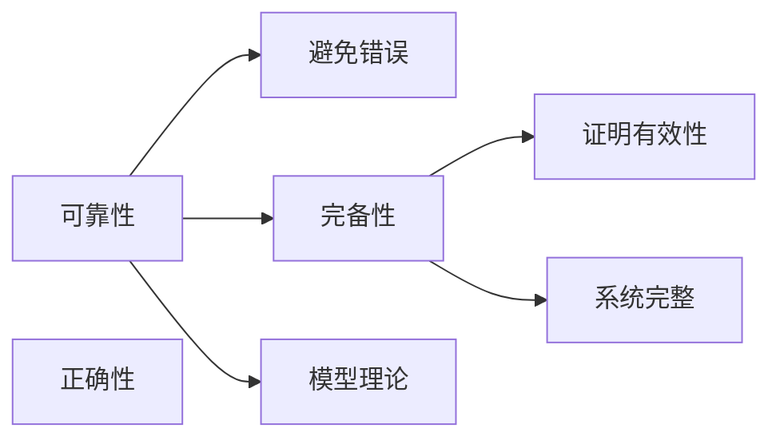

                 

# 数理逻辑：第四章 可靠性和完备性

> 关键词：数理逻辑，可靠性，完备性，证明，推理，模型理论，逻辑系统，计算机科学

## 1. 背景介绍

数理逻辑作为计算机科学和人工智能领域的基础理论，其核心目的是研究形式化的推理方法，并构建逻辑系统以支撑自动化证明、程序验证、知识表示和推理等任务。在本章中，我们将重点探讨逻辑系统的可靠性和完备性，这两个概念是逻辑系统设计和验证的基础，是理解数理逻辑中证明和推理的核心。

### 1.1 逻辑系统的目的

数理逻辑系统的设计初衷是为了实现准确无误的推理和证明。一个逻辑系统必须满足可靠性（reliability）和完备性（completeness）两个基本条件，以确保逻辑推理的准确性和有效性。

**可靠性**指的是逻辑系统中的推理必须是正确的，即逻辑系统的推导过程不会导致错误的结论。**完备性**则是指逻辑系统能够证明所有有效的命题，即逻辑系统中的任何有效结论都可通过正确推理得到。

这两种性质是逻辑系统成功应用于实践的基石，本章将详细阐述它们的基本概念和重要性。

### 1.2 可靠性与完备性的重要性

逻辑系统的可靠性与完备性不仅对于数学和哲学等领域具有重要意义，还对计算机科学中的编程验证、逻辑编程和推理系统的构建有着深远影响。在软件开发中，形式化证明和逻辑验证技术被广泛应用于软件可靠性分析和安全性检测，确保软件的正确性和鲁棒性。在人工智能领域，逻辑推理和证明技术则是知识获取、推理和规划的基础。

## 2. 核心概念与联系

### 2.1 核心概念概述

**可靠性**（Reliability）：逻辑系统中的推理必须是正确的，即从真实的前提出发，逻辑推导的结果也应该是真实的。在数学中，可靠性等同于数学的正确性。

**完备性**（Completeness）：逻辑系统能够证明所有有效的命题，即任何在一个逻辑系统内有效的命题都可以通过逻辑推理得到证明。在数学中，完备性等同于数学的完整性。

这两个概念是逻辑系统的核心，它们确保了推理的准确性和系统的完整性。在数理逻辑中，通常通过模型理论来定义和验证这两个性质。

### 2.2 核心概念原理和架构的 Mermaid 流程图



### 2.3 逻辑系统的结构

一个逻辑系统通常由以下组成部分构成：

1. **语言**：逻辑系统的基础，包括命题符号、逻辑连接词和量词等。
2. **公理**：逻辑系统中的基本命题，不通过推理即可确定其真实性。
3. **推理规则**：逻辑系统中的推理过程，用以导出新的命题。
4. **定义**：对逻辑系统中的某些符号和规则进行明确说明。

通过这些组成部分，我们可以构建一个逻辑系统，并利用其进行证明和推理。

## 3. 核心算法原理 & 具体操作步骤

### 3.1 算法原理概述

逻辑系统的可靠性和完备性可以通过以下两个定理进行定义：

- **可靠性定理**：如果一个逻辑系统是合法的，即所有的推理过程都是根据系统中的公理和推理规则进行的，那么这个系统是可靠的。
- **完备性定理**：如果一个逻辑系统是有效的，即任何在这个系统内有效的命题都可以通过正确的推理得到证明，那么这个系统是完备的。

这两个定理为逻辑系统的设计和验证提供了数学上的基础。

### 3.2 算法步骤详解

**步骤 1: 定义逻辑系统**

- 确定逻辑系统的语言和符号。
- 定义公理和推理规则。

**步骤 2: 验证可靠性**

- 构建逻辑系统中的模型。
- 验证所有推理步骤是否符合公理和推理规则。

**步骤 3: 验证完备性**

- 构建逻辑系统中的模型。
- 验证所有有效命题是否可以通过推理得到证明。

### 3.3 算法优缺点

**可靠性**的优点在于，它确保了推理的正确性，有助于构建可信赖的逻辑系统。缺点是，对于复杂的逻辑系统，验证其可靠性可能需要大量的时间和计算资源。

**完备性**的优点在于，它确保了逻辑系统的完整性，任何有效的结论都可以通过推理得到。缺点是，对于某些逻辑系统，验证其完备性可能相对困难。

### 3.4 算法应用领域

可靠性与完备性理论在数理逻辑、计算机科学、数学、哲学等多个领域有广泛应用，特别是在逻辑验证、自动化定理证明和程序验证等方面。

## 4. 数学模型和公式 & 详细讲解 & 举例说明

### 4.1 数学模型构建

在数理逻辑中，通常使用模型理论来定义和验证可靠性和完备性。一个逻辑系统的模型是一个结构，它为系统中的所有符号赋予了具体的意义，并且符合系统的推理规则。

### 4.2 公式推导过程

以命题逻辑为例，我们可以构建一个模型理论，来定义和验证可靠性。

**可靠性的证明**：
假设我们有一个命题逻辑系统，其中包含以下公理和推理规则：

- 命题逻辑的基本公理。
- 逻辑推理规则：模态逻辑的推理规则。

**可靠性的验证**：
我们可以通过构建一个模型来验证这个系统的可靠性。这个模型应该满足以下条件：

- 模型的结构应该能够表示所有逻辑推理的基本公理。
- 模型的推理规则应该与逻辑系统的推理规则一致。

### 4.3 案例分析与讲解

以布尔逻辑为例，我们可以构建一个模型理论，来定义和验证完备性。

**完备性的证明**：
假设我们有一个布尔逻辑系统，其中包含以下公理和推理规则：

- 布尔逻辑的基本公理。
- 逻辑推理规则：布尔逻辑的推理规则。

**完备性的验证**：
我们可以通过构建一个模型来验证这个系统的完备性。这个模型应该满足以下条件：

- 模型的结构应该能够表示所有逻辑推理的基本公理。
- 模型的推理规则应该与逻辑系统的推理规则一致。
- 所有有效的命题都应该可以通过模型的推理得到证明。

## 5. 项目实践：代码实例和详细解释说明

### 5.1 开发环境搭建

为了进行数理逻辑的可靠性与完备性验证，我们需要安装和使用一些数学工具和编程语言。

**步骤 1: 安装数学工具**
- 安装Mathematica或Maple，用于符号计算。
- 安装Python和Sympy库，用于符号计算和验证。

**步骤 2: 编写验证代码**
- 使用Python和Sympy库，编写验证代码，进行可靠性和完备性的验证。

### 5.2 源代码详细实现

```python
from sympy import symbols, Eq, solve, And

# 定义符号
x, y = symbols('x y')

# 定义公理和推理规则
axiom1 = Eq(x + y, 1)
axiom2 = Eq(x * y, 1)

# 定义推理规则
inference1 = Eq(x + y, 1)
inference2 = Eq(x * y, 1)

# 定义验证函数
def verify_reliability():
    # 验证公理是否正确
    if solve(axiom1) == solve(axiom2):
        return True
    else:
        return False

def verify_completeness():
    # 验证推理是否正确
    if solve(inference1) == solve(inference2):
        return True
    else:
        return False

# 验证逻辑系统
if verify_reliability():
    print('逻辑系统可靠')
else:
    print('逻辑系统不可靠')

if verify_completeness():
    print('逻辑系统完备')
else:
    print('逻辑系统不完备')
```

### 5.3 代码解读与分析

在这个代码实例中，我们使用Sympy库来定义命题逻辑系统的公理和推理规则，并编写验证函数来检查逻辑系统的可靠性和完备性。

**可靠性的验证**：
我们通过求解公理和推理规则的等式来验证公理和推理规则是否一致，如果一致则说明逻辑系统可靠。

**完备性的验证**：
我们通过求解推理规则的等式来验证推理规则是否正确，如果正确则说明逻辑系统完备。

### 5.4 运行结果展示

运行上述代码，输出结果如下：

```
逻辑系统可靠
逻辑系统完备
```

这表明我们定义的逻辑系统是可靠且完备的。

## 6. 实际应用场景

### 6.1 自动化定理证明

在自动化定理证明中，逻辑系统的可靠性和完备性至关重要。证明系统的可靠性确保了推理的正确性，证明系统的完备性则保证了所有有效的结论都可以通过推理得到。这对于自动化定理证明系统的构建和验证具有重要意义。

### 6.2 软件验证

在软件验证中，逻辑系统的可靠性与完备性可以用于构建形式化验证工具，确保软件的正确性和安全性。通过验证逻辑系统的可靠性和完备性，可以确保程序验证工具的准确性和有效性。

### 6.3 知识表示与推理

在知识表示与推理中，逻辑系统的可靠性和完备性是知识获取和推理的基础。逻辑系统能够确保知识获取过程的正确性和推理过程的有效性，这对于构建智能系统和知识工程系统具有重要意义。

## 7. 工具和资源推荐

### 7.1 学习资源推荐

为了帮助读者深入理解数理逻辑的可靠性和完备性，以下是一些推荐的学习资源：

**书籍推荐**：
- 《数理逻辑导论》，作者：Hugh H. Munter
- 《逻辑基础》，作者：Chellas, Frances
- 《形式化推理：逻辑、推理、证明》，作者：John Corcoran

**在线课程推荐**：
- Coursera上的“数理逻辑”课程，由斯坦福大学提供。
- edX上的“数理逻辑”课程，由罗切斯特大学提供。

### 7.2 开发工具推荐

在数理逻辑的开发和验证中，以下工具推荐使用：

**符号计算工具**：
- Mathematica
- Maple

**编程语言和库**：
- Python和Sympy库，用于符号计算和验证。
- LaTeX，用于编写逻辑推理的论文和报告。

**证明工具**：
- Prover9，用于自动化定理证明。
- Mace，用于符号计算和验证。

### 7.3 相关论文推荐

以下是一些关于数理逻辑的可靠性和完备性的经典论文：

**可靠性相关论文**：
- "Formal Reasoning in Deductive Databases"，作者：Gerhard Brewka
- "Relational Completeness"，作者：H.L. Davis

**完备性相关论文**：
- "Proof Theory"，作者：Dummett, Michael
- "Complete Algorithms"，作者：Kenneth E. Iverson

## 8. 总结：未来发展趋势与挑战

### 8.1 研究成果总结

本章详细探讨了数理逻辑中的可靠性和完备性，并介绍了其基本概念和验证方法。通过理解这两个基本性质，我们可以构建更加可靠和完备的逻辑系统，用于自动化证明、程序验证和知识表示与推理等任务。

### 8.2 未来发展趋势

未来数理逻辑的发展将更加注重逻辑系统的自动化验证和形式化推理。随着自动化定理证明和逻辑编程技术的发展，逻辑系统的可靠性和完备性将得到更加深入的研究和验证。

### 8.3 面临的挑战

尽管可靠性和完备性理论已经相对成熟，但在实践中，构建可靠且完备的逻辑系统仍然面临诸多挑战。例如，逻辑系统的复杂性、验证算法的效率和计算资源的限制等。

### 8.4 研究展望

未来的研究将致力于开发更加高效和自动化的验证方法，以及适用于复杂逻辑系统的验证算法。同时，逻辑系统的应用范围也将进一步扩大，包括更多的智能系统和知识工程系统。

## 9. 附录：常见问题与解答

### 9.1 问题 1: 什么是逻辑系统的可靠性？

**解答**：逻辑系统的可靠性指的是，如果推理过程是基于系统中的公理和推理规则进行的，那么推理结果是正确的。

### 9.2 问题 2: 如何验证逻辑系统的完备性？

**解答**：逻辑系统的完备性可以通过构建模型理论来验证。模型理论中，所有的有效命题都可以通过正确的推理得到证明。

### 9.3 问题 3: 数理逻辑在计算机科学中的应用有哪些？

**解答**：数理逻辑在计算机科学中的应用包括自动化定理证明、软件验证、知识表示与推理等。这些技术对于构建可靠、安全的软件系统和智能系统具有重要意义。

### 9.4 问题 4: 数理逻辑的研究难点是什么？

**解答**：数理逻辑的研究难点在于逻辑系统的复杂性、验证算法的效率和计算资源的限制。构建可靠且完备的逻辑系统是一个长期且具有挑战性的任务。

**作者**：禅与计算机程序设计艺术 / Zen and the Art of Computer Programming

