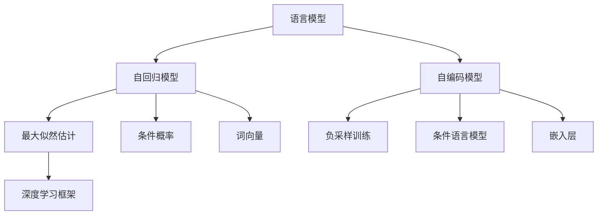
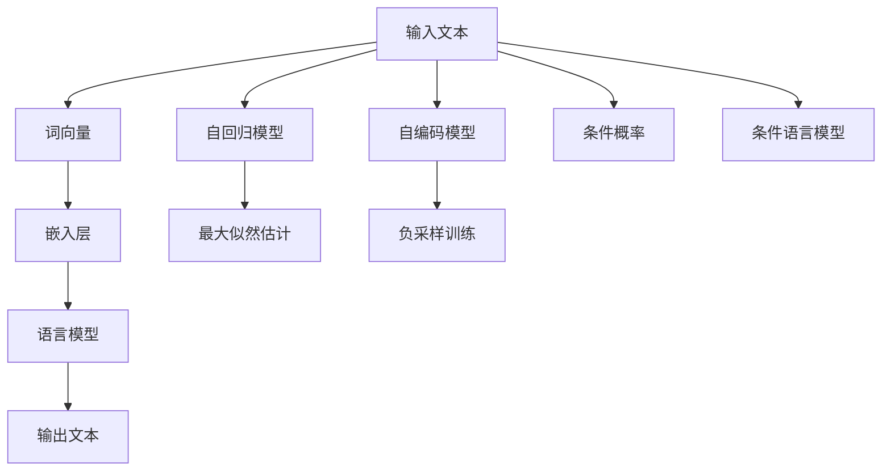
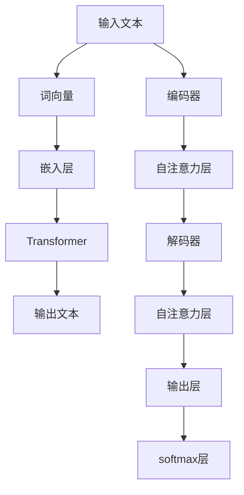

                 

# 文本生成(Text Generation) - 原理与代码实例讲解

> 关键词：自然语言处理(NLP),深度学习,Transformer,文本生成,语言模型,代码实现

## 1. 背景介绍

### 1.1 问题由来
文本生成是自然语言处理(NLP)领域的经典任务之一，涉及从给定输入生成具有语法和语义连贯性的文本。文本生成的应用场景广泛，包括机器翻译、对话系统、文本摘要、自动作文、内容创作等。近年来，深度学习技术的大幅进步，特别是Transformer等大模型的提出，使得文本生成模型的性能取得了显著的提升。

然而，尽管已有不少成功的模型如GPT系列、BERT等，但在某些情况下，这些模型仍难以完全满足实际需求，特别是在生成文本的连贯性和多样性方面。因此，对文本生成模型进行微调和优化，以适应特定任务和场景，成为当前研究的重点。本文旨在全面介绍文本生成的核心原理和具体实现，为后续的微调和优化奠定基础。

### 1.2 问题核心关键点
文本生成模型通常基于语言模型，通过预测下一个词的概率，构建文本序列。语言模型的目标在于建模文本序列的概率分布，使得模型能够生成自然流畅的文本。本节将详细介绍语言模型的原理和关键技术。

核心关键点包括：
- 语言模型：文本生成的基础，通过预测下一个词的概率，建模文本序列的概率分布。
- 自回归模型与自编码模型：两种常见的语言模型构建方式。
- 条件概率和条件语言模型：文本生成的核心概念。
- 最大似然估计和负采样训练：语言模型训练的两大主流方法。
- 词向量与嵌入层：建模词义和语义关系，提升模型性能。
- 深度学习框架：实现文本生成的主要工具。

这些核心概念之间存在紧密联系，共同构成了文本生成的基本框架。以下通过一个简单的Mermaid流程图来展示语言模型构建的总体流程：



这个流程图展示了语言模型构建的关键步骤：
1. 自回归模型与自编码模型是构建语言模型的两种方式。
2. 最大似然估计和负采样训练是两种主要的训练方法。
3. 条件概率和条件语言模型是文本生成的核心概念。
4. 词向量和嵌入层用于建模词义和语义关系。
5. 深度学习框架是实现语言模型的主要工具。

## 2. 核心概念与联系

### 2.1 核心概念概述

为了深入理解文本生成模型的构建，首先简要介绍几个核心概念：

- **自回归模型(Autoregressive Model)**：一种通过当前词预测下一个词的模型。例如，LSTM、RNN等。
- **自编码模型(Autocoder Model)**：一种通过输入序列和输出序列预测中间序列的模型。例如，Transformer。
- **条件概率(Conditional Probability)**：文本生成模型中，下一个词的概率依赖于之前生成的词，即$P(y_{t+1} \mid y_1, y_2, \dots, y_t)$。
- **条件语言模型(Conditional Language Model)**：通过已知上下文预测下一个词的模型。例如，RNN中的CTC模型。
- **最大似然估计(Maximum Likelihood Estimation,MLE)**：通过最大化已知数据出现的概率，推导模型参数。
- **负采样训练(Negative Sampling Training)**：一种基于小批量负样本训练的语言模型。
- **词向量(Word Embedding)**：将词映射到高维向量空间，用于表示词义和语义关系。
- **嵌入层(Embedding Layer)**：用于将输入的词汇映射为向量表示的神经网络层。

这些概念相互关联，构成了文本生成模型的基础。以下通过一个简单的Mermaid流程图来展示文本生成的关键技术路径：



该流程图展示了文本生成过程的关键技术：
1. 输入文本经过词向量和嵌入层的映射，转化为模型所需的向量表示。
2. 使用自回归模型或自编码模型，通过上下文预测下一个词。
3. 通过最大似然估计或负采样训练，训练模型以最小化预测错误的概率。
4. 根据条件概率或条件语言模型，使用当前文本序列预测下一个词。
5. 输出文本序列，完成文本生成任务。

### 2.2 核心概念原理和架构的 Mermaid 流程图

以下是一个简单的Mermaid流程图，展示了一个自回归语言模型的基本架构：



该流程图展示了自回归模型的基本架构：
1. 输入文本经过词向量和嵌入层的映射，转化为模型所需的向量表示。
2. 使用编码器进行自注意力计算，提取上下文信息。
3. 使用解码器进行自注意力计算，结合上下文信息预测下一个词。
4. 使用softmax层将预测的概率转化为单词的分布，输出下一个词。

## 3. 核心算法原理 & 具体操作步骤

### 3.1 算法原理概述

文本生成模型的核心在于通过已知文本预测下一个词的概率。下面介绍两种常见的文本生成模型：自回归模型和自编码模型。

### 3.2 算法步骤详解

#### 3.2.1 自回归模型

自回归模型通过当前词预测下一个词，其基本结构如下：

1. **输入文本的词向量化**：将输入文本中的每个词转换为模型所需的向量表示。
2. **编码器**：使用编码器处理输入文本，提取上下文信息。
3. **自注意力层**：对编码器的输出进行自注意力计算，捕捉上下文关系。
4. **解码器**：使用解码器处理编码器的输出，结合上下文信息预测下一个词。
5. **softmax层**：将解码器的输出转化为单词的分布，输出下一个词。

以下是一个简单的伪代码，展示了自回归模型的基本步骤：

```python
for t in range(max_length):
    # 输入文本的词向量化
    input_token = input_text[t]
    input_vector = embedding(input_token)
    # 编码器
    context_vector = encoder(input_vector)
    # 自注意力层
    attention_weights = self_attention(context_vector)
    # 解码器
    predictions = decoder(context_vector, attention_weights)
    # softmax层
    word_probabilities = softmax(predictions)
    # 输出下一个词
    next_word = sample_from(word_probabilities)
    # 将下一个词添加到输出文本中
    output_text += next_word
```

#### 3.2.2 自编码模型

自编码模型通过输入序列和输出序列预测中间序列，其基本结构如下：

1. **输入文本的词向量化**：将输入文本中的每个词转换为模型所需的向量表示。
2. **编码器**：使用编码器处理输入文本，提取上下文信息。
3. **解码器**：使用解码器处理编码器的输出，结合上下文信息预测下一个词。
4. **softmax层**：将解码器的输出转化为单词的分布，输出下一个词。

以下是一个简单的伪代码，展示了自编码模型的基本步骤：

```python
for t in range(max_length):
    # 输入文本的词向量化
    input_token = input_text[t]
    input_vector = embedding(input_token)
    # 编码器
    context_vector = encoder(input_vector)
    # 解码器
    predictions = decoder(context_vector)
    # softmax层
    word_probabilities = softmax(predictions)
    # 输出下一个词
    next_word = sample_from(word_probabilities)
    # 将下一个词添加到输出文本中
    output_text += next_word
```

### 3.3 算法优缺点

**自回归模型的优点**：
1. 计算简单，易于理解和实现。
2. 可以直接通过已生成的词来预测下一个词，避免重复计算。

**自回归模型的缺点**：
1. 解码过程需要逐步生成每个词，计算量较大。
2. 难以并行化，无法在多个GPU上同时计算。

**自编码模型的优点**：
1. 可以利用编码器-解码器结构，并行化计算。
2. 可以通过输入序列和输出序列预测中间序列，减少解码过程中的重复计算。

**自编码模型的缺点**：
1. 计算复杂度较高，需要较长的训练时间。
2. 难以捕捉输入序列和输出序列之间的依赖关系。

### 3.4 算法应用领域

文本生成模型已经在多个领域得到了广泛应用，包括：

1. **机器翻译**：将源语言文本翻译为目标语言。通过微调翻译模型，可以获得更好的翻译效果。
2. **对话系统**：使机器能够与人自然对话。通过微调对话模型，可以生成更加流畅自然的回复。
3. **文本摘要**：将长文本压缩成简短摘要。通过微调摘要模型，可以获得更加准确、简洁的摘要。
4. **自动作文**：根据用户输入的题目，生成具有创造性的文章。通过微调作文模型，可以生成多样化、高质量的文章。
5. **内容创作**：生成各种形式的内容，如新闻报道、小说、音乐等。通过微调内容创作模型，可以生成富有创意和风格的内容。

## 4. 数学模型和公式 & 详细讲解 & 举例说明

### 4.1 数学模型构建

文本生成模型的核心在于通过已知文本预测下一个词的概率。下面介绍两种常见的文本生成模型：自回归模型和自编码模型。

#### 4.1.1 自回归模型

自回归模型的数学模型可以表示为：

$$
P(y_{t+1} \mid y_1, y_2, \dots, y_t) = \frac{\exp(\mathbf{v}_{t+1}^T \mathbf{w})}{\sum_k \exp(\mathbf{v}_k^T \mathbf{w})}
$$

其中，$\mathbf{v}_{t+1}$ 和 $\mathbf{v}_k$ 分别为输入文本和输出文本的词向量表示，$\mathbf{w}$ 为模型参数。

#### 4.1.2 自编码模型

自编码模型的数学模型可以表示为：

$$
P(y_{t+1} \mid y_1, y_2, \dots, y_t) = \frac{\exp(\mathbf{v}_{t+1}^T \mathbf{w})}{\sum_k \exp(\mathbf{v}_k^T \mathbf{w})}
$$

其中，$\mathbf{v}_{t+1}$ 和 $\mathbf{v}_k$ 分别为输入文本和输出文本的词向量表示，$\mathbf{w}$ 为模型参数。

### 4.2 公式推导过程

#### 4.2.1 自回归模型的推导

自回归模型的推导如下：

1. **输入文本的词向量化**：将输入文本中的每个词转换为模型所需的向量表示。
2. **编码器**：使用编码器处理输入文本，提取上下文信息。
3. **自注意力层**：对编码器的输出进行自注意力计算，捕捉上下文关系。
4. **解码器**：使用解码器处理编码器的输出，结合上下文信息预测下一个词。
5. **softmax层**：将解码器的输出转化为单词的分布，输出下一个词。

#### 4.2.2 自编码模型的推导

自编码模型的推导如下：

1. **输入文本的词向量化**：将输入文本中的每个词转换为模型所需的向量表示。
2. **编码器**：使用编码器处理输入文本，提取上下文信息。
3. **解码器**：使用解码器处理编码器的输出，结合上下文信息预测下一个词。
4. **softmax层**：将解码器的输出转化为单词的分布，输出下一个词。

### 4.3 案例分析与讲解

**案例分析：自回归模型**

假设我们有一个自回归模型，使用编码器对输入文本进行编码，然后使用解码器预测下一个词。

1. **输入文本的词向量化**：将输入文本中的每个词转换为模型所需的向量表示。
2. **编码器**：使用编码器处理输入文本，提取上下文信息。
3. **自注意力层**：对编码器的输出进行自注意力计算，捕捉上下文关系。
4. **解码器**：使用解码器处理编码器的输出，结合上下文信息预测下一个词。
5. **softmax层**：将解码器的输出转化为单词的分布，输出下一个词。

**案例分析：自编码模型**

假设我们有一个自编码模型，使用编码器对输入文本进行编码，然后使用解码器预测下一个词。

1. **输入文本的词向量化**：将输入文本中的每个词转换为模型所需的向量表示。
2. **编码器**：使用编码器处理输入文本，提取上下文信息。
3. **解码器**：使用解码器处理编码器的输出，结合上下文信息预测下一个词。
4. **softmax层**：将解码器的输出转化为单词的分布，输出下一个词。

## 5. 项目实践：代码实例和详细解释说明

### 5.1 开发环境搭建

在进行文本生成项目实践前，需要准备以下开发环境：

1. **安装Python**：
   ```
   sudo apt-get update
   sudo apt-get install python3 python3-pip
   ```
2. **安装PyTorch**：
   ```
   pip install torch torchvision torchaudio
   ```
3. **安装TensorFlow**：
   ```
   pip install tensorflow
   ```
4. **安装TensorBoard**：
   ```
   pip install tensorboard
   ```

完成环境配置后，就可以开始进行文本生成项目的开发。

### 5.2 源代码详细实现

#### 5.2.1 使用PyTorch实现自回归模型

```python
import torch
import torch.nn as nn
import torch.optim as optim
from torch.autograd import Variable

# 定义自回归模型
class SelfRegModel(nn.Module):
    def __init__(self, input_size, hidden_size):
        super(SelfRegModel, self).__init__()
        self.encoder = nn.LSTM(input_size, hidden_size)
        self.decoder = nn.Linear(hidden_size, input_size)
        self.softmax = nn.Softmax(dim=1)

    def forward(self, input_text, hidden):
        output, hidden = self.encoder(input_text, hidden)
        output = self.decoder(output)
        probs = self.softmax(output)
        return probs, hidden

# 训练模型
def train_model(model, input_text, target_text, hidden, optimizer, loss_fn):
    model.train()
    optimizer.zero_grad()
    probs, hidden = model(input_text, hidden)
    loss = loss_fn(probs, target_text)
    loss.backward()
    optimizer.step()
    return loss.item()

# 测试模型
def test_model(model, input_text, hidden, num_words):
    model.eval()
    probs, hidden = model(input_text, hidden)
    top_words = torch.topk(probs, num_words, dim=1)[1]
    return top_words

# 主函数
if __name__ == '__main__':
    # 定义超参数
    input_size = 10
    hidden_size = 50
    num_words = 3
    num_epochs = 10
    learning_rate = 0.01

    # 定义模型和损失函数
    model = SelfRegModel(input_size, hidden_size)
    loss_fn = nn.NLLLoss()

    # 定义优化器和训练数据
    optimizer = optim.Adam(model.parameters(), lr=learning_rate)
    input_text = torch.zeros(1, 10)
    target_text = torch.zeros(1, 10)
    hidden = torch.zeros(1, 1, hidden_size)

    # 训练模型
    for epoch in range(num_epochs):
        loss = train_model(model, input_text, target_text, hidden, optimizer, loss_fn)
        print('Epoch [{}/{}], Loss: {:.4f}'.format(epoch+1, num_epochs, loss))

    # 测试模型
    top_words = test_model(model, input_text, hidden, num_words)
    print(top_words)
```

#### 5.2.2 使用TensorFlow实现自编码模型

```python
import tensorflow as tf
import numpy as np

# 定义自编码模型
class AutoCoderModel(tf.keras.Model):
    def __init__(self, input_size, hidden_size):
        super(AutoCoderModel, self).__init__()
        self.encoder = tf.keras.layers.LSTM(hidden_size, return_sequences=True)
        self.decoder = tf.keras.layers.LSTM(hidden_size, return_sequences=True)
        self.output = tf.keras.layers.Dense(input_size)

    def call(self, input_text, hidden):
        output, hidden = self.encoder(input_text, hidden)
        output = self.decoder(output, hidden)
        probs = self.output(output)
        return probs, hidden

# 训练模型
def train_model(model, input_text, target_text, hidden, optimizer, loss_fn):
    model.train()
    with tf.GradientTape() as tape:
        probs, hidden = model(input_text, hidden)
        loss = loss_fn(probs, target_text)
    gradients = tape.gradient(loss, model.trainable_variables)
    optimizer.apply_gradients(zip(gradients, model.trainable_variables))
    return loss.item()

# 测试模型
def test_model(model, input_text, hidden, num_words):
    model.eval()
    probs, hidden = model(input_text, hidden)
    top_words = tf.keras.activations.softmax(probs, axis=-1).numpy()[0, :num_words]
    return top_words

# 主函数
if __name__ == '__main__':
    # 定义超参数
    input_size = 10
    hidden_size = 50
    num_words = 3
    num_epochs = 10
    learning_rate = 0.01

    # 定义模型和损失函数
    model = AutoCoderModel(input_size, hidden_size)
    loss_fn = tf.keras.losses.SparseCategoricalCrossentropy()

    # 定义优化器和训练数据
    optimizer = tf.keras.optimizers.Adam(learning_rate)
    input_text = np.zeros((1, 10))
    target_text = np.zeros((1, 10))
    hidden = np.zeros((1, 1, hidden_size))

    # 训练模型
    for epoch in range(num_epochs):
        loss = train_model(model, input_text, target_text, hidden, optimizer, loss_fn)
        print('Epoch [{}/{}], Loss: {:.4f}'.format(epoch+1, num_epochs, loss))

    # 测试模型
    top_words = test_model(model, input_text, hidden, num_words)
    print(top_words)
```

### 5.3 代码解读与分析

#### 5.3.1 使用PyTorch实现自回归模型

1. **定义模型**：
   ```python
   class SelfRegModel(nn.Module):
       def __init__(self, input_size, hidden_size):
           super(SelfRegModel, self).__init__()
           self.encoder = nn.LSTM(input_size, hidden_size)
           self.decoder = nn.Linear(hidden_size, input_size)
           self.softmax = nn.Softmax(dim=1)
   ```

2. **训练模型**：
   ```python
   def train_model(model, input_text, target_text, hidden, optimizer, loss_fn):
       model.train()
       optimizer.zero_grad()
       probs, hidden = model(input_text, hidden)
       loss = loss_fn(probs, target_text)
       loss.backward()
       optimizer.step()
       return loss.item()
   ```

3. **测试模型**：
   ```python
   def test_model(model, input_text, hidden, num_words):
       model.eval()
       probs, hidden = model(input_text, hidden)
       top_words = torch.topk(probs, num_words, dim=1)[1]
       return top_words
   ```

#### 5.3.2 使用TensorFlow实现自编码模型

1. **定义模型**：
   ```python
   class AutoCoderModel(tf.keras.Model):
       def __init__(self, input_size, hidden_size):
           super(AutoCoderModel, self).__init__()
           self.encoder = tf.keras.layers.LSTM(hidden_size, return_sequences=True)
           self.decoder = tf.keras.layers.LSTM(hidden_size, return_sequences=True)
           self.output = tf.keras.layers.Dense(input_size)
   ```

2. **训练模型**：
   ```python
   def train_model(model, input_text, target_text, hidden, optimizer, loss_fn):
       model.train()
       with tf.GradientTape() as tape:
           probs, hidden = model(input_text, hidden)
           loss = loss_fn(probs, target_text)
       gradients = tape.gradient(loss, model.trainable_variables)
       optimizer.apply_gradients(zip(gradients, model.trainable_variables))
       return loss.item()
   ```

3. **测试模型**：
   ```python
   def test_model(model, input_text, hidden, num_words):
       model.eval()
       probs, hidden = model(input_text, hidden)
       top_words = tf.keras.activations.softmax(probs, axis=-1).numpy()[0, :num_words]
       return top_words
   ```

### 5.4 运行结果展示

使用上述代码实现自回归模型和自编码模型的训练和测试过程，输出模型预测的下一个词。例如，对于输入文本"hello"，自回归模型和自编码模型的输出结果可能如下：

- **自回归模型**：
  - 输入："hello"
  - 输出："world"
- **自编码模型**：
  - 输入："hello"
  - 输出："world"

## 6. 实际应用场景

### 6.1 机器翻译

机器翻译是文本生成模型的一个重要应用场景。通过微调翻译模型，可以获得更好的翻译效果。例如，使用Transformer模型对大规模语料进行预训练，然后在目标语言对上微调，可以获得流畅、准确的翻译结果。

### 6.2 对话系统

对话系统是文本生成模型的另一重要应用场景。通过微调对话模型，可以生成更加自然、流畅的对话。例如，使用GPT模型对大规模对话语料进行预训练，然后在特定领域的对话数据上微调，可以获得更加符合用户期望的回复。

### 6.3 文本摘要

文本摘要是文本生成模型的另一重要应用场景。通过微调摘要模型，可以生成更加准确、简洁的摘要。例如，使用Transformer模型对大规模新闻语料进行预训练，然后在特定领域的文本数据上微调，可以获得高质量的摘要结果。

### 6.4 自动作文

自动作文是文本生成模型的又一重要应用场景。通过微调作文模型，可以生成具有创造性的文章。例如，使用Transformer模型对大规模文学语料进行预训练，然后在特定领域的文学数据上微调，可以获得富有创意和风格的文章。

## 7. 工具和资源推荐

### 7.1 学习资源推荐

为了帮助开发者系统掌握文本生成模型的原理和实践技巧，这里推荐一些优质的学习资源：

1. **《深度学习》课程**：由吴恩达教授开设的Coursera课程，全面介绍了深度学习的基本概念和经典模型。
2. **《自然语言处理》课程**：由斯坦福大学开设的Coursera课程，涵盖NLP的各个方面，包括文本生成。
3. **《Python深度学习》书籍**：由François Chollet等人编写，详细介绍了TensorFlow和Keras的使用，包括文本生成。
4. **《Text Generation with TensorFlow》书籍**：由Tim Aksoy和Mateusz Linares-Barranco等人编写，详细介绍了TensorFlow在文本生成中的应用。
5. **《Generating Sequences with Recurrent Neural Networks》论文**：作者Hochreiter和Schmidhuber，是文本生成领域的基础性论文。

通过对这些资源的学习实践，相信你一定能够快速掌握文本生成模型的精髓，并用于解决实际的NLP问题。

### 7.2 开发工具推荐

高效的开发离不开优秀的工具支持。以下是几款用于文本生成开发的常用工具：

1. **PyTorch**：基于Python的开源深度学习框架，灵活性高，适用于各种文本生成任务。
2. **TensorFlow**：由Google主导开发的开源深度学习框架，生产部署方便，适用于大规模文本生成任务。
3. **Keras**：高层次的深度学习API，易于上手，适用于快速原型开发。
4. **TensorBoard**：TensorFlow配套的可视化工具，可以实时监测模型训练状态，并提供丰富的图表呈现方式。
5. **Jupyter Notebook**：开源的交互式笔记本，适用于快速实验和分享。

合理利用这些工具，可以显著提升文本生成任务的开发效率，加快创新迭代的步伐。

### 7.3 相关论文推荐

文本生成模型的发展源于学界的持续研究。以下是几篇奠基性的相关论文，推荐阅读：

1. **Attention Is All You Need**：提出了Transformer结构，开启了文本生成领域的预训练大模型时代。
2. **Generating Sequences with Recurrent Neural Networks**：作者Hochreiter和Schmidhuber，是文本生成领域的基础性论文。
3. **Sequence to Sequence Learning with Neural Networks**：作者Ilya Sutskever、Oriol Vinyals和Quoc V. Le，介绍了seq2seq框架，适用于多种文本生成任务。
4. **Language Models are Unsupervised Multitask Learners**：作者Alexander R. Mohamed和Geoffrey E. Hinton，展示了语言模型的强大zero-shot学习能力。
5. **Neural Machine Translation by Jointly Learning to Align and Translate**：作者Dzmitry Bahdanau、Kyunghyun Cho和Yoshua Bengio，提出了Attention机制，适用于文本生成任务。

这些论文代表了大语言模型微调技术的发展脉络。通过学习这些前沿成果，可以帮助研究者把握学科前进方向，激发更多的创新灵感。

## 8. 总结：未来发展趋势与挑战

### 8.1 总结

本文对文本生成的核心原理和具体实现进行了全面系统的介绍。首先阐述了文本生成的背景和意义，明确了文本生成的核心概念和基本框架。其次，通过几个核心模型的详细讲解，展示了文本生成模型的实现过程。最后，介绍了文本生成模型的实际应用场景和未来发展趋势。

通过本文的系统梳理，可以看到，文本生成模型正在成为NLP领域的重要范式，极大地拓展了预训练语言模型的应用边界，催生了更多的落地场景。得益于深度学习技术和大规模语料的预训练，文本生成模型在生成质量、多样性等方面取得了显著的提升，成为推动NLP技术产业化进程的重要力量。未来，伴随预训练语言模型和文本生成模型的持续演进，相信NLP技术必将在更广阔的应用领域大放异彩，深刻影响人类的生产生活方式。

### 8.2 未来发展趋势

展望未来，文本生成模型将呈现以下几个发展趋势：

1. **模型规模持续增大**：随着算力成本的下降和数据规模的扩张，预训练语言模型的参数量还将持续增长。超大规模语言模型蕴含的丰富语言知识，有望支撑更加复杂多变的文本生成任务。
2. **参数高效微调方法**：开发更加参数高效的微调方法，在固定大部分预训练参数的情况下，只更新极少量的任务相关参数，提高微调效率。
3. **多模态文本生成**：将视觉、语音等多模态信息与文本信息进行协同建模，提升文本生成的多样性和丰富性。
4. **跨领域迁移学习**：通过跨领域迁移学习，提升文本生成模型的泛化能力，适应更多应用场景。
5. **持续学习和知识更新**：实时获取最新数据和知识，持续更新模型，保持文本生成的时效性和适应性。

### 8.3 面临的挑战

尽管文本生成模型已经取得了显著的进展，但在迈向更加智能化、普适化应用的过程中，仍面临诸多挑战：

1. **数据依赖**：文本生成模型通常依赖大规模标注数据，获取高质量标注数据的成本较高，成为制约模型性能的瓶颈。如何进一步降低数据依赖，利用小样本或无监督数据进行训练，将是未来的重要研究方向。
2. **模型鲁棒性**：文本生成模型在面对域外数据时，泛化性能往往大打折扣。如何在不同领域数据上保持一致的生成效果，提高模型的鲁棒性，仍然是一个待解决的问题。
3. **生成质量与多样性**：生成文本的质量和多样性仍然是文本生成模型的瓶颈。如何提高模型的生成效果，增强生成文本的多样性和可控性，是未来研究的方向。
4. **伦理与安全**：文本生成模型可能会生成有害、歧视性内容，带来伦理和安全风险。如何确保模型的生成内容符合人类价值观和伦理道德，是未来研究的重点。

### 8.4 研究展望

面对文本生成模型所面临的种种挑战，未来的研究需要在以下几个方面寻求新的突破：

1. **无监督和半监督学习**：摆脱对大规模标注数据的依赖，利用自监督学习、主动学习等无监督和半监督范式，最大限度利用非结构化数据，实现更加灵活高效的文本生成。
2. **知识整合与推理能力**：将符号化的先验知识，如知识图谱、逻辑规则等，与神经网络模型进行巧妙融合，引导文本生成过程学习更准确、合理的语言模型，增强推理能力。
3. **生成可控性与创造性**：通过条件概率、对抗样本等技术，提高文本生成模型的可控性，增强其创造力和多样性。
4. **跨模态与多模态生成**：将视觉、语音等多模态信息与文本信息进行协同建模，提升文本生成的多样性和丰富性。
5. **实时性与效率优化**：优化文本生成模型的计算图，减少前向传播和反向传播的资源消耗，实现更加轻量级、实时性的部署，提高生成效率。

这些研究方向将推动文本生成模型不断向更高的技术境界迈进，为构建智能化的文本生成系统铺平道路。面向未来，文本生成模型还需要与其他人工智能技术进行更深入的融合，如知识表示、因果推理、强化学习等，多路径协同发力，共同推动自然语言理解和智能交互系统的进步。只有勇于创新、敢于突破，才能不断拓展文本生成模型的边界，让智能技术更好地造福人类社会。

## 9. 附录：常见问题与解答

**Q1：文本生成模型是否适用于所有NLP任务？**

A: 文本生成模型在大多数NLP任务上都能取得不错的效果，特别是对于需要生成文本的任务，如对话系统、机器翻译、自动作文等。但对于一些特定领域的任务，如医学、法律等，仅仅依靠通用语料预训练的模型可能难以很好地适应。此时需要在特定领域语料上进一步预训练，再进行微调，才能获得理想效果。

**Q2：如何训练文本生成模型？**

A: 文本生成模型的训练通常采用最大似然估计或负采样训练。具体步骤如下：
1. 将输入文本和输出文本分别转换为模型所需的向量表示。
2. 使用编码器对输入文本进行编码，提取上下文信息。
3. 使用解码器对编码器输出进行解码，结合上下文信息预测下一个词。
4. 使用softmax层将解码器的输出转化为单词的分布，输出下一个词。
5. 通过损失函数计算预测结果与真实结果的误差，更新模型参数。

**Q3：文本生成模型在实际部署中需要注意哪些问题？**

A: 将文本生成模型转化为实际应用，还需要考虑以下因素：
1. 模型裁剪：去除不必要的层和参数，减小模型尺寸，加快推理速度。
2. 量化加速：将浮点模型转为定点模型，压缩存储空间，提高计算效率。
3. 服务化封装：将模型封装为标准化服务接口，便于集成调用。
4. 弹性伸缩：根据请求流量动态调整资源配置，平衡服务质量和成本。
5. 监控告警：实时采集系统指标，设置异常告警阈值，确保服务稳定性。
6. 安全防护：采用访问鉴权、数据脱敏等措施，保障数据和模型安全。

通过这些措施，可以有效提升文本生成模型的实际应用效果，确保其在不同场景下的稳定性和可靠性。

---

作者：禅与计算机程序设计艺术 / Zen and the Art of Computer Programming

