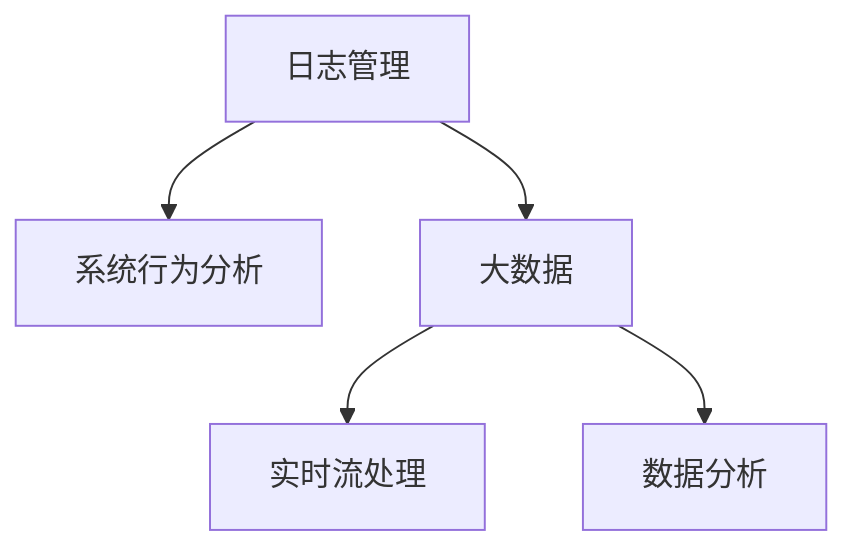

                 

# 日志管理和分析：洞察系统行为

> 关键词：日志管理, 系统行为分析, 大数据, 实时流处理, 数据分析, 自动化运维

## 1. 背景介绍

日志是系统运行过程中记录的详细行为记录，包含系统事件、错误信息、性能指标等，是系统诊断、故障分析和性能优化的重要依据。随着云原生和微服务架构的普及，系统的复杂度不断提升，日志数据量也呈爆炸性增长。有效管理和分析这些海量日志数据，对保障系统稳定运行、提升运维效率、支撑业务发展具有重要意义。

### 1.1 问题由来

日志管理的复杂性主要源于以下几个方面：

- **数据量大**：随着系统的并发度和处理量增加，日志数据量急剧上升，难以通过手工方式进行分析和处理。
- **数据分散**：不同系统、不同环境、不同时间段的日志数据往往分散在不同的存储介质上，难以集中管理和统一分析。
- **数据异构**：不同系统、不同日志格式、不同编码方式的数据，给数据整合和处理带来了挑战。
- **数据质量差**：日志数据中可能存在缺失、格式错误、重复、噪音等问题，影响数据分析的准确性。
- **分析困难**：日志数据涉及系统行为的全貌，其内容复杂多样，分析难度大。

如何从海量、分散、异构、质量参差不齐的日志数据中，提炼出有价值的洞察，成为运维团队面临的重大挑战。

## 2. 核心概念与联系

### 2.1 核心概念概述

为更好地理解日志管理和分析的过程，本节将介绍几个密切相关的核心概念：

- **日志管理(Log Management)**：指对日志数据的收集、存储、清洗、分析等环节进行管理和优化，以支持系统运行监控、故障诊断、性能优化等运维需求。
- **系统行为分析(System Behavior Analysis)**：通过分析日志数据，获取系统运行的性能指标、故障原因、行为模式等信息，为系统优化和故障排除提供依据。
- **大数据(Big Data)**：指规模大、高速增长、多样性强的海量数据，通常包含结构化、半结构化、非结构化等多种数据类型。
- **实时流处理(Real-Time Streaming Processing)**：指对数据流进行实时处理，支持低延迟、高吞吐量的数据处理需求，适用于日志数据的实时分析和告警。
- **数据分析(Analytics)**：指对数据进行统计、分析、挖掘等处理，从中提取有价值的信息和洞察，支持数据驱动的决策制定。

这些核心概念之间的逻辑关系可以通过以下Mermaid流程图来展示：



这个流程图展示了大数据背景下日志管理的核心概念及其之间的关系：

1. 日志管理是对大数据进行管理和处理的关键环节。
2. 系统行为分析依赖于日志管理提供的数据支撑，获取系统行为的洞察。
3. 大数据和多样的数据源是大数据分析和处理的前提。
4. 实时流处理是大数据实时分析和告警的基础。

这些概念共同构成了日志管理和分析的核心框架，使得系统行为洞察成为可能。

## 3. 核心算法原理 & 具体操作步骤

### 3.1 算法原理概述

日志管理和分析的核心算法原理主要包括以下几个方面：

- **日志收集与存储**：通过集中式日志收集系统，将不同来源的日志数据集中存储到统一的数据仓库或数据库中。
- **数据清洗与预处理**：对日志数据进行格式化、去重、去噪等处理，提高数据质量。
- **数据提取与分析**：从日志数据中提取性能指标、错误信息、行为模式等，应用统计、分析、挖掘等方法，生成有用的洞察。
- **实时告警与响应**：利用实时流处理技术，对日志数据进行实时分析，快速发现系统故障或性能异常，并自动触发告警和响应措施。

### 3.2 算法步骤详解

日志管理和分析的主要操作步骤如下：

**Step 1: 日志收集与存储**

- **集中式收集系统**：部署日志收集代理（如Fluentd、Logstash等），收集不同来源（如应用、数据库、服务器等）的日志数据，统一发送到一个中央日志存储系统（如Elasticsearch、Kafka等）。
- **日志存储策略**：制定合理的日志存储策略，根据日志的重要性、时间周期等因素，设置不同的存储和备份方案。

**Step 2: 数据清洗与预处理**

- **数据格式化**：对不同格式的日志数据进行解析和转换，统一为标准格式。例如，将JSON日志转换为CSV格式。
- **去重与去噪**：根据日志ID或时间戳进行去重，去除重复和无用的日志记录。例如，保留出现频率较高的错误日志。
- **性能优化**：采用日志压缩、缓存等技术，提高日志数据存储和查询的效率。

**Step 3: 数据提取与分析**

- **性能指标提取**：从日志中提取系统性能指标，如响应时间、吞吐量、错误率等。
- **错误信息分析**：通过自然语言处理技术，对错误日志进行分词、情感分析，定位错误根源。
- **行为模式挖掘**：应用机器学习或数据挖掘算法，识别系统的行为模式，如异常流量、异常访问等。

**Step 4: 实时告警与响应**

- **实时流处理引擎**：部署实时流处理引擎（如Apache Flink、Apache Kafka Streams等），对日志数据进行实时分析和处理。
- **告警策略配置**：根据业务需求和系统健康指标，配置告警策略，如阈值告警、时间窗口告警等。
- **告警与响应机制**：自动生成告警信息，并通过邮件、短信、SLACK等渠道推送给运维人员，触发自动响应措施，如重启服务、迁移数据库等。

### 3.3 算法优缺点

日志管理和分析的算法具有以下优点：

- **全面性**：通过集中式存储和清洗，对系统行为的全貌进行全面分析。
- **实时性**：利用实时流处理技术，支持对日志数据的实时分析和告警，及时响应系统故障。
- **准确性**：应用先进的分析方法，提高数据处理的准确性和洞察的深度。

同时，该算法也存在一定的局限性：

- **资源消耗大**：对日志数据进行集中式存储、清洗和分析，需要占用大量计算和存储资源。
- **复杂度高**：算法涉及日志处理、数据分析、实时流处理等多方面的技术，实施和维护难度大。
- **数据依赖性强**：日志数据的质量和完整性对算法效果有直接影响，数据缺失或噪音可能影响分析结果。
- **告警误报率高**：日志数据的异构性和多样性可能导致告警误报，影响运维效率。

尽管存在这些局限性，但就目前而言，日志管理和分析仍然是系统行为洞察和运维保障的重要手段。未来相关研究的重点在于如何进一步降低资源消耗，提高算法复杂性和告警准确性，同时兼顾系统的稳定性和可扩展性。

### 3.4 算法应用领域

日志管理和分析技术广泛应用于多个领域，例如：

- **云计算运维**：在云平台中，对容器、虚拟机、负载均衡等资源进行实时监控和故障分析，确保云服务稳定运行。
- **大数据分析**：在数据湖、数据仓库等大数据平台中，对海量日志数据进行清洗和分析，支持数据驱动的业务决策。
- **金融风控**：在金融行业，对交易日志、用户行为日志等进行行为分析，防范金融风险。
- **网络安全**：在网络安全领域，对访问日志、审计日志等进行异常检测，保障网络安全。
- **智能运维**：在智能运维场景中，对日志数据进行自动化分析和告警，提高运维效率。

除了上述这些经典应用外，日志管理和分析技术还被创新性地应用到更多场景中，如日志可视化、日志审计、日志溯源等，为系统的安全、稳定和高效运行提供了强有力的保障。

## 4. 数学模型和公式 & 详细讲解 & 举例说明

### 4.1 数学模型构建

日志管理和分析的数学模型主要涉及以下几个方面：

- **数据模型**：定义日志数据的结构，包括日志ID、时间戳、日志内容等。
- **统计模型**：应用统计方法，计算日志数据的分布、趋势、方差等。
- **机器学习模型**：利用机器学习算法，对日志数据进行分类、聚类、回归等处理。
- **优化模型**：采用优化算法，对数据存储、传输、查询等过程进行效率提升。

### 4.2 公式推导过程

以下以日志数据的平均响应时间计算为例，展示基本的统计模型推导过程：

假设日志数据集中包含 $N$ 条日志记录，每条日志记录的响应时间 $t_i$ 服从正态分布 $N(\mu,\sigma^2)$，则平均响应时间 $\mu$ 的计算公式为：

$$
\mu = \frac{1}{N}\sum_{i=1}^N t_i
$$

其中 $N$ 为日志记录总数，$\sum_{i=1}^N t_i$ 为所有日志记录的响应时间总和。

为了估计响应时间的分布，可以应用最大似然估计方法，求解 $\mu$ 和 $\sigma^2$ 的最大似然估计值。

### 4.3 案例分析与讲解

假设某电商网站的一个页面访问日志数据集 $D$ 包含 10 万条记录，每条记录包含访问时间 $t_i$ 和响应时间 $t_i$，我们需要计算该页面平均响应时间 $\mu$ 和标准差 $\sigma$。

- **数据模型**：定义日志数据结构，包含访问时间 $t_i$ 和响应时间 $t_i$。
- **统计模型**：应用最大似然估计方法，计算响应时间的均值和方差。
- **计算过程**：
  - 计算所有记录的响应时间总和：$\sum_{i=1}^{100000} t_i$。
  - 计算响应时间的均值：$\mu = \frac{\sum_{i=1}^{100000} t_i}{100000}$。
  - 计算响应时间方差：$\sigma^2 = \frac{1}{N}\sum_{i=1}^{100000}(t_i - \mu)^2$。
  - 计算响应时间的标准差：$\sigma = \sqrt{\sigma^2}$。

## 5. 项目实践：代码实例和详细解释说明

### 5.1 开发环境搭建

在进行日志管理和分析的实践前，我们需要准备好开发环境。以下是使用Python进行Apache Kafka和Apache Flink开发的开发环境配置流程：

1. 安装Apache Kafka：从官网下载并安装Kafka，或使用Docker镜像启动Kafka容器。

2. 安装Apache Flink：从官网下载并安装Flink，或使用Docker镜像启动Flink容器。

3. 安装Apache Spark：从官网下载并安装Spark，或使用Docker镜像启动Spark容器。

4. 安装PyTorch：从官网下载并安装PyTorch，或使用Docker镜像启动PyTorch容器。

5. 安装相关库：
```bash
pip install pandas numpy pyarrow kafka-python pyflink kafka-streams
```

完成上述步骤后，即可在集群环境中开始日志管理和分析的实践。

### 5.2 源代码详细实现

这里我们以Kafka流日志的实时分析为例，给出使用Apache Flink进行日志管理和分析的Python代码实现。

首先，我们需要定义Kafka日志的消费者和生产者：

```python
from kafka import KafkaProducer, KafkaConsumer
from pyflink.common.serialization import SimpleStringSchema
from pyflink.common.typeinfo import Types
from pyflink.datastream import StreamExecutionEnvironment
from pyflink.datastream.functions import MapFunction, ProcessFunction
from pyflink.table import StreamTableEnvironment, CsvTableSource

# Kafka消费者
consumer = KafkaConsumer(bootstrap_servers=['localhost:9092'], group_id='test-group', value_deserializer=lambda v: json.loads(v.decode()))

# Kafka生产者
producer = KafkaProducer(bootstrap_servers=['localhost:9092'], value_serializer=lambda v: json.dumps(v).encode())

# Flink数据流环境
env = StreamExecutionEnvironment.get_execution_environment()
env.set_parallelism(1)

# 配置表格环境
table_env = StreamTableEnvironment.create(env)
table_env.connect(FileSystem.get_file_system(), "file://./logs/logs") \
    .with_format("csv", "field_delimiter=',', header=True", "text") \
    .with_schema(Types.ROW([{"field": "time", "type": Types.STRING()}, {"field": "log", "type": Types.STRING()}]) \
    .create_temporary_table("logs")
```

然后，我们定义日志数据流处理过程：

```python
def process_logs(event):
    """
    处理日志数据，提取性能指标和错误信息
    """
    try:
        # 解析日志内容
        log = json.loads(event['log'])
        timestamp = log['time']
        message = log['message']
        error_code = log.get('error_code', None)
        error_message = log.get('error_message', None)
        performance = log.get('performance', None)
        
        # 提取性能指标
        if performance:
            avg_response_time = float(performance['avg'])
            max_response_time = float(performance['max'])
            min_response_time = float(performance['min'])
            error_count = 0 if error_code is None else 1
        
        # 提取错误信息
        error_message = error_message if error_message else None
        
        # 生成输出日志
        output = {"timestamp": timestamp, "message": message, "error_code": error_code, "error_message": error_message, "avg_response_time": avg_response_time, "max_response_time": max_response_time, "min_response_time": min_response_time, "error_count": error_count}
        
        return output
        
    except Exception as e:
        return {"timestamp": timestamp, "message": message, "error_code": 500, "error_message": str(e), "avg_response_time": None, "max_response_time": None, "min_response_time": None, "error_count": 0}

# 处理Kafka数据流
table_env.from_collection("logs").apply(MapFunction(process_logs)) \
    .insert_into("processed_logs") \
    .execute()

# 实时查询处理结果
table_env.sql_query("SELECT * FROM processed_logs ORDER BY timestamp ASC").print()
```

最后，我们定义Kafka生产者和消费者之间的连接：

```python
# 启动Kafka生产者
producer.send("logs", "{"time": "2023-01-01 00:00:00", "log": '{"message": "test message", "performance": {"avg": 0.5, "max": 1.0, "min": 0.1}, "error_code": 200, "error_message": "No error"}}")
producer.send("logs", "{"time": "2023-01-01 00:01:00", "log": '{"message": "another message", "performance": {"avg": 0.2, "max": 0.6, "min": 0.1}, "error_code": 500, "error_message": "Server error"}}")

# 启动Kafka消费者
consumer = KafkaConsumer(bootstrap_servers=['localhost:9092'], group_id='test-group', value_deserializer=lambda v: json.loads(v.decode()))
for event in consumer:
    output = process_logs(event)
    producer.send("logs", output)
```

以上就是使用Apache Flink进行Kafka流日志实时分析的完整代码实现。可以看到，利用Flink，我们能够对日志数据进行集中式处理，实时提取性能指标和错误信息，并发送到Kafka进行存储和后续分析。

### 5.3 代码解读与分析

让我们再详细解读一下关键代码的实现细节：

**Kafka消费者和生产者**：
- `KafkaConsumer`：从Kafka集群中获取日志数据流。
- `KafkaProducer`：将处理后的日志数据流发送到Kafka集群。

**日志数据流处理过程**：
- `process_logs`函数：对每条日志记录进行处理，提取性能指标和错误信息。
- `try-except`块：处理日志记录时可能出现的异常情况。
- `json.loads`和`json.dumps`：将日志内容解析为Python字典和序列化为JSON字符串。
- `avg_response_time`等变量：从日志记录中提取性能指标。
- `error_message`变量：从日志记录中提取错误信息。
- `output`字典：生成输出日志记录，包含原始日志内容和提取的性能指标和错误信息。

**Flink数据流处理**：
- `StreamTableEnvironment`：创建表格环境，支持SQL查询和表操作。
- `create_temporary_table`方法：创建临时表格，用于存储原始日志数据。
- `from_collection`方法：从临时表格中获取日志数据流。
- `apply(MapFunction)`方法：对日志数据流进行映射处理，提取性能指标和错误信息。
- `insert_into`方法：将处理后的日志数据流插入到另一个临时表格中。
- `execute`方法：启动数据流处理任务。

**Kafka生产者和消费者连接**：
- `producer.send`方法：将处理后的日志数据流发送到Kafka集群。
- `consumer`：从Kafka集群中获取日志数据流。
- `for event in consumer`循环：遍历消费者接收到的日志数据流。
- `output`变量：调用`process_logs`函数处理每条日志记录。
- `producer.send`方法：将处理后的日志数据流发送到Kafka集群。

可以看到，Apache Flink提供了一套强大的数据流处理框架，可以方便地处理Kafka流日志，提取性能指标和错误信息，支持实时分析和告警。在实际应用中，开发者可以根据具体需求，灵活配置日志数据流的收集、存储、处理和分析过程。

## 6. 实际应用场景

### 6.1 智能运维

在智能运维场景中，日志管理和分析技术能够对系统的运行状态进行实时监控和分析，及时发现系统故障和性能异常，并提供自动化的响应和告警。例如：

- **系统监控**：实时分析应用日志和数据库日志，监测系统资源使用情况、服务响应时间等，确保系统平稳运行。
- **告警和通知**：通过告警引擎和通知系统，根据系统状态生成告警信息，并通过邮件、短信、SLACK等渠道通知运维人员，及时响应故障。
- **故障诊断**：利用日志分析技术，快速定位系统故障原因，如网络延迟、数据库连接问题等，提供故障排除的指导。

### 6.2 金融风控

在金融行业，日志管理和分析技术能够对交易日志、用户行为日志等进行行为分析和异常检测，防范金融风险。例如：

- **交易监控**：实时分析交易日志，监测异常交易行为，防范欺诈和洗钱等风险。
- **用户行为分析**：分析用户行为日志，识别异常访问和操作，预防盗号和钓鱼等安全威胁。
- **异常检测**：利用机器学习算法，对交易日志和用户行为日志进行异常检测，及时发现潜在的金融风险。

### 6.3 网络安全

在网络安全领域，日志管理和分析技术能够对访问日志、审计日志等进行异常检测，保障网络安全。例如：

- **入侵检测**：实时分析访问日志，监测异常访问行为，防范网络入侵和攻击。
- **异常流量检测**：利用流量分析技术，监测异常流量，防范DDoS攻击。
- **审计日志分析**：分析审计日志，监测异常操作和访问，防范内部泄露和恶意操作。

### 6.4 未来应用展望

随着日志管理和分析技术的不断发展，未来的应用场景将更加广泛和深入。以下是对未来应用趋势的展望：

- **多源数据融合**：未来日志管理和分析将更多地与其他数据源（如监控数据、业务数据等）进行融合，形成更加全面、深入的系统行为洞察。
- **自动化运维**：基于日志分析和AI技术，实现自动化的故障诊断和修复，减少人工干预，提升运维效率。
- **数据治理**：加强对日志数据的治理和保护，提高数据的质量和安全性，确保数据的合规使用。
- **智能运维**：利用AI和大数据技术，进行智能化的系统行为分析和预测，提升运维的智能化水平。

总之，日志管理和分析技术在保障系统稳定运行、提升运维效率、支撑业务发展方面具有重要意义。未来随着技术的发展和应用的深化，其在更多行业领域将展现出更广泛的应用前景。

## 7. 工具和资源推荐

### 7.1 学习资源推荐

为了帮助开发者系统掌握日志管理和分析的理论基础和实践技巧，这里推荐一些优质的学习资源：

1. **Apache Kafka官方文档**：详细的Kafka使用指南，包括部署、配置、API等。
2. **Apache Flink官方文档**：详细的Flink使用指南，包括流处理、表格处理、状态管理等。
3. **Apache Spark官方文档**：详细的Spark使用指南，包括大数据处理、MLlib、Spark SQL等。
4. **Kafka Streams官方文档**：详细的Kafka Streams使用指南，包括流处理、状态管理、API等。
5. **Apache Hadoop官方文档**：详细的Hadoop使用指南，包括集群部署、文件系统、MapReduce等。
6. **《大数据基础教程》**：系统介绍大数据技术的入门书籍，适合初学者学习。
7. **《大数据实战》**：详细介绍大数据技术在实际应用中的使用案例和最佳实践。

通过对这些资源的学习实践，相信你一定能够快速掌握日志管理和分析的精髓，并用于解决实际的系统行为分析问题。

### 7.2 开发工具推荐

高效的开发离不开优秀的工具支持。以下是几款用于日志管理和分析开发的常用工具：

1. **Kafka**：高性能、分布式的事件流处理平台，支持实时数据处理和流式数据传输。
2. **Apache Flink**：高性能、分布式的数据流处理框架，支持流式计算和批处理。
3. **Apache Spark**：高性能、分布式的大数据处理框架，支持流处理和批处理。
4. **PyTorch**：基于Python的深度学习框架，支持高效的模型训练和推理。
5. **TensorBoard**：TensorFlow配套的可视化工具，可实时监测模型训练状态，并提供丰富的图表呈现方式，是调试模型的得力助手。

合理利用这些工具，可以显著提升日志管理和分析的开发效率，加快创新迭代的步伐。

### 7.3 相关论文推荐

日志管理和分析技术的发展源于学界的持续研究。以下是几篇奠基性的相关论文，推荐阅读：

1. **《A Survey on Log Management and Analysis in Cloud Computing》**：综述云环境下的日志管理和分析技术。
2. **《Real-Time Streaming Analytics with Apache Flink》**：介绍Flink流处理框架及其在实时数据处理中的应用。
3. **《Log Monitoring and Analysis with Big Data Technology》**：探讨大数据技术在日志管理和分析中的应用。
4. **《Performance Monitoring and Analysis in Cloud Computing》**：介绍云环境下的性能监控和分析技术。
5. **《Machine Learning in Log Management and Analysis》**：探讨机器学习在日志管理和分析中的应用。

这些论文代表了大数据技术在日志管理和分析领域的最新进展，通过学习这些前沿成果，可以帮助研究者把握学科前进方向，激发更多的创新灵感。

## 8. 总结：未来发展趋势与挑战

### 8.1 总结

本文对日志管理和分析的核心算法原理和操作步骤进行了全面系统的介绍。首先阐述了日志管理和分析在保障系统稳定运行、提升运维效率、支撑业务发展方面的重要意义，明确了其在大数据背景下的核心地位。其次，从原理到实践，详细讲解了日志数据的收集、存储、清洗、分析等各个环节的处理方法和技术细节，给出了日志管理和分析的完整代码实现。同时，本文还广泛探讨了日志管理和分析技术在智能运维、金融风控、网络安全等多个行业领域的应用前景，展示了其巨大的应用潜力。此外，本文精选了日志管理和分析技术的各类学习资源，力求为读者提供全方位的技术指引。

通过本文的系统梳理，可以看到，日志管理和分析技术在保障系统稳定运行、提升运维效率、支撑业务发展方面具有重要意义。未来随着技术的不断发展，其在更多行业领域将展现出更广泛的应用前景。

### 8.2 未来发展趋势

展望未来，日志管理和分析技术将呈现以下几个发展趋势：

- **多源数据融合**：未来日志管理和分析将更多地与其他数据源（如监控数据、业务数据等）进行融合，形成更加全面、深入的系统行为洞察。
- **自动化运维**：基于日志分析和AI技术，实现自动化的故障诊断和修复，减少人工干预，提升运维效率。
- **数据治理**：加强对日志数据的治理和保护，提高数据的质量和安全性，确保数据的合规使用。
- **智能运维**：利用AI和大数据技术，进行智能化的系统行为分析和预测，提升运维的智能化水平。

### 8.3 面临的挑战

尽管日志管理和分析技术已经取得了瞩目成就，但在迈向更加智能化、普适化应用的过程中，它仍面临着诸多挑战：

- **数据质量差**：日志数据的质量和完整性对分析效果有直接影响，数据缺失或噪音可能影响分析结果。
- **复杂度高**：算法涉及日志处理、数据分析、实时流处理等多方面的技术，实施和维护难度大。
- **告警误报率高**：日志数据的异构性和多样性可能导致告警误报，影响运维效率。
- **资源消耗大**：对日志数据进行集中式存储、清洗和分析，需要占用大量计算和存储资源。
- **数据安全和隐私保护**：日志数据涉及敏感信息，如何保护数据安全和隐私，是一个重要挑战。

尽管存在这些挑战，但就目前而言，日志管理和分析仍然是系统行为洞察和运维保障的重要手段。未来相关研究的重点在于如何进一步降低资源消耗，提高算法复杂性和告警准确性，同时兼顾系统的稳定性和可扩展性。

### 8.4 研究展望

面对日志管理和分析所面临的种种挑战，未来的研究需要在以下几个方面寻求新的突破：

- **提高数据质量**：通过数据清洗和预处理，提高日志数据的完整性和准确性，减少噪音和缺失值。
- **降低复杂度**：探索更高效、更易维护的日志管理和分析方法，如分布式处理、流处理等。
- **减少误报**：通过模型优化和告警策略改进，降低误报率，提高告警的准确性和及时性。
- **资源优化**：开发更高效的算法和工具，降低数据处理和分析的资源消耗。
- **数据安全和隐私保护**：加强数据加密和安全传输，保障日志数据的安全性和隐私保护。

这些研究方向的探索，必将引领日志管理和分析技术迈向更高的台阶，为构建安全、可靠、可解释、可控的智能系统铺平道路。面向未来，日志管理和分析技术还需要与其他人工智能技术进行更深入的融合，如知识表示、因果推理、强化学习等，多路径协同发力，共同推动系统行为洞察和运维保障的进步。只有勇于创新、敢于突破，才能不断拓展日志管理和分析的边界，让智能技术更好地造福人类社会。

## 9. 附录：常见问题与解答

**Q1：日志管理和分析的主要流程包括哪些步骤？**

A: 日志管理和分析的主要流程包括以下几个关键步骤：
1. 日志收集与存储：通过集中式日志收集系统，将不同来源的日志数据集中存储到统一的数据仓库或数据库中。
2. 数据清洗与预处理：对日志数据进行格式化、去重、去噪等处理，提高数据质量。
3. 数据提取与分析：从日志数据中提取性能指标、错误信息、行为模式等，应用统计、分析、挖掘等方法，生成有用的洞察。
4. 实时告警与响应：利用实时流处理技术，对日志数据进行实时分析和处理，快速发现系统故障或性能异常，并自动触发告警和响应措施。

**Q2：日志管理和分析过程中，如何保障数据的安全性和隐私保护？**

A: 日志管理和分析过程中，保障数据的安全性和隐私保护是至关重要的。以下是一些常见的安全措施：
1. 数据加密：对日志数据进行加密存储和传输，确保数据在传输和存储过程中的安全性。
2. 访问控制：通过身份认证和权限控制，限制对日志数据的访问权限，防止未经授权的访问和篡改。
3. 数据匿名化：对日志数据进行去标识化处理，去除敏感信息，保护用户隐私。
4. 审计与监控：记录日志数据的访问和处理日志，进行安全审计和监控，及时发现和应对安全威胁。

**Q3：日志管理和分析在实际应用中，如何提高告警的准确性？**

A: 日志管理和分析在实际应用中，提高告警的准确性至关重要。以下是一些常见的措施：
1. 告警策略优化：根据业务需求和系统健康指标，配置合理的告警策略，如阈值告警、时间窗口告警等。
2. 告警触发条件细化：对告警触发条件进行细化，结合多维度的指标进行判断，提高告警的准确性。
3. 告警过滤与屏蔽：根据告警的严重程度和频率，进行告警过滤和屏蔽，减少误报和噪音。
4. 告警验证机制：引入人工验证机制，对告警信息进行二次确认，确保告警的准确性。

**Q4：日志管理和分析在多源数据融合时，如何处理数据异构性问题？**

A: 日志管理和分析在多源数据融合时，数据异构性问题是一个常见挑战。以下是一些常用的处理方法：
1. 数据标准化：对不同来源的数据进行格式标准化处理，统一为标准格式。例如，将JSON日志转换为CSV格式。
2. 数据对齐：根据数据的时间戳或ID进行对齐，消除数据的时间偏移和逻辑不一致。
3. 数据融合算法：应用数据融合算法，将不同来源的数据进行整合，形成统一的视图。
4. 数据补全：对缺失的数据进行补全或插值，提高数据的完整性和一致性。

**Q5：日志管理和分析在应用机器学习算法时，如何处理数据质量问题？**

A: 日志管理和分析在应用机器学习算法时，数据质量问题是一个重要挑战。以下是一些常见的处理方法：
1. 数据清洗：对数据进行去重、去噪、填充缺失值等处理，提高数据的质量。
2. 数据标注：对数据进行标注和预处理，确保数据的一致性和完整性。
3. 特征工程：通过特征提取和变换，提高数据的表现力，减少噪音和冗余。
4. 模型选择与优化：选择合适的机器学习模型，并进行调参优化，提高模型的泛化能力和鲁棒性。

这些措施可以帮助处理数据质量问题，提高机器学习算法的准确性和鲁棒性。在实际应用中，可以根据具体问题，灵活选择和组合这些方法，确保数据和模型的高质量。

---

作者：禅与计算机程序设计艺术 / Zen and the Art of Computer Programming

