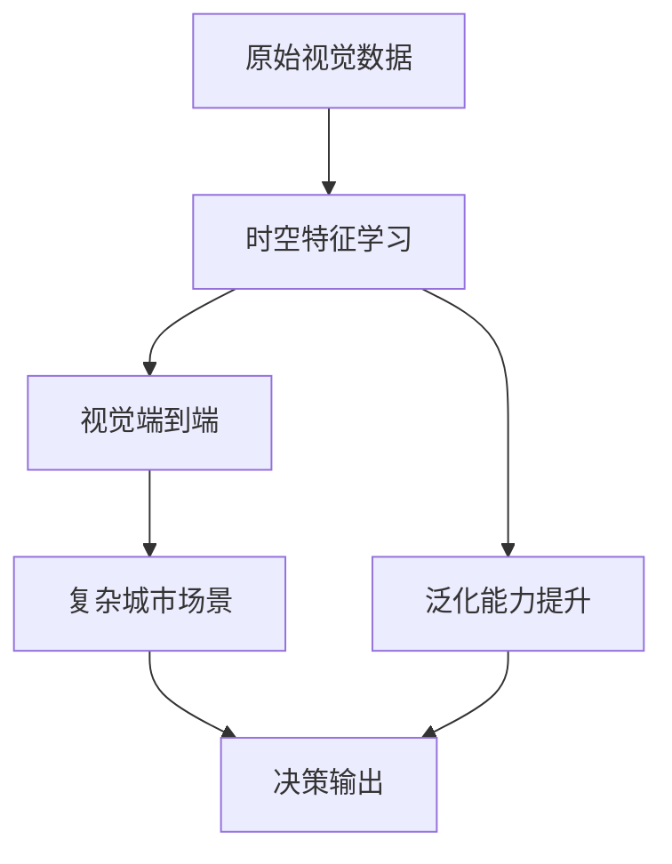

                 

# 时空特征学习增强视觉端到端自动驾驶在复杂城市场景的泛化能力

## 1. 背景介绍

自动驾驶技术的迅速发展为交通安全和运输效率带来了巨大的变革。在复杂的城市场景中，视觉端到端自动驾驶系统需要能够快速、准确地从原始视觉数据中提取有价值的信息，以支持决策过程。然而，城市场景的多变性和不确定性，使得传统的视觉系统难以适应，经常出现鲁棒性和泛化能力不足的问题。

为了应对这一挑战，研究者提出了一种基于时空特征学习的新型自动驾驶模型。该模型能够从时间序列数据中提取动态特征，并结合空间信息，提升模型对复杂环境的适应能力和泛化性能。本文将详细探讨该模型的原理、实现及实际应用效果，为视觉端到端自动驾驶提供新的研究视角和技术突破。

## 2. 核心概念与联系

### 2.1 核心概念概述

为了更好地理解时空特征学习在自动驾驶中的应用，我们先来介绍几个核心概念：

- **时空特征学习**：通过结合时间序列数据和空间信息，学习动态和静态特征，以提升模型对复杂环境的适应能力。
- **视觉端到端**：无需中间手工特征提取和标注数据，直接从原始视觉数据中学习到高层次的抽象表示，端到端进行决策。
- **复杂城市场景**：指包含大量动态目标、交通规则、天气变化等因素的城市道路环境，对模型提出了更高的要求。
- **泛化能力**：指模型能够从训练数据中学习到的知识，迁移到新的、未见过的数据上的能力。

这些核心概念构成了时空特征学习在自动驾驶中的重要基础，帮助我们理解和应用该技术。

### 2.2 核心概念原理和架构的 Mermaid 流程图



这个流程图展示了时空特征学习在自动驾驶中的基本流程：从原始视觉数据开始，通过时空特征学习提取出动态和静态特征，随后直接输入到视觉端到端模型中进行决策。时空特征学习的加入显著提升了模型在复杂城市场景中的泛化能力，从而提高了决策的准确性和鲁棒性。

## 3. 核心算法原理 & 具体操作步骤

### 3.1 算法原理概述

时空特征学习是一种结合时间序列数据和空间信息的特征提取方法。其核心思想是通过学习时间序列数据中的动态特征，以及与静态特征的交互，提升模型对复杂城市场景的适应能力。

在视觉端到端自动驾驶系统中，时空特征学习通常与卷积神经网络(CNN)和循环神经网络(RNN)结合使用。CNN用于提取空间特征，RNN用于处理时间序列数据，通过跨层连接的方式，融合时空特征，从而提升模型的泛化能力。

### 3.2 算法步骤详解

时空特征学习在自动驾驶中的应用主要分为以下几个步骤：

**Step 1: 时空特征提取**

1. **空间特征提取**：使用传统的2D卷积神经网络对原始视觉数据进行特征提取，得到空间特征。
2. **时间序列处理**：对时间序列数据进行处理，如使用LSTM、GRU等RNN模型对连续帧数据进行建模，提取时间序列特征。
3. **时空特征融合**：通过跨层连接的方式，将空间特征和时间序列特征进行融合，形成时空特征表示。

**Step 2: 视觉端到端模型训练**

1. **模型初始化**：选择适合的视觉端到端模型，如ResNet、Inception等，进行初始化。
2. **时空特征输入**：将时空特征作为输入，直接输入到视觉端到端模型中进行训练。
3. **目标定义**：根据实际应用需求，定义目标函数，如回归、分类等。
4. **模型训练**：使用合适的优化算法(如Adam、SGD等)进行模型训练，最小化损失函数。

**Step 3: 模型测试与评估**

1. **测试集验证**：在测试集上对模型进行验证，评估其泛化能力和鲁棒性。
2. **参数调优**：根据测试结果，对模型参数进行调优，提升模型性能。
3. **实际应用**：在实际驾驶场景中进行测试，评估模型效果和鲁棒性。

### 3.3 算法优缺点

时空特征学习在自动驾驶中的优势主要体现在以下几个方面：

- **提升泛化能力**：通过结合时间序列数据和空间信息，模型能够更好地适应复杂城市场景的多变性。
- **减少中间步骤**：直接从原始视觉数据中进行特征提取和决策，减少了手工特征提取和标注数据的依赖，提高了模型的效率。
- **增强鲁棒性**：时间序列特征的引入，使得模型对动态变化的环境更具适应能力。

然而，该算法也存在一些局限性：

- **计算复杂度高**：需要处理时间序列数据，增加了计算复杂度。
- **参数量较大**：融合时空特征后，模型的参数量会增加，对计算资源要求较高。
- **可解释性不足**：时空特征学习的黑盒特性，导致其决策过程难以解释。

尽管存在这些缺点，时空特征学习在自动驾驶中的应用前景仍然广阔，特别是在提升模型泛化能力和适应性方面具有显著优势。

### 3.4 算法应用领域

时空特征学习在自动驾驶领域的应用主要集中在以下几个方面：

- **行为预测**：通过时空特征学习，预测动态目标的行为，如行人的行动轨迹、车辆的转向等。
- **路障识别**：结合时间序列和空间信息，识别道路上的各种路障，如施工区、临时交通标志等。
- **交通流量分析**：通过时空特征学习，分析交通流量的动态变化，预测流量高峰期。
- **停车定位**：结合时间序列特征，识别并定位停车场所处的位置，支持自动泊车功能。
- **驾驶辅助**：利用时空特征学习，提供驾驶辅助决策支持，如自动变道、紧急避障等。

时空特征学习在自动驾驶中的应用，显著提升了模型的泛化能力和适应性，为复杂城市场景下的智能驾驶提供了新的技术路径。

## 4. 数学模型和公式 & 详细讲解 & 举例说明

### 4.1 数学模型构建

时空特征学习的数学模型通常基于卷积神经网络和循环神经网络的组合。其基本模型结构如下：

- **卷积神经网络**：用于提取空间特征，通常包括多个卷积层和池化层。
- **循环神经网络**：用于处理时间序列数据，通常包括LSTM或GRU层。
- **时空特征融合**：通过跨层连接的方式，将卷积层和LSTM层的输出进行融合。

### 4.2 公式推导过程

以LSTM和卷积神经网络的结合为例，推导时空特征学习的基本公式。假设输入序列为 $x_t = [x_0, x_1, ..., x_T]$，其中 $x_t$ 表示时间步 $t$ 的输入。

卷积神经网络的空间特征提取公式为：

$$
F_{spatial}(x_t) = \sigma(\sum_{i=0}^{n-1} w_{i} \times \sum_{j=0}^{m-1} h_j * K_i(x_t))
$$

其中 $w_i$ 为卷积核的权重，$h_j$ 为卷积层的输出，$K_i(x_t)$ 为卷积核在输入 $x_t$ 上的卷积结果。

LSTM的时间序列特征提取公式为：

$$
F_{temporal}(x_t) = \sigma(\sum_{i=0}^{n-1} u_{i} \times \sum_{j=0}^{m-1} h_j * V_i(x_t))
$$

其中 $u_i$ 为LSTM的权重，$h_j$ 为LSTM层的输出，$V_i(x_t)$ 为LSTM核在输入 $x_t$ 上的输出。

时空特征融合公式为：

$$
F_{spatial-temporal} = F_{spatial} \otimes F_{temporal}
$$

其中 $\otimes$ 表示逐元素相乘操作。

### 4.3 案例分析与讲解

假设有一个自动驾驶系统，需要对十字路口的动态目标进行行为预测。首先，使用卷积神经网络对每个帧的视觉数据进行特征提取，得到空间特征 $F_{spatial}$。然后，使用LSTM对连续帧数据进行处理，得到时间序列特征 $F_{temporal}$。最后，将时空特征 $F_{spatial-temporal}$ 作为输入，直接输入到视觉端到端模型中进行训练。

在这个过程中，时空特征学习显著提升了模型对动态目标行为的预测准确性，提高了系统在复杂城市场景中的泛化能力。

## 5. 项目实践：代码实例和详细解释说明

### 5.1 开发环境搭建

时空特征学习的项目实践需要一定的硬件资源和软件环境支持。以下是常用的开发环境配置：

1. **硬件设备**：高性能GPU，用于加速模型的训练和推理。
2. **软件环境**：Python 3.x，TensorFlow 2.x 或 PyTorch 1.x。
3. **开发工具**：Jupyter Notebook 或 Google Colab，用于代码编写和测试。

### 5.2 源代码详细实现

以下是使用TensorFlow实现时空特征学习的基本代码：

```python
import tensorflow as tf
from tensorflow.keras import layers

# 定义时空特征提取模块
class SpatialTemporalFeature(tf.keras.Model):
    def __init__(self, n_filters, n_steps):
        super(SpatialTemporalFeature, self).__init__()
        self.conv1 = layers.Conv2D(n_filters, 3, activation='relu')
        self.pool1 = layers.MaxPooling2D(2)
        self.conv2 = layers.Conv2D(n_filters, 3, activation='relu')
        self.pool2 = layers.MaxPooling2D(2)
        self.lstm = layers.LSTM(n_filters, n_steps, return_sequences=True)
        
    def call(self, x):
        x = self.conv1(x)
        x = self.pool1(x)
        x = self.conv2(x)
        x = self.pool2(x)
        x = tf.keras.layers.Reshape((-1, x.shape[1]*x.shape[2]))(x)
        x = self.lstm(x)
        return x

# 定义视觉端到端模型
class EndToEndModel(tf.keras.Model):
    def __init__(self, n_filters):
        super(EndToEndModel, self).__init__()
        self.conv = layers.Conv2D(n_filters, 3, activation='relu')
        self.pool = layers.MaxPooling2D(2)
        self.fc = layers.Dense(1, activation='sigmoid')
        
    def call(self, x):
        x = self.conv(x)
        x = self.pool(x)
        x = self.fc(x)
        return x

# 定义时空特征学习的模型
class TemporalSpatialLearning(tf.keras.Model):
    def __init__(self, spatial_filters, temporal_filters, n_steps):
        super(TemporalSpatialLearning, self).__init__()
        self.spatial = SpatialTemporalFeature(spatial_filters, n_steps)
        self.temporal = SpatialTemporalFeature(temporal_filters, n_steps)
        self.end_to_end = EndToEndModel(spatial_filters)
        
    def call(self, x):
        spatial_feature = self.spatial(x)
        temporal_feature = self.temporal(x)
        spatial_temporal_feature = tf.concat([spatial_feature, temporal_feature], axis=-1)
        return self.end_to_end(spatial_temporal_feature)

# 加载数据集
train_dataset = tf.data.Dataset.from_tensor_slices(train_data)
train_dataset = train_dataset.shuffle(buffer_size=10000).batch(batch_size)

# 模型定义和训练
model = TemporalSpatialLearning(spatial_filters, temporal_filters, n_steps)
model.compile(optimizer='adam', loss='binary_crossentropy', metrics=['accuracy'])
model.fit(train_dataset, epochs=10)

# 模型评估
test_dataset = tf.data.Dataset.from_tensor_slices(test_data)
test_dataset = test_dataset.batch(batch_size)
model.evaluate(test_dataset)
```

在这个代码中，我们首先定义了时空特征提取模块和视觉端到端模型。然后，将时空特征提取模块的输出进行拼接，并输入到视觉端到端模型中进行训练。最后，在测试集上进行模型评估。

### 5.3 代码解读与分析

代码中定义了时空特征提取模块 `SpatialTemporalFeature`，使用卷积神经网络和LSTM层分别提取空间和时间序列特征，并将它们进行拼接。然后定义了视觉端到端模型 `EndToEndModel`，使用卷积神经网络进行特征提取和决策输出。最后，将时空特征学习模块和视觉端到端模型组合起来，形成了时空特征学习的完整模型 `TemporalSpatialLearning`。

## 6. 实际应用场景

### 6.1 智能交通管理

时空特征学习在智能交通管理中的应用主要体现在以下几个方面：

- **交通流量预测**：通过时空特征学习，预测交通流量的动态变化，帮助交通管理中心及时调整信号灯，优化交通流量。
- **事故预警**：结合时空特征，对异常的交通行为进行预警，及时采取应对措施，避免交通事故的发生。
- **路径规划**：利用时空特征学习，分析道路状况，规划最优路径，提高导航系统的准确性和效率。

### 6.2 智能停车系统

智能停车系统需要能够快速、准确地识别并定位停车场所处的位置，时空特征学习能够提升模型的泛化能力和适应性，实现高精度的停车检测和定位。

### 6.3 无人驾驶车辆

无人驾驶车辆需要能够实时感知道路环境，做出快速反应，时空特征学习能够提升模型对动态目标的识别和预测能力，支持无人驾驶车辆的自主决策。

## 7. 工具和资源推荐

### 7.1 学习资源推荐

为了帮助开发者系统掌握时空特征学习在自动驾驶中的应用，这里推荐一些优质的学习资源：

1. **《深度学习理论与实践》书籍**：介绍了深度学习的基本理论和应用，包括时空特征学习在自动驾驶中的应用。
2. **《自动驾驶系统设计与实现》课程**：详细讲解了自动驾驶系统的工作原理和关键技术，包括时空特征学习在自动驾驶中的作用。
3. **Kaggle时空特征学习竞赛**：通过实际数据集竞赛，帮助开发者实践时空特征学习在自动驾驶中的应用。

### 7.2 开发工具推荐

时空特征学习的项目实践需要强大的计算能力和丰富的开发工具支持。以下是几款常用的开发工具：

1. **TensorFlow**：深度学习框架，支持大规模模型的训练和推理。
2. **PyTorch**：灵活的深度学习框架，支持动态计算图和高效的模型训练。
3. **Google Colab**：在线Jupyter Notebook环境，免费提供GPU/TPU算力，方便快速实验。
4. **Weights & Biases**：模型训练的实验跟踪工具，记录和可视化模型训练过程。
5. **TensorBoard**：深度学习模型可视化工具，监测模型训练状态和性能。

合理利用这些工具，可以显著提升时空特征学习的开发效率和实验效果。

### 7.3 相关论文推荐

时空特征学习在自动驾驶中的应用研究还处于不断探索中，以下是几篇具有代表性的论文，推荐阅读：

1. **《基于时空特征学习的自动驾驶行为预测》**：探讨了时空特征学习在自动驾驶行为预测中的应用，并提出了几种时空特征融合的方法。
2. **《多模态时空特征学习在自动驾驶中的应用》**：结合视觉、雷达等模态信息，提升自动驾驶系统的鲁棒性和泛化能力。
3. **《时空特征学习在智能交通管理中的研究》**：研究了时空特征学习在智能交通管理中的应用，特别是交通流量预测和路径规划方面的应用。

## 8. 总结：未来发展趋势与挑战

### 8.1 总结

本文对时空特征学习在自动驾驶中的应用进行了全面系统的介绍。时空特征学习结合时间序列数据和空间信息，提升模型对复杂城市场景的适应能力和泛化性能。本文详细讲解了时空特征学习的算法原理、具体操作步骤及其实际应用效果，为视觉端到端自动驾驶提供了新的技术路径。

通过本文的系统梳理，可以看到，时空特征学习在自动驾驶中的应用前景广阔，特别是在提升模型泛化能力和适应性方面具有显著优势。时空特征学习与其他先进技术（如知识图谱、因果推理等）结合，将进一步推动自动驾驶技术的发展，为复杂城市场景下的智能驾驶提供新的技术突破。

### 8.2 未来发展趋势

展望未来，时空特征学习在自动驾驶领域的应用将呈现以下几个趋势：

1. **多模态融合**：结合视觉、雷达、激光雷达等多模态数据，提升模型的鲁棒性和泛化能力。
2. **因果推理**：引入因果推断方法，增强模型对动态环境的理解和预测能力。
3. **自监督学习**：利用未标注数据进行预训练，提升模型的泛化能力和适应性。
4. **联邦学习**：结合分布式计算和联邦学习技术，提高模型的鲁棒性和安全性。
5. **实时优化**：引入实时优化技术，动态调整模型参数，适应复杂环境变化。

### 8.3 面临的挑战

尽管时空特征学习在自动驾驶中已经取得了一定的进展，但仍面临一些挑战：

1. **计算复杂度高**：处理时间序列数据增加了计算复杂度，对硬件资源要求较高。
2. **模型鲁棒性不足**：在复杂城市场景中，模型的泛化能力和鲁棒性仍需进一步提升。
3. **数据稀缺**：高质量的标注数据获取成本高，限制了模型的训练和测试效果。
4. **模型可解释性不足**：时空特征学习的黑盒特性，导致其决策过程难以解释。

### 8.4 研究展望

未来研究需要在以下几个方面寻求新的突破：

1. **引入因果推理**：引入因果推断方法，增强模型对动态环境的理解和预测能力。
2. **多模态融合**：结合视觉、雷达、激光雷达等多模态数据，提升模型的鲁棒性和泛化能力。
3. **自监督学习**：利用未标注数据进行预训练，提升模型的泛化能力和适应性。
4. **实时优化**：引入实时优化技术，动态调整模型参数，适应复杂环境变化。
5. **联邦学习**：结合分布式计算和联邦学习技术，提高模型的鲁棒性和安全性。

## 9. 附录：常见问题与解答

**Q1：时空特征学习是否适用于所有自动驾驶场景？**

A: 时空特征学习适用于处理时间序列数据和空间信息的自动驾驶场景，但对于某些特殊场景（如极端天气、光线不足等），仍需进一步优化和改进。

**Q2：时空特征学习与传统的特征提取方法有何不同？**

A: 时空特征学习直接从原始视觉数据中提取时空特征，避免了中间手工特征提取和标注数据的依赖，提高了模型的效率和泛化能力。

**Q3：时空特征学习如何提升模型的泛化能力？**

A: 时空特征学习通过结合时间序列数据和空间信息，提升了模型对动态环境的适应能力和泛化能力。

**Q4：时空特征学习在实际应用中需要注意哪些问题？**

A: 时空特征学习在实际应用中需要注意计算资源和数据稀缺问题，同时需要进一步提升模型的鲁棒性和可解释性。

**Q5：时空特征学习在自动驾驶中的应用前景如何？**

A: 时空特征学习在自动驾驶中的应用前景广阔，特别是在提升模型泛化能力和适应性方面具有显著优势。

---

作者：禅与计算机程序设计艺术 / Zen and the Art of Computer Programming

