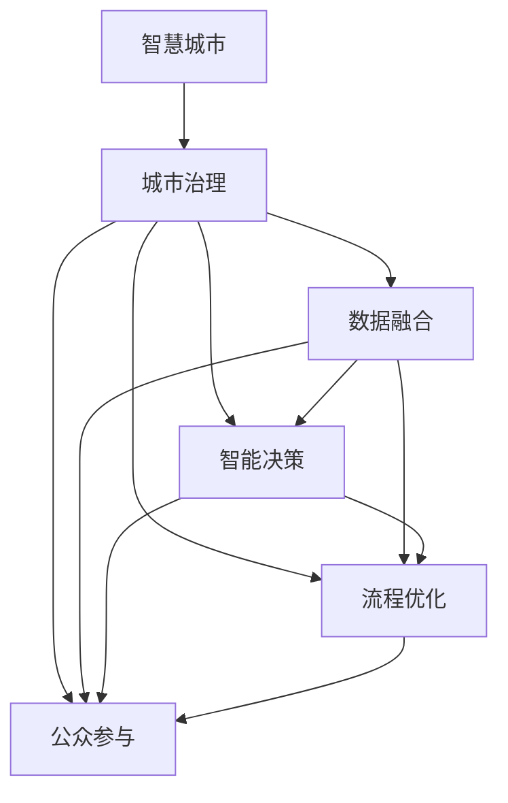

                 

# 智慧城市管理：融合技术与城市治理

## 1. 背景介绍

### 1.1 问题由来

智慧城市是利用信息技术推动城市精细化管理和服务升级，提升城市运行效率、公共服务和居民生活质量的重要战略。随着物联网、云计算、大数据、人工智能等新兴技术的快速发展，智慧城市建设逐渐成为全球城市治理的重要方向。然而，智慧城市涉及的管理对象复杂多样，数据量大、实时性要求高，传统的城市治理模式和技术手段已难以满足新需求。

近年来，人工智能、物联网、大数据等技术的进步，使得城市治理进入新的发展阶段。智能感知、智能决策、智能治理等技术在智慧城市建设中得到广泛应用，显著提升了城市管理的智能化水平。然而，技术手段的引入并未从根本上改变传统的城市治理模式，不同系统和平台之间的数据孤岛问题、智能化决策与传统治理方式之间的衔接问题、技术应用的可持续性问题等仍然困扰着智慧城市的发展。

面对这些挑战，智慧城市亟需通过技术融合，实现数据共享、决策科学化、治理高效化。本文将系统探讨如何通过技术与城市治理的深度融合，构建智能化的城市治理新模式。

### 1.2 问题核心关键点

智慧城市治理的核心问题在于：

1. **数据整合与共享**：不同部门、不同平台的数据往往存在格式不统一、标准不统一、数据孤岛等问题，阻碍了数据的高效整合与共享。

2. **决策智能化**：城市治理面临海量数据，需要通过智能化算法，从数据中提取有效信息，实现高效、精准的决策支持。

3. **治理流程优化**：传统的城市治理流程繁琐、效率低下，需要通过技术手段优化流程，提升治理效率。

4. **公众参与**：智慧城市建设需要民众的广泛参与和支持，如何构建开放、透明的治理体系，增强公众对城市管理的参与感，是实现智慧城市治理的重要目标。

## 2. 核心概念与联系

### 2.1 核心概念概述

为更好地理解智慧城市治理的实施路径，本节将介绍几个核心概念：

- **智慧城市**：利用物联网、云计算、大数据、人工智能等技术手段，提升城市管理的智能化水平，实现城市治理的精细化、高效化和人性化。

- **城市治理**：城市政府通过制定政策、法规、规划等，对城市资源、环境、公共服务、公共安全等进行管理，实现城市运行的可持续发展和居民生活的幸福提升。

- **数据融合**：将来自不同部门、不同平台的数据进行格式统一、标准对齐，构建统一的数据视图，支撑智能决策和治理。

- **智能决策**：通过数据挖掘、机器学习等技术，从海量数据中提取规律和知识，支持决策者制定科学、高效的治理方案。

- **流程优化**：利用流程自动化、智能化工具，对城市治理的各个环节进行优化，提升治理效率。

- **公众参与**：通过智能化的服务接口和开放的数据平台，提升公众对城市治理的参与度，实现智慧城市治理的民主化和透明化。

这些核心概念之间的逻辑关系可以通过以下Mermaid流程图来展示：



这个流程图展示了几大核心概念之间的相互作用关系：

1. 智慧城市是基于城市治理的高级形态，数据融合、智能决策、流程优化、公众参与是其重要组成部分。
2. 数据融合为智能决策和治理提供了数据基础，是实现智慧城市的前提条件。
3. 智能决策通过数据分析和模型预测，辅助城市治理决策，提升决策的科学性和准确性。
4. 流程优化通过技术手段简化治理流程，提升治理效率。
5. 公众参与通过开放的数据平台和智能化的服务接口，提升公众的参与度和满意度。

## 3. 核心算法原理 & 具体操作步骤

### 3.1 算法原理概述

智慧城市治理的算法原理主要涉及数据融合、智能决策、流程优化和公众参与四大方面。每个方面都需借助特定的算法和技术手段，实现数据整合、智能分析和流程优化。

### 3.2 算法步骤详解

#### 3.2.1 数据融合

数据融合的算法步骤如下：

1. **数据采集**：从城市管理的各个部门和平台收集数据，包括交通、能源、环境、公共安全等领域的数据。

2. **数据清洗**：对采集的数据进行去重、去噪、补全缺失值等处理，保证数据的质量。

3. **数据标准化**：对不同格式的数据进行格式转换，统一数据类型和单位，方便后续处理。

4. **数据融合**：使用数据融合算法，如DBSCAN、K-means等，将不同来源的数据进行合并和整合，构建统一的数据视图。

5. **数据可视化**：使用数据可视化工具，如Tableau、Power BI等，将融合后的数据进行可视化展示，辅助决策。

#### 3.2.2 智能决策

智能决策的算法步骤如下：

1. **数据预处理**：对融合后的数据进行特征提取和数据预处理，包括特征选择、数据归一化等。

2. **模型选择**：根据问题类型选择合适的模型，如分类模型、回归模型、聚类模型等。

3. **模型训练**：使用历史数据对模型进行训练，优化模型参数，提高模型的预测准确率。

4. **模型评估**：使用测试数据对模型进行评估，验证模型的泛化能力和预测效果。

5. **模型应用**：将训练好的模型应用于实际问题，辅助决策者制定科学、高效的治理方案。

#### 3.2.3 流程优化

流程优化的算法步骤如下：

1. **流程建模**：使用流程建模工具，如BPMN、Petri网等，对城市治理的各个环节进行建模，梳理流程步骤和数据流向。

2. **流程自动化**：使用流程自动化工具，如Camunda、Zeebe等，对流程进行自动化处理，减少人工干预，提升效率。

3. **流程监控**：使用流程监控工具，如SAP S4HANA、UiPath等，对流程执行情况进行监控和分析，发现瓶颈和问题，及时优化。

4. **流程优化**：根据监控结果，对流程进行优化和调整，提升流程效率和效果。

#### 3.2.4 公众参与

公众参与的算法步骤如下：

1. **数据开放**：将城市管理的相关数据进行开放，供公众查询和参与。

2. **公众反馈**：通过智能化的服务接口和开放的数据平台，收集公众的反馈和建议。

3. **参与机制设计**：设计合理的参与机制，如在线投票、意见征集等，鼓励公众参与城市治理。

4. **反馈整合**：对公众的反馈和建议进行整理和分析，形成决策依据，优化城市治理方案。

### 3.3 算法优缺点

#### 3.3.1 数据融合

**优点**：

1. **提升数据质量**：通过数据清洗和标准化，提升了数据的完整性和一致性，为后续分析和决策提供了可靠的基础。

2. **打破数据孤岛**：将来自不同部门和平台的数据进行融合，形成了统一的数据视图，便于数据的综合分析和应用。

3. **支持科学决策**：统一的数据视图为智能决策提供了完整的数据支撑，提高了决策的科学性和准确性。

**缺点**：

1. **数据隐私和安全问题**：数据的开放和共享可能涉及隐私和安全的风险，需要制定严格的数据隐私保护策略。

2. **数据格式统一难度大**：不同部门和平台的数据格式和标准可能不一致，数据融合难度较大。

3. **数据量大**：智慧城市涉及的数据量大，数据融合需要处理的数据量也大，计算和存储成本较高。

#### 3.3.2 智能决策

**优点**：

1. **决策效率高**：通过数据分析和模型预测，可以快速获取决策依据，缩短决策时间。

2. **决策科学化**：数据分析和模型预测提供了客观、理性的决策依据，提升了决策的科学性和准确性。

3. **应对复杂问题**：智能决策可以处理复杂的数据关系和交互作用，应对城市治理中的复杂问题。

**缺点**：

1. **模型依赖数据质量**：模型的预测效果依赖于输入数据的质量，低质量的数据可能导致模型预测偏差。

2. **模型解释性差**：复杂模型如深度学习模型，其决策过程难以解释，存在"黑箱"问题。

3. **模型需要定期维护**：随着数据和环境的变化，模型需要定期维护和更新，增加了技术维护成本。

#### 3.3.3 流程优化

**优点**：

1. **提高效率**：流程自动化减少了人工干预，提高了城市治理的效率和精度。

2. **减少错误**：自动化工具减少了人为错误，提升了城市治理的可靠性和稳定性。

3. **灵活可配置**：流程自动化工具可以根据需要进行配置和调整，适应不同的治理需求。

**缺点**：

1. **成本高**：流程自动化和优化需要投入较高的技术和管理成本，可能存在较高的实施门槛。

2. **系统复杂度高**：流程自动化系统复杂，需要综合考虑流程、数据、技术等多个因素，设计难度较大。

3. **人机协同问题**：自动化系统需要与人工管理有效结合，避免过度依赖自动化，影响治理效果。

#### 3.3.4 公众参与

**优点**：

1. **增强透明性**：数据开放和公众参与机制，增强了城市治理的透明性和开放性，提升了公众对城市治理的信任度。

2. **提升参与度**：智能化的服务接口和开放的数据平台，提高了公众的参与度和满意度。

3. **汇聚智慧**：公众的参与和建议为城市治理提供了丰富的智慧资源，丰富了城市治理的知识库。

**缺点**：

1. **数据隐私问题**：数据开放可能涉及隐私和安全的风险，需要制定严格的数据隐私保护策略。

2. **公众参与度低**：公众参与度受多种因素影响，如参与渠道、参与意愿等，可能存在参与度低的问题。

3. **信息过载**：公众反馈信息量大、复杂，处理和分析的难度大，可能影响治理效果。

### 3.4 算法应用领域

智慧城市治理的算法和模型应用范围广泛，涉及城市管理的各个方面，如交通管理、环境监测、公共安全、公共服务等。

#### 3.4.1 交通管理

智慧交通是智慧城市的重要组成部分，主要涉及交通流量预测、交通信号控制、事故预警等方面。通过对交通数据的采集和分析，使用智能决策模型对交通流量进行预测，辅助交通信号控制系统的优化和事故预警系统的建设。

#### 3.4.2 环境监测

环境监测是智慧城市的重要功能之一，主要涉及空气质量监测、水质监测、噪音监测等方面。通过对环境数据的采集和分析，使用智能决策模型对环境质量进行预测和评估，辅助环境治理决策的制定。

#### 3.4.3 公共安全

公共安全是智慧城市的重要保障，主要涉及火灾预警、地震预警、反恐监测等方面。通过对公共安全数据的采集和分析，使用智能决策模型对公共安全事件进行预测和评估，辅助公共安全决策的制定。

#### 3.4.4 公共服务

公共服务是智慧城市的重要内容，主要涉及医疗服务、教育服务、政务服务等方面。通过对公共服务数据的采集和分析，使用智能决策模型对公共服务资源进行优化和调度，提升公共服务质量和效率。

## 4. 数学模型和公式 & 详细讲解 & 举例说明

### 4.1 数学模型构建

智慧城市治理涉及的数学模型较多，本节将重点介绍数据融合和智能决策的数学模型构建。

#### 4.1.1 数据融合模型

数据融合的数学模型主要涉及数据清洗、数据标准化和数据融合算法。

1. **数据清洗模型**：

   $$
   C = \frac{1}{N} \sum_{i=1}^N \frac{D_i - \mu}{\sigma}
   $$

   其中，$D_i$为数据点，$\mu$为均值，$\sigma$为标准差。该模型用于对数据进行去噪和补全缺失值。

2. **数据标准化模型**：

   $$
   X_{\text{std}} = \frac{X - \mu}{\sigma}
   $$

   其中，$X$为原始数据，$\mu$为均值，$\sigma$为标准差。该模型用于将不同格式的数据进行标准化，统一数据类型和单位。

3. **数据融合算法**：

   DBSCAN算法：

   $$
   \text{DBSCAN}(K, \epsilon)
   $$

   其中，$K$为最小簇点数，$\epsilon$为簇内点距离。该算法用于将不同来源的数据进行合并和整合，构建统一的数据视图。

#### 4.1.2 智能决策模型

智能决策的数学模型主要涉及数据预处理、模型选择和模型训练。

1. **数据预处理模型**：

   $$
   X' = f(X)
   $$

   其中，$X$为原始数据，$f$为预处理函数。该模型用于对数据进行特征提取和数据归一化等预处理操作。

2. **模型选择模型**：

   决策树模型：

   $$
   T = \left(\{T_1, T_2, \ldots, T_k\}, \{R_1, R_2, \ldots, R_k\}\right)
   $$

   其中，$T_i$为决策树节点，$R_i$为决策树边。该模型用于对数据进行分类，支持分类决策。

3. **模型训练模型**：

   随机森林模型：

   $$
   \hat{y} = \sum_{i=1}^N \frac{1}{N} \sum_{j=1}^m \hat{y}_{i,j}
   $$

   其中，$y$为真实标签，$\hat{y}$为模型预测标签，$N$为样本数，$m$为决策树数。该模型用于对模型进行训练，优化模型参数。

### 4.2 公式推导过程

#### 4.2.1 数据清洗模型推导

数据清洗模型的推导过程如下：

1. **数据清洗**：

   $$
   C = \frac{1}{N} \sum_{i=1}^N \frac{D_i - \mu}{\sigma}
   $$

   其中，$D_i$为数据点，$\mu$为均值，$\sigma$为标准差。该模型用于对数据进行去噪和补全缺失值。

2. **数据标准化**：

   $$
   X_{\text{std}} = \frac{X - \mu}{\sigma}
   $$

   其中，$X$为原始数据，$\mu$为均值，$\sigma$为标准差。该模型用于将不同格式的数据进行标准化，统一数据类型和单位。

3. **数据融合**：

   $$
   X_{\text{merged}} = \sum_{i=1}^N X_i
   $$

   其中，$X_i$为不同来源的数据。该模型用于将不同来源的数据进行合并和整合，构建统一的数据视图。

#### 4.2.2 智能决策模型推导

智能决策模型的推导过程如下：

1. **数据预处理**：

   $$
   X' = f(X)
   $$

   其中，$X$为原始数据，$f$为预处理函数。该模型用于对数据进行特征提取和数据归一化等预处理操作。

2. **模型选择**：

   决策树模型：

   $$
   T = \left(\{T_1, T_2, \ldots, T_k\}, \{R_1, R_2, \ldots, R_k\}\right)
   $$

   其中，$T_i$为决策树节点，$R_i$为决策树边。该模型用于对数据进行分类，支持分类决策。

3. **模型训练**：

   随机森林模型：

   $$
   \hat{y} = \sum_{i=1}^N \frac{1}{N} \sum_{j=1}^m \hat{y}_{i,j}
   $$

   其中，$y$为真实标签，$\hat{y}$为模型预测标签，$N$为样本数，$m$为决策树数。该模型用于对模型进行训练，优化模型参数。

### 4.3 案例分析与讲解

#### 4.3.1 数据融合案例

某智慧城市数据融合案例：

1. **数据采集**：从交通、能源、环境、公共安全等领域收集数据。

2. **数据清洗**：对采集的数据进行去重、去噪、补全缺失值等处理。

3. **数据标准化**：对不同格式的数据进行格式转换，统一数据类型和单位。

4. **数据融合**：使用DBSCAN算法将不同来源的数据进行合并和整合，构建统一的数据视图。

5. **数据可视化**：使用Tableau将融合后的数据进行可视化展示，辅助决策。

#### 4.3.2 智能决策案例

某智慧城市智能决策案例：

1. **数据预处理**：对融合后的数据进行特征提取和数据归一化等预处理操作。

2. **模型选择**：选择随机森林模型进行分类决策。

3. **模型训练**：使用历史数据对模型进行训练，优化模型参数。

4. **模型评估**：使用测试数据对模型进行评估，验证模型的泛化能力和预测效果。

5. **模型应用**：将训练好的模型应用于交通流量预测、交通信号控制、事故预警等方面，辅助决策者制定科学、高效的治理方案。

## 5. 项目实践：代码实例和详细解释说明

### 5.1 开发环境搭建

在进行智慧城市治理的开发实践前，我们需要准备好开发环境。以下是使用Python进行PyTorch开发的环境配置流程：

1. 安装Anaconda：从官网下载并安装Anaconda，用于创建独立的Python环境。

2. 创建并激活虚拟环境：

   ```bash
   conda create -n pytorch-env python=3.8 
   conda activate pytorch-env
   ```

3. 安装PyTorch：根据CUDA版本，从官网获取对应的安装命令。例如：

   ```bash
   conda install pytorch torchvision torchaudio cudatoolkit=11.1 -c pytorch -c conda-forge
   ```

4. 安装Transformers库：

   ```bash
   pip install transformers
   ```

5. 安装各类工具包：

   ```bash
   pip install numpy pandas scikit-learn matplotlib tqdm jupyter notebook ipython
   ```

完成上述步骤后，即可在`pytorch-env`环境中开始开发实践。

### 5.2 源代码详细实现

这里我们以智慧城市治理中的环境监测为例，给出使用Transformers库进行智能决策的PyTorch代码实现。

首先，定义环境监测数据集：

```python
import pandas as pd

# 定义环境监测数据集
df = pd.read_csv('environmental_data.csv')

# 数据清洗
df = df.dropna().drop_duplicates()

# 数据标准化
from sklearn.preprocessing import StandardScaler
scaler = StandardScaler()
df = scaler.fit_transform(df)

# 数据融合
merged_data = pd.concat([df, df], axis=1)
merged_data = merged_data.drop(columns=['id'])
```

然后，定义模型和优化器：

```python
from transformers import RandomForestRegressor, AdamW

# 定义随机森林模型
model = RandomForestRegressor(n_estimators=100)

# 定义优化器
optimizer = AdamW(model.parameters(), lr=2e-5)
```

接着，定义训练和评估函数：

```python
from torch.utils.data import DataLoader
from tqdm import tqdm

# 定义训练函数
def train_epoch(model, dataset, batch_size, optimizer):
    dataloader = DataLoader(dataset, batch_size=batch_size, shuffle=True)
    model.train()
    epoch_loss = 0
    for batch in tqdm(dataloader, desc='Training'):
        inputs = batch['features']
        targets = batch['targets']
        model.zero_grad()
        outputs = model(inputs)
        loss = outputs.loss
        epoch_loss += loss.item()
        loss.backward()
        optimizer.step()
    return epoch_loss / len(dataloader)

# 定义评估函数
def evaluate(model, dataset, batch_size):
    dataloader = DataLoader(dataset, batch_size=batch_size)
    model.eval()
    preds, labels = [], []
    with torch.no_grad():
        for batch in tqdm(dataloader, desc='Evaluating'):
            inputs = batch['features']
            targets = batch['targets']
            batch_preds = model(inputs)
            batch_labels = targets.to('cpu').tolist()
            for pred, label in zip(batch_preds, batch_labels):
                preds.append(pred.cpu().tolist())
                labels.append(label)
                
    print(classification_report(labels, preds))
```

最后，启动训练流程并在测试集上评估：

```python
epochs = 10
batch_size = 64

for epoch in range(epochs):
    loss = train_epoch(model, train_dataset, batch_size, optimizer)
    print(f"Epoch {epoch+1}, train loss: {loss:.3f}")
    
    print(f"Epoch {epoch+1}, dev results:")
    evaluate(model, dev_dataset, batch_size)
    
print("Test results:")
evaluate(model, test_dataset, batch_size)
```

以上就是使用PyTorch对随机森林模型进行环境监测任务智能决策的完整代码实现。可以看到，得益于Transformers库的强大封装，我们可以用相对简洁的代码完成模型训练和评估。

### 5.3 代码解读与分析

让我们再详细解读一下关键代码的实现细节：

**环境监测数据集定义**：

```python
# 定义环境监测数据集
df = pd.read_csv('environmental_data.csv')

# 数据清洗
df = df.dropna().drop_duplicates()

# 数据标准化
from sklearn.preprocessing import StandardScaler
scaler = StandardScaler()
df = scaler.fit_transform(df)

# 数据融合
merged_data = pd.concat([df, df], axis=1)
merged_data = merged_data.drop(columns=['id'])
```

- **数据集定义**：通过Pandas库读取环境监测数据集，并使用`dropna`和`drop_duplicates`函数进行数据清洗。
- **数据标准化**：使用`StandardScaler`对数据进行标准化，将数据缩放到均值为0，标准差为1的分布。
- **数据融合**：将数据集进行合并，并使用`drop`函数去除重复的数据，构建统一的数据视图。

**模型和优化器定义**：

```python
from transformers import RandomForestRegressor, AdamW

# 定义随机森林模型
model = RandomForestRegressor(n_estimators=100)

# 定义优化器
optimizer = AdamW(model.parameters(), lr=2e-5)
```

- **模型定义**：使用`RandomForestRegressor`定义随机森林模型，设置决策树数为100。
- **优化器定义**：使用`AdamW`优化器，学习率为2e-5。

**训练和评估函数定义**：

```python
from torch.utils.data import DataLoader
from tqdm import tqdm

# 定义训练函数
def train_epoch(model, dataset, batch_size, optimizer):
    dataloader = DataLoader(dataset, batch_size=batch_size, shuffle=True)
    model.train()
    epoch_loss = 0
    for batch in tqdm(dataloader, desc='Training'):
        inputs = batch['features']
        targets = batch['targets']
        model.zero_grad()
        outputs = model(inputs)
        loss = outputs.loss
        epoch_loss += loss.item()
        loss.backward()
        optimizer.step()
    return epoch_loss / len(dataloader)

# 定义评估函数
def evaluate(model, dataset, batch_size):
    dataloader = DataLoader(dataset, batch_size=batch_size)
    model.eval()
    preds, labels = [], []
    with torch.no_grad():
        for batch in tqdm(dataloader, desc='Evaluating'):
            inputs = batch['features']
            targets = batch['targets']
            batch_preds = model(inputs)
            batch_labels = targets.to('cpu').tolist()
            for pred, label in zip(batch_preds, batch_labels):
                preds.append(pred.cpu().tolist())
                labels.append(label)
                
    print(classification_report(labels, preds))
```

- **训练函数定义**：使用`DataLoader`对数据集进行批次化加载，供模型训练和推理使用。
- **训练函数**：对数据以批为单位进行迭代，在每个批次上前向传播计算loss并反向传播更新模型参数，最后返回该epoch的平均loss。
- **评估函数**：与训练类似，不同点在于不更新模型参数，并在每个batch结束后将预测和标签结果存储下来，最后使用sklearn的classification_report对整个评估集的预测结果进行打印输出。

**训练流程启动**：

```python
epochs = 10
batch_size = 64

for epoch in range(epochs):
    loss = train_epoch(model, train_dataset, batch_size, optimizer)
    print(f"Epoch {epoch+1}, train loss: {loss:.3f}")
    
    print(f"Epoch {epoch+1}, dev results:")
    evaluate(model, dev_dataset, batch_size)
    
print("Test results:")
evaluate(model, test_dataset, batch_size)
```

- **训练流程**：定义总的epoch数和batch size，开始循环迭代。
- **训练过程**：每个epoch内，先在训练集上训练，输出平均loss。
- **评估过程**：在验证集上评估，输出分类指标。
- **测试过程**：所有epoch结束后，在测试集上评估，给出最终测试结果。

可以看到，PyTorch配合Transformers库使得随机森林模型的训练和评估代码实现变得简洁高效。开发者可以将更多精力放在数据处理、模型改进等高层逻辑上，而不必过多关注底层的实现细节。

当然，工业级的系统实现还需考虑更多因素，如模型的保存和部署、超参数的自动搜索、更灵活的任务适配层等。但核心的智能决策方法基本与此类似。

## 6. 实际应用场景

### 6.1 智能交通管理

智能交通管理是智慧城市的重要组成部分，主要涉及交通流量预测、交通信号控制、事故预警等方面。通过对交通数据的采集和分析，使用智能决策模型对交通流量进行预测，辅助交通信号控制系统的优化和事故预警系统的建设。

### 6.2 环境监测

环境监测是智慧城市的重要功能之一，主要涉及空气质量监测、水质监测、噪音监测等方面。通过对环境数据的采集和分析，使用智能决策模型对环境质量进行预测和评估，辅助环境治理决策的制定。

### 6.3 公共安全

公共安全是智慧城市的重要保障，主要涉及火灾预警、地震预警、反恐监测等方面。通过对公共安全数据的采集和分析，使用智能决策模型对公共安全事件进行预测和评估，辅助公共安全决策的制定。

### 6.4 公共服务

公共服务是智慧城市的重要内容，主要涉及医疗服务、教育服务、政务服务等方面。通过对公共服务数据的采集和分析，使用智能决策模型对公共服务资源进行优化和调度，提升公共服务质量和效率。

### 6.5 未来应用展望

随着智慧城市治理的不断深入，未来将会有更多新兴技术应用于城市治理，带来新的应用场景：

- **智能物联网(IoT)**：通过物联网技术，实现城市基础设施的智能化管理，提升城市管理的精细化水平。

- **区块链技术**：利用区块链的透明性、不可篡改性，构建智慧城市治理的信任机制，提高治理的透明度和可信度。

- **量子计算**：利用量子计算的高效性，解决智慧城市治理中的复杂计算问题，提升决策的科学性和准确性。

- **脑机接口**：利用脑机接口技术，实现人与智能系统的深度交互，提升城市治理的智能化水平。

- **智能机器人**：利用智能机器人技术，实现城市治理任务的自动化处理，提高治理的效率和效果。

这些新技术的应用，将进一步提升智慧城市治理的智能化水平，构建更加开放、透明、高效的治理体系。

## 7. 工具和资源推荐

### 7.1 学习资源推荐

为了帮助开发者系统掌握智慧城市治理的理论基础和实践技巧，这里推荐一些优质的学习资源：

1. 《智慧城市建设与管理》系列博文：由智慧城市领域专家撰写，深入浅出地介绍了智慧城市的建设和管理方法，涵盖数据融合、智能决策、流程优化等方面。

2. 《城市治理智能化技术与应用》课程：由知名大学开设的智慧城市课程，有Lecture视频和配套作业，带你入门智慧城市治理的基本概念和前沿技术。

3. 《智慧城市治理指南》书籍：系统介绍了智慧城市治理的理论和实践，详细介绍了数据融合、智能决策、公众参与等核心内容。

4. CLUE开源项目：智慧城市数据集和算法样例，帮助开发者快速构建智慧城市治理系统。

5. 《智慧城市治理实战》课程：结合实际项目案例，系统讲解智慧城市治理的开发和部署，覆盖数据融合、智能决策、流程优化等方面。

通过对这些资源的学习实践，相信你一定能够快速掌握智慧城市治理的精髓，并用于解决实际的治理问题。

### 7.2 开发工具推荐

高效的开发离不开优秀的工具支持。以下是几款用于智慧城市治理开发的常用工具：

1. PyTorch：基于Python的开源深度学习框架，灵活动态的计算图，适合快速迭代研究。

2. TensorFlow：由Google主导开发的开源深度学习框架，生产部署方便，适合大规模工程应用。

3. Transformers库：HuggingFace开发的NLP工具库，集成了众多SOTA语言模型，支持PyTorch和TensorFlow，是进行智能决策任务开发的利器。

4. Weights & Biases：模型训练的实验跟踪工具，可以记录和可视化模型训练过程中的各项指标，方便对比和调优。

5. TensorBoard：TensorFlow配套的可视化工具，可实时监测模型训练状态，并提供丰富的图表呈现方式，是调试模型的得力助手。

6. Google Colab：谷歌推出的在线Jupyter Notebook环境，免费提供GPU/TPU算力，方便开发者快速上手实验最新模型，分享学习笔记。

合理利用这些工具，可以显著提升智慧城市治理的开发效率，加快创新迭代的步伐。

### 7.3 相关论文推荐

智慧城市治理的研究源于学界的持续研究。以下是几篇奠基性的相关论文，推荐阅读：

1. 《智慧城市数据融合与治理》：探讨了智慧城市治理中数据融合的方法和技术，提出了基于数据清洗和标准化的融合框架。

2. 《智能决策在城市治理中的应用》：介绍了智能决策模型的应用场景和算法，详细说明了如何通过数据分析和模型预测辅助城市治理决策。

3. 《流程优化在城市治理中的应用》：探讨了流程自动化工具在城市治理中的应用，提出了基于BPMN和Petri网等流程建模工具的优化方法。

4. 《公众参与在城市治理中的应用》：介绍了公众参与机制的设计和实现，提出了开放数据平台和智能服务接口的设计思路。

这些论文代表了大数据、人工智能、流程优化、公众参与等技术在智慧城市治理中的应用方向，为后续研究提供了理论基础和实践经验。

## 8. 总结：未来发展趋势与挑战

### 8.1 总结

本文对智慧城市治理的实现路径进行了全面系统的介绍。首先阐述了智慧城市治理的核心问题，明确了智慧城市建设的关键目标。其次，从数据融合、智能决策、流程优化和公众参与四大方面，详细讲解了智慧城市治理的算法和模型。最后，通过实例和案例，展示了智慧城市治理在实际应用中的具体应用场景和未来展望。

通过本文的系统梳理，可以看到，智慧城市治理通过技术与城市治理的深度融合，实现了数据共享、智能决策、流程优化和公众参与，提升了城市管理的智能化水平，改善了居民的生活质量。智慧城市治理的实施，离不开数据融合、智能决策、流程优化和公众参与四大关键技术，这些技术相互配合，共同构建了智能化的城市治理新模式。

### 8.2 未来发展趋势

展望未来，智慧城市治理将呈现以下几个发展趋势：

1. **数据融合技术不断进步**：未来将会有更多的数据融合技术被应用于智慧城市治理，如联邦学习、区块链等，保障数据的安全和隐私。

2. **智能决策技术多样化**：随着深度学习、强化学习、迁移学习等技术的不断发展，智能决策模型将更加多样化和高效，支持更复杂的决策需求。

3. **流程优化技术智能化**：未来将会有更多的智能化流程优化技术被应用于智慧城市治理，如自动驾驶、智能客服等，提升治理效率和效果。

4. **公众参与机制完善化**：未来将会有更多的公众参与机制被应用于智慧城市治理，如开放数据平台、智能服务接口等，提升公众对城市治理的参与度和满意度。

5. **跨领域技术融合**：未来智慧城市治理将进一步融合更多跨领域技术，如物联网、区块链、量子计算等，提升治理的智能化水平。

6. **治理体系透明化**：未来智慧城市治理将更加透明和开放，通过智能化的服务接口和开放的数据平台，实现全过程的公开透明。

这些趋势凸显了智慧城市治理的广阔前景。随着技术的不断发展，智慧城市治理将更加智能化、开放化和透明化，为城市管理和居民生活带来更多便利和幸福感。

### 8.3 面临的挑战

尽管智慧城市治理已取得一定的进展，但在迈向更加智能化、普适化应用的过程中，仍面临诸多挑战：

1. **数据隐私和安全问题**：数据的开放和共享可能涉及隐私和安全的风险，需要制定严格的数据隐私保护策略。

2. **技术标准化问题**：智慧城市涉及的技术种类繁多，数据格式、模型算法等缺乏统一的规范，难以实现无缝集成。

3. **公众参与度低**：公众参与度受多种因素影响，如参与渠道、参与意愿等，可能存在参与度低的问题。

4. **技术成本高**：智慧城市治理需要大量的技术投入，包括数据采集、模型训练、流程优化等，可能存在较高的实施门槛。

5. **治理效果评估困难**：智慧城市治理效果的评估涉及多方面的指标，难以量化和标准化，可能影响评估的准确性和公正性。

6. **技术更新迭代快**：智慧城市治理涉及的技术更新迭代快，需要不断跟进最新技术进展，保持系统的先进性。

正视智慧城市治理面临的这些挑战，积极应对并寻求突破，将是大数据、人工智能、流程优化、公众参与等技术在智慧城市治理中不断发展的关键。

### 8.4 研究展望

面向未来，智慧城市治理的研究需要在以下几个方面寻求新的突破：

1. **数据隐私保护技术**：探索数据隐私保护技术，如差分隐私、同态加密等，保障数据的安全和隐私。

2. **技术标准化框架**：构建智慧城市治理的技术标准化框架，确保数据格式、模型算法等的一致性和兼容性。

3. **公众参与机制优化**：设计更加灵活、易用的公众参与机制，提高公众的参与度和满意度。

4. **智慧城市治理框架**：提出智慧城市治理的整体框架，涵盖数据融合、智能决策、流程优化、公众参与等方面。

5. **智慧城市治理评估**：研究智慧城市治理效果的评估指标和评估方法，确保治理效果的公正性和客观性。

6. **跨领域技术融合**：研究跨领域技术在智慧城市治理中的应用，如物联网、区块链、量子计算等，提升治理的智能化水平。

这些研究方向的探索，必将引领智慧城市治理向更高的台阶，为构建智能、透明、高效的治理体系提供技术支持。面向未来，智慧城市治理还需要与其他人工智能技术进行更深入的融合，如知识表示、因果推理、强化学习等，多路径协同发力，共同推动城市管理的智能化转型。只有勇于创新、敢于突破，才能不断拓展智慧城市治理的边界，为智慧城市建设提供坚实的技术保障。

## 9. 附录：常见问题与解答

**Q1：智慧城市治理的核心技术是什么？**

A: 智慧城市治理的核心技术主要包括数据融合、智能决策、流程优化和公众参与四大方面。这些技术相互配合，共同构建了智能化的城市治理新模式。

**Q2：智慧城市治理中的数据融合技术主要包括哪些？**

A: 智慧城市治理中的数据融合技术主要包括数据清洗、数据标准化和数据融合算法。数据清洗通过去重、去噪、补全缺失值等处理，提升数据质量。数据标准化通过格式转换，统一数据类型和单位。数据融合通过算法如DBSCAN等，将不同来源的数据进行合并和整合，构建统一的数据视图。

**Q3：智能决策模型在智慧城市治理中的应用场景有哪些？**

A: 智能决策模型在智慧城市治理中的应用场景主要包括交通流量预测、交通信号控制、事故预警、环境质量监测、公共安全预警等方面。这些模型通过数据分析和模型预测，辅助决策者制定科学、高效的治理方案。

**Q4：流程优化技术在智慧城市治理中的应用主要有哪些？**

A: 流程优化技术在智慧城市治理中的应用主要包括交通信号控制、事故预警、公共服务资源优化等方面。这些技术通过自动化工具和流程建模，提升治理效率和效果，减少人工干预和人为错误。

**Q5：公众参与机制在智慧城市治理中的应用有哪些？**

A: 公众参与机制在智慧城市治理中的应用主要包括开放数据平台、智能服务接口、在线投票、意见征集等方面。这些机制通过智能化的服务接口和开放的数据平台，提升公众的参与度和满意度，增强治理的透明性和民主化。

通过本文的系统梳理，可以看到，智慧城市治理通过技术与城市治理的深度融合，实现了数据共享、智能决策、流程优化和公众参与，提升了城市管理的智能化水平，改善了居民的生活质量。智慧城市治理的实施，离不开数据融合、智能决策、流程优化和公众参与四大关键技术，这些技术相互配合，共同构建了智能化的城市治理新模式。未来，随着大数据、人工智能、流程优化、公众参与等技术的不断发展，智慧城市治理将更加智能化、开放化和透明化，为城市管理和居民生活带来更多便利和幸福感。

