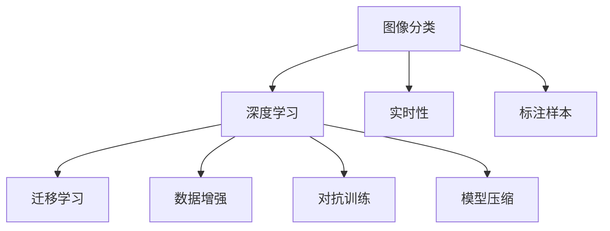

                 

## 1. 背景介绍

在当今数字化时代，图像识别技术已成为推动人工智能应用的重要驱动力之一。随着深度学习技术的迅猛发展，图像分类、目标检测、图像分割等任务在图像识别领域取得了显著进展。然而，尽管图像识别在技术上取得了诸多突破，但如何在实际产品中有效应用，并实现良好的用户体验，依然是行业内亟待解决的问题。

### 1.1 智能图像识别技术的兴起

智能图像识别技术的兴起，得益于计算机视觉领域一系列重要创新，包括卷积神经网络(CNN)、迁移学习、数据增强等。这些技术创新不仅提升了图像识别算法的准确性和泛化能力，也大大降低了技术实现的门槛。越来越多的企业开始将图像识别技术应用于产品分类、库存管理、安防监控、医疗影像分析等多个领域。

### 1.2 产品分类应用场景

产品分类作为图像识别技术的重要应用，通过将产品图片自动分类，可以大幅提升电商、零售、制造业等行业的运营效率。在电商平台上，商品自动分类可以快速对海量商品进行排序、推荐，减少人工标注的复杂度，降低运营成本。在制造企业中，图像分类可以帮助自动检测生产线上的产品质量，实现自动化质检。

然而，尽管产品分类技术已广泛应用，但在实际应用中仍面临诸多挑战，如标注数据不足、模型泛化能力差、实时性要求高等。这些挑战需要通过深入的技术研究和应用实践，不断突破和优化。

## 2. 核心概念与联系

### 2.1 核心概念概述

为更好地理解智能图像识别在产品分类中的应用，本节将介绍几个关键概念：

- **图像分类**：通过算法对图像中的对象进行识别和分类。图像分类广泛应用于商品自动标注、人脸识别、医学影像分析等领域。
- **深度学习**：一种通过多层神经网络进行数据表示和推理的技术，深度学习算法在图像分类、目标检测等任务上取得了显著进展。
- **迁移学习**：利用预训练模型的知识，通过微调或迁移学习的方式，提高新任务上的识别能力。迁移学习可以大幅减少标注样本的需求，降低开发成本。
- **数据增强**：通过一系列图像变换，生成更多的训练样本，提高模型的泛化能力和鲁棒性。
- **对抗训练**：在训练过程中加入对抗样本，增强模型的鲁棒性和抗干扰能力。
- **模型压缩**：通过剪枝、量化、蒸馏等技术，降低模型参数和计算复杂度，提高实时性和资源利用率。

这些核心概念之间的逻辑关系可以通过以下Mermaid流程图来展示：



这个流程图展示了图像分类技术的核心组件及其之间的关系：

1. 图像分类依赖深度学习算法进行特征提取和分类。
2. 迁移学习利用预训练模型的知识，提高新任务上的分类能力。
3. 数据增强通过图像变换生成更多训练样本，提升模型泛化能力。
4. 对抗训练在训练中加入对抗样本，增强模型鲁棒性。
5. 模型压缩通过剪枝、量化等技术，降低模型复杂度，提高实时性。

这些概念共同构成了图像分类的技术基础，使得图像识别技术在实际应用中得以实现和优化。

## 3. 核心算法原理 & 具体操作步骤

### 3.1 算法原理概述

智能图像分类主要依赖于深度学习模型进行特征提取和分类。其中，卷积神经网络(CNN)是最常用的深度学习架构。CNN通过多层卷积和池化操作，自动学习图像中的空间结构信息，最终通过全连接层进行分类。

迁移学习通过在大规模无标签数据上预训练通用模型，然后在小规模标注数据上进行微调，可以显著提高模型在特定任务上的分类能力。数据增强和对抗训练则进一步提升模型的泛化能力和鲁棒性。

### 3.2 算法步骤详解

基于迁移学习的图像分类一般包括以下几个关键步骤：

**Step 1: 准备预训练模型和数据集**

- 选择合适的预训练模型，如VGG、ResNet、Inception等，作为初始化参数。
- 准备标注数据集，通常划分为训练集、验证集和测试集。数据集大小应根据实际应用需求和计算资源限制确定。

**Step 2: 添加分类层和损失函数**

- 根据产品分类任务的需求，在预训练模型顶层设计合适的分类层。
- 选择合适的损失函数，如交叉熵损失、Focal Loss等，用于衡量模型预测与真实标签之间的差异。

**Step 3: 设置微调超参数**

- 选择合适的优化器及其参数，如Adam、SGD等，设置学习率、批大小、迭代轮数等。
- 设置正则化技术及强度，包括权重衰减、Dropout、Early Stopping等。
- 确定冻结预训练参数的策略，如仅微调顶层，或全部参数都参与微调。

**Step 4: 执行梯度训练**

- 将训练集数据分批次输入模型，前向传播计算损失函数。
- 反向传播计算参数梯度，根据设定的优化算法和学习率更新模型参数。
- 周期性在验证集上评估模型性能，根据性能指标决定是否触发Early Stopping。
- 重复上述步骤直到满足预设的迭代轮数或Early Stopping条件。

**Step 5: 测试和部署**

- 在测试集上评估微调后模型性能，对比微调前后的精度提升。
- 使用微调后的模型对新样本进行推理预测，集成到实际的应用系统中。
- 持续收集新的数据，定期重新微调模型，以适应数据分布的变化。

以上是迁移学习进行图像分类的基本流程。在实际应用中，还需要根据具体任务和数据特点进行优化设计，如改进分类层、调整超参数、采用多模型集成等，以进一步提升模型性能。

### 3.3 算法优缺点

基于迁移学习的图像分类方法具有以下优点：

1. 简单高效。只需准备少量标注数据，即可对预训练模型进行快速适配，获得较大的性能提升。
2. 通用适用。适用于各种图像分类任务，如人脸识别、物体检测、医疗影像分类等。设计简单的分类层即可实现迁移学习。
3. 参数高效。利用预训练模型的大规模权重，在固定大部分预训练参数的情况下，仍可取得不错的分类效果。
4. 效果显著。在学术界和工业界的诸多任务上，迁移学习已经刷新了多项SOTA性能指标。

同时，该方法也存在一定的局限性：

1. 依赖标注数据。迁移学习的效果很大程度上取决于标注数据的质量和数量，获取高质量标注数据的成本较高。
2. 迁移能力有限。当目标任务与预训练数据的分布差异较大时，迁移学习的性能提升有限。
3. 负面效果传递。预训练模型的固有偏见、有害信息等，可能通过迁移学习传递到下游任务，造成负面影响。
4. 可解释性不足。迁移学习的决策过程通常缺乏可解释性，难以对其推理逻辑进行分析和调试。

尽管存在这些局限性，但就目前而言，迁移学习仍是图像分类应用的主流范式。未来相关研究的重点在于如何进一步降低迁移学习对标注数据的依赖，提高模型的少样本学习和跨领域迁移能力，同时兼顾可解释性和伦理安全性等因素。

### 3.4 算法应用领域

基于迁移学习的图像分类方法在诸多领域已得到了广泛应用，如电子商务、安防监控、智能制造、医疗诊断等。具体应用如下：

1. **电子商务**：自动分类商品图片，实现智能搜索、推荐、库存管理。例如，电商平台上根据用户上传的商品图片进行快速分类和搜索，大幅提升用户体验。
2. **安防监控**：对视频帧中的物体进行自动分类，用于人脸识别、行为分析、异常检测等。例如，在视频监控系统中，自动识别和跟踪异常行为，提高公共安全水平。
3. **智能制造**：对生产线上的产品图片进行分类，实现质量检测、缺陷分析等。例如，利用图像分类技术自动检测制造过程中的缺陷，提高产品质量和生产效率。
4. **医疗诊断**：对医学影像进行分类，用于肿瘤识别、病变检测等。例如，利用图像分类技术自动识别医学影像中的病变区域，辅助医生诊断和治疗。
5. **自动驾驶**：对车辆周围环境图像进行分类，用于目标检测、物体追踪等。例如，在自动驾驶系统中，通过图像分类识别道路上的车辆、行人等，确保行车安全。

除了上述这些应用，迁移学习还被创新性地应用到更多场景中，如智能家居、虚拟现实、无人机等领域，为智能系统的智能化和自动化提供了新的解决方案。随着迁移学习方法的不断进步，相信其在更多领域的应用前景将更加广阔。

## 4. 数学模型和公式 & 详细讲解  
### 4.1 数学模型构建

本节将使用数学语言对基于迁移学习的图像分类过程进行更加严格的刻画。

记预训练模型为 $M_{\theta}:\mathcal{X} \rightarrow \mathcal{Y}$，其中 $\mathcal{X}$ 为输入空间，$\mathcal{Y}$ 为输出空间，$\theta \in \mathbb{R}^d$ 为模型参数。假设产品分类任务的训练集为 $D=\{(x_i,y_i)\}_{i=1}^N, x_i \in \mathcal{X}, y_i \in \mathcal{Y}$。

定义模型 $M_{\theta}$ 在输入 $x$ 上的输出为 $\hat{y}=M_{\theta}(x) \in \mathcal{Y}$，表示模型预测的分类结果。根据分类任务的损失函数为 $\ell(M_{\theta}(x),y)$，则在数据集 $D$ 上的经验风险为：

$$
\mathcal{L}(\theta) = \frac{1}{N}\sum_{i=1}^N \ell(M_{\theta}(x_i),y_i)
$$

其中，$\ell$ 为根据具体任务设计的损失函数，如交叉熵损失、Focal Loss等。

微调的优化目标是最小化经验风险，即找到最优参数：

$$
\theta^* = \mathop{\arg\min}_{\theta} \mathcal{L}(\theta)
$$

在实践中，我们通常使用基于梯度的优化算法（如SGD、Adam等）来近似求解上述最优化问题。设 $\eta$ 为学习率，$\lambda$ 为正则化系数，则参数的更新公式为：

$$
\theta \leftarrow \theta - \eta \nabla_{\theta}\mathcal{L}(\theta) - \eta\lambda\theta
$$

其中 $\nabla_{\theta}\mathcal{L}(\theta)$ 为损失函数对参数 $\theta$ 的梯度，可通过反向传播算法高效计算。

### 4.2 公式推导过程

以下我们以二分类任务为例，推导交叉熵损失函数及其梯度的计算公式。

假设模型 $M_{\theta}$ 在输入 $x$ 上的输出为 $\hat{y}=M_{\theta}(x) \in [0,1]$，表示模型预测属于正类的概率。真实标签 $y \in \{0,1\}$。则二分类交叉熵损失函数定义为：

$$
\ell(M_{\theta}(x),y) = -[y\log \hat{y} + (1-y)\log (1-\hat{y})]
$$

将其代入经验风险公式，得：

$$
\mathcal{L}(\theta) = -\frac{1}{N}\sum_{i=1}^N [y_i\log M_{\theta}(x_i)+(1-y_i)\log(1-M_{\theta}(x_i))]
$$

根据链式法则，损失函数对参数 $\theta_k$ 的梯度为：

$$
\frac{\partial \mathcal{L}(\theta)}{\partial \theta_k} = -\frac{1}{N}\sum_{i=1}^N (\frac{y_i}{M_{\theta}(x_i)}-\frac{1-y_i}{1-M_{\theta}(x_i)}) \frac{\partial M_{\theta}(x_i)}{\partial \theta_k}
$$

其中 $\frac{\partial M_{\theta}(x_i)}{\partial \theta_k}$ 可进一步递归展开，利用自动微分技术完成计算。

在得到损失函数的梯度后，即可带入参数更新公式，完成模型的迭代优化。重复上述过程直至收敛，最终得到适应产品分类任务的最优模型参数 $\theta^*$。

## 5. 项目实践：代码实例和详细解释说明
### 5.1 开发环境搭建

在进行图像分类实践前，我们需要准备好开发环境。以下是使用Python进行PyTorch开发的环境配置流程：

1. 安装Anaconda：从官网下载并安装Anaconda，用于创建独立的Python环境。

2. 创建并激活虚拟环境：
```bash
conda create -n pytorch-env python=3.8 
conda activate pytorch-env
```

3. 安装PyTorch：根据CUDA版本，从官网获取对应的安装命令。例如：
```bash
conda install pytorch torchvision torchaudio cudatoolkit=11.1 -c pytorch -c conda-forge
```

4. 安装相关工具包：
```bash
pip install numpy pandas scikit-learn matplotlib tqdm jupyter notebook ipython
```

完成上述步骤后，即可在`pytorch-env`环境中开始图像分类实践。

### 5.2 源代码详细实现

下面我们以产品分类任务为例，给出使用Transformers库对ResNet模型进行图像分类的PyTorch代码实现。

首先，定义产品分类任务的数据处理函数：

```python
from torch.utils.data import Dataset
import torchvision.transforms as transforms
from PIL import Image

class ProductDataset(Dataset):
    def __init__(self, image_paths, labels, transform=None):
        self.image_paths = image_paths
        self.labels = labels
        self.transform = transform
        
    def __len__(self):
        return len(self.image_paths)
    
    def __getitem__(self, item):
        img_path = self.image_paths[item]
        label = self.labels[item]
        
        image = Image.open(img_path)
        if self.transform:
            image = self.transform(image)
        return {'image': image, 'label': label}
```

然后，定义模型和优化器：

```python
from transformers import ResNet50, AdamW

model = ResNet50(num_classes=1000)

optimizer = AdamW(model.parameters(), lr=1e-3)
```

接着，定义训练和评估函数：

```python
from torch.utils.data import DataLoader
from tqdm import tqdm
from sklearn.metrics import classification_report

device = torch.device('cuda') if torch.cuda.is_available() else torch.device('cpu')
model.to(device)

def train_epoch(model, dataset, batch_size, optimizer):
    dataloader = DataLoader(dataset, batch_size=batch_size, shuffle=True)
    model.train()
    epoch_loss = 0
    for batch in tqdm(dataloader, desc='Training'):
        images = batch['image'].to(device)
        labels = batch['label'].to(device)
        model.zero_grad()
        outputs = model(images)
        loss = outputs.loss
        epoch_loss += loss.item()
        loss.backward()
        optimizer.step()
    return epoch_loss / len(dataloader)

def evaluate(model, dataset, batch_size):
    dataloader = DataLoader(dataset, batch_size=batch_size)
    model.eval()
    preds, labels = [], []
    with torch.no_grad():
        for batch in tqdm(dataloader, desc='Evaluating'):
            images = batch['image'].to(device)
            labels = batch['label']
            outputs = model(images)
            preds.append(outputs.logits.argmax(dim=1).to('cpu').tolist())
            labels = labels.to('cpu').tolist()
            
    print(classification_report(labels, preds))
```

最后，启动训练流程并在测试集上评估：

```python
epochs = 5
batch_size = 16

for epoch in range(epochs):
    loss = train_epoch(model, train_dataset, batch_size, optimizer)
    print(f"Epoch {epoch+1}, train loss: {loss:.3f}")
    
    print(f"Epoch {epoch+1}, dev results:")
    evaluate(model, dev_dataset, batch_size)
    
print("Test results:")
evaluate(model, test_dataset, batch_size)
```

以上就是使用PyTorch对ResNet模型进行图像分类的完整代码实现。可以看到，得益于Transformers库的强大封装，我们可以用相对简洁的代码完成ResNet模型的加载和图像分类任务的微调。

### 5.3 代码解读与分析

让我们再详细解读一下关键代码的实现细节：

**ProductDataset类**：
- `__init__`方法：初始化图像路径、标签、分词器等关键组件。
- `__len__`方法：返回数据集的样本数量。
- `__getitem__`方法：对单个样本进行处理，将图像输入编码为张量，并返回模型所需的输入。

**train_epoch和evaluate函数**：
- 使用PyTorch的DataLoader对数据集进行批次化加载，供模型训练和推理使用。
- 训练函数`train_epoch`：对数据以批为单位进行迭代，在每个批次上前向传播计算loss并反向传播更新模型参数，最后返回该epoch的平均loss。
- 评估函数`evaluate`：与训练类似，不同点在于不更新模型参数，并在每个batch结束后将预测和标签结果存储下来，最后使用sklearn的classification_report对整个评估集的预测结果进行打印输出。

**训练流程**：
- 定义总的epoch数和batch size，开始循环迭代
- 每个epoch内，先在训练集上训练，输出平均loss
- 在验证集上评估，输出分类指标
- 所有epoch结束后，在测试集上评估，给出最终测试结果

可以看到，PyTorch配合Transformers库使得图像分类任务的微调代码实现变得简洁高效。开发者可以将更多精力放在数据处理、模型改进等高层逻辑上，而不必过多关注底层的实现细节。

当然，工业级的系统实现还需考虑更多因素，如模型的保存和部署、超参数的自动搜索、更灵活的任务适配层等。但核心的微调范式基本与此类似。

## 6. 实际应用场景
### 6.1 智能零售

智能零售作为产品分类的重要应用场景，通过图像分类技术可以提升购物体验和运营效率。例如，电商平台可以利用图像分类技术对商品进行自动分类和搜索，提高用户购物体验和商品管理效率。智能货架和自助结账系统可以通过对商品图片进行实时分类，实现自动化库存管理和结算。

### 6.2 制造行业

在制造企业中，图像分类技术可以用于产品质量检测和质量控制。例如，利用图像分类技术对生产线上的产品图片进行分类，快速检测出不合格产品，提高产品质量和生产效率。智能机器人可以根据图像分类结果自动执行分拣、搬运等操作，实现自动化生产线。

### 6.3 安防监控

图像分类技术在安防监控中也有广泛应用。例如，监控系统可以通过对视频帧中的物体进行分类，自动识别异常行为并进行告警。在公共安全领域，图像分类技术可以用于人员和车辆的自动识别，提高安全监控的智能化水平。

### 6.4 医疗影像

医疗影像分类技术可以用于辅助医生诊断和治疗。例如，通过分类技术自动识别医学影像中的病变区域，提高诊断的准确性和效率。在手术中，图像分类技术可以用于术前规划和手术指导，提高手术的成功率和安全性。

### 6.5 自动驾驶

图像分类技术在自动驾驶中也有重要应用。例如，自动驾驶系统可以通过对道路和交通信号进行分类，自动进行路径规划和决策。在智能交通领域，图像分类技术可以用于自动检测交通违规行为，提高交通管理的安全性和智能化水平。

## 7. 工具和资源推荐
### 7.1 学习资源推荐

为了帮助开发者系统掌握图像分类技术的理论基础和实践技巧，这里推荐一些优质的学习资源：

1. 《Deep Learning with PyTorch》系列博文：由PyTorch官方博客推出，深入浅出地介绍了使用PyTorch进行深度学习开发的过程。

2. CS231n《Convolutional Neural Networks for Visual Recognition》课程：斯坦福大学开设的计算机视觉课程，涵盖了图像分类、目标检测、图像生成等经典任务。

3. 《ImageNet Classification with Deep Convolutional Neural Networks》论文：ImageNet数据集和预训练模型的奠基性论文，详细介绍了深度卷积神经网络在图像分类任务中的应用。

4. PyTorch官方文档：包含丰富的模型和算法实现，是PyTorch初学者必备资料。

5. Kaggle数据集和竞赛：Kaggle上提供丰富的图像分类数据集和竞赛，可以帮助开发者实践和验证算法。

通过对这些资源的学习实践，相信你一定能够快速掌握图像分类技术的精髓，并用于解决实际的图像识别问题。
###  7.2 开发工具推荐

高效的开发离不开优秀的工具支持。以下是几款用于图像分类开发的常用工具：

1. PyTorch：基于Python的开源深度学习框架，灵活动态的计算图，适合快速迭代研究。大多数预训练模型都有PyTorch版本的实现。

2. TensorFlow：由Google主导开发的开源深度学习框架，生产部署方便，适合大规模工程应用。同样有丰富的预训练模型资源。

3. OpenCV：开源计算机视觉库，提供了丰富的图像处理和分类工具。

4. Scikit-Image：基于Python的图像处理库，提供了简单易用的图像处理和分类函数。

5. Jupyter Notebook：交互式编程环境，适合编写和运行图像分类代码，方便分享和交流。

合理利用这些工具，可以显著提升图像分类任务的开发效率，加快创新迭代的步伐。

### 7.3 相关论文推荐

图像分类技术的发展源于学界的持续研究。以下是几篇奠基性的相关论文，推荐阅读：

1. AlexNet: One Million Training Images for Learning Convolutional Neural Networks: AlexNet：ImageNet数据集和深度卷积神经网络的奠基性论文，展示了深度卷积神经网络在图像分类任务上的突破。

2. VGG: Very Deep Convolutional Networks for Large-Scale Image Recognition: VGG：提出了VGG网路结构，通过多层卷积和池化层实现了高精度的图像分类。

3. ResNet: Deep Residual Learning for Image Recognition: ResNet：提出残差网络结构，解决了深度网络训练中的梯度消失问题，进一步提升了图像分类效果。

4. Inception: Going Deeper with Convolutions: Inception：提出Inception模块，通过并行多尺度卷积实现了更强的特征提取能力。

5. MobileNet: Inverted Residuals and Linear Bottlenecks: MobileNet：提出MobileNet架构，通过深度可分离卷积实现了轻量级的图像分类模型。

这些论文代表了大图像分类技术的发展脉络。通过学习这些前沿成果，可以帮助研究者把握学科前进方向，激发更多的创新灵感。

## 8. 总结：未来发展趋势与挑战

### 8.1 总结

本文对基于迁移学习的图像分类方法进行了全面系统的介绍。首先阐述了图像分类技术的兴起及其在产品分类应用中的重要意义，明确了迁移学习在提升模型性能、降低标注成本方面的独特价值。其次，从原理到实践，详细讲解了迁移学习的数学原理和关键步骤，给出了图像分类任务开发的完整代码实例。同时，本文还广泛探讨了迁移学习方法在多个领域的应用前景，展示了迁移范式的巨大潜力。

通过本文的系统梳理，可以看到，基于迁移学习的图像分类方法在产品分类等领域具有广阔的应用前景，能够显著提升企业运营效率，促进智能化的发展。未来，伴随预训练模型和迁移学习方法的持续演进，相信图像分类技术将在更广泛的领域得到应用，为各行各业带来变革性影响。

### 8.2 未来发展趋势

展望未来，图像分类技术的发展将呈现以下几个趋势：

1. 模型规模持续增大。随着算力成本的下降和数据规模的扩张，预训练模型和迁移学习模型的参数量还将持续增长。超大模型可以蕴含更丰富的视觉语义信息，进一步提升图像分类的性能。

2. 迁移学习能力增强。未来的迁移学习模型将能够更好地进行跨领域迁移和泛化，通过少样本学习和知识蒸馏等技术，实现更高效的微调。

3. 实时性和资源利用率提升。利用模型压缩、蒸馏、量化等技术，可以降低模型复杂度，提升图像分类的实时性和资源利用率。

4. 数据增强和对抗训练的优化。通过更高效的数据增强和对抗训练方法，可以进一步提高模型的泛化能力和鲁棒性，增强其在真实场景中的表现。

5. 跨模态融合。将视觉、语音、文本等多种模态信息融合，提升图像分类的精度和鲁棒性，实现更加全面的场景理解。

以上趋势凸显了图像分类技术的广阔前景。这些方向的探索发展，必将进一步提升图像分类的性能和应用范围，为智能系统的智能化和自动化提供新的解决方案。

### 8.3 面临的挑战

尽管图像分类技术已取得了显著进展，但在实际应用中仍面临诸多挑战：

1. 标注数据成本高。尽管迁移学习可以在较少标注数据上获得良好的性能，但对于大规模工业场景，获取高质量标注数据依然困难重重。标注数据的成本和效率问题仍需进一步解决。

2. 模型鲁棒性不足。在实际应用中，图像分类模型往往面临光照变化、角度变化等变化因素的挑战。如何在不同环境下保持模型的高性能，还需要进一步研究。

3. 推理效率有待提高。超大规模模型在实际应用中往往需要高性能计算资源支持，推理速度较慢，影响实时性。如何优化模型结构，提高推理效率，仍是重要课题。

4. 数据隐私和安全性问题。在处理用户数据时，如何保护数据隐私，避免数据泄露，还需要进一步的技术保障。

5. 跨模态数据融合。多模态数据的融合在提升图像分类性能的同时，也带来了数据不一致、融合复杂度高等问题。如何高效融合多模态数据，实现更强的场景理解能力，仍需深入探索。

这些挑战凸显了图像分类技术在实际应用中的复杂性和难度。面对这些挑战，未来的研究需要在多个维度协同发力，不断优化模型、算法和系统架构，以实现图像分类的更好性能和用户体验。

### 8.4 研究展望

面向未来，图像分类技术的研究需要在以下几个方面寻求新的突破：

1. 探索更高效的数据增强和对抗训练方法。通过更高效的数据生成和对抗样本生成，提高模型对各种变化因素的适应能力。

2. 引入更多先验知识和跨模态信息。将专家知识与神经网络模型进行融合，实现更准确的分类结果。同时，将视觉、语音、文本等多种模态信息融合，提升图像分类的精度和鲁棒性。

3. 引入因果分析和博弈论工具。将因果分析方法引入图像分类模型，增强模型的推理能力，同时借助博弈论工具探索优化策略，提升模型性能。

4. 结合伦理道德约束。在模型训练目标中引入伦理导向的评估指标，过滤和惩罚有害的输出倾向，确保模型输出符合社会价值观和伦理道德。

这些研究方向的探索，必将引领图像分类技术迈向更高的台阶，为构建安全、可靠、可解释、可控的智能系统铺平道路。面向未来，图像分类技术还需要与其他人工智能技术进行更深入的融合，如知识表示、因果推理、强化学习等，多路径协同发力，共同推动智能系统的进步。只有勇于创新、敢于突破，才能不断拓展图像分类的边界，让智能技术更好地造福人类社会。

## 9. 附录：常见问题与解答

**Q1：图像分类模型的训练数据集如何选择？**

A: 图像分类模型的训练数据集应根据具体应用场景和需求进行选择。对于通用图像分类任务，如ImageNet、CIFAR-10等标准数据集是较好的选择。对于特定领域的任务，如医疗影像分类、物体检测等，应选择相应的领域数据集进行训练。

**Q2：如何处理图像分类中的类别不平衡问题？**

A: 类别不平衡问题在实际应用中较为常见。处理类别不平衡问题的方法包括：
1. 重采样：通过欠采样或过采样，平衡各个类别的样本数量。
2. 类别权重调整：在损失函数中为少数类别设置更高的权重，减少其被忽略的风险。
3. 数据增强：针对少数类别进行更强的数据增强，提升其在模型中的表现。

**Q3：图像分类模型的推理时间如何优化？**

A: 图像分类模型的推理时间主要取决于模型结构和计算资源。优化推理时间的方法包括：
1. 模型压缩：通过剪枝、量化、蒸馏等技术，减小模型参数和计算复杂度，提高推理速度。
2. 硬件加速：利用GPU、TPU等高性能计算设备，加速模型推理。
3. 推理框架优化：使用优化后的推理框架，如ONNX Runtime、TensorRT等，提升推理效率。

**Q4：图像分类模型在实际应用中如何进行调参？**

A: 图像分类模型的调参方法包括以下几个步骤：
1. 初始化：选择一个合适的预训练模型和损失函数，并进行模型微调。
2. 数据准备：收集和预处理数据集，包括图像预处理、标签编码等。
3. 超参数调优：选择合适的优化器、学习率、批大小等超参数，并使用验证集进行调优。
4. 模型评估：在测试集上评估模型性能，根据评估结果进行调整。
5. 模型部署：将训练好的模型部署到实际应用中，并进行性能监测和优化。

**Q5：图像分类模型在实际应用中如何进行数据增强？**

A: 图像分类模型在实际应用中进行数据增强的方法包括：
1. 随机裁剪：对图像进行随机裁剪，增加样本多样性。
2. 随机翻转：对图像进行水平、垂直翻转，增加样本多样性。
3. 随机旋转：对图像进行随机旋转，增加样本多样性。
4. 随机颜色变换：对图像进行随机颜色变换，如调整亮度、对比度等，增加样本多样性。

这些方法可以有效地提升模型的泛化能力和鲁棒性，使得模型在实际应用中具有更好的表现。

---

作者：禅与计算机程序设计艺术 / Zen and the Art of Computer Programming

