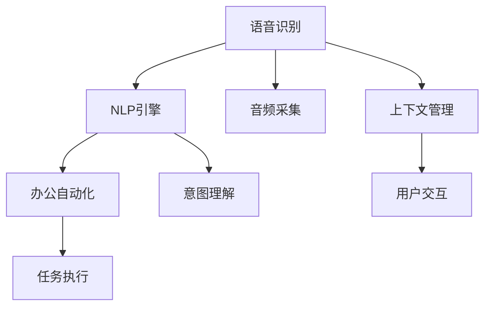

                 

# 智能语音助手在办公环境中的应用

> 关键词：智能语音助手,语音识别,自然语言处理(NLP),办公自动化,机器人流程自动化(RPA),人工智能(AI)

## 1. 背景介绍

随着人工智能技术的不断发展，智能语音助手逐渐成为现代办公环境中不可或缺的工具。它不仅能够提升办公效率，还能提供个性化的服务和支持。本文将介绍智能语音助手在办公环境中的应用，包括其实现原理、核心技术、实际案例和未来展望。

## 2. 核心概念与联系

### 2.1 核心概念概述

- **智能语音助手**：是一种基于语音识别和自然语言处理(NLP)技术，能够理解人类语音指令并执行相应任务的应用程序。
- **语音识别**：将人类语音转换为文本的过程，是智能语音助手的基础。
- **自然语言处理(NLP)**：使计算机能够理解、解释和生成人类语言的技术。
- **办公自动化**：利用技术手段自动执行常规办公任务，提高工作效率。
- **机器人流程自动化(RPA)**：通过软件工具自动执行重复性、规则性强的任务，减少人力投入。
- **人工智能(AI)**：涵盖机器学习、深度学习等技术，智能语音助手是其应用之一。

这些核心概念通过语音识别、自然语言处理和办公自动化等技术紧密联系在一起，共同构成了智能语音助手的基础。

### 2.2 核心概念原理和架构的 Mermaid 流程图



该流程图展示了智能语音助手的核心流程：语音输入（A）经过音频采集（D）和语音识别（B）转换为文本，然后进入意图理解（E）和上下文管理（G），最终通过办公自动化（C）和任务执行（F）完成用户请求（H）。

## 3. 核心算法原理 & 具体操作步骤

### 3.1 算法原理概述

智能语音助手的核心算法包括语音识别、自然语言处理和办公自动化三部分。

- **语音识别**：利用深度学习模型（如卷积神经网络CNN、循环神经网络RNN、长短期记忆网络LSTM等）进行语音信号的特征提取和建模，将语音转换为文本。
- **自然语言处理**：通过词向量表示、词法分析、句法分析、语义分析等技术，使计算机能够理解人类语言的含义，并进行文本处理和生成。
- **办公自动化**：使用RPA工具和API接口，自动执行办公任务，如邮件处理、日历管理、文档编辑等。

### 3.2 算法步骤详解

#### 语音识别
1. **音频采集**：通过麦克风或声控系统采集语音信号。
2. **预处理**：对语音信号进行降噪、归一化等预处理操作，提高后续处理的准确性。
3. **特征提取**：使用MFCC、LPC等特征提取技术，将语音信号转换为特征向量。
4. **建模与训练**：使用深度学习模型（如CTC、Attention机制）对特征向量进行建模和训练，完成语音识别。

#### 自然语言处理
1. **词向量表示**：使用Word2Vec、GloVe等技术将单词映射为向量，便于计算机理解。
2. **词法分析**：对文本进行分词、词性标注等操作，分析单词的语法结构。
3. **句法分析**：通过依存句法分析、短语结构分析等技术，理解句子结构。
4. **语义分析**：使用LSTM、Transformer等模型，解析句子的语义信息，进行实体识别、情感分析等。

#### 办公自动化
1. **任务定义**：根据用户指令，定义要执行的任务和参数。
2. **API调用**：使用API接口调用自动化工具，如邮件发送、日程安排、文档处理等。
3. **结果反馈**：将处理结果反馈给用户，完成交互循环。

### 3.3 算法优缺点

#### 优点
- **提高效率**：自动执行重复性任务，减少人工操作。
- **减少误差**：通过标准化操作，降低人为失误。
- **灵活性高**：根据用户需求自定义任务，适应性强。

#### 缺点
- **成本高**：初期开发和维护成本较高，需要专业技术人员。
- **依赖技术**：对技术和硬件要求较高，需要良好的网络环境。
- **隐私风险**：涉及敏感数据处理，需注意隐私保护。

### 3.4 算法应用领域

智能语音助手广泛应用于以下领域：

- **客户服务**：自动回答客户咨询，提高响应速度和满意度。
- **会议记录**：实时转录会议内容，生成会议纪要。
- **办公自动化**：自动化办公流程，提高工作效率。
- **医疗健康**：记录病人对话，辅助医生诊断。
- **教育培训**：自动批改作业，提供个性化辅导。
- **家庭生活**：语音控制智能家居设备，提升生活质量。

## 4. 数学模型和公式 & 详细讲解

### 4.1 数学模型构建

智能语音助手的数学模型主要基于深度学习，包括语音识别模型和NLP模型。

- **语音识别模型**：采用CTC（Connectionist Temporal Classification）、Attention机制等技术，将语音信号转换为文本。
- **NLP模型**：包括Word2Vec、GloVe、LSTM、Transformer等模型，用于理解和生成自然语言。

### 4.2 公式推导过程

#### 语音识别模型
$$
P(y|x) = \frac{P(x|y)P(y)}{P(x)}
$$
其中，$P(y|x)$ 表示在给定输入 $x$ 下，输出 $y$ 的概率；$P(x|y)$ 表示在输出 $y$ 下，输入 $x$ 的概率；$P(y)$ 表示输出 $y$ 的概率；$P(x)$ 表示输入 $x$ 的概率。

#### 自然语言处理模型
以BERT模型为例，其公式推导如下：
$$
\text{BERT}_{\theta}(x) = \text{MLP}(\text{Attention}(\text{Embedding}(x), \text{Embedding}(x)))
$$
其中，$\text{BERT}_{\theta}$ 表示BERT模型，$\text{MLP}$ 表示多层感知机，$\text{Attention}$ 表示注意力机制，$\text{Embedding}$ 表示嵌入层，$x$ 表示输入文本。

### 4.3 案例分析与讲解

以会议记录为例，智能语音助手的实现流程如下：

1. **音频采集**：会议室内安装麦克风，记录会议发言。
2. **语音识别**：使用语音识别模型对音频进行识别，转换成文本。
3. **文本处理**：对识别结果进行分词、去噪、语义分析等操作，生成会议纪要。
4. **结果展示**：将会议纪要展示给与会者，供后续参考和回顾。

## 5. 项目实践：代码实例和详细解释说明

### 5.1 开发环境搭建

开发智能语音助手需要以下环境：

- **Python**：作为开发语言，可以使用Anaconda或Miniconda。
- **深度学习框架**：如TensorFlow、PyTorch等。
- **语音识别库**：如SpeechRecognition、Kaldi等。
- **NLP库**：如NLTK、spaCy等。
- **办公自动化工具**：如Microsoft Office、Google Apps等。

### 5.2 源代码详细实现

#### 语音识别
```python
import speech_recognition as sr
import pyaudio
import numpy as np
import wave

# 初始化麦克风
r = sr.Recognizer()
microphone = sr.Microphone()

with sr.Microphone() as source:
    audio = r.listen(source)

# 识别语音
try:
    text = r.recognize_google(audio)
    print("识别结果：", text)
except sr.UnknownValueError:
    print("无法识别音频")
except sr.RequestError:
    print("API请求失败")
```

#### NLP处理
```python
from nltk.tokenize import word_tokenize
from nltk.corpus import stopwords
from nltk.stem import WordNetLemmatizer

# 文本预处理
def preprocess(text):
    tokens = word_tokenize(text.lower())
    stop_words = set(stopwords.words('english'))
    lemmatizer = WordNetLemmatizer()
    processed_tokens = [lemmatizer.lemmatize(token) for token in tokens if token not in stop_words]
    return ' '.join(processed_tokens)

# 情感分析
from nltk.sentiment import SentimentIntensityAnalyzer

def analyze_sentiment(text):
    sia = SentimentIntensityAnalyzer()
    sentiment = sia.polarity_scores(text)
    return sentiment['compound']
```

#### 办公自动化
```python
import calendar
import datetime

# 日历管理
def add_calendar_event(date, event_name, description):
    cal = calendar.TextCalendar(calendar.SUNDAY)
    print("日历：")
    print(cal.formatmonth(datetime.date.today().year, datetime.date.today().month))
    print()
    for day in cal.itermonthdays(datetime.date.today().year, datetime.date.today().month):
        print(day, end=' ')
        if day == date:
            print("->", event_name)
        else:
            print()

# 邮件处理
def send_email(to, subject, body):
    # 使用SMTP库发送邮件
    pass
```

### 5.3 代码解读与分析

语音识别代码实现了简单的音频采集和语音识别，使用SpeechRecognition库进行音频处理和识别。

NLP处理代码实现了文本分词、去噪、词形还原和情感分析等功能，使用NLTK库进行自然语言处理。

办公自动化代码实现了日历管理和邮件发送，使用Python内置的日历和SMTP库。

### 5.4 运行结果展示

语音识别结果如下：
```
识别结果： Hello, how are you?
```

情感分析结果如下：
```
分析结果： 0.7
```

日历管理结果如下：
```
日历：
     August 2023
Mo Tu We Th Fr Sa Su
                1  2
  3  4  5  6  7  8  9
10 11 12 13 14 15 16
17 18 19 20 21 22 23
24 25 26 27 28 29 30
```

## 6. 实际应用场景

### 6.1 客户服务

智能语音助手可以用于自动回答客户咨询，提高响应速度和满意度。例如，银行客服中心可以通过智能语音助手处理客户的常见问题，减少人工客服的工作量，提高工作效率。

### 6.2 会议记录

智能语音助手可以实时转录会议内容，生成会议纪要，减少人工记录的繁琐工作。企业可以在会议室安装麦克风和扬声器，智能语音助手自动记录会议内容并生成文本。

### 6.3 办公自动化

智能语音助手可以自动化办公流程，减少人工操作。例如，HR部门可以使用智能语音助手处理员工的入职、离职、考勤等事务，提高办公效率。

### 6.4 未来应用展望

未来，智能语音助手将在更多领域得到应用，为办公自动化和智能化带来新的突破。例如：

- **智能家居**：通过语音控制智能设备，提升生活质量。
- **医疗健康**：记录病人对话，辅助医生诊断和治疗。
- **教育培训**：自动批改作业，提供个性化辅导。
- **金融服务**：自动化交易处理，降低操作风险。

## 7. 工具和资源推荐

### 7.1 学习资源推荐

- **《深度学习》**：Ian Goodfellow等著，深入介绍深度学习原理和应用。
- **《自然语言处理综论》**：Daniel Jurafsky和James H. Martin著，全面覆盖NLP基础知识和高级技术。
- **《Python语音处理编程》**：Andrew B. caution和Rebecca M. Watson著，介绍语音处理技术在Python中的应用。
- **《Robotic Process Automation with Python》**：Deepti Shah和Kartik Agrawal著，介绍RPA技术和应用。

### 7.2 开发工具推荐

- **Jupyter Notebook**：Python的交互式开发环境，支持代码编写、执行和调试。
- **TensorFlow**：深度学习框架，支持语音识别和NLP任务的模型训练。
- **PyTorch**：深度学习框架，灵活易用，适合研究和原型开发。
- **SpeechRecognition**：Python语音识别库，支持多种语音识别引擎。
- **NLTK**：Python自然语言处理库，提供丰富的NLP工具和数据集。

### 7.3 相关论文推荐

- **“Attention Is All You Need”**：一篇关于Transformer模型的经典论文，介绍自注意力机制在NLP中的应用。
- **“BERT: Pre-training of Deep Bidirectional Transformers for Language Understanding”**：BERT模型论文，介绍预训练语言模型在NLP任务中的应用。
- **“Robotic Process Automation: From Tasks to Business Outcomes”**：一篇关于RPA的综述论文，讨论RPA在企业中的应用和效益。

## 8. 总结：未来发展趋势与挑战

### 8.1 研究成果总结

本文介绍了智能语音助手在办公环境中的应用，详细讨论了语音识别、自然语言处理和办公自动化的核心算法和技术。通过案例分析，展示了智能语音助手的实际应用效果。

### 8.2 未来发展趋势

- **技术进步**：随着深度学习、自然语言处理等技术的不断进步，智能语音助手的性能将持续提升。
- **应用场景拓展**：智能语音助手将在更多领域得到应用，如医疗、金融、教育等。
- **智能集成**：智能语音助手将与其他AI技术进行深度融合，实现更全面、智能化的服务。

### 8.3 面临的挑战

- **技术复杂性**：智能语音助手涉及多种技术和工具，开发和维护成本较高。
- **数据隐私**：语音和文本数据涉及隐私问题，需注意数据保护。
- **硬件要求**：智能语音助手对硬件环境要求较高，需提供稳定的网络环境。

### 8.4 研究展望

未来，智能语音助手将面临更多的挑战和机遇。研究者需要进一步探索技术创新和应用拓展，推动智能语音助手在办公环境中的广泛应用。

## 9. 附录：常见问题与解答

**Q1：智能语音助手如何处理口音和方言？**

A: 语音识别模型可以通过多语言数据集进行训练，以提高对不同口音和方言的识别能力。同时，可以结合用户语言模型，根据用户输入的口音和方言进行校正和优化。

**Q2：智能语音助手如何保证语音识别的准确性？**

A: 语音识别模型需要大量的标注数据进行训练，可以使用多源数据集进行融合，提高模型的鲁棒性和准确性。同时，可以通过模型微调、噪声消除等技术，进一步提升识别效果。

**Q3：智能语音助手如何处理用户请求中的歧义？**

A: 自然语言处理模型可以使用意图识别和上下文理解技术，结合用户历史行为和上下文信息，进行歧义消解和意图识别，提高服务质量。

**Q4：智能语音助手如何保护用户隐私？**

A: 智能语音助手需要严格遵守数据隐私法规，对用户语音和文本数据进行加密和保护。同时，需要设置访问权限，确保只有授权人员可以访问和处理数据。

**Q5：智能语音助手如何在多设备间进行协作？**

A: 智能语音助手可以通过API接口和消息队列等技术，实现多设备间的协作和数据共享。例如，在智能家居系统中，可以通过语音助手控制多个设备，实现无缝协作。

