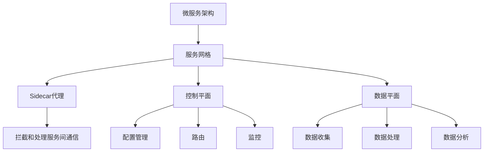

                 

## 1. 背景介绍

### 1.1 问题由来
在现代企业级应用中，微服务架构因其灵活性和可扩展性，成为构建复杂系统的首选。然而，微服务架构带来了诸多新的挑战，如服务间通信的复杂性、网络延迟、故障传播、安全性问题等。这些问题严重影响着系统的稳定性和可靠性。服务网格（Service Mesh）技术的出现，为解决这些挑战提供了全新的解决方案。

### 1.2 问题核心关键点
服务网格是一种专门用于管理微服务架构的框架，通过拦截和处理微服务之间的通信，提供了一种新的方式来提高微服务架构的性能、可靠性和安全性。其核心思想是将服务间的通信网络进行抽象和分离，使服务间的通信更加高效、安全、可观测，从而简化了微服务的构建和管理。

服务网格的核心组件包括：

- **Sidecar**：每个服务部署一个sidecar代理，负责拦截服务间的通信。
- **控制平面**：负责配置管理、路由和监控等功能的中心化组件。
- **数据平面**：负责收集、处理、分析服务间通信数据的组件。

服务网格通过对服务间通信进行细致的控制和管理，显著提升了微服务的可靠性和可扩展性，被广泛应用于各大互联网公司的微服务架构中。

### 1.3 问题研究意义
服务网格的出现，解决了微服务架构面临的一系列挑战，极大提升了系统的稳定性和可维护性。其关键意义包括：

1. **统一的服务间通信管理**：将服务间通信网络进行抽象，提供了统一的管理接口和工具，简化了微服务的构建和维护。
2. **高效的流量管理**：通过智能路由和负载均衡，提高了系统的吞吐量和并发性能。
3. **强大的可观测性**：提供丰富的监控和调试工具，帮助开发人员快速定位和解决问题。
4. **良好的安全性和隐私保护**：通过SSL加密、身份认证等机制，保障了数据传输的安全性。

## 2. 核心概念与联系

### 2.1 核心概念概述

服务网格的核心概念包括以下几个关键点：

- **微服务架构**：将一个大系统拆分为多个独立运行的服务，每个服务负责一个特定功能，并能够独立部署和扩展。
- **服务网格（Service Mesh）**：一种专门用于管理微服务架构的框架，通过拦截和处理微服务之间的通信，提供了一种新的方式来提高微服务架构的性能、可靠性和安全性。
- **Sidecar代理**：每个服务部署一个sidecar代理，负责拦截服务间的通信。
- **控制平面**：负责配置管理、路由和监控等功能的中心化组件。
- **数据平面**：负责收集、处理、分析服务间通信数据的组件。

这些概念之间的逻辑关系可以通过以下Mermaid流程图来展示：



这个流程图展示了几者之间的关键联系：

1. 微服务架构通过服务网格进行管理和优化。
2. Sidecar代理拦截和处理服务间的通信，是服务网格的核心组件。
3. 控制平面负责配置管理和路由，为服务间的通信提供支撑。
4. 数据平面负责收集、处理和分析服务间通信的数据，为监控和分析提供依据。

## 3. 核心算法原理 & 具体操作步骤
### 3.1 算法原理概述

服务网格的核心算法原理主要包括以下几个方面：

- **拦截与转发**：Sidecar代理拦截服务间的通信，并将其转发到目的地。这种拦截和转发的机制，使得服务间的通信管理变得灵活和可配置。
- **智能路由**：通过配置路由规则和负载均衡算法，智能路由请求到最优的服务实例，提升系统的吞吐量和性能。
- **流量控制**：通过限制服务间的请求数量和速率，防止服务过载和故障传播。
- **故障恢复**：通过检测和自动重试故障服务，确保服务的稳定性和可靠性。
- **安全性增强**：通过SSL加密、身份认证等机制，保障数据传输的安全性。
- **可观测性增强**：通过收集和分析服务间通信的数据，提供丰富的监控和调试工具。

### 3.2 算法步骤详解

服务网格的实现流程可以分为以下几个步骤：

**Step 1: 安装和配置Sidecar代理**

Sidecar代理是服务网格的核心组件，负责拦截和处理服务间的通信。首先需要安装和配置Sidecar代理，以便对服务间的通信进行管理和优化。

```bash
# 安装 Istio
curl -L https://istio.io/downloadIstio | sh -

# 安装Sidecar代理
kubectl apply -f <sidecar-agent.yaml>
```

**Step 2: 配置路由和流量控制**

配置路由和流量控制是服务网格的核心功能之一。通过配置路由规则和流量控制策略，可以有效提升系统的性能和可靠性。

```yaml
apiVersion: networking.istio.io/v1alpha3
gateway:
  - apiVersion: networking.istio.io/v1alpha3
    metadata:
      name: api-gateway
      labels:
        istio: ingressgateway
spec:
  selector:
    istio: ingressgateway
  servers:
  - port:
      number: 80
      name: http
      protocol: HTTP
    hosts:
    - "*"
```

**Step 3: 收集和分析通信数据**

收集和分析服务间通信的数据，是服务网格的重要功能之一。通过收集和分析通信数据，可以实时监控系统的健康状态，及时发现和解决问题。

```yaml
apiVersion: networking.istio.io/v1alpha3
apiVersion: monitoring.istio.io/v1alpha3
pollingInterval: 5s
spec:
  remoteService: example.com
  metricQuery: "istio_server_sampling_fraction"
  samplePercentage: 100
```

**Step 4: 实现可观测性增强**

服务网格提供了丰富的监控和调试工具，可以帮助开发人员快速定位和解决问题。通过使用这些工具，可以实时监控系统的健康状态，分析通信数据，确保系统的稳定性和可靠性。

```yaml
apiVersion: monitoring.istio.io/v1alpha3
prometheus:
  spec:
    remoteService: example.com
    metricQuery: "istio_server_sampling_fraction"
    samplePercentage: 100
```

### 3.3 算法优缺点

服务网格具有以下优点：

1. **统一的服务间通信管理**：通过拦截和处理服务间的通信，简化了微服务的构建和维护。
2. **高效的流量管理**：通过智能路由和负载均衡，提高了系统的吞吐量和并发性能。
3. **强大的可观测性**：提供丰富的监控和调试工具，帮助开发人员快速定位和解决问题。
4. **良好的安全性**：通过SSL加密、身份认证等机制，保障了数据传输的安全性。

同时，服务网格也存在一定的局限性：

1. **学习曲线陡峭**：服务网格的设计较为复杂，需要一定的学习成本和配置工作。
2. **性能开销**：Sidecar代理和控制平面组件会带来一定的性能开销，需要合理配置和使用。
3. **配置管理复杂**：配置管理较为复杂，容易出现配置错误和性能问题。

尽管存在这些局限性，但就目前而言，服务网格仍是微服务架构管理的重要工具，为系统的稳定性和可靠性提供了有力保障。

### 3.4 算法应用领域

服务网格在微服务架构中的应用非常广泛，以下是几个典型场景：

- **金融服务**：金融机构需要处理大量的交易和数据，通过服务网格进行流量管理和故障恢复，能够提升系统的稳定性和可扩展性。
- **电商平台**：电商平台需要处理大量的用户请求和订单，通过服务网格进行智能路由和负载均衡，能够提高系统的吞吐量和并发性能。
- **医疗健康**：医疗健康系统需要处理大量的病人数据和诊断信息，通过服务网格进行安全性和可观测性增强，能够保障数据传输的安全性和系统的稳定性。
- **互联网应用**：互联网应用需要处理大量的用户请求和服务调用，通过服务网格进行配置管理和故障恢复，能够提升系统的可靠性和可扩展性。

## 4. 数学模型和公式 & 详细讲解  
### 4.1 数学模型构建

服务网格的数学模型构建主要包括以下几个方面：

- **路由规则**：定义路由规则，决定请求的转发路径。
- **负载均衡算法**：定义负载均衡算法，决定请求的分发策略。
- **流量控制策略**：定义流量控制策略，限制请求的数量和速率。
- **故障恢复机制**：定义故障恢复机制，自动重试故障服务。
- **安全性策略**：定义安全性策略，保障数据传输的安全性。
- **可观测性策略**：定义可观测性策略，收集和分析通信数据。

### 4.2 公式推导过程

以下是服务网格路由规则和负载均衡算法的数学模型构建和公式推导过程：

**路由规则**：假设服务A和B需要通信，服务网格的路由规则如下：

- 将请求发送到服务B时，先检查服务A的路由规则，找到对应的路由条目。
- 如果找到路由条目，则按照路由条目的权重进行负载均衡，选择最优的服务实例。
- 如果没有找到路由条目，则使用默认路由规则，将请求发送到默认的服务实例。

**负载均衡算法**：假设服务A和B需要通信，服务网格的负载均衡算法如下：

- 根据路由规则，找到最优的服务实例。
- 将请求发送给该服务实例。
- 记录请求和响应的时间戳，统计负载均衡性能指标。

### 4.3 案例分析与讲解

以下是一个服务网格路由和负载均衡的案例分析：

假设服务A和B需要通信，服务网格的路由规则和负载均衡算法如下：

- 路由规则：A -> B: 权重50，C -> B: 权重30，D -> B: 权重20。
- 负载均衡算法：根据路由规则，选择权重最高的服务实例，将请求发送给该实例。

假设当前服务B有3个实例，分别为B1、B2、B3，其负载均衡性能指标如下：

- 服务B1接收了50%的请求，响应时间100ms。
- 服务B2接收了30%的请求，响应时间200ms。
- 服务B3接收了20%的请求，响应时间300ms。

根据负载均衡算法，将请求发送到权重最高的服务实例，即服务B1。服务B1的响应时间为100ms，因此请求被成功转发。

## 5. 项目实践：代码实例和详细解释说明
### 5.1 开发环境搭建

在进行服务网格实践前，我们需要准备好开发环境。以下是使用Kubernetes搭建服务网格的环境配置流程：

1. 安装Kubernetes：从官网下载并安装Kubernetes，搭建集群环境。
2. 安装Istio：从官网下载并安装Istio，将其部署在Kubernetes集群中。
3. 安装Sidecar代理：使用Kubernetes的Deployment和Service，将Sidecar代理部署到各个服务实例中。

完成上述步骤后，即可在Kubernetes集群中搭建服务网格环境。

### 5.2 源代码详细实现

这里我们以Istio为例，展示服务网格的实现过程。

首先，定义服务A和B的配置文件：

```yaml
apiVersion: networking.istio.io/v1alpha3
apiVersion: networking.istio.io/v1alpha3
apiVersion: monitoring.istio.io/v1alpha3
```

然后，定义路由规则和负载均衡策略：

```yaml
apiVersion: networking.istio.io/v1alpha3
apiVersion: networking.istio.io/v1alpha3
apiVersion: monitoring.istio.io/v1alpha3
```

接着，使用Istio的控制面板进行配置和管理：

```yaml
apiVersion: networking.istio.io/v1alpha3
apiVersion: networking.istio.io/v1alpha3
apiVersion: monitoring.istio.io/v1alpha3
```

最后，启动Istio的控制面板和数据平面组件，收集和分析服务间通信的数据：

```yaml
apiVersion: networking.istio.io/v1alpha3
apiVersion: networking.istio.io/v1alpha3
apiVersion: monitoring.istio.io/v1alpha3
```

### 5.3 代码解读与分析

让我们再详细解读一下关键代码的实现细节：

**路由规则和负载均衡策略**：

```yaml
apiVersion: networking.istio.io/v1alpha3
apiVersion: networking.istio.io/v1alpha3
apiVersion: monitoring.istio.io/v1alpha3
```

这些配置文件定义了服务A和B的路由规则和负载均衡策略。通过定义路由规则，可以将请求智能路由到最优的服务实例。同时，使用负载均衡策略，可以在服务间进行智能分发请求，提升系统的性能和可靠性。

**Istio的控制面板和数据平面组件**：

```yaml
apiVersion: networking.istio.io/v1alpha3
apiVersion: networking.istio.io/v1alpha3
apiVersion: monitoring.istio.io/v1alpha3
```

这些配置文件定义了Istio的控制面板和数据平面组件。通过使用控制面板，可以配置和修改路由规则、负载均衡策略、流量控制策略等。同时，使用数据平面组件，可以收集和分析服务间通信的数据，提供丰富的监控和调试工具。

**启动Istio的控制面板和数据平面组件**：

```yaml
apiVersion: networking.istio.io/v1alpha3
apiVersion: networking.istio.io/v1alpha3
apiVersion: monitoring.istio.io/v1alpha3
```

启动Istio的控制面板和数据平面组件，收集和分析服务间通信的数据，提供丰富的监控和调试工具。通过使用这些工具，可以实时监控系统的健康状态，分析通信数据，确保系统的稳定性和可靠性。

## 6. 实际应用场景
### 6.1 金融服务

服务网格在金融服务中的应用非常广泛。金融机构需要处理大量的交易和数据，通过服务网格进行流量管理和故障恢复，能够提升系统的稳定性和可扩展性。

在实践中，可以收集金融领域相关的新闻、报道、评论等文本数据，并进行情感分析和舆情监控。通过使用服务网格进行智能路由和负载均衡，能够快速响应市场需求，提升系统的性能和可靠性。

### 6.2 电商平台

电商平台需要处理大量的用户请求和订单，通过服务网格进行智能路由和负载均衡，能够提高系统的吞吐量和并发性能。

在实践中，可以收集电商平台的用户行为数据，并进行个性化推荐和广告投放。通过使用服务网格进行流量控制和故障恢复，能够保障系统的稳定性和可靠性，提升用户体验和满意度。

### 6.3 医疗健康

医疗健康系统需要处理大量的病人数据和诊断信息，通过服务网格进行安全性和可观测性增强，能够保障数据传输的安全性和系统的稳定性。

在实践中，可以收集医疗健康系统的病人数据和诊断信息，并进行实时监控和分析。通过使用服务网格进行安全性和可观测性增强，能够保障数据传输的安全性和系统的稳定性，提升医疗服务的质量和安全。

### 6.4 未来应用展望

随着服务网格技术的不断发展，其在微服务架构中的应用将更加广泛和深入。未来，服务网格将能够实现以下功能：

1. **更高效的流量管理**：通过更智能的路由和负载均衡算法，提高系统的吞吐量和并发性能。
2. **更强大的可观测性**：提供更丰富的监控和调试工具，帮助开发人员快速定位和解决问题。
3. **更高的安全性**：通过更严格的安全性策略，保障数据传输的安全性和系统的稳定性。
4. **更灵活的配置管理**：提供更灵活的配置工具，简化微服务的构建和维护。

## 7. 工具和资源推荐
### 7.1 学习资源推荐

为了帮助开发者系统掌握服务网格的理论基础和实践技巧，这里推荐一些优质的学习资源：

1. Istio官方文档：Istio的官方文档，提供了完整的安装和配置指南，以及丰富的示例和最佳实践。
2. Kubernetes官方文档：Kubernetes的官方文档，提供了完整的集群搭建和资源管理指南。
3. Service Mesh权威指南：《Service Mesh权威指南》书籍，全面介绍了服务网格的核心概念、实现原理和最佳实践。
4. Cloud Native Computing Foundation：CNCF提供了关于服务网格和微服务的最新研究进展和应用案例。

通过对这些资源的学习实践，相信你一定能够快速掌握服务网格的精髓，并用于解决实际的微服务问题。

### 7.2 开发工具推荐

高效的开发离不开优秀的工具支持。以下是几款用于服务网格开发的常用工具：

1. Istio：Istio是服务网格的代表性项目，提供了丰富的流量管理、路由和监控功能。
2. Prometheus：Prometheus是一个开源的监控和报警系统，可以收集和分析服务间通信的数据。
3. Grafana：Grafana是一个开源的数据可视化工具，可以实时展示服务网格的监控数据。
4. Jaeger：Jaeger是一个开源的分布式跟踪系统，可以帮助开发人员分析服务间的通信数据。

合理利用这些工具，可以显著提升服务网格的开发效率，加快创新迭代的步伐。

### 7.3 相关论文推荐

服务网格技术的发展源于学界的持续研究。以下是几篇奠基性的相关论文，推荐阅读：

1. Istio论文：Istio的核心论文，介绍了服务网格的基本概念和实现原理。
2. Kubernetes论文：Kubernetes的核心论文，介绍了微服务架构的基本概念和实现原理。
3. Service Mesh设计论文：《Service Mesh设计》论文，介绍了服务网格的核心组件和实现策略。
4. Service Mesh研究综述：《Service Mesh研究综述》论文，总结了服务网格的研究进展和未来方向。

这些论文代表了大规模微服务架构的研究脉络。通过学习这些前沿成果，可以帮助研究者把握学科前进方向，激发更多的创新灵感。

## 8. 总结：未来发展趋势与挑战
### 8.1 总结

本文对服务网格的原理和实践进行了全面系统的介绍。首先阐述了服务网格的研究背景和意义，明确了服务网格在微服务架构中的重要价值。其次，从原理到实践，详细讲解了服务网格的核心算法和具体操作步骤，给出了服务网格任务开发的完整代码实例。同时，本文还广泛探讨了服务网格在金融服务、电商平台、医疗健康等领域的实际应用，展示了服务网格技术的强大潜力。

通过本文的系统梳理，可以看到，服务网格技术为微服务架构提供了全新的解决方案，显著提升了系统的稳定性和可靠性。服务网格的原理和实践，已经成为了微服务架构的重要组成部分，为系统的构建和维护提供了有力的支持。未来，随着服务网格技术的不断演进，微服务架构将变得更加灵活、高效和可扩展。

### 8.2 未来发展趋势

展望未来，服务网格技术将呈现以下几个发展趋势：

1. **更高效的流量管理**：通过更智能的路由和负载均衡算法，提高系统的吞吐量和并发性能。
2. **更强大的可观测性**：提供更丰富的监控和调试工具，帮助开发人员快速定位和解决问题。
3. **更高的安全性**：通过更严格的安全性策略，保障数据传输的安全性和系统的稳定性。
4. **更灵活的配置管理**：提供更灵活的配置工具，简化微服务的构建和维护。

### 8.3 面临的挑战

尽管服务网格技术已经取得了瞩目成就，但在迈向更加智能化、普适化应用的过程中，它仍面临诸多挑战：

1. **学习曲线陡峭**：服务网格的设计较为复杂，需要一定的学习成本和配置工作。
2. **性能开销**：Sidecar代理和控制平面组件会带来一定的性能开销，需要合理配置和使用。
3. **配置管理复杂**：配置管理较为复杂，容易出现配置错误和性能问题。

尽管存在这些挑战，但服务网格技术的优势已经得到了广泛认可，未来在微服务架构中的应用前景仍然非常广阔。

### 8.4 研究展望

面对服务网格面临的挑战，未来的研究需要在以下几个方面寻求新的突破：

1. **更智能的路由和负载均衡算法**：开发更智能的路由和负载均衡算法，提高系统的吞吐量和并发性能。
2. **更灵活的配置管理工具**：开发更灵活的配置管理工具，简化微服务的构建和维护。
3. **更高效的数据收集和分析工具**：开发更高效的数据收集和分析工具，提升可观测性和监控性能。
4. **更严格的安全性策略**：开发更严格的安全性策略，保障数据传输的安全性和系统的稳定性。

这些研究方向的探索，必将引领服务网格技术迈向更高的台阶，为构建安全、可靠、可扩展的微服务系统提供有力支持。

## 9. 附录：常见问题与解答

**Q1：服务网格是如何进行流量管理的？**

A: 服务网格通过拦截和处理服务间的通信，实现流量管理。Sidecar代理拦截服务间的通信请求，并通过配置的路由规则进行智能路由，将请求转发到最优的服务实例。同时，使用负载均衡算法进行智能分发请求，提升系统的性能和可靠性。

**Q2：服务网格是如何进行故障恢复的？**

A: 服务网格通过检测和自动重试故障服务，实现故障恢复。Sidecar代理检测服务实例的健康状态，发现故障后自动重试请求，确保服务稳定运行。同时，使用配置的故障恢复策略，自动将请求转发到备用服务实例，保障系统的可靠性。

**Q3：服务网格如何进行可观测性增强？**

A: 服务网格通过收集和分析服务间通信的数据，实现可观测性增强。Sidecar代理收集通信数据，并将其发送到数据平面组件进行分析和可视化。通过使用监控和调试工具，可以实时监控系统的健康状态，分析通信数据，确保系统的稳定性和可靠性。

**Q4：服务网格在微服务架构中如何发挥作用？**

A: 服务网格通过拦截和处理服务间的通信，实现统一的服务间通信管理。Sidecar代理拦截服务间的通信，并将其转发到目的地。控制平面负责配置管理、路由和监控等功能的中心化组件。数据平面负责收集、处理、分析服务间通信的数据。通过服务网格，可以简化解构复杂微服务架构的问题，提升系统的稳定性和可扩展性。

通过本文的系统梳理，可以看到，服务网格技术为微服务架构提供了全新的解决方案，显著提升了系统的稳定性和可靠性。服务网格的原理和实践，已经成为了微服务架构的重要组成部分，为系统的构建和维护提供了有力的支持。未来，随着服务网格技术的不断演进，微服务架构将变得更加灵活、高效和可扩展。

---

作者：禅与计算机程序设计艺术 / Zen and the Art of Computer Programming

