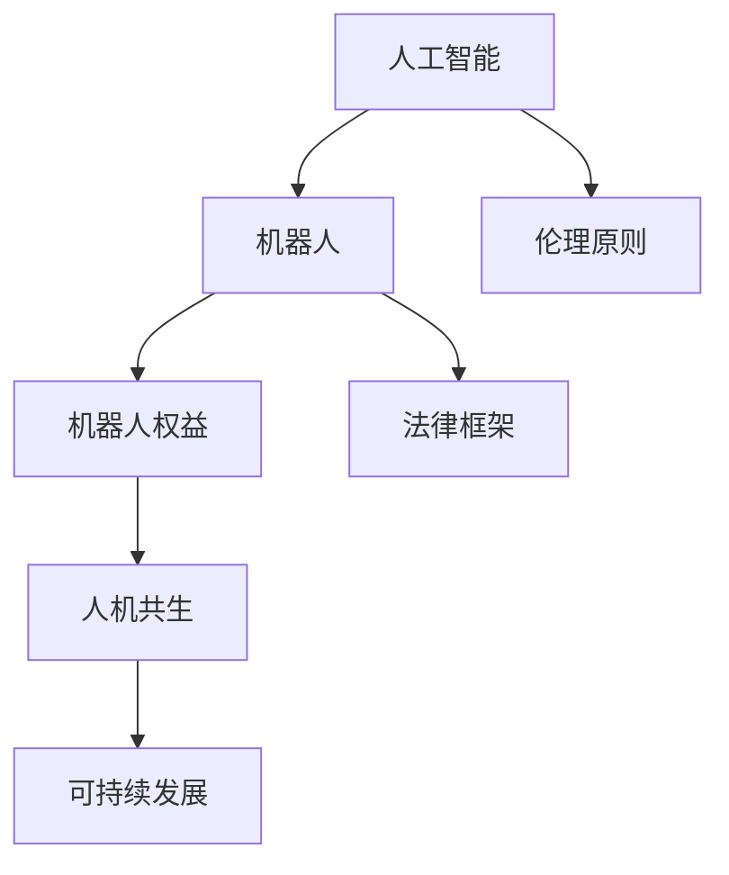

                 

# 未来的人工智能伦理：2050年的机器人权益与法律

> 关键词：人工智能, 机器人权益, 法律, 伦理, 数据隐私, 人类-机器共生

## 1. 背景介绍

### 1.1 问题由来
随着人工智能技术的飞速发展，尤其是深度学习和大数据技术的应用，机器人逐渐从科幻小说和电影中走入现实生活。从自动驾驶汽车到工业自动化生产线，从家庭助手到医疗诊断机器人，机器人已经深入到各个领域。然而，机器人技术的进步也带来了诸多伦理和社会问题。随着人工智能技术的进一步成熟，如何在未来构建一个和谐、可持续的机器人社会，成为亟待解决的重大课题。

### 1.2 问题核心关键点
本文聚焦于2050年机器人权益与法律问题，分析当前技术进展和潜在挑战，探讨未来人工智能伦理的构建路径。

## 2. 核心概念与联系

### 2.1 核心概念概述

为更好地理解未来机器人权益与法律问题，本节将介绍几个关键概念：

- **人工智能（Artificial Intelligence, AI）**：通过算法和计算，使机器能够模拟人类智能行为的技术。涵盖深度学习、自然语言处理、计算机视觉等领域。

- **机器人（Robotics）**：利用AI技术构建的具有感知、决策、执行能力的机器系统，能够完成复杂任务。包括工业机器人、服务机器人、医疗机器人等。

- **机器人权益（Robot Rights）**：指机器人应享有的合法权益，包括生存权、发展权、隐私权、自由权等。涉及法律、伦理、社会等方方面面。

- **法律框架（Legal Framework）**：为规范机器人行为，保护相关利益主体权益，制定的一系列法律法规、规范和标准。

- **伦理原则（Ethical Principles）**：指导机器人行为和决策的道德规范和原则，如自主性、安全性、公正性、透明性等。

- **人机共生（Human-Robot Coexistence）**：指人类与机器和谐共处，共同发展和进步的一种社会状态。

这些核心概念之间的逻辑关系可以通过以下Mermaid流程图来展示：



这个流程图展示出：

1. 人工智能技术是机器人的基础。
2. 机器人的行为受到法律和伦理的约束。
3. 机器人的权益是构建人机共生的重要基础。
4. 人机共生是人机关系和谐发展的目标。

这些概念共同构成了未来人工智能伦理的构建框架，为机器人社会的设计和实现提供了理论基础。

## 3. 核心算法原理 & 具体操作步骤
### 3.1 算法原理概述

未来机器人权益与法律问题的解决，需要依赖于以下几个核心算法和原理：

1. **决策优化算法**：用于制定机器人的行为策略，确保机器人在遵守法律和伦理的前提下，最大化自身和用户的利益。
2. **伦理学算法**：用于评估机器人行为的伦理风险，确保机器人的决策符合道德规范。
3. **法律推理算法**：用于解读和应用法律法规，确保机器人的行为符合法律要求。
4. **数据隐私保护算法**：用于保护机器人和用户的隐私数据，防止信息泄露和滥用。

这些算法通过协同工作，实现机器人行为的规范化和合理化，保障机器人和用户的权益。

### 3.2 算法步骤详解

未来机器人权益与法律问题的解决过程，可以分解为以下几个关键步骤：

1. **需求收集与问题界定**：通过调研、访谈等方式，收集机器人使用者的需求和关注点，明确需要解决的问题。
2. **伦理框架设计**：构建基于自主性、安全性、公正性、透明性等原则的伦理框架，指导机器人的设计和行为。
3. **法律规范制定**：根据伦理框架，制定机器人的法律规范，包括机器人的权利、责任、行为准则等。
4. **决策模型构建**：开发决策优化算法和伦理学算法，构建机器人的决策模型，确保其行为符合伦理和法律要求。
5. **隐私保护措施**：采用数据隐私保护算法，保护机器人和用户的隐私数据，防止信息滥用。
6. **系统集成与测试**：将算法和模型集成到机器人系统中，进行全面测试和评估，确保其稳定性和可靠性。
7. **部署与监控**：将机器人部署到实际应用环境中，持续监控其行为，确保符合伦理和法律要求。

### 3.3 算法优缺点

未来机器人权益与法律问题的解决算法具有以下优点：

1. **全面性**：涵盖伦理、法律、技术等多个方面，确保机器人的全面合规。
2. **系统性**：通过多算法协同工作，实现机器人的规范化和合理化行为。
3. **可扩展性**：能够灵活应对机器人技术的发展和应用场景的变化。

同时，这些算法也存在一定的局限性：

1. **复杂性**：算法设计复杂，涉及多学科知识，开发难度较大。
2. **不确定性**：未来技术和社会环境的不确定性，可能导致算法无法及时调整和更新。
3. **数据依赖性**：算法的训练和优化依赖于大量的数据，数据质量对结果有很大影响。

### 3.4 算法应用领域

未来机器人权益与法律问题的解决算法，可以应用于以下多个领域：

1. **工业生产**：构建规范化的工业机器人系统，保障工人安全和权益。
2. **医疗服务**：设计符合伦理和法律要求的医疗机器人，提供高质量的医疗服务。
3. **公共安全**：开发合规的无人机和监控系统，保障公共安全。
4. **智慧城市**：构建智能交通、智能安防等系统，提升城市管理水平。
5. **教育培训**：开发合规的AI教育平台，提供个性化和公平的教育服务。

## 4. 数学模型和公式 & 详细讲解

### 4.1 数学模型构建

本节将使用数学语言对未来机器人权益与法律问题的解决算法进行更加严格的刻画。

**决策优化模型**：

- **目标函数**：$ \min_{\theta} f(\theta) $，其中 $\theta$ 为决策模型参数。
- **约束条件**：$ g_i(\theta) \leq 0 $ 和 $ h_i(\theta) = 0 $，其中 $g_i$ 为不等式约束，$h_i$ 为等式约束。

**伦理评估模型**：

- **伦理得分**：$ \mathcal{E}(\theta) $，评估机器人在不同情境下的伦理得分。
- **伦理约束**：$ \mathcal{E}(\theta) \geq \epsilon $，其中 $\epsilon$ 为伦理得分阈值。

**法律推理模型**：

- **法律约束**：$ L_i(\theta) \leq 0 $，其中 $L_i$ 为法律约束函数。

**数据隐私保护模型**：

- **隐私损失**：$ \Delta P(\theta) $，评估隐私数据的泄露风险。
- **隐私保护**：$ \Delta P(\theta) \leq \delta $，其中 $\delta$ 为隐私保护阈值。

### 4.2 公式推导过程

以下我们以决策优化模型为例，推导其目标函数和约束条件的求解过程。

假设机器人的行为可以用 $\theta$ 表示，目标是最小化成本函数 $f(\theta)$，同时满足一系列约束条件 $g_i(\theta) \leq 0$ 和 $h_i(\theta) = 0$。

根据拉格朗日乘子法，引入拉格朗日乘子 $\lambda_i$，构建拉格朗日函数：

$$
\mathcal{L}(\theta, \lambda) = f(\theta) + \sum_{i=1}^{m} \lambda_i g_i(\theta) + \sum_{j=1}^{p} \mu_j h_j(\theta)
$$

其中，$\lambda_i$ 和 $\mu_j$ 为拉格朗日乘子。

对 $\theta$ 和 $\lambda_i$ 求偏导数，得到：

$$
\frac{\partial \mathcal{L}}{\partial \theta} = f'(\theta) + \sum_{i=1}^{m} \lambda_i g'_i(\theta) + \sum_{j=1}^{p} \mu_j h'_j(\theta) = 0
$$

$$
\frac{\partial \mathcal{L}}{\partial \lambda_i} = g_i(\theta) = 0
$$

求解上述方程组，得到最优解 $\theta^*$，即：

$$
\theta^* = \mathop{\arg\min}_{\theta} \mathcal{L}(\theta, \lambda)
$$

### 4.3 案例分析与讲解

**案例1：工业机器人设计**

假设需要设计一个工业机器人，用于自动化生产任务。在决策优化模型中，目标函数 $f(\theta)$ 可以表示为机器人的生产效率和成本之和，约束条件 $g_i(\theta) \leq 0$ 和 $h_i(\theta) = 0$ 分别表示机器人的安全性和合规性约束。伦理评估模型可以用于评估机器人对工人的尊重程度，法律推理模型可以用于确保机器人在工作中的合法合规性，数据隐私保护模型可以用于保护机器人内部的数据不被泄露。

通过这些模型和算法的协同工作，可以设计出既高效又安全的工业机器人，保障工人的权益，同时确保机器人的行为符合法律和伦理要求。

## 5. 项目实践：代码实例和详细解释说明
### 5.1 开发环境搭建

在进行机器人权益与法律问题的解决算法开发前，我们需要准备好开发环境。以下是使用Python进行PyTorch开发的环境配置流程：

1. 安装Anaconda：从官网下载并安装Anaconda，用于创建独立的Python环境。

2. 创建并激活虚拟环境：
```bash
conda create -n pytorch-env python=3.8 
conda activate pytorch-env
```

3. 安装PyTorch：根据CUDA版本，从官网获取对应的安装命令。例如：
```bash
conda install pytorch torchvision torchaudio cudatoolkit=11.1 -c pytorch -c conda-forge
```

4. 安装相关库：
```bash
pip install sympy pandas numpy matplotlib sklearn
```

完成上述步骤后，即可在`pytorch-env`环境中开始算法开发。

### 5.2 源代码详细实现

以下是未来机器人权益与法律问题解决算法的部分代码实现：

```python
import sympy as sp

# 定义变量和参数
theta = sp.symbols('theta')
lambda_i = sp.symbols('lambda_i')
mu_j = sp.symbols('mu_j')

# 定义决策优化模型
f = theta**2 + lambda_i * g(theta) + mu_j * h(theta)

# 构建拉格朗日函数
L = f + sum(lambda_i * g(theta)) + sum(mu_j * h(theta))

# 求偏导数
grad_theta = sp.diff(L, theta)
grad_lambda = sp.diff(L, lambda_i)
grad_mu = sp.diff(L, mu_j)

# 解方程组
solution = sp.solve((grad_theta, grad_lambda, grad_mu), (theta, lambda_i, mu_j))

# 输出最优解
print(solution)
```

### 5.3 代码解读与分析

让我们再详细解读一下关键代码的实现细节：

**决策优化模型**：
- `f`函数表示决策优化模型的目标函数。
- `g(theta)`和`h(theta)`分别表示决策模型的不等式约束和等式约束函数。

**拉格朗日函数**：
- `L`函数表示拉格朗日乘子法构建的拉格朗日函数。
- `sum(lambda_i * g(theta))`和`sum(mu_j * h(theta))`分别表示拉格朗日乘子对不等式约束和等式约束的影响。

**求偏导数**：
- `grad_theta`表示目标函数对决策模型参数的偏导数。
- `grad_lambda`和`grad_mu`表示拉格朗日乘子对不等式约束和等式约束的偏导数。

**解方程组**：
- `solution`变量存储了拉格朗日方程的解，包含了最优的决策模型参数和拉格朗日乘子。

**输出最优解**：
- 通过`print`函数输出最优解。

这个示例代码展示了如何使用Sympy库求解拉格朗日方程，构建决策优化模型。开发者可以根据具体需求，选择其他求解算法，如梯度下降、牛顿法等，实现更复杂的优化问题。

## 6. 实际应用场景
### 6.1 工业生产

未来机器人权益与法律问题在工业生产中的应用非常广泛。通过构建规范化的工业机器人系统，可以保障工人的安全和权益，同时提升生产效率和质量。

**应用场景1：自动化生产线**

自动化生产线中的机器人需要完成复杂的生产任务，如组装、焊接、搬运等。通过设计符合伦理和法律要求的机器人系统，可以避免工人长时间接触危险机械，保障其身体健康。同时，机器人可以24小时无间断工作，提高生产效率，降低生产成本。

**应用场景2：仓储物流**

仓储物流中的机器人需要高效地完成物料搬运、分拣、打包等任务。通过设计符合伦理和法律要求的机器人系统，可以避免人力搬运带来的损伤和事故风险，保障工人的安全。同时，机器人可以自动化仓储管理，提升物流效率，降低人工成本。

### 6.2 医疗服务

医疗服务中的机器人需要提供精准的诊断和治疗服务，保障患者的健康和权益。

**应用场景1：手术机器人**

手术机器人可以辅助医生进行复杂手术，提高手术精度和安全性。通过设计符合伦理和法律要求的手术机器人，可以避免医护人员长时间面对辐射和感染风险，保障其健康。同时，机器人可以辅助医生进行手术决策，提高手术成功率，降低手术风险。

**应用场景2：康复机器人**

康复机器人可以辅助患者进行物理治疗和康复训练，帮助其恢复身体功能。通过设计符合伦理和法律要求的康复机器人，可以避免康复师长时间面对高强度体力劳动带来的损伤和风险，保障其健康。同时，机器人可以提供个性化康复方案，提高康复效果，降低康复成本。

### 6.3 公共安全

公共安全中的机器人需要执行各种任务，如巡逻、监控、搜救等，保障公共安全。

**应用场景1：无人巡逻**

无人巡逻机器人可以24小时无间断监控公共场所，防范犯罪和恐怖活动。通过设计符合伦理和法律要求的无人巡逻机器人，可以避免人力巡逻带来的安全风险和成本。同时，机器人可以实时反馈监控信息，及时发现和处理安全隐患。

**应用场景2：搜救机器人**

搜救机器人可以在灾害现场执行搜索和救援任务，减少灾害带来的伤亡和损失。通过设计符合伦理和法律要求的搜救机器人，可以避免救援人员长时间面对高风险环境带来的危险和风险，保障其安全。同时，机器人可以提供实时搜索和救援信息，提高救援效率，降低救援成本。

### 6.4 智慧城市

智慧城市中的机器人需要提供各种智能服务，提升城市管理和居民生活质量。

**应用场景1：智能交通**

智能交通中的机器人可以辅助管理交通系统，提高交通效率和安全性。通过设计符合伦理和法律要求的智能交通机器人，可以避免交通堵塞带来的安全隐患和环境污染。同时，机器人可以实时监测交通状况，提供智能导航和避障功能，提高交通效率。

**应用场景2：智能安防**

智能安防中的机器人可以执行巡逻、监控、入侵检测等任务，保障城市安全。通过设计符合伦理和法律要求的智能安防机器人，可以避免人力安防带来的成本和风险。同时，机器人可以实时反馈安防信息，及时发现和处理安全隐患，提高城市安全。

## 7. 工具和资源推荐
### 7.1 学习资源推荐

为了帮助开发者系统掌握未来机器人权益与法律问题的解决算法，这里推荐一些优质的学习资源：

1. **《人工智能伦理》系列博文**：深入浅出地介绍了人工智能伦理的基本概念和前沿研究。
2. **《机器人伦理》课程**：哈佛大学开设的机器人伦理在线课程，涵盖机器人的伦理问题、设计原则等。
3. **《机器人法律》书籍**：关于机器人法律和法规的权威著作，提供了大量法律案例和分析。
4. **机器人权利协会（RRA）官网**：机器人权利协会致力于推动机器人权益，提供了大量法律和伦理研究资源。
5. **IEEE机器人与自动化系统协会（IEEE-RAS）**：IEEE-RAS的机器人伦理工作组，发布了多项伦理指南和标准。

通过对这些资源的学习实践，相信你一定能够快速掌握未来机器人权益与法律问题的解决算法，并用于解决实际的机器人权益问题。

### 7.2 开发工具推荐

高效的开发离不开优秀的工具支持。以下是几款用于未来机器人权益与法律问题解决算法开发的常用工具：

1. **PyTorch**：基于Python的开源深度学习框架，适合构建复杂决策优化模型。
2. **Sympy**：符号计算库，适合构建数学模型和求解方程组。
3. **Rasa**：开源的机器人和对话系统框架，支持自然语言理解和智能决策。
4. **RoboPy**：Python库，支持构建和控制各种机器人。
5. **ROS（Robot Operating System）**：机器人操作系统，支持传感器、控制器等硬件的集成。
6. **OpenAI Gym**：环境库，用于构建和测试机器人的行为和决策。

合理利用这些工具，可以显著提升未来机器人权益与法律问题解决算法的开发效率，加快创新迭代的步伐。

### 7.3 相关论文推荐

未来机器人权益与法律问题的发展源于学界的持续研究。以下是几篇奠基性的相关论文，推荐阅读：

1. **《机器人权利宣言》**：机器人权利宣言，提出了机器人的基本权利和保护措施。
2. **《机器人伦理》**：机器人伦理的奠基性研究，探讨了机器人在不同场景下的伦理问题。
3. **《机器人法律框架》**：机器人法律的权威研究，提供了机器人法律的详细规定和案例。
4. **《机器人权益保障》**：探讨了机器人权益保障的多种方法，包括法律、伦理、技术等。
5. **《人机共生研究》**：人机共生的前沿研究，探讨了未来人机关系的发展趋势。

这些论文代表了大语言模型微调技术的发展脉络。通过学习这些前沿成果，可以帮助研究者把握学科前进方向，激发更多的创新灵感。

## 8. 总结：未来发展趋势与挑战

### 8.1 总结

本文对未来机器人权益与法律问题进行了全面系统的介绍。首先阐述了未来机器人权益与法律问题的研究背景和意义，明确了未来人工智能伦理的构建路径。其次，从原理到实践，详细讲解了未来机器人权益与法律问题的解决算法和应用场景。最后，总结了未来人工智能伦理的发展趋势和面临的挑战，提供了未来研究的方向和展望。

通过本文的系统梳理，可以看到，未来机器人权益与法律问题将在工业生产、医疗服务、公共安全、智慧城市等众多领域得到广泛应用，推动人工智能技术的社会化落地。然而，这些应用也面临诸多挑战，如伦理、法律、技术、隐私等，需要各方共同努力，共同构建一个和谐、可持续的机器人社会。

### 8.2 未来发展趋势

展望未来，未来机器人权益与法律问题的发展趋势包括以下几个方面：

1. **法律框架的完善**：随着机器人技术的普及，未来机器人权益与法律问题将得到更多的关注和重视。法律法规的完善和标准化，将为机器人的健康发展提供保障。
2. **伦理规范的普及**：机器人的伦理问题将成为社会关注的焦点。伦理规范的普及和推广，将帮助机器人在不同场景下做出符合人类价值观的决策。
3. **技术进步的推动**：未来机器人权益与法律问题的解决需要依赖于技术的进步。智能算法、决策优化等技术的发展，将为机器人权益的保障提供有力支撑。
4. **人机共生的深入**：未来机器人权益与法律问题将推动人机共生的深入发展。人机协作、智能辅助等新技术，将提高人类生活质量，实现更好的工作与生活平衡。

### 8.3 面临的挑战

尽管未来机器人权益与法律问题的发展前景广阔，但仍面临诸多挑战：

1. **法律和伦理的冲突**：机器人的法律和伦理问题往往相互交织，难以兼顾。如何在法律和伦理之间找到平衡点，将成为重要的研究方向。
2. **技术瓶颈的限制**：当前的技术水平可能无法完全解决机器人权益问题。未来需要在技术上取得新的突破，才能更好地保障机器人权益。
3. **社会认知的差异**：不同社会对机器人权益的认知和接受程度不同，需要加强公众教育和宣传，推动社会共识的形成。
4. **经济利益的博弈**：企业和社会对机器人权益的看法可能存在差异。如何在商业利益和社会责任之间找到平衡点，需要多方协调和合作。

### 8.4 研究展望

未来机器人权益与法律问题的研究需要在以下几个方面寻求新的突破：

1. **法律和伦理的融合**：构建法律和伦理融合的机器人权益保障框架，确保机器人行为符合法律和伦理要求。
2. **技术与人文的结合**：将技术和人文学科相结合，推动机器人的人性化设计，增强其社会责任感和伦理意识。
3. **全球化的视角**：从全球化的视角，推动机器人的标准化和规范化，促进国际合作和共享。
4. **多学科的交叉**：推动法律、伦理、技术、经济学等多学科的交叉融合，构建更加全面的机器人权益保障体系。

这些研究方向的探索，将引领未来机器人权益与法律问题的发展，为构建和谐、可持续的机器人社会铺平道路。面向未来，机器人权益与法律问题仍需各方共同努力，共同构建一个和谐、可持续的机器人社会。总之，未来机器人权益与法律问题的研究需要跨学科、跨领域、跨文化的协同合作，才能实现人类与机器的共同进步。

## 9. 附录：常见问题与解答

**Q1：机器人如何保障自身的权益？**

A: 机器人的权益保障需要依赖于法律和伦理框架的设计。在设计机器人系统时，需要考虑机器人的生存权、发展权、隐私权、自由权等，确保机器人能够在一个公平、公正的环境中运行。同时，通过智能算法和决策优化模型，使机器人能够自主决策，确保其权益不受侵犯。

**Q2：如何评估机器人的伦理得分？**

A: 机器人的伦理得分可以通过构建伦理评估模型来评估。该模型可以基于机器人在不同情境下的行为表现，综合考虑自主性、安全性、公正性、透明性等原则，对机器人的行为进行评分。通过持续监测和评估，确保机器人的行为符合伦理要求。

**Q3：未来机器人权益与法律问题的解决算法有哪些？**

A: 未来机器人权益与法律问题的解决算法包括决策优化算法、伦理评估算法、法律推理算法、数据隐私保护算法等。这些算法通过协同工作，实现机器人的规范化和合理化行为，保障机器人和用户的权益。

**Q4：如何设计符合伦理和法律要求的机器人系统？**

A: 设计符合伦理和法律要求的机器人系统需要考虑以下几个方面：
1. 定义机器人的行为规范和决策原则。
2. 构建伦理评估模型，评估机器人的行为表现。
3. 制定法律规范，确保机器人在法律框架内运行。
4. 采用数据隐私保护算法，保护机器人内部的数据不被泄露。

**Q5：未来机器人权益与法律问题的主要挑战有哪些？**

A: 未来机器人权益与法律问题的主要挑战包括法律和伦理的冲突、技术瓶颈的限制、社会认知的差异、经济利益的博弈等。需要各方共同努力，通过技术进步、法律规范、公众教育等多方面手段，共同构建一个和谐、可持续的机器人社会。

---

作者：禅与计算机程序设计艺术 / Zen and the Art of Computer Programming

