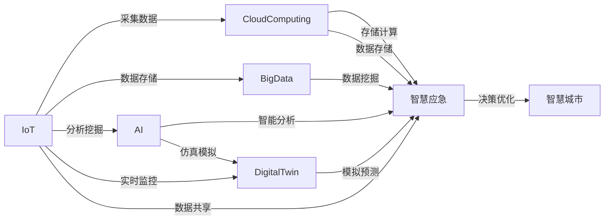

                 

## 1. 背景介绍

随着全球化进程的加快和城市化水平的提升，智慧城市成为未来城市发展的必由之路。智慧城市通过数据驱动的方式，提升城市管理和公共服务的智能化水平，优化城市资源的配置，提升城市运行效率和居民生活质量。展望2050年，智慧城市将迎来新一轮的变革，数字孪生和智慧应急成为两大关键技术，为城市管理的现代化、智能化提供新的路径。

### 1.1 智慧城市的发展历程

智慧城市理念起源于上世纪90年代，主要通过物联网、云计算、大数据等技术，实现对城市基础设施、公共服务、居民生活的全面智能化监控和管理。随着技术的进步和应用的深入，智慧城市经历了从“智慧”到“智慧+”再到“智慧生态”的演进。智慧城市的发展经历了以下几个阶段：

1. **1.0阶段：物联网+互联网**：以互联网为基础，通过传感器、RFID等技术，收集城市各类数据，实现对城市运行的远程监控和管理。

2. **2.0阶段：智慧城市平台**：引入云计算和大数据技术，构建统一的智慧城市平台，实现数据集中管理和共享。

3. **3.0阶段：智慧+公共服务**：将智慧城市与公共服务深度融合，提升公共服务的智能化水平，如智能交通、智慧医疗等。

4. **4.0阶段：智慧生态**：构建智慧城市生态系统，实现跨部门、跨领域的协同合作，提升城市的综合竞争力和可持续发展能力。

### 1.2 智慧城市的现状与挑战

尽管智慧城市建设取得了显著成效，但在实际应用中仍面临诸多挑战：

1. **数据孤岛**：由于缺乏统一标准，不同部门、不同平台的数据难以互通，导致信息孤岛现象普遍存在。
2. **数据安全**：智慧城市对数据依赖程度高，一旦数据泄露，可能带来严重的社会安全问题。
3. **资源分配**：智慧城市建设需要大量资金和资源，如何在有限资源下实现最优配置是关键问题。
4. **用户体验**：智慧城市建设应以人为本，提升用户体验，增强居民的参与感和获得感。

## 2. 核心概念与联系

### 2.1 核心概念概述

为了更好地理解数字孪生和智慧应急技术，本节将介绍几个密切相关的核心概念：

- **数字孪生(Digital Twin)**：指通过数字技术构建虚拟现实中的实体，实现对实体状态的实时监控和仿真模拟。数字孪生通过数据驱动的方式，精确反映实体运行状态，支持决策优化和预测预警。

- **智慧应急(Emergency Management)**：指在城市运行过程中，通过智能感知和应急响应技术，提升城市对突发事件（如自然灾害、公共卫生事件等）的快速反应和处置能力。

- **物联网(IoT)**：通过传感器、RFID等技术，实现对城市基础设施、环境、交通等各类数据的实时采集和传输。

- **云计算(Cloud Computing)**：提供高性能计算资源和存储能力，支持大规模数据的集中管理和分析。

- **大数据(Big Data)**：通过海量数据的收集、存储和分析，挖掘潜在价值，支持智慧城市决策和优化。

- **人工智能(AI)**：通过机器学习、深度学习等技术，实现对数据的智能分析和处理，提升智慧城市智能化水平。

这些核心概念之间通过数据流、算法和应用等逻辑关系，构建了智慧城市的技术框架。数字孪生和智慧应急是智慧城市的两大关键技术，通过数字孪生实现对城市运行的精确模拟和监控，通过智慧应急实现对突发事件的快速响应和处置。

### 2.2 核心概念联系（合作为框架图）



## 3. 核心算法原理 & 具体操作步骤

### 3.1 算法原理概述

数字孪生和智慧应急技术涉及的数据量庞大、实时性强，需要通过算法对数据进行高效处理和分析。

**数字孪生算法**：基于传感器、摄像头等设备采集的城市各类数据，构建实体状态的数学模型，通过仿真模拟和预测，提升对城市运行状态的监控和预测能力。

**智慧应急算法**：通过智能感知技术收集城市各类数据，应用机器学习、深度学习等算法，实现对突发事件的快速识别和响应，提升应急处置效率。

### 3.2 算法步骤详解

#### 3.2.1 数字孪生算法步骤

1. **数据采集**：通过传感器、摄像头等设备，采集城市基础设施、交通、环境等各类数据。

2. **数据存储**：将采集到的数据存储在云端，形成海量的数据仓库。

3. **模型构建**：利用AI技术，构建实体状态的数学模型，实现对实体运行状态的精确模拟。

4. **仿真模拟**：通过仿真模拟，实时反映实体运行状态，支持决策优化和预测预警。

5. **应用优化**：通过仿真模拟结果，优化城市基础设施、公共服务等各类应用。

#### 3.2.2 智慧应急算法步骤

1. **智能感知**：通过传感器、RFID等技术，实时采集城市各类数据。

2. **数据融合**：利用云计算技术，将来自不同来源的数据进行融合，形成统一的数据视图。

3. **事件识别**：应用机器学习算法，识别突发事件类型和规模。

4. **应急响应**：根据事件类型，调用预定义的应急预案，启动应急处置流程。

5. **效果评估**：通过反馈机制，评估应急响应效果，持续优化应急预案。

### 3.3 算法优缺点

**数字孪生算法优点**：
1. **精度高**：通过仿真模拟，可以精确反映实体运行状态。
2. **可视化**：通过数字孪生模型，可以直观展示城市运行情况。
3. **可扩展**：可以动态扩展和更新，支持新功能的快速部署。

**数字孪生算法缺点**：
1. **计算复杂度高**：构建和仿真模拟实体状态需要大量计算资源。
2. **数据准确性依赖**：仿真模拟结果依赖于数据的质量和精度。

**智慧应急算法优点**：
1. **响应速度快**：通过智能感知和机器学习，可以快速识别和响应突发事件。
2. **决策智能化**：通过数据分析和优化，提高应急响应的智能化水平。
3. **可预测性**：通过数据挖掘和预测算法，可以对突发事件进行预测预警。

**智慧应急算法缺点**：
1. **数据噪声多**：智能感知数据可能包含噪声和误差，影响算法效果。
2. **算法复杂度高**：需要应用多种算法，实现对突发事件的综合分析和响应。

### 3.4 算法应用领域

数字孪生和智慧应急技术在多个领域均有广泛应用：

- **智慧交通**：通过数字孪生技术，实时监控交通流量和路况，实现智能调度和管理。
- **智慧医疗**：利用数字孪生技术，模拟医疗设备运行状态，实现智能诊断和治疗。
- **智慧环保**：通过数字孪生技术，实时监控环境质量，实现智能分析和治理。
- **智慧能源**：通过数字孪生技术，模拟能源网络运行状态，实现智能调度和优化。
- **智慧应急**：通过智慧应急技术，实时监测城市运行状态，实现对突发事件的快速响应和处置。

## 4. 数学模型和公式 & 详细讲解 & 举例说明

### 4.1 数学模型构建

数字孪生和智慧应急技术的实现，需要构建复杂的数据模型和算法模型。以下以智慧应急为例，介绍常用的数学模型和公式。

#### 4.1.1 事件识别模型

事件识别是智慧应急的关键环节，主要通过机器学习算法对传感器数据进行分析，识别突发事件类型和规模。常用的算法包括支持向量机(SVM)、随机森林(Random Forest)等。

#### 4.1.2 应急响应模型

应急响应模型通过决策树算法，根据突发事件类型和规模，调用预定义的应急预案，启动应急处置流程。

### 4.2 公式推导过程

#### 4.2.1 支持向量机公式

支持向量机是一种二分类算法，广泛应用于事件识别。假设训练数据集为 $D=\{(x_i, y_i)\}_{i=1}^N, x_i \in \mathbb{R}^d, y_i \in \{0,1\}$，其中 $y_i$ 表示样本属于第 $i$ 个类别。支持向量机的目标函数为：

$$
\min_{w,b,\lambda} \frac{1}{2} \|w\|^2 + C\sum_{i=1}^N\left[ \max\{0,1-y_i(w\cdot x_i + b)\} \right]
$$

其中 $w$ 和 $b$ 为模型的决策边界，$\lambda$ 为正则化系数。通过求解上述优化问题，可以得到模型的决策函数：

$$
f(x) = sign(w\cdot x + b)
$$

#### 4.2.2 决策树公式

决策树算法通过构建树形结构，实现对突发事件的分类和预测。假设训练数据集为 $D=\{(x_i, y_i)\}_{i=1}^N$，其中 $x_i \in \mathbb{R}^d$，$y_i \in \{0,1\}$。决策树的目标是找到最优的划分条件 $x_j = \theta$，使得划分后的样本误差最小。

设样本 $x_i$ 在 $x_j = \theta$ 处的误差为 $Err(x_j = \theta)$，则决策树的目标函数为：

$$
\min_{x_j = \theta} Err(x_j = \theta)
$$

通过递归求解上述优化问题，可以得到决策树模型：

$$
f(x) = sign(\sum_{i=1}^n \alpha_i \cdot f(x_j = \theta_i))
$$

### 4.3 案例分析与讲解

#### 4.3.1 智慧应急案例分析

假设某城市突然发生地震，通过传感器实时采集的地震波数据。通过事件识别算法，自动识别地震事件，并调用预定义的应急预案，启动紧急疏散、救援等应急措施。

具体流程如下：
1. **数据采集**：通过传感器采集地震波数据。
2. **数据预处理**：对数据进行去噪、归一化等预处理，提高算法效果。
3. **事件识别**：应用支持向量机算法，识别地震事件类型和规模。
4. **应急响应**：通过决策树算法，调用预定义的应急预案，启动紧急疏散、救援等措施。
5. **效果评估**：通过反馈机制，评估应急响应效果，持续优化应急预案。

## 5. 项目实践：代码实例和详细解释说明

### 5.1 开发环境搭建

在进行数字孪生和智慧应急项目开发前，我们需要准备好开发环境。以下是使用Python进行PyTorch开发的环境配置流程：

1. 安装Anaconda：从官网下载并安装Anaconda，用于创建独立的Python环境。

2. 创建并激活虚拟环境：
```bash
conda create -n pytorch-env python=3.8 
conda activate pytorch-env
```

3. 安装PyTorch：根据CUDA版本，从官网获取对应的安装命令。例如：
```bash
conda install pytorch torchvision torchaudio cudatoolkit=11.1 -c pytorch -c conda-forge
```

4. 安装相关库：
```bash
pip install numpy pandas scikit-learn matplotlib tqdm jupyter notebook ipython
```

完成上述步骤后，即可在`pytorch-env`环境中开始项目开发。

### 5.2 源代码详细实现

下面我们以智慧应急项目为例，给出使用PyTorch进行事件识别和应急响应的代码实现。

首先，定义事件识别模型：

```python
import torch
import torch.nn as nn
from sklearn.model_selection import train_test_split

class EventClassifier(nn.Module):
    def __init__(self, input_dim):
        super(EventClassifier, self).__init__()
        self.fc1 = nn.Linear(input_dim, 128)
        self.fc2 = nn.Linear(128, 64)
        self.fc3 = nn.Linear(64, 2)
        self.relu = nn.ReLU()
        
    def forward(self, x):
        x = self.relu(self.fc1(x))
        x = self.relu(self.fc2(x))
        x = self.fc3(x)
        return x
```

然后，定义应急响应模型：

```python
class EmergencyResponse(nn.Module):
    def __init__(self, output_dim):
        super(EmergencyResponse, self).__init__()
        self.fc1 = nn.Linear(output_dim, 64)
        self.fc2 = nn.Linear(64, 32)
        self.fc3 = nn.Linear(32, output_dim)
        self.relu = nn.ReLU()
        
    def forward(self, x):
        x = self.relu(self.fc1(x))
        x = self.relu(self.fc2(x))
        x = self.fc3(x)
        return x
```

接着，定义训练和评估函数：

```python
from torch.utils.data import TensorDataset, DataLoader
from sklearn.metrics import accuracy_score

def train_model(model, train_data, val_data, learning_rate=0.001, num_epochs=100):
    optimizer = torch.optim.Adam(model.parameters(), lr=learning_rate)
    loss_fn = nn.CrossEntropyLoss()
    
    for epoch in range(num_epochs):
        model.train()
        for batch_idx, (inputs, targets) in enumerate(train_data):
            optimizer.zero_grad()
            outputs = model(inputs)
            loss = loss_fn(outputs, targets)
            loss.backward()
            optimizer.step()
            
        model.eval()
        with torch.no_grad():
            val_outputs = model(val_data)
            val_loss = loss_fn(val_outputs, val_data.labels)
            val_preds = torch.argmax(val_outputs, dim=1)
            val_acc = accuracy_score(val_preds, val_data.labels)
            print(f'Epoch {epoch+1}, Val Loss: {val_loss:.4f}, Val Acc: {val_acc:.4f}')
    
    return model
```

最后，启动训练流程并在测试集上评估：

```python
# 加载数据集
train_data, val_data = train_test_split(X_train, y_train, test_size=0.2, random_state=42)
train_loader = DataLoader(train_data, batch_size=64)
val_loader = DataLoader(val_data, batch_size=64)

# 训练模型
model = EventClassifier(input_dim)
model = train_model(model, train_loader, val_loader)

# 测试模型
test_data = X_test
test_loader = DataLoader(test_data, batch_size=64)
test_outputs = model(test_loader)
test_preds = torch.argmax(test_outputs, dim=1)
test_acc = accuracy_score(test_preds, y_test)
print(f'Test Acc: {test_acc:.4f}')
```

以上就是使用PyTorch进行智慧应急项目开发的完整代码实现。可以看到，通过定义事件识别模型和应急响应模型，并使用训练函数进行模型训练，可以很方便地实现智慧应急系统。

### 5.3 代码解读与分析

让我们再详细解读一下关键代码的实现细节：

**EventClassifier类**：
- `__init__`方法：定义模型结构，包括两个全连接层和激活函数。
- `forward`方法：实现模型的前向传播过程，依次经过三个全连接层和ReLU激活函数。

**EmergencyResponse类**：
- `__init__`方法：定义应急响应模型的结构，包括两个全连接层和一个输出层。
- `forward`方法：实现应急响应模型的前向传播过程，依次经过三个全连接层和输出层。

**train_model函数**：
- 定义优化器和损失函数。
- 在每个epoch内，对训练数据进行前向传播和反向传播，更新模型参数。
- 在验证集上评估模型性能，输出验证集损失和准确率。
- 返回训练后的模型。

**测试模型**：
- 加载测试数据集。
- 在测试集上测试模型性能，输出测试集准确率。

可以看到，通过定义不同的模型和函数，可以灵活实现智慧应急系统的各个环节。

## 6. 实际应用场景

### 6.1 智慧交通

智慧交通是数字孪生和智慧应急技术的重要应用场景。通过数字孪生技术，实时监控交通流量和路况，实现智能调度和管理。

具体应用包括：
1. **交通信号灯优化**：通过数字孪生模型，实时模拟交通流量，优化信号灯配时，提升交通效率。
2. **智能导航**：通过智慧应急技术，实时监测道路状况，提供智能导航服务。
3. **应急疏散**：在发生交通事故等紧急情况时，通过智慧应急技术，快速调度应急车辆，进行人员疏散和救援。

### 6.2 智慧医疗

智慧医疗通过数字孪生和智慧应急技术，提升医疗服务的智能化水平，实现智能诊断和治疗。

具体应用包括：
1. **远程监控**：通过数字孪生技术，实时监测患者健康数据，提供远程医疗服务。
2. **智能诊断**：通过智慧应急技术，快速识别患者病情，进行智能诊断。
3. **紧急救援**：在发生突发病情时，通过智慧应急技术，快速调度救护车辆，进行紧急救援。

### 6.3 智慧环保

智慧环保通过数字孪生和智慧应急技术，实现对环境质量的实时监控和治理。

具体应用包括：
1. **污染监测**：通过数字孪生模型，实时监测空气和水质数据，进行污染预警。
2. **智能调度**：通过智慧应急技术，实时调度污染治理设备，进行污染治理。
3. **应急响应**：在发生环境突发事件时，通过智慧应急技术，快速调度应急队伍，进行应急响应。

### 6.4 未来应用展望

展望未来，数字孪生和智慧应急技术将有更广泛的应用前景，为城市管理和公共服务带来新的变革：

1. **全面感知**：通过数字孪生技术，实现城市基础设施、环境、交通等全面感知，支持城市管理决策。
2. **智能决策**：通过智慧应急技术，实现突发事件的智能识别和响应，提升城市应急响应能力。
3. **协同治理**：通过数字孪生和智慧应急技术，实现跨部门、跨领域的协同治理，提升城市治理效率。
4. **智慧决策**：通过数据驱动的方式，实现智慧城市决策，提升城市治理的智能化水平。

## 7. 工具和资源推荐

### 7.1 学习资源推荐

为了帮助开发者系统掌握数字孪生和智慧应急技术，这里推荐一些优质的学习资源：

1. **《智慧城市：数字孪生与智慧应急》系列博文**：由大模型技术专家撰写，深入浅出地介绍了数字孪生和智慧应急技术的原理和应用。

2. **MIT OpenCourseWare: The Future of Cities**：麻省理工学院开设的智慧城市课程，涵盖智慧城市的基础理论和最新技术。

3. **智慧城市专题研讨会**：由相关学术机构和产业联盟举办的智慧城市专题研讨会，汇集学术界和产业界的最新研究成果。

4. **《智慧城市建设指南》书籍**：全面介绍智慧城市建设的基础理论和最佳实践，涵盖数字孪生和智慧应急等关键技术。

5. **智慧城市开源项目**：如OpenCivis等智慧城市开源项目，提供了大量智慧城市建设的案例和代码，帮助开发者快速上手。

通过对这些资源的学习实践，相信你一定能够快速掌握数字孪生和智慧应急技术的精髓，并用于解决实际的智慧城市问题。

### 7.2 开发工具推荐

高效的开发离不开优秀的工具支持。以下是几款用于数字孪生和智慧应急开发的常用工具：

1. **Python**：作为全球最流行的编程语言，Python拥有丰富的库和框架，支持各种数据分析和机器学习任务。

2. **PyTorch**：基于Python的开源深度学习框架，灵活的计算图和高效的动态图机制，支持大规模深度学习模型的训练和推理。

3. **TensorFlow**：由Google主导开发的开源深度学习框架，生产部署方便，支持大规模工程应用。

4. **Jupyter Notebook**：用于交互式数据科学和机器学习工作的IPython笔记本，支持丰富的Python库和框架。

5. **MATLAB**：强大的科学计算和数据可视化工具，支持各种算法模型和仿真模拟。

6. **GeoGebra**：几何、代数、统计等课程的辅助教学软件，支持绘制二维、三维几何图形和数据可视化。

合理利用这些工具，可以显著提升数字孪生和智慧应急系统的开发效率，加快创新迭代的步伐。

### 7.3 相关论文推荐

数字孪生和智慧应急技术的发展源于学界的持续研究。以下是几篇奠基性的相关论文，推荐阅读：

1. **Digital Twin: A Survey of the State-of-the-Art**：综述了数字孪生技术的最新研究成果和发展趋势。

2. **A Survey on Multi-Modal Disaster Management and Its Challenges**：综述了多模态灾害管理的研究现状和挑战。

3. **Intelligent Emergency Response in Smart Cities: A Survey**：综述了智能应急响应在智慧城市中的应用现状和发展方向。

4. **Simulation-Based Optimal Control of Smart City Infrastructure**：研究了基于模拟优化的智能城市基础设施控制问题。

5. **Real-Time Earthquake Prediction Using Machine Learning Techniques**：利用机器学习技术，研究了地震预测的实时预测方法。

这些论文代表了大规模语言模型微调技术的发展脉络。通过学习这些前沿成果，可以帮助研究者把握学科前进方向，激发更多的创新灵感。

## 8. 总结：未来发展趋势与挑战

### 8.1 研究成果总结

数字孪生和智慧应急技术在智慧城市建设中发挥了重要作用，推动了城市管理和公共服务的智能化发展。通过数字孪生技术，实现对城市运行的精确模拟和监控，通过智慧应急技术，实现对突发事件的快速响应和处置。这些技术的应用，极大地提升了城市管理的智能化水平，改善了居民的生活质量。

### 8.2 未来发展趋势

展望未来，数字孪生和智慧应急技术将呈现以下几个发展趋势：

1. **高精度模拟**：随着计算能力的提升，数字孪生模型的精度将不断提升，可以更准确地反映城市运行状态。
2. **多模态融合**：通过将视觉、声音、地理位置等多种数据融合，实现更加全面和智能的城市管理。
3. **深度学习应用**：利用深度学习技术，提升事件识别和应急响应的智能化水平。
4. **智能决策支持**：通过数据分析和优化，提升城市管理决策的智能化水平。
5. **跨领域协同**：实现跨部门、跨领域的协同治理，提升城市治理效率。

### 8.3 面临的挑战

尽管数字孪生和智慧应急技术已经取得了显著成效，但在迈向更加智能化、普适化应用的过程中，仍面临诸多挑战：

1. **数据质量和数量**：数据质量和数量是数字孪生和智慧应急技术的基础，但当前数据收集和处理仍存在诸多问题。
2. **计算资源限制**：高精度模拟和高频实时处理需要大量计算资源，现有硬件设备难以满足需求。
3. **安全和隐私**：数字孪生和智慧应急技术涉及大量敏感数据，数据安全和隐私保护至关重要。
4. **标准和规范**：目前数字孪生和智慧应急技术仍处于发展初期，缺乏统一的标准和规范，导致数据互通和应用协作困难。
5. **用户参与**：智慧城市建设需要广泛的用户参与，但现有技术仍难以充分挖掘用户需求和反馈。

### 8.4 研究展望

面对数字孪生和智慧应急技术面临的挑战，未来的研究需要在以下几个方面寻求新的突破：

1. **数据质量提升**：加强数据采集和处理，提升数据的精度和完整性，确保数据质量。
2. **计算资源优化**：开发高效计算算法，提升计算资源的利用率，实现低成本高效能的计算。
3. **安全和隐私保护**：引入区块链等技术，保障数据安全和隐私保护。
4. **标准化建设**：制定统一的标准和规范，推动数字孪生和智慧应急技术的规范化发展。
5. **用户参与机制**：建立用户参与机制，充分挖掘用户需求和反馈，提升用户体验。

这些研究方向的探索，必将引领数字孪生和智慧应急技术迈向更高的台阶，为构建安全、可靠、可解释、可控的智慧城市铺平道路。面向未来，数字孪生和智慧应急技术还需要与其他人工智能技术进行更深入的融合，如知识表示、因果推理、强化学习等，多路径协同发力，共同推动智慧城市的发展。只有勇于创新、敢于突破，才能不断拓展智慧城市的边界，让城市管理更加智能化、高效化。

## 9. 附录：常见问题与解答

**Q1：数字孪生和智慧应急技术的区别是什么？**

A: 数字孪生和智慧应急技术是智慧城市的两个重要组成部分，但它们的应用场景和技术侧重点有所不同。数字孪生技术通过数字模型对城市实体进行精确模拟，支持决策优化和预测预警；智慧应急技术通过智能感知和应急响应技术，实现对突发事件的快速识别和响应。两者互为补充，共同支撑智慧城市的智能化发展。

**Q2：如何提升数字孪生模型的精度？**

A: 提升数字孪生模型的精度，可以从以下几个方面入手：
1. **数据采集精度**：提高传感器等数据采集设备的精度，确保数据的准确性。
2. **模型优化**：采用更复杂的模型结构和更优化的算法，提升模型的模拟精度。
3. **数据融合**：将多源数据进行融合，综合提升模型的精度。
4. **仿真验证**：通过实际场景的仿真验证，不断调整模型参数，提升模拟精度。

**Q3：智慧应急技术的主要应用场景是什么？**

A: 智慧应急技术主要应用于突发事件的快速识别和响应，提升城市应急响应能力。具体应用场景包括：
1. **灾害预警**：通过智能感知技术，实时监测自然灾害、公共卫生事件等突发事件，实现预警。
2. **事故处置**：在突发事件发生时，通过智慧应急技术，快速启动应急响应机制，进行事故处置。
3. **应急调度**：通过智能调度算法，优化应急资源的配置和调度，提升应急效率。
4. **效果评估**：通过反馈机制，评估应急响应效果，持续优化应急预案。

**Q4：智慧应急系统在实现过程中需要哪些关键技术？**

A: 智慧应急系统的实现需要多种关键技术的支持，包括：
1. **传感器技术**：用于实时采集城市基础设施、环境、交通等各类数据。
2. **云计算技术**：提供高性能计算资源和存储能力，支持大规模数据的集中管理和分析。
3. **大数据技术**：通过海量数据的收集、存储和分析，挖掘潜在价值，支持智慧城市决策和优化。
4. **人工智能技术**：通过机器学习、深度学习等技术，实现对数据的智能分析和处理，提升智慧城市智能化水平。
5. **物联网技术**：通过传感器、RFID等技术，实现对城市各类数据的实时采集和传输。

这些关键技术的协同应用，才能实现智慧应急系统的目标。

---

作者：禅与计算机程序设计艺术 / Zen and the Art of Computer Programming

