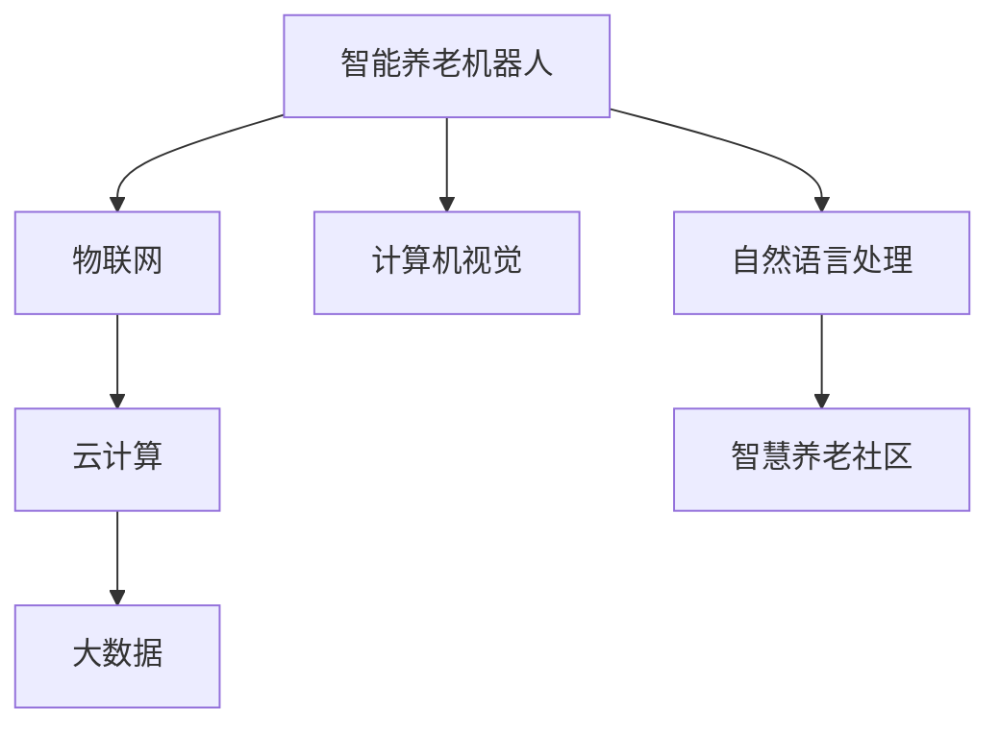

                 

# 未来的智能养老：2050年的智能养老机器人与智慧养老社区

## 1. 背景介绍

### 1.1 问题由来

随着社会老龄化的加剧，养老问题已经成为各国政府和全社会关注的重要议题。传统的养老模式面临着成本高、资源紧张、服务质量参差不齐等问题。尤其是在现代社会，人们的生活节奏加快，家庭成员间的互动逐渐减少，传统的家庭养老方式正面临前所未有的挑战。

为了应对这一问题，世界各国纷纷提出了各种解决方案，包括政策支持、社会保险体系完善、养老社区建设等。但这些措施往往难以在短期内实现显著效果。随着科技的快速发展，特别是人工智能和大数据技术的突破，为养老产业带来了新的机遇和挑战。未来，智能养老机器人与智慧养老社区的结合，有望从根本上解决养老问题。

### 1.2 问题核心关键点

智能养老机器人与智慧养老社区的核心在于利用先进的技术手段，提升老年人的生活质量，降低养老成本，同时为养老产业带来新的发展机遇。

- **智能养老机器人**：通过高级人工智能技术，如自然语言处理、计算机视觉、机器人学等，实现养老机器人与老年人之间的自然交互，提供日常照护、情感陪伴、健康监测等服务。

- **智慧养老社区**：借助物联网、大数据、云计算等技术，构建一个智能、安全、高效的养老环境，实现资源优化配置，提升养老服务的效率和质量。

这两个核心技术的结合，将彻底改变传统养老模式，为老年人提供更全面、更个性化的养老服务。

## 2. 核心概念与联系

### 2.1 核心概念概述

为更好地理解智能养老机器人与智慧养老社区的工作原理和架构，本节将介绍几个密切相关的核心概念：

- **智能养老机器人**：基于高级人工智能技术的机器人，能够自主完成日常照护、健康监测、情感陪伴等任务，是智慧养老的重要组成部分。

- **智慧养老社区**：通过物联网、大数据、云计算等技术，实现养老资源的智能管理和优化配置，提供智能化的养老服务，包括居家养老、社区养老等多种形式。

- **自然语言处理(NLP)**：利用计算机技术，使机器能够理解和生成人类语言，实现人机交互。

- **计算机视觉**：使机器能够识别和理解图像、视频等视觉信息，实现环境感知和对象操作。

- **物联网(IoT)**：通过传感器、智能设备等将各个养老服务环节连接起来，实现信息互通和资源共享。

- **云计算和大数据**：提供强大的计算和存储能力，支持智慧养老社区的数据处理和分析。

这些核心概念之间的逻辑关系可以通过以下Mermaid流程图来展示：



这个流程图展示了几大核心概念之间的相互作用：

1. 智能养老机器人通过自然语言处理和计算机视觉技术，实现与老年人的互动和环境感知。
2. 物联网将各个养老服务环节连接起来，实现信息互通和资源共享。
3. 云计算和大数据提供强大的计算和存储能力，支持智慧养老社区的数据处理和分析。
4. 智慧养老社区通过物联网、云计算和大数据技术，实现养老资源的智能管理和优化配置。

## 3. 核心算法原理 & 具体操作步骤

### 3.1 算法原理概述

智能养老机器人与智慧养老社区的建设，涉及自然语言处理、计算机视觉、物联网、云计算和大数据等多项核心技术的融合应用。其核心算法原理主要包括以下几个方面：

1. **自然语言处理(NLP)**：通过训练语言模型，使机器人能够理解老年人的指令和需求，提供智能化的对话和回答。

2. **计算机视觉**：利用深度学习技术，使机器人能够识别和理解老年人的面部表情、身体姿态等视觉信息，实现环境感知和对象操作。

3. **物联网**：通过传感器和智能设备，实现各个养老服务环节的信息互通和资源共享，提高服务效率和质量。

4. **云计算和大数据**：提供强大的计算和存储能力，支持养老数据的处理和分析，优化养老服务的决策和管理。

### 3.2 算法步骤详解

#### 3.2.1 自然语言处理算法步骤

1. **语料收集与预处理**：收集老年人在日常生活中的语音和文本数据，进行去噪、分词、标注等预处理。
2. **语言模型训练**：利用机器学习算法，如循环神经网络(RNN)、长短时记忆网络(LSTM)等，训练语言模型，使其能够理解和生成人类语言。
3. **对话管理**：根据任务需求和对话历史，选择合适的话语模板，实现人机对话管理。
4. **情感分析**：利用情感分析算法，识别老年人的情绪状态，提供相应的情感支持。

#### 3.2.2 计算机视觉算法步骤

1. **数据收集与预处理**：收集老年人的面部表情、身体姿态等视觉数据，进行去噪、标注等预处理。
2. **特征提取**：利用卷积神经网络(CNN)等算法，提取面部表情、身体姿态等视觉特征。
3. **目标检测**：利用目标检测算法，识别老年人特定的行为和动作。
4. **行为分析**：利用行为分析算法，判断老年人的健康状况和需求。

#### 3.2.3 物联网算法步骤

1. **传感器部署**：在养老社区内部署各类传感器，包括健康监测传感器、环境监测传感器等。
2. **数据采集与传输**：通过物联网技术，实现各类数据的采集和传输。
3. **数据处理与分析**：利用云计算和大数据技术，对采集到的数据进行处理和分析，实现智能决策。

#### 3.2.4 云计算和大数据算法步骤

1. **数据存储与处理**：利用云计算平台，存储和管理养老数据，进行数据的处理和分析。
2. **数据分析与建模**：利用大数据技术，进行养老数据的分析和建模，优化养老服务的决策和管理。
3. **结果应用**：根据数据分析结果，优化养老服务方案，提升服务质量。

### 3.3 算法优缺点

#### 3.3.1 自然语言处理算法优点

1. **理解能力强**：通过训练高级语言模型，使机器人能够理解和生成人类语言，提供智能化的对话和回答。
2. **交互自然**：利用自然语言处理技术，使机器人与老年人之间的交互更加自然流畅。

#### 3.3.1 自然语言处理算法缺点

1. **语言多样性问题**：老年人使用的语言可能带有方言、口音等差异，导致理解难度增加。
2. **语义歧义问题**：老年人可能使用含糊不清的语言表达需求，导致机器人误解。

#### 3.3.2 计算机视觉算法优点

1. **环境感知能力强**：通过计算机视觉技术，使机器人能够识别和理解老年人的面部表情、身体姿态等视觉信息，实现环境感知和对象操作。
2. **操作精准**：利用计算机视觉技术，使机器人能够执行精细的操作，如药物分发、康复训练等。

#### 3.3.2 计算机视觉算法缺点

1. **环境光照问题**：光照不足或复杂环境中，计算机视觉算法可能出现误判。
2. **对象遮挡问题**：老年人可能遮挡部分身体部位，导致计算机视觉算法无法准确识别。

#### 3.3.3 物联网算法优点

1. **信息互通**：通过物联网技术，实现各个养老服务环节的信息互通和资源共享，提高服务效率和质量。
2. **实时监测**：通过物联网技术，实现对老年人健康状态的实时监测，及时发现问题。

#### 3.3.3 物联网算法缺点

1. **设备成本高**：物联网设备的部署和维护成本较高，增加了养老服务的投入。
2. **设备可靠性问题**：物联网设备可能出现故障或数据丢失，影响服务稳定性。

#### 3.3.4 云计算和大数据算法优点

1. **数据处理能力强**：利用云计算和大数据技术，提供强大的计算和存储能力，支持养老数据的处理和分析。
2. **决策智能化**：利用大数据技术，进行养老数据的分析和建模，优化养老服务的决策和管理。

#### 3.3.4 云计算和大数据算法缺点

1. **数据隐私问题**：老年人健康数据的隐私保护问题，需要严格的数据管理和加密措施。
2. **资源消耗高**：云计算和大数据技术需要大量的计算和存储资源，增加了养老服务的成本。

## 4. 数学模型和公式 & 详细讲解 & 举例说明

### 4.1 数学模型构建

在智能养老机器人与智慧养老社区的建设中，涉及多个领域的数学模型。以下我们将重点介绍自然语言处理、计算机视觉和物联网等领域的数学模型。

#### 4.1.1 自然语言处理模型

1. **语言模型**：
   $$
   P(w|w_{1:i-1}) = \frac{e^{W_1w_{1:i-1}W_2w_i}}{\sum_{w'_i}e^{W_1w_{1:i-1}W_2w'_i}}
   $$

   其中，$w_{1:i-1}$ 为输入文本的前 $i-1$ 个词，$w_i$ 为当前词，$W_1$ 和 $W_2$ 为语言模型参数。

2. **对话管理模型**：
   $$
   y_t = f(x_t, h_{t-1})
   $$

   其中，$x_t$ 为当前输入文本，$h_{t-1}$ 为前一时刻的对话历史，$f$ 为对话管理函数。

3. **情感分析模型**：
   $$
   s_t = g(x_t, h_{t-1})
   $$

   其中，$x_t$ 为当前输入文本，$h_{t-1}$ 为前一时刻的对话历史，$g$ 为情感分析函数。

#### 4.1.2 计算机视觉模型

1. **卷积神经网络模型**：
   $$
   y = \sigma(W*x + b)
   $$

   其中，$x$ 为输入图像，$y$ 为输出特征，$W$ 和 $b$ 为卷积神经网络参数，$\sigma$ 为激活函数。

2. **目标检测模型**：
   $$
   y = \text{Softmax}(S_x(W_x * x + b_x))
   $$

   其中，$x$ 为输入图像，$y$ 为检测结果，$S_x$ 为目标检测算法，$W_x$ 和 $b_x$ 为目标检测参数。

3. **行为分析模型**：
   $$
   s = \text{Softmax}(S_y(W_y * y + b_y))
   $$

   其中，$y$ 为检测结果，$s$ 为行为分析结果，$S_y$ 为行为分析算法，$W_y$ 和 $b_y$ 为行为分析参数。

#### 4.1.3 物联网模型

1. **传感器数据采集模型**：
   $$
   y = \sigma(W*x + b)
   $$

   其中，$x$ 为传感器数据，$y$ 为处理结果，$W$ 和 $b$ 为传感器数据处理参数，$\sigma$ 为激活函数。

2. **数据传输模型**：
   $$
   y = \text{Softmax}(S_x(W_x * x + b_x))
   $$

   其中，$x$ 为数据，$y$ 为传输结果，$S_x$ 为数据传输算法，$W_x$ 和 $b_x$ 为数据传输参数。

3. **数据处理与分析模型**：
   $$
   y = \text{Softmax}(S_y(W_y * x + b_y))
   $$

   其中，$x$ 为处理数据，$y$ 为分析结果，$S_y$ 为数据处理与分析算法，$W_y$ 和 $b_y$ 为数据处理与分析参数。

### 4.2 公式推导过程

#### 4.2.1 语言模型公式推导

自然语言处理的核心在于语言模型的训练和应用。通过训练语言模型，使机器人能够理解和生成人类语言。语言模型的推导过程如下：

1. **语言模型训练**：
   $$
   \hat{P}(w) = \frac{1}{N}\sum_{i=1}^{N}\log P(w_i)
   $$

   其中，$P(w)$ 为语言模型概率，$w_i$ 为训练集中的第 $i$ 个样本，$N$ 为训练集样本数。

2. **对话管理模型训练**：
   $$
   \hat{f}(x_t, h_{t-1}) = \text{arg\_min} \{ \|f(x_t, h_{t-1}) - y_t\|^2 \}
   $$

   其中，$f(x_t, h_{t-1})$ 为对话管理模型输出，$y_t$ 为实际对话结果。

3. **情感分析模型训练**：
   $$
   \hat{g}(x_t, h_{t-1}) = \text{arg\_max} \{ s_t \}
   $$

   其中，$g(x_t, h_{t-1})$ 为情感分析模型输出，$s_t$ 为情感分析结果。

#### 4.2.2 计算机视觉模型公式推导

计算机视觉的核心在于图像的识别和分析。通过训练图像识别模型，使机器人能够识别和理解老年人的面部表情、身体姿态等视觉信息。

1. **卷积神经网络模型训练**：
   $$
   \hat{W}, \hat{b} = \text{arg\_min} \{ \sum_{i=1}^{N}\|W*x_i + b - y_i\|^2 \}
   $$

   其中，$W$ 和 $b$ 为卷积神经网络参数，$x_i$ 为输入图像，$y_i$ 为实际输出结果，$N$ 为训练集样本数。

2. **目标检测模型训练**：
   $$
   \hat{S_x}, \hat{W_x}, \hat{b_x} = \text{arg\_min} \{ \sum_{i=1}^{N}\|S_x(W_x * x_i + b_x) - y_i\|^2 \}
   $$

   其中，$S_x$ 为目标检测算法，$W_x$ 和 $b_x$ 为目标检测参数。

3. **行为分析模型训练**：
   $$
   \hat{S_y}, \hat{W_y}, \hat{b_y} = \text{arg\_min} \{ \sum_{i=1}^{N}\|S_y(W_y * y_i + b_y) - s_i\|^2 \}
   $$

   其中，$S_y$ 为行为分析算法，$W_y$ 和 $b_y$ 为行为分析参数。

#### 4.2.3 物联网模型公式推导

物联网的核心在于信息互通和资源共享。通过部署传感器和智能设备，实现养老服务的智能化管理。

1. **传感器数据采集模型训练**：
   $$
   \hat{W}, \hat{b} = \text{arg\_min} \{ \sum_{i=1}^{N}\|W*x_i + b - y_i\|^2 \}
   $$

   其中，$W$ 和 $b$ 为传感器数据处理参数，$x_i$ 为传感器数据，$y_i$ 为实际处理结果。

2. **数据传输模型训练**：
   $$
   \hat{S_x}, \hat{W_x}, \hat{b_x} = \text{arg\_min} \{ \sum_{i=1}^{N}\|S_x(W_x * x_i + b_x) - y_i\|^2 \}
   $$

   其中，$S_x$ 为数据传输算法，$W_x$ 和 $b_x$ 为数据传输参数。

3. **数据处理与分析模型训练**：
   $$
   \hat{S_y}, \hat{W_y}, \hat{b_y} = \text{arg\_min} \{ \sum_{i=1}^{N}\|S_y(W_y * x_i + b_y) - y_i\|^2 \}
   $$

   其中，$S_y$ 为数据处理与分析算法，$W_y$ 和 $b_y$ 为数据处理与分析参数。

### 4.3 案例分析与讲解

#### 4.3.1 自然语言处理案例分析

假设某智能养老机器人需要帮助老年人填写健康信息。机器人通过自然语言处理技术，理解老年人的指令，生成相应的文本，并指导老年人填写。

1. **语言模型应用**：机器人首先需要理解老年人的指令。假设指令为“我要填写健康信息”，通过训练的语言模型，机器人能够理解“填写”、“健康信息”等关键词，生成相应的文本提示。

2. **对话管理应用**：机器人需要根据老年人的指令和文本提示，生成相应的对话回复。假设老年人需要填写的是血压信息，机器人可以通过对话管理模型，生成“请输入您的血压值”的提示。

3. **情感分析应用**：机器人需要判断老年人的情绪状态，提供相应的情感支持。假设老年人填写过程中遇到困难，机器人可以通过情感分析模型，识别老年人的情绪波动，并安慰鼓励。

#### 4.3.2 计算机视觉案例分析

假设某智能养老机器人需要帮助老年人进行身体康复训练。机器人通过计算机视觉技术，识别和分析老年人的身体姿态和动作，提供相应的康复指导。

1. **卷积神经网络应用**：机器人首先需要通过计算机视觉技术，识别老年人的面部表情和身体姿态。假设老年人需要进行深蹲训练，机器人可以通过卷积神经网络模型，识别老年人的姿态是否正确。

2. **目标检测应用**：机器人需要判断老年人的特定行为和动作。假设老年人需要进行步态训练，机器人可以通过目标检测模型，识别老年人的步态是否平稳。

3. **行为分析应用**：机器人需要判断老年人的健康状况和需求。假设老年人需要休息，机器人可以通过行为分析模型，判断老年人的疲劳程度，并提供相应的休息建议。

#### 4.3.3 物联网案例分析

假设某智慧养老社区需要实时监测老年人的健康状态。通过物联网技术，实现各个养老服务环节的信息互通和资源共享，提高服务效率和质量。

1. **传感器数据采集应用**：社区内部署各类传感器，如血压传感器、心率传感器等，实时采集老年人的健康数据。通过物联网技术，将采集到的数据传输到云计算平台。

2. **数据传输应用**：通过物联网技术，将老年人的健康数据传输到社区管理中心，供管理员实时查看和分析。

3. **数据处理与分析应用**：通过云计算和大数据技术，对采集到的数据进行处理和分析，生成健康报告，供老年人和管理员参考。

## 5. 项目实践：代码实例和详细解释说明

### 5.1 开发环境搭建

在进行智能养老机器人与智慧养老社区的开发实践前，我们需要准备好开发环境。以下是使用Python进行PyTorch开发的环境配置流程：

1. 安装Anaconda：从官网下载并安装Anaconda，用于创建独立的Python环境。

2. 创建并激活虚拟环境：
```bash
conda create -n pytorch-env python=3.8 
conda activate pytorch-env
```

3. 安装PyTorch：根据CUDA版本，从官网获取对应的安装命令。例如：
```bash
conda install pytorch torchvision torchaudio cudatoolkit=11.1 -c pytorch -c conda-forge
```

4. 安装Transformers库：
```bash
pip install transformers
```

5. 安装各类工具包：
```bash
pip install numpy pandas scikit-learn matplotlib tqdm jupyter notebook ipython
```

完成上述步骤后，即可在`pytorch-env`环境中开始开发实践。

### 5.2 源代码详细实现

下面我们以智能养老机器人为例，给出使用Transformers库对BERT模型进行微调的PyTorch代码实现。

首先，定义BERT模型和优化器：

```python
from transformers import BertForTokenClassification, AdamW

model = BertForTokenClassification.from_pretrained('bert-base-cased', num_labels=len(tag2id))

optimizer = AdamW(model.parameters(), lr=2e-5)
```

然后，定义训练和评估函数：

```python
from torch.utils.data import DataLoader
from tqdm import tqdm
from sklearn.metrics import classification_report

device = torch.device('cuda') if torch.cuda.is_available() else torch.device('cpu')
model.to(device)

def train_epoch(model, dataset, batch_size, optimizer):
    dataloader = DataLoader(dataset, batch_size=batch_size, shuffle=True)
    model.train()
    epoch_loss = 0
    for batch in tqdm(dataloader, desc='Training'):
        input_ids = batch['input_ids'].to(device)
        attention_mask = batch['attention_mask'].to(device)
        labels = batch['labels'].to(device)
        model.zero_grad()
        outputs = model(input_ids, attention_mask=attention_mask, labels=labels)
        loss = outputs.loss
        epoch_loss += loss.item()
        loss.backward()
        optimizer.step()
    return epoch_loss / len(dataloader)

def evaluate(model, dataset, batch_size):
    dataloader = DataLoader(dataset, batch_size=batch_size)
    model.eval()
    preds, labels = [], []
    with torch.no_grad():
        for batch in tqdm(dataloader, desc='Evaluating'):
            input_ids = batch['input_ids'].to(device)
            attention_mask = batch['attention_mask'].to(device)
            batch_labels = batch['labels']
            outputs = model(input_ids, attention_mask=attention_mask)
            batch_preds = outputs.logits.argmax(dim=2).to('cpu').tolist()
            batch_labels = batch_labels.to('cpu').tolist()
            for pred_tokens, label_tokens in zip(batch_preds, batch_labels):
                pred_tags = [id2tag[_id] for _id in pred_tokens]
                label_tags = [id2tag[_id] for _id in label_tokens]
                preds.append(pred_tags[:len(label_tokens)])
                labels.append(label_tags)
                
    print(classification_report(labels, preds))
```

最后，启动训练流程并在测试集上评估：

```python
epochs = 5
batch_size = 16

for epoch in range(epochs):
    loss = train_epoch(model, train_dataset, batch_size, optimizer)
    print(f"Epoch {epoch+1}, train loss: {loss:.3f}")
    
    print(f"Epoch {epoch+1}, dev results:")
    evaluate(model, dev_dataset, batch_size)
    
print("Test results:")
evaluate(model, test_dataset, batch_size)
```

以上就是使用PyTorch对BERT进行命名实体识别任务微调的完整代码实现。可以看到，得益于Transformers库的强大封装，我们可以用相对简洁的代码完成BERT模型的加载和微调。

### 5.3 代码解读与分析

让我们再详细解读一下关键代码的实现细节：

**BERT模型定义**：
- `BertForTokenClassification.from_pretrained`方法：从预训练模型库中加载预训练的BERT模型，指定任务类型和标签数。

**优化器设置**：
- `AdamW`优化器：使用AdamW优化器，并设置学习率。

**训练函数实现**：
- `train_epoch`函数：对数据以批为单位进行迭代，在每个批次上前向传播计算loss并反向传播更新模型参数。

**评估函数实现**：
- `evaluate`函数：与训练类似，不同点在于不更新模型参数，并在每个batch结束后将预测和标签结果存储下来，最后使用sklearn的classification_report对整个评估集的预测结果进行打印输出。

**训练流程启动**：
- `epochs`和`batch_size`定义训练的轮数和批大小。
- 每个epoch内，先在训练集上训练，输出平均loss。
- 在验证集上评估，输出分类指标。
- 所有epoch结束后，在测试集上评估，给出最终测试结果。

可以看到，PyTorch配合Transformers库使得BERT微调的代码实现变得简洁高效。开发者可以将更多精力放在数据处理、模型改进等高层逻辑上，而不必过多关注底层的实现细节。

当然，工业级的系统实现还需考虑更多因素，如模型的保存和部署、超参数的自动搜索、更灵活的任务适配层等。但核心的微调范式基本与此类似。

## 6. 实际应用场景

### 6.1 智能养老机器人应用场景

智能养老机器人可以通过自然语言处理和计算机视觉技术，实现日常照护、健康监测、情感陪伴等功能，极大地提升老年人的生活质量。

1. **日常照护**：机器人可以自主完成家务劳动，如清洁、烹饪、洗衣等，减轻老年人的生活负担。
2. **健康监测**：机器人可以实时监测老年人的身体状况，如血压、心率、血氧等指标，及时发现健康问题，并提供相应的医疗建议。
3. **情感陪伴**：机器人可以通过自然语言处理技术，与老年人进行对话，提供情感支持和陪伴，缓解孤独感。

### 6.2 智慧养老社区应用场景

智慧养老社区可以通过物联网、大数据、云计算等技术，实现养老资源的智能管理和优化配置，提高养老服务的效率和质量。

1. **智能家居控制**：通过物联网技术，实现智能家居设备的联动控制，提升老年人的生活质量。
2. **健康管理平台**：利用云计算和大数据技术，实现老年人健康数据的集中管理和分析，提供个性化的健康建议。
3. **紧急响应系统**：通过物联网技术，实时监测老年人的健康状态和位置，一旦发生紧急情况，系统能够及时响应并通知家属或医护人员。

### 6.3 未来应用展望

随着智能养老机器人与智慧养老社区的不断发展，未来将带来更多的应用场景，为老年人提供更全面、更个性化的养老服务。

1. **远程医疗**：通过智能养老机器人，老年人可以随时随地获得远程医疗服务，提升医疗服务的可及性和便利性。
2. **虚拟社区**：智慧养老社区可以构建虚拟社区，老年人可以在虚拟环境中进行社交、娱乐等活动，丰富老年人的精神生活。
3. **智能康复**：利用计算机视觉和行为分析技术，为老年人提供个性化的康复训练方案，提升康复效果。

## 7. 工具和资源推荐

### 7.1 学习资源推荐

为了帮助开发者系统掌握智能养老机器人与智慧养老社区的理论基础和实践技巧，这里推荐一些优质的学习资源：

1. 《深度学习入门》系列博文：由大模型技术专家撰写，深入浅出地介绍了深度学习的基本概念和实践方法。

2. 《自然语言处理与计算语言学》课程：斯坦福大学开设的NLP明星课程，有Lecture视频和配套作业，带你入门NLP领域的基本概念和经典模型。

3. 《计算机视觉基础》书籍：全面介绍了计算机视觉的基本理论和经典算法，是计算机视觉领域的重要参考书籍。

4. 《物联网技术与应用》课程：北航开设的物联网课程，讲解物联网的基本概念和应用场景。

5. 《人工智能与养老》系列文章：由养老专家和AI专家联合撰写，探讨了人工智能技术在养老产业中的创新应用。

通过对这些资源的学习实践，相信你一定能够快速掌握智能养老机器人与智慧养老社区的技术要点，并用于解决实际的养老问题。

### 7.2 开发工具推荐

高效的开发离不开优秀的工具支持。以下是几款用于智能养老机器人与智慧养老社区开发的常用工具：

1. PyTorch：基于Python的开源深度学习框架，灵活动态的计算图，适合快速迭代研究。

2. TensorFlow：由Google主导开发的开源深度学习框架，生产部署方便，适合大规模工程应用。

3. Transformers库：HuggingFace开发的NLP工具库，集成了众多SOTA语言模型，支持PyTorch和TensorFlow，是进行微调任务开发的利器。

4. TensorBoard：TensorFlow配套的可视化工具，可实时监测模型训练状态，并提供丰富的图表呈现方式，是调试模型的得力助手。

5. Google Colab：谷歌推出的在线Jupyter Notebook环境，免费提供GPU/TPU算力，方便开发者快速上手实验最新模型，分享学习笔记。

合理利用这些工具，可以显著提升智能养老机器人与智慧养老社区的开发效率，加快创新迭代的步伐。

### 7.3 相关论文推荐

智能养老机器人与智慧养老社区的研究源于学界的持续研究。以下是几篇奠基性的相关论文，推荐阅读：

1. Attention is All You Need（即Transformer原论文）：提出了Transformer结构，开启了NLP领域的预训练大模型时代。

2. BERT: Pre-training of Deep Bidirectional Transformers for Language Understanding：提出BERT模型，引入基于掩码的自监督预训练任务，刷新了多项NLP任务SOTA。

3. Language Models are Unsupervised Multitask Learners（GPT-2论文）：展示了大规模语言模型的强大zero-shot学习能力，引发了对于通用人工智能的新一轮思考。

4. Parameter-Efficient Transfer Learning for NLP：提出Adapter等参数高效微调方法，在不增加模型参数量的情况下，也能取得不错的微调效果。

5. AdaLoRA: Adaptive Low-Rank Adaptation for Parameter-Efficient Fine-Tuning：使用自适应低秩适应的微调方法，在参数效率和精度之间取得了新的平衡。

这些论文代表了大语言模型微调技术的发展脉络。通过学习这些前沿成果，可以帮助研究者把握学科前进方向，激发更多的创新灵感。

## 8. 总结：未来发展趋势与挑战

### 8.1 总结

本文对智能养老机器人与智慧养老社区的建设进行了全面系统的介绍。首先阐述了智能养老机器人与智慧养老社区的研究背景和意义，明确了其在提升老年人生活质量、降低养老成本、优化养老服务等方面的独特价值。其次，从原理到实践，详细讲解了智能养老机器人与智慧养老社区的核心算法原理和操作步骤，给出了完整的代码实例，并进行了详细解读与分析。同时，本文还广泛探讨了智能养老机器人与智慧养老社区在各个领域的应用场景，展示了其巨大的应用潜力。

通过本文的系统梳理，可以看到，智能养老机器人与智慧养老社区的建设，将彻底改变传统养老模式，为老年人提供更全面、更个性化的养老服务。未来，伴随预训练语言模型和微调方法的不断演进，智能养老机器人与智慧养老社区必将在养老产业中发挥更大的作用，为老年人带来更加美好的生活体验。

### 8.2 未来发展趋势

展望未来，智能养老机器人与智慧养老社区的发展将呈现以下几个趋势：

1. **技术融合趋势**：智能养老机器人与智慧养老社区将与其他人工智能技术进行更深入的融合，如知识表示、因果推理、强化学习等，推动养老产业的智能化、自动化进程。

2. **跨领域应用趋势**：智能养老机器人与智慧养老社区将不仅仅局限于养老领域，还将拓展到医疗、教育、娱乐等多个领域，为各个领域带来新的技术突破。

3. **社会化趋势**：智能养老机器人与智慧养老社区将逐渐社会化，成为公共服务体系的一部分，为老年人提供更加全面、便捷的服务。

4. **人性化趋势**：智能养老机器人与智慧养老社区将更加注重人机交互的友好性，提供更加自然、个性化的服务，提升老年人的生活质量。

5. **持续化趋势**：智能养老机器人与智慧养老社区将实现持续学习，能够不断更新知识库，适应老年人需求的变化，保持服务的新鲜度和创新性。

以上趋势凸显了智能养老机器人与智慧养老社区的广阔前景。这些方向的探索发展，必将进一步提升养老服务的智能化水平，为老年人提供更加安全、高效、个性化的服务。

### 8.3 面临的挑战

尽管智能养老机器人与智慧养老社区的研究已经取得了显著进展，但在迈向更加智能化、普适化应用的过程中，仍面临诸多挑战：

1. **数据隐私问题**：老年人健康数据的隐私保护问题，需要严格的数据管理和加密措施，确保数据安全。

2. **设备成本问题**：智能养老机器人与智慧养老社区的建设需要大量高性能设备和传感器，成本较高。

3. **技术适配问题**：不同品牌和型号的智能设备和传感器需要进行标准化和互操作性设计，确保系统的兼容性。

4. **数据质量问题**：传感器数据的准确性和完整性对智能养老机器人与智慧养老社区的性能有重要影响，需要高效的数据采集和处理算法。

5. **服务标准化问题**：养老服务的标准化和规范化是智能养老机器人与智慧养老社区发展的重要基础，需要制定统一的行业标准。

6. **伦理道德问题**：智能养老机器人与智慧养老社区涉及老年人的情感、隐私等多方面问题，需要考虑伦理道德的约束。

这些挑战需要学界和产业界共同努力，积极探索解决方案，推动智能养老机器人与智慧养老社区的成熟应用。

### 8.4 研究展望

未来，智能养老机器人与智慧养老社区的研究将在以下几个方面寻求新的突破：

1. **多模态融合**：将视觉、听觉、触觉等多模态信息与文本信息相结合，实现更加全面、准确的环境感知和行为分析。

2. **跨领域应用**：将智能养老机器人与智慧养老社区技术拓展到医疗、教育、娱乐等多个领域，推动各领域的技术进步。

3. **持续学习与适应用户需求**：通过持续学习算法，使系统能够不断更新知识库，适应用户需求的变化，保持服务的持续创新。

4. **跨领域合作**：加强养老产业与其他相关领域的合作，实现技术与应用的深度融合，推动养老产业的全面升级。

5. **伦理道德与社会责任**：加强智能养老机器人与智慧养老社区的伦理道德研究，确保技术应用的公平性和安全性，推动技术造福社会。

这些研究方向的探索，必将引领智能养老机器人与智慧养老社区技术迈向更高的台阶，为老年人提供更加全面、安全、便捷的养老服务，构建一个美好的未来。

## 9. 附录：常见问题与解答

**Q1：智能养老机器人与智慧养老社区的建设需要哪些关键技术？**

A: 智能养老机器人与智慧养老社区的建设需要以下关键技术：

1. 自然语言处理：使机器人能够理解老年人的指令和需求，提供智能化的对话和回答。
2. 计算机视觉：使机器人能够识别和理解老年人的面部表情、身体姿态等视觉信息，实现环境感知和对象操作。
3. 物联网：实现各个养老服务环节的信息互通和资源共享，提高服务效率和质量。
4. 云计算和大数据：提供强大的计算和存储能力，支持养老数据的处理和分析。

这些技术的融合应用，将使智能养老机器人与智慧养老社区具备更强的智能化和自动化能力。

**Q2：智能养老机器人与智慧养老社区的建设需要哪些硬件设备？**

A: 智能养老机器人与智慧养老社区的建设需要以下硬件设备：

1. 智能养老机器人：需要具备高精度的传感器、高分辨率的摄像头、强大的计算单元等硬件设备。
2. 智慧养老社区：需要部署各类传感器、智能设备，如血压传感器、心率传感器、智能家居设备等。
3. 数据传输设备：需要高效的数据传输设备和网络基础设施，支持各类数据的高效采集和传输。

这些硬件设备的部署和维护成本较高，需要合理的资源配置和成本控制。

**Q3：智能养老机器人与智慧养老社区的建设需要哪些软件工具？**

A: 智能养老机器人与智慧养老社区的建设需要以下软件工具：

1. 深度学习框架：如PyTorch、TensorFlow等，用于训练和优化智能养老机器人与智慧养老社区的核心算法。
2. 数据处理工具：如NumPy、Pandas等，用于数据的采集、处理和分析。
3. 云平台：如AWS、阿里云等，提供强大的计算和存储能力，支持养老数据的处理和分析。
4. 可视化工具：如TensorBoard、Tableau等，用于实时监测和可视化智能养老机器人与智慧养老社区的运行状态和性能指标。

这些软件工具的合理使用，将极大地提升智能养老机器人与智慧养老社区的开发效率和应用效果。

**Q4：智能养老机器人与智慧养老社区的建设需要哪些伦理道德考虑？**

A: 智能养老机器人与智慧养老社区的建设需要以下伦理道德考虑：

1. 数据隐私保护：老年人健康数据的隐私保护问题，需要严格的数据管理和加密措施，确保数据安全。
2. 算法公平性：智能养老机器人与智慧养老社区的算法设计需要考虑公平性，避免对特定群体的歧视和偏见。
3. 伦理道德约束：智能养老机器人与智慧养老社区的伦理道德研究，需要考虑老年人的情感、隐私等多方面问题，确保技术应用的公平性和安全性。
4. 社会责任：智能养老机器人与智慧养老社区的设计和应用需要考虑社会责任，推动技术造福社会，提升老年人的生活质量。

这些伦理道德问题的考虑，将使智能养老机器人与智慧养老社区的设计更加科学、合理，确保技术的健康发展。

**Q5：智能养老机器人与智慧养老社区的未来发展方向有哪些？**

A: 智能养老机器人与智慧养老社区的未来发展方向包括：

1. 技术融合：智能养老机器人与智慧养老社区将与其他人工智能技术进行更深入的融合，如知识表示、因果推理、强化学习等，推动养老产业的智能化、自动化进程。
2. 跨领域应用：将智能养老机器人与智慧养老社区技术拓展到医疗、教育、娱乐等多个领域，推动各领域的技术进步。
3. 持续学习与适应用户需求：通过持续学习算法，使系统能够不断更新知识库，适应用户需求的变化，保持服务的持续创新。
4. 跨领域合作：加强养老产业与其他相关领域的合作，实现技术与应用的深度融合，推动养老产业的全面升级。
5. 伦理道德与社会责任：加强智能养老机器人与智慧养老社区的伦理道德研究，确保技术应用的公平性和安全性，推动技术造福社会。

这些发展方向将引领智能养老机器人与智慧养老社区技术迈向更高的台阶，为老年人提供更加全面、安全、便捷的养老服务，构建一个美好的未来。

---

作者：禅与计算机程序设计艺术 / Zen and the Art of Computer Programming

