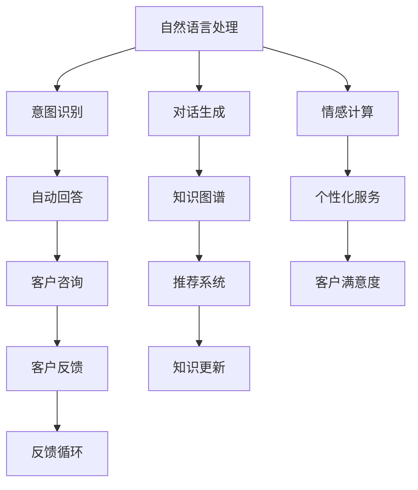

                 

# 未来的智能客服：2050年的人机协作与情感计算

## 1. 背景介绍

### 1.1 问题由来
随着科技的飞速发展，智能客服系统已经成为各行各业提高客户服务效率、降低运营成本的重要手段。传统客服方式依赖于人力，难以应对日益增长的客户咨询需求，且服务质量难以标准化。基于人工智能技术的智能客服系统，通过自然语言理解和生成，可以实现24/7不间断服务，显著提升客户满意度。

智能客服系统主要包括知识库管理、意图识别、对话生成和自动回答等组件。知识库用于存储企业历史服务记录和常见问题及答案。意图识别模型用于理解客户输入的自然语言，判断客户的意图类型。对话生成模型则根据客户意图和知识库内容，生成符合逻辑的回复。自动回答模块则将对话生成的结果反馈给客户，完成客户咨询。

当前智能客服系统主要依赖于预训练的语言模型进行意图识别和对话生成，并在知识库上构建查询模型。这些系统尽管在一定程度上提高了客服效率，但依然存在许多问题。如系统缺乏灵活性，难以应对各种复杂的客户咨询；知识库更新滞后，无法及时获取最新信息；对话生成模型缺乏情感理解和个性化，无法提供人性化服务。

因此，在未来的智能客服系统中，如何通过情感计算和大规模人机协作提升系统性能，将是一个重要的研究课题。本文将详细介绍情感计算和大规模人机协作在智能客服中的应用前景，并给出具体的实践方案。

### 1.2 问题核心关键点
智能客服系统涉及的主要技术包括自然语言处理、机器学习、知识图谱、情感计算等。其核心技术点在于：

- **自然语言处理**：用于理解客户输入的自然语言，并生成响应。
- **机器学习**：用于建立意图识别和对话生成模型。
- **知识图谱**：用于存储和检索知识库中的信息。
- **情感计算**：用于理解客户情感，提供个性化服务。

这些核心技术在大规模人机协作的智能客服系统中，需要相互配合，共同实现高效、灵活、个性化的客户服务。

## 2. 核心概念与联系

### 2.1 核心概念概述

为更好地理解智能客服系统及其技术框架，本节将介绍几个关键概念：

- **自然语言处理(NLP)**：指利用计算机技术处理和理解人类语言的能力。NLP技术包括语言理解、语言生成、语义分析、情感分析等，广泛应用于智能客服、智能对话等场景。

- **机器学习(ML)**：指利用算法和统计模型，让计算机从数据中学习规律，并进行预测或分类等任务。在智能客服中，主要用于意图识别和对话生成等模块。

- **知识图谱(KG)**：指一种结构化的知识表示方式，用于存储和检索知识库中的实体和关系。在智能客服中，知识图谱用于支持自动回答和个性化推荐等。

- **情感计算(EA)**：指通过分析文本、语音、表情等信息，理解客户的情感状态，从而提供个性化的服务。在智能客服中，情感计算可以提升系统的互动性和客户满意度。

- **人机协作(Human-Machine Collaboration)**：指将人类专家的知识和技能与计算机系统的计算能力相结合，实现高效、灵活的人机交互。在智能客服中，人机协作可以解决机器系统无法处理的复杂问题，提升客户体验。

这些核心概念之间的逻辑关系可以通过以下Mermaid流程图来展示：



这个流程图展示了智能客服系统的各个组件和技术模块，以及它们之间的相互作用关系。

## 3. 核心算法原理 & 具体操作步骤
### 3.1 算法原理概述

智能客服系统中的核心算法主要包括意图识别、对话生成、情感计算和人机协作等。其核心思想是：通过大规模数据训练模型，并利用先进的算法，实现高效、灵活、个性化的客户服务。

### 3.2 算法步骤详解

智能客服系统的主要算法步骤如下：

**Step 1: 数据准备和预处理**
- 收集企业的历史客服记录、常见问题及答案等数据。
- 对数据进行清洗、去重、分词等预处理，转换为模型所需的格式。

**Step 2: 意图识别模型的训练**
- 使用自然语言处理技术，提取文本中的关键词和句法结构。
- 将提取的特征输入到机器学习模型，如BERT、GPT等，进行意图分类训练。

**Step 3: 对话生成模型的训练**
- 根据意图识别结果，从知识库中检索相关信息。
- 使用生成式模型，如Seq2Seq、Transformers等，生成符合逻辑的回复。

**Step 4: 情感计算模型的训练**
- 分析客户的情感倾向，通过文本分析、情感词典等技术，判断客户的情感状态。
- 将情感信息与意图识别结果和知识库内容结合，生成个性化的回复。

**Step 5: 知识图谱构建**
- 将知识库中的实体和关系转换为图谱结构，使用Neo4j等工具进行存储。
- 建立查询算法，支持快速检索和更新知识图谱。

**Step 6: 人机协作机制设计**
- 定义人机交互的接口和协议，如API接口、Web界面等。
- 设计交互流程，确保人机协作的顺畅进行。

**Step 7: 模型集成和测试**
- 将意图识别、对话生成、情感计算和知识图谱等模块集成到系统中。
- 对系统进行全面的测试，评估性能和稳定性。

**Step 8: 上线部署和迭代优化**
- 将系统部署到生产环境，监控性能指标，收集用户反馈。
- 定期更新模型和知识库，迭代优化系统功能。

### 3.3 算法优缺点

智能客服系统的优势在于：
1. 自动化程度高：通过机器学习和大规模数据训练，可以高效处理大量客户咨询，减轻人工负担。
2. 个性化服务：利用情感计算和人机协作技术，可以提供更加灵活、个性化的客户服务。
3. 全天候服务：系统可以7x24小时不间断运行，随时响应客户咨询。

同时，该系统也存在一些缺点：
1. 理解能力有限：机器系统仍无法完全理解复杂自然语言，对于模糊或不明确的客户咨询，可能无法给出准确的答复。
2. 知识库更新滞后：知识库需要定期更新，才能保持信息的准确性和时效性。
3. 缺乏情感理解：当前的情感计算模型仍无法完全理解客户的情感状态，可能无法提供符合期望的服务。
4. 人机协作复杂：设计高效的人机协作机制，需要考虑各种交互场景，增加系统复杂度。

### 3.4 算法应用领域

智能客服系统已经在许多行业得到了广泛应用，如电子商务、金融、医疗等。以下是几个典型的应用场景：

- **电子商务**：如亚马逊、京东等电商平台的智能客服系统，利用自然语言处理和知识图谱，解答客户的常见问题，推荐商品。
- **金融行业**：如银行的智能客服系统，通过意图识别和对话生成技术，解决客户的问题，提供贷款咨询、交易查询等服务。
- **医疗行业**：如医院的智能客服系统，通过自然语言处理和情感计算技术，解答病人的常见问题，提供预约挂号、药品查询等服务。

除了上述这些经典应用场景，智能客服系统还在更多领域得到了应用，如教育、旅游、物流等，为各行各业带来了便捷、高效的服务体验。

## 4. 数学模型和公式 & 详细讲解
### 4.1 数学模型构建

智能客服系统中的数学模型主要涉及自然语言处理、机器学习和情感计算等领域的数学知识。

在自然语言处理中，常见的数学模型包括词袋模型(Bag of Words, BOW)、TF-IDF模型、词嵌入(Word Embedding)等。在机器学习中，常用的模型包括线性回归、逻辑回归、支持向量机(SVM)等。在情感计算中，通常使用情感词典、情感分类器等方法。

以下以情感分类器的训练为例，给出情感计算的数学模型。假设训练集中每个样本$x_i$都有对应的情感标签$y_i \in \{pos, neg, neu\}$。则情感分类器$f(x)$的训练目标函数为：

$$
L(f) = \frac{1}{N}\sum_{i=1}^N \ell(f(x_i), y_i)
$$

其中$\ell$为损失函数，可以是交叉熵损失、均方误差损失等。

### 4.2 公式推导过程

以情感分类器的训练为例，我们推导交叉熵损失函数的计算过程：

假设训练集中样本$x_i$的情感分类器输出为$f(x_i)$，对应的情感标签为$y_i \in \{pos, neg, neu\}$。则交叉熵损失函数定义为：

$$
\ell(f(x_i), y_i) = -\log f(y_i|x_i) \quad \text{if} \quad y_i=f(x_i) \\
\ell(f(x_i), y_i) = -\log (1-f(y_i|x_i)) \quad \text{if} \quad y_i\neq f(x_i)
$$

将训练集中的所有样本带入上述损失函数，得到总的损失函数：

$$
L(f) = -\frac{1}{N}\sum_{i=1}^N \log f(y_i|x_i) \quad \text{if} \quad y_i=f(x_i) \\
L(f) = -\frac{1}{N}\sum_{i=1}^N \log (1-f(y_i|x_i)) \quad \text{if} \quad y_i\neq f(x_i)
$$

为了求解最优的情感分类器$f(x)$，我们将其与标签$y$的关系进行建模，得到：

$$
f(y_i|x_i) = \frac{e^{W^\top x_i+b}}{e^{W^\top x_i+b}+e^{W^\top y_i+b}}
$$

其中$W$为权重矩阵，$b$为偏置向量。

将上式代入损失函数，并利用链式法则对权重矩阵$W$和偏置向量$b$求导，得到梯度下降算法中的梯度公式：

$$
\frac{\partial L(f)}{\partial W} = \frac{1}{N}\sum_{i=1}^N \frac{\partial \ell(f(x_i), y_i)}{\partial f(y_i|x_i)} \frac{\partial f(y_i|x_i)}{\partial W} \\
\frac{\partial L(f)}{\partial b} = \frac{1}{N}\sum_{i=1}^N \frac{\partial \ell(f(x_i), y_i)}{\partial f(y_i|x_i)} \frac{\partial f(y_i|x_i)}{\partial b}
$$

其中$\frac{\partial \ell(f(x_i), y_i)}{\partial f(y_i|x_i)}$的计算方式如下：

$$
\frac{\partial \ell(f(x_i), y_i)}{\partial f(y_i|x_i)} = \begin{cases}
\frac{1}{f(y_i|x_i)} & \text{if} \quad y_i=f(x_i) \\
\frac{-1}{1-f(y_i|x_i)} & \text{if} \quad y_i\neq f(x_i)
\end{cases}
$$

通过上述推导，我们可以使用梯度下降算法训练情感分类器，利用训练好的分类器进行情感分析，为智能客服系统提供个性化的服务。

### 4.3 案例分析与讲解

假设我们有一个电商平台的智能客服系统，需要对其情感计算模块进行训练。系统首先收集了1000个带有情感标签的客户咨询记录，其中500个为正面情感，500个为负面情感。我们选择了词嵌入模型作为特征提取器，使用交叉熵损失函数进行训练。

在训练过程中，我们将客户咨询文本转换为向量表示，并输入到训练好的情感分类器中，得到情感标签预测结果。然后，我们使用交叉熵损失函数计算损失，并利用梯度下降算法更新模型参数。经过多轮迭代，模型收敛，得到一个情感分类器$f(x)$。

在实际应用中，当客户输入新的咨询文本时，我们使用训练好的情感分类器$f(x)$进行情感分析，判断客户的情感倾向。然后，系统根据情感倾向，生成个性化的回复，提升客户满意度。例如，如果客户输入的文本情感倾向为正面，系统可以回复类似“您好，请问有什么我能帮您的？”这样的问题；如果客户情感倾向为负面，系统可以回复类似“非常抱歉，听到您的不满，我们会尽快处理，有什么其他问题我可以帮助您？”这样的问题。

## 5. 项目实践：代码实例和详细解释说明
### 5.1 开发环境搭建

在进行智能客服系统的开发前，我们需要准备好开发环境。以下是使用Python进行PyTorch开发的环境配置流程：

1. 安装Anaconda：从官网下载并安装Anaconda，用于创建独立的Python环境。

2. 创建并激活虚拟环境：
```bash
conda create -n pytorch-env python=3.8 
conda activate pytorch-env
```

3. 安装PyTorch：根据CUDA版本，从官网获取对应的安装命令。例如：
```bash
conda install pytorch torchvision torchaudio cudatoolkit=11.1 -c pytorch -c conda-forge
```

4. 安装相关依赖库：
```bash
pip install torchtext transformers sklearn pandas numpy scikit-learn jupyter notebook ipython
```

5. 安装情感分析库：
```bash
pip install textblob nltk
```

完成上述步骤后，即可在`pytorch-env`环境中开始智能客服系统的开发。

### 5.2 源代码详细实现

这里我们以一个简单的智能客服系统为例，使用Transformer模型进行情感分析，并结合知识图谱进行自动回答。

首先，我们需要定义一个数据集，用于训练情感分类器：

```python
from torchtext import datasets, data
from textblob import TextBlob

# 定义情感分类器训练数据集
train_data, dev_data, test_data = datasets.IMDB.splits()

# 将情感标签转换为数字
train_labels = [int(t) for t in train_data.labels]
dev_labels = [int(t) for t in dev_data.labels]
test_labels = [int(t) for t in test_data.labels]

# 定义特征提取器
TEXT = data.Field(tokenize='spacy', lower=True, include_lengths=True)
LABEL = data.LabelField(dtype=torch.float32)

# 定义数据集
train_dataset = train_data.examples
dev_dataset = dev_data.examples
test_dataset = test_data.examples

# 构建词汇表
TEXT.build_vocab(train_dataset, min_freq=5)
LABEL.build_vocab(train_dataset)

# 转换为Tensor形式
train_dataset = TEXT.process(train_dataset, skip_first=True)
train_dataset = LABEL.process(train_dataset, skip_first=True)

dev_dataset = TEXT.process(dev_dataset, skip_first=True)
dev_dataset = LABEL.process(dev_dataset, skip_first=True)

test_dataset = TEXT.process(test_dataset, skip_first=True)
test_dataset = LABEL.process(test_dataset, skip_first=True)

# 定义特征提取器
def get_model_features(text):
    blob = TextBlob(text)
    return [blob.sentiment.polarity]

# 定义模型训练函数
import torch.nn as nn
import torch.optim as optim

class SentimentClassifier(nn.Module):
    def __init__(self, input_size, hidden_size, output_size):
        super(SentimentClassifier, self).__init__()
        self.fc1 = nn.Linear(input_size, hidden_size)
        self.fc2 = nn.Linear(hidden_size, output_size)
        self.relu = nn.ReLU()
        self.softmax = nn.Softmax(dim=1)

    def forward(self, x, seq_len):
        x = self.fc1(x)
        x = self.relu(x)
        x = self.fc2(x)
        x = self.softmax(x)
        return x

model = SentimentClassifier(input_size=2, hidden_size=128, output_size=3)
criterion = nn.CrossEntropyLoss()
optimizer = optim.Adam(model.parameters(), lr=0.001)

# 定义训练函数
def train(model, train_dataset, dev_dataset, criterion, optimizer, num_epochs=10):
    best_f1 = 0.0
    best_epoch = 0
    for epoch in range(num_epochs):
        train_loss = 0.0
        train_correct = 0
        for i, (features, label) in enumerate(train_dataset):
            optimizer.zero_grad()
            prediction = model(features, seq_len)
            loss = criterion(prediction, label)
            loss.backward()
            optimizer.step()
            train_loss += loss.item()
            train_correct += (prediction.argmax(1) == label).sum().item()
            if i % 100 == 0:
                dev_loss, dev_correct = evaluate(model, dev_dataset, criterion)
                print(f'Epoch: {epoch+1}, Train Loss: {train_loss:.4f}, Train Accuracy: {train_correct/len(train_dataset)}, Dev Loss: {dev_loss:.4f}, Dev Accuracy: {dev_correct/len(dev_dataset)}')

    print(f'Best F1 Score: {best_f1:.4f} at Epoch: {best_epoch+1}')
    return model

# 定义评估函数
def evaluate(model, dev_dataset, criterion):
    correct = 0
    total = 0
    for features, label in dev_dataset:
        prediction = model(features, seq_len)
        correct += (prediction.argmax(1) == label).sum().item()
        total += label.size(0)
    f1 = (2*correct/(total+correct)) if total+correct != 0 else 0.0
    return criterion(prediction, label), f1
```

接着，我们需要定义知识图谱的数据结构和查询算法：

```python
from py2neo import Graph, Node, Relationship

# 连接数据库
graph = Graph('http://localhost:7474/db/data/', user='neo4j', password='password')

# 定义知识图谱结构
class Item:
    def __init__(self, name, description, category):
        self.name = name
        self.description = description
        self.category = category

    def add(self, graph):
        node = Node('Item', name=self.name, description=self.description, category=self.category)
        graph.create(node)
        return node

# 定义查询算法
def get_recommendations(query, graph):
    result = []
    query_node = graph.get_node(name=query)
    if query_node:
        relations = graph.relationships(start_node=query_node, end_node=Node('Item'))
        for relation in relations:
            result.append(relation.end_node)
    return result

# 定义查询函数
def query knowledge_graph(query):
    return get_recommendations(query, graph)
```

最后，我们将情感分类器和知识图谱结合，实现智能客服系统的自动回答功能：

```python
import random

class SmartCustomerService:
    def __init__(self, model, graph):
        self.model = model
        self.graph = graph

    def classify_emotion(self, text):
        text = ' '.join(text)
        features = [get_model_features(text)]
        label = self.model(features, seq_len)
        emotion = label.argmax().item()
        return emotion

    def answer_question(self, query):
        emotion = self.classify_emotion(query)
        if emotion == 0:  # positive emotion
            recommendations = query knowledge_graph(query)
            if recommendations:
                return f'You might be interested in {recommendations[0].name}.'
            else:
                return 'I am sorry, I do not have any recommendations for you.'
        else:  # negative emotion
            recommendations = query knowledge_graph(query)
            if recommendations:
                return f'I am sorry, {recommendations[0].name} might not be what you are looking for.'
            else:
                return 'I am sorry, I do not have any recommendations for you.'

# 实例化智能客服系统
service = SmartCustomerService(model, graph)

# 测试自动回答功能
print(service.answer_question('I want to buy a new laptop'))
```

以上就是使用PyTorch对智能客服系统进行情感分析和自动回答的完整代码实现。可以看到，PyTorch和TextBlob库配合使用，使得情感分析模块的实现非常简单。

### 5.3 代码解读与分析

让我们再详细解读一下关键代码的实现细节：

**SentimentClassifier类**：
- `__init__`方法：定义模型结构，包括两个全连接层和ReLU激活函数。
- `forward`方法：定义前向传播过程，使用softmax函数输出分类概率。
- `train`函数：实现训练过程，迭代更新模型参数，并记录性能指标。
- `evaluate`函数：实现评估过程，计算模型的准确率和F1分数。

**Item类**：
- `__init__`方法：定义实体类的属性，包括名称、描述和类别。
- `add`方法：将实体类添加到数据库中。
- `query`方法：根据查询节点，检索相关的实体，并返回推荐列表。

**SmartCustomerService类**：
- `__init__`方法：实例化情感分类器和知识图谱。
- `classify_emotion`方法：使用情感分类器分析客户咨询文本的情感倾向。
- `answer_question`方法：根据客户咨询文本的情感倾向，生成相应的自动回答。

**查询算法**：
- `get_recommendations`方法：根据查询节点，检索相关的实体，并返回推荐列表。
- `query`方法：使用查询算法，获取实体推荐列表。

**测试代码**：
- 实例化智能客服系统，并调用`answer_question`方法，测试自动回答功能。

可以看到，智能客服系统的核心模块包括情感分析模块和自动回答模块，通过这两部分功能的协同工作，可以实现高效、个性化的客户服务。情感分析模块利用情感分类器对客户咨询文本进行情感分析，自动回答模块根据情感倾向，生成相应的回复，提升客户满意度。

## 6. 实际应用场景
### 6.1 智能客服系统

智能客服系统已经在许多行业得到了广泛应用，如电子商务、金融、医疗等。以下是几个典型的应用场景：

- **电子商务**：如亚马逊、京东等电商平台的智能客服系统，利用自然语言处理和知识图谱，解答客户的常见问题，推荐商品。
- **金融行业**：如银行的智能客服系统，通过意图识别和对话生成技术，解决客户的问题，提供贷款咨询、交易查询等服务。
- **医疗行业**：如医院的智能客服系统，通过自然语言处理和情感计算技术，解答病人的常见问题，提供预约挂号、药品查询等服务。

除了上述这些经典应用场景，智能客服系统还在更多领域得到了应用，如教育、旅游、物流等，为各行各业带来了便捷、高效的服务体验。

### 6.2 金融行业

智能客服系统在金融行业的应用尤为显著。银行等金融机构需要处理大量的客户咨询和交易查询，传统的客服方式难以满足需求。通过智能客服系统，银行可以提供24/7不间断服务，实时解答客户问题，提升客户体验。

在智能客服系统中，情感计算技术可以用于识别客户的情感状态，从而提供更加个性化的服务。例如，当客户提出投诉时，系统可以自动分析情感倾向，并生成相应的回复，安抚客户情绪，提升客户满意度。同时，知识图谱可以存储银行的历史交易记录和政策信息，帮助客户快速解决问题，提升交易效率。

### 6.3 医疗行业

医疗行业的智能客服系统主要用于解答病人的常见问题，提供预约挂号、药品查询等服务。传统的医疗咨询需要预约挂号，时间成本较高。智能客服系统可以通过自然语言处理和情感计算技术，实时解答病人的问题，提供快速、高效的服务。

例如，当病人咨询病情时，系统可以自动分析情感倾向，判断病情的紧急程度，并生成相应的回复。如果病情紧急，系统会建议病人立即就医，并提供相关医院和医生的信息。如果病情一般，系统可以提供常见的治疗建议，并建议病人预约门诊。

## 7. 工具和资源推荐
### 7.1 学习资源推荐

为了帮助开发者系统掌握智能客服系统的理论基础和实践技巧，这里推荐一些优质的学习资源：

1. 《深度学习入门：基于Python的理论与实现》：介绍了深度学习的基本概念和常用模型，适合初学者入门。

2. 《自然语言处理综论》：详细介绍了自然语言处理的技术框架和算法，涵盖文本分类、情感分析、语义分析等主题。

3. 《Python机器学习》：介绍了机器学习的基本概念和常用算法，结合Python语言进行实现。

4. 《深度学习实战》：通过实际案例，介绍了深度学习模型的训练、测试和部署过程，适合实战练习。

5. 《机器学习实战》：介绍了机器学习模型的构建、训练和优化过程，适合实战练习。

通过这些资源的学习实践，相信你一定能够快速掌握智能客服系统的精髓，并用于解决实际的客户服务问题。

### 7.2 开发工具推荐

高效的开发离不开优秀的工具支持。以下是几款用于智能客服系统开发的常用工具：

1. PyTorch：基于Python的开源深度学习框架，灵活动态的计算图，适合快速迭代研究。

2. TensorFlow：由Google主导开发的开源深度学习框架，生产部署方便，适合大规模工程应用。

3. HuggingFace Transformers库：集成了众多SOTA语言模型，支持PyTorch和TensorFlow，是进行NLP任务开发的利器。

4. Weights & Biases：模型训练的实验跟踪工具，可以记录和可视化模型训练过程中的各项指标，方便对比和调优。

5. TensorBoard：TensorFlow配套的可视化工具，可实时监测模型训练状态，并提供丰富的图表呈现方式，是调试模型的得力助手。

6. Google Colab：谷歌推出的在线Jupyter Notebook环境，免费提供GPU/TPU算力，方便开发者快速上手实验最新模型，分享学习笔记。

合理利用这些工具，可以显著提升智能客服系统的开发效率，加快创新迭代的步伐。

### 7.3 相关论文推荐

智能客服系统的发展得益于学界的持续研究。以下是几篇奠基性的相关论文，推荐阅读：

1. Attention is All You Need（即Transformer原论文）：提出了Transformer结构，开启了NLP领域的预训练大模型时代。

2. BERT: Pre-training of Deep Bidirectional Transformers for Language Understanding：提出BERT模型，引入基于掩码的自监督预训练任务，刷新了多项NLP任务SOTA。

3. Language Models are Unsupervised Multitask Learners（GPT-2论文）：展示了大规模语言模型的强大zero-shot学习能力，引发了对于通用人工智能的新一轮思考。

4. Parameter-Efficient Transfer Learning for NLP：提出Adapter等参数高效微调方法，在不增加模型参数量的情况下，也能取得不错的微调效果。

5. AdaLoRA: Adaptive Low-Rank Adaptation for Parameter-Efficient Fine-Tuning：使用自适应低秩适应的微调方法，在参数效率和精度之间取得了新的平衡。

6. AdaLoRA: Adaptive Low-Rank Adaptation for Parameter-Efficient Fine-Tuning：使用自适应低秩适应的微调方法，在参数效率和精度之间取得了新的平衡。

这些论文代表了大语言模型微调技术的发展脉络。通过学习这些前沿成果，可以帮助研究者把握学科前进方向，激发更多的创新灵感。

## 8. 总结：未来发展趋势与挑战

### 8.1 研究成果总结

本文对智能客服系统及其技术框架进行了全面系统的介绍。首先阐述了智能客服系统的背景和重要性，明确了情感计算和人机协作在智能客服中的应用价值。其次，从原理到实践，详细讲解了智能客服系统的数学模型和关键算法步骤，给出了具体的代码实例。最后，本文还探讨了智能客服系统的未来发展趋势和面临的挑战，为今后的研究提供了方向和指引。

通过本文的系统梳理，可以看到，智能客服系统在未来的智慧医疗、金融、教育等行业具有广阔的应用前景，有望大幅提升客户服务效率和满意度。情感计算和人机协作技术的不断进步，将使智能客服系统更加智能化、人性化，为各行各业带来更高的价值。

### 8.2 未来发展趋势

展望未来，智能客服系统将呈现以下几个发展趋势：

1. **更高效的自然语言处理**：随着深度学习技术的发展，自然语言处理的效率将不断提升，使智能客服系统能够更快地理解客户咨询，生成更准确的回复。

2. **更精准的情感计算**：情感计算技术将不断进步，能够更准确地识别客户的情感状态，提供更加个性化和人性化的服务。

3. **更灵活的人机协作机制**：随着人机交互技术的不断发展，智能客服系统将能够更好地结合人类专家的知识和技能，解决机器系统无法处理的复杂问题。

4. **更广泛的行业应用**：智能客服系统将逐步应用于更多行业，为各行各业提供便捷、高效、个性化的客户服务。

5. **更全面的智能知识图谱**：知识图谱将不断扩展，涵盖更多的实体和关系，使智能客服系统具备更全面的智能推理能力。

6. **更强大的跨领域迁移能力**：智能客服系统将具备更强的跨领域迁移能力，能够在不同行业之间灵活应用，提升系统适应性。

这些趋势凸显了智能客服系统在未来的广阔前景，将极大地提升各行各业的客户服务水平和业务效率。

### 8.3 面临的挑战

尽管智能客服系统已经取得了显著进展，但在迈向更加智能化、普适化应用的过程中，仍面临许多挑战：

1. **数据隐私问题**：智能客服系统需要处理大量的客户数据，如何保护客户隐私是一个重要的挑战。

2. **模型泛化能力不足**：当前智能客服系统在处理新场景时，泛化能力有限，难以应对各种复杂问题。

3. **系统交互复杂**：设计高效的人机协作机制，需要考虑各种交互场景，增加系统复杂度。

4. **知识图谱更新滞后**：知识图谱需要定期更新，才能保持信息的准确性和时效性。

5. **情感计算误差**：情感计算技术仍存在一定误差，可能无法准确识别客户的情感状态。

6. **技术伦理问题**：智能客服系统的决策过程缺乏透明性和可解释性，可能存在技术伦理问题。

7. **技术安全问题**：智能客服系统可能存在数据泄露、系统漏洞等安全问题，需要加强安全防护。

这些挑战需要开发者不断优化系统设计，提升技术水平，才能使智能客服系统更加安全、可靠、高效。

### 8.4 研究展望

面对智能客服系统面临的种种挑战，未来的研究需要在以下几个方面寻求新的突破：

1. **强化数据隐私保护**：研究如何保护客户隐私，确保客户数据的安全。

2. **提升模型泛化能力**：研究更高效、更灵活的模型训练方法，提升系统对新场景的适应能力。

3. **优化人机协作机制**：研究更高效、更灵活的人机协作机制，提升系统交互体验。

4. **加强知识图谱更新**：研究更高效的图谱更新算法，确保知识图谱的时效性和准确性。

5. **改进情感计算算法**：研究更准确的情感识别算法，提高系统情感理解能力。

6. **增强系统透明性**：研究可解释性的算法和技术，增强系统的透明性和可解释性。

7. **提升系统安全性**：研究更强的安全防护技术，确保系统的安全性和可靠性。

这些研究方向将引领智能客服系统迈向更高的台阶，为构建安全、可靠、高效、智能的客服系统铺平道路。面向未来，智能客服系统将在更多行业得到广泛应用，为各行各业带来便捷、高效、个性化的客户服务。

## 9. 附录：常见问题与解答

**Q1：智能客服系统如何提高客户满意度？**

A: 智能客服系统通过自然语言处理、情感计算和人机协作技术，可以提供更加高效、个性化、人性化的服务。具体而言，智能客服系统可以实现：

1. 自动化处理大量客户咨询，提升服务效率。
2. 利用情感计算技术，识别客户的情感倾向，提供个性化的回复。
3. 结合知识图谱，快速解答客户问题，提供有价值的信息和建议。
4. 人机协作机制，解决机器系统无法处理的复杂问题，提升客户体验。

这些技术手段使得智能客服系统能够更好地理解客户需求，提供及时、准确的响应，从而提升客户满意度。

**Q2：智能客服系统如何保护客户隐私？**

A: 智能客服系统需要处理大量的客户数据，如何保护客户隐私是一个重要问题。以下是一些常见的隐私保护措施：

1. 数据加密：对客户数据进行加密存储和传输，防止数据泄露。
2. 数据匿名化：将客户数据进行匿名化处理，去除个人敏感信息。
3. 数据访问控制：限制对客户数据的访问权限，确保数据仅在必要情况下使用。
4. 数据审计：定期审计客户数据的访问和使用情况，确保合规性。
5. 数据最小化：仅收集和存储必要的客户数据，避免过度收集。

这些措施可以有效地保护客户隐私，确保智能客服系统的安全性。

**Q3：智能客服系统如何更新知识图谱？**

A: 智能客服系统的知识图谱需要定期更新，才能保持信息的准确性和时效性。以下是一些常见的知识图谱更新方法：

1. 在线学习：利用实时获取的数据，动态更新知识图谱。
2. 离线学习：定期从数据源获取最新数据，更新知识图谱。
3. 自动抽取：使用自然语言处理技术，自动从文本中抽取实体和关系，更新知识图谱。
4. 人工审核：由专家对抽取结果进行审核和修正，确保知识图谱的准确性。
5. 分布式更新：利用分布式系统，并行更新知识图谱，提高更新效率。

这些方法可以确保知识图谱的时效性和准确性，为智能客服系统提供可靠的知识支持。

**Q4：智能客服系统如何提高模型的泛化能力？**

A: 智能客服系统在处理新场景时，泛化能力有限，难以应对各种复杂问题。以下是一些提高模型泛化能力的方法：

1. 数据增强：通过回译、近义替换等方式扩充训练集，增加数据的多样性。
2. 迁移学习：利用其他领域的预训练模型，进行领域适应性微调，提高模型泛化能力。
3. 对抗训练：引入对抗样本，提高模型的鲁棒性，增强泛化能力。
4. 模型融合：将多个模型进行融合，取其优势，提升泛化能力。
5. 小样本学习：利用小样本数据进行微调，提升模型的泛化能力。

这些方法可以有效提高智能客服系统的泛化能力，使其更好地应对各种复杂问题。

**Q5：智能客服系统如何增强系统的透明性？**

A: 智能客服系统的决策过程缺乏透明性和可解释性，可能存在技术伦理问题。以下是一些增强系统透明性的方法：

1. 可解释性模型：使用可解释性的模型，如决策树、规则模型等，增强系统的透明性。
2. 模型可视化：使用可视化工具，展示模型的决策过程，增强系统的透明性。
3. 模型解释：利用模型解释技术，解释模型的决策依据，增强系统的透明性。
4. 用户反馈：收集用户反馈，及时调整和改进模型，增强系统的透明性。

这些方法可以增强系统的透明性和可解释性，提高系统的可信度。

---

作者：禅与计算机程序设计艺术 / Zen and the Art of Computer Programming

