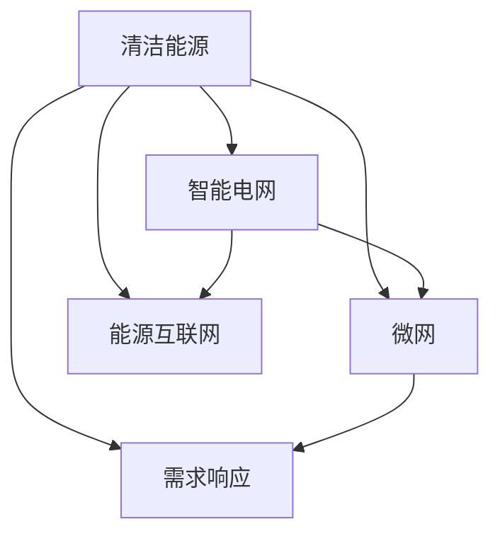

                 

# 未来的能源结构：2050年的清洁能源利用

## 1. 背景介绍

### 1.1 问题由来

随着工业化进程的加速和人类活动的增加，全球能源需求量迅速攀升，传统化石燃料的燃烧导致的环境污染和气候变化问题日益严重。由此引发的能源安全、环境保护等全球性问题日益突显。未来，如何构建一个清洁、可持续的能源结构，以应对日益增长的能源需求，同时减少对环境的影响，成为全球共同面临的重要课题。

### 1.2 问题核心关键点

未来能源结构的构建涉及众多关键点：

- **清洁能源技术**：如何高效、经济地利用太阳能、风能、水能等可再生能源。
- **储能技术**：如何有效存储间歇性的清洁能源，确保能源供应的稳定性。
- **智能电网**：如何构建高效、可靠、灵活的电网系统，实现能源的高效利用。
- **政策与法规**：如何制定和实施有效的能源政策，推动清洁能源的普及和应用。
- **公众参与**：如何激发公众对清洁能源的关注和参与，形成良好的社会氛围。

## 2. 核心概念与联系

### 2.1 核心概念概述

为更好地理解2050年清洁能源利用的框架，本节将介绍几个密切相关的核心概念：

- **清洁能源**：指不产生或产生很少污染物的能源，如太阳能、风能、水能等可再生能源。
- **智能电网**：利用现代信息技术和通信技术，实现电力供应的智能化管理。
- **微网**：由小型发电系统、储能设备和负荷组成的局部电网，具有自治性和高效性。
- **需求响应**：通过智能电价、智能家居等手段，优化用户用电行为，减少电网负荷压力。
- **能源互联网**：通过物联网、大数据等技术，实现能源的智能互联和共享。

这些核心概念之间的逻辑关系可以通过以下Mermaid流程图来展示：



这个流程图展示了我清洁能源的利用框架：

1. 清洁能源通过智能电网、微网等系统进行输送和管理。
2. 微网可以实现局部电网的自治和高效利用。
3. 需求响应通过智能电价等手段优化用户用电行为。
4. 能源互联网实现能源的智能互联和共享。

## 3. 核心算法原理 & 具体操作步骤
### 3.1 算法原理概述

未来能源结构的构建涉及到多个关键领域的技术革新，包括清洁能源技术、智能电网、微网等。核心算法原理包括以下几个方面：

- **可再生能源预测算法**：利用机器学习和深度学习技术，对太阳能、风能等可再生能源的输出进行预测，以提高电网调度的准确性和可靠性。
- **智能电网优化算法**：通过优化算法，实现电网负载的平衡和能源的高效分配。
- **微网自治算法**：设计自治算法，使微网能够独立运行，提高系统可靠性和灵活性。
- **需求响应策略**：通过需求响应算法，优化用户用电行为，降低电网负荷。

### 3.2 算法步骤详解

未来能源结构的构建主要分为以下几个步骤：

**Step 1: 数据收集与处理**

- 收集清洁能源的实时数据和历史数据，包括太阳能、风能、水能等可再生能源的输出数据。
- 收集智能电网的实时数据，包括电网负载、电压、电流等数据。
- 处理数据，去除异常值和噪音，确保数据的质量。

**Step 2: 可再生能源预测**

- 使用机器学习算法，对清洁能源的输出进行预测，确保能源供应的稳定性。
- 实时调整预测模型，提高预测精度。

**Step 3: 智能电网优化**

- 使用优化算法，实现电网的负载平衡和能源的高效分配。
- 动态调整电价，优化用户的用电行为。

**Step 4: 微网自治**

- 设计自治算法，使微网能够独立运行。
- 实现微网的本地能源生产和存储。

**Step 5: 需求响应**

- 通过智能电价、智能家居等手段，优化用户用电行为，减少电网负荷。
- 通过能源互联网，实现能源的智能互联和共享。

**Step 6: 持续优化**

- 实时监测能源系统的运行状态，持续优化算法和策略，提升能源系统的性能。

### 3.3 算法优缺点

未来能源结构的核心算法具有以下优点：

- 提高能源利用的效率，降低对环境的影响。
- 实现能源供应的稳定性，保障电力安全。
- 提高电网的智能化水平，减少能源浪费。

同时，这些算法也存在一定的局限性：

- 对数据的依赖性较强，数据质量问题可能导致预测和优化结果不准确。
- 算法复杂度高，需要较高的计算资源和算法能力。
- 需要政策支持和市场机制的配合，才能充分发挥其作用。

## 4. 数学模型和公式 & 详细讲解 & 举例说明

### 4.1 数学模型构建

未来能源结构的构建涉及到多个数学模型，包括清洁能源预测模型、智能电网优化模型等。这里以智能电网优化为例，构建数学模型：

假设智能电网系统由多个节点和边组成，节点表示发电站、储能设备、负荷等，边表示电力输送线路。设每个节点的能量为 $E_i$，输电线路的传输能力为 $C_{ij}$，电价为 $P$，优化目标是最大化能源系统的经济性，即最小化总成本，同时满足约束条件：

$$
\min \sum_{i,j} P \cdot C_{ij} \cdot E_i \cdot E_j
$$

约束条件包括：

- 能源平衡约束：$\sum_{i} E_i = \sum_{j} E_j$
- 传输能力约束：$C_{ij} \cdot E_i \cdot E_j \leq P$
- 电价约束：$0 \leq P \leq P_{max}$

### 4.2 公式推导过程

智能电网优化的目标函数和约束条件可以通过线性规划、非线性规划等方法进行求解。以线性规划为例，通过构建拉格朗日函数，可以转化为求解一个凸优化问题：

$$
\min \mathcal{L}(P) = \sum_{i,j} P \cdot C_{ij} \cdot E_i \cdot E_j + \sum_{i,j} \lambda_i \cdot (E_i - \sum_j E_j) + \sum_{i,j} \mu_{ij} \cdot (C_{ij} \cdot E_i \cdot E_j - P) + \sum_{i,j} \nu_i \cdot P
$$

其中 $\lambda_i$ 和 $\mu_{ij}$ 为拉格朗日乘子，$\nu_i$ 为电价约束的拉格朗日乘子。

通过求解上述优化问题，可以得到最优的电价和能量分配方案。

### 4.3 案例分析与讲解

以下以一个简单的智能电网优化为例，展示优化过程：

假设智能电网系统由三个节点组成，分别为发电站A、储能设备B和负荷C。发电站A的输出为 $E_A = 1$，储能设备B的储存量为 $E_B = 2$，负荷C的需求为 $E_C = 1.5$。输电线路的传输能力为 $C_{AB} = 1, C_{BC} = 2, C_{AC} = 3$，电价为 $P = 0.5$。

通过优化算法，可以得到最优的能量分配方案：

- 发电站A向储能设备B输送0.5的电力。
- 储能设备B向负荷C输送1的电力。
- 发电站A向负荷C输送0.5的电力。

最优电价为 $P = 0.4$。

## 5. 项目实践：代码实例和详细解释说明

### 5.1 开发环境搭建

在进行能源结构构建实践前，我们需要准备好开发环境。以下是使用Python进行PuLP开发的环境配置流程：

1. 安装Anaconda：从官网下载并安装Anaconda，用于创建独立的Python环境。

2. 创建并激活虚拟环境：
```bash
conda create -n grid-env python=3.8 
conda activate grid-env
```

3. 安装PuLP：
```bash
pip install pulp
```

4. 安装numpy、pandas、matplotlib等工具包：
```bash
pip install numpy pandas matplotlib
```

5. 安装Gurobi或Cplex等优化库：
```bash
conda install gurobipy
```

完成上述步骤后，即可在`grid-env`环境中开始能源结构构建实践。

### 5.2 源代码详细实现

这里我们以智能电网优化为例，给出使用PuLP进行智能电网优化的Python代码实现。

首先，定义智能电网模型的节点和边：

```python
from pulp import *

# 定义节点
A = LpVariable('A', 0, 1, LpInteger)
B = LpVariable('B', 0, 1, LpInteger)
C = LpVariable('C', 0, 1, LpInteger)

# 定义边
AB = LpVariable('AB', 0, 1, LpInteger)
BC = LpVariable('BC', 0, 1, LpInteger)
AC = LpVariable('AC', 0, 1, LpInteger)

# 定义电价
P = LpVariable('P', 0, 1, LpInteger)
```

然后，定义智能电网优化模型的目标函数和约束条件：

```python
# 目标函数
total_cost = P * (AB + BC + AC)

# 约束条件
# 能源平衡约束
energy_balance = A + B - C

# 传输能力约束
capacity_AB = P * AB
capacity_BC = P * BC
capacity_AC = P * AC

# 电价约束
price_constraint = P <= 0.5

# 构建优化模型
prob = LpProblem('GridOpt', LpMinimize)

# 添加目标函数和约束条件
prob += total_cost
prob += energy_balance
prob += capacity_AB
prob += capacity_BC
prob += capacity_AC
prob += price_constraint

# 求解优化问题
prob.solve()

# 输出结果
print(f"Optimal price: {value(P)}")
print(f"Optimal energy allocation: {value(A)}, {value(B)}, {value(C)}")
print(f"Optimal capacity allocation: {value(AB)}, {value(BC)}, {value(AC)}")
```

最后，启动智能电网优化流程并输出结果：

```python
print(f"Optimal price: {value(P)}")
print(f"Optimal energy allocation: {value(A)}, {value(B)}, {value(C)}")
print(f"Optimal capacity allocation: {value(AB)}, {value(BC)}, {value(AC)}")
```

以上就是使用PuLP进行智能电网优化的完整代码实现。可以看到，得益于PuLP的强大封装，我们可以用相对简洁的代码完成智能电网模型的构建和优化。

### 5.3 代码解读与分析

让我们再详细解读一下关键代码的实现细节：

**定义节点和边**：
- 使用LpVariable定义变量，表示节点的能量和边的传输能力。
- 通过LpInteger定义变量为整数，确保能量和传输能力只能取整数值。

**定义目标函数和约束条件**：
- 使用LpProblem定义优化模型，并指定目标函数类型为LpMinimize。
- 通过LpVariable定义目标函数和约束条件，并使用+=操作符将其添加到优化模型中。
- 约束条件包括能源平衡、传输能力、电价等，通过LpConstraint定义。

**求解优化问题**：
- 调用prob.solve()方法求解优化问题。
- 使用value函数获取优化结果。

可以看到，PuLP的接口非常简洁，开发者可以方便地定义和求解复杂的优化问题。然而，工业级的系统实现还需考虑更多因素，如变量的取值范围、优化算法的收敛速度等。但核心的智能电网优化过程基本与此类似。

## 6. 实际应用场景

### 6.1 智慧城市

智慧城市建设是未来能源结构的重要应用场景之一。通过智能电网和微网技术，可以实现能源的高效利用和管理。例如，在智能交通系统中，通过智能电价和需求响应技术，优化车辆用电行为，减少电网负荷。在智能建筑中，通过智能家居系统，实现能源的智能控制和管理。智慧城市通过构建智能能源系统，提高了能源利用效率，降低了碳排放，提升了城市生活的智能化水平。

### 6.2 工业企业

工业企业作为能源消耗的大户，也需要转型为绿色、环保的生产方式。通过智能电网和微网技术，可以实现能源的优化分配和管理。例如，在工厂生产线上，通过智能调度系统，优化生产过程中的能源消耗。在工厂能源管理中，通过微网技术，实现局部电网的自治和高效利用。工业企业通过构建智能能源系统，降低了能源消耗，提高了生产效率，减少了环境污染。

### 6.3 可再生能源

未来能源结构的一个重要方向是实现100%可再生能源的利用。通过智能电网和微网技术，可以实现可再生能源的高效利用和管理。例如，在太阳能发电系统中，通过智能调度系统，优化太阳能发电的输出和存储。在风能发电系统中，通过智能电网和微网技术，实现风能发电的稳定输出和储存。可再生能源通过智能能源系统，提高了能源利用效率，减少了对化石燃料的依赖。

## 7. 工具和资源推荐

### 7.1 学习资源推荐

为了帮助开发者系统掌握未来能源结构的理论基础和实践技巧，这里推荐一些优质的学习资源：

1. 《智能电网技术与应用》书籍：全面介绍了智能电网的原理、技术、应用等基础知识，适合初学者和专业人士阅读。

2. 《可再生能源技术》课程：由各大高校和研究机构提供的在线课程，涵盖太阳能、风能、水能等可再生能源的技术和应用。

3. 《能源互联网与智慧能源》课程：通过介绍能源互联网的原理、技术、应用等，帮助学习者理解未来的能源发展方向。

4. 《智能电网与微网技术》博客：由电力行业专家撰写，深入浅出地介绍了智能电网和微网技术的原理和应用。

5. 《能源系统优化与控制》书籍：通过介绍优化算法、控制理论等，帮助学习者掌握能源系统优化的数学模型和算法。

通过对这些资源的学习实践，相信你一定能够快速掌握未来能源结构的精髓，并用于解决实际的能源问题。

### 7.2 开发工具推荐

高效的开发离不开优秀的工具支持。以下是几款用于未来能源结构开发的常用工具：

1. PuLP：用于优化问题求解的开源库，支持线性规划、非线性规划等算法。

2. Gurobi或Cplex：商业优化求解器，具有高效、稳定、精确等特点。

3. MATLAB：集成了各种优化、仿真、数据分析等工具箱，适合复杂系统的建模和仿真。

4. TensorFlow或PyTorch：深度学习框架，支持神经网络模型构建和优化。

5. Visual Studio Code：轻量级、高效的代码编辑器，支持多种编程语言和调试工具。

6. Jupyter Notebook：交互式编程环境，支持代码执行、可视化输出等。

合理利用这些工具，可以显著提升未来能源结构的开发效率，加快创新迭代的步伐。

### 7.3 相关论文推荐

未来能源结构的发展源于学界的持续研究。以下是几篇奠基性的相关论文，推荐阅读：

1. "An Integrated Approach to Smart Grid Operation"：介绍了智能电网的运营策略和优化方法。

2. "Microgrids: Assessment, Advantages, Challenges, and Opportunities"：分析了微网的优缺点和应用场景。

3. "Energy Internet: A Paradigm Shift Towards a Sustainable Future"：探讨了能源互联网的原理和应用。

4. "Optimization Model for Energy Storage and Demand Response"：介绍了能源存储和需求响应的优化模型和算法。

5. "Energy Internet and Smart Grids: Challenges and Future Directions"：分析了智能电网和能源互联网面临的挑战和未来发展方向。

这些论文代表了大规模能源结构的发展脉络。通过学习这些前沿成果，可以帮助研究者把握学科前进方向，激发更多的创新灵感。

## 8. 总结：未来发展趋势与挑战

### 8.1 总结

本文对未来能源结构的构建进行了全面系统的介绍。首先阐述了未来能源结构的重要性，明确了智能电网、微网等核心概念之间的联系。其次，从原理到实践，详细讲解了智能电网优化的数学模型和计算方法，给出了智能电网优化的完整代码实现。同时，本文还探讨了智能电网、微网等技术在智慧城市、工业企业、可再生能源等领域的应用前景，展示了未来能源结构的技术潜力。最后，本文精选了智能电网、微网等技术的各类学习资源，力求为读者提供全方位的技术指引。

通过本文的系统梳理，可以看到，智能电网和微网技术已经成为未来能源结构的重要组成部分，将极大地提升能源利用的效率和稳定性。未来，伴随技术的发展和政策的推动，这些技术将得到更广泛的应用，为构建清洁、可持续的能源结构提供坚实的技术保障。

### 8.2 未来发展趋势

展望未来，未来能源结构的发展趋势包括以下几个方面：

1. **清洁能源的普及**：随着技术的进步和成本的降低，太阳能、风能等可再生能源将逐步替代化石燃料，成为主要的能源供应形式。

2. **智能电网的普及**：智能电网和微网技术将逐步普及，实现能源的高效管理和分配。

3. **能源互联网的发展**：能源互联网将实现能源的智能互联和共享，提升能源利用效率。

4. **需求响应的广泛应用**：智能电价和需求响应技术将广泛应用，优化用户用电行为，降低电网负荷。

5. **人工智能的应用**：人工智能技术将广泛应用于能源管理，提高能源系统的智能化水平。

6. **政策的支持**：政府将制定和实施更加有力的能源政策，推动清洁能源的普及和应用。

以上趋势凸显了未来能源结构的技术前景。这些方向的探索发展，必将进一步提升能源系统的性能和应用范围，为构建清洁、可持续的能源结构提供坚实的技术保障。

### 8.3 面临的挑战

尽管未来能源结构的发展前景广阔，但在迈向更加智能化、普适化应用的过程中，仍面临诸多挑战：

1. **技术和成本问题**：大规模智能电网和微网的建设需要大量的资金和技术支持，成本较高。

2. **电网稳定性问题**：可再生能源的不稳定性可能带来电网负荷的变化，需要优化算法和设备应对。

3. **数据安全问题**：智能电网和微网系统的运行依赖大量的数据传输和存储，数据安全问题不容忽视。

4. **政策和法规问题**：能源政策的制定和实施需要协调各方利益，复杂性较高。

5. **公众认知问题**：智能电网和微网技术的普及需要公众的认知和参与，面临一定的推广难度。

6. **环境适应性问题**：未来能源结构需要适应不同的地理和气候环境，技术适应性需要进一步提高。

正视这些挑战，积极应对并寻求突破，将是大规模能源结构技术走向成熟的必由之路。

### 8.4 研究展望

面对未来能源结构所面临的挑战，未来的研究需要在以下几个方面寻求新的突破：

1. **新技术的探索**：开发更加高效、经济、可靠的智能电网和微网技术，提高能源利用效率。

2. **数据驱动的优化**：利用大数据、机器学习等技术，实现能源系统的智能优化和管理。

3. **多源融合的策略**：探索多种能源形式的融合应用，实现能源系统的多样性和可靠性。

4. **政策支持的创新**：创新能源政策的制定和实施，推动清洁能源的普及和应用。

5. **公众参与的机制**：探索公众参与的机制和方式，提高智能电网和微网的普及率。

6. **环境适应性的研究**：研究不同地理和气候环境下的能源技术，提高技术的适应性。

这些研究方向的探索，必将引领未来能源结构技术的创新和发展，为构建清洁、可持续的能源结构提供坚实的技术保障。

## 9. 附录：常见问题与解答

**Q1：智能电网和微网有什么区别？**

A: 智能电网是利用现代信息技术和通信技术，实现电力供应的智能化管理，而微网是由小型发电系统、储能设备和负荷组成的局部电网，具有自治性和高效性。智能电网和微网都是未来能源结构的重要组成部分，通过合理设计和应用，可以实现能源的高效利用和管理。

**Q2：智能电网优化的目标是什么？**

A: 智能电网优化的目标是通过优化电价和能源分配，实现电网的稳定运行和能源的高效利用。具体而言，优化目标是最大化电网的经济性，同时满足能源平衡、传输能力和电价等约束条件。

**Q3：如何降低智能电网的成本？**

A: 降低智能电网的成本需要从多个方面入手，包括：

- 采用高效的优化算法，提高计算效率。
- 优化电网的布局和设计，减少能源损失。
- 采用可再生能源，降低能源供应成本。
- 采用智能家居系统，优化用户用电行为。

**Q4：未来能源结构的优缺点是什么？**

A: 未来能源结构的优点包括：

- 提高能源利用效率，降低环境污染。
- 实现能源供应的稳定性，保障电力安全。
- 提高电网的智能化水平，减少能源浪费。

未来能源结构的缺点包括：

- 对技术和数据的要求较高，建设和运营成本较高。
- 技术复杂度高，需要较高的技术水平和管理能力。
- 需要政策支持和市场机制的配合，才能充分发挥其作用。

正视这些缺点，积极应对并寻求突破，将是大规模能源结构技术走向成熟的必由之路。

