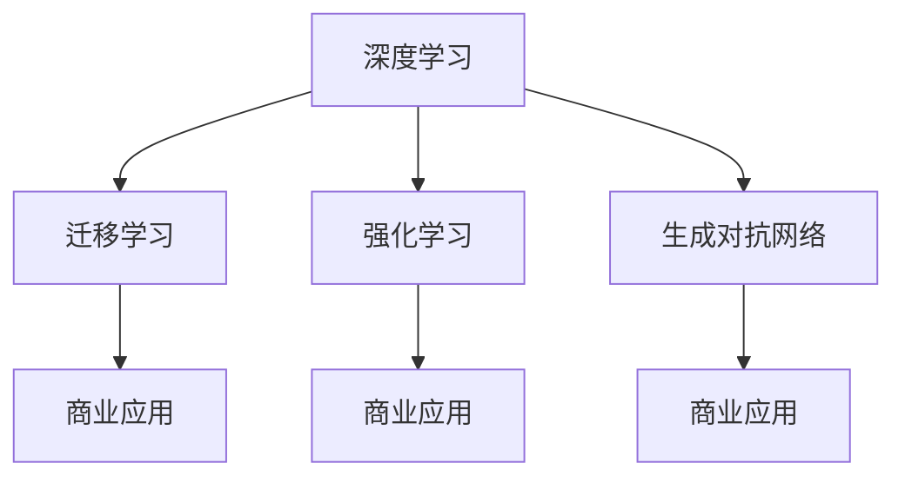

                 

# 李开复：AI 2.0 时代的商业价值

在AI 2.0的时代，人工智能技术正逐渐从研究阶段过渡到商业化应用的成熟阶段。这一转变不仅带来了新的商业机遇，也提出了新的挑战。本文将探讨AI 2.0时代商业价值的核心概念、算法原理、具体操作步骤，以及其在实际应用中的展望。

## 1. 背景介绍

### 1.1 问题由来

AI 2.0时代的商业价值研究，源于对AI技术日益增长的市场需求和应用潜力的深入认识。人工智能技术在提升效率、降低成本、创造新的商业模式等方面展现出巨大的商业潜力。随着AI技术的不断成熟，越来越多的企业和组织开始探索如何利用AI技术创造更大的商业价值。

### 1.2 问题核心关键点

AI 2.0时代商业价值的核心关键点主要包括：

- **数据的重要性**：数据是AI模型的基础，高质量的数据能够显著提升模型的性能。
- **算法的优化**：高效的算法能够减少计算资源消耗，提升模型训练和推理速度。
- **模型的应用场景**：不同领域的AI应用需求各异，选择合适的模型和算法对提升商业价值至关重要。
- **商业化策略**：如何将AI技术有效地商业化，实现商业价值最大化，是企业需要重点考虑的问题。

## 2. 核心概念与联系

### 2.1 核心概念概述

为了更好地理解AI 2.0时代的商业价值，需要深入理解以下几个核心概念：

- **AI 2.0**：人工智能的第二阶段，强调算法和模型的优化，以及数据的高效利用。
- **深度学习**：基于神经网络的机器学习技术，通过多层次的特征提取和转化，提升模型的性能。
- **迁移学习**：将在一个任务上训练好的模型迁移到另一个任务上，以减少重新训练的需求。
- **强化学习**：通过试错，模型能够在与环境的交互中学习最优策略，提升决策能力。
- **生成对抗网络（GANs）**：通过两个神经网络的对抗训练，生成逼真的数据或图像。

这些核心概念相互联系，共同构成了AI 2.0时代商业价值的基础。深度学习提供了强大的算法支持，迁移学习拓展了模型的应用范围，强化学习提升了模型的决策能力，GANs则开辟了新的数据生成技术。

### 2.2 核心概念原理和架构的 Mermaid 流程图



这个流程图展示了AI 2.0时代商业价值的核心概念及其相互关系。深度学习提供基础算法支持，迁移学习拓展应用范围，强化学习提升决策能力，GANs提供数据生成技术。这些技术共同作用，推动AI技术在商业领域的广泛应用。

## 3. 核心算法原理 & 具体操作步骤

### 3.1 算法原理概述

AI 2.0时代的商业价值实现，依赖于深度学习、迁移学习、强化学习等多种算法技术。以下是对这些核心算法原理的概述：

#### 3.1.1 深度学习

深度学习通过多层次的神经网络结构，自动提取数据中的特征，从而提升模型的性能。其主要原理包括：

- **前向传播**：将输入数据通过多个神经网络层进行特征提取。
- **反向传播**：通过计算误差梯度，反向调整神经网络参数，优化模型。
- **损失函数**：衡量模型输出与真实标签之间的差异，指导模型优化。

#### 3.1.2 迁移学习

迁移学习通过将在一个任务上训练好的模型迁移到另一个任务上，以减少重新训练的需求。其主要原理包括：

- **预训练模型**：在大量数据上进行预训练，学习通用的特征表示。
- **微调**：在特定任务上对预训练模型进行微调，提升模型在该任务上的性能。

#### 3.1.3 强化学习

强化学习通过与环境的交互，学习最优策略，提升模型的决策能力。其主要原理包括：

- **状态**：环境中的状态信息。
- **动作**：模型对环境的操作。
- **奖励**：模型对环境的反馈，指导模型学习最优策略。

#### 3.1.4 生成对抗网络（GANs）

GANs通过两个神经网络的对抗训练，生成逼真的数据或图像。其主要原理包括：

- **生成器**：生成逼真的数据或图像。
- **判别器**：区分生成数据与真实数据的模型。
- **对抗训练**：通过两者的对抗训练，提升生成器的生成能力。

### 3.2 算法步骤详解

#### 3.2.1 深度学习步骤详解

1. **数据预处理**：将原始数据转化为模型能够处理的格式。
2. **模型构建**：设计并实现深度学习模型，包括神经网络结构、损失函数等。
3. **模型训练**：使用训练数据对模型进行前向传播和反向传播，优化模型参数。
4. **模型评估**：使用测试数据对模型进行评估，衡量模型性能。

#### 3.2.2 迁移学习步骤详解

1. **预训练模型选择**：选择合适的预训练模型作为初始化参数。
2. **数据准备**：准备下游任务的标注数据集。
3. **微调参数设置**：选择合适的学习率、批大小等参数。
4. **模型微调**：对预训练模型进行微调，优化模型在特定任务上的性能。

#### 3.2.3 强化学习步骤详解

1. **环境设置**：定义环境状态和操作。
2. **模型构建**：设计并实现强化学习模型，包括策略网络和值网络。
3. **模型训练**：通过与环境的交互，训练模型学习最优策略。
4. **模型评估**：评估模型在环境中的表现，优化策略。

#### 3.2.4 GANs步骤详解

1. **模型构建**：设计并实现生成器和判别器模型。
2. **对抗训练**：通过生成器和判别器的对抗训练，提升生成器的生成能力。
3. **模型评估**：评估生成器的生成效果，优化模型参数。

### 3.3 算法优缺点

#### 3.3.1 深度学习

- **优点**：
  - **强大的特征提取能力**：能够自动提取数据的高级特征。
  - **广泛的应用场景**：适用于图像识别、语音识别、自然语言处理等多种任务。
- **缺点**：
  - **计算资源消耗大**：模型训练和推理需要大量的计算资源。
  - **过拟合风险**：模型容易在训练数据上过拟合。

#### 3.3.2 迁移学习

- **优点**：
  - **减少训练时间**：通过迁移学习，可以在小规模数据集上训练出高性能模型。
  - **泛化能力强**：模型能够在不同任务上表现出色。
- **缺点**：
  - **依赖高质量预训练模型**：预训练模型的质量对迁移学习的效果有重要影响。
  - **微调过程复杂**：需要选择合适的学习率、批大小等参数。

#### 3.3.3 强化学习

- **优点**：
  - **决策能力强**：能够通过与环境的交互，学习最优策略。
  - **适应性强**：能够应对动态变化的环境。
- **缺点**：
  - **训练时间较长**：需要大量时间与环境的交互。
  - **策略不稳定**：策略学习过程可能会受环境变化的影响。

#### 3.3.4 GANs

- **优点**：
  - **生成效果逼真**：能够生成高质量的数据或图像。
  - **应用广泛**：在图像生成、数据增强、游戏设计等领域有广泛应用。
- **缺点**：
  - **训练难度大**：需要平衡生成器和判别器之间的对抗关系。
  - **生成样本质量不稳定**：生成样本质量受模型参数和训练策略的影响。

### 3.4 算法应用领域

#### 3.4.1 深度学习

- **图像识别**：如人脸识别、图像分类等。
- **语音识别**：如语音转文本、说话人识别等。
- **自然语言处理**：如机器翻译、情感分析等。

#### 3.4.2 迁移学习

- **文本分类**：如情感分析、主题分类等。
- **命名实体识别**：如人名识别、地名识别等。
- **机器翻译**：如英中翻译、中英翻译等。

#### 3.4.3 强化学习

- **游戏设计**：如AlphaGo、Dota2等。
- **机器人控制**：如自主导航、运动控制等。
- **智能推荐**：如电商推荐、新闻推荐等。

#### 3.4.4 GANs

- **图像生成**：如GAN艺术作品、逼真图像生成等。
- **数据增强**：如图像修复、去噪等。
- **游戏设计**：如虚拟角色生成、环境生成等。

## 4. 数学模型和公式 & 详细讲解 & 举例说明

### 4.1 数学模型构建

AI 2.0时代的商业价值实现，依赖于多种数学模型。以下是几种常见的数学模型构建方法：

#### 4.1.1 深度学习数学模型

- **前向传播**：
  $$
  y=f(Wx+b)
  $$
  其中，$W$ 为权重矩阵，$b$ 为偏置向量，$f$ 为激活函数。

- **反向传播**：
  $$
  \frac{\partial \mathcal{L}}{\partial W}=\frac{\partial \mathcal{L}}{\partial y}\frac{\partial y}{\partial W}
  $$
  其中，$\mathcal{L}$ 为损失函数。

- **损失函数**：
  $$
  \mathcal{L}=\frac{1}{N}\sum_{i=1}^N||y_i-f(x_i)||^2
  $$
  其中，$x_i$ 为输入数据，$y_i$ 为真实标签，$N$ 为样本数量。

#### 4.1.2 迁移学习数学模型

- **微调损失函数**：
  $$
  \mathcal{L}=\frac{1}{N}\sum_{i=1}^N||y_i-f(x_i)||^2+\lambda\sum_{i=1}^N||\theta_i||^2
  $$
  其中，$\theta_i$ 为可微调的参数，$\lambda$ 为正则化系数。

#### 4.1.3 强化学习数学模型

- **策略网络**：
  $$
  \pi(a|s)=softmax(Q(s,a))
  $$
  其中，$a$ 为动作，$s$ 为状态，$Q(s,a)$ 为动作价值函数。

- **值网络**：
  $$
  V(s)=\sum_{a}\pi(a|s)Q(s,a)
  $$
  其中，$s$ 为状态，$Q(s,a)$ 为动作价值函数。

#### 4.1.4 GANs数学模型

- **生成器损失函数**：
  $$
  \mathcal{L}_G=\mathbb{E}_{s\sim p_s}[-\log D(G(s))]+\mathbb{E}_{z\sim p_z}[-\log (1-D(G(z)))]
  $$
  其中，$G$ 为生成器，$D$ 为判别器，$z$ 为噪声向量，$p_s$ 为真实数据分布，$p_z$ 为噪声分布。

- **判别器损失函数**：
  $$
  \mathcal{L}_D=\mathbb{E}_{s\sim p_s}[\log D(s)]+\mathbb{E}_{z\sim p_z}[\log (1-D(G(z)))]
  $$

### 4.2 公式推导过程

#### 4.2.1 深度学习公式推导

深度学习模型的训练过程包括以下步骤：

1. **前向传播**：
  $$
  y=f(W_1f(W_2f(W_3x+b_3)+b_2)+b_1)
  $$
  其中，$W$ 为权重矩阵，$b$ 为偏置向量，$f$ 为激活函数。

2. **反向传播**：
  $$
  \frac{\partial \mathcal{L}}{\partial W}=\frac{\partial \mathcal{L}}{\partial y}\frac{\partial y}{\partial W}
  $$

3. **损失函数**：
  $$
  \mathcal{L}=\frac{1}{N}\sum_{i=1}^N||y_i-f(x_i)||^2
  $$

#### 4.2.2 迁移学习公式推导

迁移学习的微调过程包括以下步骤：

1. **微调损失函数**：
  $$
  \mathcal{L}=\frac{1}{N}\sum_{i=1}^N||y_i-f(x_i)||^2+\lambda\sum_{i=1}^N||\theta_i||^2
  $$

#### 4.2.3 强化学习公式推导

强化学习模型的训练过程包括以下步骤：

1. **策略网络**：
  $$
  \pi(a|s)=softmax(Q(s,a))
  $$

2. **值网络**：
  $$
  V(s)=\sum_{a}\pi(a|s)Q(s,a)
  $$

#### 4.2.4 GANs公式推导

GANs模型的训练过程包括以下步骤：

1. **生成器损失函数**：
  $$
  \mathcal{L}_G=\mathbb{E}_{s\sim p_s}[-\log D(G(s))]+\mathbb{E}_{z\sim p_z}[-\log (1-D(G(z)))]
  $$

2. **判别器损失函数**：
  $$
  \mathcal{L}_D=\mathbb{E}_{s\sim p_s}[\log D(s)]+\mathbb{E}_{z\sim p_z}[\log (1-D(G(z)))]
  $$

### 4.3 案例分析与讲解

#### 4.3.1 深度学习案例分析

假设我们有一个简单的手写数字识别任务，使用的模型为LeNet。该模型包含卷积层和全连接层。我们使用MNIST数据集进行训练，数据集分为训练集和测试集，每个样本包含手写数字图片和真实标签。

1. **数据预处理**：将原始图片归一化到0-1之间，并转化为张量格式。

2. **模型构建**：设计LeNet模型，包含两个卷积层和三个全连接层。

3. **模型训练**：使用训练集对模型进行前向传播和反向传播，优化模型参数。

4. **模型评估**：使用测试集对模型进行评估，衡量模型性能。

#### 4.3.2 迁移学习案例分析

假设我们有一个英文文本分类任务，需要将文本分为正面和负面两类。我们使用预训练的BERT模型进行微调。

1. **预训练模型选择**：选择BERT作为初始化参数。

2. **数据准备**：准备标注数据集，包含正面和负面两类文本。

3. **微调参数设置**：选择合适的学习率、批大小等参数。

4. **模型微调**：对BERT模型进行微调，优化模型在文本分类任务上的性能。

#### 4.3.3 强化学习案例分析

假设我们有一个简单的游戏AI，目标是控制玩家角色在迷宫中找到出口。

1. **环境设置**：定义迷宫和玩家角色的状态和操作。

2. **模型构建**：设计并实现强化学习模型，包括策略网络和值网络。

3. **模型训练**：通过与迷宫环境的交互，训练模型学习最优策略。

4. **模型评估**：评估模型在迷宫环境中的表现，优化策略。

#### 4.3.4 GANs案例分析

假设我们需要生成逼真的自然风景图像，使用的模型为CycleGAN。

1. **模型构建**：设计并实现生成器和判别器模型。

2. **对抗训练**：通过生成器和判别器的对抗训练，提升生成器的生成能力。

3. **模型评估**：评估生成器的生成效果，优化模型参数。

## 5. 项目实践：代码实例和详细解释说明

### 5.1 开发环境搭建

在进行AI 2.0时代商业价值的应用实践前，需要先准备好开发环境。以下是使用Python进行TensorFlow开发的环境配置流程：

1. 安装Anaconda：从官网下载并安装Anaconda，用于创建独立的Python环境。

2. 创建并激活虚拟环境：
```bash
conda create -n tf-env python=3.8 
conda activate tf-env
```

3. 安装TensorFlow：根据CUDA版本，从官网获取对应的安装命令。例如：
```bash
conda install tensorflow==2.8
```

4. 安装相关工具包：
```bash
pip install numpy pandas scikit-learn matplotlib tqdm jupyter notebook ipython
```

完成上述步骤后，即可在`tf-env`环境中开始AI 2.0时代商业价值的实践。

### 5.2 源代码详细实现

这里我们以深度学习模型在图像分类任务中的应用为例，给出使用TensorFlow进行深度学习模型开发的代码实现。

首先，定义深度学习模型的输入和输出：

```python
import tensorflow as tf
from tensorflow.keras import layers, models

# 定义输入和输出
inputs = tf.keras.layers.Input(shape=(28, 28, 1))
outputs = tf.keras.layers.Conv2D(64, (3, 3), activation='relu')(inputs)
outputs = tf.keras.layers.MaxPooling2D((2, 2), strides=2)(outputs)
outputs = tf.keras.layers.Flatten()(outputs)
outputs = tf.keras.layers.Dense(128, activation='relu')(outputs)
outputs = tf.keras.layers.Dense(10, activation='softmax')(outputs)
```

然后，定义模型的训练和评估函数：

```python
# 定义模型
model = models.Model(inputs=inputs, outputs=outputs)

# 定义损失函数和优化器
loss_fn = tf.keras.losses.SparseCategoricalCrossentropy(from_logits=True)
optimizer = tf.keras.optimizers.Adam(learning_rate=0.001)

# 定义训练和评估函数
def train_step(input_data, label_data):
    with tf.GradientTape() as tape:
        logits = model(input_data)
        loss_value = loss_fn(label_data, logits)
    gradients = tape.gradient(loss_value, model.trainable_variables)
    optimizer.apply_gradients(zip(gradients, model.trainable_variables))
    return loss_value

def evaluate_step(input_data, label_data):
    logits = model(input_data)
    predictions = tf.nn.softmax(logits)
    accuracy = tf.reduce_mean(tf.cast(tf.equal(tf.argmax(predictions, axis=-1), label_data), tf.float32))
    return accuracy
```

最后，启动训练流程并在测试集上评估：

```python
# 定义训练数据和测试数据
train_data = tf.data.Dataset.from_tensor_slices((train_images, train_labels))
test_data = tf.data.Dataset.from_tensor_slices((test_images, test_labels))

# 定义数据预处理
train_data = train_data.shuffle(buffer_size=1024).batch(batch_size=32).prefetch(buffer_size=tf.data.experimental.AUTOTUNE)
test_data = test_data.batch(batch_size=32).prefetch(buffer_size=tf.data.experimental.AUTOTUNE)

# 定义训练和评估流程
epochs = 10
for epoch in range(epochs):
    for step, (input_data, label_data) in enumerate(train_data):
        loss = train_step(input_data, label_data)
        print(f"Epoch {epoch+1}, Step {step+1}, Loss: {loss:.4f}")
    test_accuracy = evaluate_step(test_images, test_labels)
    print(f"Epoch {epoch+1}, Test Accuracy: {test_accuracy:.4f}")
```

以上就是使用TensorFlow进行深度学习模型开发的完整代码实现。可以看到，TensorFlow提供了强大的API支持，开发者可以快速实现模型的定义、训练和评估。

### 5.3 代码解读与分析

让我们再详细解读一下关键代码的实现细节：

**深度学习模型定义**：
- `inputs`：定义模型的输入张量。
- `outputs`：定义模型的输出张量，包含多个卷积层、池化层和全连接层。
- `model`：将输入和输出连接起来，形成完整的深度学习模型。

**训练和评估函数**：
- `train_step`：定义模型的训练步骤，包含前向传播、损失计算和反向传播。
- `evaluate_step`：定义模型的评估步骤，计算预测结果和真实标签的准确率。

**训练流程**：
- `train_data`：定义训练数据集，包含图片和标签。
- `test_data`：定义测试数据集，只包含图片和标签。
- `train_data`和`test_data`的预处理：包括数据打乱、批次化、预取等操作，提高训练效率。
- `train`和`test`函数的循环：在每个epoch内，依次对训练集和测试集进行训练和评估，输出训练结果。

可以看到，TensorFlow提供了强大的API支持，使得深度学习模型的开发变得简洁高效。开发者可以将更多精力放在模型设计、数据预处理等高层逻辑上，而不必过多关注底层的实现细节。

当然，工业级的系统实现还需考虑更多因素，如模型的保存和部署、超参数的自动搜索、更灵活的任务适配层等。但核心的AI 2.0时代商业价值实现方法基本与此类似。

## 6. 实际应用场景

### 6.1 智能客服系统

AI 2.0时代的智能客服系统，基于深度学习、迁移学习等技术，能够自动理解客户咨询，并给出最优的解决方案。

1. **数据准备**：收集企业内部的历史客服对话记录，将问题和最佳答复构建成监督数据。
2. **模型微调**：使用预训练的BERT模型，对客服对话数据进行微调，学习客户意图和最佳答复之间的映射关系。
3. **系统部署**：将微调后的模型集成到智能客服系统中，实时响应客户咨询，提供高质量的自动客服服务。

### 6.2 金融舆情监测

AI 2.0时代的金融舆情监测系统，通过深度学习、强化学习等技术，实时监测市场舆论动向，辅助金融机构决策。

1. **数据准备**：收集金融领域相关的新闻、报道、评论等文本数据，并对其进行主题标注和情感标注。
2. **模型训练**：使用深度学习模型，对金融舆情数据进行训练，学习舆情变化趋势。
3. **系统部署**：将训练好的模型集成到金融舆情监测系统中，实时监测市场舆情，预测金融风险。

### 6.3 个性化推荐系统

AI 2.0时代的个性化推荐系统，通过深度学习、迁移学习等技术，挖掘用户行为背后的语义信息，提供个性化的推荐内容。

1. **数据准备**：收集用户浏览、点击、评论、分享等行为数据，提取和用户交互的物品标题、描述、标签等文本内容。
2. **模型微调**：使用预训练的BERT模型，对用户行为数据进行微调，学习用户兴趣点。
3. **系统部署**：将微调后的模型集成到个性化推荐系统中，动态生成个性化推荐内容，提升用户体验。

### 6.4 未来应用展望

未来，AI 2.0时代的商业价值将进一步拓展，涵盖更多领域和应用场景。

- **智慧医疗**：基于深度学习、迁移学习等技术，开发智慧医疗系统，辅助医生诊疗，加速新药开发进程。
- **智能教育**：通过深度学习、强化学习等技术，开发智能教育系统，因材施教，促进教育公平，提高教学质量。
- **智慧城市治理**：利用AI 2.0技术，实现城市事件监测、舆情分析、应急指挥等环节的智能化，构建更安全、高效的未来城市。

## 7. 工具和资源推荐

### 7.1 学习资源推荐

为了帮助开发者系统掌握AI 2.0时代商业价值的理论基础和实践技巧，这里推荐一些优质的学习资源：

1. **《深度学习》书籍**：由Ian Goodfellow等人编写，全面介绍了深度学习的基本概念和应用。
2. **Coursera《深度学习专项课程》**：斯坦福大学开设的深度学习课程，有Lecture视频和配套作业，适合入门学习。
3. **arXiv预印本**：获取最新的深度学习、强化学习等领域的最新研究成果。
4. **Kaggle竞赛**：参与AI 2.0时代的Kaggle竞赛，提升实战能力，积累项目经验。

通过对这些资源的学习实践，相信你一定能够快速掌握AI 2.0时代商业价值的精髓，并用于解决实际的AI应用问题。

### 7.2 开发工具推荐

高效的开发离不开优秀的工具支持。以下是几款用于AI 2.0时代商业价值开发的常用工具：

1. **TensorFlow**：由Google主导开发的开源深度学习框架，生产部署方便，适合大规模工程应用。
2. **PyTorch**：由Facebook开发的开源深度学习框架，灵活动态的计算图，适合快速迭代研究。
3. **Jupyter Notebook**：支持交互式编程，便于分享和协作开发。
4. **Weights & Biases**：模型训练的实验跟踪工具，可以记录和可视化模型训练过程中的各项指标。
5. **TensorBoard**：TensorFlow配套的可视化工具，可实时监测模型训练状态，并提供丰富的图表呈现方式。

合理利用这些工具，可以显著提升AI 2.0时代商业价值的开发效率，加快创新迭代的步伐。

### 7.3 相关论文推荐

AI 2.0时代商业价值的研究源于学界的持续研究。以下是几篇奠基性的相关论文，推荐阅读：

1. **《ImageNet Classification with Deep Convolutional Neural Networks》**：提出深度卷积神经网络模型，在ImageNet数据集上取得SOTA性能。
2. **《Attention is All You Need》**：提出Transformer模型，开启了NLP领域的预训练大模型时代。
3. **《Generative Adversarial Nets》**：提出GANs模型，开辟了生成逼真数据的新方向。
4. **《Object Detection with R-CNN》**：提出R-CNN模型，推动目标检测技术的突破。
5. **《AlphaGo Zero》**：提出AlphaGo Zero模型，在围棋中取得SOTA表现，推动AI在决策领域的应用。

这些论文代表了大语言模型微调技术的发展脉络。通过学习这些前沿成果，可以帮助研究者把握学科前进方向，激发更多的创新灵感。

## 8. 总结：未来发展趋势与挑战

### 8.1 总结

本文对AI 2.0时代的商业价值进行了全面系统的介绍。首先阐述了AI 2.0时代商业价值的研究背景和意义，明确了深度学习、迁移学习、强化学习等技术对商业价值实现的重要作用。其次，从原理到实践，详细讲解了AI 2.0时代商业价值的数学模型和操作步骤，给出了深度学习模型开发的完整代码实例。同时，本文还广泛探讨了AI 2.0时代商业价值在智能客服、金融舆情、个性化推荐等多个领域的应用前景，展示了AI 2.0技术的广泛应用价值。最后，本文精选了AI 2.0时代商业价值的学习资源、开发工具和相关论文，力求为开发者提供全方位的技术指引。

通过本文的系统梳理，可以看到，AI 2.0时代的商业价值在各行各业中不断取得突破，驱动着社会经济的创新和发展。深度学习、迁移学习、强化学习等AI技术的不断成熟，使得AI 2.0时代的商业价值实现变得更加高效、灵活和普适。未来，伴随AI技术的持续演进，AI 2.0时代的商业价值将进一步拓展，为各行各业带来更多的创新机遇和商业潜力。

### 8.2 未来发展趋势

展望未来，AI 2.0时代的商业价值将呈现以下几个发展趋势：

1. **深度学习模型的不断优化**：随着深度学习模型的不断优化，模型的性能将进一步提升，应用场景将更加广泛。
2. **迁移学习的应用拓展**：迁移学习技术将在更多领域得到应用，使得数据稀疏和标注成本高昂的问题得以缓解。
3. **强化学习的多领域应用**：强化学习技术将在游戏设计、机器人控制、自动驾驶等领域得到广泛应用。
4. **GANs技术的不断创新**：GANs技术将不断创新，生成逼真度更高、应用场景更广的生成模型。
5. **多模态融合**：深度学习、迁移学习、强化学习等技术的融合，将推动多模态数据的协同建模，提升AI 2.0时代的商业价值。

以上趋势凸显了AI 2.0时代商业价值的广阔前景。这些方向的探索发展，必将进一步提升AI 2.0时代的商业价值，为各行各业带来更多的创新机遇和商业潜力。

### 8.3 面临的挑战

尽管AI 2.0时代的商业价值已经取得了瞩目成就，但在迈向更加智能化、普适化应用的过程中，仍面临诸多挑战：

1. **数据隐私和安全问题**：AI 2.0时代的数据应用广泛，如何保护数据隐私和安全，是一个重要问题。
2. **模型的可解释性**：AI 2.0时代的模型往往是黑盒模型，如何提升模型的可解释性，是一个亟待解决的问题。
3. **算法的伦理和公平性**：AI 2.0时代的算法存在偏见和歧视的风险，如何保障算法的公平性和公正性，是一个重要挑战。
4. **算法的可靠性**：AI 2.0时代的算法在复杂环境下的可靠性，是一个需要关注的问题。
5. **算法的可维护性**：AI 2.0时代的算法模型复杂，如何保证算法的可维护性和可升级性，是一个重要问题。

这些挑战凸显了AI 2.0时代商业价值实现过程中需要解决的问题。只有积极应对并克服这些挑战，才能实现AI 2.0时代的商业价值最大化。

### 8.4 研究展望

未来，在AI 2.0时代商业价值的研究中，以下几个方向值得关注：

1. **隐私保护技术**：如何设计隐私保护算法，保障数据隐私和安全，是未来的研究方向之一。
2. **可解释性算法**：如何提升算法的可解释性，使其更加透明、可信，是未来的研究方向之一。
3. **公平算法**：如何设计公平算法，避免算法的偏见和歧视，是未来的研究方向之一。
4. **可靠性算法**：如何提升算法的可靠性，使其在复杂环境下的表现更加稳定，是未来的研究方向之一。
5. **可维护性算法**：如何设计可维护性算法，使其易于维护和升级，是未来的研究方向之一。

这些研究方向将推动AI 2.0时代商业价值的不断提升，为各行各业带来更多的创新机遇和商业潜力。

## 9. 附录：常见问题与解答

**Q1：AI 2.0时代的商业价值是否适用于所有行业？**

A: AI 2.0时代的商业价值在各个行业中都有广泛的应用，但不同行业的应用场景和需求各异，需要根据具体情况选择合适的AI技术和方案。

**Q2：如何选择合适的AI 2.0技术？**

A: 选择合适的AI 2.0技术需要综合考虑多个因素，如数据规模、数据类型、任务复杂度、算力资源等。通常情况下，可以先进行需求分析，明确任务目标和数据需求，再选择合适的AI技术和算法。

**Q3：AI 2.0时代的数据隐私和安全问题如何解决？**

A: 数据隐私和安全问题可以通过以下方式解决：
1. 数据匿名化：对数据进行匿名化处理，保护用户隐私。
2. 差分隐私：通过引入噪声，保护数据隐私，同时保留数据统计特性。
3. 联邦学习：在数据不出本地的情况下，利用分布式计算进行模型训练。

**Q4：如何提升AI 2.0时代算法的可解释性？**

A: 提升AI 2.0时代算法的可解释性可以从以下几个方面入手：
1. 模型简化：设计简单的模型，使其更容易解释。
2. 特征分析：分析模型的输入和输出特征，理解模型决策逻辑。
3. 可视化工具：使用可视化工具，展示模型的内部结构和推理过程。

**Q5：AI 2.0时代的公平算法如何设计？**

A: 设计公平算法可以从以下几个方面入手：
1. 数据平衡：确保训练数据中不同类别的数据分布平衡。
2. 偏差检测：检测算法中的偏见和歧视，并进行调整。
3. 公平性指标：引入公平性指标，评估算法的公平性。

---

作者：禅与计算机程序设计艺术 / Zen and the Art of Computer Programming

