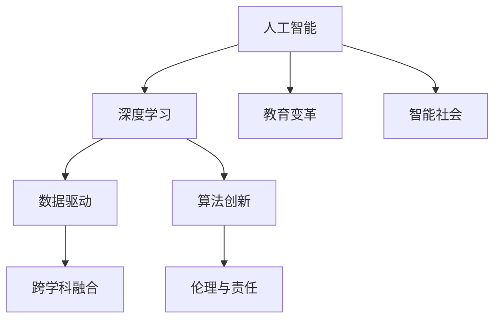

                 

# 李开复：AI 2.0 时代的意义

> 关键词：人工智能, 未来趋势, 科技创新, 智能社会, 教育变革, 伦理与责任

## 1. 背景介绍

### 1.1 问题由来
在过去的几十年里，人工智能(AI)技术经历了从科学研究到实际应用的快速成长。从最初的基于规则的专家系统到现代的深度学习，AI技术在处理图像、语音、自然语言等方面取得了巨大进步。但是，随着AI技术的不断深入发展，我们进入了AI 2.0时代，其核心特征是机器学习、深度学习和大数据等技术的全面融合，极大地推动了科技创新的步伐，也带来了前所未有的机遇和挑战。

### 1.2 问题核心关键点
AI 2.0时代带来了许多新的概念和挑战。AI 2.0不仅仅是技术上的突破，更是在应用、伦理和社会影响上的全面革新。以下是AI 2.0时代的一些核心关键点：

- **数据爆炸**：AI 2.0时代的数据量呈指数级增长，数据质量、数据获取、数据存储和数据处理等都成为重要问题。
- **算法复杂性**：深度学习等复杂算法需要大量的计算资源，算法效率和可解释性是主要挑战。
- **应用多样性**：AI 2.0技术被广泛应用于医疗、教育、金融、交通等多个领域，不同领域的应用场景和需求不同。
- **伦理与责任**：AI 2.0技术的广泛应用引发了隐私保护、公平性、透明性和责任归属等伦理问题。
- **跨学科融合**：AI 2.0的发展离不开计算机科学、数学、物理学、生物学等多学科的交叉合作。

这些关键点使得AI 2.0时代成为一个复杂且充满机遇的领域。

### 1.3 问题研究意义
AI 2.0时代的技术和应用对社会产生了深远的影响，以下是其重要意义：

1. **科技创新**：AI 2.0技术不断推动科学创新，解决传统技术难以处理的问题，为科技创新开辟新的道路。
2. **智能社会**：AI 2.0技术将带来智能化的社会管理、智能化的生产方式和智能化的服务体系，提升社会整体效率。
3. **教育变革**：AI 2.0技术将重塑教育方式，实现个性化教学、智能化评估和实时反馈，提升教育质量。
4. **伦理与责任**：AI 2.0技术的伦理和安全问题需要被广泛关注和探讨，确保技术的健康发展。
5. **全球竞争**：AI 2.0技术已经成为全球科技竞争的焦点，掌握AI技术意味着在全球竞争中占据有利位置。

## 2. 核心概念与联系

### 2.1 核心概念概述

为了深入理解AI 2.0时代的意义，我们需要了解以下核心概念：

- **人工智能**：利用计算机技术模拟人的智能行为，实现机器的自主决策和自我学习。
- **深度学习**：一种机器学习技术，通过构建多层神经网络模型，能够处理复杂的数据和任务。
- **数据驱动**：AI 2.0技术依赖于大规模数据，通过数据驱动的方式进行模型训练和优化。
- **算法创新**：AI 2.0时代的算法不断创新，如卷积神经网络、循环神经网络、强化学习等，推动技术进步。
- **伦理与责任**：AI 2.0技术应用过程中涉及的伦理问题，如隐私保护、公平性、透明性和责任归属。
- **跨学科融合**：AI 2.0技术的发展离不开多学科的交叉合作，涉及计算机科学、数学、物理学、生物学等多个领域。

这些核心概念之间存在紧密的联系，形成一个相互支持的生态系统，共同推动AI 2.0时代的发展。

### 2.2 核心概念原理和架构的 Mermaid 流程图



### 2.3 核心概念之间的逻辑关系

在AI 2.0时代，人工智能是核心，深度学习、数据驱动、算法创新、跨学科融合、伦理与责任等概念都是围绕人工智能展开的。数据驱动为深度学习提供了基础，算法创新推动了深度学习的发展，跨学科融合为深度学习提供了更多可能性，伦理与责任保证了深度学习的健康发展，教育变革和智能社会则是深度学习的最终应用目标。

## 3. 核心算法原理 & 具体操作步骤

### 3.1 算法原理概述

AI 2.0时代的核心算法主要包括深度学习、强化学习和迁移学习等。其中，深度学习是AI 2.0时代的核心算法，通过构建多层神经网络模型，能够处理复杂的非线性问题，如图像识别、语音识别和自然语言处理等。强化学习则通过与环境交互，不断优化决策策略，适用于游戏、机器人控制等领域。迁移学习则是指将已有的知识应用于新的任务中，减少了对新数据的需求。

### 3.2 算法步骤详解

下面以深度学习为例，详细讲解深度学习模型的构建和训练过程：

1. **数据准备**：收集和预处理训练数据，确保数据质量。
2. **模型构建**：选择合适的神经网络结构，如卷积神经网络、循环神经网络等。
3. **参数初始化**：随机初始化神经网络的权重和偏置。
4. **前向传播**：将输入数据送入神经网络，通过逐层计算得到输出结果。
5. **损失函数计算**：计算输出结果与真实标签之间的差异，作为优化目标。
6. **反向传播**：根据损失函数计算梯度，更新网络参数。
7. **优化算法**：使用如随机梯度下降等优化算法，不断调整网络参数。
8. **测试与评估**：在测试集上评估模型性能，进行参数调整和模型优化。

### 3.3 算法优缺点

深度学习算法具有以下优点：

- **可扩展性**：深度学习模型能够处理大规模数据，适合处理复杂的数据结构和任务。
- **自适应性**：深度学习模型能够自适应地学习输入数据的特征，避免特征工程。
- **泛化能力**：深度学习模型具有较强的泛化能力，能够在未知数据上取得不错的性能。

但深度学习算法也存在一些缺点：

- **计算复杂度**：深度学习模型需要大量的计算资源，包括高性能的GPU和TPU。
- **模型可解释性**：深度学习模型通常是“黑盒”模型，难以解释其内部工作机制。
- **过拟合风险**：深度学习模型容易过拟合，特别是当训练数据较少时。
- **数据依赖**：深度学习模型高度依赖于数据质量，数据噪声和偏差会影响模型性能。

### 3.4 算法应用领域

深度学习算法已经在多个领域取得了显著应用，例如：

- **计算机视觉**：如图像识别、物体检测、人脸识别等。
- **自然语言处理**：如文本分类、机器翻译、语音识别等。
- **医疗健康**：如医学影像分析、疾病预测、药物研发等。
- **金融科技**：如信用评估、风险管理、交易策略等。
- **智能制造**：如设备监控、质量检测、自动化生产等。
- **交通运输**：如自动驾驶、交通流量预测、路径规划等。

## 4. 数学模型和公式 & 详细讲解 & 举例说明

### 4.1 数学模型构建

深度学习模型的数学模型主要包括神经网络结构和损失函数。以卷积神经网络(CNN)为例，其数学模型可以表示为：

$$
f(x; \theta) = \sigma(\sum_i w_i \cdot g(\varphi(x_i)) + b_i)
$$

其中，$x$为输入数据，$w_i$和$b_i$为神经网络参数，$\sigma$为激活函数，$g$为非线性变换函数。

### 4.2 公式推导过程

以反向传播算法为例，推导其计算过程。反向传播算法通过链式法则计算损失函数对每个参数的梯度，步骤如下：

1. **前向传播**：计算输出结果$y$。
2. **损失函数**：计算损失函数$L$。
3. **反向传播**：计算梯度$\nabla_{w_i} L$。
4. **参数更新**：使用梯度下降等优化算法更新参数$w_i$和$b_i$。

### 4.3 案例分析与讲解

以图像分类为例，分析深度学习模型的构建和训练过程。

- **数据准备**：收集大量图像数据，并进行预处理，如归一化、标准化等。
- **模型构建**：使用卷积神经网络模型，包含卷积层、池化层、全连接层等。
- **参数初始化**：随机初始化神经网络参数。
- **前向传播**：将图像数据输入模型，通过卷积层、池化层和全连接层计算输出结果。
- **损失函数计算**：使用交叉熵损失函数计算输出结果与真实标签之间的差异。
- **反向传播**：计算损失函数对每个参数的梯度，更新参数。
- **优化算法**：使用随机梯度下降等优化算法，不断调整参数。
- **测试与评估**：在测试集上评估模型性能，进行参数调整和模型优化。

## 5. 项目实践：代码实例和详细解释说明

### 5.1 开发环境搭建

为了搭建深度学习项目，需要准备以下开发环境：

1. **Python环境**：安装Python 3.x版本，建议使用Anaconda环境。
2. **深度学习框架**：选择TensorFlow或PyTorch等深度学习框架，并配置好GPU/TPU资源。
3. **数据集准备**：收集和预处理训练数据，确保数据质量。
4. **代码编写**：使用Python编写深度学习模型代码，并使用框架进行模型训练。
5. **模型评估**：在测试集上评估模型性能，并进行参数调整和模型优化。

### 5.2 源代码详细实现

以下是一个简单的卷积神经网络模型的源代码实现：

```python
import tensorflow as tf

# 定义模型
class ConvNet(tf.keras.Model):
    def __init__(self):
        super(ConvNet, self).__init__()
        self.conv1 = tf.keras.layers.Conv2D(32, (3, 3), activation='relu')
        self.pool1 = tf.keras.layers.MaxPooling2D((2, 2))
        self.conv2 = tf.keras.layers.Conv2D(64, (3, 3), activation='relu')
        self.pool2 = tf.keras.layers.MaxPooling2D((2, 2))
        self.flatten = tf.keras.layers.Flatten()
        self.fc1 = tf.keras.layers.Dense(64, activation='relu')
        self.fc2 = tf.keras.layers.Dense(10, activation='softmax')
    
    def call(self, x):
        x = self.conv1(x)
        x = self.pool1(x)
        x = self.conv2(x)
        x = self.pool2(x)
        x = self.flatten(x)
        x = self.fc1(x)
        return self.fc2(x)

# 定义模型训练过程
model = ConvNet()
loss_fn = tf.keras.losses.SparseCategoricalCrossentropy(from_logits=True)
optimizer = tf.keras.optimizers.Adam()

def train_step(x, y):
    with tf.GradientTape() as tape:
        logits = model(x, training=True)
        loss = loss_fn(y, logits)
    gradients = tape.gradient(loss, model.trainable_variables)
    optimizer.apply_gradients(zip(gradients, model.trainable_variables))

# 训练模型
for epoch in range(10):
    for batch, (x, y) in train_dataset:
        train_step(x, y)

# 测试模型
test_loss, test_acc = tf.keras.metrics.mean(loss_fn(model(x_test, training=False), y_test))
print('Test accuracy:', test_acc)
```

### 5.3 代码解读与分析

以上代码实现了简单的卷积神经网络模型，并使用TensorFlow进行训练和评估。代码中的关键步骤包括：

- **模型定义**：定义卷积层、池化层、全连接层等神经网络结构。
- **损失函数定义**：使用交叉熵损失函数计算输出结果与真实标签之间的差异。
- **优化器定义**：使用Adam优化器进行参数更新。
- **训练过程**：在训练数据上逐步更新模型参数。
- **测试过程**：在测试数据上评估模型性能。

## 6. 实际应用场景

### 6.1 医疗健康

深度学习在医疗健康领域具有广泛应用，例如：

- **医学影像分析**：利用深度学习模型分析X光片、CT扫描等医学影像，辅助医生进行疾病诊断。
- **基因组学研究**：通过深度学习模型分析基因数据，揭示基因与疾病之间的关系，加速新药研发。
- **疾病预测与监控**：利用深度学习模型分析患者的历史数据和实时数据，预测疾病发展趋势，并进行实时监控。

### 6.2 金融科技

深度学习在金融科技领域的应用包括：

- **信用评估**：利用深度学习模型分析用户的财务数据、社交数据等，评估用户的信用风险。
- **风险管理**：利用深度学习模型分析市场数据，预测股票价格波动、市场风险等。
- **交易策略**：利用深度学习模型分析交易数据，制定更加精准的交易策略。

### 6.3 智能制造

深度学习在智能制造中的应用包括：

- **设备监控**：利用深度学习模型分析设备运行数据，检测设备故障并进行预测维护。
- **质量检测**：利用深度学习模型分析产品质量数据，检测产品缺陷并进行分类。
- **自动化生产**：利用深度学习模型进行生产流程优化，提升生产效率和产品质量。

### 6.4 交通运输

深度学习在交通运输中的应用包括：

- **自动驾驶**：利用深度学习模型分析传感器数据，实现车辆的自动驾驶和路径规划。
- **交通流量预测**：利用深度学习模型分析交通数据，预测交通流量并进行实时调控。
- **智能交通管理**：利用深度学习模型分析交通数据，优化交通管理策略。

## 7. 工具和资源推荐

### 7.1 学习资源推荐

以下是一些推荐的深度学习学习资源：

- **在线课程**：Coursera、edX、Udacity等平台提供了丰富的深度学习课程，如《深度学习专项课程》、《机器学习基础》等。
- **书籍**：《深度学习》、《动手学深度学习》、《Python深度学习》等书籍深入浅出地介绍了深度学习原理和实践。
- **开源项目**：GitHub上有大量优秀的深度学习开源项目，如TensorFlow、PyTorch、Keras等，可供学习参考。

### 7.2 开发工具推荐

以下是一些推荐的深度学习开发工具：

- **TensorFlow**：Google开发的深度学习框架，功能强大，支持GPU/TPU等高性能计算资源。
- **PyTorch**：Facebook开发的深度学习框架，灵活性高，易于调试和优化。
- **Keras**：基于TensorFlow和Theano的深度学习框架，使用简单，易于上手。
- **MXNet**：由亚马逊开发的深度学习框架，支持多种编程语言，易于分布式部署。

### 7.3 相关论文推荐

以下是一些深度学习领域的经典论文：

- **AlexNet**：ImageNet大规模视觉识别挑战赛冠军模型，开启了深度学习在计算机视觉领域的应用。
- **ResNet**：提出残差网络结构，解决了深度神经网络训练中的梯度消失问题，推动了深度学习的进一步发展。
- **BERT**：通过预训练语言模型，极大地提升了自然语言处理的性能，被广泛应用于文本分类、情感分析等任务。
- **GPT-3**：Google开发的语言模型，具有强大的语言生成和理解能力，成为自然语言处理领域的里程碑。
- **AlphaGo**：DeepMind开发的围棋程序，通过深度学习和强化学习技术，实现了人工智能在复杂游戏中的突破。

## 8. 总结：未来发展趋势与挑战

### 8.1 研究成果总结

深度学习在AI 2.0时代已经取得了显著进展，广泛应用于计算机视觉、自然语言处理、医疗健康、金融科技等多个领域。深度学习模型具有强大的自适应能力和泛化能力，能够处理复杂的非线性问题。

### 8.2 未来发展趋势

未来深度学习技术的发展趋势包括：

- **模型规模不断增大**：深度学习模型将继续向更大规模扩展，提升模型性能和泛化能力。
- **计算资源优化**：计算资源将继续优化，提高训练效率和模型性能。
- **模型可解释性**：深度学习模型将更加注重可解释性，增强模型的透明度和可靠性。
- **跨领域应用**：深度学习技术将应用于更多领域，如自动驾驶、智能制造、智能家居等。
- **多模态融合**：深度学习技术将与视觉、语音、文字等多种模态数据融合，提升模型综合能力。

### 8.3 面临的挑战

尽管深度学习技术已经取得了显著进展，但仍然面临一些挑战：

- **数据获取与质量**：深度学习模型高度依赖于数据质量，数据获取和数据标注成本较高。
- **模型可解释性**：深度学习模型通常是“黑盒”模型，难以解释其内部工作机制。
- **计算资源消耗**：深度学习模型需要大量的计算资源，特别是在大规模数据集上训练时。
- **伦理与安全性**：深度学习模型在应用过程中可能带来隐私保护、公平性、透明性和安全等问题。

### 8.4 研究展望

未来深度学习技术的研究方向包括：

- **无监督学习与自监督学习**：开发无监督学习和自监督学习技术，减少对标注数据的需求。
- **模型压缩与优化**：研究模型压缩与优化技术，提高模型效率和可解释性。
- **跨领域知识融合**：将跨领域知识融合到深度学习模型中，提升模型综合能力。
- **伦理与安全研究**：研究深度学习模型的伦理与安全问题，确保技术应用的可靠性。

## 9. 附录：常见问题与解答

**Q1: 深度学习算法有哪些优点和缺点？**

A: 深度学习算法的优点包括：
- **可扩展性**：深度学习模型能够处理大规模数据，适合处理复杂的数据结构和任务。
- **自适应性**：深度学习模型能够自适应地学习输入数据的特征，避免特征工程。
- **泛化能力**：深度学习模型具有较强的泛化能力，能够在未知数据上取得不错的性能。

深度学习算法的缺点包括：
- **计算复杂度**：深度学习模型需要大量的计算资源，特别是在大规模数据集上训练时。
- **模型可解释性**：深度学习模型通常是“黑盒”模型，难以解释其内部工作机制。
- **过拟合风险**：深度学习模型容易过拟合，特别是在训练数据较少时。
- **数据依赖**：深度学习模型高度依赖于数据质量，数据噪声和偏差会影响模型性能。

**Q2: 深度学习算法在医疗健康领域有哪些应用？**

A: 深度学习算法在医疗健康领域的应用包括：
- **医学影像分析**：利用深度学习模型分析X光片、CT扫描等医学影像，辅助医生进行疾病诊断。
- **基因组学研究**：通过深度学习模型分析基因数据，揭示基因与疾病之间的关系，加速新药研发。
- **疾病预测与监控**：利用深度学习模型分析患者的历史数据和实时数据，预测疾病发展趋势，并进行实时监控。

**Q3: 如何缓解深度学习模型中的过拟合问题？**

A: 缓解深度学习模型中的过拟合问题，可以采取以下方法：
- **数据增强**：通过回译、近义替换等方式扩充训练集。
- **正则化**：使用L2正则、Dropout、Early Stopping等防止过拟合。
- **对抗训练**：引入对抗样本，提高模型鲁棒性。
- **参数高效微调**：只调整少量参数，减小过拟合风险。
- **模型压缩**：使用模型压缩技术，减小模型参数量。

**Q4: 深度学习技术在AI 2.0时代有哪些重要应用？**

A: 深度学习技术在AI 2.0时代的重要应用包括：
- **计算机视觉**：如图像识别、物体检测、人脸识别等。
- **自然语言处理**：如文本分类、机器翻译、语音识别等。
- **医疗健康**：如医学影像分析、基因组学研究、疾病预测等。
- **金融科技**：如信用评估、风险管理、交易策略等。
- **智能制造**：如设备监控、质量检测、自动化生产等。
- **交通运输**：如自动驾驶、交通流量预测、路径规划等。

**Q5: 如何平衡深度学习模型的计算资源消耗与模型性能？**

A: 平衡深度学习模型的计算资源消耗与模型性能，可以采取以下方法：
- **模型压缩与优化**：研究模型压缩与优化技术，减小模型参数量，提高计算效率。
- **分布式训练**：利用分布式训练技术，加速模型训练过程。
- **硬件优化**：使用高性能的GPU/TPU设备，提高计算速度。
- **模型并行**：使用模型并行技术，优化模型计算过程。

---

作者：禅与计算机程序设计艺术 / Zen and the Art of Computer Programming

