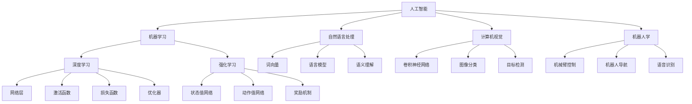

                 

# 李开复：AI 2.0 时代的挑战

## 1. 背景介绍

随着人工智能技术的飞速发展，我们已经进入了一个新的时代——AI 2.0时代。这个时代，人工智能不再是简单的自动化工具，而是成为人类社会的重要组成部分，深刻影响着我们的生产方式、生活方式、工作方式和思维方式。在这个时代，人工智能面临着前所未有的挑战和机遇。

## 2. 核心概念与联系

### 2.1 核心概念概述

在AI 2.0时代，核心概念包括：

- **人工智能**：指计算机系统在特定任务上展示出的智能行为，包括感知、学习、推理、决策等能力。
- **机器学习**：一种通过算法让计算机系统在数据上自动学习，不断提升性能的技术。
- **深度学习**：一种特殊的机器学习方法，通过构建多层神经网络模型，从数据中自动学习特征表示，实现复杂的模式识别和预测。
- **强化学习**：通过试错、奖励机制等机制，使计算机系统通过与环境的互动，逐步优化决策策略。
- **自然语言处理**：使计算机能够理解、处理和生成自然语言的技术。
- **计算机视觉**：使计算机能够识别、分类和处理图像、视频等视觉数据的技术。
- **机器人学**：使计算机能够执行复杂的物理任务，包括移动、操作等。

这些核心概念通过复杂的网络、算法和数据处理机制，使得AI 2.0时代的人工智能系统能够实现越来越复杂和智能的任务。

### 2.2 核心概念原理和架构的 Mermaid 流程图



## 3. 核心算法原理 & 具体操作步骤

### 3.1 算法原理概述

在AI 2.0时代，核心算法包括：

- **深度神经网络**：构建多层的神经网络，通过反向传播算法优化网络参数，实现复杂的模式识别和预测。
- **卷积神经网络**：在图像和视频处理任务中，使用卷积和池化操作，提取局部特征。
- **循环神经网络**：在自然语言处理任务中，通过循环结构，处理序列数据。
- **自注意力机制**：在自然语言处理和计算机视觉任务中，通过自注意力机制，实现对复杂输入的并行处理。
- **生成对抗网络**：通过生成器和判别器之间的对抗过程，生成高质量的图像、视频等。

这些算法原理构成了AI 2.0时代的人工智能技术基础。

### 3.2 算法步骤详解

以深度神经网络为例，具体算法步骤如下：

1. **数据准备**：收集训练数据，并进行预处理和标注。
2. **模型设计**：选择合适的神经网络结构，并确定网络参数。
3. **训练**：使用训练数据对模型进行训练，通过反向传播算法更新网络参数。
4. **验证**：在验证数据集上评估模型性能，选择最佳模型。
5. **测试**：在测试数据集上测试模型性能，并部署到实际应用中。

### 3.3 算法优缺点

深度神经网络的优势在于能够处理复杂的多层次数据表示，实现高精度的模式识别和预测。然而，其缺点在于需要大量的数据和计算资源，容易过拟合，且难以解释。

### 3.4 算法应用领域

深度神经网络在自然语言处理、计算机视觉、语音识别、机器人学等多个领域都有广泛应用。例如，在自然语言处理中，可以用于文本分类、机器翻译、情感分析等任务；在计算机视觉中，可以用于图像识别、目标检测、图像生成等任务。

## 4. 数学模型和公式 & 详细讲解

### 4.1 数学模型构建

以卷积神经网络为例，其基本结构包括卷积层、池化层和全连接层。卷积层通过卷积操作提取局部特征，池化层通过降采样操作减少特征维度，全连接层将特征映射到类别空间，实现分类任务。

### 4.2 公式推导过程

以卷积神经网络为例，其基本公式推导如下：

$$
\begin{aligned}
&\text{输入} \quad X \\
&\text{卷积核} \quad W \\
&\text{输出} \quad Y \\
&\text{卷积操作} \quad Y = W * X \\
&\text{池化操作} \quad Y_{\text{pool}} = \text{max}(Y) \\
&\text{全连接操作} \quad \hat{y} = \text{softmax}(W_y * Y_{\text{pool}})
\end{aligned}
$$

其中，$*$表示卷积操作，$softmax$表示激活函数，$W_y$表示全连接层的权重矩阵。

### 4.3 案例分析与讲解

以图像分类任务为例，可以使用卷积神经网络来实现。具体步骤如下：

1. **数据准备**：收集图像数据集，并进行预处理和标注。
2. **模型设计**：构建卷积神经网络模型，包括卷积层、池化层和全连接层。
3. **训练**：使用训练数据对模型进行训练，通过反向传播算法更新网络参数。
4. **验证**：在验证数据集上评估模型性能，选择最佳模型。
5. **测试**：在测试数据集上测试模型性能，并部署到实际应用中。

## 5. 项目实践：代码实例和详细解释说明

### 5.1 开发环境搭建

在AI 2.0时代，项目实践需要以下环境：

- **深度学习框架**：如TensorFlow、PyTorch等。
- **分布式计算**：如Spark、Kubernetes等。
- **数据存储**：如Hadoop、AWS S3等。
- **云计算平台**：如AWS、Google Cloud、Microsoft Azure等。

### 5.2 源代码详细实现

以下是一个简单的卷积神经网络模型实现，用于图像分类任务：

```python
import tensorflow as tf
from tensorflow.keras import layers

model = tf.keras.Sequential([
    layers.Conv2D(32, (3, 3), activation='relu', input_shape=(28, 28, 1)),
    layers.MaxPooling2D((2, 2)),
    layers.Flatten(),
    layers.Dense(10, activation='softmax')
])

model.compile(optimizer='adam',
              loss='sparse_categorical_crossentropy',
              metrics=['accuracy'])

model.fit(x_train, y_train, epochs=5, validation_data=(x_test, y_test))
```

### 5.3 代码解读与分析

以上代码中，首先定义了一个包含卷积层、池化层和全连接层的卷积神经网络模型。然后，使用`compile`方法设置优化器和损失函数，使用`fit`方法对模型进行训练和验证。最后，使用`evaluate`方法对模型进行测试。

## 6. 实际应用场景

### 6.1 医疗影像分析

在医疗影像分析中，深度神经网络可以用于识别和分类医学影像，如X光片、CT、MRI等。具体应用包括：

- **肺癌检测**：通过卷积神经网络对X光片进行分析，检测是否存在肺癌。
- **心脏病诊断**：通过卷积神经网络对心脏MRI进行分析，诊断心脏病的类型和严重程度。
- **脑部病变识别**：通过卷积神经网络对MRI进行分析，识别脑部病变的类型和位置。

### 6.2 智能交通管理

在智能交通管理中，深度神经网络可以用于分析和预测交通流量，优化交通信号灯控制。具体应用包括：

- **交通流量预测**：通过卷积神经网络对交通视频进行分析，预测未来一段时间的交通流量。
- **交通信号控制**：通过循环神经网络对历史交通数据进行分析，自动调整交通信号灯的配时，优化交通流量。
- **交通事故检测**：通过卷积神经网络对监控视频进行分析，检测交通违规行为和交通事故。

### 6.3 金融风险管理

在金融风险管理中，深度神经网络可以用于识别和预测金融市场风险，如股票价格波动、信用风险等。具体应用包括：

- **股票价格预测**：通过卷积神经网络对股票交易数据进行分析，预测股票价格的未来走势。
- **信用风险评估**：通过卷积神经网络对信用评分数据进行分析，评估贷款客户的信用风险。
- **欺诈检测**：通过卷积神经网络对交易数据进行分析，检测金融欺诈行为。

### 6.4 未来应用展望

随着AI 2.0技术的发展，未来的应用场景将更加广泛，包括：

- **智能家居**：通过深度神经网络对家居环境进行分析，实现智能家电控制、家庭安全监控等。
- **智能制造**：通过深度神经网络对生产数据进行分析，实现智能生产线控制、质量检测等。
- **智能客服**：通过深度神经网络对客户对话进行分析，实现智能客服机器人。
- **智能交通**：通过深度神经网络对交通数据进行分析，实现智能交通系统。
- **智能健康**：通过深度神经网络对健康数据进行分析，实现智能健康监测和医疗诊断。

## 7. 工具和资源推荐

### 7.1 学习资源推荐

以下是AI 2.0时代的核心学习资源：

- **在线课程**：如Coursera、Udacity、edX等平台上的深度学习课程。
- **书籍**：如《深度学习》（Ian Goodfellow等著）、《Python深度学习》（Francois Chollet等著）等。
- **学术论文**：如NeurIPS、ICML、CVPR等顶级会议上的深度学习论文。

### 7.2 开发工具推荐

以下是AI 2.0时代的核心开发工具：

- **深度学习框架**：如TensorFlow、PyTorch等。
- **分布式计算框架**：如Spark、Kubernetes等。
- **云计算平台**：如AWS、Google Cloud、Microsoft Azure等。

### 7.3 相关论文推荐

以下是AI 2.0时代的核心相关论文：

- **《深度学习》（Ian Goodfellow等著）**：全面介绍了深度学习的理论基础和实践技术。
- **《计算机视觉：模型、学习与推理》（Simon J.D.Bronstein等著）**：介绍了计算机视觉的理论基础和应用实例。
- **《强化学习：基础与实践》（Richard S.Sutton等著）**：介绍了强化学习的理论基础和实践技术。

## 8. 总结：未来发展趋势与挑战

### 8.1 研究成果总结

AI 2.0时代的核心研究成果包括：

- **深度学习算法**：卷积神经网络、循环神经网络、自注意力机制等。
- **计算机视觉技术**：图像分类、目标检测、图像生成等。
- **自然语言处理技术**：文本分类、机器翻译、情感分析等。

### 8.2 未来发展趋势

未来，AI 2.0技术的发展趋势包括：

- **深度学习模型的优化**：提升深度神经网络的训练效率和性能。
- **分布式计算技术的应用**：通过分布式计算技术，实现大规模深度神经网络的训练和推理。
- **多模态数据融合**：将图像、语音、文本等不同模态的数据进行融合，实现更全面、更智能的模型。
- **边缘计算技术的应用**：通过边缘计算技术，实现智能设备的低延迟、高效率的深度学习推理。
- **联邦学习技术的应用**：通过联邦学习技术，实现跨设备、跨平台的数据共享和模型训练。

### 8.3 面临的挑战

AI 2.0技术面临的挑战包括：

- **数据隐私保护**：在深度学习模型中，如何保护用户数据隐私。
- **模型解释性**：如何解释深度神经网络的决策过程，提高模型的可解释性。
- **模型鲁棒性**：如何提高深度神经网络的鲁棒性，防止模型对噪声和异常数据敏感。
- **计算资源消耗**：如何在资源有限的情况下，实现深度神经网络的高效训练和推理。

### 8.4 研究展望

未来，AI 2.0技术的研究展望包括：

- **深度学习模型的可解释性**：通过引入符号推理、因果分析等技术，提高深度神经网络的可解释性。
- **联邦学习技术的应用**：通过联邦学习技术，实现跨设备、跨平台的数据共享和模型训练。
- **多模态数据融合**：将图像、语音、文本等不同模态的数据进行融合，实现更全面、更智能的模型。
- **边缘计算技术的应用**：通过边缘计算技术，实现智能设备的低延迟、高效率的深度学习推理。
- **隐私保护技术的应用**：通过隐私保护技术，实现深度学习模型的数据隐私保护。

## 9. 附录：常见问题与解答

**Q1: 深度学习算法在实际应用中存在哪些问题？**

A: 深度学习算法在实际应用中存在以下问题：

- **过拟合**：深度神经网络在训练数据集上表现良好，但在测试数据集上表现不佳。
- **计算资源消耗大**：深度神经网络需要大量的计算资源，包括GPU、TPU等高性能设备。
- **模型解释性不足**：深度神经网络的决策过程难以解释，缺乏可解释性。

**Q2: 如何提高深度学习模型的训练效率？**

A: 提高深度学习模型训练效率的方法包括：

- **数据增强**：通过数据增强技术，扩充训练数据集，提高模型的泛化能力。
- **正则化**：通过L2正则、Dropout等技术，防止模型过拟合。
- **分布式计算**：通过分布式计算技术，实现大规模深度神经网络的训练和推理。
- **模型剪枝**：通过模型剪枝技术，去除不必要的参数，减小模型的计算量。

**Q3: 如何保护深度学习模型的数据隐私？**

A: 保护深度学习模型数据隐私的方法包括：

- **联邦学习**：通过联邦学习技术，实现跨设备、跨平台的数据共享和模型训练，保护用户数据隐私。
- **差分隐私**：通过差分隐私技术，在数据中添加噪声，保护用户隐私。
- **加密计算**：通过加密计算技术，保护数据在传输和存储过程中的隐私。

通过以上方法和技术，可以提升深度学习模型的训练效率，保护数据隐私，解决实际应用中的问题。

---

作者：禅与计算机程序设计艺术 / Zen and the Art of Computer Programming

