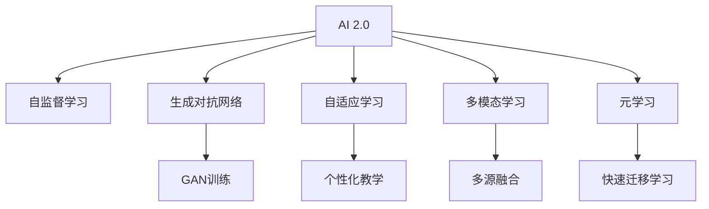

                 

# 李开复：AI 2.0 时代的挑战

## 1. 背景介绍

随着人工智能技术的迅猛发展，我们正进入一个全新的AI时代——AI 2.0时代。AI 2.0是继AI 1.0（以基于规则和专家系统的智能系统为代表）和AI 1.5（以机器学习和深度学习为代表的智能系统为代表）之后的新阶段。在这个时代，AI不仅在技术上有了突破性的进展，更在应用层面呈现出前所未有的广阔前景。然而，AI 2.0时代的到来也伴随着一系列新的挑战和风险。本文将深入探讨AI 2.0时代的核心概念、技术原理、实践方法以及未来发展趋势，并对所面临的挑战进行深入分析。

## 2. 核心概念与联系

### 2.1 核心概念概述

为更好地理解AI 2.0时代的核心概念和技术，本节将介绍几个关键概念：

- AI 2.0：以深度学习和生成对抗网络（GAN）等高级技术为基础，融合多模态信息，具备强大的数据处理和决策能力的人工智能系统。
- 自监督学习（Self-Supervised Learning）：通过利用数据的内在结构（如自相关性、对偶性）进行无监督学习，在不需要标注数据的情况下学习到有用的知识。
- 生成对抗网络（GAN）：由生成器和判别器组成，通过对抗训练使得生成器能够生成高质量的伪造数据，判别器能够区分真实和伪造数据。
- 自适应学习（Adaptive Learning）：根据学习者的个性和需求，动态调整教学内容和方法，提高学习效果。
- 多模态学习（Multi-modal Learning）：融合文本、图像、声音等多种信息源，提高对复杂问题的理解和处理能力。
- 元学习（Meta-Learning）：通过学习如何学习，快速适应新任务，提高泛化能力。

这些核心概念之间存在紧密联系，共同构成了AI 2.0时代的技术基础。

### 2.2 核心概念原理和架构的 Mermaid 流程图



这个流程图展示了AI 2.0时代的核心概念和技术架构，各个概念之间相互依赖，共同推动AI技术的发展。

## 3. 核心算法原理 & 具体操作步骤

### 3.1 算法原理概述

AI 2.0时代的核心算法包括自监督学习、生成对抗网络、自适应学习、多模态学习和元学习等。这些算法共同构成了AI 2.0的强大技术基础。

- 自监督学习：通过利用数据的内在结构进行无监督学习，学习到有用的知识，避免标注数据的成本。
- 生成对抗网络：通过生成器和判别器之间的对抗训练，生成高质量的伪造数据，提高数据生成和增强能力。
- 自适应学习：根据学习者的个性和需求，动态调整教学内容和方法，提高学习效果。
- 多模态学习：融合文本、图像、声音等多种信息源，提高对复杂问题的理解和处理能力。
- 元学习：通过学习如何学习，快速适应新任务，提高泛化能力。

### 3.2 算法步骤详解

AI 2.0算法的步骤一般包括数据准备、模型训练、模型评估和模型应用等。具体步骤如下：

**Step 1: 数据准备**
- 收集并预处理数据，确保数据质量。
- 设计合适的数据标注方案，明确数据标注的目标和标准。

**Step 2: 模型训练**
- 选择合适的模型架构和算法。
- 设定合适的超参数和训练策略。
- 进行模型训练，调整模型参数以最小化损失函数。

**Step 3: 模型评估**
- 使用验证集和测试集评估模型性能。
- 分析模型性能指标，识别模型存在的缺陷和改进方向。

**Step 4: 模型应用**
- 将训练好的模型部署到实际应用中。
- 对模型进行监控和优化，确保模型稳定运行。

### 3.3 算法优缺点

AI 2.0算法具有以下优点：
- 无需大量标注数据，自监督学习可以在无标注数据的情况下学习到有用的知识。
- 生成对抗网络可以生成高质量的伪造数据，丰富训练数据集。
- 自适应学习可以根据学习者的个性和需求，提高学习效果。
- 多模态学习可以融合多种信息源，提高对复杂问题的理解和处理能力。
- 元学习可以快速适应新任务，提高泛化能力。

然而，这些算法也存在以下缺点：
- 自监督学习需要设计合适的自监督任务，有时可能难以保证任务的有效性和代表性。
- 生成对抗网络训练复杂，容易陷入模式崩溃。
- 自适应学习需要大量个性化数据，难以在通用场景下应用。
- 多模态学习需要融合多种信息源，技术难度较大。
- 元学习需要大量的先验知识，难以在大规模数据上应用。

### 3.4 算法应用领域

AI 2.0算法在各个领域都有广泛的应用，例如：

- 医疗：利用多模态学习，结合CT、MRI等影像数据和基因信息，提高疾病诊断的准确性。
- 金融：使用生成对抗网络生成高质量的训练数据，提高金融模型的预测能力。
- 教育：通过自适应学习，根据学习者的个性和需求，提供个性化教学方案，提高学习效果。
- 自动驾驶：利用多模态学习，结合雷达、摄像头和激光雷达等多种传感器信息，提高驾驶决策的准确性。
- 推荐系统：使用生成对抗网络生成高质量的推荐样本，提高推荐系统的效果。

## 4. 数学模型和公式 & 详细讲解

### 4.1 数学模型构建

本节将使用数学语言对AI 2.0算法的数学模型进行描述。

设 $X$ 为输入，$Y$ 为输出，$\theta$ 为模型参数，$\mathcal{L}$ 为损失函数，$W$ 为权重矩阵，$b$ 为偏置向量。

- 自监督学习：通过设计自监督任务 $T(x)$，最小化损失函数 $\mathcal{L}(\theta, T(x))$。
- 生成对抗网络：生成器 $G$ 生成伪造数据 $x_G$，判别器 $D$ 判断 $x_G$ 是否为真实数据，最小化损失函数 $\mathcal{L}(G, D)$。
- 自适应学习：根据学习者的反馈 $y$，动态调整教学内容 $T(x)$，最小化损失函数 $\mathcal{L}(\theta, T(x), y)$。
- 多模态学习：将不同模态的信息源 $x_1, x_2, \dots, x_n$ 融合，最小化损失函数 $\mathcal{L}(\theta, x_1, x_2, \dots, x_n)$。
- 元学习：通过学习模型 $\theta$ 的参数，最小化损失函数 $\mathcal{L}(\theta, T(x), y)$。

### 4.2 公式推导过程

以自监督学习和生成对抗网络为例，推导其公式。

**自监督学习**
假设自监督任务 $T(x)$ 为自相关性任务，则自监督损失函数为：
$$
\mathcal{L}(\theta, T(x)) = \frac{1}{N} \sum_{i=1}^N \ell(T(x_i), x_i)
$$
其中，$\ell$ 为损失函数，$N$ 为样本数。

**生成对抗网络**
生成器和判别器的损失函数分别为：
$$
\mathcal{L}_G = \frac{1}{N} \sum_{i=1}^N \log D(x_i) + \frac{1}{N} \sum_{i=1}^N \log(1 - D(x_{Gi}))
$$
$$
\mathcal{L}_D = \frac{1}{N} \sum_{i=1}^N \log D(x_i) + \frac{1}{N} \sum_{i=1}^N \log(1 - D(x_{Gi}))
$$
其中，$x_{Gi}$ 为生成器 $G$ 生成的伪造数据，$N$ 为样本数。

### 4.3 案例分析与讲解

以图像生成为例，说明生成对抗网络的训练过程。

- 生成器 $G$ 输入噪声向量 $z$，生成伪造图像 $x_G$。
- 判别器 $D$ 判断 $x_G$ 是否为真实图像。
- 优化器更新 $G$ 和 $D$ 的参数，使得 $G$ 生成的伪造图像难以被 $D$ 区分，同时 $D$ 能够准确区分真实和伪造图像。

## 5. 项目实践：代码实例和详细解释说明

### 5.1 开发环境搭建

在进行AI 2.0算法实践前，我们需要准备好开发环境。以下是使用Python进行TensorFlow开发的示例：

1. 安装Anaconda：从官网下载并安装Anaconda，用于创建独立的Python环境。

2. 创建并激活虚拟环境：
```bash
conda create -n tf-env python=3.8 
conda activate tf-env
```

3. 安装TensorFlow：根据CUDA版本，从官网获取对应的安装命令。例如：
```bash
conda install tensorflow -c conda-forge -c pypi
```

4. 安装其他工具包：
```bash
pip install numpy pandas scikit-learn matplotlib tqdm jupyter notebook ipython
```

完成上述步骤后，即可在`tf-env`环境中开始AI 2.0算法的开发实践。

### 5.2 源代码详细实现

以下是一个基于TensorFlow的图像生成任务的示例代码实现。

首先，定义数据处理函数：

```python
import tensorflow as tf
from tensorflow.keras import layers

def load_data():
    mnist = tf.keras.datasets.mnist
    (x_train, y_train), (x_test, y_test) = mnist.load_data()
    x_train, x_test = x_train / 255.0, x_test / 255.0
    return (x_train, y_train), (x_test, y_test)

(x_train, y_train), (x_test, y_test) = load_data()

x_train = x_train[..., tf.newaxis]
x_test = x_test[..., tf.newaxis]
```

然后，定义生成器和判别器的模型：

```python
def build_generator():
    model = tf.keras.Sequential()
    model.add(layers.Dense(256, input_shape=(100,)))
    model.add(layers.LeakyReLU())
    model.add(layers.Dense(256, activation='relu'))
    model.add(layers.LeakyReLU())
    model.add(layers.Dense(784, activation='tanh'))
    return model

def build_discriminator():
    model = tf.keras.Sequential()
    model.add(layers.Conv2D(64, (3, 3), strides=(2, 2), padding='same', input_shape=(28, 28, 1)))
    model.add(layers.LeakyReLU())
    model.add(layers.Conv2D(128, (3, 3), strides=(2, 2), padding='same'))
    model.add(layers.LeakyReLU())
    model.add(layers.Flatten())
    model.add(layers.Dense(1))
    return model
```

接着，定义生成器和判别器的损失函数和优化器：

```python
generator = build_generator()
discriminator = build_discriminator()

generator.compile(optimizer=tf.keras.optimizers.Adam(), loss='binary_crossentropy')
discriminator.compile(optimizer=tf.keras.optimizers.Adam(), loss='binary_crossentropy')
```

然后，定义生成对抗网络的训练函数：

```python
def train():
    for epoch in range(epochs):
        for i in range(batch_size):
            noise = tf.random.normal([batch_size, 100])
            generated_images = generator(noise)
            real_images = x_train[i]
            d_loss_real = discriminator.train_on_batch(real_images, tf.ones((batch_size, 1)))
            d_loss_fake = discriminator.train_on_batch(generated_images, tf.zeros((batch_size, 1)))
            g_loss = generator.train_on_batch(noise, tf.ones((batch_size, 1)))
            print("Epoch:", epoch+1, "Step:", i+1, "D_loss:", d_loss_real[0], "D_loss_fake:", d_loss_fake[0], "G_loss:", g_loss[0])
```

最后，启动训练流程：

```python
epochs = 100
batch_size = 32

train()
```

以上是一个基于TensorFlow的图像生成任务的示例代码实现。可以看到，通过简单的TensorFlow代码，即可实现生成对抗网络的基本功能。

### 5.3 代码解读与分析

让我们再详细解读一下关键代码的实现细节：

**数据处理函数load_data**
- 使用TensorFlow加载MNIST数据集，对数据进行预处理，包括归一化。
- 返回训练集和测试集的输入和标签。

**生成器和判别器模型**
- 使用TensorFlow的Sequential模型，定义生成器和判别器的层次结构。
- 使用Dense层和LeakyReLU激活函数，构建生成器和判别器的神经网络结构。

**损失函数和优化器**
- 使用TensorFlow的Adam优化器，定义生成器和判别器的损失函数。

**生成对抗网络训练函数train**
- 在每个epoch内，对每个batch的数据进行训练。
- 使用噪声向量作为生成器的输入，计算生成器和判别器的损失函数。
- 打印每个epoch和step的损失函数值。

**训练流程**
- 设置epoch数和batch size，启动训练函数。

可以看到，TensorFlow提供了简单易用的API，可以方便地实现各种深度学习模型。开发者可以利用这些API快速构建和训练生成对抗网络，解决实际问题。

## 6. 实际应用场景

### 6.1 智能推荐系统

AI 2.0算法在智能推荐系统中的应用，可以显著提升推荐效果。传统推荐系统依赖于用户的历史行为数据，难以捕捉用户的实时需求和兴趣。利用多模态学习和生成对抗网络，推荐系统可以生成高质量的推荐样本，丰富推荐内容，提高推荐精度。

在实践中，可以使用多模态学习融合用户的历史行为数据、社交网络数据、物品属性数据等多种信息源，使用生成对抗网络生成高质量的推荐样本。推荐系统通过模型训练和推理，生成个性化的推荐结果，提升用户体验。

### 6.2 自动驾驶

AI 2.0算法在自动驾驶中的应用，可以大幅提升驾驶安全性和可靠性。自动驾驶依赖于多模态数据源，包括雷达、摄像头、激光雷达等，使用多模态学习和生成对抗网络，自动驾驶系统可以生成高质量的训练数据，提升模型的泛化能力。

在实践中，可以使用多模态学习融合雷达、摄像头和激光雷达等多种传感器数据，使用生成对抗网络生成高质量的训练数据。自动驾驶系统通过模型训练和推理，实时感知周围环境，做出合理的驾驶决策，提升驾驶安全性。

### 6.3 医疗诊断

AI 2.0算法在医疗诊断中的应用，可以显著提高疾病诊断的准确性。医疗诊断依赖于影像数据、基因信息等多种数据源，使用多模态学习和生成对抗网络，医疗诊断系统可以生成高质量的训练数据，提高模型的泛化能力。

在实践中，可以使用多模态学习融合CT、MRI等影像数据和基因信息，使用生成对抗网络生成高质量的训练数据。医疗诊断系统通过模型训练和推理，提高疾病诊断的准确性和可靠性，提升医疗服务水平。

## 7. 工具和资源推荐

### 7.1 学习资源推荐

为了帮助开发者系统掌握AI 2.0算法的理论基础和实践技巧，这里推荐一些优质的学习资源：

1. 《Deep Learning》书籍：Ian Goodfellow等著，全面介绍了深度学习的基本概念和算法原理，是深度学习领域的经典教材。
2. TensorFlow官方文档：TensorFlow的官方文档，提供了完整的API参考和示例代码，适合入门和进阶学习。
3. PyTorch官方文档：PyTorch的官方文档，提供了丰富的模型库和示例代码，适合深度学习和计算机视觉领域的学习。
4. Google AI的博客：Google AI团队撰写的博客，涵盖了最新的AI研究成果和技术进展，是了解AI前沿的重要资源。
5. OpenAI的博客：OpenAI团队撰写的博客，介绍了最新的人工智能研究成果和技术进展，适合深度学习和计算机视觉领域的学习。

通过对这些资源的学习实践，相信你一定能够快速掌握AI 2.0算法的精髓，并用于解决实际的AI问题。

### 7.2 开发工具推荐

高效的开发离不开优秀的工具支持。以下是几款用于AI 2.0算法开发的常用工具：

1. TensorFlow：由Google主导开发的开源深度学习框架，生产部署方便，适合大规模工程应用。
2. PyTorch：基于Python的开源深度学习框架，灵活动态的计算图，适合快速迭代研究。
3. Keras：基于TensorFlow和Theano的高级API，适合快速搭建和训练深度学习模型。
4. Jupyter Notebook：交互式编程环境，适合数据预处理、模型训练和结果分析。
5. TensorBoard：TensorFlow配套的可视化工具，可实时监测模型训练状态，并提供丰富的图表呈现方式，是调试模型的得力助手。

合理利用这些工具，可以显著提升AI 2.0算法的开发效率，加快创新迭代的步伐。

### 7.3 相关论文推荐

AI 2.0算法的发展源于学界的持续研究。以下是几篇奠基性的相关论文，推荐阅读：

1. Generative Adversarial Nets（即GAN原论文）：Ian Goodfellow等著，提出了生成对抗网络的基本框架和训练方法。
2. Self-Supervised Learning with Data-Efficient Augmentation（自监督学习论文）：Byron Cogswell等著，提出了数据增强的自监督学习方法，利用数据增强技术提高模型泛化能力。
3. Adversarial Machine Learning（对抗学习论文）：Ian Goodfellow等著，介绍了对抗学习的原理和应用。
4. Meta-Learning: Learning to Learn（元学习论文）：Tommy Ernst等著，介绍了元学习的原理和应用。
5. Multi-Modal Representation Learning for Natural Language Processing（多模态学习论文）：Yoon Kim等著，介绍了多模态学习的原理和应用。

这些论文代表了大规模AI算法的发展脉络。通过学习这些前沿成果，可以帮助研究者把握学科前进方向，激发更多的创新灵感。

## 8. 总结：未来发展趋势与挑战

### 8.1 总结

本文对AI 2.0算法的核心概念、技术原理和实践方法进行了全面系统的介绍。首先阐述了AI 2.0算法的背景和意义，明确了AI 2.0在技术应用上的广泛前景。其次，从原理到实践，详细讲解了自监督学习、生成对抗网络、自适应学习、多模态学习和元学习等算法的数学原理和关键步骤，给出了AI 2.0算法的完整代码实例。同时，本文还广泛探讨了AI 2.0算法在智能推荐系统、自动驾驶、医疗诊断等多个领域的应用前景，展示了AI 2.0算法的巨大潜力。此外，本文精选了AI 2.0算法的各类学习资源，力求为读者提供全方位的技术指引。

通过本文的系统梳理，可以看到，AI 2.0算法正推动AI技术迈向更高级的阶段，具有广泛的应用前景。AI 2.0算法在技术上取得了突破性进展，但其应用过程中也面临着诸多挑战和风险，需要我们持续关注和解决。

### 8.2 未来发展趋势

展望未来，AI 2.0算法将呈现以下几个发展趋势：

1. 技术进步：随着深度学习、生成对抗网络等技术的不断进步，AI 2.0算法将在性能和效果上不断提升。
2. 应用扩展：AI 2.0算法将在更多领域得到应用，如自动驾驶、医疗诊断、智能推荐等。
3. 模型融合：AI 2.0算法将与其他AI技术进行深度融合，如强化学习、因果推理等，提升AI系统的综合能力。
4. 数据驱动：AI 2.0算法将更加依赖高质量的数据，提高数据质量和数据量的重要性。
5. 开源共享：AI 2.0算法将更加开放共享，促进学术研究和产业应用。
6. 伦理规范：AI 2.0算法将受到越来越多的伦理规范约束，保障AI系统的安全性和公正性。

以上趋势凸显了AI 2.0算法的广阔前景。这些方向的探索发展，必将进一步提升AI系统的性能和应用范围，为构建更加智能、普适的AI系统铺平道路。

### 8.3 面临的挑战

尽管AI 2.0算法已经取得了瞩目成就，但在迈向更加智能化、普适化应用的过程中，它仍面临着诸多挑战：

1. 数据依赖：AI 2.0算法依赖于高质量的数据，数据的获取和处理成本较高。
2. 模型复杂性：AI 2.0算法模型复杂，训练和推理效率较低，需要高效的硬件支持。
3. 鲁棒性：AI 2.0算法模型容易受到噪声和对抗样本的干扰，鲁棒性较差。
4. 可解释性：AI 2.0算法模型往往是"黑盒"系统，难以解释其内部工作机制和决策逻辑。
5. 安全性：AI 2.0算法模型容易学习到有害信息，存在安全隐患。
6. 伦理道德：AI 2.0算法模型容易学习到偏见，存在伦理道德风险。

这些挑战需要我们持续关注和解决，才能真正实现AI 2.0算法在实际应用中的落地。

### 8.4 研究展望

面对AI 2.0算法所面临的挑战，未来的研究需要在以下几个方面寻求新的突破：

1. 数据获取和处理：探索新的数据获取和处理技术，降低数据依赖性，提高数据质量。
2. 模型优化：开发高效的模型结构，提升模型的训练和推理效率。
3. 鲁棒性增强：引入鲁棒性增强技术，提高模型的抗干扰能力。
4. 可解释性提升：引入可解释性技术，提高模型的可解释性。
5. 安全性保障：引入安全性技术，保障模型的安全性。
6. 伦理道德约束：引入伦理道德约束，确保模型的公正性和安全性。

这些研究方向的探索，必将引领AI 2.0算法迈向更高的台阶，为构建更加智能、普适、可信的AI系统铺平道路。面向未来，AI 2.0算法需要与其他AI技术进行更深入的融合，共同推动人工智能技术的发展。

## 9. 附录：常见问题与解答

**Q1: AI 2.0算法和AI 1.0算法有何区别？**

A: AI 1.0算法以规则和专家系统为基础，依赖于手工编写的规则和专家知识。AI 2.0算法以深度学习和生成对抗网络为基础，依赖于大规模数据和自动学习算法。AI 2.0算法具有更高的自动学习能力，能够从大量数据中学习到更复杂、更抽象的规律。

**Q2: 如何提高AI 2.0算法的鲁棒性？**

A: 提高AI 2.0算法的鲁棒性，需要从数据、模型、训练和推理等各个环节进行全面优化。具体方法包括：
1. 数据增强：通过回译、近义替换等方式扩充训练集。
2. 正则化：使用L2正则、Dropout等技术防止过拟合。
3. 对抗训练：引入对抗样本，提高模型的鲁棒性。
4. 参数高效微调：只调整少量模型参数，减小过拟合风险。
5. 模型裁剪和量化：去除不必要的层和参数，减小模型尺寸，提高推理速度。

**Q3: 如何提高AI 2.0算法的可解释性？**

A: 提高AI 2.0算法的可解释性，需要从模型设计、训练和推理等各个环节进行全面优化。具体方法包括：
1. 可解释性模型：选择可解释性强的模型结构，如决策树、线性回归等。
2. 模型解释工具：使用模型解释工具，如SHAP、LIME等，解释模型的决策过程。
3. 数据可视化：使用数据可视化工具，如TensorBoard、matplotlib等，可视化模型的输出和推理过程。
4. 实验记录：记录和分析模型的训练和推理过程，帮助理解模型行为。

**Q4: AI 2.0算法在自动驾驶中的应用场景有哪些？**

A: AI 2.0算法在自动驾驶中的应用场景包括：
1. 环境感知：使用多模态学习，融合雷达、摄像头和激光雷达等多种传感器数据，实现环境的感知和理解。
2. 路径规划：使用生成对抗网络生成高质量的路径规划样本，提高路径规划的精度。
3. 行为决策：使用多模态学习，融合环境感知和路径规划结果，做出合理的驾驶决策。
4. 安全保障：使用生成对抗网络生成安全驾驶场景的样本，提高自动驾驶系统的安全性和可靠性。

**Q5: AI 2.0算法在医疗诊断中的应用场景有哪些？**

A: AI 2.0算法在医疗诊断中的应用场景包括：
1. 影像诊断：使用多模态学习，融合CT、MRI等影像数据和基因信息，提高疾病诊断的准确性。
2. 基因诊断：使用生成对抗网络生成高质量的基因诊断样本，提高基因诊断的精度。
3. 疾病预测：使用自适应学习，根据病人的历史数据和实时数据，预测疾病风险和诊断结果。
4. 医疗推荐：使用多模态学习，融合病人的历史数据、社交网络数据和医疗数据，推荐个性化的医疗方案。

总之，AI 2.0算法在各个领域都有广泛的应用前景，未来将继续推动人工智能技术的深入发展，为人类带来更多的便利和创新。

---

作者：禅与计算机程序设计艺术 / Zen and the Art of Computer Programming

