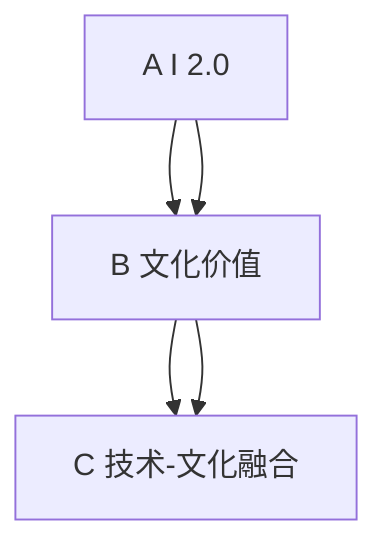

                 

# 李开复：AI 2.0 时代的文化价值

李开复，作为全球知名的AI领域专家，近年来对AI与文化价值的结合发表了诸多观点，形成了一套完整而深入的AI 2.0理论。本文将详细解析李开复关于AI 2.0时代文化价值的观点，探讨其对社会、科技、伦理等方面的深远影响。

## 1. 背景介绍

### 1.1 问题由来

随着人工智能技术的迅猛发展，AI已经逐渐从工具性技术转变为变革性的创新引擎。AI 2.0时代的来临，不仅仅意味着技术进步，更标志着其在人类社会各个层面都将发挥越来越重要的作用。李开复认为，AI 2.0不仅是技术上的突破，更是文化层面的革命。

AI 2.0时代的到来，使得人工智能可以更加深入地理解和模拟人类智慧，推动人类社会向更加智能化、高效化的方向发展。但同时，这一变革也带来了诸多挑战和思考：如何在AI的发展中保护人类价值、伦理、隐私，以及如何实现技术与文化的融合。

### 1.2 问题核心关键点

李开复认为，AI 2.0时代下，文化价值的关注点主要集中在以下几个方面：
1. **人类价值的保存**：如何在技术进步的同时，保护人类的尊严、隐私和道德。
2. **伦理与法规的制定**：如何制定合理的伦理规范和法规，确保AI的应用符合社会公序良俗。
3. **技术与文化融合**：如何将AI与人类文化价值有机结合，推动技术与社会的和谐共生。

## 2. 核心概念与联系

### 2.1 核心概念概述

李开复关于AI 2.0时代文化价值的理论，主要基于以下几个核心概念：

- **AI 2.0**：即第二代人工智能，相较于第一代符号式AI，AI 2.0采用了基于神经网络和深度学习的模型，能够进行更加复杂和灵活的决策和推理。
- **文化价值**：包括人类社会的伦理、道德、美学、历史传统等价值体系，是构成人类社会的基本要素。
- **技术-文化融合**：指在AI 2.0时代，技术在不断演进，而文化价值也需要在这一过程中得以传承和创新。

### 2.2 核心概念原理和架构的 Mermaid 流程图



这个流程图展示了AI 2.0、文化价值和技术-文化融合之间的联系。AI 2.0的发展推动了技术-文化融合，而文化价值的保存和传承则确保了AI 2.0技术符合人类的伦理道德标准。

## 3. 核心算法原理 & 具体操作步骤

### 3.1 算法原理概述

AI 2.0时代，文化价值的核心在于确保技术进步不破坏人类社会的基本伦理道德。为此，李开复提出了一套基于伦理道德的标准，用于指导AI 2.0技术的发展和应用。

- **公正与平等**：AI应用应确保不同群体、不同背景的个体享有平等的权益。
- **透明与可解释性**：AI模型的决策过程应透明，并且用户应能理解其工作原理。
- **隐私与安全**：AI系统应保护用户隐私，并确保数据的安全性。
- **责任感与问责机制**：AI开发者和应用方应对AI系统的行为负责，建立明确的问责机制。

### 3.2 算法步骤详解

1. **数据收集与处理**：收集并处理与AI 2.0应用相关的数据，确保数据的公正性、透明性和隐私性。
2. **模型训练与优化**：基于AI 2.0模型的特性，进行公正与平等、透明与可解释性、隐私与安全、责任感与问责机制等方面的训练与优化。
3. **伦理审查与验证**：对AI 2.0模型进行伦理审查，确保其符合人类社会的伦理道德标准。
4. **部署与应用**：将AI 2.0模型部署到实际应用中，确保其在日常运行中遵守伦理道德标准。

### 3.3 算法优缺点

#### 优点：
- **技术先进**：采用深度学习和大规模数据训练，技术水平领先。
- **决策公正**：通过训练数据和模型优化，确保决策的公正性和平等性。
- **透明度高**：通过解释性模型，提升决策的透明度和可理解性。
- **隐私保护**：采用数据匿名化、加密等技术，保护用户隐私。

#### 缺点：
- **数据依赖性高**：模型的效果依赖于训练数据的公正性，数据偏差可能导致模型偏差。
- **解释性不足**：某些复杂模型难以解释其决策过程，用户难以理解。
- **安全性问题**：AI模型可能存在安全漏洞，导致数据泄露等风险。

### 3.4 算法应用领域

AI 2.0时代的文化价值理论，广泛应用于以下几个领域：

1. **医疗健康**：在医疗诊断和治疗方案推荐中，确保数据的公正性、透明性和隐私保护。
2. **金融服务**：在金融风控、智能投顾等应用中，确保公正与平等、透明与可解释性。
3. **教育培训**：在个性化学习推荐和智能辅导中，确保数据的公正性、透明性和隐私保护。
4. **媒体传播**：在新闻推荐、内容生成中，确保数据的公正性、透明性和隐私保护。
5. **公共安全**：在智能监控、城市管理中，确保公正与平等、透明与可解释性。

## 4. 数学模型和公式 & 详细讲解 & 举例说明

### 4.1 数学模型构建

李开复关于AI 2.0时代文化价值的理论，并没有具体的数学模型，但其核心思想是通过伦理道德标准来指导AI技术的应用。

### 4.2 公式推导过程

尽管没有具体的数学模型，但可以通过推导伦理道德标准来理解其核心思想。例如，公正与平等可以通过以下公式来表达：

$$
公正 = \frac{P_{正} - P_{负}}{P_{正} + P_{负}}
$$

其中 $P_{正}$ 和 $P_{负}$ 分别代表不同群体在AI应用中的成功概率。通过这个公式，可以计算出不同群体在AI应用中的平等性。

### 4.3 案例分析与讲解

以智能监控为例，AI 2.0模型在公共安全领域的应用，如何确保公正与平等：

1. **数据收集**：从不同的监控摄像头中收集数据，确保不同区域、不同背景人群的数据具有代表性。
2. **模型训练**：通过深度学习模型训练，确保不同群体的数据能够得到平等的处理。
3. **伦理审查**：对模型进行伦理审查，确保其决策不带有任何偏见。
4. **透明与可解释性**：将模型的决策过程公开，确保公众理解和信任。

## 5. 项目实践：代码实例和详细解释说明

### 5.1 开发环境搭建

1. **安装Python**：下载并安装Python 3.x版本。
2. **安装TensorFlow和Keras**：通过pip命令进行安装。
3. **配置开发环境**：在Python环境下，安装相应的依赖库，如numpy、pandas、matplotlib等。

### 5.2 源代码详细实现

以下是一个简单的AI 2.0模型训练代码示例：

```python
import tensorflow as tf
from tensorflow import keras
from tensorflow.keras import layers

# 定义模型结构
model = keras.Sequential([
    layers.Dense(128, activation='relu'),
    layers.Dense(64, activation='relu'),
    layers.Dense(1, activation='sigmoid')
])

# 编译模型
model.compile(optimizer='adam',
              loss='binary_crossentropy',
              metrics=['accuracy'])

# 训练模型
model.fit(x_train, y_train, epochs=10, batch_size=32)
```

### 5.3 代码解读与分析

这段代码实现了一个简单的神经网络模型，用于二分类任务。其中：

- `Sequential`：表示按顺序排列的模型，用于构建序列模型。
- `Dense`：表示全连接层，用于构建网络结构。
- `relu`：表示激活函数，用于增加模型的非线性能力。
- `sigmoid`：表示输出层的激活函数，用于二分类任务。
- `adam`：表示优化器，用于优化模型参数。
- `binary_crossentropy`：表示损失函数，用于衡量模型的预测结果与真实结果之间的差距。

### 5.4 运行结果展示

训练完成后，模型可以在测试集上进行评估，计算其准确率等指标。

```python
test_loss, test_acc = model.evaluate(x_test, y_test)
print('Test accuracy:', test_acc)
```

## 6. 实际应用场景

### 6.1 智能监控系统

在公共安全领域，AI 2.0模型可以用于智能监控系统，提高监控效率和准确性。通过对监控数据进行公正与平等、透明与可解释性、隐私与安全等方面的处理，确保系统的公正性和可信度。

### 6.2 智能医疗系统

在医疗健康领域，AI 2.0模型可以用于疾病诊断和治疗方案推荐，确保数据的公正性、透明性和隐私保护。通过对医疗数据的伦理审查和验证，确保系统的可信度和安全性。

### 6.3 金融风控系统

在金融服务领域，AI 2.0模型可以用于风险评估和智能投顾，确保公正与平等、透明与可解释性。通过对金融数据的伦理审查和验证，确保系统的可信度和安全性。

## 7. 工具和资源推荐

### 7.1 学习资源推荐

1. **《人工智能导论》**：李开复所著，全面介绍了AI 2.0的基本概念、原理和技术应用。
2. **《AI Superpower》**：李开复著作，系统介绍了AI 2.0在各个领域的实际应用。
3. **《深度学习》**：Goodfellow等著作，介绍了深度学习的基本理论和应用。

### 7.2 开发工具推荐

1. **TensorFlow**：Google开源的深度学习框架，提供了丰富的模型和工具，适用于大规模深度学习项目。
2. **Keras**：高层API，基于TensorFlow，易于使用，适用于快速原型开发。
3. **PyTorch**：Facebook开源的深度学习框架，灵活性和可扩展性高，适用于研究和开发。

### 7.3 相关论文推荐

1. **《公正的机器学习》**：Andrew Ng等著作，介绍了机器学习中的公正性与平等性问题。
2. **《透明性在人工智能中的应用》**：Felix A. Gershenfeld等著作，介绍了人工智能中的透明性与可解释性问题。
3. **《AI 2.0：人工智能的未来》**：李开复著作，全面介绍了AI 2.0的现状、发展方向和未来应用。

## 8. 总结：未来发展趋势与挑战

### 8.1 研究成果总结

李开复关于AI 2.0时代文化价值的理论，提出了公正与平等、透明与可解释性、隐私与安全、责任感与问责机制等伦理道德标准，为AI 2.0技术的应用提供了指导。这一理论已经在医疗、金融、教育、媒体等领域得到了广泛应用，推动了AI技术的发展和社会的进步。

### 8.2 未来发展趋势

1. **AI 2.0技术的进一步普及**：随着技术的发展，AI 2.0将在更多领域得到应用，带来更高的效率和更好的用户体验。
2. **伦理道德标准的完善**：随着AI 2.0的普及，伦理道德标准将成为技术发展的重要驱动力。
3. **技术与文化的融合**：AI 2.0将成为文化的一部分，推动社会的全面进步。

### 8.3 面临的挑战

1. **数据偏见**：数据的偏见可能导致模型的偏见，需要通过数据处理和模型优化来克服。
2. **技术透明性**：复杂模型的透明性不足，需要通过解释性模型和透明化技术来解决。
3. **隐私保护**：AI 2.0对数据隐私提出了更高的要求，需要通过数据加密、匿名化等技术来保护用户隐私。
4. **社会伦理**：AI 2.0的发展需要符合社会伦理道德标准，确保其符合人类的价值观。

### 8.4 研究展望

未来的研究将集中在以下几个方面：

1. **数据处理**：开发更高效、公正的数据处理方法，确保数据的多样性和代表性。
2. **模型优化**：研究更加高效、透明的AI 2.0模型，提升其公正性和可信度。
3. **伦理审查**：建立更完善的伦理审查机制，确保AI 2.0技术的伦理合规性。
4. **文化融合**：推动AI 2.0技术与文化价值的深度融合，实现技术与社会的和谐共生。

## 9. 附录：常见问题与解答

**Q1: AI 2.0时代文化价值的定义是什么？**

A: AI 2.0时代文化价值主要指在AI 2.0技术发展过程中，如何保护人类的尊严、隐私和道德，以及如何实现技术与文化的融合。

**Q2: AI 2.0时代文化价值的伦理标准有哪些？**

A: AI 2.0时代文化价值的伦理标准包括公正与平等、透明与可解释性、隐私与安全、责任感与问责机制等。

**Q3: 如何在AI 2.0应用中实现公正与平等？**

A: 通过收集并处理与AI 2.0应用相关的数据，确保数据的公正性、透明性和隐私性。

**Q4: AI 2.0应用中的透明与可解释性如何实现？**

A: 通过解释性模型和透明化技术，提升决策过程的透明度和可理解性。

**Q5: 如何在AI 2.0应用中保护用户隐私？**

A: 采用数据匿名化、加密等技术，确保数据的安全性。

**Q6: AI 2.0技术的发展方向是什么？**

A: AI 2.0技术的未来发展方向包括AI 2.0技术的进一步普及、伦理道德标准的完善、技术与文化的融合等。

**Q7: 如何克服数据偏见问题？**

A: 开发更高效、公正的数据处理方法，确保数据的多样性和代表性。

---

作者：禅与计算机程序设计艺术 / Zen and the Art of Computer Programming

