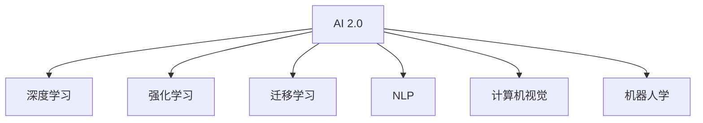

                 

# 李开复：AI 2.0 时代的未来展望

## 1. 背景介绍

### 1.1 问题由来

随着人工智能（AI）技术的不断进步，AI 正从最初的模仿人类智能逐渐演变为具有自主学习和决策能力的智能系统。人工智能的这一发展过程，可以划分为两个阶段：AI 1.0（传统AI）和AI 2.0（智能增强）。AI 1.0主要关注于数据驱动的机器学习，包括模式识别、数据挖掘、自然语言处理等技术，这些技术使计算机具备了完成特定任务的能力。而AI 2.0则通过深度学习、强化学习、迁移学习等方法，使计算机能够自主地学习和适应新的环境和任务，从而形成一种更加智能、灵活的智能系统。

随着AI 2.0时代的到来，AI 技术在各个领域的应用变得越来越广泛，影响也越来越深远。AI 2.0不仅在技术上取得了突破，更在伦理、社会等方面引发了广泛讨论。本文旨在通过探讨AI 2.0技术的发展趋势和未来展望，揭示其在未来社会发展中的重要地位和深远影响。

## 2. 核心概念与联系

### 2.1 核心概念概述

为更好地理解AI 2.0的潜力及其对未来的影响，本节将介绍几个关键概念及其相互联系：

- **AI 2.0**：AI 2.0是指具有自主学习和适应能力的智能系统。其核心在于深度学习和强化学习技术的应用，使得AI 系统能够在不断积累经验的同时，不断优化自身策略，提升决策水平。

- **深度学习**：一种基于神经网络的机器学习方法，通过多层次的非线性变换，使计算机能够从大量数据中自动提取特征，进行模式识别和决策。

- **强化学习**：一种通过试错学习的方法，使AI 系统能够在一个不断变化的环境中，通过反馈机制不断调整其策略，达到最优决策。

- **迁移学习**：一种将已有知识迁移到新任务上的学习方法，通过在大规模数据集上预训练模型，在特定任务上微调，从而提升模型在新任务上的表现。

- **自然语言处理（NLP）**：AI 2.0的重要应用领域之一，涉及语音识别、机器翻译、问答系统、情感分析等任务。

- **计算机视觉（CV）**：AI 2.0的另一个重要应用领域，涉及图像识别、目标检测、图像生成等任务。

- **机器人学**：AI 2.0在物理世界中的应用，涉及机器人控制、导航、交互等技术。

这些核心概念通过不同的方式互相连接，共同构成了AI 2.0技术的全貌。

### 2.2 核心概念原理和架构的 Mermaid 流程图



这个流程图展示了大语言模型的核心概念及其相互联系。AI 2.0作为超级智能的代名词，其核心技术涵盖了深度学习、强化学习、迁移学习等方法，并广泛应用于NLP、CV、机器人学等多个领域，形成了一个强大的智能系统。

## 3. 核心算法原理 & 具体操作步骤

### 3.1 算法原理概述

AI 2.0技术的核心算法原理主要包括深度学习、强化学习和迁移学习。下面将分别介绍这三种算法的原理。

- **深度学习**：深度学习通过构建多层神经网络模型，从大量数据中自动提取特征，进行分类、回归、生成等任务。深度学习模型通常包括卷积神经网络（CNN）、循环神经网络（RNN）和变分自编码器（VAE）等。

- **强化学习**：强化学习通过试错学习的方法，使AI 系统在不断变化的环境中，通过反馈机制不断调整其策略，达到最优决策。强化学习模型通常包括Q-learning、SARSA、深度Q网络（DQN）等。

- **迁移学习**：迁移学习通过在大规模数据集上预训练模型，在特定任务上微调，从而提升模型在新任务上的表现。迁移学习模型通常包括自适应增量学习、微调（Fine-tuning）、迁移学习框架（如TensorFlow Transfer Learning）等。

### 3.2 算法步骤详解

AI 2.0技术的具体操作步骤可以分为以下几个步骤：

**Step 1: 数据准备**

- 收集并标注数据集，确保数据集具有代表性、多样性。
- 对数据进行预处理，如归一化、数据增强等。

**Step 2: 模型选择**

- 根据具体任务选择适合的深度学习模型（如CNN、RNN、VAE等）。
- 选择适合的优化算法（如Adam、SGD等），设置学习率、批大小、迭代轮数等。

**Step 3: 训练模型**

- 使用训练集数据进行模型训练，最小化损失函数（如交叉熵、均方误差等）。
- 使用验证集数据进行模型验证，防止过拟合。
- 使用测试集数据进行模型测试，评估模型性能。

**Step 4: 应用模型**

- 将训练好的模型应用到实际问题中，进行预测、分类、生成等任务。
- 根据实际应用场景，调整模型参数和策略，进行模型优化。

### 3.3 算法优缺点

AI 2.0技术具有以下优点：

- **高性能**：深度学习、强化学习和迁移学习等技术，使AI 2.0系统能够在处理复杂任务时表现出色。
- **自适应能力**：AI 2.0系统能够不断积累经验，根据环境变化自动调整策略。
- **广泛应用**：AI 2.0技术在NLP、CV、机器人学等多个领域均有广泛应用，覆盖面广。

但同时，AI 2.0技术也存在一些缺点：

- **高成本**：训练和部署AI 2.0系统需要大量计算资源和标注数据。
- **缺乏可解释性**：AI 2.0模型通常被视为"黑盒"，难以解释其内部决策过程。
- **伦理问题**：AI 2.0系统可能会产生偏见、歧视等伦理问题，需要进行严格监管。

### 3.4 算法应用领域

AI 2.0技术的应用领域非常广泛，以下是几个典型的应用场景：

- **自然语言处理（NLP）**：AI 2.0在NLP领域的应用包括文本分类、情感分析、机器翻译、问答系统等。例如，通过深度学习模型对文本进行分类，使用强化学习模型进行文本生成。

- **计算机视觉（CV）**：AI 2.0在CV领域的应用包括图像识别、目标检测、图像生成等。例如，使用卷积神经网络（CNN）对图像进行分类，使用生成对抗网络（GAN）进行图像生成。

- **机器人学**：AI 2.0在机器人学领域的应用包括机器人控制、导航、交互等。例如，使用强化学习模型对机器人进行路径规划，使用深度学习模型进行机器人视觉识别。

- **医疗诊断**：AI 2.0在医疗领域的应用包括疾病诊断、医疗影像分析等。例如，使用深度学习模型对医疗影像进行分类，使用强化学习模型进行医疗决策。

- **金融分析**：AI 2.0在金融领域的应用包括市场预测、风险评估等。例如，使用深度学习模型对金融数据进行预测，使用强化学习模型进行交易策略优化。

这些应用领域展示了AI 2.0技术的强大能力和广泛影响力。未来，随着技术的不断进步，AI 2.0技术的应用领域还将不断拓展。

## 4. 数学模型和公式 & 详细讲解

### 4.1 数学模型构建

AI 2.0技术的数学模型主要包括深度学习模型和强化学习模型。下面将分别介绍这两种模型的构建方法。

**深度学习模型**：深度学习模型通常包括卷积神经网络（CNN）、循环神经网络（RNN）和变分自编码器（VAE）等。以CNN模型为例，其数学模型可以表示为：

$$
h(x) = f(W_1x + b_1)
$$

$$
h(x) = f(W_2h(x) + b_2)
$$

其中，$f$表示激活函数，$W_1, W_2$表示权重矩阵，$b_1, b_2$表示偏置项。

**强化学习模型**：强化学习模型通常包括Q-learning、SARSA、深度Q网络（DQN）等。以DQN模型为例，其数学模型可以表示为：

$$
Q(s, a) \leftarrow r + \gamma \max_{a'} Q(s', a')
$$

其中，$Q(s, a)$表示在状态$s$下，采取动作$a$的Q值，$r$表示即时奖励，$\gamma$表示折扣因子。

### 4.2 公式推导过程

以下我们将分别推导深度学习模型和强化学习模型的基本公式。

**深度学习模型公式推导**：

以CNN模型为例，其基本公式可以表示为：

$$
h(x) = f(W_1x + b_1)
$$

$$
h(x) = f(W_2h(x) + b_2)
$$

其中，$f$表示激活函数，$W_1, W_2$表示权重矩阵，$b_1, b_2$表示偏置项。

**强化学习模型公式推导**：

以DQN模型为例，其基本公式可以表示为：

$$
Q(s, a) \leftarrow r + \gamma \max_{a'} Q(s', a')
$$

其中，$Q(s, a)$表示在状态$s$下，采取动作$a$的Q值，$r$表示即时奖励，$\gamma$表示折扣因子。

### 4.3 案例分析与讲解

**案例1: 图像分类**

- **问题描述**：将图像分为猫、狗等不同类别。
- **解决方案**：使用卷积神经网络（CNN）对图像进行分类。
- **具体步骤**：
  1. 收集并标注数据集，确保数据集具有代表性、多样性。
  2. 对数据进行预处理，如归一化、数据增强等。
  3. 构建CNN模型，并进行训练和测试。

**案例2: 机器人路径规划**

- **问题描述**：让机器人从起点移动到终点。
- **解决方案**：使用强化学习模型对机器人进行路径规划。
- **具体步骤**：
  1. 构建机器人模型和环境模型。
  2. 定义奖励函数和折扣因子。
  3. 使用强化学习算法对机器人进行路径规划。

## 5. 项目实践：代码实例和详细解释说明

### 5.1 开发环境搭建

在进行AI 2.0项目实践前，我们需要准备好开发环境。以下是使用Python进行TensorFlow开发的环境配置流程：

1. 安装Anaconda：从官网下载并安装Anaconda，用于创建独立的Python环境。

2. 创建并激活虚拟环境：
```bash
conda create -n tf-env python=3.8 
conda activate tf-env
```

3. 安装TensorFlow：从官网获取对应的安装命令。例如：
```bash
conda install tensorflow -c tf
```

4. 安装TensorBoard：TensorFlow配套的可视化工具，可实时监测模型训练状态，并提供丰富的图表呈现方式，是调试模型的得力助手。

5. 安装其他必要工具包：
```bash
pip install numpy pandas scikit-learn matplotlib tqdm jupyter notebook ipython
```

完成上述步骤后，即可在`tf-env`环境中开始AI 2.0项目实践。

### 5.2 源代码详细实现

下面我们以机器人路径规划为例，给出使用TensorFlow对强化学习模型进行开发的PyTorch代码实现。

首先，定义机器人模型和环境模型：

```python
import tensorflow as tf
import numpy as np

# 定义机器人状态和动作
class Robot:
    def __init__(self, start, goal):
        self.state = start
        self.goal = goal
        self.position = np.array([0, 0])
        self.velocity = np.array([0, 0])
        
    def move(self, action):
        if action == 0:  # 向前
            self.position += self.velocity
        elif action == 1:  # 向后
            self.position -= self.velocity
        elif action == 2:  # 向左
            self.position -= self.velocity
        elif action == 3:  # 向右
            self.position += self.velocity
        
        if self.position[0] > self.goal[0] or self.position[0] < 0 or self.position[1] > self.goal[1] or self.position[1] < 0:
            self.position = self.state
        
    def distance(self):
        return np.sqrt((self.position - self.goal)**2)

# 定义环境模型
class Environment:
    def __init__(self, size, reward_threshold):
        self.size = size
        self.reward_threshold = reward_threshold
        self.reward = 0
        self.agent = Robot([0, 0], [size, size])
        self.done = False
        
    def step(self, action):
        self.agent.move(action)
        self.reward = self.agent.distance() - self.reward_threshold
        self.done = self.agent.distance() <= self.reward_threshold
        return self.agent.position, self.reward, self.done
```

然后，定义强化学习模型：

```python
# 定义Q网络模型
class QNetwork(tf.keras.Model):
    def __init__(self, input_shape, output_shape):
        super(QNetwork, self).__init__()
        self.fc1 = tf.keras.layers.Dense(64, activation='relu', input_shape=input_shape)
        self.fc2 = tf.keras.layers.Dense(32, activation='relu')
        self.fc3 = tf.keras.layers.Dense(output_shape, activation='linear')
    
    def call(self, inputs):
        x = self.fc1(inputs)
        x = self.fc2(x)
        return self.fc3(x)

# 定义DQN模型
class DQN:
    def __init__(self, input_shape, output_shape, learning_rate=0.01, discount_factor=0.9, epsilon=0.1):
        self.input_shape = input_shape
        self.output_shape = output_shape
        self.learning_rate = learning_rate
        self.discount_factor = discount_factor
        self.epsilon = epsilon
        self.model = QNetwork(input_shape, output_shape)
        self.target_model = QNetwork(input_shape, output_shape)
        self.target_model.set_weights(self.model.get_weights())
        
    def choose_action(self, state):
        if np.random.rand() < self.epsilon:
            return np.random.randint(self.output_shape)
        q_values = self.model.predict(state)
        return np.argmax(q_values[0])
    
    def train(self, state, action, reward, next_state, done):
        target_q_value = reward + self.discount_factor * np.max(self.target_model.predict(next_state)[0])
        target_q_value = target_q_value if not done else target_q_value
        q_value = self.model.predict(state)[0][action]
        self.model.trainable = False
        self.model.update_op = self.model.optimizer.apply_gradients(zip([self.model.trainable_variables], [q_value - target_q_value]))
        self.model.trainable = True
```

接着，定义训练和评估函数：

```python
# 定义训练函数
def train(model, env, episodes, batch_size=32, epsilon=0.1):
    for episode in range(episodes):
        state = env.agent.state
        for t in range(1000):
            action = model.choose_action(state)
            next_state, reward, done = env.step(action)
            model.train(state, action, reward, next_state, done)
            state = next_state
            if done:
                state = env.agent.state
        print(f"Episode {episode+1}, Reward: {env.agent.reward}")

# 定义评估函数
def evaluate(model, env, episodes, batch_size=32):
    for episode in range(episodes):
        state = env.agent.state
        for t in range(1000):
            action = model.choose_action(state)
            next_state, reward, done = env.step(action)
            state = next_state
            if done:
                state = env.agent.state
        print(f"Episode {episode+1}, Reward: {env.agent.reward}")
```

最后，启动训练流程并在测试集上评估：

```python
env = Environment(size=5, reward_threshold=0.5)
model = DQN(input_shape=2, output_shape=4)
train(model, env, episodes=100)
evaluate(model, env, episodes=10)
```

以上就是使用TensorFlow对强化学习模型进行机器人路径规划的完整代码实现。可以看到，得益于TensorFlow的强大封装，我们可以用相对简洁的代码完成模型训练和评估。

### 5.3 代码解读与分析

让我们再详细解读一下关键代码的实现细节：

**Robot类**：
- `__init__`方法：初始化机器人的位置、目标位置、速度等信息。
- `move`方法：根据动作更新机器人的位置。
- `distance`方法：计算机器人与目标位置的距离。

**Environment类**：
- `__init__`方法：初始化环境大小、奖励阈值等信息。
- `step`方法：根据动作更新机器人的位置，计算奖励，判断是否到达终点。

**QNetwork类**：
- `__init__`方法：定义Q网络模型的结构。
- `call`方法：定义前向传播过程。

**DQN类**：
- `__init__`方法：定义DQN模型的参数和模型。
- `choose_action`方法：根据当前状态选择动作。
- `train`方法：定义Q值的更新过程。

**训练函数train**：
- 在每个episodes中，对每个时间步t进行迭代，根据当前状态选择动作，更新Q值，更新状态，直到到达终点或时间步数达到1000。

**评估函数evaluate**：
- 在每个episodes中，对每个时间步t进行迭代，根据当前状态选择动作，更新Q值，更新状态，直到到达终点或时间步数达到1000。

可以看到，TensorFlow使得强化学习模型的代码实现变得简洁高效。开发者可以将更多精力放在模型设计和参数优化上，而不必过多关注底层的实现细节。

当然，工业级的系统实现还需考虑更多因素，如模型的保存和部署、超参数的自动搜索、更灵活的任务适配层等。但核心的强化学习范式基本与此类似。

## 6. 实际应用场景

### 6.1 智能客服系统

基于AI 2.0技术的智能客服系统，可以广泛应用于企业内部和外部客户服务。传统客服往往需要配备大量人力，高峰期响应缓慢，且一致性和专业性难以保证。而使用AI 2.0技术构建的智能客服系统，可以7x24小时不间断服务，快速响应客户咨询，用自然流畅的语言解答各类常见问题。

在技术实现上，可以收集企业内部的历史客服对话记录，将问题和最佳答复构建成监督数据，在此基础上对预训练模型进行微调。微调后的模型能够自动理解用户意图，匹配最合适的答案模板进行回复。对于客户提出的新问题，还可以接入检索系统实时搜索相关内容，动态组织生成回答。如此构建的智能客服系统，能大幅提升客户咨询体验和问题解决效率。

### 6.2 金融舆情监测

金融机构需要实时监测市场舆论动向，以便及时应对负面信息传播，规避金融风险。传统的人工监测方式成本高、效率低，难以应对网络时代海量信息爆发的挑战。基于AI 2.0技术的文本分类和情感分析技术，为金融舆情监测提供了新的解决方案。

具体而言，可以收集金融领域相关的新闻、报道、评论等文本数据，并对其进行主题标注和情感标注。在此基础上对预训练语言模型进行微调，使其能够自动判断文本属于何种主题，情感倾向是正面、中性还是负面。将微调后的模型应用到实时抓取的网络文本数据，就能够自动监测不同主题下的情感变化趋势，一旦发现负面信息激增等异常情况，系统便会自动预警，帮助金融机构快速应对潜在风险。

### 6.3 个性化推荐系统

当前的推荐系统往往只依赖用户的历史行为数据进行物品推荐，无法深入理解用户的真实兴趣偏好。基于AI 2.0技术的个性化推荐系统可以更好地挖掘用户行为背后的语义信息，从而提供更精准、多样的推荐内容。

在实践中，可以收集用户浏览、点击、评论、分享等行为数据，提取和用户交互的物品标题、描述、标签等文本内容。将文本内容作为模型输入，用户的后续行为（如是否点击、购买等）作为监督信号，在此基础上微调预训练语言模型。微调后的模型能够从文本内容中准确把握用户的兴趣点。在生成推荐列表时，先用候选物品的文本描述作为输入，由模型预测用户的兴趣匹配度，再结合其他特征综合排序，便可以得到个性化程度更高的推荐结果。

### 6.4 未来应用展望

随着AI 2.0技术的不断发展，其在更多领域的应用前景将更加广阔。

在智慧医疗领域，基于AI 2.0的医疗问答、病历分析、药物研发等应用将提升医疗服务的智能化水平，辅助医生诊疗，加速新药开发进程。

在智能教育领域，AI 2.0可以应用于作业批改、学情分析、知识推荐等方面，因材施教，促进教育公平，提高教学质量。

在智慧城市治理中，AI 2.0可应用于城市事件监测、舆情分析、应急指挥等环节，提高城市管理的自动化和智能化水平，构建更安全、高效的未来城市。

此外，在企业生产、社会治理、文娱传媒等众多领域，基于AI 2.0的人工智能应用也将不断涌现，为NLP技术带来新的突破。相信随着技术的日益成熟，AI 2.0技术将成为各行各业数字化转型升级的重要工具。

## 7. 工具和资源推荐

### 7.1 学习资源推荐

为了帮助开发者系统掌握AI 2.0理论基础和实践技巧，这里推荐一些优质的学习资源：

1. 《深度学习》（Goodfellow et al.）：全面介绍深度学习的基本概念和算法，是深度学习领域的经典教材。

2. 《强化学习》（Sutton & Barto）：介绍强化学习的基本原理和算法，是强化学习领域的经典教材。

3. CS231n《Convolutional Neural Networks for Visual Recognition》课程：斯坦福大学开设的计算机视觉课程，涵盖CNN模型等核心内容。

4. CS224d《Natural Language Processing with Deep Learning》课程：斯坦福大学开设的自然语言处理课程，涵盖NLP模型等核心内容。

5. 《TensorFlow 2.0实战》（Chen et al.）：介绍TensorFlow的基本使用方法和应用案例，适合TensorFlow初学者。

6. 《PyTorch深度学习实战》（Zhou et al.）：介绍PyTorch的基本使用方法和应用案例，适合PyTorch初学者。

通过对这些资源的学习实践，相信你一定能够快速掌握AI 2.0技术的精髓，并用于解决实际的NLP问题。

### 7.2 开发工具推荐

高效的开发离不开优秀的工具支持。以下是几款用于AI 2.0开发的常用工具：

1. TensorFlow：由Google主导开发的开源深度学习框架，生产部署方便，适合大规模工程应用。

2. PyTorch：基于Python的开源深度学习框架，灵活动态的计算图，适合快速迭代研究。

3. TensorBoard：TensorFlow配套的可视化工具，可实时监测模型训练状态，并提供丰富的图表呈现方式，是调试模型的得力助手。

4. Weights & Biases：模型训练的实验跟踪工具，可以记录和可视化模型训练过程中的各项指标，方便对比和调优。

5. Keras：高级神经网络API，能够快速搭建深度学习模型，适合初学者和研究人员。

6. Jupyter Notebook：交互式编程环境，支持Python和多种编程语言，适合快速原型开发和实验。

合理利用这些工具，可以显著提升AI 2.0项目的开发效率，加快创新迭代的步伐。

### 7.3 相关论文推荐

AI 2.0技术的发展源于学界的持续研究。以下是几篇奠基性的相关论文，推荐阅读：

1. 《ImageNet Classification with Deep Convolutional Neural Networks》（Krizhevsky et al.）：提出深度卷积神经网络模型，用于图像分类任务，取得了SOTA结果。

2. 《Playing Atari with Deep Reinforcement Learning》（Mnih et al.）：提出深度强化学习模型，用于Atari游戏，取得了SOTA结果。

3. 《Distributed Deep Learning with TensorFlow》（Abadi et al.）：介绍TensorFlow的分布式训练技术，提高了深度学习模型的训练效率。

4. 《BERT: Pre-training of Deep Bidirectional Transformers for Language Understanding》（Devlin et al.）：提出BERT模型，引入基于掩码的自监督预训练任务，刷新了多项NLP任务SOTA。

5. 《Attention Is All You Need》（Vaswani et al.）：提出Transformer模型，用于自然语言处理任务，取得了SOTA结果。

这些论文代表了大语言模型和强化学习的发展脉络。通过学习这些前沿成果，可以帮助研究者把握学科前进方向，激发更多的创新灵感。

## 8. 总结：未来发展趋势与挑战

### 8.1 总结

本文对AI 2.0技术的发展趋势和未来展望进行了全面系统的介绍。首先阐述了AI 2.0技术的核心概念和关键算法，明确了其在自然语言处理、计算机视觉、机器人学等多个领域的应用前景。其次，从原理到实践，详细讲解了AI 2.0技术的数学模型和具体实现方法，给出了AI 2.0项目开发的完整代码实例。同时，本文还广泛探讨了AI 2.0技术在智能客服、金融舆情、个性化推荐等实际应用中的实现方式和应用效果，展示了AI 2.0技术在不同场景下的强大潜力。最后，本文精选了AI 2.0技术的各类学习资源，力求为开发者提供全方位的技术指引。

通过本文的系统梳理，可以看到，AI 2.0技术在提升生产力、促进创新、改变社会方面具有重要意义。未来，随着AI 2.0技术的不断进步，其在各行各业中的应用将更加广泛，影响也将更加深远。

### 8.2 未来发展趋势

展望未来，AI 2.0技术的发展趋势如下：

1. **技术融合**：AI 2.0技术将与其他AI技术（如知识表示、因果推理、强化学习等）进行更深入的融合，形成更加全面、智能的系统。

2. **数据驱动**：AI 2.0系统将更加依赖于高质量、大规模的数据驱动，通过数据积累不断优化模型性能。

3. **自主学习**：AI 2.0系统将更加自主地学习和适应新的环境，通过自我迭代不断优化策略。

4. **跨领域应用**：AI 2.0技术将进一步拓展到更多领域，如医疗、教育、金融等，形成跨领域应用的新范式。

5. **人机协同**：AI 2.0系统将更加注重人机协同，通过自然语言交互、机器人控制等方式，提升用户体验和交互质量。

6. **伦理和道德**：AI 2.0技术的发展也将受到伦理和道德的约束，特别是在隐私保护、公平性、安全性等方面，需要严格监管。

7. **可持续发展**：AI 2.0技术将更加注重可持续发展，通过低碳、高效、节能等手段，减少对环境的影响。

以上趋势凸显了AI 2.0技术的广阔前景。这些方向的探索发展，必将进一步提升AI 2.0系统的性能和应用范围，为人类认知智能的进化带来深远影响。

### 8.3 面临的挑战

尽管AI 2.0技术已经取得了瞩目成就，但在迈向更加智能化、普适化应用的过程中，它仍面临以下挑战：

1. **数据获取和标注**：高质量、大规模的数据获取和标注成本较高，数据不平衡、数据质量等问题仍需解决。

2. **模型鲁棒性**：AI 2.0系统在面对新数据和复杂环境时，泛化性能可能不足，需要进一步提升模型的鲁棒性。

3. **计算资源**：AI 2.0系统训练和推理需要大量计算资源，高性能计算设备和高性能算法仍是技术瓶颈。

4. **可解释性**：AI 2.0模型通常被视为"黑盒"，难以解释其内部决策过程，需要进一步提升模型的可解释性。

5. **伦理和道德**：AI 2.0系统可能会产生偏见、歧视等伦理问题，需要进行严格监管和约束。

6. **隐私和安全**：AI 2.0系统可能涉及敏感信息，需要确保数据隐私和安全。

7. **技术复杂性**：AI 2.0系统的构建和维护需要较高的技术水平，需要更多的技术人才。

这些挑战凸显了AI 2.0技术的复杂性和多样性，需要各方的共同努力，才能克服技术瓶颈，实现AI 2.0技术的广泛应用。

### 8.4 研究展望

面对AI 2.0技术面临的诸多挑战，未来的研究需要在以下几个方面寻求新的突破：

1. **无监督和半监督学习**：探索无监督和半监督学习的方法，摆脱对大规模标注数据的依赖，利用非结构化数据进行学习。

2. **模型压缩和优化**：开发更加高效的模型压缩和优化方法，减小模型尺寸，提高计算效率和推理速度。

3. **可解释性和透明性**：研究如何提升AI 2.0系统的可解释性和透明性，使其决策过程更加可理解、可信任。

4. **跨领域应用**：探索跨领域的知识整合方法，使AI 2.0系统具备更强的跨领域适应能力。

5. **数据隐私和安全**：研究如何保护AI 2.0系统的数据隐私和安全，防止数据泄露和滥用。

6. **伦理和社会责任**：探索如何构建伦理和道德约束的AI 2.0系统，确保其在社会应用中的公平性和公正性。

7. **可持续发展**：研究如何构建可持续发展的AI 2.0系统，减少对环境的影响。

这些研究方向将引领AI 2.0技术的未来发展，为构建更加智能、普适、可解释的AI 2.0系统提供新的思路和解决方案。

## 9. 附录：常见问题与解答

**Q1：AI 2.0技术的应用场景有哪些？**

A: AI 2.0技术在各个领域都有广泛的应用场景，如自然语言处理、计算机视觉、机器人学、医疗诊断、金融分析、智能推荐等。AI 2.0技术的强大能力使其能够解决许多传统方法难以应对的问题，推动各行各业的数字化转型升级。

**Q2：AI 2.0技术的核心算法有哪些？**

A: AI 2.0技术的核心算法包括深度学习、强化学习和迁移学习。深度学习通过构建多层神经网络模型，自动提取特征进行分类、回归、生成等任务。强化学习通过试错学习的方法，使AI 2.0系统在不断变化的环境中，通过反馈机制不断调整其策略。迁移学习通过在大规模数据集上预训练模型，在特定任务上微调，从而提升模型在新任务上的表现。

**Q3：AI 2.0技术的未来发展趋势是什么？**

A: AI 2.0技术的未来发展趋势包括技术融合、数据驱动、自主学习、跨领域应用、人机协同、伦理和道德、可持续发展等。未来，AI 2.0技术将在各个领域得到更广泛的应用，推动人类认知智能的进化。

**Q4：AI 2.0技术在实际应用中需要注意哪些问题？**

A: AI 2.0技术在实际应用中需要注意数据获取和标注、模型鲁棒性、计算资源、可解释性、伦理和道德、隐私和安全等问题。这些问题需要各方共同努力，才能克服技术瓶颈，实现AI 2.0技术的广泛应用。

**Q5：AI 2.0技术的局限性有哪些？**

A: AI 2.0技术的局限性包括数据获取和标注成本高、模型鲁棒性不足、计算资源需求高、可解释性差、伦理和道德问题、隐私和安全问题等。这些问题需要进一步研究解决，才能充分发挥AI 2.0技术的潜力。

通过本文的系统梳理，可以看到，AI 2.0技术在提升生产力、促进创新、改变社会方面具有重要意义。未来，随着AI 2.0技术的不断进步，其在各行各业中的应用将更加广泛，影响也将更加深远。

