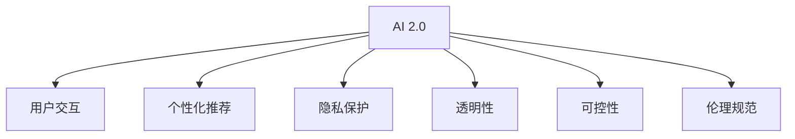

                 

# 李开复：AI 2.0 时代的用户

> 关键词：AI 2.0, 用户, 人工智能, 自动化, 深度学习, 数据驱动, 个性化体验, 人工智能伦理

## 1. 背景介绍

### 1.1 问题由来
人工智能(AI)的发展已经经历了两个重要阶段：

1. **AI 1.0（传统AI）**：基于专家系统、符号逻辑等传统计算机科学知识，解决特定领域的问题。
2. **AI 2.0（现代AI）**：以数据驱动、深度学习为核心的全新范式，能够从大规模数据中学习到高级别的抽象和规律，具备更强的泛化能力和适应性。

随着AI 2.0时代的到来，AI技术正在以前所未有的速度和规模融入我们的日常生活，从智能音箱、智能家居、自动驾驶，到医疗诊断、金融分析、教育培训等，AI的应用领域日益广泛。用户不再是被动接受AI服务，而是成为了AI系统的重要组成部分。

### 1.2 问题核心关键点
AI 2.0时代的用户主要关注以下几个核心问题：

1. **个性化体验**：如何在AI系统中实现高度个性化的内容推荐、任务定制等，提高用户的满意度和粘性。
2. **隐私保护**：AI系统如何收集、使用和管理用户数据，避免侵犯用户隐私和数据安全。
3. **透明性**：AI系统如何让用户了解其决策过程，增强信任感和接受度。
4. **可控性**：用户如何更好地控制和操作AI系统，避免被AI决策误导或过度依赖。
5. **伦理规范**：AI系统如何遵守伦理规范，防止偏见、歧视等不良行为，保障社会公正。

本文旨在探讨AI 2.0时代用户的上述问题，并提出相应的解决方案。

## 2. 核心概念与联系

### 2.1 核心概念概述

为更好地理解AI 2.0时代用户的相关问题，本节将介绍几个核心概念：

- **AI 2.0**：以数据驱动、深度学习为核心的AI新范式，能够从大规模数据中学习到高级别的抽象和规律，具备更强的泛化能力和适应性。
- **用户交互**：用户与AI系统之间的交互过程，包括输入、接收输出、反馈等环节。
- **个性化推荐**：AI系统根据用户的历史行为、偏好等，推荐定制化的内容或服务，提升用户体验。
- **隐私保护**：在数据收集和处理过程中，保障用户隐私和数据安全。
- **透明性**：AI系统的决策过程和算法原理对用户透明，增强用户信任感。
- **可控性**：用户能够控制AI系统的行为，避免被系统误导或过度依赖。
- **伦理规范**：AI系统在设计和应用中应遵守的伦理原则，如公平、无偏见、责任归属等。

这些核心概念之间的逻辑关系可以通过以下Mermaid流程图来展示：



这个流程图展示了大语言模型的核心概念及其之间的关系：

1. AI 2.0时代，个性化推荐、隐私保护、透明性、可控性和伦理规范等概念相互交织。
2. 用户交互是大语言模型工作的基础，个性化推荐、隐私保护、透明性、可控性和伦理规范等概念都是基于用户交互的实现。

## 3. 核心算法原理 & 具体操作步骤
### 3.1 算法原理概述

AI 2.0时代的用户问题解决，本质上是一个多目标优化问题。其核心思想是：构建一个能够综合个性化体验、隐私保护、透明性、可控性和伦理规范的AI系统，通过优化算法最大化用户的满意度。

假设用户满意度函数为 $S(u)$，其中 $u$ 为AI系统的输入参数（如推荐算法、隐私设置、决策透明度等），则最大化用户满意度的目标函数为：

$$
\max_{u} S(u)
$$

AI系统通过数据分析、模型训练等手段，不断调整 $u$ 的值，最终得到用户满意的最大值。

### 3.2 算法步骤详解

AI 2.0时代的用户问题解决，一般包括以下几个关键步骤：

**Step 1: 数据收集与处理**
- 收集用户的历史行为数据、偏好数据、反馈数据等，构建用户画像。
- 通过数据分析和数据预处理，清洗和处理数据，构建用户行为模型。

**Step 2: 模型训练与优化**
- 基于用户行为模型，选择合适的算法模型（如协同过滤、深度学习等）进行训练。
- 在训练过程中，不断调整模型参数，优化用户满意度。

**Step 3: 隐私保护与安全**
- 在数据收集和处理过程中，应用数据加密、匿名化等技术，保障用户隐私。
- 对敏感数据进行严格访问控制，防止未经授权的访问。

**Step 4: 透明性与可解释性**
- 使用可解释性技术（如LIME、SHAP等），解释AI系统的决策过程。
- 在用户界面中展示决策依据和逻辑，增强用户对系统的信任。

**Step 5: 系统集成与部署**
- 将训练好的AI系统集成到实际应用中，提供个性化推荐、智能问答等服务。
- 对AI系统进行持续监控和优化，确保系统的稳定性和安全性。

**Step 6: 用户反馈与迭代优化**
- 收集用户对AI系统的反馈，分析用户满意度。
- 根据用户反馈，不断优化AI系统，提高用户体验。

### 3.3 算法优缺点

AI 2.0时代用户问题的解决，具有以下优点：

1. 综合优化：通过多目标优化算法，兼顾个性化、隐私、透明性、可控性和伦理等多方面因素，提升用户整体满意度。
2. 数据驱动：基于大量用户行为数据进行训练，能够更好地适应用户的真实需求。
3. 可解释性强：使用可解释性技术，增强AI系统的透明度，便于用户理解和使用。

同时，该方法也存在一定的局限性：

1. 数据隐私问题：在数据收集和处理过程中，需要平衡个性化需求与用户隐私保护，难度较大。
2. 算法复杂度高：多目标优化问题计算复杂，需要高效的算法和丰富的计算资源。
3. 泛化能力不足：用户个性化需求和行为多样，模型泛化能力有限，难以应对极端情况。
4. 伦理困境：AI系统的决策过程可能受到偏见、歧视等伦理问题的影响，需慎重处理。

尽管存在这些局限性，但就目前而言，多目标优化范式仍是AI 2.0时代用户问题解决的重要手段。未来相关研究的重点在于如何进一步优化算法，降低数据隐私风险，提高模型泛化能力，同时兼顾可解释性和伦理安全性等因素。

### 3.4 算法应用领域

AI 2.0时代用户问题的解决，在以下几个领域已经得到了广泛应用：

- 智能推荐系统：如Netflix、Amazon等平台的个性化内容推荐。通过多目标优化算法，提升用户满意度和留存率。
- 智能客服系统：如阿里巴巴、腾讯等公司的智能客服机器人。结合用户反馈和行为数据，不断优化模型，提升客户体验。
- 智能医疗系统：如IBM Watson等系统的医疗诊断和治疗建议。通过多目标优化算法，综合考虑疾病特征、用药历史和患者偏好，提供个性化诊疗方案。
- 智能金融系统：如智能投顾、智能风控等金融应用。通过多目标优化算法，提高金融服务的个性化和精准度。
- 智能教育系统：如Khan Academy等教育平台。通过多目标优化算法，根据学生的学习行为和反馈，提供个性化学习资源和教学策略。

此外，AI 2.0技术还广泛应用于智能家居、智能交通、智能制造等多个领域，为用户带来更智能、便捷、个性化的生活体验。

## 4. 数学模型和公式 & 详细讲解 & 举例说明

### 4.1 数学模型构建

本节将使用数学语言对AI 2.0时代用户问题解决的数学原理进行更加严格的刻画。

假设用户行为数据为 $x$，AI系统的推荐算法为 $y$，用户满意度为 $S$。则用户满意度函数可以表示为：

$$
S(y|x) = f(x; y)
$$

其中 $f$ 为可训练的函数，通过模型训练优化。

### 4.2 公式推导过程

假设 $f$ 为线性回归模型，则用户满意度函数可以表示为：

$$
S(y|x) = \sum_i \alpha_i x_i y_i + \beta
$$

其中 $\alpha_i$ 为模型系数，$\beta$ 为截距。

目标函数为：

$$
\max_{y} S(y|x) = \max_{y} \sum_i \alpha_i x_i y_i + \beta
$$

为了求解该优化问题，可以使用梯度下降等优化算法，逐步调整模型参数 $y$，使其最大化用户满意度。

### 4.3 案例分析与讲解

假设我们有一个智能推荐系统，旨在为用户推荐个性化电影。收集用户的历史观影记录 $x$ 和评分 $y$，构建用户行为模型 $f$。使用梯度下降算法优化模型参数 $y$，使其最大化用户满意度。

具体实现步骤如下：

1. 收集用户历史观影记录和评分，构建用户行为模型 $f$。
2. 设定优化目标函数 $S(y|x)$，使用梯度下降算法求解。
3. 根据用户反馈，调整模型参数 $y$，优化用户满意度。

## 5. 项目实践：代码实例和详细解释说明
### 5.1 开发环境搭建

在进行AI 2.0时代用户问题解决的项目实践前，我们需要准备好开发环境。以下是使用Python进行TensorFlow开发的环境配置流程：

1. 安装Anaconda：从官网下载并安装Anaconda，用于创建独立的Python环境。

2. 创建并激活虚拟环境：
```bash
conda create -n tf-env python=3.8 
conda activate tf-env
```

3. 安装TensorFlow：从官网获取对应的安装命令，例如：
```bash
pip install tensorflow==2.5.0
```

4. 安装各类工具包：
```bash
pip install numpy pandas scikit-learn matplotlib tqdm jupyter notebook ipython
```

完成上述步骤后，即可在`tf-env`环境中开始AI 2.0时代用户问题解决的项目实践。

### 5.2 源代码详细实现

这里我们以智能推荐系统为例，给出使用TensorFlow实现用户行为模型和优化目标的代码实现。

首先，定义用户行为数据：

```python
import numpy as np
from tensorflow.keras import layers

# 生成模拟用户行为数据
num_users = 1000
num_movies = 1000
num_features = 10
x_train = np.random.rand(num_users, num_features)
y_train = np.random.rand(num_users, num_movies)
```

然后，定义用户满意度函数：

```python
def build_user_behavior_model(x_train, y_train):
    model = layers.Dense(32, activation='relu')(x_train)
    model = layers.Dense(64, activation='relu')(model)
    model = layers.Dense(num_movies, activation='softmax')(model)
    model.compile(optimizer='adam', loss='categorical_crossentropy', metrics=['accuracy'])
    return model

# 构建用户行为模型
model = build_user_behavior_model(x_train, y_train)
```

接着，定义优化目标函数：

```python
def compute_user_satisfaction(y_train, model):
    y_pred = model.predict(x_train)
    satisfaction = np.mean(np.dot(y_train, y_pred))
    return satisfaction

# 计算用户满意度
satisfaction = compute_user_satisfaction(y_train, model)
```

最后，进行模型训练和优化：

```python
epochs = 100

for epoch in range(epochs):
    loss = model.train_on_batch(x_train, y_train)
    satisfaction = compute_user_satisfaction(y_train, model)
    print(f"Epoch {epoch+1}, loss: {loss:.4f}, satisfaction: {satisfaction:.4f}")
```

以上就是使用TensorFlow进行智能推荐系统用户行为模型训练的完整代码实现。可以看到，TensorFlow提供了强大的工具包，使得模型的构建和优化变得简洁高效。

### 5.3 代码解读与分析

让我们再详细解读一下关键代码的实现细节：

**用户行为数据**：
- `x_train`：用户行为特征矩阵，每个用户包含10个特征。
- `y_train`：用户对每个电影的评分矩阵，每个用户对1000部电影进行评分。

**用户行为模型**：
- 使用多层感知器（MLP）模型，包含两个隐藏层，每个隐藏层有32和64个神经元。
- 输出层为softmax层，输出1000个电影的评分概率。
- 使用Adam优化器，交叉熵损失函数，准确率作为评估指标。

**用户满意度函数**：
- `compute_user_satisfaction`函数计算用户满意度，即将预测评分与实际评分相乘，求平均值。

**模型训练**：
- 使用`model.train_on_batch`方法进行单批次训练，迭代100次。
- 在每个epoch后，计算用户满意度，输出损失和满意度。

可以看到，TensorFlow提供了完整的框架和工具支持，使得模型的训练和优化变得非常直观和高效。

## 6. 实际应用场景
### 6.1 智能推荐系统

AI 2.0时代的智能推荐系统，广泛应用于电商、视频、音乐、社交网络等多个领域。通过收集用户的历史行为数据，构建用户行为模型，可以为用户提供个性化的推荐内容，显著提升用户体验和满意度。

在技术实现上，可以使用协同过滤、深度学习等方法，构建用户行为模型和推荐算法。具体步骤如下：

1. 收集用户的历史行为数据，构建用户行为矩阵 $X$。
2. 将用户行为矩阵输入模型 $f$，得到用户对每个物品的评分 $Y$。
3. 根据评分矩阵 $Y$ 和物品库 $M$，生成个性化推荐列表。

通过这种基于数据驱动的推荐方式，AI 2.0时代的推荐系统可以更好地理解用户需求，提供高质量的个性化服务。

### 6.2 智能客服系统

AI 2.0时代的智能客服系统，通过收集用户的历史对话记录，构建用户画像和语义理解模型，可以为用户提供自动化的客户服务。智能客服系统可以通过以下步骤实现：

1. 收集用户的历史对话记录，构建对话数据集 $D$。
2. 将对话数据集输入模型 $f$，得到用户意图 $I$ 和上下文 $C$。
3. 根据用户意图和上下文，生成最佳回答 $A$。
4. 将最佳回答反馈给用户，进行对话。

通过这种方式，智能客服系统可以自动化处理大部分客户咨询，显著提高服务效率和用户满意度。

### 6.3 智能医疗系统

AI 2.0时代的智能医疗系统，通过收集患者的历史病历数据和诊断结果，构建患者行为模型 $f$，可以提供个性化的诊疗方案。具体步骤如下：

1. 收集患者的历史病历数据和诊断结果，构建患者行为矩阵 $X$。
2. 将患者行为矩阵输入模型 $f$，得到诊断结果 $Y$。
3. 根据诊断结果 $Y$ 和医疗知识库 $K$，生成个性化诊疗方案。

通过这种方式，AI 2.0时代的智能医疗系统可以提供高质量的个性化诊疗服务，帮助医生做出更准确的诊断和治疗决策。

### 6.4 未来应用展望

随着AI 2.0技术的发展，未来将在更多领域得到应用，为传统行业带来变革性影响。

在智慧医疗领域，基于AI 2.0的智能医疗系统，可以提供更准确、高效的诊断和治疗方案，辅助医生诊疗，加速新药开发进程。

在智能教育领域，AI 2.0技术可应用于作业批改、学情分析、知识推荐等方面，因材施教，促进教育公平，提高教学质量。

在智慧城市治理中，AI 2.0技术可应用于城市事件监测、舆情分析、应急指挥等环节，提高城市管理的自动化和智能化水平，构建更安全、高效的未来城市。

此外，在企业生产、社会治理、文娱传媒等众多领域，AI 2.0技术也将不断涌现，为经济社会发展注入新的动力。相信随着技术的日益成熟，AI 2.0技术将成为各行各业的重要工具，推动人类社会向智能化方向不断前进。

## 7. 工具和资源推荐
### 7.1 学习资源推荐

为了帮助开发者系统掌握AI 2.0时代用户问题的解决理论基础和实践技巧，这里推荐一些优质的学习资源：

1. 《深度学习》系列博文：由李开复本人撰写，全面介绍了深度学习的基本概念和前沿技术，适合初学者入门。
2. CS231n《卷积神经网络》课程：斯坦福大学开设的计算机视觉明星课程，包含深度学习的基础和应用，适合进阶学习。
3. 《动手学深度学习》书籍：李开复等人合著的深度学习教材，内容全面，实践性强，适合系统学习。
4. TensorFlow官方文档：TensorFlow的官方文档，提供了丰富的API文档和示例代码，适合深度学习开发实践。
5. PyTorch官方文档：PyTorch的官方文档，提供了丰富的API文档和示例代码，适合深度学习开发实践。

通过对这些资源的学习实践，相信你一定能够快速掌握AI 2.0时代用户问题的解决精髓，并用于解决实际的AI问题。

### 7.2 开发工具推荐

高效的开发离不开优秀的工具支持。以下是几款用于AI 2.0时代用户问题解决的常用工具：

1. TensorFlow：由Google主导开发的开源深度学习框架，生产部署方便，适合大规模工程应用。提供了丰富的工具和API，适合深度学习开发实践。
2. PyTorch：Facebook开发的开源深度学习框架，灵活动态的计算图，适合快速迭代研究。
3. Jupyter Notebook：交互式的开发环境，支持多种编程语言，适合快速原型设计和实验。
4. Weights & Biases：模型训练的实验跟踪工具，可以记录和可视化模型训练过程中的各项指标，方便对比和调优。
5. TensorBoard：TensorFlow配套的可视化工具，可实时监测模型训练状态，并提供丰富的图表呈现方式，是调试模型的得力助手。

合理利用这些工具，可以显著提升AI 2.0时代用户问题解决的开发效率，加快创新迭代的步伐。

### 7.3 相关论文推荐

AI 2.0时代用户问题的解决源于学界的持续研究。以下是几篇奠基性的相关论文，推荐阅读：

1. "Deep Learning"：李开复等人合著的深度学习教材，全面介绍了深度学习的基本概念和前沿技术，适合初学者入门。
2. "Convolutional Neural Networks for Visual Recognition"：斯坦福大学开设的计算机视觉明星课程讲义，包含深度学习的基础和应用。
3. "TensorFlow: A System for Large-Scale Machine Learning"：TensorFlow的论文，介绍了TensorFlow的设计理念和架构。
4. "PyTorch: Tensors and Dynamic neural networks in Python with strong GPU acceleration"：PyTorch的论文，介绍了PyTorch的设计理念和架构。
5. "Deep Architectures for Large-Scale Image Recognition"：深度学习在图像识别领域的经典论文，介绍了卷积神经网络的架构和训练方法。

这些论文代表了大语言模型微调技术的发展脉络。通过学习这些前沿成果，可以帮助研究者把握学科前进方向，激发更多的创新灵感。

## 8. 总结：未来发展趋势与挑战
### 8.1 总结

本文对AI 2.0时代用户问题解决的数学原理和实际应用进行了全面系统的介绍。首先阐述了AI 2.0时代用户问题的背景和意义，明确了用户问题在AI系统中的重要性。其次，从原理到实践，详细讲解了多目标优化算法在用户问题解决中的应用，给出了用户行为模型的完整代码实例。同时，本文还广泛探讨了AI 2.0技术在智能推荐、智能客服、智能医疗等多个领域的应用前景，展示了AI 2.0技术带来的变革性影响。此外，本文精选了AI 2.0技术的学习资源，力求为读者提供全方位的技术指引。

通过本文的系统梳理，可以看到，AI 2.0时代用户问题解决技术正在成为AI系统的重要范式，极大地拓展了AI系统的应用边界，提升了用户体验和满意度。未来，伴随AI技术的不断演进，用户问题解决技术还将进一步优化和升级，为构建智能、高效、人性化的AI系统铺平道路。

### 8.2 未来发展趋势

展望未来，AI 2.0时代用户问题解决技术将呈现以下几个发展趋势：

1. 数据驱动范式：未来的AI系统将更加依赖于大规模、高质量的数据，通过数据驱动范式，构建个性化、智能化的服务。
2. 多目标优化：未来的AI系统将更加注重多目标优化，兼顾个性化、隐私、透明性、可控性和伦理等多个方面，提升用户整体满意度。
3. 模型可解释性：未来的AI系统将更加注重模型的可解释性，通过可解释性技术，增强用户对AI系统的信任感。
4. 隐私保护：未来的AI系统将更加注重用户隐私保护，应用数据加密、匿名化等技术，保障用户数据安全。
5. 高效计算：未来的AI系统将更加注重计算效率，通过模型压缩、量化加速等技术，提升AI系统的推理速度和资源利用率。
6. 跨模态融合：未来的AI系统将更加注重跨模态融合，将视觉、语音、文本等多种模态信息进行协同建模，提升系统的综合能力。

以上趋势凸显了AI 2.0时代用户问题解决技术的广阔前景。这些方向的探索发展，必将进一步提升AI系统的性能和应用范围，为构建智能、高效、人性化的AI系统铺平道路。

### 8.3 面临的挑战

尽管AI 2.0时代用户问题解决技术已经取得了瞩目成就，但在迈向更加智能化、普适化应用的过程中，它仍面临着诸多挑战：

1. 数据隐私问题：在数据收集和处理过程中，需要平衡个性化需求与用户隐私保护，难度较大。如何进一步优化数据隐私保护技术，减少数据泄露风险，将成为重要的研究方向。
2. 算法复杂度高：多目标优化问题计算复杂，需要高效的算法和丰富的计算资源。如何降低计算复杂度，提高算法效率，是未来需要解决的关键问题。
3. 模型泛化能力不足：用户个性化需求和行为多样，模型泛化能力有限，难以应对极端情况。如何提高模型泛化能力，增强模型适应性，是一个重要的研究课题。
4. 伦理困境：AI系统的决策过程可能受到偏见、歧视等伦理问题的影响，需慎重处理。如何构建公平、公正、无偏见的AI系统，防止算法歧视，是一个重要的伦理挑战。

尽管存在这些挑战，但相信未来通过学界和产业界的共同努力，这些问题终将一一被克服，AI 2.0技术将成为各行各业的重要工具，推动人类社会向智能化方向不断前进。

### 8.4 研究展望

面对AI 2.0时代用户问题解决所面临的种种挑战，未来的研究需要在以下几个方面寻求新的突破：

1. 探索无监督和半监督学习范式。摆脱对大规模标注数据的依赖，利用自监督学习、主动学习等无监督和半监督范式，最大限度利用非结构化数据，实现更加灵活高效的AI系统。
2. 研究高效计算范式。开发更加高效的算法和计算架构，提高AI系统的计算效率，降低计算资源消耗。
3. 融合因果分析和博弈论工具。将因果分析方法引入AI系统，识别出模型决策的关键特征，增强输出解释的因果性和逻辑性。借助博弈论工具刻画人机交互过程，主动探索并规避模型的脆弱点，提高系统稳定性。
4. 纳入伦理道德约束。在AI系统设计目标中引入伦理导向的评估指标，过滤和惩罚有偏见、歧视等不良行为，保障系统行为的公正性和公平性。

这些研究方向的探索，必将引领AI 2.0技术迈向更高的台阶，为构建智能、高效、人性化的AI系统铺平道路。面向未来，AI 2.0技术还需要与其他人工智能技术进行更深入的融合，如知识表示、因果推理、强化学习等，多路径协同发力，共同推动AI技术的进步。只有勇于创新、敢于突破，才能不断拓展AI系统的边界，让AI技术更好地造福人类社会。

## 9. 附录：常见问题与解答

**Q1：AI 2.0时代用户问题解决的核心是什么？**

A: AI 2.0时代用户问题解决的核心是多目标优化算法，通过综合考虑个性化、隐私、透明性、可控性和伦理等多个方面，最大化用户满意度。

**Q2：AI 2.0时代用户问题解决的优势和劣势是什么？**

A: 优势：
- 综合优化：通过多目标优化算法，兼顾多个方面因素，提升用户整体满意度。
- 数据驱动：基于大规模数据进行训练，能够更好地适应用户需求。
- 可解释性强：使用可解释性技术，增强AI系统的透明度，便于用户理解和使用。

劣势：
- 数据隐私问题：在数据收集和处理过程中，需要平衡个性化需求与用户隐私保护，难度较大。
- 算法复杂度高：多目标优化问题计算复杂，需要高效的算法和丰富的计算资源。
- 模型泛化能力不足：用户个性化需求和行为多样，模型泛化能力有限，难以应对极端情况。
- 伦理困境：AI系统的决策过程可能受到偏见、歧视等伦理问题的影响，需慎重处理。

**Q3：AI 2.0时代用户问题解决的关键技术是什么？**

A: 关键技术包括：
- 数据收集与处理：收集用户的历史行为数据，构建用户画像和行为模型。
- 模型训练与优化：使用梯度下降等优化算法，不断调整模型参数，优化用户满意度。
- 隐私保护与安全：应用数据加密、匿名化等技术，保障用户隐私。
- 透明性与可解释性：使用可解释性技术，解释AI系统的决策过程，增强用户信任感。
- 系统集成与部署：将训练好的AI系统集成到实际应用中，提供个性化推荐、智能问答等服务。
- 用户反馈与迭代优化：收集用户对AI系统的反馈，不断优化AI系统，提高用户体验。

**Q4：AI 2.0时代用户问题解决的未来趋势是什么？**

A: 未来趋势包括：
- 数据驱动范式：未来的AI系统将更加依赖于大规模、高质量的数据，通过数据驱动范式，构建个性化、智能化的服务。
- 多目标优化：未来的AI系统将更加注重多目标优化，兼顾个性化、隐私、透明性、可控性和伦理等多个方面，提升用户整体满意度。
- 模型可解释性：未来的AI系统将更加注重模型的可解释性，通过可解释性技术，增强用户对AI系统的信任感。
- 隐私保护：未来的AI系统将更加注重用户隐私保护，应用数据加密、匿名化等技术，保障用户数据安全。
- 高效计算：未来的AI系统将更加注重计算效率，通过模型压缩、量化加速等技术，提升AI系统的推理速度和资源利用率。
- 跨模态融合：未来的AI系统将更加注重跨模态融合，将视觉、语音、文本等多种模态信息进行协同建模，提升系统的综合能力。

**Q5：AI 2.0时代用户问题解决面临的主要挑战是什么？**

A: 主要挑战包括：
- 数据隐私问题：在数据收集和处理过程中，需要平衡个性化需求与用户隐私保护，难度较大。
- 算法复杂度高：多目标优化问题计算复杂，需要高效的算法和丰富的计算资源。
- 模型泛化能力不足：用户个性化需求和行为多样，模型泛化能力有限，难以应对极端情况。
- 伦理困境：AI系统的决策过程可能受到偏见、歧视等伦理问题的影响，需慎重处理。

---

作者：禅与计算机程序设计艺术 / Zen and the Art of Computer Programming

